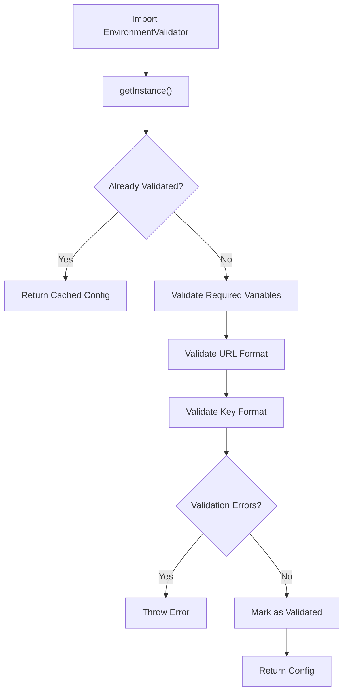
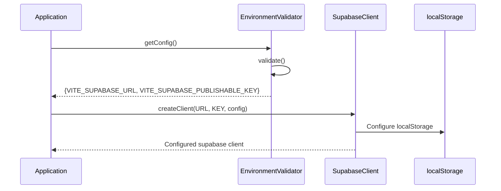
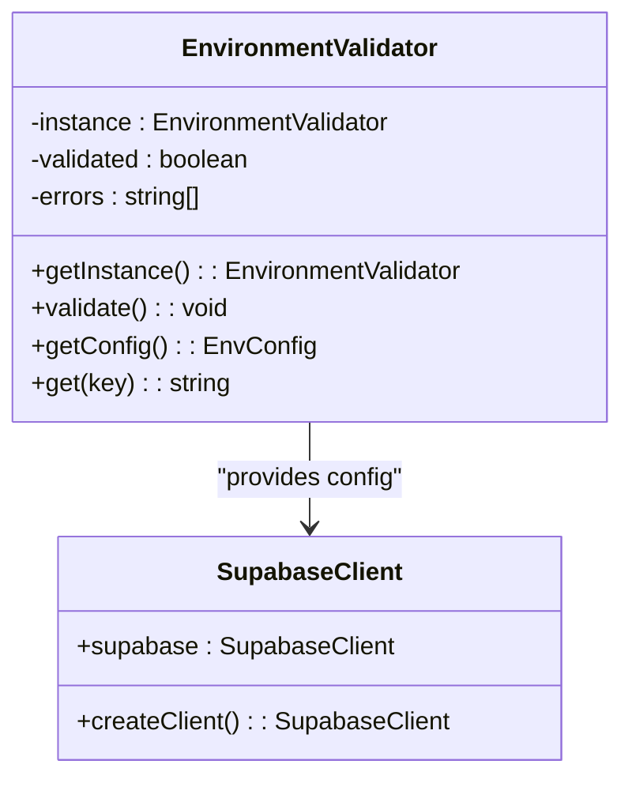
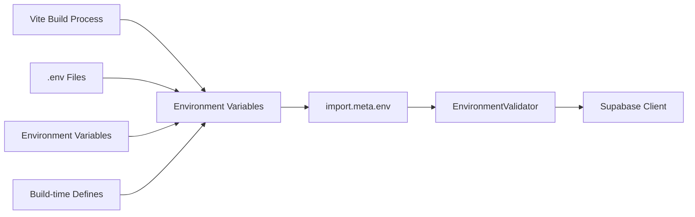
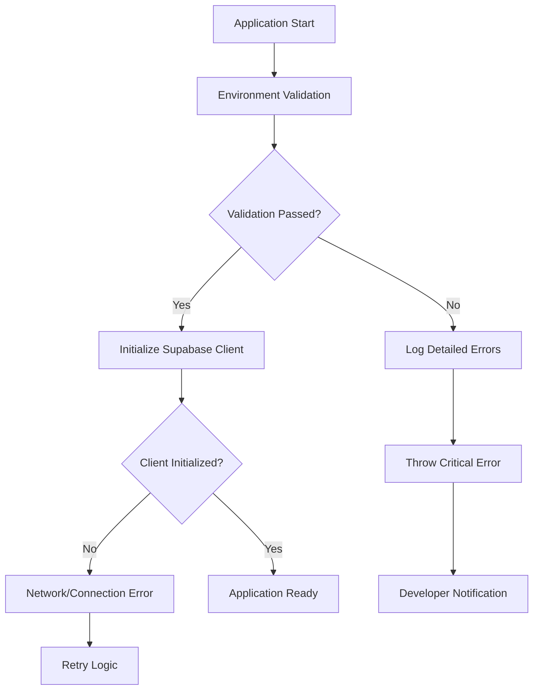
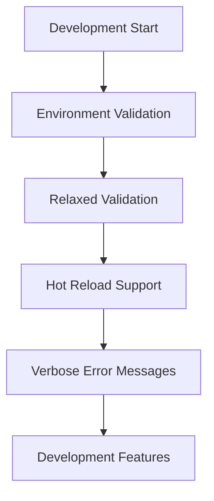
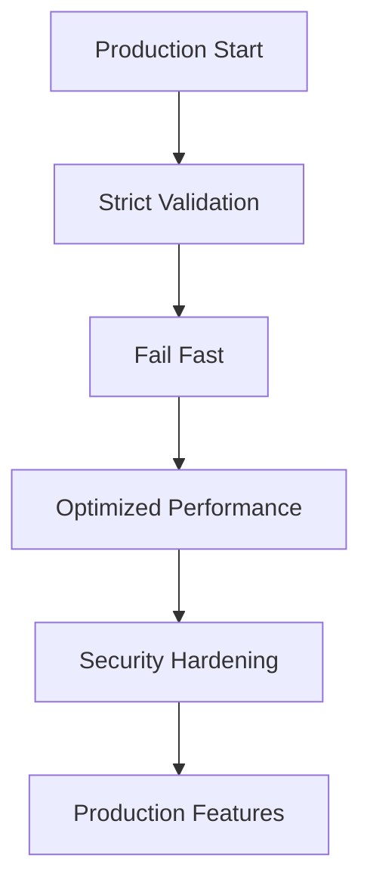
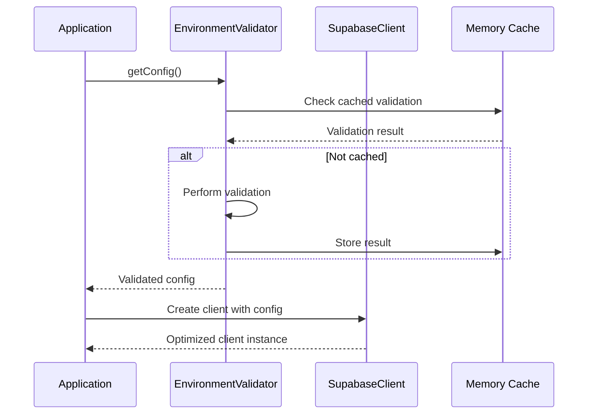

# Frontend Supabase Client Initialization

<cite>
**Referenced Files in This Document**
- [src/lib/env-validator.ts](file://src/lib/env-validator.ts)
- [src/integrations/supabase/client.ts](file://src/integrations/supabase/client.ts)
- [src/integrations/supabase/types.ts](file://src/integrations/supabase/types.ts)
- [src/lib/supabaseHelpers.ts](file://src/lib/supabaseHelpers.ts)
- [vite.config.ts](file://vite.config.ts)
- [src/vite-env.d.ts](file://src/vite-env.d.ts)
- [src/main.tsx](file://src/main.tsx)
- [src/hooks/useAdminAuth.ts](file://src/hooks/useAdminAuth.ts)
- [src/components/auth/CustomerSignupForm.tsx](file://src/components/auth/CustomerSignupForm.tsx)
- [package.json](file://package.json)
</cite>

## Table of Contents
1. [Introduction](#introduction)
2. [Environment Variable System](#environment-variable-system)
3. [Centralized Environment Validation](#centralized-environment-validation)
4. [Supabase Client Configuration](#supabase-client-configuration)
5. [Singleton Pattern Implementation](#singleton-pattern-implementation)
6. [Integration with Vite's Environment System](#integration-with-vites-environment-system)
7. [Security Considerations](#security-considerations)
8. [Practical Usage Examples](#practical-usage-examples)
9. [Error Handling and Troubleshooting](#error-handling-and-troubleshooting)
10. [Development vs Production Behavior](#development-vs-production-behavior)
11. [Performance Optimization](#performance-optimization)
12. [Best Practices](#best-practices)

## Introduction

The sleekapp-v100 frontend implements a sophisticated Supabase client initialization system that combines robust environment validation, type safety, and optimal configuration for both development and production environments. This system ensures secure, reliable database connectivity while maintaining excellent developer experience and performance characteristics.

The initialization process follows enterprise-grade patterns including singleton client management, comprehensive validation, and automatic error detection. The system integrates seamlessly with Vite's environment variable system and provides extensive type safety through generated TypeScript definitions.

## Environment Variable System

The application uses Vite's environment variable system combined with a centralized validation mechanism to manage Supabase configuration. Environment variables are prefixed with `VITE_` to ensure they are exposed to the client-side application.

### Required Environment Variables

The system validates two critical environment variables:

| Variable | Purpose | Validation |
|----------|---------|------------|
| `VITE_SUPABASE_URL` | Supabase project URL | URL format validation, required field |
| `VITE_SUPABASE_PUBLISHABLE_KEY` | Public API key | Length validation (>20 characters), required field |

### Environment Variable Definition

The environment variables are defined in the Vite configuration and can be overridden through various methods:

```typescript
// Vite configuration defines default values
define: {
  'import.meta.env.VITE_SUPABASE_URL': JSON.stringify(process.env.VITE_SUPABASE_URL ?? 'https://eqpftggctumujhutomom.supabase.co'),
  'import.meta.env.VITE_SUPABASE_PUBLISHABLE_KEY': JSON.stringify(process.env.VITE_SUPABASE_PUBLISHABLE_KEY ?? 'eyJhbGciOiJIUzI1NiIsInR5cCI6IkpXVCJ9...')
}
```

**Section sources**
- [vite.config.ts](file://vite.config.ts#L80-L82)

## Centralized Environment Validation

The `EnvironmentValidator` class provides comprehensive validation for Supabase environment variables using a singleton pattern. This centralized approach ensures consistent validation across the entire application.

### Validation Features



**Diagram sources**
- [src/lib/env-validator.ts](file://src/lib/env-validator.ts#L29-L48)

### Validation Process

The validation system performs multiple checks:

1. **Required Field Validation**: Ensures both `VITE_SUPABASE_URL` and `VITE_SUPABASE_PUBLISHABLE_KEY` are present
2. **URL Format Validation**: Uses native URL constructor to validate the Supabase URL format
3. **Key Length Validation**: Verifies publishable keys meet minimum length requirements
4. **Error Aggregation**: Collects all validation errors before reporting

### Runtime Validation Control

The validator automatically validates in production environments but allows bypassing in development for testing purposes:

```typescript
// Auto-validation in production
if (import.meta.env.PROD) {
  try {
    env.validate();
  } catch (error) {
    console.error('Critical: Environment validation failed', error);
    throw error;
  }
}
```

**Section sources**
- [src/lib/env-validator.ts](file://src/lib/env-validator.ts#L133-L142)

## Supabase Client Configuration

The Supabase client is configured with optimal settings for session management, token handling, and local storage persistence.

### Client Creation Process



**Diagram sources**
- [src/integrations/supabase/client.ts](file://src/integrations/supabase/client.ts#L14-L20)

### Configuration Options

The client is configured with the following key settings:

| Option | Value | Purpose |
|--------|-------|---------|
| `storage` | `localStorage` | Persistent session storage |
| `persistSession` | `true` | Automatically restore sessions |
| `autoRefreshToken` | `true` | Automatic token refresh |

### Type Safety Integration

The client is strongly typed using the generated database schema:

```typescript
export const supabase = createClient<Database>(SUPABASE_URL, SUPABASE_PUBLISHABLE_KEY, {
  // Configuration...
})
```

**Section sources**
- [src/integrations/supabase/client.ts](file://src/integrations/supabase/client.ts#L14-L20)

## Singleton Pattern Implementation

The Supabase client follows a singleton pattern to ensure consistent state management and optimal performance across the application.

### Singleton Architecture



**Diagram sources**
- [src/lib/env-validator.ts](file://src/lib/env-validator.ts#L18-L23)
- [src/integrations/supabase/client.ts](file://src/integrations/supabase/client.ts#L14-L20)

### Benefits of Singleton Pattern

1. **Memory Efficiency**: Single client instance reduces memory footprint
2. **State Consistency**: Maintains consistent authentication state
3. **Performance**: Eliminates redundant client creation overhead
4. **Type Safety**: Centralized configuration management

**Section sources**
- [src/lib/env-validator.ts](file://src/lib/env-validator.ts#L18-L23)

## Integration with Vite's Environment System

The system seamlessly integrates with Vite's environment variable handling, providing both development convenience and production security.

### Vite Environment Integration



**Diagram sources**
- [vite.config.ts](file://vite.config.ts#L80-L82)
- [src/lib/env-validator.ts](file://src/lib/env-validator.ts#L58-L61)

### Environment Variable Precedence

The system follows this precedence order:

1. **Build-time defines** (highest priority)
2. **Environment variables** from system/runtime
3. **Default values** embedded in Vite config
4. **Fallback defaults** (hardcoded in code)

### Type Declarations

TypeScript declarations ensure compile-time safety:

```typescript
/// <reference types="vite/client" />
```

**Section sources**
- [src/vite-env.d.ts](file://src/vite-env.d.ts#L1-L2)
- [vite.config.ts](file://vite.config.ts#L80-L82)

## Security Considerations

The system implements multiple security layers to protect sensitive Supabase credentials and ensure secure communication.

### Publishable Key Security

Publishable keys are designed to be publicly exposed but still require protection:

1. **Key Validation**: Minimum length verification prevents accidental exposure of secret keys
2. **Runtime Validation**: Comprehensive format checking during application startup
3. **Development Protection**: Environment-specific validation behavior

### Cross-Origin Request Security

The backend implements CORS validation to prevent unauthorized access:

```typescript
// Allowed origins for production
const allowedOrigins = [
  'https://sleekapparels.com',
  'https://www.sleekapparels.com',
  'http://localhost:5173',
  'lovableproject.com',
  'netlify.app',
  'vercel.app'
];
```

### Token Management Security

The client configuration includes security-focused token management:

- **Automatic Refresh**: Prevents session expiration during active use
- **Local Storage**: Secure session persistence with browser security
- **HTTPS Enforcement**: Requires encrypted connections for production

**Section sources**
- [src/lib/env-validator.ts](file://src/lib/env-validator.ts#L85-L89)

## Practical Usage Examples

The Supabase client is used throughout the application through standardized import patterns and helper functions.

### Basic Client Import

```typescript
// Standard import pattern
import { supabase } from '@/integrations/supabase/client';
```

### Authentication Usage

```typescript
// Authentication example from useAdminAuth hook
const checkAdminStatus = async () => {
  try {
    const { data: { session } } = await supabase.auth.getSession();
    
    if (!session?.user) {
      setIsAdmin(false);
      return;
    }
    
    // Server-side admin validation
    const { data, error } = await supabase.functions.invoke('admin-check', {
      headers: {
        Authorization: `Bearer ${session.access_token}`,
      },
    });
  } catch (error) {
    console.error('Error checking admin status:', error);
    setIsAdmin(false);
  }
};
```

### Database Operations

```typescript
// Type-safe database operations using helpers
const { data: orders, error } = await orderHelpers.getByBuyerId(userId);

// Generic query builder
const { data, error } = await queryTable<Order>('orders')
  .select('*')
  .eq('buyer_id', userId);
```

### Form Submission Example

```typescript
// Customer signup form demonstrates client usage
const handleSubmit = async (e: React.FormEvent) => {
  e.preventDefault();
  
  // Supabase client usage for authentication
  const { data: { session }, error: authError } = await supabase.auth.signInWithPassword({
    email: formData.email,
    password: formData.password,
  });
};
```

**Section sources**
- [src/hooks/useAdminAuth.ts](file://src/hooks/useAdminAuth.ts#L15-L46)
- [src/components/auth/CustomerSignupForm.tsx](file://src/components/auth/CustomerSignupForm.tsx#L42-L46)

## Error Handling and Troubleshooting

The system provides comprehensive error handling and troubleshooting capabilities for common Supabase initialization issues.

### Common Error Scenarios

| Error Type | Symptoms | Resolution |
|------------|----------|------------|
| Missing Environment Variables | Application fails to start | Verify `.env` file or environment setup |
| Invalid URL Format | Network errors during initialization | Check Supabase project URL |
| Short Publishable Key | Validation failure | Use correct publishable key from Supabase dashboard |
| CORS Issues | Authentication failures | Verify allowed origins in Supabase dashboard |

### Error Detection Flow



**Diagram sources**
- [src/lib/env-validator.ts](file://src/lib/env-validator.ts#L44-L48)

### Development Mode Behavior

During development, the system provides enhanced error visibility:

```typescript
// Development-friendly error messages
console.error('Environment validation failed:\n❌ Missing required environment variable: VITE_SUPABASE_URL\n❌ Invalid URL format for VITE_SUPABASE_URL: invalid-url');
```

### Production Mode Behavior

In production, the system enforces strict validation and fails fast:

```typescript
// Production validation with immediate failure
if (import.meta.env.PROD) {
  try {
    env.validate();
  } catch (error) {
    console.error('Critical: Environment validation failed', error);
    throw error; // Fail fast in production
  }
}
```

**Section sources**
- [src/lib/env-validator.ts](file://src/lib/env-validator.ts#L44-L48)
- [src/lib/env-validator.ts](file://src/lib/env-validator.ts#L133-L142)

## Development vs Production Behavior

The system exhibits different behaviors in development and production environments to balance security, performance, and developer experience.

### Development Environment



**Characteristics:**
- Relaxed validation for easier development
- Hot reload support without restart
- Detailed error messages for debugging
- Localhost origin allowance

### Production Environment



**Characteristics:**
- Strict validation with immediate failure
- Performance optimizations enabled
- Security hardening enforced
- Minimal error information to prevent information leakage

### Environment-Specific Configurations

| Aspect | Development | Production |
|--------|-------------|------------|
| Validation | Relaxed, detailed errors | Strict, fail fast |
| Origin Checking | Allow localhost | Strict origin validation |
| Error Messages | Verbose | Minimal |
| Performance | Development optimizations | Production optimizations |

**Section sources**
- [src/lib/env-validator.ts](file://src/lib/env-validator.ts#L118-L127)
- [src/lib/env-validator.ts](file://src/lib/env-validator.ts#L133-L142)

## Performance Optimization

The system implements several performance optimization strategies to ensure efficient Supabase client operation.

### Client Initialization Optimization



**Diagram sources**
- [src/lib/env-validator.ts](file://src/lib/env-validator.ts#L94-L102)

### Memory Management

1. **Singleton Pattern**: Single client instance prevents memory leaks
2. **Lazy Initialization**: Client created only when needed
3. **Validation Caching**: Results cached to avoid repeated validation
4. **TypeScript Optimization**: Compile-time type checking reduces runtime overhead

### Network Optimization

1. **Automatic Token Refresh**: Prevents unnecessary re-authentication
2. **Session Persistence**: Reduces login frequency
3. **Connection Pooling**: Efficient database connection management
4. **Request Batching**: Optimized database operations

**Section sources**
- [src/integrations/supabase/client.ts](file://src/integrations/supabase/client.ts#L14-L20)

## Best Practices

The system demonstrates several best practices for Supabase client initialization and management.

### Configuration Management

1. **Centralized Validation**: Single point of truth for environment configuration
2. **Type Safety**: Strong typing prevents runtime errors
3. **Environment Separation**: Clear distinction between development and production
4. **Graceful Degradation**: Fallback mechanisms for missing configurations

### Security Best Practices

1. **Publishable Key Validation**: Format and length checking
2. **Origin Validation**: CORS protection for production
3. **HTTPS Enforcement**: Secure communication requirement
4. **Minimal Exposure**: Public keys only, no secret keys in client

### Development Experience

1. **Hot Reload Support**: Seamless development workflow
2. **Error Reporting**: Detailed error messages for debugging
3. **Type Safety**: Compile-time error detection
4. **Performance Monitoring**: Built-in performance tracking

### Production Deployment

1. **Fail-Fast Validation**: Immediate detection of configuration issues
2. **Security Hardening**: Strict security enforcement
3. **Performance Optimization**: Production-ready configurations
4. **Monitoring Integration**: Built-in observability features

### Code Organization

1. **Separation of Concerns**: Clear boundaries between validation and client
2. **Singleton Pattern**: Consistent client management
3. **Helper Functions**: Type-safe database operations
4. **Error Handling**: Comprehensive error management

**Section sources**
- [src/lib/env-validator.ts](file://src/lib/env-validator.ts#L1-L143)
- [src/integrations/supabase/client.ts](file://src/integrations/supabase/client.ts#L1-L20)
- [src/lib/supabaseHelpers.ts](file://src/lib/supabaseHelpers.ts#L1-L376)