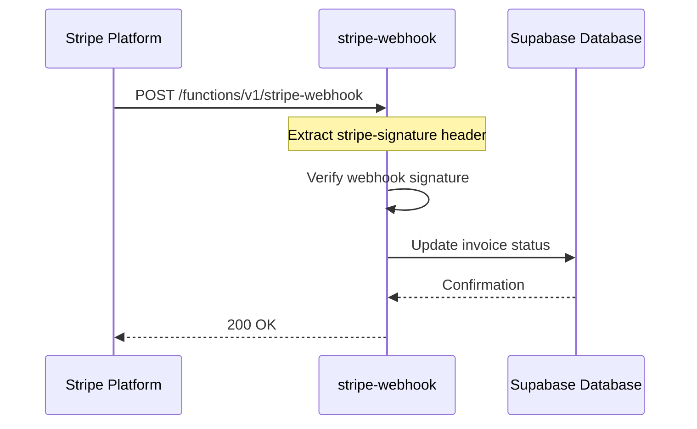
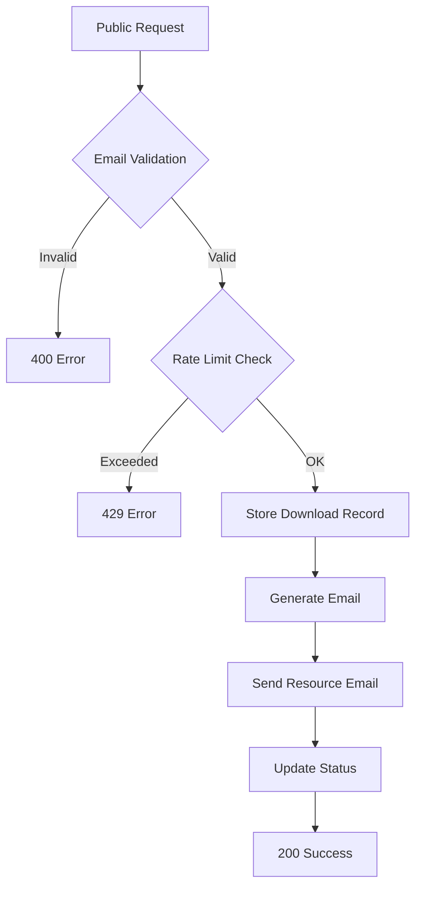
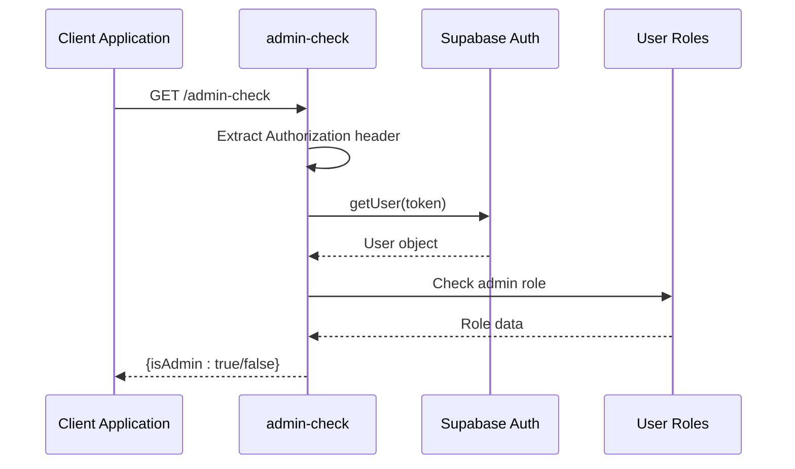

# Supabase Function Configuration

<cite>
**Referenced Files in This Document**
- [config.toml](file://supabase/config.toml)
- [stripe-webhook/index.ts](file://supabase/functions/stripe-webhook/index.ts)
- [send-resource-email/index.ts](file://supabase/functions/send-resource-email/index.ts)
- [admin-check/index.ts](file://supabase/functions/admin-check/index.ts)
- [initialize-production-stages/index.ts](file://supabase/functions/initialize-production-stages/index.ts)
- [ai-conversational-quote/index.ts](file://supabase/functions/ai-conversational-quote/index.ts)
- [ai-market-research/index.ts](file://supabase/functions/ai-market-research/index.ts)
- [submit-quote/index.ts](file://supabase/functions/submit-quote/index.ts)
- [log-audit-action/index.ts](file://supabase/functions/log-audit-action/index.ts)
- [auto-confirm-supplier/index.ts](file://supabase/functions/auto-confirm-supplier/index.ts)
- [resend-webhook/index.ts](file://supabase/functions/resend-webhook/index.ts)
- [submit-blog-comment/index.ts](file://supabase/functions/submit-blog-comment/index.ts)
</cite>

## Table of Contents
1. [Introduction](#introduction)
2. [JWT Verification Configuration Overview](#jwt-verification-configuration-overview)
3. [External Webhook Functions](#external-webhook-functions)
4. [AI and Public Submission Functions](#ai-and-public-submission-functions)
5. [Admin-Sensitive Functions](#admin-sensitive-functions)
6. [Security Rationale and Best Practices](#security-rationale-and-best-practices)
7. [Common Misconfigurations and Mitigation Strategies](#common-misconfigurations-and-mitigation-strategies)
8. [Implementation Patterns and Security Measures](#implementation-patterns-and-security-measures)
9. [Attack Surface Analysis](#attack-surface-analysis)
10. [Conclusion](#conclusion)

## Introduction

The sleekapp-v100 project implements a sophisticated Supabase Edge Functions architecture with carefully configured JWT verification settings that balance security requirements with functional necessity. This documentation examines the strategic decisions behind each function's JWT configuration in the `config.toml` file, explaining the security rationale, implementation patterns, and best practices employed throughout the system.

The configuration demonstrates a nuanced approach to API security, where functions requiring external system integration have `verify_jwt = false`, while administrative and sensitive operations maintain strict JWT verification. This design ensures that legitimate external integrations can function while protecting critical system operations from unauthorized access.

## JWT Verification Configuration Overview

The Supabase function configuration defines JWT verification settings across 35 different functions, organized into distinct categories based on their security requirements and integration patterns.

```mermaid
graph TB
subgraph "JWT Verification Configuration"
A[verify_jwt = false] --> B[External Webhooks]
A --> C[Public Submissions]
A --> D[AI Public APIs]
E[verify_jwt = true] --> F[Admin Operations]
E --> G[Sensitive Data Access]
E --> H[Critical System Functions]
end
subgraph "Function Categories"
B --> B1[stripe-webhook]
B --> B2[resend-webhook]
B --> B3[track-product-interaction]
B --> B4[submit-blog-comment]
B --> B5[ai-market-research]
B --> B6[ai-conversational-quote]
C --> C1[send-resource-email]
C --> C2[submit-quote]
D --> D1[ai-design-generator]
D --> D2[ai-blog-assistant]
F --> F1[admin-check]
F --> F2[log-audit-action]
F --> F3[bootstrap-admin]
G --> G1[wishlist-*]
G --> G2[generate-invoice]
G --> G3[create-payment-intent]
H --> H1[initialize-production-stages]
H --> H2[execute-automation-rules]
H --> H3[predict-quality-risks]
end
```



**Diagram sources**
- [config.toml](file://supabase/config.toml#L1-L73)

**Section sources**
- [config.toml](file://supabase/config.toml#L1-L73)

## External Webhook Functions

### Stripe Webhook Configuration

The `stripe-webhook` function serves as a critical payment processing endpoint that receives real-time notifications from Stripe's payment system. Its `verify_jwt = false` configuration enables external systems to invoke this endpoint without requiring Supabase authentication tokens.

#### Security Implementation

Despite the lack of JWT verification, the function implements robust security measures:

1. **Signature Verification**: Uses Stripe's native webhook signature verification to ensure message authenticity
2. **Secret Key Management**: Validates against stored Stripe webhook secrets
3. **Event Type Handling**: Processes specific payment events with appropriate business logic
4. **Database Operations**: Executes updates using service role keys for secure database access



**Diagram sources**
- [stripe-webhook/index.ts](file://supabase/functions/stripe-webhook/index.ts#L15-L113)

#### Security Rationale

The `verify_jwt = false` setting is justified because:
- **External System Requirement**: Stripe requires webhook endpoints to be publicly accessible
- **Signature-Based Authentication**: Stripe's webhook signature provides equivalent security
- **Limited Attack Surface**: Function only processes payment events, not user data
- **Idempotent Operations**: Duplicate processing doesn't cause harm

### Resend Webhook Configuration

The `resend-webhook` function handles email delivery status notifications from Resend/Svix platforms, also configured with `verify_jwt = false`.

#### Signature-Based Security

Similar to Stripe webhooks, this function implements external signature verification:

1. **Svix Header Validation**: Verifies Svix-specific headers (svix-id, svix-timestamp, svix-signature)
2. **HMAC Verification**: Uses SHA-256 HMAC to validate webhook authenticity
3. **Event Processing**: Handles delivery status changes for email verification OTPs

**Section sources**
- [stripe-webhook/index.ts](file://supabase/functions/stripe-webhook/index.ts#L1-L114)
- [resend-webhook/index.ts](file://supabase/functions/resend-webhook/index.ts#L1-L118)

## AI and Public Submission Functions

### Resource Email Delivery System

The `send-resource-email` function enables public access to downloadable resources, configured with `verify_jwt = false` to support anonymous user interactions.

#### Comprehensive Security Measures

Despite public accessibility, this function implements multiple security layers:

1. **Email Validation**: Strict email format validation with disposable email detection
2. **Rate Limiting**: IP-based and email-based rate limiting (3 downloads per day)
3. **Input Sanitization**: Comprehensive input validation and sanitization
4. **CORS Protection**: Wildcard CORS headers with proper content-type restrictions
5. **Audit Logging**: Complete request tracking for monitoring and debugging



**Diagram sources**
- [send-resource-email/index.ts](file://supabase/functions/send-resource-email/index.ts#L66-L231)

#### Security Rationale

The `verify_jwt = false` configuration supports:
- **Public Accessibility**: Anonymous users can access marketing resources
- **Marketing Purpose**: Facilitates lead generation and content distribution
- **Rate Limiting Defense**: Prevents abuse through multiple security layers
- **Non-Sensitive Data**: Resources are publicly available information

### AI Conversational Quote Generation

The `ai-conversational-quote` function provides AI-powered quote generation with `verify_jwt = false`, enabling public access to AI capabilities.

#### Multi-Layer Security Implementation

This function combines public accessibility with comprehensive security measures:

1. **IP Rate Limiting**: 5 requests per hour per IP address
2. **Email Rate Limiting**: 10 requests per day per email address
3. **Origin Validation**: Production environments restrict allowed origins
4. **Market Research Integration**: Calls internal AI functions with service role
5. **Session Binding**: Links quote requests to user sessions for time-limited access

**Section sources**
- [send-resource-email/index.ts](file://supabase/functions/send-resource-email/index.ts#L1-L232)
- [ai-conversational-quote/index.ts](file://supabase/functions/ai-conversational-quote/index.ts#L1-L325)

## Admin-Sensitive Functions

### Administrative Access Control

The `admin-check` function implements JWT verification (`verify_jwt = true`) to ensure only authenticated administrators can access administrative endpoints.

#### JWT Validation Implementation

The function performs comprehensive JWT validation:

1. **Authorization Header Extraction**: Retrieves Bearer token from request headers
2. **Supabase Client Authentication**: Uses extracted token for user validation
3. **Role Verification**: Checks user_roles table for 'admin' role assignment
4. **Service Role Fallback**: Maintains security even during development



**Diagram sources**
- [admin-check/index.ts](file://supabase/functions/admin-check/index.ts#L14-L73)

#### Security Rationale

The `verify_jwt = true` requirement ensures:
- **Authenticated Access**: Only logged-in users can access admin functions
- **Role-Based Permissions**: Additional layer beyond authentication
- **Audit Trail**: JWT provides traceable access logging
- **CSRF Protection**: Token-based authentication mitigates CSRF attacks

### Production Stage Initialization

The `initialize-production-stages` function requires JWT verification for sensitive production system operations.

#### Service Role Security

This function uses service role keys exclusively for database operations:

1. **Service Role Authentication**: Bypasses JWT verification for internal operations
2. **Template-Based Staging**: Creates production stages from predefined templates
3. **Default Fallback**: Generates default stages when templates unavailable
4. **Category Mapping**: Maps product types to appropriate production categories

**Section sources**
- [admin-check/index.ts](file://supabase/functions/admin-check/index.ts#L1-L74)
- [initialize-production-stages/index.ts](file://supabase/functions/initialize-production-stages/index.ts#L1-L133)

## Security Rationale and Best Practices

### Function-Level Security Policies

The configuration demonstrates several key security principles:

#### Principle 1: Least Privilege Access
- **External Functions**: Minimal permissions, focused on specific tasks
- **Admin Functions**: Full administrative privileges with JWT verification
- **AI Functions**: Public access with comprehensive rate limiting

#### Principle 2: Defense in Depth
Each function implements multiple security layers:
- **Authentication**: JWT verification or external signature validation
- **Authorization**: Role-based access control
- **Rate Limiting**: Protection against abuse
- **Input Validation**: Sanitization and validation of all inputs
- **Audit Logging**: Comprehensive tracking of all operations

#### Principle 3: Context-Aware Security
Security measures are tailored to function context:
- **Public APIs**: Focus on abuse prevention and data validation
- **Admin APIs**: Emphasis on authentication and authorization
- **Integration APIs**: Reliance on external authentication mechanisms

### CORS and Origin Validation

Functions implement varying CORS and origin validation strategies:

```mermaid
graph LR
A[CORS Configuration] --> B[Wildcard (*) for Public]
A --> C[Restricted Origins for Admin]
A --> D[Environment-Specific Validation]
B --> B1[Resource Downloads]
B --> B2[AI Functions]
B --> B3[Webhooks]
C --> C1[Admin Endpoints]
C --> C2[Sensitive Operations]
D --> D1[Development Mode]
D --> D2[Production Mode]
```

**Section sources**
- [submit-quote/index.ts](file://supabase/functions/submit-quote/index.ts#L50-L109)
- [ai-conversational-quote/index.ts](file://supabase/functions/ai-conversational-quote/index.ts#L168-L206)

## Common Misconfigurations and Mitigation Strategies

### Accidental Exposure Prevention

#### Problem: Admin Function Public Exposure
**Scenario**: An admin function accidentally set to `verify_jwt = false`

**Mitigation Strategy**:
1. **Regular Security Audits**: Periodic review of JWT configurations
2. **Automated Monitoring**: Alert on unexpected function access patterns
3. **Principle of Least Privilege**: Default to JWT verification enabled
4. **Code Review Standards**: Mandatory security review for function configurations

#### Solution Implementation
```typescript
// Example security validation pattern
function validateAdminAccess(req: Request, functionName: string) {
  const authHeader = req.headers.get('authorization');
  if (!authHeader) {
    throw new Error(`${functionName}: Missing authorization`);
  }
  
  // Additional validation logic here
}
```

### Webhook Security Hardening

#### Problem: Insufficient Webhook Verification
**Scenario**: Webhook functions without proper signature validation

**Mitigation Strategy**:
1. **Signature Verification**: Always implement external signature validation
2. **Secret Rotation**: Regular rotation of webhook secrets
3. **Endpoint Monitoring**: Track webhook endpoint usage patterns
4. **Rate Limiting**: Protect against webhook spam attacks

#### Implementation Pattern
```typescript
// Webhook signature validation pattern
async function validateWebhookSignature(
  req: Request, 
  secret: string,
  signatureHeader: string
): Promise<boolean> {
  const body = await req.text();
  const expectedSignature = createHmac('sha256', secret)
    .update(`${signatureHeader}.${body}`)
    .digest('base64');
    
  return signature === expectedSignature;
}
```

### Rate Limiting Best Practices

#### Problem: Inadequate Rate Limiting
**Scenario**: Public functions without proper rate limiting

**Mitigation Strategy**:
1. **Multi-Level Rate Limiting**: IP-based and user-based limits
2. **Sliding Window**: Implement sliding window algorithms
3. **Dynamic Adjustment**: Adjust limits based on usage patterns
4. **Graceful Degradation**: Inform users when limits are reached

#### Implementation Example
```typescript
// Rate limiting with sliding window
class SlidingWindowRateLimiter {
  private requests = new Map<string, number[]>();
  
  async isAllowed(key: string, maxRequests: number, timeWindowMs: number): Promise<boolean> {
    const now = Date.now();
    const windowStart = now - timeWindowMs;
    
    const requestTimes = this.requests.get(key) || [];
    const validRequests = requestTimes.filter(time => time > windowStart);
    
    if (validRequests.length >= maxRequests) {
      return false;
    }
    
    validRequests.push(now);
    this.requests.set(key, validRequests);
    return true;
  }
}
```

## Implementation Patterns and Security Measures

### Function Security Patterns

#### Pattern 1: Service Role Authentication
Functions requiring database access use service role keys:

```typescript
const supabase = createClient(
  Deno.env.get('SUPABASE_URL') ?? '',
  Deno.env.get('SUPABASE_SERVICE_ROLE_KEY') ?? ''
);
```

#### Pattern 2: JWT Validation with Fallback
Functions validate JWT tokens with graceful fallback:

```typescript
try {
  const { data: { user }, error: userError } = await supabaseClient.auth.getUser(token);
  if (userError || !user) {
    // Handle invalid token
  }
} catch (error) {
  // Graceful fallback
}
```

#### Pattern 3: Input Sanitization and Validation
Comprehensive input validation for all public-facing functions:

```typescript
// Email validation with regex
const emailRegex = /^[^\s@]+@[^\s@]+\.[^\s@]+$/;
if (!emailRegex.test(email)) {
  return new Response(
    JSON.stringify({ error: 'Invalid email format' }),
    { status: 400 }
  );
}
```

### Security Headers and CORS

#### Standard Security Headers
All functions implement consistent security headers:

```typescript
const corsHeaders = {
  'Access-Control-Allow-Origin': '*', // Or restricted origins
  'Access-Control-Allow-Headers': 'authorization, x-client-info, apikey, content-type',
};
```

#### Environment-Specific CORS
Production functions implement stricter CORS policies:

```typescript
const allowedOrigins = [
  'https://sleekapparels.com',
  'https://www.sleekapparels.com',
  'http://localhost:5173'
];

if (!isDevelopment && origin) {
  // Validate against allowed origins
}
```

**Section sources**
- [log-audit-action/index.ts](file://supabase/functions/log-audit-action/index.ts#L1-L97)
- [auto-confirm-supplier/index.ts](file://supabase/functions/auto-confirm-supplier/index.ts#L1-L148)
- [submit-blog-comment/index.ts](file://supabase/functions/submit-blog-comment/index.ts#L1-L129)

## Attack Surface Analysis

### High-Risk Attack Vectors

#### Vector 1: JWT Token Theft
**Impact**: Unauthorized access to protected functions
**Mitigation**: 
- Short-lived JWT tokens
- Secure token storage
- Regular token rotation
- HTTPS enforcement

#### Vector 2: Rate Limiting Bypass
**Impact**: Service disruption through excessive requests
**Mitigation**:
- Multiple rate limiting layers
- IP reputation scoring
- Behavioral analysis
- Dynamic limit adjustment

#### Vector 3: Webhook Abuse
**Impact**: Spam, data exfiltration, or system overload
**Mitigation**:
- Signature verification
- Secret rotation
- Endpoint monitoring
- Access logs

### Risk Assessment Matrix

| Function Category | Risk Level | Mitigation Priority | Primary Controls |
|-------------------|------------|---------------------|------------------|
| External Webhooks | Medium | High | Signature verification, secret rotation |
| Public AI APIs | Low | Medium | Rate limiting, input validation |
| Admin Functions | High | Critical | JWT verification, role checks |
| Resource Downloads | Low | Medium | Email validation, rate limiting |

### Security Monitoring

#### Key Metrics to Monitor
1. **Function Access Patterns**: Unusual access frequencies
2. **Error Rates**: Increased error rates may indicate attacks
3. **Response Times**: Abnormal response times
4. **Geographic Distribution**: Suspicious geographic patterns
5. **User Agent Analysis**: Bot detection

#### Alerting Thresholds
- **Rate Limit Exceeded**: Immediate notification
- **Invalid JWT Tokens**: Security incident alert
- **Unusual Function Access**: Investigation required
- **Webhook Failures**: System maintenance alert

## Conclusion

The sleekapp-v100 Supabase function configuration demonstrates a mature approach to API security that balances functionality requirements with security best practices. The strategic use of JWT verification settings creates clear security boundaries:

- **External webhooks** leverage external authentication mechanisms while maintaining robust signature verification
- **Public submission functions** implement comprehensive rate limiting and input validation
- **Admin-sensitive functions** maintain strict JWT verification with role-based access controls

This configuration serves as an excellent example of how to architect secure, scalable APIs that accommodate diverse integration requirements while protecting sensitive operations. The implementation patterns and security measures provide a solid foundation for building secure serverless applications with Supabase Edge Functions.

The careful consideration of attack surfaces, combined with defense-in-depth security measures, creates a resilient system capable of handling both legitimate business requirements and potential security threats. Regular security reviews and monitoring will ensure continued effectiveness as the system evolves.