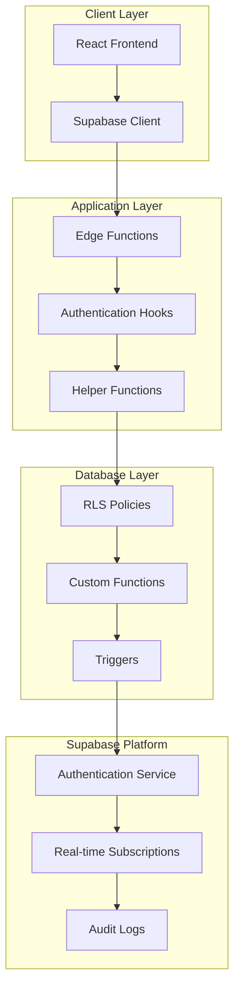
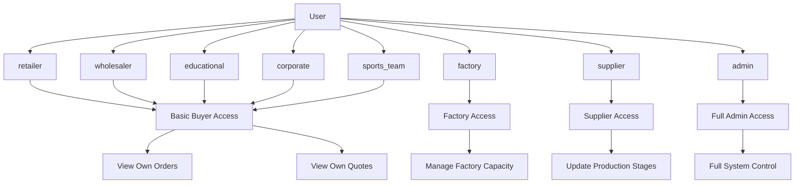

# Supabase Security and Access Control

<cite>
**Referenced Files in This Document**
- [COMPLETE_SETUP.sql](file://supabase/COMPLETE_SETUP.sql)
- [supabaseHelpers.ts](file://src/lib/supabaseHelpers.ts)
- [admin-check/index.ts](file://supabase/functions/admin-check/index.ts)
- [useAdminAuth.ts](file://src/hooks/useAdminAuth.ts)
- [bootstrap-admin/index.ts](file://supabase/functions/bootstrap-admin/index.ts)
- [log-audit-action/index.ts](file://supabase/functions/log-audit-action/index.ts)
- [enhancedAuditLog.ts](file://src/lib/enhancedAuditLog.ts)
- [client.ts](file://src/integrations/supabase/client.ts)
- [add_supplier_to_quotes.sql](file://supabase/migrations/add_supplier_to_quotes.sql)
- [TABLES_ONLY.sql](file://supabase/TABLES_ONLY.sql)
- [BASE_MIGRATION_SAFE.sql](file://supabase/BASE_MIGRATION_SAFE.sql)
</cite>

## Table of Contents
1. [Introduction](#introduction)
2. [Security Architecture Overview](#security-architecture-overview)
3. [Row-Level Security (RLS) Policies](#row-level-security-rls-policies)
4. [Role-Based Access Control Implementation](#role-based-access-control-implementation)
5. [Authentication and JWT Integration](#authentication-and-jwt-integration)
6. [Custom Role Management Functions](#custom-role-management-functions)
7. [Secure Query Patterns and Helper Functions](#secure-query-patterns-and-helper-functions)
8. [Real-Time Subscription Security](#real-time-subscription-security)
9. [Database Function Security](#database-function-security)
10. [Audit Logging and Monitoring](#audit-logging-and-monitoring)
11. [Security Best Practices](#security-best-practices)
12. [Troubleshooting and Maintenance](#troubleshooting-and-maintenance)

## Introduction

SleekApparels implements a comprehensive security framework built on Supabase's Row-Level Security (RLS) policies and custom role management system. The platform enforces strict access controls across multiple user roles including buyers, suppliers, and administrators, ensuring data isolation and compliance with business requirements.

The security model is designed around three core principles:
- **Principle of Least Privilege**: Users only access data necessary for their role
- **Defense in Depth**: Multiple security layers including database policies, application logic, and runtime checks
- **Auditability**: Comprehensive logging of all security-relevant actions

## Security Architecture Overview

The security architecture consists of multiple interconnected layers that work together to protect data and enforce access controls:



**Diagram sources**
- [client.ts](file://src/integrations/supabase/client.ts#L1-L20)
- [useAdminAuth.ts](file://src/hooks/useAdminAuth.ts#L1-L47)
- [admin-check/index.ts](file://supabase/functions/admin-check/index.ts#L1-L73)

## Row-Level Security (RLS) Policies

SleekApparels implements granular RLS policies across all major tables to ensure data isolation between different user roles.

### Core Tables with RLS Policies

The following tables implement comprehensive RLS policies:

| Table | Purpose | Security Level | Policy Examples |
|-------|---------|----------------|-----------------|
| `orders` | Order management | High | Buyers can view own orders, Admins can view all |
| `quotes` | Quote management | Medium | Users can view their own quotes, Suppliers see assigned quotes |
| `notifications` | User notifications | Medium | Users can only access their own notifications |
| `supplier_orders` | Supplier order tracking | High | Suppliers can only access orders assigned to them |
| `production_stages` | Manufacturing stages | High | Suppliers see stages for their assigned orders |
| `messages` | User communication | Medium | Users can only access messages they're involved in |

### Buyer Access Policies

Buyers have restricted access to orders and quotes they own:

```sql
-- Buyers can view their own orders
CREATE POLICY "Buyers can view their own orders"
ON public.orders FOR SELECT TO authenticated
USING ((buyer_id = auth.uid()));

-- Buyers can update their own orders  
CREATE POLICY "Buyers can update their own orders"
ON public.orders FOR UPDATE TO authenticated
USING ((buyer_id = auth.uid()));
```

### Supplier Access Policies

Suppliers have access to orders and production stages related to their assignments:

```sql
-- Suppliers can view their assigned orders
CREATE POLICY "Suppliers can view their assigned orders"
ON public.supplier_orders FOR SELECT TO authenticated
USING ((supplier_id IN ( SELECT suppliers.id
FROM public.suppliers
WHERE (suppliers.user_id = auth.uid()))));

-- Suppliers can update stages for their orders
CREATE POLICY "Suppliers can update stages for their orders"
ON public.production_stages FOR UPDATE TO authenticated
USING ((supplier_order_id IN ( SELECT so.id
FROM public.supplier_orders so
WHERE (so.supplier_id IN ( SELECT s.id
FROM public.suppliers s
WHERE (s.user_id = auth.uid()))))));
```

### Administrator Access Policies

Administrators have comprehensive access across all tables:

```sql
-- Admins can view all orders
CREATE POLICY "Admins can view all orders"
ON public.orders FOR SELECT USING (public.has_role(auth.uid(), 'admin'::public.app_role));

-- Admins can manage all supplier orders
CREATE POLICY "Admins can manage all supplier orders"
ON public.supplier_orders TO authenticated
USING (public.has_role(auth.uid(), 'admin'::public.app_role))
WITH CHECK (public.has_role(auth.uid(), 'admin'::public.app_role));
```

**Section sources**
- [COMPLETE_SETUP.sql](file://supabase/COMPLETE_SETUP.sql#L3743-L3744)
- [COMPLETE_SETUP.sql](file://supabase/COMPLETE_SETUP.sql#L4072-L4073)
- [COMPLETE_SETUP.sql](file://supabase/COMPLETE_SETUP.sql#L4377-L4378)
- [COMPLETE_SETUP.sql](file://supabase/COMPLETE_SETUP.sql#L4301-L4302)

## Role-Based Access Control Implementation

The platform implements a sophisticated role-based access control system using custom PostgreSQL functions and Supabase authentication.

### Role Types and Hierarchy



**Diagram sources**
- [TABLES_ONLY.sql](file://supabase/TABLES_ONLY.sql#L15-L24)
- [COMPLETE_SETUP.sql](file://supabase/COMPLETE_SETUP.sql#L128-L151)

### Role Management Functions

The system provides secure functions for role management:

#### has_role Function
The `has_role` function provides efficient role checking:

```sql
CREATE FUNCTION public.has_role(_user_id uuid, _role public.app_role) 
RETURNS boolean
LANGUAGE sql STABLE SECURITY DEFINER
SET search_path TO 'public'
AS $$
  SELECT EXISTS (
    SELECT 1
    FROM public.user_roles
    WHERE user_id = _user_id
      AND role = _role
  )
$$;
```

#### has_any_role Function
Allows checking multiple roles efficiently:

```sql
CREATE FUNCTION public.has_any_role(_user_id uuid, _roles public.app_role[])
RETURNS boolean
LANGUAGE sql STABLE SECURITY DEFINER
SET search_path TO 'public'
AS $$
  SELECT EXISTS (
    SELECT 1 
    FROM public.user_roles
    WHERE user_id = _user_id 
      AND role = ANY(_roles)
  )
$$;
```

### Role Assignment Security

Role assignment is tightly controlled through dedicated functions:

```sql
-- Admin-only role assignment
CREATE FUNCTION public.assign_user_role(target_user_id uuid, target_role public.app_role)
RETURNS void
LANGUAGE plpgsql SECURITY DEFINER
SET search_path TO 'public'
AS $$
BEGIN
  -- Only admins can assign roles
  IF NOT public.has_role(auth.uid(), 'admin') THEN
    RAISE EXCEPTION 'Unauthorized: Only admins can assign roles';
  END IF;
  
  -- Prevent admin role assignment through this function
  IF target_role = 'admin' THEN
    RAISE EXCEPTION 'Use assign_admin_role() function to assign admin role';
  END IF;
  
  -- Insert role with conflict resolution
  INSERT INTO public.user_roles (user_id, role)
  VALUES (target_user_id, target_role)
  ON CONFLICT (user_id, role) DO NOTHING;
END;
$$;
```

**Section sources**
- [COMPLETE_SETUP.sql](file://supabase/COMPLETE_SETUP.sql#L373-L403)
- [COMPLETE_SETUP.sql](file://supabase/COMPLETE_SETUP.sql#L137-L183)

## Authentication and JWT Integration

The platform integrates deeply with Supabase authentication, leveraging JWT claims and session management for secure access control.

### JWT Claim Validation

The system validates JWT claims to ensure secure access:

```typescript
// Example of JWT claim validation in edge functions
const { data: { user } } = await supabaseClient.auth.getUser(access_token);

if (!user) {
  return new Response(
    JSON.stringify({ error: 'Unauthorized - Invalid token' }),
    { status: 401, headers: { ...corsHeaders, 'Content-Type': 'application/json' } }
  );
}
```

### Session Management

The frontend implements robust session management:

```typescript
// Supabase client configuration with automatic token refresh
export const supabase = createClient<Database>(SUPABASE_URL, SUPABASE_PUBLISHABLE_KEY, {
  auth: {
    storage: localStorage,
    persistSession: true,
    autoRefreshToken: true,
  }
});
```

### Admin Authentication Hook

The `useAdminAuth` hook provides client-side admin validation:

```typescript
export const useAdminAuth = () => {
  const checkAdminStatus = async () => {
    try {
      const { data: { session } } = await supabase.auth.getSession();
      
      if (!session?.user) {
        setIsAdmin(false);
        return;
      }

      // Server-side admin validation using edge function
      const { data, error } = await supabase.functions.invoke('admin-check', {
        headers: {
          Authorization: `Bearer ${session.access_token}`,
        },
      });

      setIsAdmin(data?.isAdmin || false);
    } catch (error) {
      console.error('Error checking admin status:', error);
      setIsAdmin(false);
    }
  };
};
```

**Section sources**
- [client.ts](file://src/integrations/supabase/client.ts#L14-L20)
- [useAdminAuth.ts](file://src/hooks/useAdminAuth.ts#L15-L46)
- [admin-check/index.ts](file://supabase/functions/admin-check/index.ts#L44-L73)

## Custom Role Management Functions

The platform provides specialized functions for managing user roles and permissions securely.

### Bootstrap Admin Function

The bootstrap function provides secure initial admin setup:

```typescript
// Secure admin bootstrap with rate limiting and token validation
const ADMIN_BOOTSTRAP_TOKEN = Deno.env.get('ADMIN_BOOTSTRAP_TOKEN');
if (!ADMIN_BOOTSTRAP_TOKEN) {
  console.error('ADMIN_BOOTSTRAP_TOKEN not configured');
  return new Response(
    JSON.stringify({ error: 'Server configuration error' }),
    { headers: { 'Content-Type': 'application/json', ...corsHeaders }, status: 500 }
  );
}

// Constant-time token comparison to prevent timing attacks
let isValidToken = token.length === ADMIN_BOOTSTRAP_TOKEN.length;
for (let i = 0; i < token.length; i++) {
  isValidToken = isValidToken && (token.charCodeAt(i) === ADMIN_BOOTSTRAP_TOKEN.charCodeAt(i));
}
```

### Role Assignment Security

The system implements multiple security layers for role assignment:

```sql
-- Function-level security with role validation
CREATE FUNCTION public.assign_admin_role(target_user_id uuid)
RETURNS void
LANGUAGE plpgsql SECURITY DEFINER
SET search_path TO 'public'
AS $$
BEGIN
  -- Only existing admins can assign admin role
  IF NOT public.has_role(auth.uid(), 'admin') THEN
    RAISE EXCEPTION 'Unauthorized: Only admins can assign admin role';
  END IF;

  -- Verify target user exists
  IF NOT EXISTS (SELECT 1 FROM auth.users WHERE id = target_user_id) THEN
    RAISE EXCEPTION 'User not found';
  END IF;

  -- Insert admin role
  INSERT INTO public.user_roles (user_id, role)
  VALUES (target_user_id, 'admin'::public.app_role)
  ON CONFLICT (user_id, role) DO NOTHING;
END;
$$;
```

**Section sources**
- [bootstrap-admin/index.ts](file://supabase/functions/bootstrap-admin/index.ts#L60-L75)
- [bootstrap-admin/index.ts](file://supabase/functions/bootstrap-admin/index.ts#L133-L140)
- [COMPLETE_SETUP.sql](file://supabase/COMPLETE_SETUP.sql#L128-L151)

## Secure Query Patterns and Helper Functions

The platform implements type-safe helper functions that encapsulate secure query patterns and prevent SQL injection attacks.

### Type-Safe Query Builder

The `queryTable` function provides type-safe database queries:

```typescript
export const queryTable = <T>(tableName: string): any => {
  return (supabase as any).from(tableName) as any;
};
```

### Order Management Helpers

Secure order query patterns are encapsulated in helper functions:

```typescript
export const orderHelpers = {
  async getByBuyerId(buyerId: string) {
    const { data, error } = await supabase
      .from('orders')
      .select('*')
      .eq('buyer_id', buyerId)
      .order('created_at', { ascending: false });
    return { data: data as Order[] | null, error };
  },

  async getWithRelations(orderId: string) {
    const { data, error } = await supabase
      .from('orders')
      .select(`
        *,
        supplier:suppliers(*),
        order_documents(*),
        order_messages(*),
        order_updates(*)
      `)
      .eq('id', orderId)
      .maybeSingle();
    return { data: data as any as OrderWithRelations | null, error };
  }
};
```

### Notification Management Helpers

Secure notification access patterns:

```typescript
export const notificationHelpers = {
  async getByUserId(userId: string) {
    const { data, error } = await supabase
      .from('notifications')
      .select('*')
      .eq('user_id', userId)
      .order('created_at', { ascending: false });
    return { data: data as UserNotification[] | null, error };
  },

  async markAsRead(notificationId: string) {
    const { data, error} = await supabase
      .from('notifications')
      .update({ read: true, read_at: new Date().toISOString() })
      .eq('id', notificationId)
      .select()
      .single();
    return { data: data as UserNotification | null, error };
  }
};
```

### Role Management Helpers

Secure role checking and assignment:

```typescript
export const roleHelpers = {
  async hasRole(userId: string, role: string) {
    const { data, error } = await supabase
      .from('user_roles')
      .select('role')
      .eq('user_id', userId)
      .eq('role', role as any)
      .maybeSingle();
    return { hasRole: !!data, error };
  },

  async assignRole(userId: string, role: string) {
    const { data, error } = await supabase
      .from('user_roles')
      .insert({ user_id: userId, role: role as any } as any)
      .select()
      .single();
    return { data: data as UserRole | null, error };
  }
};
```

**Section sources**
- [supabaseHelpers.ts](file://src/lib/supabaseHelpers.ts#L26-L376)

## Real-Time Subscription Security

Real-time subscriptions respect RLS policies to ensure clients only receive data they're authorized to access.

### Subscription Pattern

The platform implements secure real-time subscriptions that automatically respect RLS policies:

```typescript
// Example subscription pattern that respects RLS
const { data: { session } } = await supabase.auth.getSession();

if (session) {
  const channel = supabase
    .channel('orders')
    .on('postgres_changes', {
      event: 'INSERT',
      schema: 'public',
      table: 'orders'
    }, (payload) => {
      // Only clients with proper permissions will receive this event
      console.log('New order:', payload.new);
    })
    .subscribe();
}
```

### Message Security

Real-time messaging respects user boundaries:

```sql
-- Messages are automatically filtered by sender/recipient
CREATE POLICY "Users can view their messages"
ON public.messages
FOR SELECT USING (sender_id = auth.uid() OR recipient_id = auth.uid());
```

### Production Stage Updates

Production updates are scoped to authorized suppliers:

```sql
-- Suppliers only receive updates for their assigned orders
CREATE POLICY "Suppliers can view stages for their orders"
ON public.production_stages FOR SELECT TO authenticated
USING ((supplier_order_id IN ( SELECT so.id
FROM public.supplier_orders so
WHERE (so.supplier_id IN ( SELECT s.id
FROM public.suppliers s
WHERE (s.user_id = auth.uid()))))));
```

**Section sources**
- [COMPLETE_SETUP.sql](file://supabase/COMPLETE_SETUP.sql#L6893-L6911)

## Database Function Security

All database functions implement security best practices including proper security definer settings and search path isolation.

### Security Definer Functions

Functions are marked with `SECURITY DEFINER` to run with elevated privileges:

```sql
CREATE FUNCTION public.update_order_status(p_order_id uuid, p_new_status public.order_workflow_status, p_notes text DEFAULT NULL::text)
RETURNS void
LANGUAGE plpgsql SECURITY DEFINER
SET search_path = public
AS $$
DECLARE
  v_old_status order_workflow_status;
BEGIN
  -- Function runs with database owner privileges
  -- Only authenticated users can call this function
  SELECT workflow_status INTO v_old_status
  FROM orders WHERE id = p_order_id;
  
  UPDATE orders
  SET workflow_status = p_new_status,
      updated_at = now()
  WHERE id = p_order_id;
  
  -- Log status change
  INSERT INTO order_status_history (order_id, old_status, new_status, changed_by, notes)
  VALUES (p_order_id, v_old_status, p_new_status, auth.uid(), p_notes);
END;
$$;
```

### Search Path Isolation

Functions use explicit search path setting to prevent privilege escalation:

```sql
-- Prevents search path manipulation attacks
SET search_path = public;

CREATE FUNCTION public.log_admin_action(...)
RETURNS uuid
LANGUAGE plpgsql SECURITY DEFINER
SET search_path = public
AS $$
BEGIN
  -- Function executes with isolated search path
  INSERT INTO public.admin_audit_logs (...) VALUES (...);
  RETURN v_log_id;
END;
$$;
```

### Function Security Categories

| Function Category | Security Level | Examples |
|------------------|----------------|----------|
| Administrative | High | `assign_admin_role`, `remove_user_role` |
| Data Modification | Medium | `update_order_status`, `create_update_notification` |
| Utility | Low | `generate_invoice_number`, `calculate_factory_match_score` |
| Authentication | High | `handle_new_user`, `link_quote_requests_to_user` |

**Section sources**
- [COMPLETE_SETUP.sql](file://supabase/COMPLETE_SETUP.sql#L612-L633)
- [COMPLETE_SETUP.sql](file://supabase/COMPLETE_SETUP.sql#L689-L700)
- [COMPLETE_SETUP.sql](file://supabase/COMPLETE_SETUP.sql#L6236-L6270)

## Audit Logging and Monitoring

The platform implements comprehensive audit logging to track all security-relevant actions and monitor for suspicious activity.

### Edge Function Audit Logging

The audit logging system captures detailed information about administrative actions:

```typescript
export const logEnhancedAudit = async ({
  action,
  resourceType,
  resourceId,
  details = {},
  severity = 'info',
}: EnhancedAuditLogParams): Promise<void> => {
  try {
    const { data: { session } } = await supabase.auth.getSession();
    
    // For security events, log even without session
    const userId = session?.user?.id || null;
    
    // Call edge function for server-side logging with IP capture
    const { error } = await supabase.functions.invoke('log-audit-action', {
      body: {
        action,
        resource_type: resourceType,
        resource_id: resourceId || null,
        details: {
          ...details,
          severity,
          timestamp: new Date().toISOString(),
        },
        user_id: userId,
      },
    });
  } catch (error) {
    console.error('Error in audit logging:', error);
  }
};
```

### Audit Log Structure

Audit logs capture comprehensive information:

```typescript
interface AuditLogEntry {
  action: string;
  resource_type: string;
  resource_id: string | null;
  user_id: string | null;
  ip_address: string;
  user_agent: string;
  details: Record<string, any>;
  timestamp: string;
}
```

### Security Event Monitoring

The system monitors for security events:

```typescript
export const logSecurityEvent = async (
  action: Extract<EnhancedAuditAction, 'security_breach_detected' | 'suspicious_activity' | 'unauthorized_access_attempt' | 'rate_limit_exceeded'>,
  details: Record<string, any>
) => {
  // Log security events with high severity
  await logEnhancedAudit({
    action,
    resourceType: 'security_event',
    details: { ...details, severity: 'critical' },
  });
};
```

### Rate Limiting and Monitoring

The bootstrap function implements rate limiting to prevent brute force attacks:

```typescript
// Rate limiting for bootstrap attempts
const oneHourAgo = new Date(Date.now() - 3600000).toISOString();
const { data: recentAttempts } = await supabaseClient
  .from('bootstrap_attempts')
  .select('*')
  .eq('ip_address', clientIP)
  .gte('created_at', oneHourAgo);

if (recentAttempts && recentAttempts.length >= 3) {
  console.warn(`⚠️ SECURITY: Rate limit exceeded for bootstrap admin from IP: ${clientIP}`);
  return new Response(
    JSON.stringify({ error: 'Too many attempts. Try again in 1 hour.' }),
    { status: 429 }
  );
}
```

**Section sources**
- [enhancedAuditLog.ts](file://src/lib/enhancedAuditLog.ts#L100-L144)
- [log-audit-action/index.ts](file://supabase/functions/log-audit-action/index.ts#L40-L75)
- [bootstrap-admin/index.ts](file://supabase/functions/bootstrap-admin/index.ts#L33-L57)

## Security Best Practices

The platform implements numerous security best practices to ensure robust protection against common vulnerabilities.

### Principle of Least Privilege

Every access control decision follows the principle of least privilege:

```sql
-- Buyers can only access their own orders
CREATE POLICY "Buyers can view their own orders"
ON public.orders FOR SELECT TO authenticated
USING ((buyer_id = auth.uid()));

-- Suppliers can only access orders assigned to them
CREATE POLICY "Suppliers can view their assigned orders"
ON public.supplier_orders FOR SELECT TO authenticated
USING ((supplier_id IN ( SELECT suppliers.id
FROM public.suppliers
WHERE (suppliers.user_id = auth.uid()))));
```

### Defense in Depth

Multiple security layers protect against various attack vectors:

1. **Database Layer**: RLS policies and function security
2. **Application Layer**: Helper functions and validation
3. **Network Layer**: HTTPS and CORS configuration
4. **Runtime Layer**: Edge function validation

### Input Validation and Sanitization

All user inputs are validated at multiple levels:

```typescript
// Type-safe helper functions prevent SQL injection
export const orderHelpers = {
  async getByBuyerId(buyerId: string) {
    // Supabase automatically sanitizes inputs
    const { data, error } = await supabase
      .from('orders')
      .select('*')
      .eq('buyer_id', buyerId); // Automatic sanitization
    return { data, error };
  }
};
```

### Secure Defaults

The system implements secure defaults for all configurations:

```sql
-- Default row security off during migration
SET row_security = off;

-- Secure function definitions with explicit search paths
CREATE FUNCTION public.some_function()
RETURNS void
LANGUAGE plpgsql SECURITY DEFINER
SET search_path = public;
```

### Token Security

JWT tokens are handled securely:

```typescript
// Secure token validation with proper error handling
const { data: { user } } = await supabaseClient.auth.getUser(access_token);

if (!user) {
  return new Response(
    JSON.stringify({ error: 'Unauthorized - Invalid token' }),
    { status: 401 }
  );
}
```

**Section sources**
- [COMPLETE_SETUP.sql](file://supabase/COMPLETE_SETUP.sql#L4072-L4073)
- [COMPLETE_SETUP.sql](file://supabase/COMPLETE_SETUP.sql#L4377-L4378)
- [admin-check/index.ts](file://supabase/functions/admin-check/index.ts#L44-L73)

## Troubleshooting and Maintenance

### Common Security Issues

#### RLS Policy Conflicts

When RLS policies conflict, the most restrictive policy applies:

```sql
-- Check existing policies
SELECT * FROM pg_policies WHERE tablename = 'orders';

-- Debug policy evaluation
EXPLAIN ANALYZE
SELECT * FROM orders WHERE buyer_id = 'some-user-id';
```

#### Role Assignment Problems

Verify role assignments:

```sql
-- Check user roles
SELECT ur.*, u.email
FROM user_roles ur
JOIN auth.users u ON ur.user_id = u.id
WHERE u.email = 'user@example.com';

-- Verify role function works
SELECT public.has_role('user-id-here', 'admin'::public.app_role);
```

#### Function Security Issues

Check function security settings:

```sql
-- Verify function security
SELECT proname, proowner, prosecdefiner
FROM pg_proc
WHERE proname LIKE '%role%' OR proname LIKE '%admin%';

-- Check function search path
SELECT oid, proname, proargtypes, prosrc
FROM pg_proc
WHERE proname = 'assign_admin_role';
```

### Maintenance Tasks

#### Regular Security Audits

1. Review RLS policies monthly
2. Audit role assignments quarterly
3. Monitor audit logs weekly
4. Update security functions annually

#### Policy Updates

When adding new tables or columns:

```sql
-- Enable RLS on new table
ALTER TABLE new_table ENABLE ROW LEVEL SECURITY;

-- Add basic policies
CREATE POLICY "Users can view their own records"
ON new_table FOR SELECT TO authenticated
USING (user_id = auth.uid());

CREATE POLICY "Users can create their own records"
ON new_table FOR INSERT TO authenticated
WITH CHECK (user_id = auth.uid());
```

#### Function Security Updates

Ensure all new functions use proper security settings:

```sql
-- New functions should use SECURITY DEFINER
CREATE FUNCTION new_secure_function()
RETURNS void
LANGUAGE plpgsql SECURITY DEFINER
SET search_path = public;
```

### Monitoring and Alerting

Set up monitoring for security events:

```sql
-- Monitor failed admin attempts
CREATE VIEW admin_attempt_monitor AS
SELECT 
  ip_address,
  COUNT(*) as attempt_count,
  MAX(created_at) as last_attempt
FROM bootstrap_attempts
WHERE success = false
GROUP BY ip_address
HAVING COUNT(*) > 5;
```

**Section sources**
- [bootstrap-admin/index.ts](file://supabase/functions/bootstrap-admin/index.ts#L33-L57)
- [enhancedAuditLog.ts](file://src/lib/enhancedAuditLog.ts#L100-L144)