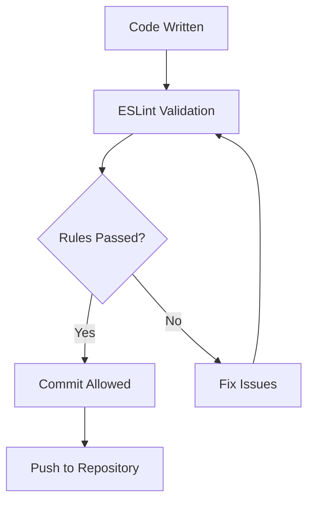
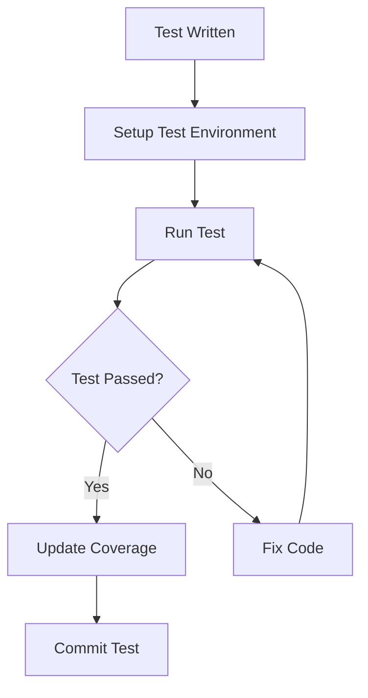
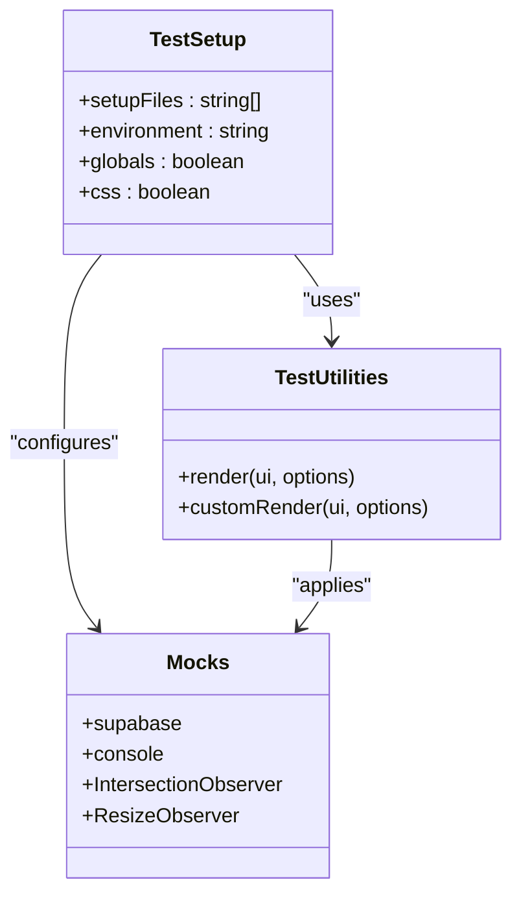
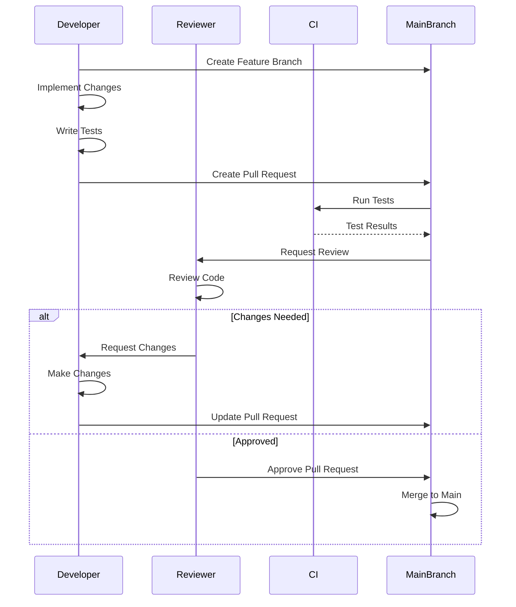
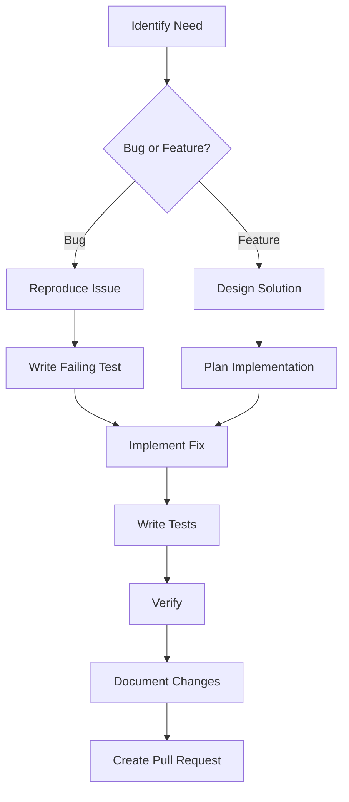
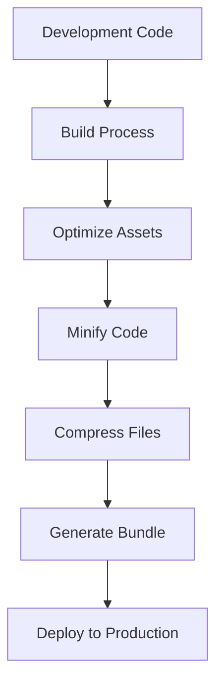

# Contributing Guidelines

<cite>
**Referenced Files in This Document**   
- [package.json](file://package.json)
- [eslint.config.js](file://eslint.config.js)
- [vitest.config.ts](file://vitest.config.ts)
- [vite.config.ts](file://vite.config.ts)
- [README.md](file://README.md)
- [src/test/setup.ts](file://src/test/setup.ts)
- [src/test/utils/test-utils.tsx](file://src/test/utils/test-utils.tsx)
- [src/hooks/__tests__/useAdminAuth.test.ts](file://src/hooks/__tests__/useAdminAuth.test.ts)
- [src/pages/__tests__/Auth.test.tsx](file://src/pages/__tests__/Auth.test.tsx)
</cite>

## Table of Contents
1. [Introduction](#introduction)
2. [Development Workflow](#development-workflow)
3. [Code Standards](#code-standards)
4. [Testing Requirements](#testing-requirements)
5. [Pull Request Process](#pull-request-process)
6. [Common Contribution Patterns](#common-contribution-patterns)
7. [Development Environment Setup](#development-environment-setup)
8. [Code Review Process](#code-review-process)
9. [Deployment Procedures](#deployment-procedures)
10. [Documentation and Accessibility](#documentation-and-accessibility)
11. [Common Issues and Solutions](#common-issues-and-solutions)
12. [Templates](#templates)

## Introduction

The contribution process for sleekapp-v100 is designed to maintain code quality, ensure consistent development practices, and facilitate collaboration among team members. This document outlines the complete workflow for contributing to the project, from setting up the development environment to deploying changes to production.

The contribution process is integral to project maintenance, ensuring that all code changes are properly reviewed, tested, and documented before being merged into the main codebase. This systematic approach helps prevent bugs, maintains code consistency, and ensures that the application remains stable and performant.

The project follows a modern React/TypeScript stack with Vite as the build tool, Supabase for backend services, and a comprehensive testing framework using Vitest. Contributions should adhere to the established patterns and practices to maintain consistency across the codebase.

**Section sources**
- [README.md](file://README.md#L316-L362)

## Development Workflow

The development workflow for sleekapp-v100 follows a structured process to ensure code quality and maintainability. Contributors should follow these steps when making changes to the codebase:

1. Create a feature branch from the main branch
2. Make changes and test locally
3. Commit with descriptive messages following conventional commit guidelines
4. Push changes to the repository
5. Create a pull request for review

The workflow is designed to be efficient while maintaining high standards for code quality. All changes must go through the pull request process, where they will be reviewed by other team members before being merged.

The project uses a component-based architecture with React, following the shadcn/ui design system. New components should follow the existing patterns and be placed in the appropriate directory within the src/components folder.

**Section sources**
- [README.md](file://README.md#L320-L324)

## Code Standards

### ESLint Configuration

The project enforces code quality through ESLint with a comprehensive configuration that ensures consistency and prevents common errors. The ESLint configuration is defined in eslint.config.js and includes rules for TypeScript, React hooks, and React refresh.

Key ESLint rules include:
- TypeScript type checking and unused variable warnings
- React Hooks exhaustive dependencies check
- React Refresh only export components rule
- Global browser environment definitions

The ESLint configuration extends the recommended rules from @eslint/js and typescript-eslint, with additional plugins for React Hooks and React Refresh. This ensures that all code adheres to best practices and maintains a consistent style across the codebase.



**Diagram sources**
- [eslint.config.js](file://eslint.config.js#L1-L28)

### TypeScript and React Patterns

The project uses TypeScript for type safety and React with functional components and hooks. All new code should use TypeScript interfaces and types to define component props and state.

Key patterns to follow:
- Use functional components with React Hooks
- Define TypeScript interfaces for component props
- Use React Query for data fetching and state management
- Follow the existing folder structure and naming conventions
- Use the established UI component library (shadcn/ui)

Components should be organized by feature in the src/components directory, with shared components in the shared subdirectory. Hooks should be placed in the src/hooks directory, with tests in the __tests__ subdirectory.

**Section sources**
- [package.json](file://package.json#L71-L73)
- [README.md](file://README.md#L60-L61)

## Testing Requirements

### Vitest Configuration

The project uses Vitest as the testing framework, configured in vitest.config.ts. The configuration includes:

- JSDOM environment for browser-like testing
- Global test setup from src/test/setup.ts
- Test coverage reporting with V8 provider
- CSS support for component testing
- Path aliases for easier imports

The test configuration is designed to provide a comprehensive testing environment that closely mimics the browser environment while maintaining fast test execution.



**Diagram sources**
- [vitest.config.ts](file://vitest.config.ts#L1-L29)

### Test Structure and Patterns

Tests are organized in __tests__ directories adjacent to the files they test. The project follows a comprehensive testing strategy that includes:

- Unit tests for individual components and functions
- Integration tests for component interactions
- Mocked API calls using Supabase mocks
- Utility functions for common test setup

The test setup includes mocks for Supabase, console methods, and browser APIs like IntersectionObserver and ResizeObserver. This ensures that tests are isolated and do not depend on external services.

Test utilities are provided in src/test/utils/test-utils.tsx, which includes a custom render function that wraps components with necessary providers like BrowserRouter and QueryClientProvider.



**Diagram sources**
- [src/test/setup.ts](file://src/test/setup.ts#L1-L43)
- [src/test/utils/test-utils.tsx](file://src/test/utils/test-utils.tsx#L1-L39)

### Example Test Cases

The project includes comprehensive test examples that demonstrate the expected testing patterns. For example, the useAdminAuth hook test (src/hooks/__tests__/useAdminAuth.test.ts) demonstrates:

- Mocking Supabase authentication and functions
- Testing different user roles and permissions
- Handling edge cases like expired sessions
- Verifying security practices

Similarly, the Auth component test (src/pages/__tests__/Auth.test.tsx) demonstrates:
- Testing login and signup flows
- Validating form inputs
- Testing OAuth integration
- Handling error cases

These tests follow the Arrange-Act-Assert pattern and use descriptive test names to clearly communicate their purpose.

**Section sources**
- [src/hooks/__tests__/useAdminAuth.test.ts](file://src/hooks/__tests__/useAdminAuth.test.ts#L1-L381)
- [src/pages/__tests__/Auth.test.tsx](file://src/pages/__tests__/Auth.test.tsx#L1-L460)

## Pull Request Process

The pull request process is a critical part of maintaining code quality and ensuring that all changes are properly reviewed before being merged into the main branch.

### Pull Request Requirements

All pull requests must include:
- A clear description of the changes and their purpose
- Reference to the issue being addressed (if applicable)
- Screenshots for UI changes (when applicable)
- Test coverage for new functionality
- Documentation updates for public APIs or user-facing features

Pull requests should be focused on a single feature or bug fix to make the review process more efficient. Large changes should be broken down into smaller, logical pull requests.

### Review Process

Pull requests are reviewed by at least one other team member. The review process includes:
- Code quality and adherence to project standards
- Test coverage and quality
- Performance implications
- Security considerations
- User experience and accessibility

Reviewers may request changes before approving the pull request. Once approved, the pull request can be merged into the main branch.



**Diagram sources**
- [README.md](file://README.md#L320-L324)

## Common Contribution Patterns

### Fixing a Bug

When fixing a bug, follow these steps:

1. Identify the issue and create a descriptive issue ticket if one doesn't exist
2. Create a feature branch from main
3. Write a test that reproduces the bug
4. Implement the fix
5. Verify the test passes
6. Update any relevant documentation
7. Create a pull request

Bug fixes should include a clear description of the problem, the steps to reproduce it, and how the fix resolves the issue.

### Adding a New Feature

When adding a new feature, follow these steps:

1. Discuss the feature with the team and create a detailed issue
2. Design the implementation, considering existing patterns
3. Create a feature branch from main
4. Implement the feature with appropriate tests
5. Document the feature in the README or relevant documentation
6. Create a pull request with a comprehensive description

New features should follow the existing architecture and design patterns. Components should be placed in the appropriate directory, and any new dependencies should be carefully considered.



**Diagram sources**
- [README.md](file://README.md#L316-L362)

## Development Environment Setup

### Prerequisites

Before contributing to the project, ensure you have the following installed:
- Node.js 18+
- npm
- Supabase account (for backend)
- Lovable account (for deployment)

### Local Development Setup

To set up the development environment:

1. Clone the repository
2. Navigate to the project directory
3. Install dependencies with `npm install`
4. Set up environment variables in .env.local:
   - VITE_SUPABASE_URL
   - VITE_SUPABASE_ANON_KEY
5. Start the development server with `npm run dev`

The application will run at http://localhost:5173.

### Scripts

The project includes several npm scripts for development:

- `dev`: Start the development server
- `build`: Build for production
- `build:dev`: Build for development
- `lint`: Run ESLint for code quality checking
- `preview`: Preview the production build

These scripts are defined in package.json and can be run with npm run [script-name].

**Section sources**
- [package.json](file://package.json#L6-L11)
- [README.md](file://README.md#L84-L113)

## Code Review Process

The code review process is designed to ensure code quality, share knowledge among team members, and maintain consistency across the codebase.

### Review Criteria

Code reviews should focus on:
- Code correctness and bug prevention
- Adherence to project standards and patterns
- Test coverage and quality
- Performance implications
- Security considerations
- Readability and maintainability
- User experience and accessibility

### Review Feedback

Reviewers should provide constructive feedback that is specific, actionable, and kind. Feedback should focus on the code, not the person. When requesting changes, reviewers should explain the reasoning behind their suggestions.

Developers should respond to review feedback promptly and make the requested changes. If there are disagreements about implementation approaches, the team should discuss them and reach a consensus.

**Section sources**
- [README.md](file://README.md#L320-L324)

## Deployment Procedures

### Deployment Options

The project can be deployed using two methods:

1. **Lovable (Recommended)**: Automatic deployment through the Lovable platform
2. **Manual Deployment**: Deploy to Vercel, Netlify, or other platforms

### Manual Deployment Steps

For manual deployment:

1. Build the application with `npm run build`
2. Deploy to the chosen platform
3. Set environment variables:
   - VITE_SUPABASE_URL
   - VITE_SUPABASE_ANON_KEY

The project includes configuration files for both Netlify (netlify.toml) and Vercel (vercel.json) to facilitate deployment.

### Production Build Configuration

The Vite configuration (vite.config.ts) includes optimizations for production builds:
- Code splitting and chunk optimization
- CSS and JavaScript minification
- Asset compression (gzip and brotli)
- Bundle analysis
- Console log removal

These optimizations ensure that the production build is as small and efficient as possible.



**Diagram sources**
- [vite.config.ts](file://vite.config.ts#L1-L216)
- [netlify.toml](file://netlify.toml#L1-L123)
- [vercel.json](file://vercel.json#L1-L6)

## Documentation and Accessibility

### Writing Documentation

All code contributions should be accompanied by appropriate documentation. This includes:

- JSDoc comments for complex functions and components
- README updates for new features
- Inline comments for non-obvious code
- Accessibility documentation for UI components

Documentation should be clear, concise, and accurate. It should explain not just what the code does, but why it does it and how it should be used.

### Maintaining Accessibility Standards

The project follows accessibility best practices to ensure that the application is usable by everyone. Key accessibility considerations include:

- Semantic HTML structure
- Proper ARIA attributes
- Keyboard navigation support
- Sufficient color contrast
- Screen reader compatibility
- Responsive design for different devices

UI components should be tested for accessibility using automated tools and manual testing.

**Section sources**
- [tailwind.config.ts](file://tailwind.config.ts#L1-L196)

## Common Issues and Solutions

### Development Environment Issues

**Issue**: ESLint errors on startup
**Solution**: Ensure you have the correct Node.js version (18+) and run `npm install` to install all dependencies.

**Issue**: Supabase connection errors
**Solution**: Verify that environment variables are correctly set in .env.local and that the Supabase project is properly configured.

### Testing Issues

**Issue**: Tests failing due to Supabase calls
**Solution**: Ensure that Supabase is properly mocked in the test setup. Check that the mock implementation matches the expected API.

**Issue**: JSDOM environment issues
**Solution**: Verify that the test environment is correctly configured in vitest.config.ts and that all necessary polyfills are included.

### Build Issues

**Issue**: Production build fails
**Solution**: Check for any TypeScript errors, ensure all dependencies are installed, and verify that environment variables are available during the build process.

**Issue**: Large bundle size
**Solution**: Use the bundle analyzer (available in the build output) to identify large dependencies and consider code splitting or alternative implementations.

**Section sources**
- [README.md](file://README.md#L303-L312)

## Templates

### Issue Reporting Template

```markdown
## Description
A clear and concise description of the issue.

## Steps to Reproduce
1. Go to '...'
2. Click on '....'
3. Scroll down to '....'
4. See error

## Expected Behavior
A clear and concise description of what you expected to happen.

## Actual Behavior
A clear and concise description of what actually happened.

## Screenshots
If applicable, add screenshots to help explain the problem.

## Environment
- OS: [e.g. iOS]
- Browser: [e.g. chrome, safari]
- Version: [e.g. 22]

## Additional Context
Add any other context about the problem here.
```

### Pull Request Template

```markdown
## Description
A clear and concise description of what this PR does.

## Related Issue
Closes #issue-number

## Type of Change
- [ ] Bug fix
- [ ] New feature
- [ ] Breaking change
- [ ] Documentation update

## How Has This Been Tested?
Describe the tests that you ran to verify your changes.

## Checklist
- [ ] My code follows the project's coding standards
- [ ] I have performed a self-review of my code
- [ ] I have commented my code, particularly in hard-to-understand areas
- [ ] I have made corresponding changes to the documentation
- [ ] My changes generate no new warnings
- [ ] I have added tests that prove my fix is effective or that my feature works
- [ ] New and existing unit tests pass locally with my changes
```

**Section sources**
- [README.md](file://README.md#L316-L362)