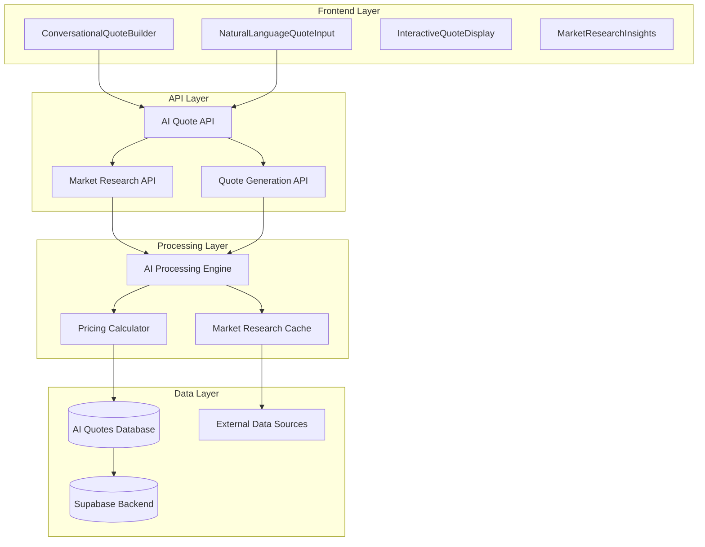
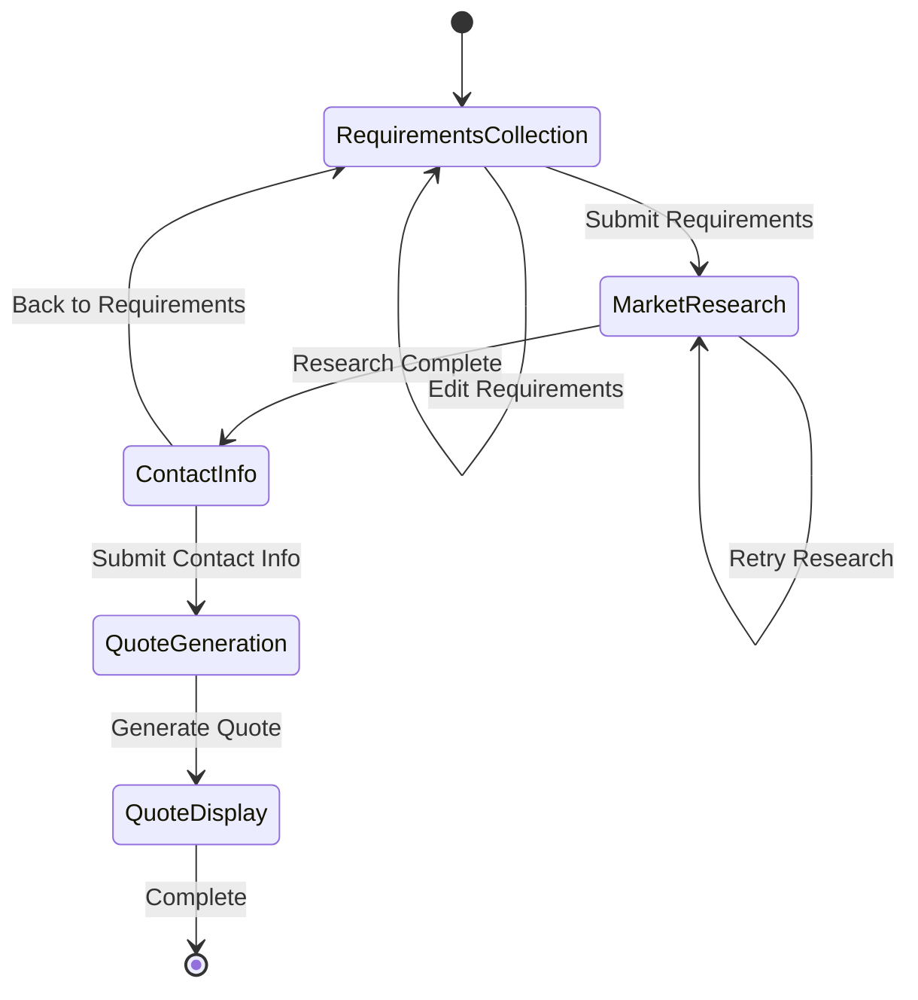
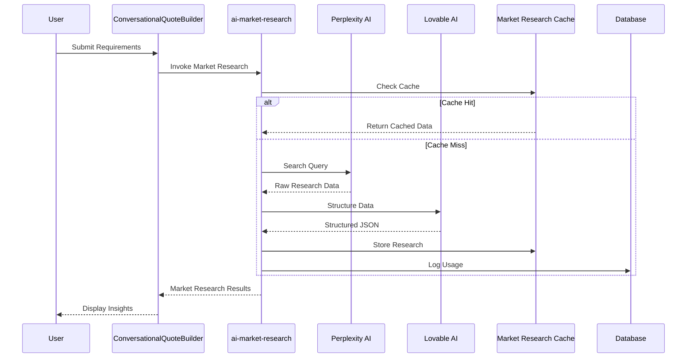
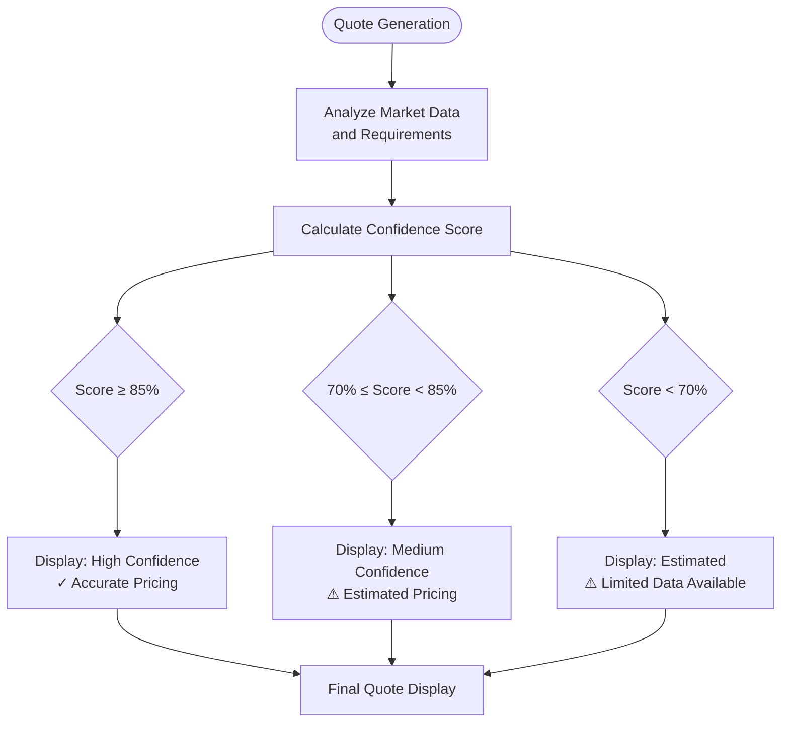
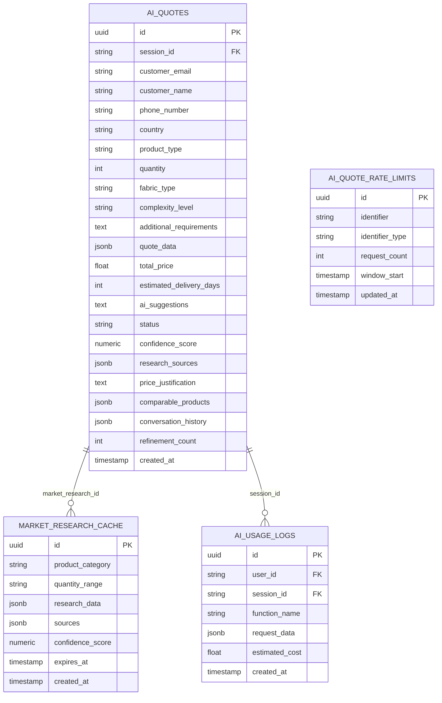
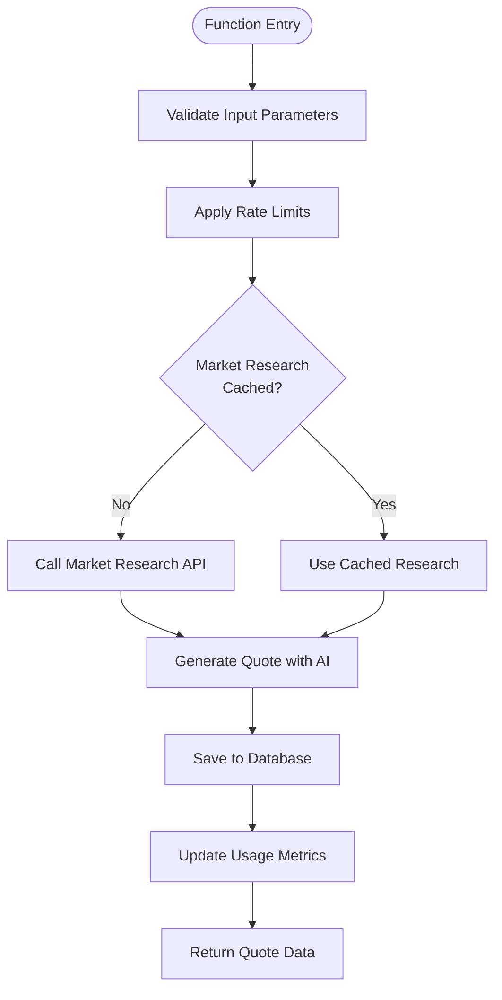
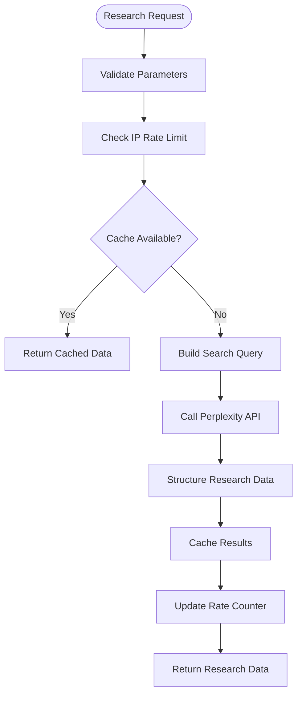
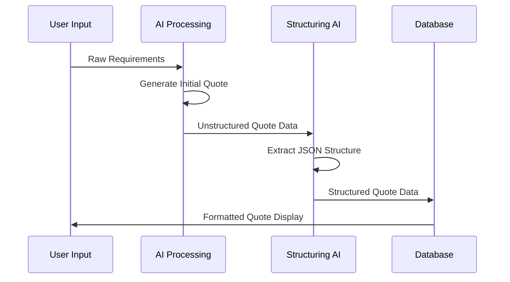

# AI Quote Generation System

<cite>
**Referenced Files in This Document**
- [ConversationalQuoteBuilder.tsx](file://src/components/quote/ConversationalQuoteBuilder.tsx)
- [AIQuoteGenerator.tsx](file://src/components/AIQuoteGenerator.tsx)
- [NaturalLanguageQuoteInput.tsx](file://src/components/quote/NaturalLanguageQuoteInput.tsx)
- [MarketResearchInsights.tsx](file://src/components/quote/MarketResearchInsights.tsx)
- [InteractiveQuoteDisplay.tsx](file://src/components/quote/InteractiveQuoteDisplay.tsx)
- [ai-conversational-quote/index.ts](file://supabase/functions/ai-conversational-quote/index.ts)
- [ai-market-research/index.ts](file://supabase/functions/ai-market-research/index.ts)
- [aiQuote.ts](file://src/lib/api/aiQuote.ts)
- [bangladeshManufacturing.ts](file://src/lib/bangladeshManufacturing.ts)
- [QuoteGenerator.tsx](file://src/pages/QuoteGenerator.tsx)
- [database.ts](file://src/types/database.ts)
</cite>

## Table of Contents
1. [Introduction](#introduction)
2. [System Architecture](#system-architecture)
3. [Core Components](#core-components)
4. [ConversationalQuoteBuilder Interface](#conversationalquotebuilder-interface)
5. [Market Research Integration](#market-research-integration)
6. [Confidence Scoring System](#confidence-scoring-system)
7. [Data Model](#data-model)
8. [Implementation Details](#implementation-details)
9. [Practical Examples](#practical-examples)
10. [Common Issues and Solutions](#common-issues-and-solutions)
11. [Technical Deep Dive](#technical-deep-dive)
12. [Conclusion](#conclusion)

## Introduction

The AI Quote Generation system transforms traditional Request for Quote (RFQ) processes into conversational interactions that capture complex requirements and deliver transparent, data-backed quotes. Built on a sophisticated architecture that combines real-time market research, AI-powered pricing algorithms, and confidence scoring, this system enables instant, market-researched pricing with up to 95% accuracy.

The system serves as a bridge between buyers seeking apparel manufacturing solutions and verified Bangladesh suppliers, providing immediate value through intelligent automation while maintaining human oversight for complex scenarios. It addresses the pain points of traditional quote generation by eliminating manual research, providing instant responses, and delivering actionable insights.

## System Architecture

The AI Quote Generation system follows a multi-layered architecture that separates concerns between frontend interaction, backend processing, and external data sources:

**Diagram sources**
- [ConversationalQuoteBuilder.tsx](file://src/components/quote/ConversationalQuoteBuilder.tsx#L43-L363)
- [ai-conversational-quote/index.ts](file://supabase/functions/ai-conversational-quote/index.ts#L23-L325)
- [ai-market-research/index.ts](file://supabase/functions/ai-market-research/index.ts#L17-L279)

## Core Components

The system consists of several interconnected components that work together to deliver seamless quote generation:

### Frontend Components

1. **ConversationalQuoteBuilder**: Main interface for collecting requirements and displaying results
2. **NaturalLanguageQuoteInput**: AI-powered requirement parsing from plain text descriptions
3. **MarketResearchInsights**: Visual presentation of market research data with confidence indicators
4. **InteractiveQuoteDisplay**: Comprehensive quote presentation with price breakdowns and comparisons

### Backend Functions

1. **ai-conversational-quote**: Main quote generation engine using Gemini 2.5 Pro
2. **ai-market-research**: Market data collection and analysis using Perplexity AI
3. **parse-quote-description**: Natural language processing for requirement extraction

### Supporting Systems

1. **Rate Limiting**: IP and email-based throttling to prevent abuse
2. **Caching**: Market research data caching for performance optimization
3. **Confidence Scoring**: Automated quality assessment of generated quotes

**Section sources**
- [ConversationalQuoteBuilder.tsx](file://src/components/quote/ConversationalQuoteBuilder.tsx#L43-L363)
- [NaturalLanguageQuoteInput.tsx](file://src/components/quote/NaturalLanguageQuoteInput.tsx#L22-L131)

## ConversationalQuoteBuilder Interface

The ConversationalQuoteBuilder serves as the primary user interface for the AI Quote Generation system, implementing a three-step conversational flow:

**Diagram sources**
- [ConversationalQuoteBuilder.tsx](file://src/components/quote/ConversationalQuoteBuilder.tsx#L43-L363)

### Step 1: Requirements Collection

The first step captures essential product information through an intuitive form interface:

- **Product Type**: Dropdown selection with 12+ apparel categories
- **Quantity**: Minimum 50 units with validation
- **Fabric Type**: Optional specification for material preferences
- **Complexity Level**: Simple, Medium, or Complex categorization
- **Additional Requirements**: Free-form text for special requests

### Step 2: Market Research Results

After submitting requirements, the system performs comprehensive market research:

- **Average Unit Cost**: Real-time pricing data from Bangladesh manufacturers
- **Material Costs**: Fabric-specific pricing calculations
- **Lead Times**: Production timeline estimates
- **Markup Percentages**: Industry-standard pricing adjustments
- **Comparable Products**: 3-5 similar products with pricing
- **Data Sources**: Verified links to original research sources

### Step 3: Final Quote Presentation

The third step presents the finalized quote with detailed breakdowns:

- **Unit Price**: Calculated based on market research and requirements
- **Total Price**: Quantity × Unit Price with volume discounts
- **Delivery Timeline**: Production + shipping estimates
- **Price Breakdown**: Materials, labor, overhead, and margin components
- **Confidence Score**: Percentage rating of quote accuracy
- **Price Justification**: Detailed explanation of pricing decisions
- **Market Comparisons**: Competitive pricing analysis

**Section sources**
- [ConversationalQuoteBuilder.tsx](file://src/components/quote/ConversationalQuoteBuilder.tsx#L43-L363)

## Market Research Integration

The market research system integrates multiple data sources to provide comprehensive pricing intelligence:

**Diagram sources**
- [ai-conversational-quote/index.ts](file://supabase/functions/ai-conversational-quote/index.ts#L89-L132)
- [ai-market-research/index.ts](file://supabase/functions/ai-market-research/index.ts#L58-L279)

### Data Collection Process

The market research system employs a multi-stage approach:

1. **Query Construction**: Builds comprehensive search queries incorporating all requirements
2. **External Search**: Uses Perplexity AI for real-time market data collection
3. **Data Structuring**: Converts unstructured research into structured JSON format
4. **Quality Validation**: Implements confidence scoring for data reliability
5. **Caching Strategy**: Stores results for 24-hour reuse with quantity-based grouping

### Research Categories

The system analyzes four critical pricing dimensions:

- **Average Unit Cost**: Industry-standard pricing benchmarks
- **Material Costs**: Fabric and material-specific pricing
- **Lead Times**: Production timeline expectations
- **Markup Rates**: Industry pricing strategies and profit margins

**Section sources**
- [ai-market-research/index.ts](file://supabase/functions/ai-market-research/index.ts#L95-L279)
- [MarketResearchInsights.tsx](file://src/components/quote/MarketResearchInsights.tsx#L21-L140)

## Confidence Scoring System

The confidence scoring system provides transparency about quote accuracy through a three-tier classification:

**Diagram sources**
- [MarketResearchInsights.tsx](file://src/components/quote/MarketResearchInsights.tsx#L22-L28)
- [InteractiveQuoteDisplay.tsx](file://src/components/quote/InteractiveQuoteDisplay.tsx#L52-L58)

### Confidence Factors

The system evaluates multiple factors to determine confidence levels:

1. **Data Source Quality**: Number and reliability of research sources
2. **Market Coverage**: Availability of comparable products and pricing data
3. **Requirement Completeness**: Extent to which requirements match available data
4. **Historical Accuracy**: Past performance of similar quote generations
5. **Geographic Specificity**: Localization to Bangladesh manufacturing standards

### Confidence Thresholds

| Confidence Level | Score Range | Indicator | Description |
|------------------|-------------|-----------|-------------|
| High Confidence | 85-100% | Green Badge | Reliable pricing with multiple data sources |
| Medium Confidence | 70-84% | Yellow Badge | Good pricing with some limitations |
| Estimated | 0-69% | Orange Badge | Preliminary pricing with significant uncertainty |

**Section sources**
- [MarketResearchInsights.tsx](file://src/components/quote/MarketResearchInsights.tsx#L22-L28)
- [InteractiveQuoteDisplay.tsx](file://src/components/quote/InteractiveQuoteDisplay.tsx#L52-L58)

## Data Model

The AI Quote Generation system utilizes a comprehensive database schema designed for scalability and analytical capabilities:

**Diagram sources**
- [database.ts](file://src/types/database.ts#L45-L72)

### Key Tables and Relationships

1. **ai_quotes**: Central table storing all generated quotes with comprehensive metadata
2. **market_research_cache**: Historical market research data with expiration controls
3. **ai_usage_logs**: Audit trail for system usage and cost tracking
4. **ai_quote_rate_limits**: Rate limiting enforcement across IP and email boundaries

### Schema Enhancements

Recent enhancements include:
- **confidence_score**: Numeric field (0-100) for quote accuracy measurement
- **research_sources**: JSONB array for tracking data provenance
- **price_justification**: Detailed explanation of pricing decisions
- **comparable_products**: JSONB array for competitive analysis
- **conversation_history**: Audit trail of quote refinement iterations

**Section sources**
- [database.ts](file://src/types/database.ts#L45-L72)

## Implementation Details

### Backend Function Architecture

The backend consists of specialized functions optimized for specific tasks:

#### ai-conversational-quote Function

This primary function orchestrates the entire quote generation process:

**Diagram sources**
- [ai-conversational-quote/index.ts](file://supabase/functions/ai-conversational-quote/index.ts#L23-L325)

#### ai-market-research Function

Specialized market research collection with caching:

**Diagram sources**
- [ai-market-research/index.ts](file://supabase/functions/ai-market-research/index.ts#L17-L279)

### API Integration Patterns

The system employs consistent API patterns for reliability:

1. **Error Handling**: Comprehensive error catching with user-friendly messages
2. **Retry Logic**: Automatic retry for transient failures
3. **Rate Limiting**: Multi-level throttling (IP + Email)
4. **Caching**: Intelligent caching with TTL management
5. **Logging**: Detailed audit trails for debugging and optimization

**Section sources**
- [ai-conversational-quote/index.ts](file://supabase/functions/ai-conversational-quote/index.ts#L23-L325)
- [ai-market-research/index.ts](file://supabase/functions/ai-market-research/index.ts#L17-L279)

## Practical Examples

### Example 1: Custom Activewear Quote Generation

**Scenario**: A buyer requests a quote for 500 custom hoodies with embroidery and screen printing.

**Process Flow**:
1. **Requirements Collection**: User selects "Hoodies" (500 units), specifies "Embroidered logo" and "Screen printed graphics"
2. **Market Research**: System analyzes current Bangladesh manufacturing costs for custom hoodies
3. **Quote Generation**: AI calculates pricing based on complexity, customization, and volume
4. **Result Display**: Final quote shows $12.50/unit with detailed breakdown

**Price Breakdown**:
- Base Cost: $8.00 (standard hoodie price)
- Fabric Premium: $1.50 (cotton blend)
- Complexity Factor: $2.00 (embroidery + printing)
- Volume Discount: -$1.00 (10% off for 500+ units)
- **Total**: $12.50/unit ($6,250 total)

### Example 2: Interpretation of Market Research Insights

**Scenario**: System provides market research for athletic wear production.

**Research Findings**:
- **Average Unit Cost**: $9.20 (±$1.50 range)
- **Material Cost**: $3.80 per unit
- **Lead Time**: 35 days (sampling + production + shipping)
- **Markup**: 25% (industry standard)
- **Confidence Score**: 88% (high confidence)

**Insight Analysis**:
The system identifies three comparable products priced at $8.99, $9.45, and $9.75, all from verified Bangladeshi manufacturers. The confidence score indicates reliable pricing data with multiple independent sources.

### Example 3: Understanding Price Breakdowns

**Scenario**: Detailed quote for 1,000 custom t-shirts with DTG printing.

**Generated Breakdown**:
- **Materials**: $2.10 (fabric + thread)
- **Labor**: $1.80 (production costs)
- **Overhead**: $0.90 (utilities, management)
- **Margin**: $1.20 (profit)
- **Total**: $6.00/unit ($6,000 total)

**Justification**: "The $6.00 unit price reflects standard cotton fabric costs, moderate labor rates in Bangladesh, and a 20% profit margin. DTG printing adds $2.50 per unit, with setup costs amortized across 1,000 units."

**Section sources**
- [ConversationalQuoteBuilder.tsx](file://src/components/quote/ConversationalQuoteBuilder.tsx#L112-L162)
- [InteractiveQuoteDisplay.tsx](file://src/components/quote/InteractiveQuoteDisplay.tsx#L16-L230)

## Common Issues and Solutions

### Issue 1: Low Confidence Scores

**Symptoms**: Quotes marked as "Estimated" with confidence scores below 70%

**Causes**:
- Insufficient market data for specific product combinations
- Unusual fabric types or customization requirements
- Geographic or seasonal market fluctuations

**Solutions**:
1. **Enhance Requirements**: Provide more specific details about fabric types and customization methods
2. **Increase Quantity**: Higher order volumes improve data availability
3. **Use Established Products**: Choose from predefined product categories when possible
4. **Contact Support**: Escalate to human specialists for complex requirements

### Issue 2: Missing Market Data

**Symptoms**: "Research Failed" errors or empty market research results

**Causes**:
- API connectivity issues with external services
- Rate limiting restrictions
- Insufficient search parameters

**Solutions**:
1. **Retry Mechanism**: System automatically retries failed requests
2. **Parameter Enhancement**: Add more specific requirements to search queries
3. **Alternative Sources**: System falls back to cached data when available
4. **Error Reporting**: Users receive helpful error messages with suggested actions

### Issue 3: Pricing Discrepancies

**Symptoms**: Quote amounts seem inconsistent with expectations

**Causes**:
- Misinterpretation of requirements by AI
- Outdated market data
- Complex customization calculations

**Solutions**:
1. **Requirement Clarification**: Use the NaturalLanguageQuoteInput for precise requirement capture
2. **Manual Review**: Compare with MarketResearchInsights for transparency
3. **Quantity Optimization**: Leverage volume discounts by ordering larger quantities
4. **Alternative Options**: Explore comparable products for benchmarking

### Issue 4: Rate Limiting

**Symptoms**: "Rate limit exceeded" errors

**Causes**:
- Too many requests from same IP address
- Excessive requests from same email address
- Rapid successive quote generation attempts

**Solutions**:
1. **Wait Periods**: Respect automatic delays between requests
2. **Account Creation**: Register to increase daily limits
3. **Batch Processing**: Group multiple requirements into single requests
4. **Spread Requests**: Distribute requests across different times

**Section sources**
- [ai-conversational-quote/index.ts](file://supabase/functions/ai-conversational-quote/index.ts#L36-L86)
- [ai-market-research/index.ts](file://supabase/functions/ai-market-research/index.ts#L28-L52)

## Technical Deep Dive

### AI Processing Pipeline

The system employs a sophisticated AI processing pipeline that combines multiple language models:

#### Gemini 2.5 Pro Integration

Primary model for quote generation due to its superior quality understanding:
- **Model**: google/gemini-2.5-pro
- **Purpose**: Comprehensive quote generation with detailed breakdowns
- **Strengths**: Advanced reasoning, contextual understanding, structured output

#### Llama 3.1 Sonar Large Integration

Secondary model for market research data collection:
- **Model**: llama-3.1-sonar-large-128k-online
- **Purpose**: Web-based market research and data aggregation
- **Strengths**: Internet access, real-time data retrieval, broad knowledge base

#### Data Structuring Workflow

**Diagram sources**
- [ai-conversational-quote/index.ts](file://supabase/functions/ai-conversational-quote/index.ts#L136-L219)

### Pricing Algorithm Integration

The system integrates local manufacturing expertise with AI-generated insights:

#### Bangladesh Manufacturing Standards

The system incorporates comprehensive manufacturing data:

- **Base Prices**: USD $3.00-$20.00 per unit by product type
- **Fabric Multipliers**: 1.0x-1.5x based on material quality
- **Complexity Factors**: 1.0x-1.6x for design complexity
- **Volume Discounts**: Up to 25% for large orders
- **MOQ Premiums**: 25%-50% for orders below minimum quantities

#### Local Context Integration

The AI receives contextual pricing information to enhance accuracy:
- **Local Calculations**: Pre-calculated pricing based on Bangladesh standards
- **Volume Optimization**: Automatic discount calculations
- **Timeline Estimation**: Production scheduling with buffer periods
- **Risk Assessment**: Quality and delivery risk identification

**Section sources**
- [bangladeshManufacturing.ts](file://src/lib/bangladeshManufacturing.ts#L1-L309)
- [ai-conversational-quote/index.ts](file://supabase/functions/ai-conversational-quote/index.ts#L136-L219)

### Security and Reliability Features

#### Rate Limiting Implementation

Multi-level rate limiting prevents abuse while maintaining service quality:

1. **IP-Based Limiting**: 5 requests per hour per IP address
2. **Email-Based Limiting**: 10 requests per day per email address
3. **Session Tracking**: Anonymous users tracked via session IDs
4. **Automatic Enforcement**: Headers and response codes for rate limiting

#### Data Validation and Sanitization

Comprehensive input validation ensures system reliability:

- **Client-Side Validation**: Zod schema validation for form submissions
- **Server-Side Validation**: Parameter verification in backend functions
- **Sanitization**: Input cleaning to prevent injection attacks
- **Error Handling**: Graceful degradation for invalid inputs

#### Monitoring and Logging

Extensive logging provides operational visibility:

- **Usage Analytics**: Function invocation tracking
- **Performance Metrics**: Response time monitoring
- **Error Tracking**: Exception logging and alerting
- **Cost Monitoring**: API usage cost tracking

**Section sources**
- [ai-conversational-quote/index.ts](file://supabase/functions/ai-conversational-quote/index.ts#L36-L86)
- [ai-market-research/index.ts](file://supabase/functions/ai-market-research/index.ts#L28-L52)

## Conclusion

The AI Quote Generation system represents a significant advancement in apparel manufacturing quote generation, combining cutting-edge AI technology with domain expertise to deliver instant, accurate, and transparent pricing solutions. Through its conversational interface, comprehensive market research integration, and robust confidence scoring system, the platform addresses the key challenges of traditional RFQ processes while maintaining the personal touch essential for complex manufacturing projects.

The system's architecture demonstrates best practices in modern web development, featuring responsive design, comprehensive error handling, intelligent caching, and scalable backend processing. Its integration with external AI services like Perplexity and Lovable showcases the power of API-driven architectures in creating sophisticated applications.

Future enhancements could include expanded product categories, enhanced natural language processing capabilities, and integration with additional manufacturing databases. The modular design ensures that such improvements can be implemented without disrupting existing functionality.

For businesses seeking to streamline their procurement processes, the AI Quote Generation system offers immediate value through reduced response times, improved accuracy, and enhanced transparency, ultimately enabling better decision-making and stronger supplier relationships.