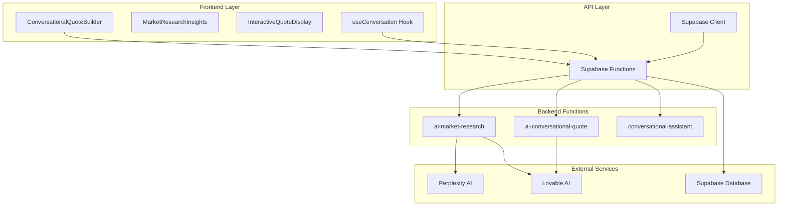
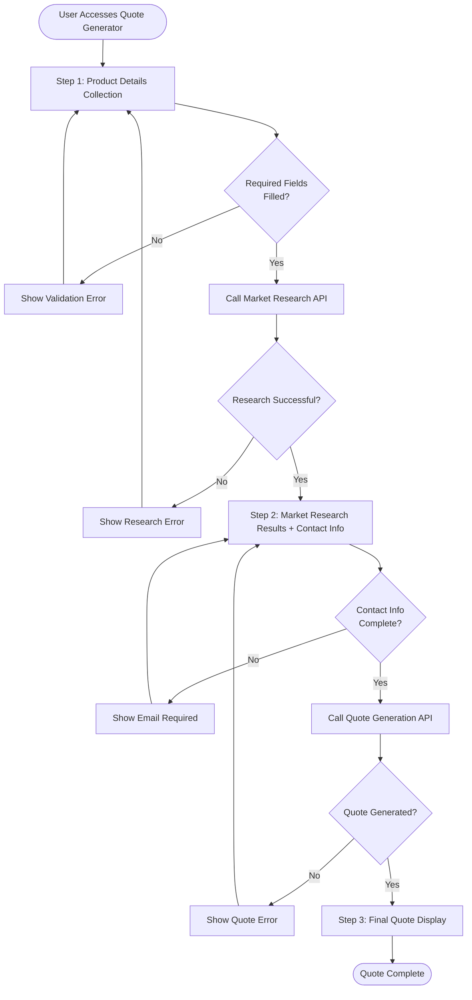
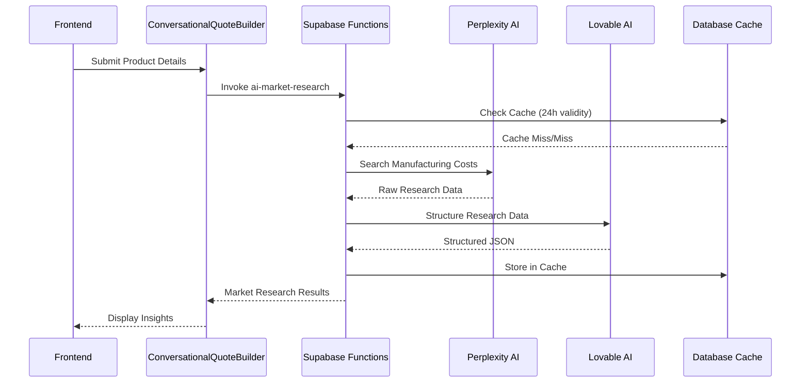
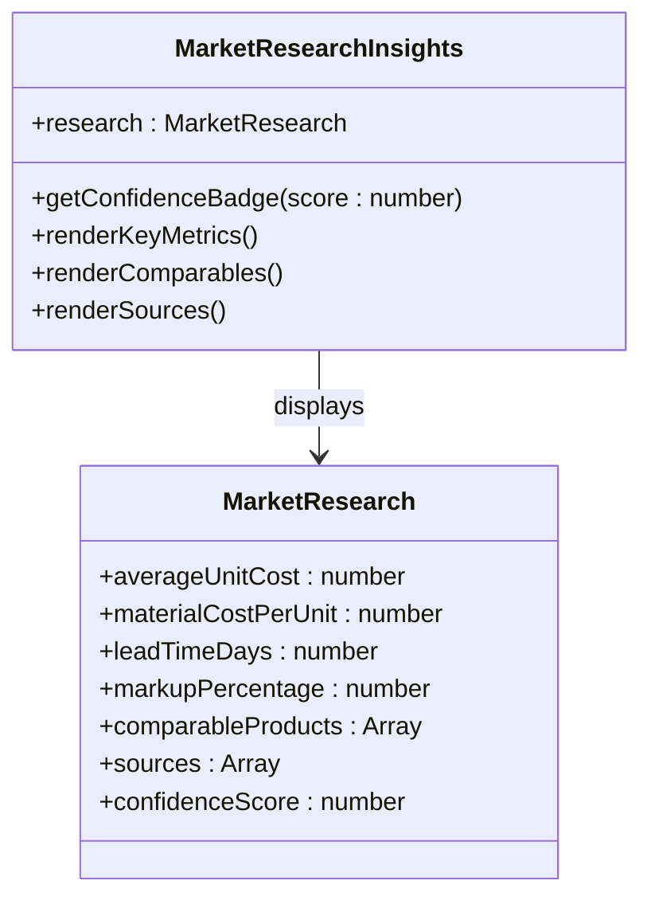
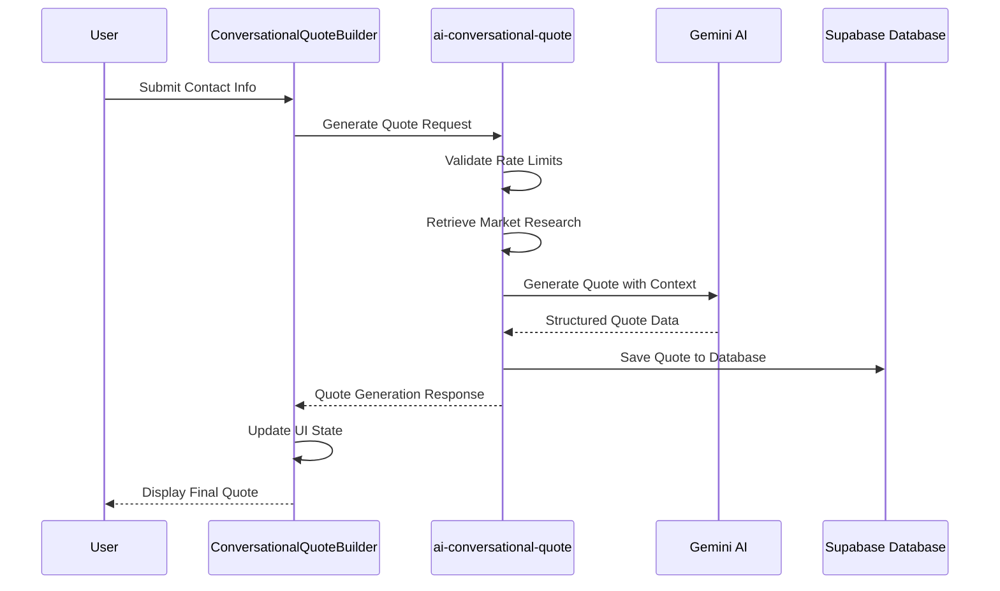
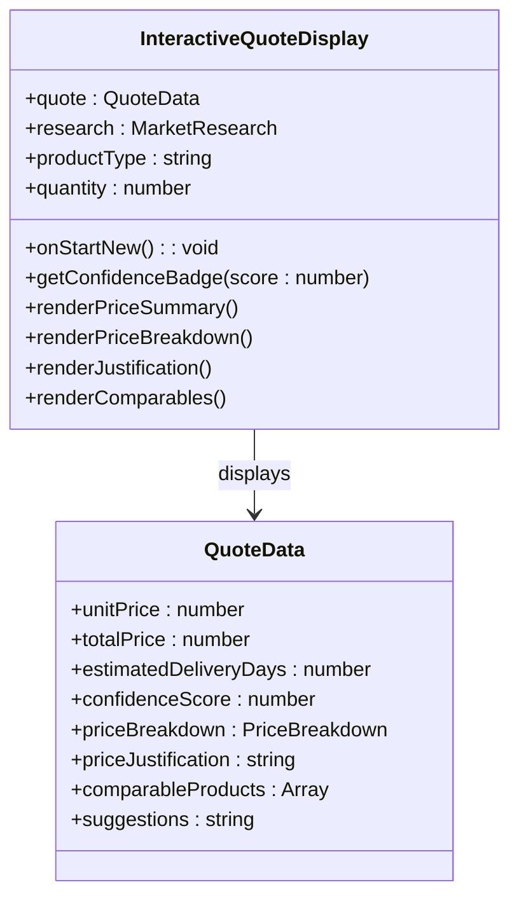
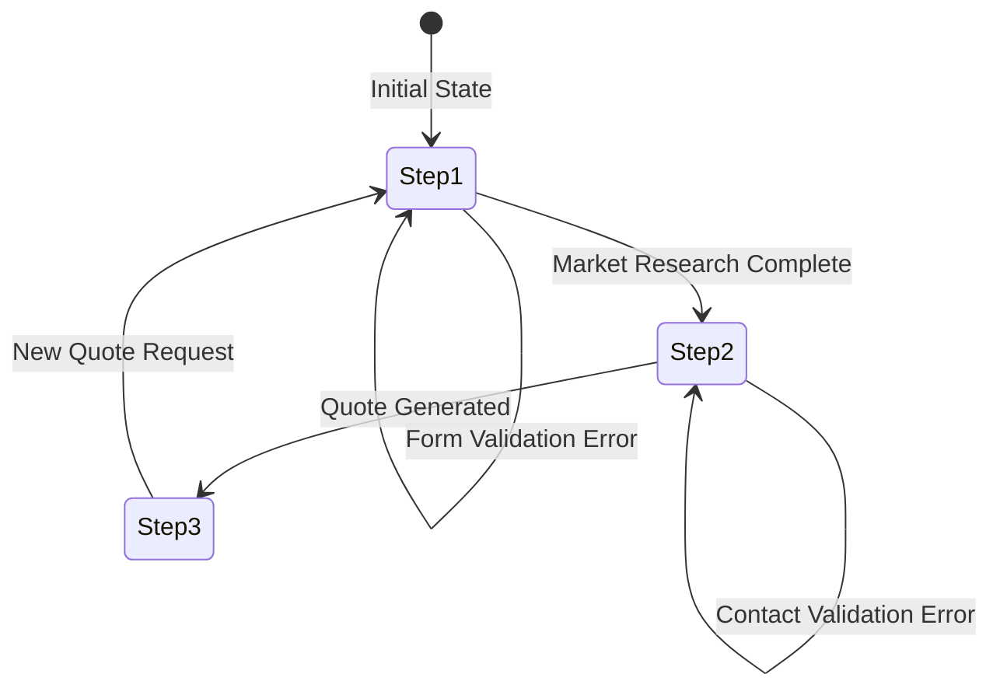
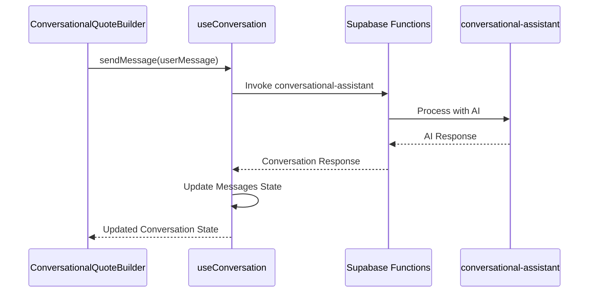
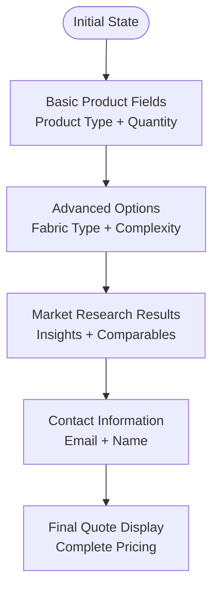

# Conversational Interface

<cite>
**Referenced Files in This Document**
- [ConversationalQuoteBuilder.tsx](file://src/components/quote/ConversationalQuoteBuilder.tsx)
- [useConversation.ts](file://src/hooks/useConversation.ts)
- [conversational-assistant/index.ts](file://supabase/functions/conversational-assistant/index.ts)
- [ai-market-research/index.ts](file://supabase/functions/ai-market-research/index.ts)
- [ai-conversational-quote/index.ts](file://supabase/functions/ai-conversational-quote/index.ts)
- [MarketResearchInsights.tsx](file://src/components/quote/MarketResearchInsights.tsx)
- [InteractiveQuoteDisplay.tsx](file://src/components/quote/InteractiveQuoteDisplay.tsx)
- [aiQuote.ts](file://src/lib/api/aiQuote.ts)
- [QuoteGenerator.tsx](file://src/pages/QuoteGenerator.tsx)
</cite>

## Table of Contents
1. [Introduction](#introduction)
2. [System Architecture](#system-architecture)
3. [Three-Step Process Overview](#three-step-process-overview)
4. [Product Information Collection](#product-information-collection)
5. [Market Research Retrieval](#market-research-retrieval)
6. [Contact Information Gathering](#contact-information-gathering)
7. [Final Quote Generation](#final-quote-generation)
8. [State Management with useState Hooks](#state-management-with-usestate-hooks)
9. [Form Validation Logic](#form-validation-logic)
10. [Integration with useConversation Hook](#integration-with-useconversation-hook)
11. [Error Handling Mechanisms](#error-handling-mechanisms)
12. [User Interaction Patterns](#user-interaction-patterns)
13. [Common Issues and Solutions](#common-issues-and-solutions)
14. [Technical Implementation Details](#technical-implementation-details)
15. [Best Practices and Recommendations](#best-practices-and-recommendations)

## Introduction

The Conversational Interface component is a sophisticated AI-powered quote generation system that transforms traditional quote requests into an interactive, conversational experience. Built around the ConversationalQuoteBuilder component, this system guides users through a three-step process to generate accurate, market-researched quotes for custom apparel manufacturing.

The interface leverages advanced AI capabilities through Supabase functions, providing real-time market data analysis, intelligent form completion, and contextual assistance throughout the quote generation journey. This conversational approach enhances user engagement while ensuring comprehensive data collection for accurate pricing.

## System Architecture

The Conversational Interface operates within a multi-layered architecture that seamlessly integrates frontend React components with backend Supabase functions and external AI services.



**Diagram sources**
- [ConversationalQuoteBuilder.tsx](file://src/components/quote/ConversationalQuoteBuilder.tsx#L43-L363)
- [useConversation.ts](file://src/hooks/useConversation.ts#L32-L177)
- [ai-market-research/index.ts](file://supabase/functions/ai-market-research/index.ts#L1-L279)
- [ai-conversational-quote/index.ts](file://supabase/functions/ai-conversational-quote/index.ts#L1-L325)

**Section sources**
- [ConversationalQuoteBuilder.tsx](file://src/components/quote/ConversationalQuoteBuilder.tsx#L1-L363)
- [useConversation.ts](file://src/hooks/useConversation.ts#L1-L177)

## Three-Step Process Overview

The Conversational Interface implements a structured three-step workflow that ensures comprehensive data collection while maintaining user-friendly interaction patterns.



**Diagram sources**
- [ConversationalQuoteBuilder.tsx](file://src/components/quote/ConversationalQuoteBuilder.tsx#L65-L162)

### Step 1: Product Information Collection

The first step focuses on gathering essential product details that form the foundation for market research and quote generation.

### Step 2: Market Research Results + Contact Information

After obtaining market research data, users are presented with comprehensive insights and prompted to provide contact information for quote delivery.

### Step 3: Final Quote Display

The culmination of the process where users receive their customized quote with detailed breakdowns, comparisons, and actionable next steps.

**Section sources**
- [ConversationalQuoteBuilder.tsx](file://src/components/quote/ConversationalQuoteBuilder.tsx#L168-L362)

## Product Information Collection

The product information collection phase utilizes a comprehensive form interface that captures all necessary details for accurate market research and quote generation.

### Form Structure and Validation

The form employs a grid layout with essential fields organized for optimal user experience:

| Field | Type | Required | Validation Rules |
|-------|------|----------|------------------|
| Product Type | Text Input | Yes | Non-empty string, max 100 characters |
| Quantity | Number Input | Yes | Positive integer, min 1 |
| Fabric Type | Text Input | No | Max 50 characters |
| Complexity | Select Dropdown | No | Predefined options: simple, medium, complex |
| Additional Requirements | Text Input | No | Max 500 characters |

### State Management Implementation

The form maintains state through dedicated useState hooks for each field, enabling real-time validation and user feedback:

```typescript
// Form state management
const [productType, setProductType] = useState("");
const [quantity, setQuantity] = useState("");
const [fabricType, setFabricType] = useState("");
const [complexity, setComplexity] = useState("medium");
const [additionalRequirements, setAdditionalRequirements] = useState("");
```

### User Interaction Patterns

The form implements progressive disclosure, showing complexity and additional requirements only after initial product and quantity information is provided. This approach reduces cognitive load while ensuring comprehensive data collection.

**Section sources**
- [ConversationalQuoteBuilder.tsx](file://src/components/quote/ConversationalQuoteBuilder.tsx#L49-L58)
- [ConversationalQuoteBuilder.tsx](file://src/components/quote/ConversationalQuoteBuilder.tsx#L180-L230)

## Market Research Retrieval

Market research forms the backbone of the quote generation process, providing real-time pricing data and industry benchmarks.

### Backend Integration

The market research functionality integrates with external APIs through a sophisticated backend service that handles data aggregation and processing:



**Diagram sources**
- [ConversationalQuoteBuilder.tsx](file://src/components/quote/ConversationalQuoteBuilder.tsx#L65-L109)
- [ai-market-research/index.ts](file://supabase/functions/ai-market-research/index.ts#L89-L278)

### Data Processing Pipeline

The market research system processes information through multiple stages:

1. **Query Construction**: Builds comprehensive search queries incorporating all product parameters
2. **External API Integration**: Leverages Perplexity AI for real-time market data
3. **Data Structuring**: Uses Lovable AI to transform unstructured research into structured JSON
4. **Caching Strategy**: Implements 24-hour cache with quantity-based grouping
5. **Confidence Scoring**: Calculates data reliability scores for transparency

### Market Research Insights Component

The MarketResearchInsights component presents processed data in an intuitive dashboard format:



**Diagram sources**
- [MarketResearchInsights.tsx](file://src/components/quote/MarketResearchInsights.tsx#L5-L19)

**Section sources**
- [ConversationalQuoteBuilder.tsx](file://src/components/quote/ConversationalQuoteBuilder.tsx#L65-L109)
- [ai-market-research/index.ts](file://supabase/functions/ai-market-research/index.ts#L89-L278)
- [MarketResearchInsights.tsx](file://src/components/quote/MarketResearchInsights.tsx#L1-L140)

## Contact Information Gathering

The contact information collection phase balances data completeness with user privacy, focusing on essential information for quote delivery and follow-up communication.

### Form Design and Validation

The contact form implements progressive enhancement, revealing fields based on user progress through the quote generation process:

| Field | Type | Required | Validation Rules |
|-------|------|----------|------------------|
| Email Address | Email Input | Yes | Valid email format, domain validation |
| Full Name | Text Input | No | Max 100 characters |
| Country | Text Input | No | Max 50 characters |
| Phone Number | Text Input | No | International format support |

### State Management During Contact Collection

The contact information state mirrors the product information structure, maintaining separate state variables for each field while enabling conditional validation:

```typescript
// Contact state management
const [customerEmail, setCustomerEmail] = useState("");
const [customerName, setCustomerName] = useState("");
const [country, setCountry] = useState("");
const [phoneNumber, setPhoneNumber] = useState("");
```

### User Experience Enhancements

The contact form implements several UX improvements:

- **Conditional Field Display**: Only essential fields are shown initially
- **Real-time Validation**: Immediate feedback for email format validation
- **Progress Indication**: Clear indication of completed steps
- **Back Navigation**: Ability to return to previous steps for corrections

**Section sources**
- [ConversationalQuoteBuilder.tsx](file://src/components/quote/ConversationalQuoteBuilder.tsx#L266-L330)

## Final Quote Generation

The final quote generation process combines market research data with user-specific requirements to produce comprehensive, actionable pricing information.

### Quote Generation Workflow



**Diagram sources**
- [ConversationalQuoteBuilder.tsx](file://src/components/quote/ConversationalQuoteBuilder.tsx#L112-L162)
- [ai-conversational-quote/index.ts](file://supabase/functions/ai-conversational-quote/index.ts#L136-L324)

### Quote Data Structure

The generated quote follows a comprehensive structure that provides detailed pricing information:

```typescript
interface QuoteData {
  id: string;
  unitPrice: number;
  totalPrice: number;
  estimatedDeliveryDays: number;
  confidenceScore: number;
  priceBreakdown: {
    materials: number;
    labor: number;
    overhead: number;
    margin: number;
  };
  priceJustification: string;
  comparableProducts: Array<{
    name: string;
    price: number;
    supplier: string;
  }>;
  suggestions: string;
}
```

### Interactive Quote Display

The InteractiveQuoteDisplay component presents quote information in an engaging, actionable format:



**Diagram sources**
- [InteractiveQuoteDisplay.tsx](file://src/components/quote/InteractiveQuoteDisplay.tsx#L16-L42)

**Section sources**
- [ConversationalQuoteBuilder.tsx](file://src/components/quote/ConversationalQuoteBuilder.tsx#L112-L162)
- [ai-conversational-quote/index.ts](file://supabase/functions/ai-conversational-quote/index.ts#L136-L324)
- [InteractiveQuoteDisplay.tsx](file://src/components/quote/InteractiveQuoteDisplay.tsx#L1-L230)

## State Management with useState Hooks

The Conversational Interface employs a sophisticated state management strategy using React's useState hooks to maintain UI state, loading indicators, and form data throughout the quote generation process.

### Core State Variables

The main component maintains several key state variables:

```typescript
// UI State Management
const [step, setStep] = useState(1);
const [loading, setLoading] = useState(false);
const [researchLoading, setResearchLoading] = useState(false);

// Form State Management
const [productType, setProductType] = useState("");
const [quantity, setQuantity] = useState("");
const [fabricType, setFabricType] = useState("");
const [complexity, setComplexity] = useState("medium");
const [additionalRequirements, setAdditionalRequirements] = useState("");

// Results State Management
const [marketResearch, setMarketResearch] = useState<MarketResearch | null>(null);
const [quote, setQuote] = useState<QuoteData | null>(null);
const [marketResearchId, setMarketResearchId] = useState<string | null>(null);
```

### State Transition Management

The step-based navigation system uses a simple numeric state variable that controls which UI component is rendered:



**Diagram sources**
- [ConversationalQuoteBuilder.tsx](file://src/components/quote/ConversationalQuoteBuilder.tsx#L44-L46)

### Loading State Management

The component implements granular loading states to provide user feedback during different operations:

- **Global Loading**: Controls the primary quote generation process
- **Research Loading**: Indicates market research data collection
- **Button Disabled State**: Prevents multiple submissions during processing

### Session Management

The system maintains session persistence through localStorage for quote session identification:

```typescript
const sessionId = localStorage.getItem('quote_session_id') || crypto.randomUUID();
localStorage.setItem('quote_session_id', sessionId);
```

**Section sources**
- [ConversationalQuoteBuilder.tsx](file://src/components/quote/ConversationalQuoteBuilder.tsx#L44-L64)

## Form Validation Logic

The Conversational Interface implements comprehensive form validation at multiple levels to ensure data quality and prevent processing errors.

### Client-Side Validation

The validation system operates at multiple stages:

#### Step 1 Validation (Product Information)
```typescript
// Product Type and Quantity Validation
if (!productType || !quantity) {
  toast({
    title: "Missing Information",
    description: "Please provide product type and quantity",
    variant: "destructive",
  });
  return;
}
```

#### Step 2 Validation (Contact Information)
```typescript
// Email Validation
if (!customerEmail) {
  toast({
    title: "Email Required",
    description: "Please provide your email address",
    variant: "destructive",
  });
  return;
}
```

### Real-Time Feedback Mechanisms

The validation system provides immediate user feedback through toast notifications and button state changes:

- **Immediate Validation**: Form fields are validated before submission
- **Visual Feedback**: Disabled buttons indicate processing states
- **Error Messaging**: Clear, actionable error messages guide users

### Backend Validation

While client-side validation improves user experience, the backend implements additional validation layers:

- **API Parameter Validation**: Ensures required parameters are present
- **Data Type Validation**: Verifies parameter types match expectations
- **Business Logic Validation**: Checks for logical inconsistencies

**Section sources**
- [ConversationalQuoteBuilder.tsx](file://src/components/quote/ConversationalQuoteBuilder.tsx#L66-L119)

## Integration with useConversation Hook

The Conversational Interface integrates with the useConversation hook to provide seamless chat-based interactions and maintain conversation context across user sessions.

### Conversation Management

The useConversation hook manages conversation state, including:

```typescript
// Conversation state management
const [messages, setMessages] = useState<Message[]>([]);
const [isLoading, setIsLoading] = useState(false);
const [sessionId] = useState(() => crypto.randomUUID());
const [conversationId, setConversationId] = useState<string | null>(null);
const [generatedQuote, setGeneratedQuote] = useState<QuoteData | null>(null);
```

### Message Flow Integration

The ConversationalQuoteBuilder communicates with the useConversation hook through message passing:



**Diagram sources**
- [useConversation.ts](file://src/hooks/useConversation.ts#L64-L150)
- [conversational-assistant/index.ts](file://supabase/functions/conversational-assistant/index.ts#L87-L120)

### State Persistence

The useConversation hook implements automatic state persistence:

- **LocalStorage Backup**: Conversation history saved locally
- **Session Restoration**: Automatic restoration on component mount
- **Database Synchronization**: Persistent storage in Supabase

### Error Handling Integration

The hook provides robust error handling that integrates with the main component:

```typescript
// Retry logic with exponential backoff
if (retryCount < 2) {
  toast({
    title: "Retrying...",
    description: "Connection issue detected. Attempting to reconnect...",
  });
  setTimeout(() => sendMessage(content, retryCount + 1), 1000 * (retryCount + 1));
  return;
}
```

**Section sources**
- [useConversation.ts](file://src/hooks/useConversation.ts#L32-L177)
- [ConversationalQuoteBuilder.tsx](file://src/components/quote/ConversationalQuoteBuilder.tsx#L43-L48)

## Error Handling Mechanisms

The Conversational Interface implements comprehensive error handling across all system layers to ensure reliable operation and graceful degradation.

### Frontend Error Handling

The frontend implements multiple error handling strategies:

#### Toast-Based Error Reporting
```typescript
// Market Research Error Handling
toast({
  title: "Research Failed",
  description: "Unable to gather market data. Please try again.",
  variant: "destructive",
});

// Quote Generation Error Handling
toast({
  title: "Quote Generation Failed",
  description: "Unable to generate quote. Please try again.",
  variant: "destructive",
});
```

#### Loading State Management
```typescript
// Research Loading State
setResearchLoading(true);
// ...
setResearchLoading(false);

// Quote Generation Loading State
setLoading(true);
// ...
setLoading(false);
```

### Backend Error Handling

The backend functions implement robust error handling with proper response formatting:

```typescript
// Market Research Error Response
return new Response(
  JSON.stringify({
    success: false,
    error: error instanceof Error ? error.message : 'Unknown error',
  }),
  {
    status: 500,
    headers: { ...corsHeaders, 'Content-Type': 'application/json' },
  }
);
```

### Rate Limiting and Graceful Degradation

The system implements intelligent rate limiting to prevent abuse:

```typescript
// IP-based Rate Limiting
if (rateLimitData && rateLimitData.request_count >= 10) {
  return new Response(
    JSON.stringify({ 
      error: 'Rate limit exceeded. Please try again later.',
      retryAfter: 3600
    }),
    { status: 429, headers: { ...corsHeaders, 'Content-Type': 'application/json' } }
  );
}
```

### Error Recovery Strategies

The system implements several recovery mechanisms:

- **Automatic Retry**: Failed requests attempt up to 3 retries with exponential backoff
- **Cached Data Fallback**: Uses cached market research data when API calls fail
- **Graceful Degradation**: Continues operation with reduced functionality when services are unavailable

**Section sources**
- [ConversationalQuoteBuilder.tsx](file://src/components/quote/ConversationalQuoteBuilder.tsx#L100-L162)
- [ai-market-research/index.ts](file://supabase/functions/ai-market-research/index.ts#L265-L278)
- [ai-conversational-quote/index.ts](file://supabase/functions/ai-conversational-quote/index.ts#L311-L324)

## User Interaction Patterns

The Conversational Interface implements sophisticated user interaction patterns that guide users through the quote generation process while maintaining engagement and clarity.

### Progressive Disclosure

The interface uses progressive disclosure to manage information density:



**Diagram sources**
- [ConversationalQuoteBuilder.tsx](file://src/components/quote/ConversationalQuoteBuilder.tsx#L168-L362)

### Form Completion Patterns

The system implements several form completion patterns:

#### Conditional Field Display
- **Fabric Type**: Shown only when product type is selected
- **Complexity Level**: Available after quantity input
- **Additional Requirements**: Optional field revealed after initial setup

#### Validation Feedback
- **Real-time Validation**: Immediate feedback for required fields
- **Progress Indicators**: Clear indication of completed steps
- **Error Highlighting**: Visual cues for invalid inputs

### Navigation Patterns

The interface supports multiple navigation patterns:

#### Forward Navigation
- **Next Steps**: Sequential progression through form steps
- **Immediate Actions**: Direct quote generation after research

#### Backward Navigation
- **Step Back**: Return to previous form sections
- **Reset Functionality**: Complete form reset capability

#### Error Recovery
- **Inline Correction**: Fix validation errors without losing progress
- **Context Preservation**: Maintain partial form data during navigation

### Accessibility Features

The interface implements accessibility best practices:

- **Keyboard Navigation**: Full keyboard support for all interactive elements
- **Screen Reader Support**: Proper ARIA labels and roles
- **Focus Management**: Logical focus flow through form sections
- **High Contrast**: Visual design supports various visual abilities

**Section sources**
- [ConversationalQuoteBuilder.tsx](file://src/components/quote/ConversationalQuoteBuilder.tsx#L168-L362)

## Common Issues and Solutions

The Conversational Interface addresses several common issues that can arise during quote generation, providing clear solutions and user guidance.

### Form Validation Issues

#### Missing Required Information
**Problem**: Users attempt to proceed without completing mandatory fields
**Solution**: Immediate validation with clear error messaging
**Implementation**: 
```typescript
if (!productType || !quantity) {
  toast({
    title: "Missing Information",
    description: "Please provide product type and quantity",
    variant: "destructive",
  });
  return;
}
```

#### Invalid Email Format
**Problem**: Users enter malformed email addresses
**Solution**: Real-time email validation with format checking
**Implementation**: Email input validation occurs automatically as users type

### Market Research Failures

#### API Connectivity Issues
**Problem**: External API calls fail due to network issues
**Solution**: Robust error handling with fallback mechanisms
**Implementation**:
- Automatic retry logic with exponential backoff
- Cached data utilization when APIs are unavailable
- Graceful degradation of functionality

#### Data Quality Issues
**Problem**: Market research data is incomplete or unreliable
**Solution**: Confidence scoring and transparent reporting
**Implementation**: 
- Confidence scores displayed alongside research data
- Clear indication of cached vs. fresh data
- Source attribution for all research findings

### Quote Generation Problems

#### AI Processing Errors
**Problem**: AI-generated quotes contain errors or inconsistencies
**Solution**: Structured data validation and fallback responses
**Implementation**:
- JSON parsing validation with error recovery
- Default quote structure when AI fails
- Manual review process for critical failures

#### Rate Limiting Issues
**Problem**: Users exceed API rate limits
**Solution**: Intelligent rate limiting with user-friendly messaging
**Implementation**:
- IP-based and email-based rate limiting
- Clear error messages with retry timing
- Alternative actions when limits are reached

### Performance Issues

#### Slow Response Times
**Problem**: Long wait times during quote generation
**Solution**: Optimized caching and asynchronous processing
**Implementation**:
- 24-hour market research caching
- Asynchronous API calls with loading states
- Progressive loading of complex components

#### Memory Management
**Problem**: Large datasets cause browser performance issues
**Solution**: Efficient state management and data pagination
**Implementation**:
- Selective state updates
- Lazy loading of comparison data
- Efficient data structures for large arrays

**Section sources**
- [ConversationalQuoteBuilder.tsx](file://src/components/quote/ConversationalQuoteBuilder.tsx#L66-L162)
- [ai-market-research/index.ts](file://supabase/functions/ai-market-research/index.ts#L265-L278)
- [ai-conversational-quote/index.ts](file://supabase/functions/ai-conversational-quote/index.ts#L311-L324)

## Technical Implementation Details

The Conversational Interface leverages modern React patterns and Supabase technologies to deliver a robust, scalable quote generation system.

### React Component Architecture

The main component follows functional component patterns with hooks:

```typescript
// Component structure with hooks
export const ConversationalQuoteBuilder = () => {
  const [step, setStep] = useState(1);
  const [loading, setLoading] = useState(false);
  const [researchLoading, setResearchLoading] = useState(false);
  const { toast } = useToast();
  
  // Form state management
  const [productType, setProductType] = useState("");
  const [quantity, setQuantity] = useState("");
  // ... additional state variables
  
  // Handler functions
  const handleMarketResearch = async () => { /* Implementation */ };
  const handleGenerateQuote = async () => { /* Implementation */ };
  
  return (/* JSX rendering */);
};
```

### Supabase Integration

The system integrates deeply with Supabase for data persistence and function invocation:

#### Function Invocation Pattern
```typescript
// Market research function call
const { data, error } = await supabase.functions.invoke('ai-market-research', {
  body: {
    productType,
    quantity: parseInt(quantity),
    fabricType: fabricType || undefined,
    complexity: complexity || undefined,
    additionalRequirements: additionalRequirements || undefined,
  },
});
```

#### Database Operations
```typescript
// Quote saving with transaction-like behavior
const { data: savedQuote, error: saveError } = await supabase
  .from('ai_quotes')
  .insert({
    product_type: request.productType,
    quantity: request.quantity,
    // ... additional fields
  })
  .select()
  .single();
```

### AI Service Integration

The system integrates with multiple AI services for comprehensive functionality:

#### Perplexity AI for Market Research
- **Purpose**: Real-time market data aggregation
- **Implementation**: Comprehensive search queries with structured responses
- **Rate Limiting**: 10 requests per hour per IP

#### Lovable AI for Data Structuring
- **Purpose**: Transform unstructured research into structured JSON
- **Implementation**: Specialized prompts for data extraction
- **Model**: Google Gemini 2.5 Flash for cost-effective processing

#### Gemini AI for Quote Generation
- **Purpose**: Generate comprehensive, accurate quotes
- **Implementation**: Context-aware prompt engineering
- **Model**: Google Gemini 2.5 Pro for high-quality output

### TypeScript Integration

The system leverages TypeScript for type safety and developer experience:

#### Interface Definitions
```typescript
interface QuoteData {
  id: string;
  unitPrice: number;
  totalPrice: number;
  estimatedDeliveryDays: number;
  confidenceScore: number;
  priceBreakdown: {
    materials: number;
    labor: number;
    overhead: number;
    margin: number;
  };
  priceJustification: string;
  comparableProducts: Array<{
    name: string;
    price: number;
    supplier: string;
  }>;
  suggestions: string;
}
```

#### Type Safety Benefits
- **Compile-time Validation**: Catch errors before runtime
- **IDE Support**: Enhanced autocompletion and refactoring
- **Documentation**: Self-documenting code through interfaces

**Section sources**
- [ConversationalQuoteBuilder.tsx](file://src/components/quote/ConversationalQuoteBuilder.tsx#L1-L363)
- [ai-market-research/index.ts](file://supabase/functions/ai-market-research/index.ts#L1-L279)
- [ai-conversational-quote/index.ts](file://supabase/functions/ai-conversational-quote/index.ts#L1-L325)

## Best Practices and Recommendations

Based on the implementation analysis, several best practices emerge for building conversational interfaces and quote generation systems.

### User Experience Best Practices

#### Progressive Disclosure Implementation
- **Information Hierarchy**: Present information in logical order
- **Field Grouping**: Group related form fields together
- **Conditional Visibility**: Show advanced options only when needed

#### Validation Strategy
- **Real-time Feedback**: Validate inputs immediately as users type
- **Clear Error Messages**: Provide actionable error descriptions
- **Visual Cues**: Use color coding and icons for validation states

#### Loading State Management
- **Granular Loading**: Differentiate between various loading states
- **User Feedback**: Provide meaningful loading messages
- **Timeout Handling**: Implement reasonable timeout limits

### Technical Implementation Best Practices

#### State Management
- **Hook Composition**: Use multiple specialized hooks for different concerns
- **State Normalization**: Maintain normalized state structures
- **Immutability**: Treat state as immutable and use functional updates

#### Error Handling
- **Layered Approach**: Implement error handling at multiple system layers
- **Graceful Degradation**: Maintain functionality when parts fail
- **User Communication**: Provide clear, actionable error messages

#### Performance Optimization
- **Caching Strategy**: Implement intelligent caching for expensive operations
- **Async Processing**: Use asynchronous patterns for long-running operations
- **Resource Management**: Clean up resources and prevent memory leaks

### Security Considerations

#### Input Validation
- **Sanitization**: Sanitize all user inputs before processing
- **Length Limits**: Implement reasonable length limits for all inputs
- **Format Validation**: Validate data formats early in the process

#### Rate Limiting
- **Multiple Factors**: Implement rate limiting based on IP and email
- **Gradual Enforcement**: Use gradual enforcement to prevent abuse
- **User Communication**: Clearly communicate rate limit status

#### Data Protection
- **Privacy Compliance**: Ensure compliance with data protection regulations
- **Minimal Data Collection**: Collect only necessary information
- **Secure Storage**: Use encrypted storage for sensitive data

### Scalability Considerations

#### Horizontal Scaling
- **Stateless Design**: Design functions to be stateless for easy scaling
- **Database Optimization**: Use efficient indexing and query patterns
- **CDN Integration**: Serve static assets through CDN infrastructure

#### Monitoring and Observability
- **Error Tracking**: Implement comprehensive error tracking
- **Performance Monitoring**: Monitor response times and resource usage
- **Usage Analytics**: Track user behavior and system performance

These best practices ensure that the Conversational Interface remains robust, scalable, and user-friendly while maintaining high performance and reliability standards.