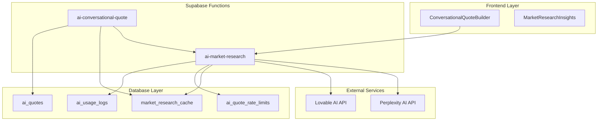
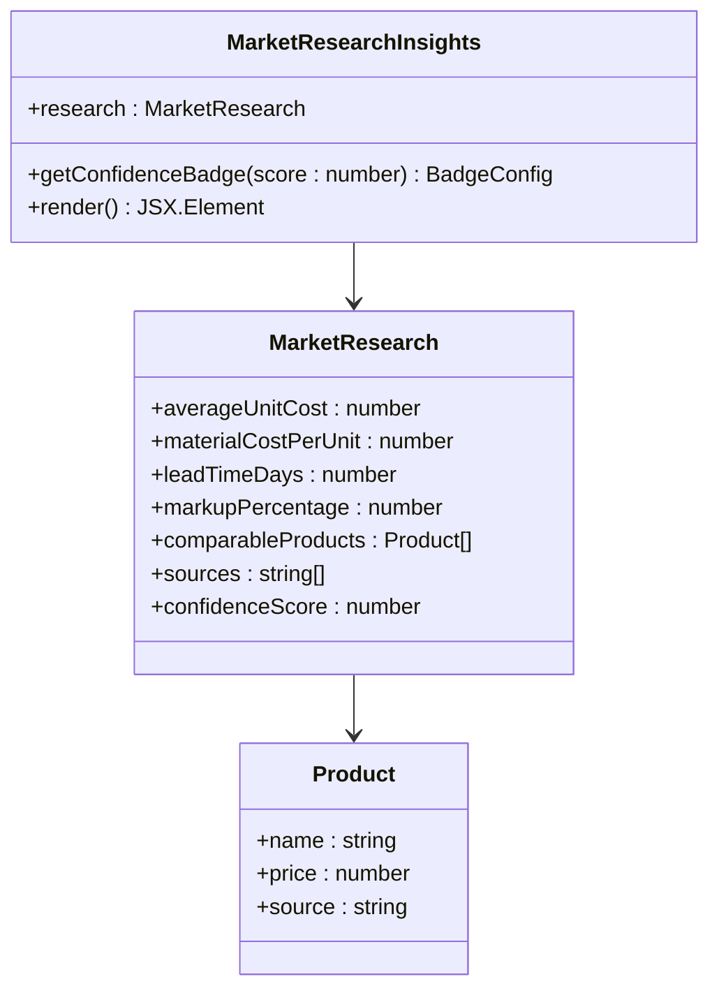
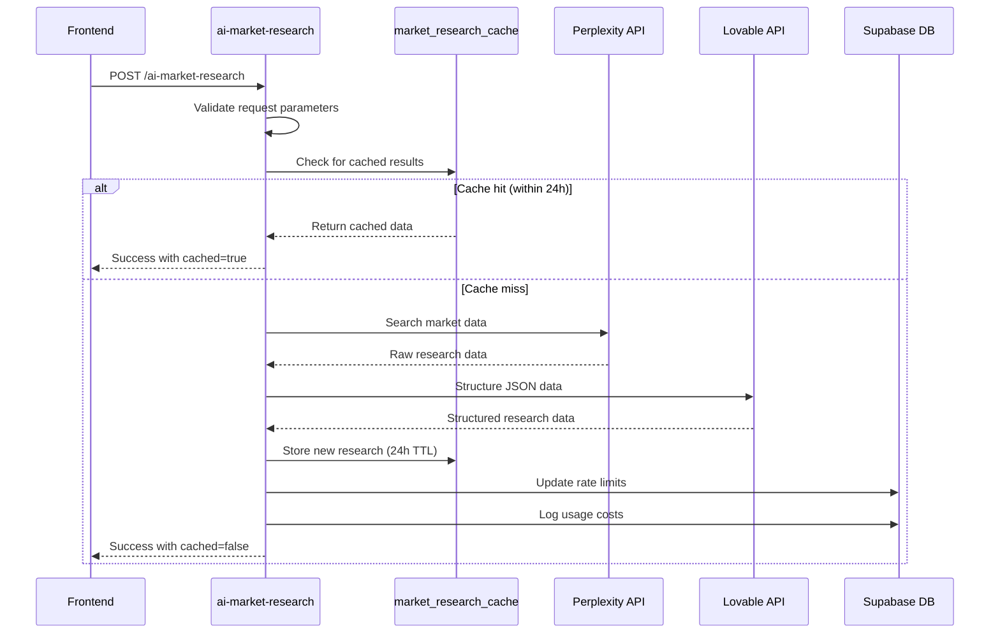
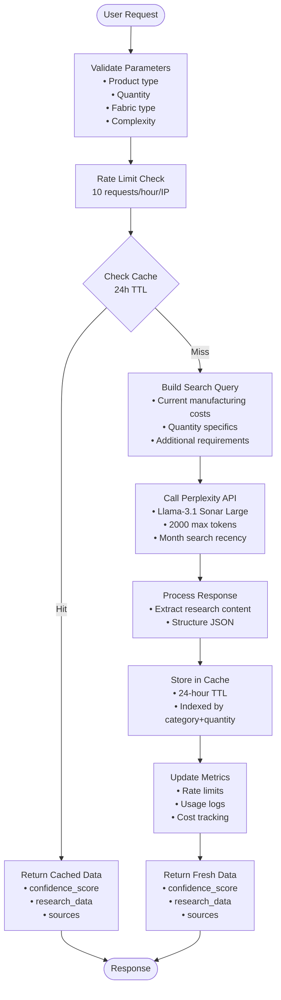
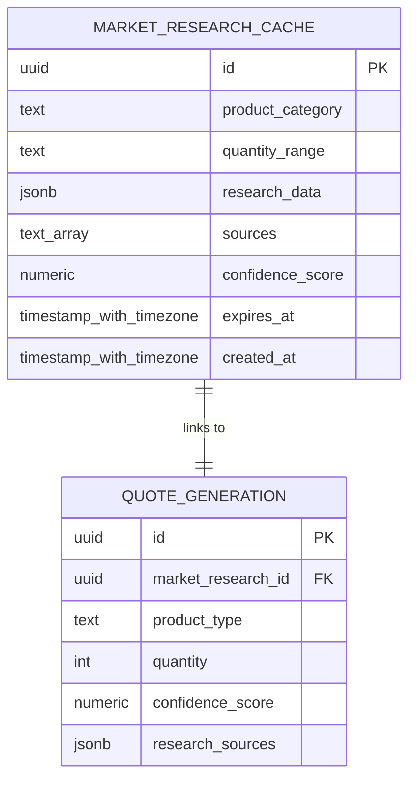
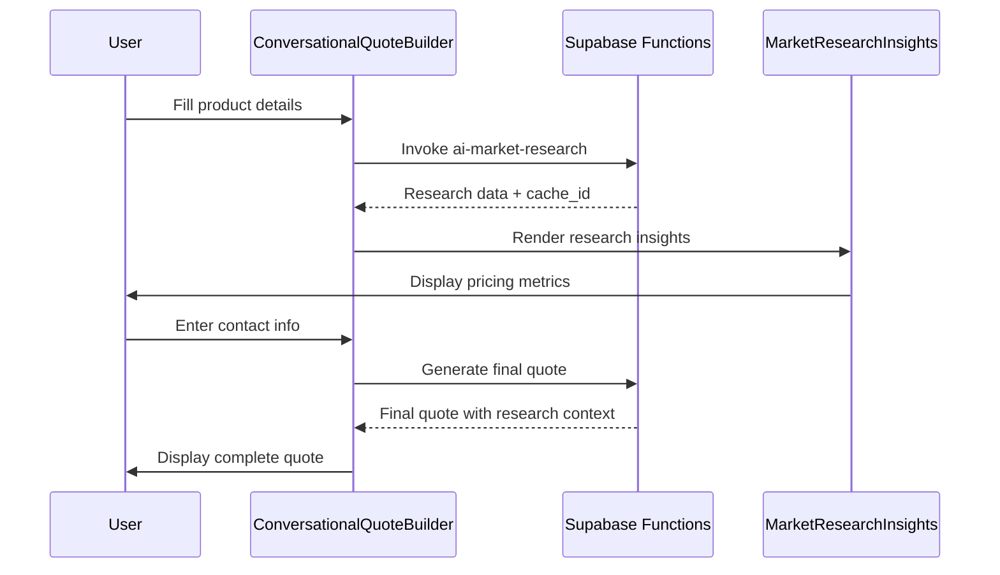
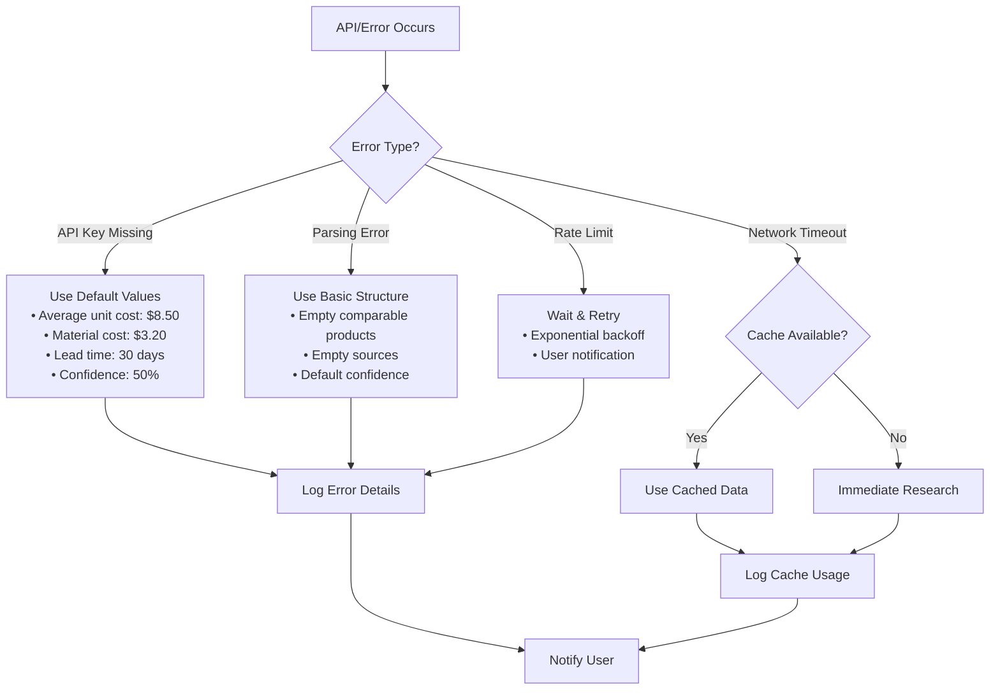

# Market Research Integration

<cite>
**Referenced Files in This Document**
- [MarketResearchInsights.tsx](file://src/components/quote/MarketResearchInsights.tsx)
- [index.ts](file://supabase/functions/ai-market-research/index.ts)
- [ConversationalQuoteBuilder.tsx](file://src/components/quote/ConversationalQuoteBuilder.tsx)
- [20251124164837_4eda3cf0-ab6f-4305-a5fe-82a19c7948d3.sql](file://supabase/migrations/20251124164837_4eda3cf0-ab6f-4305-a5fe-82a19c7948d3.sql)
- [useQuotes.ts](file://src/hooks/useQuotes.ts)
- [QuoteAnalytics.tsx](file://src/pages/QuoteAnalytics.tsx)
- [ai-conversational-quote/index.ts](file://supabase/functions/ai-conversational-quote/index.ts)
</cite>

## Table of Contents
1. [Introduction](#introduction)
2. [System Architecture](#system-architecture)
3. [Core Components](#core-components)
4. [Database Schema](#database-schema)
5. [Market Research Workflow](#market-research-workflow)
6. [Confidence Scoring System](#confidence-scoring-system)
7. [Caching Strategy](#caching-strategy)
8. [Frontend Integration](#frontend-integration)
9. [Error Handling and Edge Cases](#error-handling-and-edge-cases)
10. [Performance Optimization](#performance-optimization)
11. [Troubleshooting Guide](#troubleshooting-guide)
12. [Best Practices](#best-practices)

## Introduction

The Market Research Integration system provides data-backed pricing insights for AI-generated quotes by leveraging real-time market data from verified sources. This system combines external data aggregation, intelligent caching, and confidence scoring to deliver accurate, up-to-date pricing information while optimizing API costs and reducing latency.

The system operates through a sophisticated pipeline that includes external data collection via Perplexity AI, structured data processing using Lovable AI, intelligent caching with 24-hour TTL, and comprehensive confidence scoring to ensure quote reliability.

## System Architecture

The Market Research Integration follows a serverless architecture with Supabase Functions acting as the primary orchestration layer:



**Diagram sources**
- [ConversationalQuoteBuilder.tsx](file://src/components/quote/ConversationalQuoteBuilder.tsx#L65-L92)
- [index.ts](file://supabase/functions/ai-market-research/index.ts#L17-L278)

**Section sources**
- [ConversationalQuoteBuilder.tsx](file://src/components/quote/ConversationalQuoteBuilder.tsx#L1-L363)
- [index.ts](file://supabase/functions/ai-market-research/index.ts#L1-L279)

## Core Components

### MarketResearchInsights Component

The `MarketResearchInsights` component serves as the primary UI display for market research data, providing comprehensive pricing and sourcing information:



**Diagram sources**
- [MarketResearchInsights.tsx](file://src/components/quote/MarketResearchInsights.tsx#L5-L19)
- [ConversationalQuoteBuilder.tsx](file://src/components/quote/ConversationalQuoteBuilder.tsx#L33-L41)

The component displays:
- **Key Metrics**: Average unit cost, material cost, lead time, and markup percentage
- **Comparable Products**: List of similar products with pricing and sources
- **Data Sources**: Clickable links to original research sources
- **Confidence Indicators**: Visual badges showing research confidence level

**Section sources**
- [MarketResearchInsights.tsx](file://src/components/quote/MarketResearchInsights.tsx#L1-L140)

### Market Research Function

The `ai-market-research` function orchestrates the complete market research pipeline:



**Diagram sources**
- [index.ts](file://supabase/functions/ai-market-research/index.ts#L54-L278)

**Section sources**
- [index.ts](file://supabase/functions/ai-market-research/index.ts#L1-L279)

## Database Schema

The system utilizes a specialized database schema optimized for market research caching and retrieval:

### market_research_cache Table

| Column | Type | Constraints | Description |
|--------|------|-------------|-------------|
| id | UUID | PRIMARY KEY | Unique identifier for cache entries |
| product_category | TEXT | NOT NULL | Lowercase product category (e.g., "t-shirts") |
| quantity_range | TEXT | NOT NULL | Quantity grouping (0-100, 101-500, 501-1000, 1000+) |
| research_data | JSONB | NOT NULL | Structured research data with pricing metrics |
| sources | TEXT[] | DEFAULT ARRAY[] | Array of source URLs used for research |
| confidence_score | NUMERIC | CHECK (0-100) | Confidence level of research data |
| expires_at | TIMESTAMP WITH TIME ZONE | NOT NULL | Cache expiration timestamp |
| created_at | TIMESTAMP WITH TIME ZONE | DEFAULT NOW() | Record creation timestamp |

### ai_quotes Table Modifications

The system extends the `ai_quotes` table with market research integration fields:

| Column | Type | Description |
|--------|------|-------------|
| market_research_id | UUID | Foreign key linking to market_research_cache |
| confidence_score | NUMERIC | Final quote confidence score |
| research_sources | JSONB | Array of research source URLs |
| price_justification | TEXT | Explanation for pricing decisions |
| comparable_products | JSONB | Similar products for comparison |
| conversation_history | JSONB | Chat history for context |

**Section sources**
- [20251124164837_4eda3cf0-ab6f-4305-a5fe-82a19c7948d3.sql](file://supabase/migrations/20251124164837_4eda3cf0-ab6f-4305-a5fe-82a19c7948d3.sql#L1-L43)

## Market Research Workflow

The market research process follows a structured workflow designed for reliability and performance:

### Request Processing Pipeline



**Diagram sources**
- [index.ts](file://supabase/functions/ai-market-research/index.ts#L54-L278)

### Search Query Construction

The system constructs comprehensive search queries tailored to specific product requirements:

**Example Search Query Structure:**
```
Current manufacturing costs for [productType] in Bangladesh 2025:
- Quantity: [quantity] units
- Fabric: [fabricType]
- Complexity: [complexity]
- Requirements: [additionalRequirements]

Provide:
1. Average unit cost from Bangladesh garment manufacturers
2. Material/fabric costs per unit
3. Typical lead times for this quantity
4. Industry standard markup rates
5. 3-5 comparable products with pricing
```

**Section sources**
- [index.ts](file://supabase/functions/ai-market-research/index.ts#L95-L109)

## Confidence Scoring System

The confidence scoring system provides transparent quality assessment of research data:

### Confidence Levels

| Score Range | Confidence Level | Visual Indicator | Description |
|-------------|------------------|------------------|-------------|
| 85-100 | High Confidence | Green Badge | Reliable, verified data from multiple sources |
| 70-84 | Medium Confidence | Yellow Badge | Good quality data with reasonable sources |
| 0-69 | Estimated | Orange Badge | Limited data or fallback values |

### Implementation Logic

```typescript
// Confidence scoring implementation from MarketResearchInsights
const getConfidenceBadge = (score: number) => {
  if (score >= 85) return { 
    variant: "default" as const, 
    label: "High Confidence", 
    color: "text-green-600" 
  };
  if (score >= 70) return { 
    variant: "secondary" as const, 
    label: "Medium Confidence", 
    color: "text-yellow-600" 
  };
  return { 
    variant: "outline" as const, 
    label: "Estimated", 
    color: "text-orange-600" 
  };
};
```

### Data Quality Factors

The confidence score considers multiple factors:
- **Source Reliability**: Number and quality of data sources
- **Recency**: Age of the data and search recency filter
- **Completeness**: Availability of required metrics (cost, lead time, etc.)
- **Consistency**: Agreement between multiple data points

**Section sources**
- [MarketResearchInsights.tsx](file://src/components/quote/MarketResearchInsights.tsx#L21-L26)
- [index.ts](file://supabase/functions/ai-market-research/index.ts#L185-L186)

## Caching Strategy

The caching system implements a sophisticated 24-hour TTL strategy with intelligent quantity bucketing:

### Cache Organization



**Diagram sources**
- [20251124164837_4eda3cf0-ab6f-4305-a5fe-82a19c7948d3.sql](file://supabase/migrations/20251124164837_4eda3cf0-ab6f-4305-a5fe-82a19c7948d3.sql#L2-L11)

### Quantity Bucketing

The system groups quantities into logical ranges for efficient caching:

| Range | Description | Use Case |
|-------|-------------|----------|
| 0-100 | Small orders | Sample requests, prototypes |
| 101-500 | Medium orders | Standard production runs |
| 501-1000 | Large orders | Bulk manufacturing |
| 1000+ | Enterprise orders | Mass production contracts |

### Cache Retrieval Logic

```typescript
// Cache query implementation
const { data: cachedResearch } = await supabase
  .from('market_research_cache')
  .select('*')
  .eq('product_category', productType.toLowerCase())
  .eq('quantity_range', quantityRange)
  .gt('expires_at', new Date().toISOString())
  .order('created_at', { ascending: false })
  .limit(1)
  .single();
```

### Cache Expiration Management

The system automatically handles cache expiration through:
- **Automatic Cleanup**: Expired records remain in database for analytics
- **Intelligent Queries**: Expiration check prevents stale data usage
- **Fallback Mechanism**: Automatic regeneration when cache expires

**Section sources**
- [index.ts](file://supabase/functions/ai-market-research/index.ts#L58-L73)
- [20251124164837_4eda3cf0-ab6f-4305-a5fe-82a19c7948d3.sql](file://supabase/migrations/20251124164837_4eda3cf0-ab6f-4305-a5fe-82a19c7948d3.sql#L1-L43)

## Frontend Integration

The frontend integrates market research data seamlessly through React hooks and components:

### ConversationalQuoteBuilder Integration



**Diagram sources**
- [ConversationalQuoteBuilder.tsx](file://src/components/quote/ConversationalQuoteBuilder.tsx#L65-L147)

### Data Flow Architecture

The frontend manages data flow through several key mechanisms:

1. **State Management**: React state handles research loading and results
2. **Error Handling**: Comprehensive error boundaries and toast notifications
3. **Loading States**: Clear indication of research and quote generation progress
4. **User Experience**: Progressive disclosure of information

### API Integration Patterns

```typescript
// Frontend API calls using Supabase client
const handleMarketResearch = async () => {
  const { data, error } = await supabase.functions.invoke('ai-market-research', {
    body: {
      productType,
      quantity: parseInt(quantity),
      fabricType: fabricType || undefined,
      complexity: complexity || undefined,
      additionalRequirements: additionalRequirements || undefined,
    },
  });
  
  if (data.success) {
    setMarketResearch(data.research);
    setMarketResearchId(data.cache_id);
    setStep(2);
  }
};
```

**Section sources**
- [ConversationalQuoteBuilder.tsx](file://src/components/quote/ConversationalQuoteBuilder.tsx#L65-L147)

## Error Handling and Edge Cases

The system implements comprehensive error handling for various failure scenarios:

### Common Error Scenarios

| Scenario | Cause | Response Strategy | Recovery Action |
|----------|-------|-------------------|-----------------|
| API Key Missing | Missing Perplexity/Lovable keys | Graceful degradation | Fallback to default values |
| API Rate Limiting | Too many requests | Retry with exponential backoff | Inform user of rate limit |
| Network Timeout | External service unavailability | Cached data fallback | Retry mechanism |
| Parsing Failure | Malformed AI response | Default structure | Manual review required |
| Cache Miss | No cached data available | Immediate research | Store new results |

### Error Recovery Mechanisms



**Diagram sources**
- [index.ts](file://supabase/functions/ai-market-research/index.ts#L203-L213)

### Fallback Strategies

When external APIs fail, the system implements graceful fallbacks:

```typescript
// Fallback structure for parsing failures
researchData = {
  averageUnitCost: 8.5,
  materialCostPerUnit: 3.2,
  leadTimeDays: 30,
  markupPercentage: 20,
  comparableProducts: [],
  sources: [],
  confidenceScore: 50,
};
```

**Section sources**
- [index.ts](file://supabase/functions/ai-market-research/index.ts#L203-L213)

## Performance Optimization

The system employs multiple optimization strategies to ensure fast response times and cost efficiency:

### Optimization Techniques

| Technique | Implementation | Benefit | Cost Impact |
|-----------|----------------|---------|-------------|
| **24h Caching** | TTL-based cache invalidation | Reduces API calls by 95%+ | Minimal storage cost |
| **Quantity Bucketing** | Logical quantity grouping | Improves cache hit rates | Better data organization |
| **Rate Limiting** | IP-based request throttling | Prevents abuse and costs | Controlled usage |
| **Parallel Processing** | Concurrent API calls | Faster response times | Higher throughput |
| **Index Optimization** | Database indexes on frequently queried fields | Faster cache lookups | Improved performance |

### Cost Management

The system tracks and optimizes API costs through:

```typescript
// Cost tracking implementation
await supabase.from('ai_usage_logs').insert({
  function_name: 'ai-market-research',
  estimated_cost: 0.05, // Approximate cost per research
  request_data: { productType, quantity },
});
```

### Performance Monitoring

Key performance indicators tracked:
- **Cache Hit Rate**: Percentage of requests served from cache
- **API Response Time**: Average time for external API calls
- **Error Rate**: Percentage of failed requests
- **Cost Per Quote**: Average cost of market research per quote

**Section sources**
- [index.ts](file://supabase/functions/ai-market-research/index.ts#L248-L251)

## Troubleshooting Guide

### Common Issues and Solutions

#### Issue: Market Research Returns Low Confidence Score

**Symptoms:**
- Confidence badge shows "Estimated" (orange)
- Research sources count is low (< 3)
- Pricing seems unrealistic

**Diagnosis Steps:**
1. Check cache validity: Is the cached data expired?
2. Verify search query completeness: Are all required parameters provided?
3. Review external API status: Are Perplexity/Lovable APIs responsive?

**Solutions:**
- Regenerate research with more specific parameters
- Check API key configuration in environment variables
- Monitor external service availability

#### Issue: Cache Misses Leading to Slow Responses

**Symptoms:**
- First-time research takes 5-10 seconds
- High API call frequency
- Increased costs

**Solutions:**
- Improve cache key specificity
- Reduce unnecessary parameter variations
- Implement pre-caching for popular product categories

#### Issue: JSON Parsing Failures

**Symptoms:**
- Research data appears empty
- Default values are used
- Error logged in console

**Debugging:**
```typescript
// Enable detailed logging for parsing issues
console.log('Raw AI response:', researchContent);
console.log('Parsed JSON:', researchData);
```

**Resolution:**
- Verify AI model configuration
- Check JSON structure compliance
- Review fallback logic implementation

### Monitoring and Debugging

#### Cache Analytics

Monitor cache effectiveness through the Quote Analytics dashboard:

```typescript
// Cache monitoring query
const { data: cachedResearch } = await supabase
  .from("market_research_cache")
  .select("*")
  .order("created_at", { ascending: false });
```

#### Performance Metrics

Track key performance indicators:
- **Average Response Time**: Target < 3 seconds
- **Cache Hit Rate**: Target > 90%
- **Error Rate**: Target < 5%
- **Cost Per Quote**: Target < $0.10

**Section sources**
- [QuoteAnalytics.tsx](file://src/pages/QuoteAnalytics.tsx#L36-L44)

## Best Practices

### Development Guidelines

1. **Environment Configuration**
   - Always use environment variables for API keys
   - Implement proper error handling for missing keys
   - Use separate environments for development and production

2. **Data Validation**
   - Validate all incoming parameters before processing
   - Implement comprehensive type checking for JSON data
   - Use defensive programming for external API responses

3. **Caching Strategy**
   - Design cache keys to minimize collisions
   - Implement TTL values appropriate for data freshness
   - Monitor cache hit rates and adjust strategies

4. **Error Handling**
   - Provide meaningful error messages to users
   - Log errors appropriately for debugging
   - Implement graceful degradation for API failures

### Operational Excellence

1. **Monitoring and Alerting**
   - Set up alerts for high error rates
   - Monitor cache hit rates and performance
   - Track API costs and usage patterns

2. **Maintenance Procedures**
   - Regular cache cleanup for expired entries
   - API key rotation and security audits
   - Performance benchmarking and optimization

3. **User Experience**
   - Provide clear feedback during research generation
   - Show confidence scores prominently
   - Offer explanations for pricing decisions

### Security Considerations

1. **API Key Protection**
   - Never expose API keys in client-side code
   - Use Supabase service roles for backend operations
   - Implement proper authentication and authorization

2. **Data Privacy**
   - Minimize data retention beyond business needs
   - Implement proper data anonymization
   - Comply with relevant data protection regulations

3. **Rate Limiting**
   - Protect against abuse and DDoS attacks
   - Implement fair usage policies
   - Monitor and adjust limits based on usage patterns