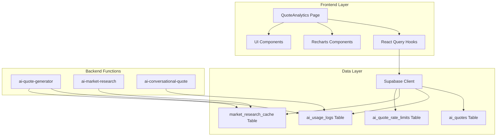
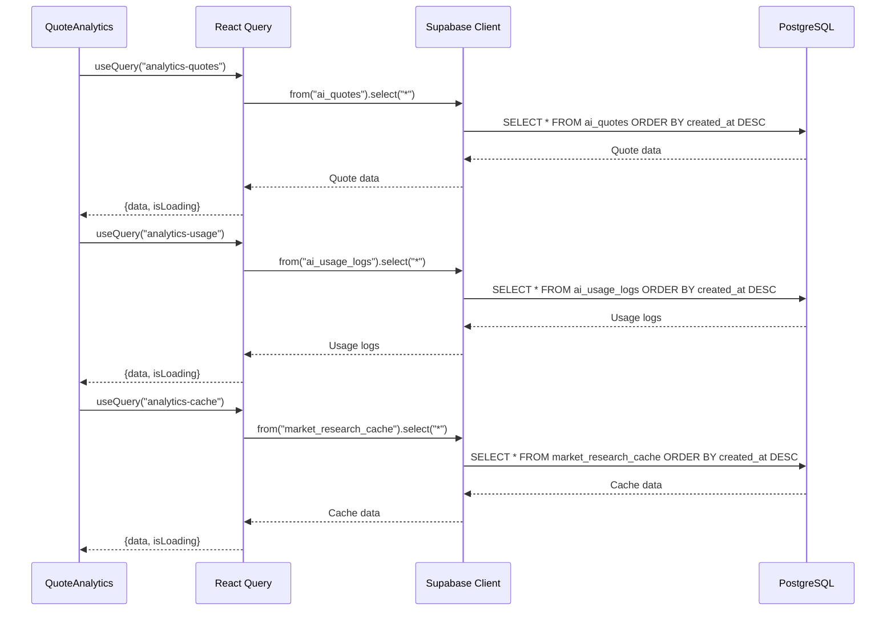
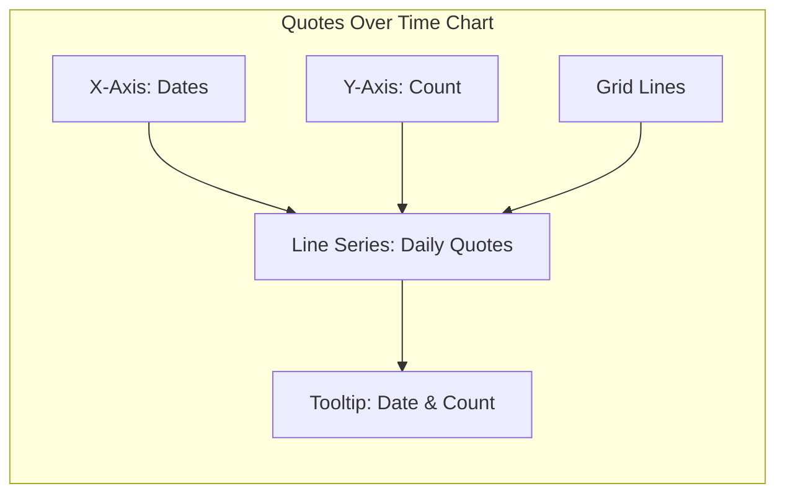
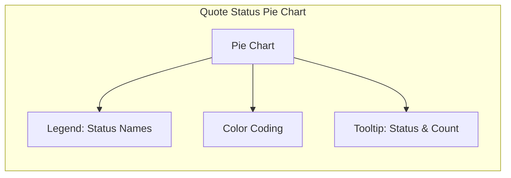
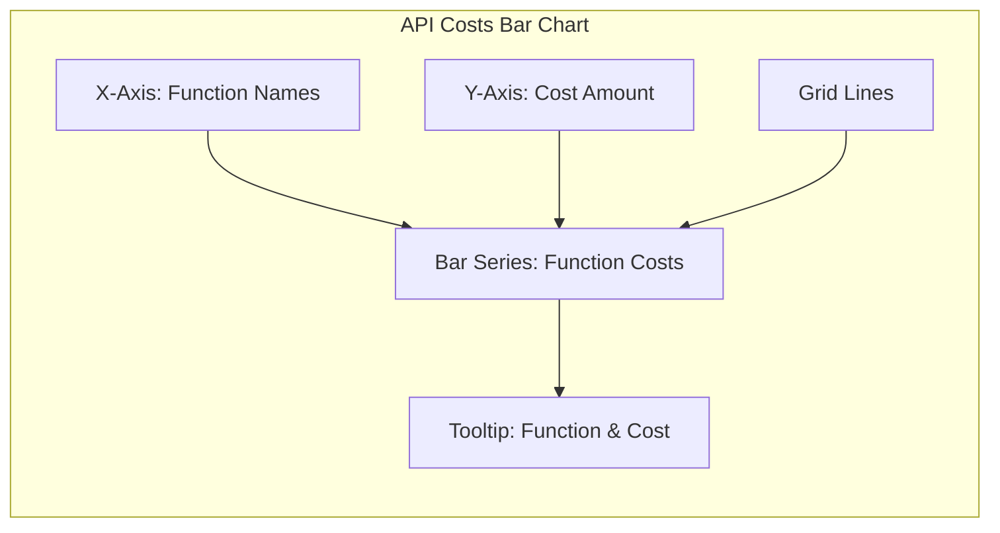
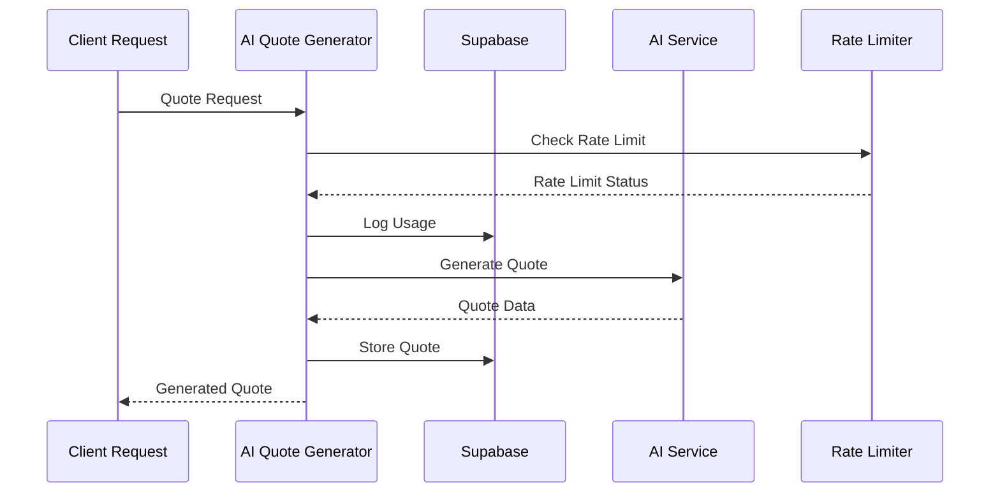
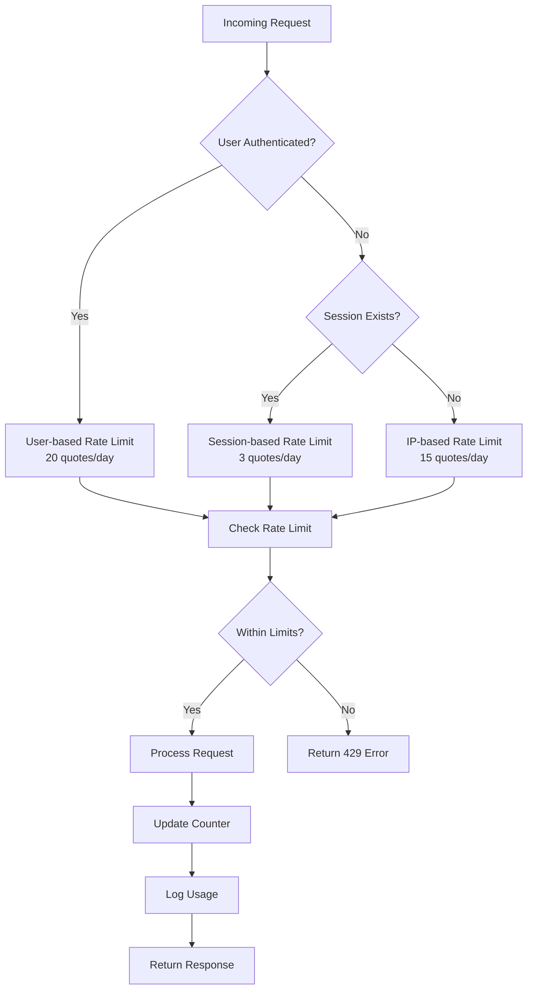

# Quote Analytics

<cite>
**Referenced Files in This Document**
- [QuoteAnalytics.tsx](file://src/pages/QuoteAnalytics.tsx)
- [ai-quote-generator/index.ts](file://supabase/functions/ai-quote-generator/index.ts)
- [ai-market-research/index.ts](file://supabase/functions/ai-market-research/index.ts)
- [TABLES_ONLY.sql](file://supabase/TABLES_ONLY.sql)
- [ai-quote-rate-limits.sql](file://supabase/migrations/20251124164837_4eda3cf0-ab6f-4305-a5fe-82a19c7948d3.sql)
- [ai-usage-logs.sql](file://supabase/migrations/20251124164837_4eda3cf0-ab6f-4305-a5fe-82a19c7948d3.sql)
- [market-research-cache.sql](file://supabase/migrations/20251124164837_4eda3cf0-ab6f-4305-a5fe-82a19c7948d3.sql)
</cite>

## Table of Contents
1. [Introduction](#introduction)
2. [System Architecture](#system-architecture)
3. [Data Sources and Tables](#data-sources-and-tables)
4. [React Query Implementation](#react-query-implementation)
5. [Metrics Calculation](#metrics-calculation)
6. [Recharts Visualizations](#recharts-visualizations)
7. [Backend Integration](#backend-integration)
8. [Rate Limiting System](#rate-limiting-system)
9. [Common Issues and Solutions](#common-issues-and-solutions)
10. [Performance Considerations](#performance-considerations)
11. [Troubleshooting Guide](#troubleshooting-guide)
12. [Conclusion](#conclusion)

## Introduction

The Quote Analytics system is a comprehensive dashboard that tracks and visualizes AI quote generation performance across the Sleek Apparels platform. Built with React Query for data fetching and Recharts for visualization, this system provides real-time insights into quote generation metrics, API costs, confidence scores, and cache performance.

The analytics dashboard serves as a critical monitoring tool for administrators to understand AI quote generation patterns, optimize costs, and ensure optimal system performance. It aggregates data from multiple sources including AI quote generation logs, usage tracking, and market research caching systems.

## System Architecture

The Quote Analytics system follows a modern React-based architecture with Supabase as the backend data layer. The system is designed around several key architectural principles:



**Diagram sources**
- [QuoteAnalytics.tsx](file://src/pages/QuoteAnalytics.tsx#L1-L278)
- [ai-quote-generator/index.ts](file://supabase/functions/ai-quote-generator/index.ts#L1-L753)

**Section sources**
- [QuoteAnalytics.tsx](file://src/pages/QuoteAnalytics.tsx#L1-L278)

## Data Sources and Tables

The Quote Analytics system relies on four primary database tables that provide comprehensive insights into AI quote generation activities:

### ai_quotes Table

The `ai_quotes` table stores all AI-generated quotes with detailed metadata and performance indicators:

| Column | Type | Description | Constraints |
|--------|------|-------------|-------------|
| id | UUID | Unique identifier | PRIMARY KEY |
| created_at | Timestamp | Quote creation time | NOT NULL |
| customer_email | Text | Customer email address | Nullable |
| product_type | Text | Product category | NOT NULL |
| quantity | Integer | Order quantity | NOT NULL |
| total_price | Numeric(10,2) | Calculated price | NOT NULL |
| confidence_score | Numeric | AI confidence level (0-100) | CHECK constraint |
| status | Text | Quote status | Default: 'draft' |
| session_id | Text | User session identifier | Nullable |
| market_research_id | UUID | Reference to cached research | Foreign key |

### ai_usage_logs Table

Tracks API usage and cost estimation for all AI operations:

| Column | Type | Description | Constraints |
|--------|------|-------------|-------------|
| id | UUID | Unique identifier | PRIMARY KEY |
| session_id | Text | Session reference | Nullable |
| user_id | UUID | User reference | Nullable |
| function_name | Text | Called function | NOT NULL |
| estimated_cost | Numeric(10,4) | Estimated API cost | NOT NULL |
| request_data | JSONB | Request parameters | Nullable |
| created_at | Timestamp | Log creation time | Default: now() |

### market_research_cache Table

Caches market research data with 24-hour TTL for performance optimization:

| Column | Type | Description | Constraints |
|--------|------|-------------|-------------|
| id | UUID | Unique identifier | PRIMARY KEY |
| product_category | Text | Product category | NOT NULL |
| quantity_range | Text | Quantity range | NOT NULL |
| research_data | JSONB | Cached research data | NOT NULL |
| sources | Text[] | Data sources array | Default: empty array |
| confidence_score | Numeric | Research confidence (0-100) | CHECK constraint |
| expires_at | Timestamp | Cache expiration | NOT NULL |
| created_at | Timestamp | Cache creation time | Default: now() |

### ai_quote_rate_limits Table

Implements session-based rate limiting with tiered quotas:

| Column | Type | Description | Constraints |
|--------|------|-------------|-------------|
| id | UUID | Unique identifier | PRIMARY KEY |
| identifier | Text | Identifier value | NOT NULL |
| identifier_type | Text | Type: session/user/ip | NOT NULL |
| request_count | Integer | Current request count | Default: 1 |
| window_start | Timestamp | Rate limit window start | NOT NULL |
| created_at | Timestamp | Record creation time | Default: now() |
| updated_at | Timestamp | Last update time | Default: now() |

**Section sources**
- [TABLES_ONLY.sql](file://supabase/TABLES_ONLY.sql#L88-L123)
- [ai-quote-rate-limits.sql](file://supabase/migrations/20251124164837_4eda3cf0-ab6f-4305-a5fe-82a19c7948d3.sql#L1-L43)
- [ai-usage-logs.sql](file://supabase/migrations/20251124164837_4eda3cf0-ab6f-4305-a5fe-82a19c7948d3.sql#L1-L43)
- [market-research-cache.sql](file://supabase/migrations/20251124164837_4eda3cf0-ab6f-4305-a5fe-82a19c7948d3.sql#L1-L43)

## React Query Implementation

The Quote Analytics page utilizes React Query for efficient data fetching and caching. The implementation demonstrates best practices for handling multiple data sources with proper loading states and error handling.

### Data Fetching Strategy



**Diagram sources**
- [QuoteAnalytics.tsx](file://src/pages/QuoteAnalytics.tsx#L8-L45)

### Loading State Management

The system implements comprehensive loading state management to provide immediate feedback during data fetching:

```typescript
// Loading state detection
if (quotesLoading || logsLoading || cacheLoading) {
  return (
    <div className="flex items-center justify-center min-h-screen">
      <Loader2 className="w-8 h-8 animate-spin text-primary" />
    </div>
  );
}
```

### Query Configuration

Each data source uses optimized query configurations:

- **ai_quotes**: Ordered by `created_at` descending for latest quotes
- **ai_usage_logs**: Ordered by `created_at` descending for recent costs
- **market_research_cache**: Ordered by `created_at` descending for active cache

**Section sources**
- [QuoteAnalytics.tsx](file://src/pages/QuoteAnalytics.tsx#L8-L45)

## Metrics Calculation

The Quote Analytics system calculates several key performance metrics to provide comprehensive insights into AI quote generation performance.

### Total Quotes Calculation

The total quotes metric counts all records in the `ai_quotes` table:

```typescript
const totalQuotes = quotes?.length || 0;
```

This provides a straightforward count of all AI-generated quotes, serving as the foundation for other metrics.

### API Cost Aggregation

Total API costs are calculated by summing the `estimated_cost` field from all usage logs:

```typescript
const totalApiCost = usageLogs?.reduce((sum, log) => sum + (log.estimated_cost || 0), 0) || 0;
```

The system handles potential null values safely and provides a running total of all API expenses incurred through AI quote generation.

### Average Confidence Scoring

Confidence scores represent the AI's certainty in quote accuracy:

```typescript
const avgConfidence = quotes?.reduce((sum, q) => sum + (q.confidence_score || 0), 0) / (totalQuotes || 1);
```

The calculation ensures division by zero protection and provides an average confidence score across all quotes.

### Cache Hit Rate

Cache hit rate measures the effectiveness of the market research caching system:

```typescript
const cacheHitRate = cachedResearch?.length || 0;
```

This metric indicates how many cached research entries are currently active, reflecting the system's caching efficiency.

### Advanced Metric Calculations

#### Quotes by Status Distribution

The system categorizes quotes by their current status for operational insights:

```typescript
const quotesByStatus = quotes?.reduce((acc: any, quote) => {
  const status = quote.status || "active";
  acc[status] = (acc[status] || 0) + 1;
  return acc;
}, {});
```

This enables administrators to monitor quote lifecycle progression and identify bottlenecks.

#### Quotes Over Time Analysis

Daily quote generation volume is calculated for trend analysis:

```typescript
const quotesOverTime = quotes?.reduce((acc: any, quote) => {
  const date = new Date(quote.created_at).toLocaleDateString();
  const existing = acc.find((item: any) => item.date === date);
  if (existing) {
    existing.count += 1;
  } else {
    acc.push({ date, count: 1 });
  }
  return acc;
}, []) || [];
```

#### API Costs by Function

Function-specific cost breakdown helps identify expensive operations:

```typescript
const costsByFunction = usageLogs?.reduce((acc: any, log) => {
  const name = log.function_name;
  const existing = acc.find((item: any) => item.name === name);
  if (existing) {
    existing.cost += log.estimated_cost || 0;
    existing.calls += 1;
  } else {
    acc.push({ name, cost: log.estimated_cost || 0, calls: 1 });
  }
  return acc;
}, []) || [];
```

**Section sources**
- [QuoteAnalytics.tsx](file://src/pages/QuoteAnalytics.tsx#L55-L94)

## Recharts Visualizations

The Quote Analytics system employs Recharts for sophisticated data visualization, providing intuitive insights into AI quote generation performance.

### Line Chart: Quotes Over Time



**Diagram sources**
- [QuoteAnalytics.tsx](file://src/pages/QuoteAnalytics.tsx#L158-L166)

The line chart displays daily quote generation volume with:
- **X-Axis**: Formatted dates for temporal analysis
- **Y-Axis**: Quote count for volume tracking
- **Line Series**: Monotone curve showing trends
- **Tooltip**: Interactive data point information
- **Grid Lines**: Enhanced readability

### Pie Chart: Quote Status Distribution



**Diagram sources**
- [QuoteAnalytics.tsx](file://src/pages/QuoteAnalytics.tsx#L176-L194)

Status distribution visualization includes:
- **Status Categories**: Active, draft, completed, etc.
- **Color Coding**: Distinct colors for each status
- **Percentage Labels**: Clear proportion representation
- **Interactive Tooltips**: Detailed status information

### Bar Chart: API Costs by Function



**Diagram sources**
- [QuoteAnalytics.tsx](file://src/pages/QuoteAnalytics.tsx#L206-L214)

Cost breakdown visualization features:
- **Function Names**: Edge function identification
- **Cost Values**: Numerical cost representation
- **Call Counts**: Frequency of function usage
- **Comparative Analysis**: Cost-effectiveness evaluation

### Responsive Container Design

All charts utilize responsive containers for optimal display across devices:

```typescript
<ResponsiveContainer width="100%" height={300}>
  {/* Chart Component */}
</ResponsiveContainer>
```

This ensures consistent visualization quality on desktop, tablet, and mobile devices.

**Section sources**
- [QuoteAnalytics.tsx](file://src/pages/QuoteAnalytics.tsx#L150-L216)

## Backend Integration

The Quote Analytics system integrates seamlessly with multiple backend services to provide comprehensive monitoring capabilities.

### AI Quote Generator Integration

The primary AI quote generator function implements comprehensive logging and rate limiting:



**Diagram sources**
- [ai-quote-generator/index.ts](file://supabase/functions/ai-quote-generator/index.ts#L96-L121)

### Usage Logging Mechanism

The system implements automatic usage logging for cost tracking:

```typescript
async function logAIUsage(
  supabaseClient: any,
  sessionId: string,
  userId: string | null,
  estimatedCost: number,
  requestData: any
): Promise<void> {
  await supabaseClient
    .from('ai_usage_logs')
    .insert({
      session_id: sessionId,
      user_id: userId,
      function_name: 'ai-quote-generator',
      estimated_cost: estimatedCost,
      request_data: requestData
    });
}
```

### Market Research Integration

Market research caching integrates with the analytics system:

```typescript
// Cache research data with confidence scoring
await supabase.from('market_research_cache').insert({
  product_category: productType.toLowerCase(),
  quantity_range: quantityRange,
  research_data: researchData,
  sources: researchData.sources || [],
  confidence_score: researchData.confidenceScore || 70,
  expires_at: expiresAt.toISOString(),
});
```

### Real-time Data Updates

The system supports real-time data updates through React Query's caching mechanism:

- **Automatic Refetching**: Configurable refresh intervals
- **Background Updates**: Seamless data synchronization
- **Optimistic Updates**: Immediate UI feedback
- **Error Recovery**: Graceful handling of network issues

**Section sources**
- [ai-quote-generator/index.ts](file://supabase/functions/ai-quote-generator/index.ts#L96-L121)
- [ai-market-research/index.ts](file://supabase/functions/ai-market-research/index.ts#L222-L236)

## Rate Limiting System

The Quote Analytics system implements a sophisticated rate limiting mechanism to prevent abuse and ensure fair resource allocation.

### Multi-Level Rate Limiting



**Diagram sources**
- [ai-quote-generator/index.ts](file://supabase/functions/ai-quote-generator/index.ts#L37-L94)

### Rate Limiting Implementation

The system implements tiered rate limiting with configurable thresholds:

#### IP-Based Rate Limiting
- **Threshold**: 15 quotes per IP per day
- **Window**: 24-hour rolling window
- **Purpose**: Prevent automated abuse

#### Session-Based Rate Limiting
- **Threshold**: 3 quotes per session per day
- **Window**: 24-hour rolling window
- **Purpose**: Control anonymous usage

#### User-Based Rate Limiting
- **Threshold**: 20 quotes per user per day
- **Window**: 24-hour rolling window
- **Purpose**: Premium user benefits

### Rate Limit Monitoring

The analytics system tracks rate limit violations and effectiveness:

```typescript
// Rate limit check with fallback
const { data: existing, error: fetchError } = await supabaseClient
  .from('ai_quote_rate_limits')
  .select('*')
  .eq('identifier', identifier)
  .eq('identifier_type', identifierType)
  .gte('window_start', windowStart.toISOString())
  .single();

if (fetchError && fetchError.code !== 'PGRST116') {
  console.error('Rate limit check error:', fetchError);
  return { allowed: true, remaining: dailyLimit }; // Fail open
}
```

### Rate Limit Exceeded Handling

When rate limits are exceeded, the system provides clear error messaging:

```typescript
return new Response(
  JSON.stringify({ 
    error: isAuthenticated 
      ? `Daily quote limit reached (${dailyLimit}/day). Limit resets at midnight UTC.`
      : `Daily quote limit reached (${dailyLimit}/day). Sign up for more quotes.`,
    limit: dailyLimit,
    remaining: 0,
    resetTime: resetTime.toISOString(),
    requestId
  }),
  { 
    status: 429, 
    headers: { 
      ...corsHeaders, 
      'Content-Type': 'application/json',
      'X-RateLimit-Limit': dailyLimit.toString(),
      'X-RateLimit-Remaining': '0',
      'X-RateLimit-Reset': resetTime.toISOString()
    } 
  }
);
```

**Section sources**
- [ai-quote-generator/index.ts](file://supabase/functions/ai-quote-generator/index.ts#L37-L94)

## Common Issues and Solutions

### Data Loading States

**Issue**: Users experience prolonged loading times or infinite spinners.

**Solution**: Implement proper loading state management and error boundaries:

```typescript
// Enhanced loading state with timeout
const { data: quotes, isLoading: quotesLoading } = useQuery({
  queryKey: ["analytics-quotes"],
  queryFn: async () => {
    const controller = new AbortController();
    const timeoutId = setTimeout(() => controller.abort(), 10000);
    
    try {
      const { data, error } = await supabase
        .from("ai_quotes")
        .select("*")
        .order("created_at", { ascending: false })
        .throwOnError();
      
      clearTimeout(timeoutId);
      return data;
    } catch (error) {
      clearTimeout(timeoutId);
      throw error;
    }
  },
});
```

### Incomplete Metrics Calculation

**Issue**: Metrics appear incorrect or incomplete due to null values.

**Solution**: Implement robust null checking and default value handling:

```typescript
// Safe metric calculations
const totalQuotes = quotes?.length || 0;
const totalApiCost = usageLogs?.reduce((sum, log) => 
  sum + (log.estimated_cost || 0), 0) || 0;
const avgConfidence = quotes?.reduce((sum, q) => 
  sum + (q.confidence_score || 0), 0) / (totalQuotes || 1);
```

### Cache Invalidation Issues

**Issue**: Cached data becomes stale and doesn't reflect current state.

**Solution**: Implement cache invalidation strategies:

```typescript
// Manual cache invalidation
const queryClient = useQueryClient();
queryClient.invalidateQueries({ queryKey: ["analytics-quotes"] });

// Automatic refetching configuration
const { data: quotes } = useQuery({
  queryKey: ["analytics-quotes"],
  queryFn: fetchQuotes,
  refetchOnWindowFocus: true,
  refetchInterval: 300000, // 5 minutes
});
```

### Performance Degradation

**Issue**: Large datasets cause slow rendering and poor user experience.

**Solution**: Implement data pagination and virtualization:

```typescript
// Pagination for large datasets
const { data: quotes, fetchNextPage, hasNextPage } = useInfiniteQuery({
  queryKey: ["analytics-quotes"],
  queryFn: ({ pageParam = 1 }) => fetchQuotes(pageParam),
  getNextPageParam: (lastPage, pages) => {
    return lastPage.length === pageSize ? pages.length + 1 : undefined;
  },
});
```

### Memory Leaks

**Issue**: Long-running queries consume excessive memory.

**Solution**: Implement proper cleanup and unmount handlers:

```typescript
useEffect(() => {
  const handleVisibilityChange = () => {
    if (document.hidden) {
      // Pause non-critical queries
      queryClient.pause();
    } else {
      // Resume queries
      queryClient.resume();
    }
  };

  document.addEventListener('visibilitychange', handleVisibilityChange);
  return () => {
    document.removeEventListener('visibilitychange', handleVisibilityChange);
    queryClient.cancelQueries({ queryKey: ["analytics-quotes"] });
  };
}, []);
```

## Performance Considerations

### Data Fetching Optimization

The system implements several performance optimization strategies:

#### Query Memoization
React Query automatically memoizes query results, reducing unnecessary re-renders and API calls.

#### Selective Field Retrieval
Instead of fetching all fields, the system retrieves only necessary data:

```typescript
const { data: quotes } = useQuery({
  queryKey: ["analytics-quotes"],
  queryFn: () => supabase
    .from("ai_quotes")
    .select("id, created_at, product_type, quantity, total_price, confidence_score, status")
    .order("created_at", { ascending: false })
    .limit(100),
});
```

#### Background Refetching
Non-blocking data updates keep the interface responsive:

```typescript
refetchOnWindowFocus: true,
refetchOnReconnect: true,
staleTime: 5 * 60 * 1000, // 5 minutes
cacheTime: 10 * 60 * 1000, // 10 minutes
```

### Memory Management

#### Efficient State Updates
The system uses immutable updates to minimize memory allocation:

```typescript
// Immutable array updates
const quotesOverTime = quotes.reduce((acc, quote) => {
  const date = new Date(quote.created_at).toLocaleDateString();
  const existingIndex = acc.findIndex(item => item.date === date);
  
  if (existingIndex >= 0) {
    const updatedAcc = [...acc];
    updatedAcc[existingIndex].count += 1;
    return updatedAcc;
  }
  
  return [...acc, { date, count: 1 }];
}, []);
```

#### Chart Data Optimization
Large datasets are processed efficiently for visualization:

```typescript
// Data aggregation for charts
const chartData = useMemo(() => {
  return quotes.reduce((acc, quote) => {
    const date = new Date(quote.created_at).toLocaleDateString();
    const existing = acc.find(item => item.date === date);
    
    if (existing) {
      existing.count += 1;
    } else {
      acc.push({ date, count: 1 });
    }
    return acc;
  }, []);
}, [quotes]);
```

### Network Optimization

#### Request Deduplication
React Query deduplicates identical requests automatically.

#### Compression
JSON data is compressed for efficient transmission.

#### CDN Integration
Static assets are served through CDN for improved load times.

## Troubleshooting Guide

### Data Not Loading

**Symptoms**: Empty charts or loading spinners persist indefinitely.

**Diagnosis Steps**:
1. Check browser console for network errors
2. Verify Supabase connection status
3. Review database query execution plans
4. Monitor rate limit counters

**Solutions**:
```typescript
// Debug query execution
const { data, error, isLoading } = useQuery({
  queryKey: ["analytics-quotes"],
  queryFn: async () => {
    console.log('Fetching quotes...');
    const { data, error } = await supabase
      .from("ai_quotes")
      .select("*")
      .order("created_at", { ascending: false });
    
    if (error) {
      console.error('Query error:', error);
      throw error;
    }
    
    console.log('Quotes fetched:', data.length);
    return data;
  },
});
```

### Incorrect Metrics Calculation

**Symptoms**: Metrics show unexpected values or trends.

**Diagnosis Steps**:
1. Verify data integrity in source tables
2. Check for null or malformed data
3. Validate calculation logic
4. Review timezone handling

**Solutions**:
```typescript
// Robust metric calculation with validation
const calculateAverage = (values: (number | null | undefined)[]): number => {
  const validValues = values.filter(v => v !== null && v !== undefined) as number[];
  if (validValues.length === 0) return 0;
  
  const sum = validValues.reduce((acc, val) => acc + val, 0);
  return sum / validValues.length;
};

const avgConfidence = calculateAverage(quotes.map(q => q.confidence_score));
```

### Chart Rendering Issues

**Symptoms**: Charts appear blank or distorted.

**Diagnosis Steps**:
1. Check data format and structure
2. Verify Recharts component props
3. Review responsive container configuration
4. Monitor browser console for React errors

**Solutions**:
```typescript
// Chart data validation
const validateChartData = (data: any[]) => {
  return data.filter(item => 
    item && typeof item.value === 'number' && !isNaN(item.value)
  );
};

const validatedData = validateChartData(statusData);
```

### Performance Issues

**Symptoms**: Slow loading or unresponsive interface.

**Diagnosis Steps**:
1. Profile component render times
2. Monitor memory usage
3. Analyze network request patterns
4. Review query complexity

**Solutions**:
```typescript
// Performance optimization
const MemoizedChart = React.memo(({ data }: { data: any[] }) => {
  return (
    <LineChart data={data}>
      {/* Chart configuration */}
    </LineChart>
  );
});

// Debounced data processing
const debouncedData = useDebounce(chartData, 300);
```

**Section sources**
- [QuoteAnalytics.tsx](file://src/pages/QuoteAnalytics.tsx#L47-L53)

## Conclusion

The Quote Analytics system represents a comprehensive solution for monitoring AI quote generation performance in the Sleek Apparels platform. Through its integration of React Query for efficient data management, Recharts for insightful visualization, and robust backend systems for data collection, the system provides administrators with the tools necessary to optimize AI quote generation processes.

Key strengths of the system include:

- **Real-time Monitoring**: Live data updates enable proactive system management
- **Comprehensive Metrics**: Multiple performance indicators provide holistic system insights
- **Scalable Architecture**: Well-designed data fetching and caching mechanisms support growth
- **User Experience**: Intuitive visualizations and responsive design enhance usability
- **Reliability**: Robust error handling and fallback mechanisms ensure system stability

The system's modular design allows for easy extension and customization, making it adaptable to evolving business requirements. Future enhancements could include predictive analytics, automated alerts, and expanded integration with additional AI services.

For developers working with this system, the combination of TypeScript type safety, React Query best practices, and Recharts flexibility provides a solid foundation for building reliable and maintainable analytics solutions.