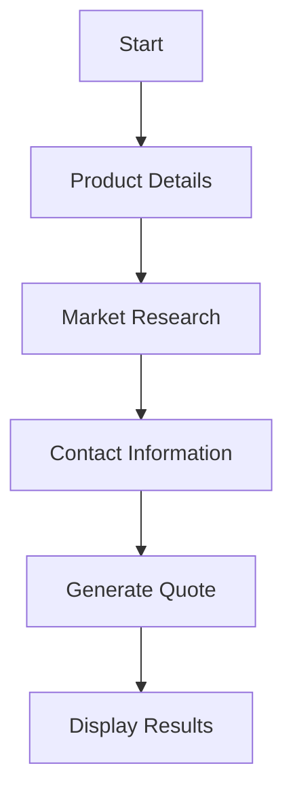
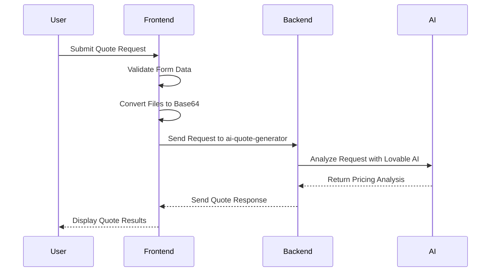
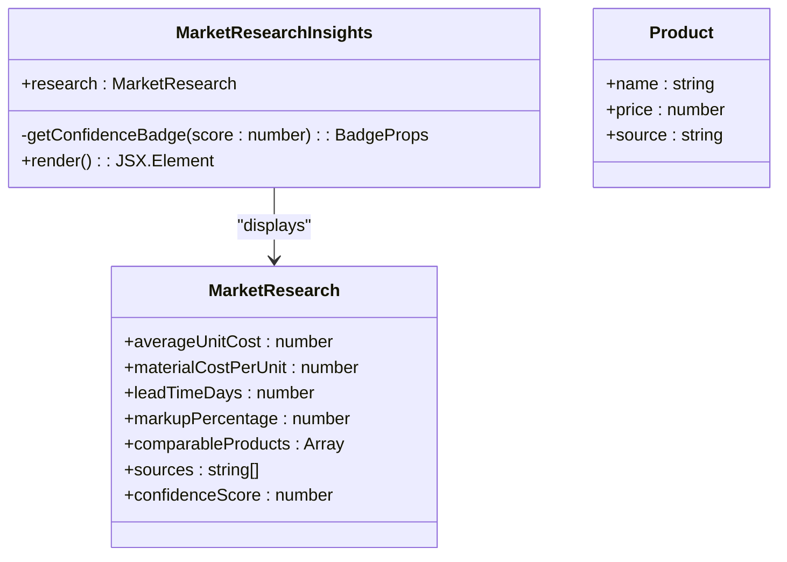
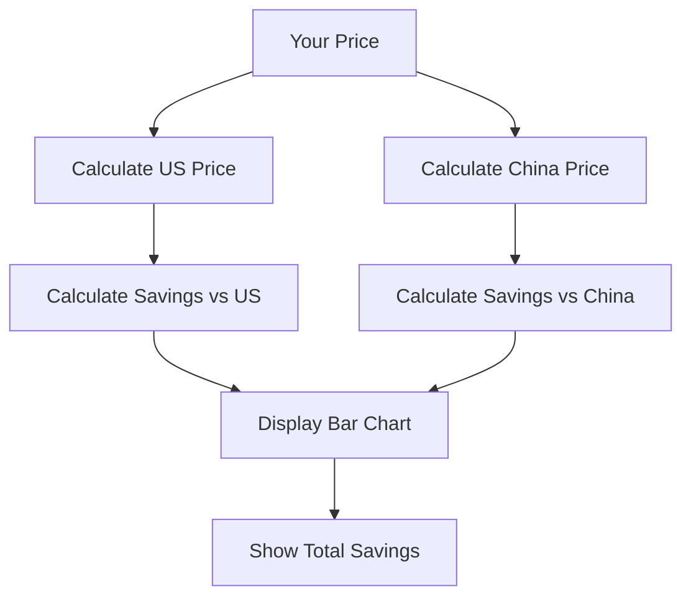
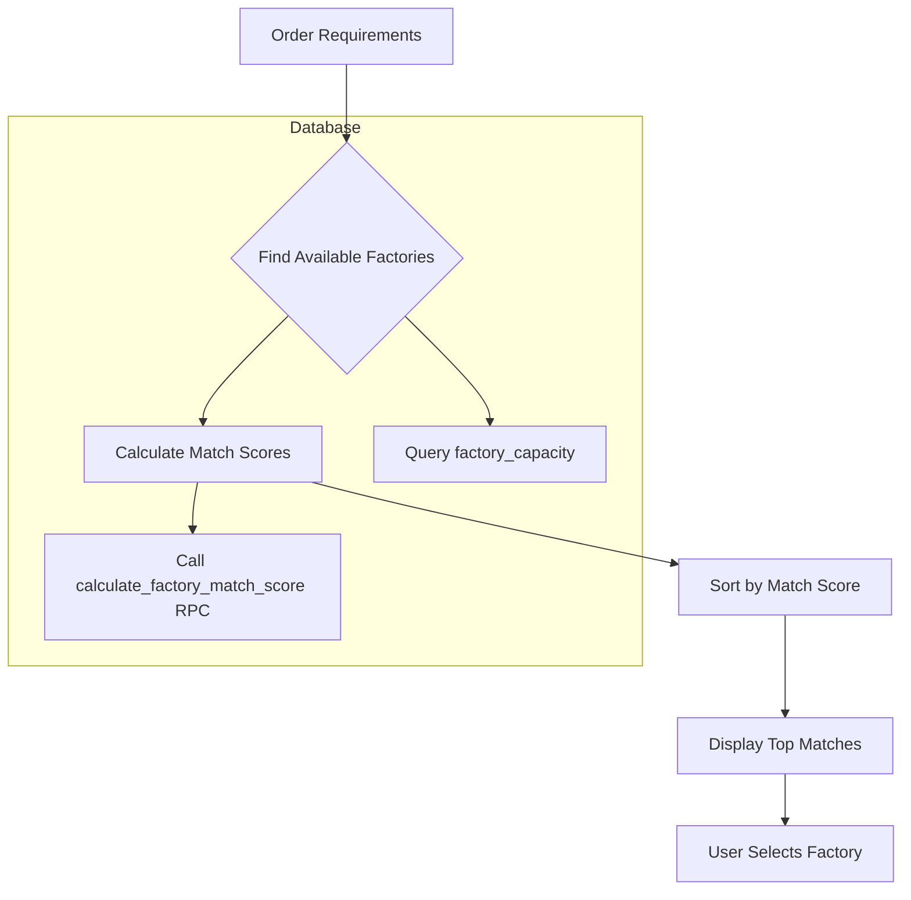
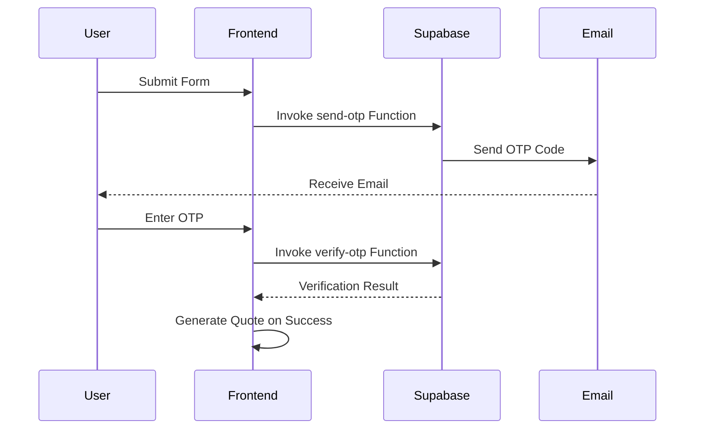
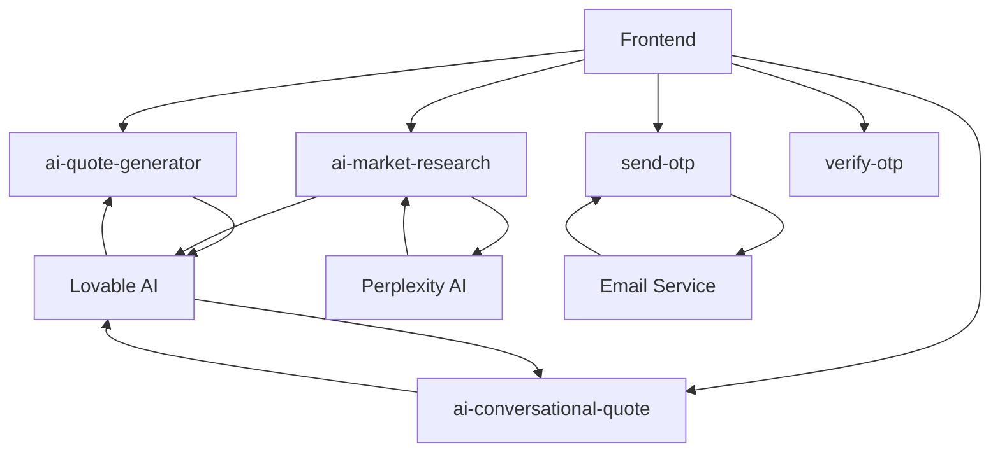

# AI Quote Generator

<cite>
**Referenced Files in This Document**   
- [AIQuoteGenerator.tsx](file://src/components/AIQuoteGenerator.tsx)
- [AIQuoteGeneratorWithOTP.tsx](file://src/components/AIQuoteGeneratorWithOTP.tsx)
- [ConversationalQuoteBuilder.tsx](file://src/components/quote/ConversationalQuoteBuilder.tsx)
- [MarketResearchInsights.tsx](file://src/components/quote/MarketResearchInsights.tsx)
- [PriceComparison.tsx](file://src/components/quote/PriceComparison.tsx)
- [SmartFactoryMatcher.tsx](file://src/components/quote/SmartFactoryMatcher.tsx)
- [aiQuote.ts](file://src/lib/api/aiQuote.ts)
- [ai-quote-generator/index.ts](file://supabase/functions/ai-quote-generator/index.ts)
- [ai-conversational-quote/index.ts](file://supabase/functions/ai-conversational-quote/index.ts)
- [ai-market-research/index.ts](file://supabase/functions/ai-market-research/index.ts)
- [useFactoryCapacity.ts](file://src/hooks/useFactoryCapacity.ts)
- [bangladeshManufacturing.ts](file://src/lib/bangladeshManufacturing.ts)
</cite>

## Table of Contents
1. [Introduction](#introduction)
2. [Conversational Interface](#conversational-interface)
3. [Intelligent Pricing Engine](#intelligent-pricing-engine)
4. [Market Research Integration](#market-research-integration)
5. [Price Comparison Functionality](#price-comparison-functionality)
6. [Smart Factory Matching Algorithm](#smart-factory-matching-algorithm)
7. [OTP Verification Process](#otp-verification-process)
8. [Backend Edge Functions](#backend-edge-functions)
9. [Common Issues and Troubleshooting](#common-issues-and-troubleshooting)
10. [Best Practices](#best-practices)

## Introduction
The AI Quote Generator is a sophisticated system that combines conversational interfaces with intelligent pricing algorithms to provide instant, accurate quotes for apparel manufacturing. This document details the implementation of the ConversationalQuoteBuilder component, the integration with market research data through the MarketResearchInsights component, the PriceComparison functionality, the SmartFactoryMatcher algorithm, and the OTP verification process via the AIQuoteGeneratorWithOTP component. The system leverages backend Edge Functions to power the AI logic and interacts with the frontend API layer to deliver a seamless user experience.

## Conversational Interface
The ConversationalQuoteBuilder component provides a step-by-step interface for collecting quote requirements. It guides users through a three-step process: product details collection, market research results display, and contact information input.

The component uses React state management to track the current step and form data. It validates required fields before proceeding to the next step and provides loading states during API calls. The interface is designed to be intuitive, with clear progression indicators and helpful tooltips.

**Diagram sources**
- [ConversationalQuoteBuilder.tsx](file://src/components/quote/ConversationalQuoteBuilder.tsx#L44-L363)

**Section sources**
- [ConversationalQuoteBuilder.tsx](file://src/components/quote/ConversationalQuoteBuilder.tsx#L44-L363)

## Intelligent Pricing Engine
The intelligent pricing engine combines client-side validation with server-side AI processing to generate accurate quotes. The AIQuoteGenerator component handles form validation, file uploads, and API communication.

The pricing engine uses a multi-step process:
1. Client-side validation using Zod schema
2. File conversion to base64 for API transmission
3. API call to the ai-quote-generator Edge Function
4. Response processing and display

The engine incorporates Bangladesh manufacturing standards and provides detailed breakdowns of costs, including base unit price, complexity factors, volume discounts, and final pricing.

**Diagram sources**
- [AIQuoteGenerator.tsx](file://src/components/AIQuoteGenerator.tsx#L66-L575)
- [aiQuote.ts](file://src/lib/api/aiQuote.ts#L49-L146)
- [ai-quote-generator/index.ts](file://supabase/functions/ai-quote-generator/index.ts#L131-L747)

**Section sources**
- [AIQuoteGenerator.tsx](file://src/components/AIQuoteGenerator.tsx#L66-L575)
- [aiQuote.ts](file://src/lib/api/aiQuote.ts#L49-L146)

## Market Research Integration
The MarketResearchInsights component integrates real-time market data into the quote generation process. It displays key metrics such as average unit cost, material costs, lead times, and market markup percentages.

The component receives research data from the ai-market-research Edge Function and presents it in an easy-to-understand format with confidence scoring. The confidence score is color-coded to indicate data reliability, with green for high confidence, yellow for medium, and orange for estimated values.

**Diagram sources**
- [MarketResearchInsights.tsx](file://src/components/quote/MarketResearchInsights.tsx#L21-L140)
- [ai-market-research/index.ts](file://supabase/functions/ai-market-research/index.ts#L114-L320)

**Section sources**
- [MarketResearchInsights.tsx](file://src/components/quote/MarketResearchInsights.tsx#L21-L140)

## Price Comparison Functionality
The PriceComparison component provides a visual comparison of pricing against competitors. It calculates savings compared to US manufacturers and China competitors, displaying the results in a bar chart format.

The component uses dynamic calculations to determine price differences and total savings. It highlights Sleek Apparels as the best value option with a prominent badge and colored bar. The comparison includes total order savings based on the requested quantity.

**Diagram sources**
- [PriceComparison.tsx](file://src/components/quote/PriceComparison.tsx#L10-L124)

**Section sources**
- [PriceComparison.tsx](file://src/components/quote/PriceComparison.tsx#L10-L124)

## Smart Factory Matching Algorithm
The SmartFactoryMatcher algorithm recommends optimal suppliers based on capabilities and capacity. It uses the useAvailableFactories hook to query the database for factories with sufficient capacity for the requested order.

The algorithm calculates a match score for each factory based on multiple factors including available capacity, performance score, lead time, and current utilization. Factories are sorted by match score in descending order, with the highest matches displayed first.

**Diagram sources**
- [SmartFactoryMatcher.tsx](file://src/components/quote/SmartFactoryMatcher.tsx#L15-L179)
- [useFactoryCapacity.ts](file://src/hooks/useFactoryCapacity.ts#L92-L138)

**Section sources**
- [SmartFactoryMatcher.tsx](file://src/components/quote/SmartFactoryMatcher.tsx#L15-L179)

## OTP Verification Process
The AIQuoteGeneratorWithOTP component implements a two-step verification process that requires email verification before generating a quote. This enhances security and ensures valid contact information.

The process involves:
1. Form submission with email address
2. OTP generation and email delivery
3. User enters 6-digit code
4. OTP verification
5. Quote generation upon successful verification

The component uses Supabase functions to send and verify OTPs, with appropriate error handling and user feedback throughout the process.

**Diagram sources**
- [AIQuoteGeneratorWithOTP.tsx](file://src/components/AIQuoteGeneratorWithOTP.tsx#L56-L776)
- [supabase/functions/send-otp/index.ts](file://supabase/functions/send-otp/index.ts)
- [supabase/functions/verify-otp/index.ts](file://supabase/functions/verify-otp/index.ts)

**Section sources**
- [AIQuoteGeneratorWithOTP.tsx](file://src/components/AIQuoteGeneratorWithOTP.tsx#L56-L776)

## Backend Edge Functions
The AI Quote Generator system relies on several Supabase Edge Functions to handle the core logic. These functions run on Deno and provide the AI processing power behind the scenes.

The key Edge Functions include:
- **ai-quote-generator**: Generates quotes using Lovable AI and Bangladesh manufacturing standards
- **ai-conversational-quote**: Handles conversational quote generation with market research integration
- **ai-market-research**: Performs web searches and structures market data
- **send-otp**: Sends one-time passwords for email verification
- **verify-otp**: Verifies OTP codes for security

These functions implement rate limiting, input validation, and error handling to ensure reliability and security.

**Diagram sources**
- [ai-quote-generator/index.ts](file://supabase/functions/ai-quote-generator/index.ts#L131-L747)
- [ai-conversational-quote/index.ts](file://supabase/functions/ai-conversational-quote/index.ts#L26-L385)
- [ai-market-research/index.ts](file://supabase/functions/ai-market-research/index.ts#L20-L335)

**Section sources**
- [ai-quote-generator/index.ts](file://supabase/functions/ai-quote-generator/index.ts#L131-L747)
- [ai-conversational-quote/index.ts](file://supabase/functions/ai-conversational-quote/index.ts#L26-L385)
- [ai-market-research/index.ts](file://supabase/functions/ai-market-research/index.ts#L20-L335)

## Common Issues and Troubleshooting
Several common issues may arise when using the AI Quote Generator system:

**Incomplete Quote Submissions**
- Ensure all required fields are filled, particularly product type, quantity, and email
- Verify that file uploads are under 20MB and in supported formats (images or PDFs)
- Check for proper internet connectivity during submission

**Matching Failures**
- No available factories: This occurs when no factories have sufficient capacity for the requested order size and timeline
- Solution: Consider adjusting the target date or splitting the order across multiple factories

**OTP Verification Issues**
- Not receiving OTP: Check spam folder and verify email address accuracy
- Invalid OTP: Ensure correct code entry and check for expired codes (valid for 10 minutes)
- Rate limiting: OTP requests are limited to prevent abuse

**Performance Issues**
- Timeout errors: Simplify requirements or reduce file sizes to improve processing time
- Slow responses: The system implements rate limiting (3 quotes per day for anonymous users, 20 for authenticated users)

**Section sources**
- [AIQuoteGenerator.tsx](file://src/components/AIQuoteGenerator.tsx#L123-L235)
- [AIQuoteGeneratorWithOTP.tsx](file://src/components/AIQuoteGeneratorWithOTP.tsx#L175-L345)
- [ai-quote-generator/index.ts](file://supabase/functions/ai-quote-generator/index.ts#L284-L370)

## Best Practices
To optimize quote accuracy and response time, follow these best practices:

**For Users**
- Provide detailed product specifications to improve quote accuracy
- Upload reference images or tech packs to assist AI analysis
- Use realistic quantities that align with standard MOQs (50-100 units)
- Verify email address accuracy for OTP delivery

**For System Optimization**
- Cache market research data to reduce API calls and improve response times
- Implement proper rate limiting to prevent abuse while maintaining accessibility
- Use efficient database queries with appropriate indexing
- Monitor AI costs and optimize model selection based on use case

**For Accuracy Improvement**
- Regularly update manufacturing cost databases with current market data
- Implement feedback loops to refine AI models based on actual production costs
- Validate AI-generated quotes against historical data
- Provide clear disclaimers about reference quotes versus final pricing

**Section sources**
- [AIQuoteGenerator.tsx](file://src/components/AIQuoteGenerator.tsx#L1-L575)
- [aiQuote.ts](file://src/lib/api/aiQuote.ts#L49-L146)
- [bangladeshManufacturing.ts](file://src/lib/bangladeshManufacturing.ts#L1-L309)