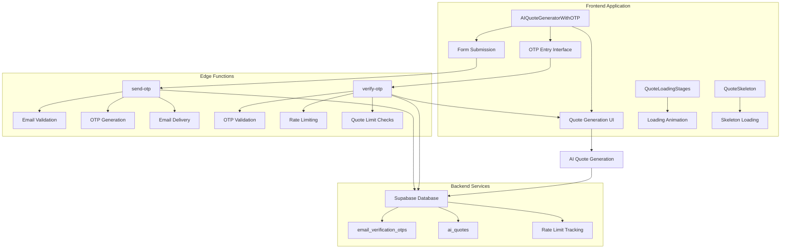
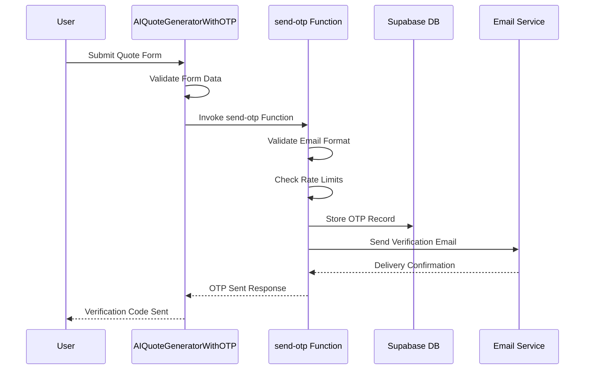
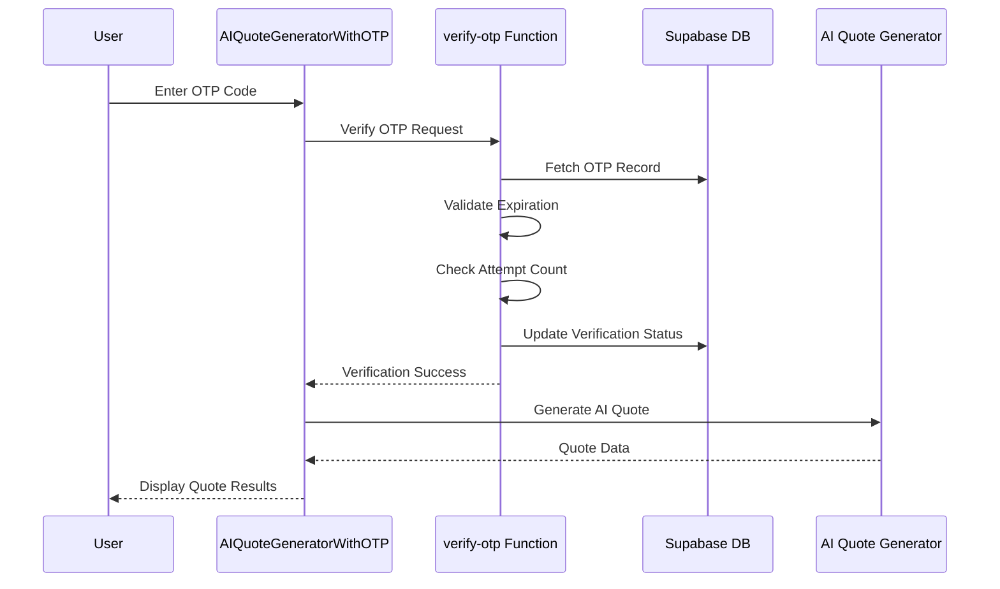
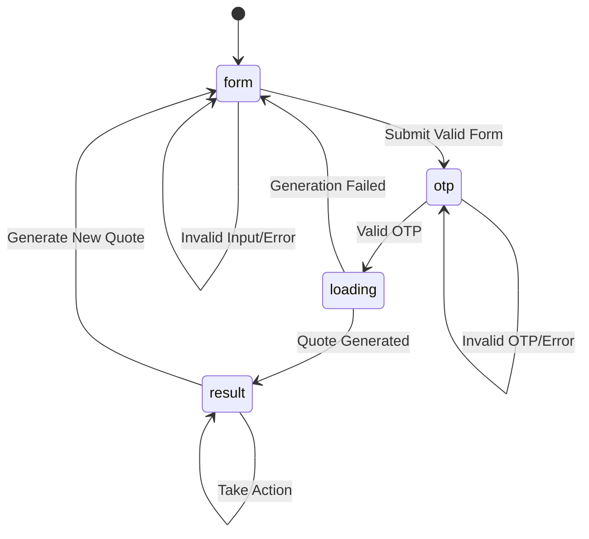
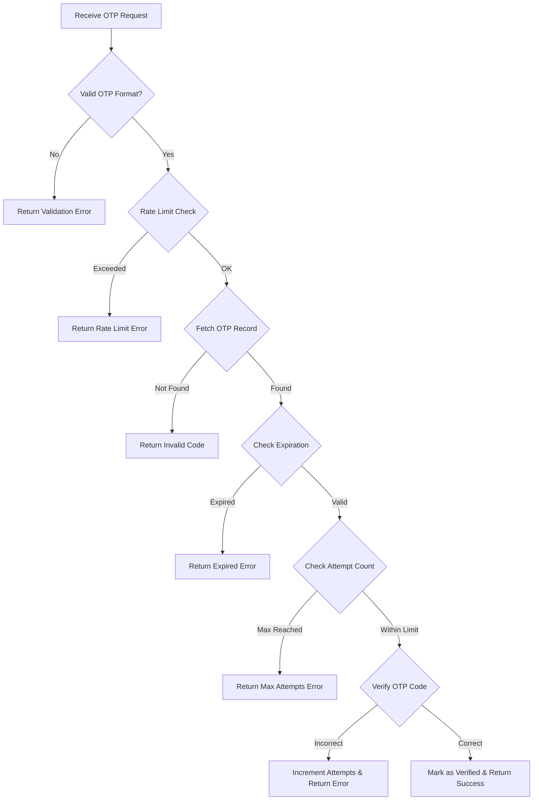
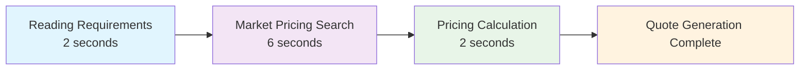

# AI Quote OTP Verification System

<cite>
**Referenced Files in This Document**
- [AIQuoteGeneratorWithOTP.tsx](file://src/components/AIQuoteGeneratorWithOTP.tsx)
- [send-otp/index.ts](file://supabase/functions/send-otp/index.ts)
- [verify-otp/index.ts](file://supabase/functions/verify-otp/index.ts)
- [aiQuote.ts](file://src/lib/api/aiQuote.ts)
- [QuoteLoadingStages.tsx](file://src/components/quote/QuoteLoadingStages.tsx)
- [QuoteSkeleton.tsx](file://src/components/quote/QuoteSkeleton.tsx)
- [client.ts](file://src/integrations/supabase/client.ts)
</cite>

## Table of Contents
1. [Introduction](#introduction)
2. [System Architecture](#system-architecture)
3. [Multi-Step Verification Workflow](#multi-step-verification-workflow)
4. [UI State Management](#ui-state-management)
5. [Edge Functions Implementation](#edge-functions-implementation)
6. [Security Measures](#security-measures)
7. [Error Handling and Recovery](#error-handling-and-recovery)
8. [Performance Optimization](#performance-optimization)
9. [Best Practices](#best-practices)
10. [Troubleshooting Guide](#troubleshooting-guide)

## Introduction

The AI Quote OTP Verification system is a sophisticated email-based authentication mechanism that ensures legitimate users can access instant AI-generated quotes while preventing abuse and spam. This system implements a multi-step verification process that combines form submission, OTP delivery, OTP verification, and quote generation in a seamless user experience.

The system serves as a critical gateway for the AI Quote Generator, requiring email verification before customers can receive pricing information. It balances security requirements with user convenience, implementing rate limiting, validation, and retry mechanisms to maintain system integrity while providing a smooth customer experience.

## System Architecture

The AI Quote OTP Verification system consists of three primary components working together to provide secure quote generation:

**Diagram sources**
- [AIQuoteGeneratorWithOTP.tsx](file://src/components/AIQuoteGeneratorWithOTP.tsx#L56-L1046)
- [send-otp/index.ts](file://supabase/functions/send-otp/index.ts#L131-L489)
- [verify-otp/index.ts](file://supabase/functions/verify-otp/index.ts#L21-L356)

**Section sources**
- [AIQuoteGeneratorWithOTP.tsx](file://src/components/AIQuoteGeneratorWithOTP.tsx#L1-L50)
- [send-otp/index.ts](file://supabase/functions/send-otp/index.ts#L1-L50)
- [verify-otp/index.ts](file://supabase/functions/verify-otp/index.ts#L1-L50)

## Multi-Step Verification Workflow

The system implements a comprehensive four-stage workflow that ensures secure and reliable quote generation:

### Step 1: Form Submission and OTP Request

The process begins when users submit their quote request through the form interface. The system validates input data and initiates the OTP verification process.

**Diagram sources**
- [AIQuoteGeneratorWithOTP.tsx](file://src/components/AIQuoteGeneratorWithOTP.tsx#L175-L237)
- [send-otp/index.ts](file://supabase/functions/send-otp/index.ts#L131-L200)

### Step 2: OTP Delivery and Validation

Once the OTP is generated, the system sends it to the user's email address and prepares for verification. The email contains a six-digit code that expires after 10 minutes.

### Step 3: OTP Verification and Quote Generation

After receiving the OTP, the system validates it against the stored record, checks for rate limits, and proceeds with quote generation if successful.

**Diagram sources**
- [AIQuoteGeneratorWithOTP.tsx](file://src/components/AIQuoteGeneratorWithOTP.tsx#L239-L344)
- [verify-otp/index.ts](file://supabase/functions/verify-otp/index.ts#L180-L341)

### Step 4: Quote Presentation and Actions

The final step presents the generated quote to the user with various action options including order placement, sharing via WhatsApp or email, and viewing quote history.

**Section sources**
- [AIQuoteGeneratorWithOTP.tsx](file://src/components/AIQuoteGeneratorWithOTP.tsx#L239-L344)
- [send-otp/index.ts](file://supabase/functions/send-otp/index.ts#L258-L489)
- [verify-otp/index.ts](file://supabase/functions/verify-otp/index.ts#L180-L341)

## UI State Management

The system manages multiple UI states to provide clear feedback and guidance throughout the verification process:

### State Definitions and Transitions

| State | Description | UI Component | User Actions |
|-------|-------------|--------------|--------------|
| `form` | Initial quote request form | Full form interface | Submit quote request |
| `otp` | OTP verification screen | OTP input field | Enter verification code |
| `loading` | Quote generation in progress | Loading stages animation | Wait for quote |
| `result` | Final quote display | Quote result cards | Take action on quote |

### Form State Management

The form maintains persistent state through React's `useState` hook, allowing users to navigate between steps without losing their input data.

**Diagram sources**
- [AIQuoteGeneratorWithOTP.tsx](file://src/components/AIQuoteGeneratorWithOTP.tsx#L59-L65)

### Local Storage Integration

The system integrates with localStorage for form pre-filling from previous interactions, particularly from the conversational assistant:

- **Key Compatibility**: Supports both `prefilledQuoteData` and `prefilledQuote` for backward compatibility
- **Data Persistence**: Stores parsed quote data for seamless user experience
- **Cleanup**: Automatically removes temporary localStorage entries after use

**Section sources**
- [AIQuoteGeneratorWithOTP.tsx](file://src/components/AIQuoteGeneratorWithOTP.tsx#L66-L110)
- [AIQuoteGeneratorWithOTP.tsx](file://src/components/AIQuoteGeneratorWithOTP.tsx#L59-L65)

## Edge Functions Implementation

The system utilizes two specialized Edge Functions to handle OTP operations securely and efficiently:

### send-otp Function

The `send-otp` function handles the initial OTP generation and email delivery process:

#### Key Features:
- **Email Validation**: Comprehensive email format checking with disposable email detection
- **Rate Limiting**: 5-minute cooldown period for OTP requests
- **Retry Logic**: Automatic retry mechanism for email delivery failures
- **Security Logging**: Detailed audit trail for all operations

#### Email Validation Process:
1. **Format Validation**: Regex-based email format checking
2. **Domain Filtering**: Blocks disposable email domains
3. **Length Constraints**: Validates local and domain parts
4. **Sanitization**: Prevents header injection attacks

#### Rate Limiting Implementation:
- **5-Minute Window**: Prevents abuse through rapid successive requests
- **IP Tracking**: Monitors request patterns for suspicious activity
- **Graceful Degradation**: Provides clear error messages for rate limit violations

**Section sources**
- [send-otp/index.ts](file://supabase/functions/send-otp/index.ts#L16-L130)
- [send-otp/index.ts](file://supabase/functions/send-otp/index.ts#L258-L489)

### verify-otp Function

The `verify-otp` function validates submitted codes and manages quote generation permissions:

#### Security Features:
- **Attempt Limiting**: Maximum 5 attempts per OTP code
- **Expiration Checking**: 10-minute validity window
- **Rate Limiting**: 3 attempts per hour for verification
- **IP Tracking**: Logs all verification attempts for security monitoring

#### Quote Limit Management:
- **Daily Quota**: 3 quotes per email per day for quote requests
- **Type-Specific**: Different limits for different OTP types
- **Real-Time Tracking**: Dynamic quota calculation and display

#### Verification Process:

**Diagram sources**
- [verify-otp/index.ts](file://supabase/functions/verify-otp/index.ts#L180-L341)

**Section sources**
- [verify-otp/index.ts](file://supabase/functions/verify-otp/index.ts#L21-L356)

## Security Measures

The system implements multiple layers of security to protect against abuse while maintaining usability:

### Input Validation and Sanitization

#### Email Security:
- **Header Injection Prevention**: Sanitizes email addresses to prevent malicious headers
- **Disposable Domain Blocking**: Maintains blacklist of temporary email providers
- **Format Validation**: Comprehensive regex validation with length constraints

#### OTP Security:
- **Fixed Length**: Enforces 6-digit OTP requirement
- **Character Restriction**: Allows only numeric characters
- **Attempt Monitoring**: Tracks and limits verification attempts

### Rate Limiting and Abuse Prevention

#### Per-Function Rate Limits:
- **OTP Requests**: 5-minute cooldown between requests
- **Verification Attempts**: 3 attempts per hour
- **Quote Generation**: 3 quotes per day per email

#### IP-Based Monitoring:
- **Attempt Tracking**: Logs all verification attempts with IP addresses
- **Pattern Detection**: Identifies suspicious request patterns
- **Automated Blocking**: Suspicious IPs may trigger additional verification

### Database Security

#### OTP Storage:
- **Encrypted Storage**: OTP codes stored securely in database
- **Automatic Cleanup**: Expired records automatically removed
- **Audit Logging**: Complete audit trail for all OTP operations

#### Session Management:
- **Secure Sessions**: Uses Supabase's secure session management
- **Token Rotation**: Regular token refresh for long sessions
- **Cross-Site Protection**: CSRF protection for all operations

**Section sources**
- [send-otp/index.ts](file://supabase/functions/send-otp/index.ts#L46-L130)
- [verify-otp/index.ts](file://supabase/functions/verify-otp/index.ts#L67-L88)

## Error Handling and Recovery

The system implements comprehensive error handling to provide clear feedback and recovery options:

### Error Categories and Responses

| Error Type | Frontend Handling | Backend Response | User Action |
|------------|-------------------|------------------|-------------|
| Invalid Form Data | Real-time validation | Zod schema errors | Fix input fields |
| OTP Delivery Failure | Toast notification | Email service errors | Try again later |
| Invalid OTP | Highlight input | Attempt counter | Re-enter code |
| Rate Limit Exceeded | Graceful degradation | 429 status code | Wait for cooldown |
| Quote Generation Failed | Error boundary | AI service errors | Retry quote |

### Recovery Mechanisms

#### Automatic Retry Logic:
- **Email Delivery**: Up to 2 retry attempts with exponential backoff
- **AI Quote Generation**: Up to 2 retry attempts with timeout handling
- **Database Operations**: Transaction rollback on failure

#### User-Friendly Error Messages:
- **Clear Descriptions**: Specific error messages for each failure scenario
- **Actionable Guidance**: Instructions for resolving common issues
- **Progressive Disclosure**: Detailed logs hidden behind debug modes

### Common Error Scenarios

#### Failed OTP Delivery:
- **Network Issues**: Temporary connectivity problems
- **Email Provider**: Spam filters or inbox capacity
- **Rate Limiting**: Too many requests in short period

#### Expired Codes:
- **User Delay**: Taking too long to enter code
- **System Latency**: Processing delays affecting timing
- **Browser Issues**: Session timeouts or cache problems

#### Invalid OTP Entries:
- **Typographical Errors**: Mistyped digits or wrong format
- **Expired Codes**: Using code after expiration
- **Multiple Attempts**: Exceeding maximum attempts

**Section sources**
- [AIQuoteGeneratorWithOTP.tsx](file://src/components/AIQuoteGeneratorWithOTP.tsx#L217-L237)
- [AIQuoteGeneratorWithOTP.tsx](file://src/components/AIQuoteGeneratorWithOTP.tsx#L328-L344)

## Performance Optimization

The system incorporates several performance optimization strategies to ensure fast and responsive user experiences:

### Loading State Management

#### Progressive Loading Stages:
The system uses a multi-stage loading animation to provide realistic progress feedback during quote generation:

**Diagram sources**
- [QuoteLoadingStages.tsx](file://src/components/quote/QuoteLoadingStages.tsx#L12-L43)

#### Skeleton Loading:
Provides immediate visual feedback while data loads, reducing perceived latency and improving user satisfaction.

### Network Optimization

#### Request Debouncing:
- **Form Submission**: Debounced to prevent accidental multiple submissions
- **OTP Verification**: Throttled to prevent abuse while maintaining responsiveness
- **Quote Generation**: Optimized API calls with appropriate timeouts

#### Caching Strategies:
- **Session Persistence**: Local storage for form data continuity
- **Rate Limit Memory**: In-memory tracking for immediate response
- **Static Assets**: CDN delivery for UI components and fonts

### Database Optimization

#### Efficient Queries:
- **Indexed Lookups**: OTP records indexed by email and creation time
- **Limited Results**: Single-record queries for OTP verification
- **Batch Operations**: Grouped database operations for better throughput

#### Connection Pooling:
- **Supabase Integration**: Automatic connection management
- **Edge Function Scaling**: Dynamic resource allocation based on demand

**Section sources**
- [QuoteLoadingStages.tsx](file://src/components/quote/QuoteLoadingStages.tsx#L50-L76)
- [QuoteSkeleton.tsx](file://src/components/quote/QuoteSkeleton.tsx#L1-L90)

## Best Practices

### Secure Implementation Guidelines

#### Email Verification Best Practices:
- **Double Validation**: Server-side validation after client-side
- **Rate Limiting**: Implement per-user and per-IP rate limits
- **Logging**: Comprehensive audit trails for security monitoring
- **User Experience**: Clear error messages and helpful guidance

#### OTP Security Guidelines:
- **Random Generation**: Cryptographically secure OTP generation
- **Short Lifespan**: 10-minute expiration with automatic cleanup
- **Attempt Limiting**: Maximum 5 attempts per code
- **Storage Security**: Encrypted storage with proper access controls

#### Error Handling Standards:
- **User-Friendly Messages**: Clear, actionable error descriptions
- **Graceful Degradation**: Maintain functionality during partial failures
- **Progressive Enhancement**: Basic functionality works without JavaScript
- **Accessibility**: Screen reader compatible error messages

### User Experience Optimization

#### Form Design Principles:
- **Progressive Disclosure**: Show only relevant fields initially
- **Real-time Validation**: Immediate feedback on input changes
- **Mobile Responsiveness**: Touch-friendly interfaces for mobile devices
- **Accessibility Compliance**: WCAG 2.1 AA level accessibility

#### Loading Experience:
- **Meaningful Progress**: Realistic loading indicators
- **Offline Capability**: Graceful handling of network issues
- **Performance Metrics**: Monitor and optimize key performance indicators
- **User Feedback**: Clear communication during long operations

### Maintenance and Monitoring

#### Operational Excellence:
- **Health Checks**: Regular system health monitoring
- **Performance Metrics**: Track key performance indicators
- **Error Rate Monitoring**: Alerting for unusual error patterns
- **Capacity Planning**: Scale resources based on usage patterns

#### Security Monitoring:
- **Abuse Detection**: Automated detection of suspicious patterns
- **Incident Response**: Clear procedures for security incidents
- **Regular Audits**: Periodic security assessments and updates
- **Compliance**: Adherence to relevant regulations and standards

**Section sources**
- [AIQuoteGeneratorWithOTP.tsx](file://src/components/AIQuoteGeneratorWithOTP.tsx#L175-L237)
- [send-otp/index.ts](file://supabase/functions/send-otp/index.ts#L131-L200)

## Troubleshooting Guide

### Common Issues and Solutions

#### OTP Delivery Problems

**Issue**: Email not received
- **Cause**: Spam filters, incorrect email format, or delivery failures
- **Solution**: Check spam folder, verify email format, try different email provider
- **Prevention**: Implement email validation and provide clear error messages

**Issue**: OTP expires quickly
- **Cause**: Slow user response or system latency
- **Solution**: Provide clear expiration countdown and retry options
- **Prevention**: Optimize system performance and provide generous time windows

#### Verification Failures

**Issue**: Invalid OTP despite correct entry
- **Cause**: Typographical errors, expired codes, or system bugs
- **Solution**: Clear error messaging with retry options
- **Prevention**: Implement character validation and provide visual assistance

**Issue**: Rate limit exceeded
- **Cause**: Too many attempts or rapid successive requests
- **Solution**: Clear cooldown messaging with estimated reset times
- **Prevention**: Implement intelligent rate limiting with user education

#### Quote Generation Issues

**Issue**: AI quote generation fails
- **Cause**: Server overload, validation errors, or network issues
- **Solution**: Implement retry logic with exponential backoff
- **Prevention**: Monitor system health and implement circuit breakers

**Issue**: Poor quote quality
- **Cause**: Insufficient input data or system limitations
- **Solution**: Provide guidance for better input and fallback options
- **Prevention**: Implement input validation and quality checks

### Debugging Tools and Techniques

#### Frontend Debugging:
- **Console Logging**: Comprehensive logging for development
- **Error Boundaries**: Graceful error handling for React components
- **Performance Profiling**: Identify bottlenecks in component rendering
- **Network Monitoring**: Track API call performance and failures

#### Backend Debugging:
- **Structured Logging**: Centralized logging with correlation IDs
- **Database Monitoring**: Track query performance and optimization
- **Edge Function Debugging**: Local testing with mock environments
- **Security Auditing**: Regular security scans and vulnerability assessments

#### User Support Procedures:
- **Self-Service Options**: Clear instructions for common issues
- **Escalation Paths**: Defined procedures for complex problems
- **Feedback Collection**: User feedback mechanisms for continuous improvement
- **Documentation**: Comprehensive troubleshooting guides and FAQs

**Section sources**
- [AIQuoteGeneratorWithOTP.tsx](file://src/components/AIQuoteGeneratorWithOTP.tsx#L328-L344)
- [send-otp/index.ts](file://supabase/functions/send-otp/index.ts#L480-L489)
- [verify-otp/index.ts](file://supabase/functions/verify-otp/index.ts#L348-L356)