# Conversational Quote Builder

<cite>
**Referenced Files in This Document**
- [ConversationalQuoteBuilder.tsx](file://src/components/quote/ConversationalQuoteBuilder.tsx)
- [ai-market-research/index.ts](file://supabase/functions/ai-market-research/index.ts)
- [ai-conversational-quote/index.ts](file://supabase/functions/ai-conversational-quote/index.ts)
- [aiQuote.ts](file://src/lib/api/aiQuote.ts)
- [MarketResearchInsights.tsx](file://src/components/quote/MarketResearchInsights.tsx)
- [InteractiveQuoteDisplay.tsx](file://src/components/quote/InteractiveQuoteDisplay.tsx)
- [QuoteGenerator.tsx](file://src/pages/QuoteGenerator.tsx)
- [bangladeshManufacturing.ts](file://src/lib/bangladeshManufacturing.ts)
- [20251126173430_ebd0f1c8-4897-4156-9576-206e95a66988.sql](file://supabase/migrations/20251126173430_ebd0f1c8-4897-4156-9576-206e95a66988.sql)
</cite>

## Table of Contents
1. [Introduction](#introduction)
2. [System Architecture](#system-architecture)
3. [Three-Step Process Implementation](#three-step-process-implementation)
4. [Form State Management](#form-state-management)
5. [AI-Powered Market Research Integration](#ai-powered-market-research-integration)
6. [Final Quote Generation](#final-quote-generation)
7. [Session Persistence and Security](#session-persistence-and-security)
8. [Error Handling and User Experience](#error-handling-and-user-experience)
9. [Best Practices and Common Issues](#best-practices-and-common-issues)
10. [Technical Implementation Details](#technical-implementation-details)

## Introduction

The Conversational Quote Builder is an advanced AI-powered quote generation system that provides customers with instant, market-researched pricing for apparel manufacturing in Bangladesh. Built as a three-step conversational interface, it combines real-time market data with intelligent AI processing to deliver accurate, competitive quotes tailored to specific customer requirements.

The system integrates seamlessly with Supabase Edge Functions for AI-driven market research and quote generation, while maintaining robust session persistence and comprehensive error handling. It serves as a cornerstone component for Sleek Apparels' digital transformation, enabling efficient quote management and customer engagement.

## System Architecture

The Conversational Quote Builder follows a sophisticated multi-layered architecture that separates concerns between frontend presentation, backend processing, and external AI services.


**Diagram sources**
- [ConversationalQuoteBuilder.tsx](file://src/components/quote/ConversationalQuoteBuilder.tsx#L43-L363)
- [ai-market-research/index.ts](file://supabase/functions/ai-market-research/index.ts#L20-L335)
- [ai-conversational-quote/index.ts](file://supabase/functions/ai-conversational-quote/index.ts#L26-L385)

**Section sources**
- [ConversationalQuoteBuilder.tsx](file://src/components/quote/ConversationalQuoteBuilder.tsx#L1-L363)
- [ai-market-research/index.ts](file://supabase/functions/ai-market-research/index.ts#L1-L335)
- [ai-conversational-quote/index.ts](file://supabase/functions/ai-conversational-quote/index.ts#L1-L385)

## Three-Step Process Implementation

The Conversational Quote Builder implements a carefully designed three-step process that guides users through product details collection, market research display, and final quote generation.

### Step 1: Product Details Collection

The first step captures essential product information to enable accurate market research and quote generation.


**Diagram sources**
- [ConversationalQuoteBuilder.tsx](file://src/components/quote/ConversationalQuoteBuilder.tsx#L65-L109)

The product details form collects:
- **Product Type**: Essential garment categories (T-shirts, Hoodies, Uniforms, etc.)
- **Quantity**: Minimum order quantities for market research accuracy
- **Fabric Type**: Material specifications for cost calculation
- **Complexity Level**: Simple, Medium, or Complex for production estimation
- **Additional Requirements**: Customizations, printing, embroidery, etc.

### Step 2: Market Research Display

After collecting initial product details, the system presents comprehensive market research insights before proceeding to customer information collection.


**Diagram sources**
- [ai-market-research/index.ts](file://supabase/functions/ai-market-research/index.ts#L145-L270)
- [MarketResearchInsights.tsx](file://src/components/quote/MarketResearchInsights.tsx#L21-L140)

### Step 3: Final Quote Generation

The final step generates a comprehensive quote based on collected data and market research, presented in an interactive format.

```mermaid
flowchart TD
Step2["Step 2: Contact Info"] --> ValidateEmail["Validate Email Address"]
ValidateEmail --> EmailValid{"Email<br/>Provided?"}
EmailValid --> |No| ShowEmailError["Show Toast Error:<br/>Email Required"]
EmailValid --> |Yes| CallQuoteGen["Call ai-conversational-quote<br/>Edge Function"]
CallQuoteGen --> GenSuccess{"Quote<br/>Generated?"}
GenSuccess --> |No| ShowGenError["Show Toast Error:<br/>Quote Generation Failed"]
GenSuccess --> |Yes| DisplayQuote["Display InteractiveQuoteDisplay"]
DisplayQuote --> UserActions["User Actions:<br/>• Get New Quote<br/>• Accept Quote"]
ShowEmailError --> Step2
ShowGenError --> Step2
UserActions --> NewQuote["Start New Quote"]
UserActions --> AcceptQuote["Accept Quote"]
NewQuote --> ResetState["Reset All Form State"]
AcceptQuote --> Complete([Quote Process Complete])
ResetState --> Step1
```



**Diagram sources**
- [ConversationalQuoteBuilder.tsx](file://src/components/quote/ConversationalQuoteBuilder.tsx#L112-L162)
- [InteractiveQuoteDisplay.tsx](file://src/components/quote/InteractiveQuoteDisplay.tsx#L45-L230)

**Section sources**
- [ConversationalQuoteBuilder.tsx](file://src/components/quote/ConversationalQuoteBuilder.tsx#L43-L363)
- [MarketResearchInsights.tsx](file://src/components/quote/MarketResearchInsights.tsx#L1-L140)
- [InteractiveQuoteDisplay.tsx](file://src/components/quote/InteractiveQuoteDisplay.tsx#L1-L230)

## Form State Management

The component utilizes React's `useState` hook extensively to manage complex form state across multiple steps and data types.

### State Structure and Management


**Diagram sources**
- [ConversationalQuoteBuilder.tsx](file://src/components/quote/ConversationalQuoteBuilder.tsx#L12-L63)

### State Initialization and Updates

The component initializes state for all form fields and maintains separate state for loading indicators and step progression. Each form field is managed independently with dedicated state setters:

- **Product Information**: `productType`, `quantity`, `fabricType`, `complexity`, `additionalRequirements`
- **Customer Information**: `customerEmail`, `customerName`, `country`, `phoneNumber`
- **Processing State**: `loading`, `researchLoading`
- **Step Management**: `step`
- **Results Storage**: `marketResearch`, `quote`, `marketResearchId`

### Conditional Rendering Logic

The component employs sophisticated conditional rendering to display appropriate UI elements based on the current step and data availability:

```typescript
// Step-based rendering
{step === 1 && <ProductDetailsForm />}
{step === 2 && marketResearch && <MarketResearchDisplay />}
{step === 3 && quote && <FinalQuoteDisplay />}

// Loading states
<Button disabled={loading || researchLoading}>
  {loading ? <Spinner /> : "Generate Quote"}
</Button>
```

**Section sources**
- [ConversationalQuoteBuilder.tsx](file://src/components/quote/ConversationalQuoteBuilder.tsx#L44-L63)

## AI-Powered Market Research Integration

The market research functionality is powered by a sophisticated Edge Function that integrates multiple AI services to gather and structure competitive pricing data.

### Market Research Workflow


**Diagram sources**
- [ai-market-research/index.ts](file://supabase/functions/ai-market-research/index.ts#L120-L270)

### Data Collection and Processing

The market research system employs multiple data sources and processing stages:

1. **Search Query Construction**: Dynamic queries built from product specifications
2. **Web Search Integration**: Perplexity API for real-time market data
3. **Data Structuring**: Lovable AI for JSON format conversion
4. **Caching Strategy**: 24-hour cache with quantity-based categorization
5. **Confidence Scoring**: Automated quality assessment of research data

### Research Data Structure

The market research system returns comprehensive data including:

| Field | Type | Description |
|-------|------|-------------|
| `averageUnitCost` | number | Mean cost per unit from verified sources |
| `materialCostPerUnit` | number | Fabric and material expenses per unit |
| `leadTimeDays` | number | Standard production and delivery timeline |
| `markupPercentage` | number | Industry-standard pricing markup |
| `comparableProducts` | Array | 3-5 competitive products with pricing |
| `sources` | Array | URLs of verified data sources |
| `confidenceScore` | number | Quality assessment (0-100) |

**Section sources**
- [ai-market-research/index.ts](file://supabase/functions/ai-market-research/index.ts#L1-L335)
- [MarketResearchInsights.tsx](file://src/components/quote/MarketResearchInsights.tsx#L1-L140)

## Final Quote Generation

The final quote generation process combines market research data with customer-specific requirements to produce accurate, competitive pricing.

### Quote Generation Architecture


**Diagram sources**
- [ai-conversational-quote/index.ts](file://supabase/functions/ai-conversational-quote/index.ts#L149-L285)

### Quote Data Structure

The final quote includes comprehensive pricing breakdown and justification:

| Component | Type | Purpose |
|-----------|------|---------|
| `unitPrice` | number | Calculated price per unit |
| `totalPrice` | number | Quantity × unitPrice |
| `estimatedDeliveryDays` | number | Production + shipping timeline |
| `confidenceScore` | number | AI-generated confidence level |
| `priceBreakdown` | object | Material, labor, overhead, margin |
| `priceJustification` | string | AI-generated pricing rationale |
| `comparableProducts` | Array | Market comparison data |
| `suggestions` | string | Helpful buyer recommendations |

### AI-Powered Quote Generation

The quote generation process leverages advanced AI capabilities:

1. **Context Integration**: Market research data combined with customer requirements
2. **Multi-stage Processing**: Structured prompts for comprehensive analysis
3. **Quality Assurance**: Confidence scoring and validation mechanisms
4. **Data Persistence**: Comprehensive quote storage with metadata

**Section sources**
- [ai-conversational-quote/index.ts](file://supabase/functions/ai-conversational-quote/index.ts#L1-L385)
- [InteractiveQuoteDisplay.tsx](file://src/components/quote/InteractiveQuoteDisplay.tsx#L1-L230)

## Session Persistence and Security

The system implements robust session management using localStorage for anonymous users while maintaining security through IP binding and rate limiting.

### Session Management Strategy


**Diagram sources**
- [ConversationalQuoteBuilder.tsx](file://src/components/quote/ConversationalQuoteBuilder.tsx#L122-L125)
- [ai-conversational-quote/index.ts](file://supabase/functions/ai-conversational-quote/index.ts#L320-L345)

### Security Measures

The system implements multiple layers of security:

1. **IP Binding**: Session validation tied to originating IP address
2. **Rate Limiting**: Configurable limits per IP and email address
3. **CAPTCHA Protection**: Google reCAPTCHA verification
4. **Session Window**: 5-minute access window for anonymous users
5. **Data Encryption**: Secure transmission of sensitive information

### Database Schema Enhancements

The migration includes significant security improvements:

- **IP Address Tracking**: Added `ip_address` column to `ai_quotes` table
- **Enhanced RLS Policies**: IP-bound session access with 5-minute windows
- **Restricted Views**: Public supplier views without sensitive contact info
- **Consistent Time Windows**: Unified 5-minute session access across components

**Section sources**
- [ConversationalQuoteBuilder.tsx](file://src/components/quote/ConversationalQuoteBuilder.tsx#L122-L125)
- [20251126173430_ebd0f1c8-4897-4156-9576-206e95a66988.sql](file://supabase/migrations/20251126173430_ebd0f1c8-4897-4156-9576-206e95a66988.sql#L34-L66)

## Error Handling and User Experience

The system implements comprehensive error handling with user-friendly toast notifications and graceful degradation strategies.

### Error Handling Architecture


**Diagram sources**
- [ConversationalQuoteBuilder.tsx](file://src/components/quote/ConversationalQuoteBuilder.tsx#L65-L162)

### Toast Notification System

The component integrates with a centralized toast notification system for consistent user feedback:

| Error Type | Toast Variant | Message Content |
|------------|---------------|-----------------|
| Missing Information | destructive | "Please provide product type and quantity" |
| Research Failed | destructive | "Unable to gather market data. Please try again." |
| Email Required | destructive | "Please provide your email address" |
| Quote Generation Failed | destructive | "Unable to generate quote. Please try again." |
| Research Complete | default | "📊 Research Retrieved / 🔍 Research Complete" |
| Quote Generated | default | "✨ Quote Generated with confidence score" |

### Graceful Degradation

The system handles various failure scenarios gracefully:

1. **Network Failures**: Automatic retry with exponential backoff
2. **API Errors**: Fallback to cached data when available
3. **Validation Errors**: Immediate user feedback with specific guidance
4. **Rate Limiting**: Clear messaging with retry timing information
5. **CAPTCHA Failures**: Security event logging with user notification

**Section sources**
- [ConversationalQuoteBuilder.tsx](file://src/components/quote/ConversationalQuoteBuilder.tsx#L65-L162)
- [ai-market-research/index.ts](file://supabase/functions/ai-market-research/index.ts#L321-L334)
- [ai-conversational-quote/index.ts](file://supabase/functions/ai-conversational-quote/index.ts#L371-L384)

## Best Practices and Common Issues

### Form Validation Best Practices

1. **Immediate Feedback**: Validate fields on change with real-time error messages
2. **Progressive Disclosure**: Show optional fields only when relevant
3. **Clear Error Messages**: Provide actionable guidance for field corrections
4. **Field Dependencies**: Disable dependent fields until prerequisites are met
5. **Accessibility**: Ensure screen reader compatibility with proper labeling

### Common Issues and Solutions

| Issue | Cause | Solution |
|-------|-------|----------|
| Missing Required Fields | User skips mandatory inputs | Implement field validation with clear error messages |
| Failed API Calls | Network connectivity or service downtime | Implement retry logic with exponential backoff |
| Rate Limit Exceeded | Too many requests from same IP | Display friendly rate limit messages with timing |
| CAPTCHA Failures | Bot detection false positives | Provide clear CAPTCHA instructions and retry options |
| Session Timeout | Long user sessions | Implement session refresh mechanisms |
| Cache Stale Data | Outdated cached market research | Implement cache invalidation strategies |

### Performance Optimization

1. **Form Debouncing**: Prevent excessive API calls during rapid input changes
2. **Conditional Loading**: Load market research only when product details are complete
3. **State Optimization**: Use minimal state updates to prevent unnecessary re-renders
4. **Cache Management**: Implement intelligent cache warming and invalidation
5. **Bundle Splitting**: Separate AI quote generation from market research functions

### User Guidance Strategies

1. **Progress Indicators**: Show loading states with meaningful progress information
2. **Help Text**: Provide contextual assistance for complex form fields
3. **Example Values**: Include realistic examples for quantity and fabric type fields
4. **Step Navigation**: Clearly indicate current step and progress
5. **Confirmation Dialogs**: Warn users before resetting multi-step forms

**Section sources**
- [ConversationalQuoteBuilder.tsx](file://src/components/quote/ConversationalQuoteBuilder.tsx#L65-L162)
- [ai-market-research/index.ts](file://supabase/functions/ai-market-research/index.ts#L321-L334)
- [ai-conversational-quote/index.ts](file://supabase/functions/ai-conversational-quote/index.ts#L371-L384)

## Technical Implementation Details

### Edge Function Integration

The system leverages Supabase Edge Functions for AI-powered processing, providing scalable, serverless computation for market research and quote generation.

### API Communication Patterns


**Diagram sources**
- [ConversationalQuoteBuilder.tsx](file://src/components/quote/ConversationalQuoteBuilder.tsx#L76-L141)
- [ai-market-research/index.ts](file://supabase/functions/ai-market-research/index.ts#L76-L170)
- [ai-conversational-quote/index.ts](file://supabase/functions/ai-conversational-quote/index.ts#L154-L285)

### Database Schema Considerations

The system's database schema supports comprehensive quote tracking with security-focused access controls:

- **AI Quotes Table**: Stores generated quotes with metadata and pricing data
- **Market Research Cache**: Caches processed research data with TTL management
- **Rate Limiting**: Tracks request frequency per IP and email address
- **Security Events**: Logs suspicious activities for monitoring

### Monitoring and Analytics

The system includes comprehensive monitoring capabilities:

1. **Usage Analytics**: Track quote generation frequency and success rates
2. **Performance Metrics**: Monitor API response times and error rates
3. **Security Monitoring**: Log CAPTCHA failures and rate limit violations
4. **User Behavior**: Analyze form completion rates and drop-off points

**Section sources**
- [ConversationalQuoteBuilder.tsx](file://src/components/quote/ConversationalQuoteBuilder.tsx#L1-L363)
- [ai-market-research/index.ts](file://supabase/functions/ai-market-research/index.ts#L1-L335)
- [ai-conversational-quote/index.ts](file://supabase/functions/ai-conversational-quote/index.ts#L1-L385)
- [QuoteGenerator.tsx](file://src/pages/QuoteGenerator.tsx#L1-L42)