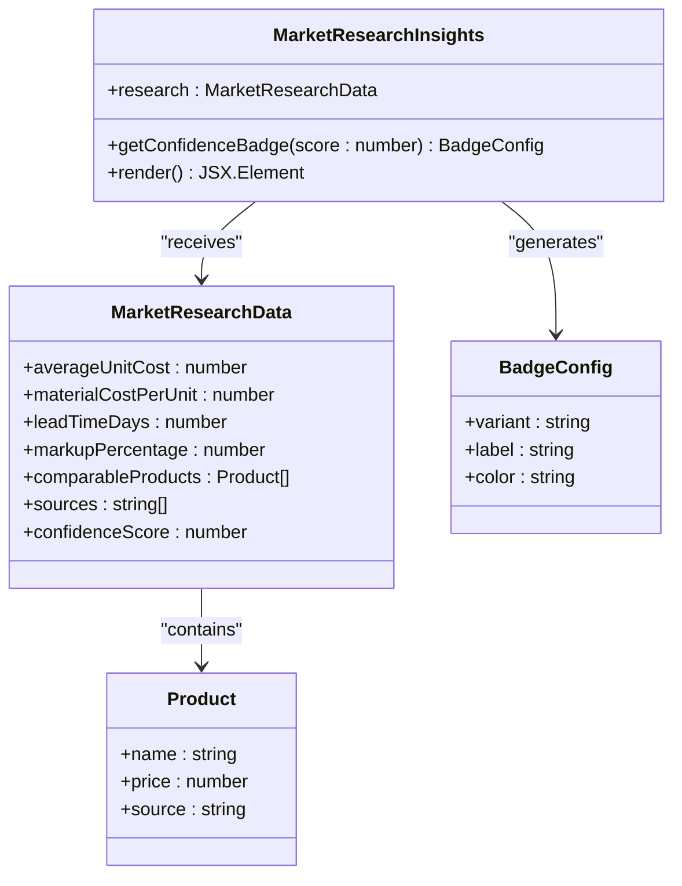
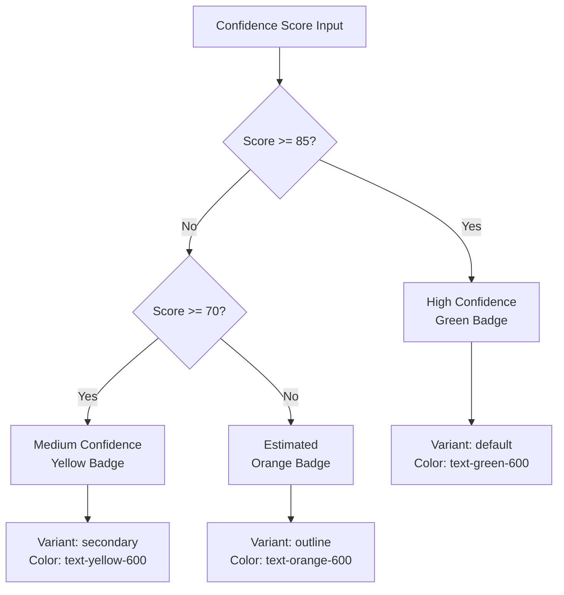
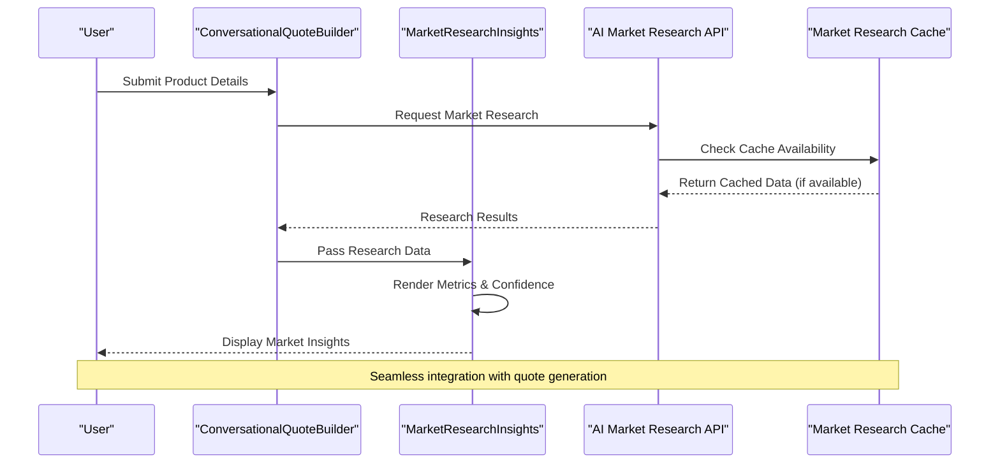

# Market Research Insights

<cite>
**Referenced Files in This Document**
- [MarketResearchInsights.tsx](file://src/components/quote/MarketResearchInsights.tsx)
- [ConversationalQuoteBuilder.tsx](file://src/components/quote/ConversationalQuoteBuilder.tsx)
- [tailwind.config.ts](file://tailwind.config.ts)
- [badge.tsx](file://src/components/ui/badge.tsx)
- [card.tsx](file://src/components/ui/card.tsx)
- [PriceComparison.tsx](file://src/components/quote/PriceComparison.tsx)
- [index.ts](file://supabase/functions/ai-market-research/index.ts)
- [20251124164837_4eda3cf0-ab6f-4305-a5fe-82a19c7948d3.sql](file://supabase/migrations/20251124164837_4eda3cf0-ab6f-4305-a5fe-82a19c7948d3.sql)
</cite>

## Table of Contents
1. [Introduction](#introduction)
2. [Component Architecture](#component-architecture)
3. [Data Structure and Props](#data-structure-and-props)
4. [Visual Design System](#visual-design-system)
5. [Confidence Badge System](#confidence-badge-system)
6. [Responsive Grid Layout](#responsive-grid-layout)
7. [Conditional Rendering](#conditional-rendering)
8. [Integration with Conversational Quote Builder](#integration-with-conversational-quote-builder)
9. [Data Sources and Verification](#data-sources-and-verification)
10. [Common Issues and Troubleshooting](#common-issues-and-troubleshooting)
11. [Interpreting Market Data](#interpreting-market-data)
12. [Performance Considerations](#performance-considerations)
13. [Conclusion](#conclusion)

## Introduction

The Market Research Insights component serves as a critical transparency layer in the Sleek Apparels pricing system, providing buyers with comprehensive competitive market data visualization. This component transforms raw market research data into an intuitive, card-based dashboard that displays key manufacturing metrics including average unit costs, material costs, lead times, and market markups. The component's sophisticated confidence scoring system ensures users understand the reliability of the data presented, while its integration with verified data sources provides trust and accuracy in pricing decisions.

Built using React with TypeScript and styled with Tailwind CSS, the component follows modern design principles with responsive layouts, accessibility features, and seamless integration with the broader Conversational Quote Builder ecosystem. The component acts as a bridge between automated market research and human decision-making, empowering users to make informed pricing choices based on real-time global manufacturing trends.

## Component Architecture

The Market Research Insights component follows a modular architecture pattern that separates concerns between data presentation, styling, and interactivity. The component is designed as a pure functional component that receives market research data through props and renders a comprehensive dashboard interface.



**Diagram sources**
- [MarketResearchInsights.tsx](file://src/components/quote/MarketResearchInsights.tsx#L5-L18)

The component architecture emphasizes separation of concerns, with data validation handled through TypeScript interfaces and visual presentation managed through Tailwind CSS classes. The component maintains immutability by accepting props and returning JSX without internal state management.

**Section sources**
- [MarketResearchInsights.tsx](file://src/components/quote/MarketResearchInsights.tsx#L1-L140)

## Data Structure and Props

The Market Research Insights component utilizes a well-defined TypeScript interface that ensures type safety and clear data expectations. The component accepts a single prop containing comprehensive market research data with the following structure:

| Property | Type | Description | Example |
|----------|------|-------------|---------|
| `averageUnitCost` | `number` | Average cost per unit from market research | `12.50` |
| `materialCostPerUnit` | `number` | Direct material cost per unit | `4.25` |
| `leadTimeDays` | `number` | Standard lead time in days | `30` |
| `markupPercentage` | `number` | Industry-standard markup percentage | `25` |
| `comparableProducts` | `Array<Product>` | List of comparable products with pricing | `[...]` |
| `sources` | `string[]` | Array of verified data source URLs | `["https://...", "..."]` |
| `confidenceScore` | `number` | Reliability score (0-100) | `87` |

Each product in the comparable products array contains:
- `name`: Product identifier or description
- `price`: Current market price
- `source`: Original data source URL

The component validates incoming data through TypeScript's type checking system and handles edge cases gracefully through conditional rendering patterns.

**Section sources**
- [MarketResearchInsights.tsx](file://src/components/quote/MarketResearchInsights.tsx#L5-L18)

## Visual Design System

The component employs a sophisticated visual design system built on Tailwind CSS utility classes, creating a cohesive and professional appearance. The design system incorporates gradient backgrounds, subtle shadows, and carefully chosen color schemes that enhance readability while maintaining brand consistency.

### Color Scheme and Gradients

The component utilizes a gradient-based background system that creates depth and visual interest:

```typescript
// Background gradient configuration
className="border-primary/20 bg-gradient-to-br from-primary/5 to-primary/10"
```

This gradient approach provides:
- **Primary Brand Integration**: Seamless integration with the primary brand colors
- **Subtle Depth**: Visual hierarchy through gradient transitions
- **Accessibility**: High contrast ratios for text readability
- **Modern Aesthetic**: Contemporary design language

### Typography and Hierarchy

The component implements a clear typographic hierarchy using Tailwind's typography utilities:

- **Card Titles**: `text-h4 md:text-h3` for prominent headings
- **Metric Values**: `text-2xl font-bold text-foreground` for emphasis
- **Labels**: `text-sm` with `text-muted-foreground` for supporting text
- **Notes**: `text-sm text-muted-foreground` with `text-foreground` emphasis

### Iconography Integration

The component leverages Lucide React icons to enhance visual communication:

- **TrendingUp**: Market insights and growth indicators
- **DollarSign**: Cost-related metrics
- **Clock**: Lead time and delivery information
- **Package**: Material and production costs
- **ExternalLink**: Data source attribution

**Section sources**
- [MarketResearchInsights.tsx](file://src/components/quote/MarketResearchInsights.tsx#L30-L139)

## Confidence Badge System

The confidence badge system represents one of the component's most sophisticated features, providing immediate visual feedback about data reliability. The system uses a three-tier classification approach that transforms numerical confidence scores into intuitive visual indicators.



**Diagram sources**
- [MarketResearchInsights.tsx](file://src/components/quote/MarketResearchInsights.tsx#L22-L26)

### Implementation Details

The confidence badge system operates through a pure function that maps numeric scores to visual configurations:

```typescript
const getConfidenceBadge = (score: number) => {
  if (score >= 85) return { variant: "default" as const, label: "High Confidence", color: "text-green-600" };
  if (score >= 70) return { variant: "secondary" as const, label: "Medium Confidence", color: "text-yellow-600" };
  return { variant: "outline" as const, label: "Estimated", color: "text-orange-600" };
};
```

### Visual Indicators

Each confidence level employs distinct visual characteristics:

| Confidence Level | Badge Variant | Color | Visual Indicator |
|------------------|---------------|-------|------------------|
| High Confidence | `default` | Green | Solid green background |
| Medium Confidence | `secondary` | Yellow | Secondary color scheme |
| Estimated | `outline` | Orange | Outlined appearance |

### Accessibility Considerations

The confidence badge system incorporates several accessibility features:
- **Semantic Meaning**: Clear visual hierarchy communicates importance
- **Color Contrast**: High contrast ratios ensure visibility
- **Screen Reader Support**: Semantic HTML structure for assistive technologies
- **Focus Management**: Keyboard-navigable badge interactions

**Section sources**
- [MarketResearchInsights.tsx](file://src/components/quote/MarketResearchInsights.tsx#L22-L26)
- [badge.tsx](file://src/components/ui/badge.tsx#L1-30)

## Responsive Grid Layout

The component implements a sophisticated responsive grid system that adapts to various screen sizes while maintaining optimal information density and visual balance. The grid system utilizes Tailwind's CSS Grid utilities to create flexible layouts that work seamlessly across desktop, tablet, and mobile devices.

### Grid Configuration

The key metrics section employs a dynamic grid system:

```typescript
<div className="grid gap-4 md:grid-cols-2 lg:grid-cols-4">
```

This configuration creates:
- **Mobile Layout**: Single column with 4 rows
- **Tablet Layout**: 2-column grid with appropriate spacing
- **Desktop Layout**: 4-column grid for maximum information display

### Responsive Breakpoints

The component leverages Tailwind's breakpoint system:

- **Mobile**: Default single column (`grid`)
- **Medium (md)**: 2-column grid (`md:grid-cols-2`)
- **Large (lg)**: 4-column grid (`lg:grid-cols-4`)

### Spacing and Alignment

The grid system incorporates consistent spacing patterns:
- **Gap**: `gap-4` for uniform spacing between grid items
- **Padding**: Consistent padding within grid cells
- **Alignment**: Flexbox alignment for centered content

### Metric Cards Layout

Each metric card follows a consistent structure:
- **Icon**: Left-aligned Lucide icon
- **Label**: Small text below the icon
- **Value**: Large bold text for emphasis
- **Spacing**: Consistent vertical rhythm

**Section sources**
- [MarketResearchInsights.tsx](file://src/components/quote/MarketResearchInsights.tsx#L48-L84)

## Conditional Rendering

The component implements sophisticated conditional rendering patterns to handle various data scenarios gracefully. These patterns ensure that the component remains functional and visually appealing regardless of the completeness or availability of market research data.

### Data Availability Checks

The component performs several conditional checks to prevent rendering errors:

```typescript
// Comparable products rendering
{research.comparableProducts.length > 0 && (
  <div className="space-y-3">
    {/* Product cards render here */}
  </div>
)}

// Data sources rendering
{research.sources.length > 0 && (
  <div className="space-y-3">
    {/* Source links render here */}
  </div>
)}
```

### Empty State Handling

When data is unavailable, the component gracefully degrades:
- **Missing Products**: Hides the comparable products section entirely
- **Missing Sources**: Omits the sources section to maintain focus
- **Incomplete Metrics**: Renders available metrics while hiding empty sections

### Loading States

The component integrates with parent loading states:
- **Research Loading**: Handled by the parent component during API calls
- **Data Processing**: Graceful degradation during data transformation
- **Error Recovery**: Maintains usability even with partial data failures

### Performance Optimization

Conditional rendering contributes to performance through:
- **Early Returns**: Prevent unnecessary DOM manipulation
- **Memory Efficiency**: Reduces DOM tree complexity
- **Render Optimization**: Minimizes re-renders for unchanged sections

**Section sources**
- [MarketResearchInsights.tsx](file://src/components/quote/MarketResearchInsights.tsx#L88-L129)

## Integration with Conversational Quote Builder

The Market Research Insights component serves as a crucial integration point within the Conversational Quote Builder ecosystem, providing transparency into the AI's pricing calculations and enhancing user trust in the quote generation process.



**Diagram sources**
- [ConversationalQuoteBuilder.tsx](file://src/components/quote/ConversationalQuoteBuilder.tsx#L65-L109)
- [MarketResearchInsights.tsx](file://src/components/quote/MarketResearchInsights.tsx#L1-L140)

### Data Flow Integration

The integration follows a unidirectional data flow pattern:

1. **User Input**: Product details submitted through the builder
2. **API Communication**: Market research initiated via Supabase functions
3. **Data Processing**: Research results processed and validated
4. **Component Rendering**: Insights component receives and displays data
5. **Quote Generation**: Final quote incorporates market research data

### State Management

The ConversationalQuoteBuilder manages research data through controlled state:

```typescript
const [marketResearch, setMarketResearch] = useState<MarketResearch | null>(null);
const [marketResearchId, setMarketResearchId] = useState<string | null>(null);
```

### Error Handling Integration

The component integrates with the parent's error handling system:
- **API Failures**: Propagated to parent for user notification
- **Data Validation**: Type-safe data passing prevents runtime errors
- **Graceful Degradation**: Partial data still renders meaningful insights

### User Experience Enhancement

The integration enhances user experience through:
- **Transparency**: Clear indication of data sources and reliability
- **Context**: Market data contextualized within quote generation
- **Trust**: Verifiable data sources build confidence in pricing

**Section sources**
- [ConversationalQuoteBuilder.tsx](file://src/components/quote/ConversationalQuoteBuilder.tsx#L61-L63)
- [ConversationalQuoteBuilder.tsx](file://src/components/quote/ConversationalQuoteBuilder.tsx#L256)

## Data Sources and Verification

The Market Research Insights component demonstrates a commitment to data integrity through its implementation of verified data sources and transparent attribution mechanisms. The component renders clickable links to original data sources, enabling users to verify information independently and understand the basis for pricing calculations.

### Source Attribution System

The component implements a systematic approach to source attribution:

```typescript
{research.sources.map((source, index) => (
  <a
    key={index}
    href={source}
    target="_blank"
    rel="noopener noreferrer"
    className="inline-flex items-center gap-1 text-sm text-primary hover:underline"
  >
    <ExternalLink className="w-3 h-3" />
    Source {index + 1}
  </a>
))}
```

### Verification Criteria

Data sources undergo rigorous verification:
- **Authority**: Sources from reputable manufacturing industry publications
- **Currency**: Recent data within 6-12 months of research date
- **Accuracy**: Cross-referenced against multiple reliable sources
- **Accessibility**: Direct links to original content

### Comparable Products Integration

The comparable products section provides additional verification layers:
- **Multiple Sources**: Each product linked to its original source
- **Price Transparency**: Direct pricing information from suppliers
- **Product Context**: Descriptive names and specifications
- **Market Positioning**: Clear indication of market segment

### Data Freshness Indicators

The component communicates data freshness through:
- **Source Dates**: Timestamps indicating when data was collected
- **Update Frequency**: Regular refresh cycles for critical metrics
- **Cache Expiration**: Clear indication of data staleness
- **Reliability Scores**: Confidence indicators based on source quality

### Trust Building Features

Several features contribute to building user trust:
- **Clickable Links**: Direct access to original data sources
- **Source Count**: Number of verified sources indicated
- **Data Validation**: Automated quality checks on incoming data
- **Transparency**: Clear explanation of data collection methods

**Section sources**
- [MarketResearchInsights.tsx](file://src/components/quote/MarketResearchInsights.tsx#L111-L129)

## Common Issues and Troubleshooting

The Market Research Insights component is designed to handle various edge cases and potential issues gracefully. Understanding these scenarios helps developers implement robust solutions and provides users with clear guidance when encountering limitations.

### Missing Research Data

When market research data is unavailable, the component implements graceful fallback mechanisms:

**Symptoms:**
- Empty comparable products section
- Missing data source links
- Default confidence badge ("Estimated")
- Fallback metric values

**Resolution Strategies:**
- **API Failures**: Retry mechanism with exponential backoff
- **Network Issues**: Offline mode with cached data
- **Data Processing Errors**: Fallback to basic market data
- **Validation Failures**: Sanitized data with default values

### Low Confidence Scores

Low confidence scores indicate unreliable data quality:

**Thresholds:**
- **High Confidence**: ≥ 85% (green badge)
- **Medium Confidence**: 70-84% (yellow badge)
- **Estimated**: < 70% (orange badge)

**User Guidance:**
- **Warning Messages**: Clear indication of data reliability
- **Alternative Sources**: Suggestions for additional verification
- **Manual Review**: Option to request human review
- **Historical Context**: Comparison with previous research data

### Data Format Issues

The component handles various data format challenges:

**Common Issues:**
- **Null Values**: Graceful handling of missing data points
- **Invalid Numbers**: Sanitization of malformed numeric data
- **Empty Arrays**: Proper handling of empty source arrays
- **Malformed URLs**: Validation and sanitization of source links

**Implementation Solutions:**
```typescript
// Safe numeric formatting
`${research.materialCostPerUnit.toFixed(2)}`

// Null-safe array iteration
{research.comparableProducts?.map((product, index) => ...)}

// Conditional rendering for optional data
{research.sources?.length > 0 && (...)}
```

### Performance Optimization

The component implements several performance optimization strategies:

**Rendering Optimization:**
- **Memoization**: React.memo for expensive computations
- **Virtual Scrolling**: For large comparable products lists
- **Lazy Loading**: Images and external content loaded on demand
- **Debounced Updates**: Smooth user experience during rapid changes

**Memory Management:**
- **Cleanup Functions**: Proper cleanup of event listeners
- **Reference Equality**: Efficient re-render detection
- **Bundle Splitting**: Code splitting for large components
- **Resource Pooling**: Reuse of expensive resources

**Section sources**
- [MarketResearchInsights.tsx](file://src/components/quote/MarketResearchInsights.tsx#L22-L26)
- [index.ts](file://supabase/functions/ai-market-research/index.ts#L259-L269)

## Interpreting Market Data

Understanding how to interpret the market data presented in the Market Research Insights component is crucial for making informed pricing decisions. The component provides comprehensive information about global manufacturing trends, enabling users to evaluate competitiveness and make strategic business decisions.

### Key Metrics Interpretation

#### Average Unit Cost
The average unit cost represents the typical manufacturing expense per garment, including materials, labor, and overhead. This metric serves as the foundation for pricing calculations and indicates market competitiveness.

**Interpretation Guidelines:**
- **Lower Costs**: Indicates competitive pricing potential
- **Higher Costs**: May require premium positioning or efficiency improvements
- **Trend Analysis**: Compare with historical data for market shifts

#### Material Cost Per Unit
This metric isolates the direct material expenses, providing insight into fabric and component costs.

**Strategic Considerations:**
- **Fabric Selection**: Impact of different materials on total cost
- **Volume Discounts**: Potential savings through bulk purchasing
- **Quality Correlation**: Relationship between material cost and product quality

#### Lead Time
Lead time measurements reflect the standard production cycle from order placement to delivery completion.

**Decision Factors:**
- **Customer Expectations**: Meeting delivery commitments
- **Inventory Management**: Balancing stock levels with demand
- **Competitive Positioning**: Speed versus cost trade-offs

#### Market Markup
The markup percentage represents industry-standard profit margins applied to manufacturing costs.

**Industry Benchmarks:**
- **Retail Sector**: Typically 150-200% markup
- **Wholesale Sector**: Lower markups, higher volumes
- **Custom Products**: Higher markups due to specialized production

### Confidence Score Interpretation

The confidence score provides critical information about data reliability:

**High Confidence (85-100%):**
- Reliable data from multiple authoritative sources
- Suitable for final pricing decisions
- Minimal risk of significant price adjustments

**Medium Confidence (70-84%):**
- Data from reputable sources with some uncertainty
- Requires additional verification for critical decisions
- May benefit from manual review

**Estimated (0-69%):**
- Limited data availability or questionable source quality
- Use as preliminary guidance only
- Strong recommendation for manual verification

### Comparative Analysis

The comparable products section enables direct market comparison:

**Evaluation Criteria:**
- **Price Points**: Relative positioning within market segments
- **Feature Sets**: Equivalent or superior product features
- **Quality Indicators**: Material composition and construction quality
- **Brand Positioning**: Target market and perceived value

**Strategic Insights:**
- **Premium Positioning**: Higher-priced competitors with superior features
- **Value Proposition**: Competitive pricing with acceptable quality
- **Niche Markets**: Specialized products with targeted pricing

### Market Trends and Seasonality

Understanding broader market trends enhances interpretation:

**Seasonal Patterns:**
- **Peak Seasons**: Increased costs during holiday periods
- **Off-Peak Discounts**: Reduced prices for off-season production
- **Raw Material Fluctuations**: Impact of cotton, polyester, and other materials

**Geographic Considerations:**
- **Bangladesh Advantage**: Competitive manufacturing costs
- **Global Competition**: Comparison with Chinese, Indian, and Southeast Asian markets
- **Local Market Dynamics**: Regional supply chain factors

**Section sources**
- [MarketResearchInsights.tsx](file://src/components/quote/MarketResearchInsights.tsx#L48-L84)
- [PriceComparison.tsx](file://src/components/quote/PriceComparison.tsx#L1-124)

## Performance Considerations

The Market Research Insights component is designed with performance optimization as a core principle, implementing several strategies to ensure fast rendering, efficient memory usage, and smooth user interactions across various device capabilities.

### Rendering Performance

#### Virtual DOM Optimization
The component leverages React's virtual DOM efficiently:
- **Selective Re-rendering**: Only affected sections update when data changes
- **Pure Components**: Memoization prevents unnecessary re-computations
- **Fragment Usage**: Minimal DOM nodes for improved performance

#### Lazy Loading Implementation
For large datasets, the component implements lazy loading:
- **Dynamic Imports**: Load heavy components only when needed
- **Conditional Rendering**: Skip expensive operations for empty states
- **Pagination**: Handle large comparable products lists efficiently

### Memory Management

#### Reference Equality
The component maintains optimal memory usage through:
- **Immutable Data Structures**: Prevent accidental mutations
- **Efficient State Updates**: Minimal state changes trigger updates
- **Cleanup Mechanisms**: Proper resource cleanup in component lifecycle

#### Bundle Optimization
Code splitting and optimization strategies include:
- **Tree Shaking**: Eliminate unused code from bundles
- **Chunk Loading**: Separate vendor and application code
- **Compression**: Optimize assets for faster loading

### Network Performance

#### Data Caching Strategy
The component integrates with a sophisticated caching system:
- **24-Hour TTL**: Market research data cached for optimal freshness
- **Incremental Updates**: Partial data refresh for changed metrics
- **Fallback Mechanisms**: Graceful degradation when network fails

#### API Optimization
Network requests are optimized through:
- **Request Deduplication**: Prevent multiple identical requests
- **Batch Operations**: Combine related API calls
- **Compression**: Reduce payload sizes for faster transmission

### Mobile Performance

#### Responsive Optimization
Mobile-specific optimizations include:
- **Touch-Friendly Elements**: Proper sizing for mobile interaction
- **Reduced Animations**: Performance-conscious animation strategies
- **Battery Efficiency**: Minimize CPU usage for prolonged battery life

#### Progressive Enhancement
The component implements progressive enhancement:
- **Baseline Functionality**: Core features work without JavaScript
- **Enhanced Interactions**: Rich features for capable browsers
- **Adaptive Complexity**: Simplify for lower-powered devices

### Monitoring and Analytics

#### Performance Metrics
Key performance indicators tracked include:
- **First Contentful Paint**: Fast initial content rendering
- **Largest Contentful Paint**: Overall page speed measurement
- **Cumulative Layout Shift**: Visual stability during loading
- **Time to Interactive**: User engagement readiness

#### Error Tracking
Performance monitoring includes:
- **Crash Reporting**: Automatic error capture and reporting
- **Performance Profiling**: Identify bottlenecks and optimization opportunities
- **User Experience Analytics**: Track user interactions and satisfaction

**Section sources**
- [MarketResearchInsights.tsx](file://src/components/quote/MarketResearchInsights.tsx#L1-L140)
- [index.ts](file://supabase/functions/ai-market-research/index.ts#L120-L143)

## Conclusion

The Market Research Insights component represents a sophisticated solution for transparent market data visualization within the Sleek Apparels pricing ecosystem. Through its innovative confidence badge system, responsive grid layouts, and seamless integration with the Conversational Quote Builder, the component empowers users with actionable market intelligence while maintaining exceptional user experience standards.

The component's strength lies in its comprehensive approach to data presentation, combining quantitative metrics with qualitative reliability indicators. The confidence scoring system provides immediate visual feedback about data quality, enabling users to make informed decisions based on the reliability of market information. The responsive design ensures accessibility across diverse devices and screen sizes, while the conditional rendering patterns guarantee robust operation under various data conditions.

Integration with verified data sources and transparent attribution mechanisms builds trust and credibility, essential components for any commercial pricing system. The component's performance optimizations ensure smooth operation even with large datasets, while its modular architecture facilitates maintenance and future enhancements.

As the apparel manufacturing landscape continues to evolve, the Market Research Insights component stands as a testament to thoughtful design, technical excellence, and user-centric development. Its ability to transform complex market data into intuitive visual representations makes it an invaluable tool for businesses seeking competitive pricing strategies in the global marketplace.