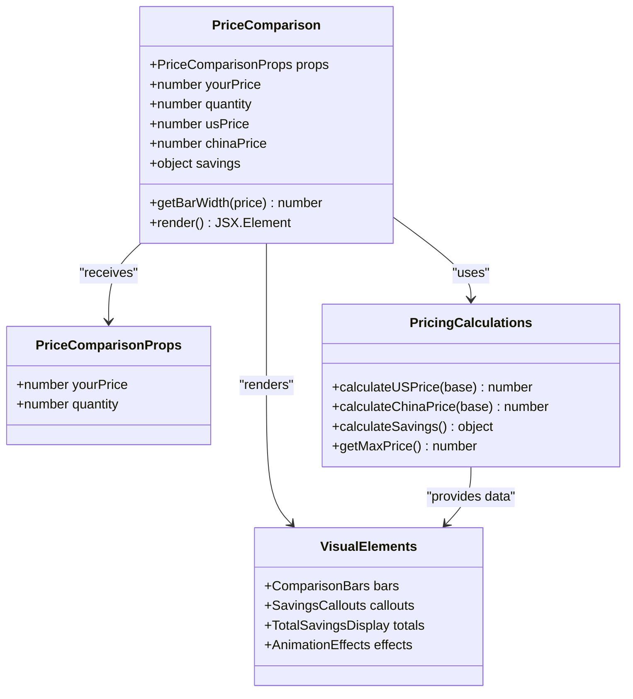
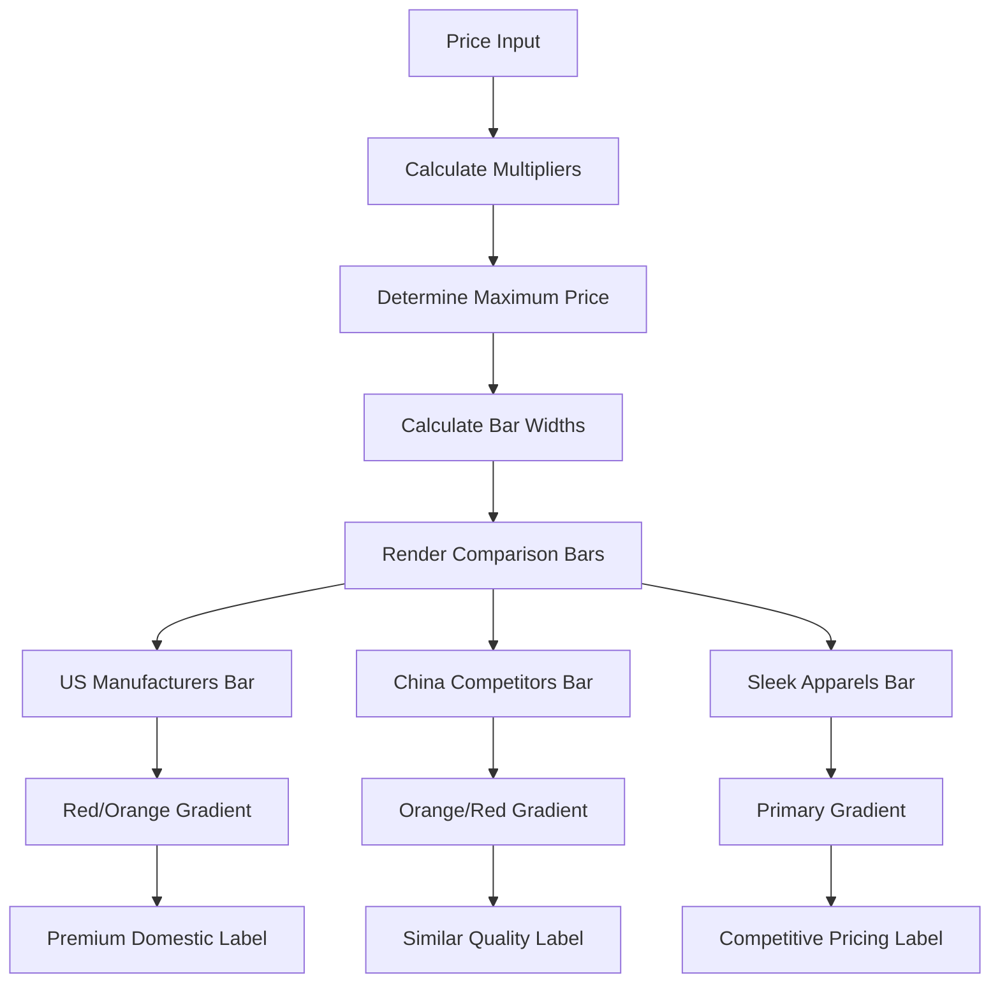
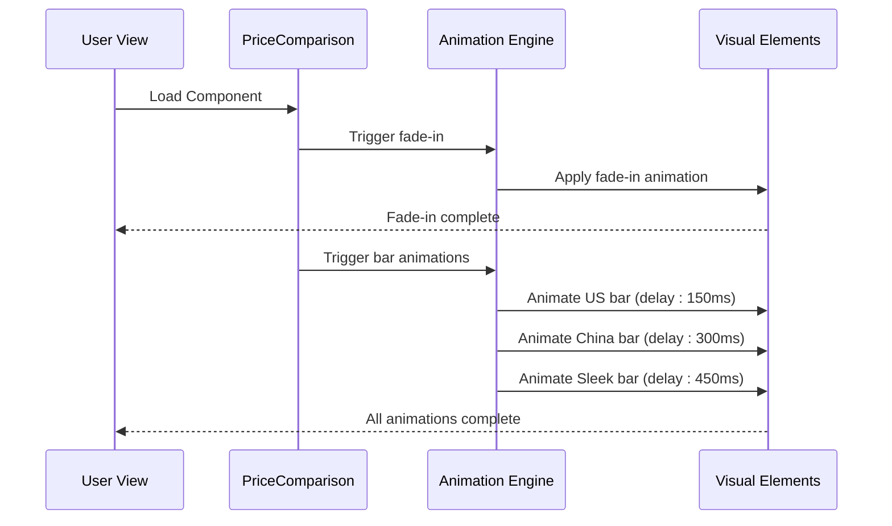
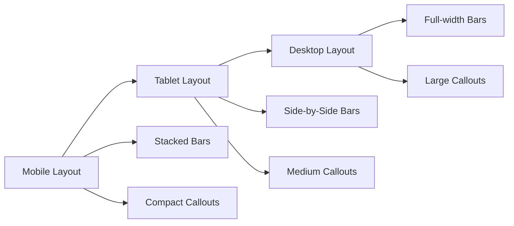
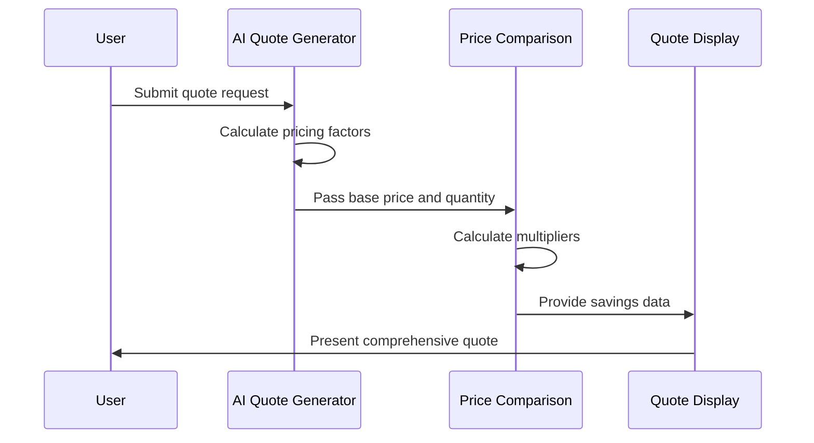
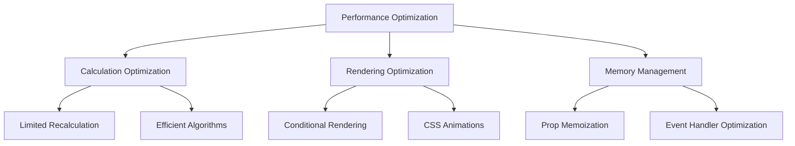

# Price Comparison Component Documentation

<cite>
**Referenced Files in This Document**
- [PriceComparison.tsx](file://src/components/quote/PriceComparison.tsx)
- [tailwind.config.ts](file://tailwind.config.ts)
- [bangladeshManufacturing.ts](file://src/lib/bangladeshManufacturing.ts)
- [QuoteComparison.tsx](file://src/components/quote/QuoteComparison.tsx)
- [InteractiveQuoteDisplay.tsx](file://src/components/quote/InteractiveQuoteDisplay.tsx)
- [InChatQuoteDisplay.tsx](file://src/components/InChatQuoteDisplay.tsx)
- [AIQuoteGenerator.tsx](file://src/components/AIQuoteGenerator.tsx)
- [PricingSavingsCard.tsx](file://src/components/aggregation/PricingSavingsCard.tsx)
- [MOQComparisonChart.tsx](file://src/components/infographics/MOQComparisonChart.tsx)
- [microInteractions.ts](file://src/lib/microInteractions.ts)
- [optimizedAnimations.ts](file://src/lib/optimizedAnimations.ts)
</cite>

## Table of Contents
1. [Introduction](#introduction)
2. [Component Architecture](#component-architecture)
3. [Multi-Currency Pricing Model](#multi-currency-pricing-model)
4. [Visual Comparison System](#visual-comparison-system)
5. [Animation and Interactivity](#animation-and-interactivity)
6. [Responsive Design Implementation](#responsive-design-implementation)
7. [Integration with Quote System](#integration-with-quote-system)
8. [Performance Optimization](#performance-optimization)
9. [Common Issues and Solutions](#common-issues-and-solutions)
10. [Best Practices](#best-practices)

## Introduction

The Price Comparison component serves as a visual and analytical tool that demonstrates the cost advantages of manufacturing with Sleek Apparels compared to US manufacturers and Chinese competitors. Built using React and Tailwind CSS, this component employs a sophisticated multiplier-based pricing system combined with animated comparison bars to effectively communicate value propositions.

The component operates on a fundamental principle: it calculates relative pricing differences between three manufacturing locations (US, China, and Bangladesh) and presents these comparisons through intuitive visual indicators that highlight cost savings and quality advantages.

## Component Architecture

The Price Comparison component follows a functional React architecture with TypeScript interfaces for type safety and maintainability.



**Diagram sources**
- [PriceComparison.tsx](file://src/components/quote/PriceComparison.tsx#L5-L124)

**Section sources**
- [PriceComparison.tsx](file://src/components/quote/PriceComparison.tsx#L1-L124)

## Multi-Currency Pricing Model

The component implements a sophisticated pricing model based on multiplier relationships between different manufacturing locations:

### Pricing Multipliers

The pricing calculation system uses predefined multipliers to establish relative costs:

| Location | Multiplier | Description |
|----------|------------|-------------|
| Sleek Apparels (You) | 1.0x | Base price, representing optimal Bangladesh manufacturing |
| US Manufacturers | 1.8x | Premium domestic manufacturing costs |
| China Competitors | 1.3x | Competitive Asian manufacturing costs |

### Calculation Logic

The component performs three primary calculations:

1. **US Manufacturer Pricing**: `yourPrice × 1.8`
2. **China Competitor Pricing**: `yourPrice × 1.3`
3. **Savings Calculations**: 
   - Savings vs US: `usPrice - yourPrice`
   - Savings vs China: `chinaPrice - yourPrice`

### Order Quantity Impact

The component calculates total savings based on order quantity, providing both per-unit and total order savings:

```typescript
// Total order savings calculation
const totalSavingsVsUS = savings.vsUS * quantity;
const totalSavingsVsChina = savings.vsChina * quantity;
```

**Section sources**
- [PriceComparison.tsx](file://src/components/quote/PriceComparison.tsx#L11-L18)
- [bangladeshManufacturing.ts](file://src/lib/bangladeshManufacturing.ts#L102-L185)

## Visual Comparison System

The component employs a bar-based visual system to represent pricing differences with distinct color coding and width proportional to price differences.

### Bar Visualization Architecture



**Diagram sources**
- [PriceComparison.tsx](file://src/components/quote/PriceComparison.tsx#L20-L86)

### Color Coding System

Each pricing tier receives specific visual treatment:

| Tier | Color | Purpose | Animation |
|------|-------|---------|-----------|
| US Manufacturers | Red gradient | Premium domestic pricing | Delayed 150ms |
| China Competitors | Orange gradient | Competitive Asian pricing | Delayed 300ms |
| Sleek Apparels | Primary gradient | Optimal Bangladesh pricing | Delayed 450ms |

### Bar Width Calculation

The bar width calculation ensures proportional representation:

```typescript
const getBarWidth = (price: number) => {
  return (price / maxPrice) * 100;
};
```

This calculation creates a percentage-based width that visually communicates relative pricing differences.

**Section sources**
- [PriceComparison.tsx](file://src/components/quote/PriceComparison.tsx#L20-L22)

## Animation and Interactivity

The component incorporates sophisticated animations using Tailwind CSS keyframes and Framer Motion for enhanced user experience.

### Animation System



**Diagram sources**
- [PriceComparison.tsx](file://src/components/quote/PriceComparison.tsx#L25)
- [microInteractions.ts](file://src/lib/microInteractions.ts#L100-L150)

### Animation Properties

The component utilizes multiple animation types:

1. **Fade-In Animation**: Applied to the entire card container
2. **Bar Width Animations**: Progressive reveal with staggered delays
3. **Gradient Transitions**: Smooth color transitions

### Tailwind Animation Classes

The component leverages Tailwind's animation system:

```typescript
// Card animation
className="border-primary/20 bg-gradient-to-br from-primary/5 to-secondary/5 animate-fade-in"

// Bar animations with delays
className="absolute inset-y-0 left-0 bg-red-500/20 border-r-2 border-red-500 transition-all duration-1000 ease-out flex items-center justify-end pr-3"
style={{ width: `${getBarWidth(usPrice)}%` }}

// Staggered delays
className="transition-all duration-1000 ease-out delay-150"
className="transition-all duration-1000 ease-out delay-300"
```

**Section sources**
- [PriceComparison.tsx](file://src/components/quote/PriceComparison.tsx#L25-L86)
- [tailwind.config.ts](file://tailwind.config.ts#L107-L167)

## Responsive Design Implementation

The component implements a mobile-first responsive design that adapts to various screen sizes while maintaining visual hierarchy and usability.

### Responsive Layout Structure



### Breakpoint Adaptations

The component adapts its layout at key breakpoints:

| Breakpoint | Layout Changes | Typography Adjustments |
|------------|----------------|------------------------|
| Mobile (< 768px) | Stacked comparison bars | Reduced bar heights |
| Tablet (768px+) | Side-by-side bars | Standard bar heights |
| Desktop (> 1024px) | Full-width presentation | Enhanced visual hierarchy |

### Tailwind Responsive Classes

The component uses Tailwind's responsive utility system:

```typescript
// Responsive typography
className="text-2xl font-bold text-primary"
className="text-3xl font-bold text-primary"

// Responsive spacing
className="space-y-4"
className="grid grid-cols-2 gap-3"

// Responsive sizing
className="h-10 bg-secondary rounded-lg overflow-hidden"
className="h-12 bg-secondary rounded-lg overflow-hidden"
```

**Section sources**
- [tailwind.config.ts](file://tailwind.config.ts#L11-L17)

## Integration with Quote System

The Price Comparison component integrates seamlessly with the broader quote generation and management system, reinforcing the value proposition of Bangladesh manufacturing.

### Quote Generation Context



**Diagram sources**
- [AIQuoteGenerator.tsx](file://src/components/AIQuoteGenerator.tsx#L439-L475)
- [InteractiveQuoteDisplay.tsx](file://src/components/quote/InteractiveQuoteDisplay.tsx#L1-L54)

### Data Flow Integration

The component receives pricing data from the AI quote generation system and enhances it with comparative analysis:

1. **Base Price Input**: Received from quote generation system
2. **Quantity Data**: Passed through props for total savings calculation
3. **Comparative Analysis**: Internal calculations provide context
4. **Visual Enhancement**: Styled presentation of comparative data

### Value Proposition Reinforcement

The component reinforces the value proposition through:

- **Direct Comparisons**: Clear visual representation of cost differences
- **Savings Quantification**: Specific dollar amounts and percentages
- **Quality Assurance**: Implicit quality benefits through pricing rationale
- **MOQ Advantages**: Demonstration of low minimum order quantities

**Section sources**
- [PriceComparison.tsx](file://src/components/quote/PriceComparison.tsx#L1-L124)
- [InteractiveQuoteDisplay.tsx](file://src/components/quote/InteractiveQuoteDisplay.tsx#L113-L174)

## Performance Optimization

The component implements several performance optimization strategies to ensure smooth rendering and user experience.

### Optimization Strategies



### Calculation Efficiency

The component minimizes computational overhead:

1. **Single Calculation Pass**: Prices calculated once and reused
2. **Efficient Width Calculations**: Simple division operations
3. **Minimal DOM Manipulation**: CSS-based animations only

### Memory Management

The component implements memory-efficient patterns:

- **Immutable State**: Pure calculations without state mutations
- **Efficient Props**: Minimal prop passing and validation
- **Clean Cleanup**: Proper event handler cleanup

**Section sources**
- [PriceComparison.tsx](file://src/components/quote/PriceComparison.tsx#L20-L22)

## Common Issues and Solutions

### Incorrect Pricing Calculations

**Issue**: Discrepancies between displayed savings and expected values.

**Solution**: Verify multiplier values and ensure proper decimal handling:

```typescript
// Ensure proper decimal precision
const savings = {
  vsUS: parseFloat((usPrice - yourPrice).toFixed(2)),
  vsChina: parseFloat((chinaPrice - yourPrice).toFixed(2))
};
```

### Display Inconsistencies

**Issue**: Bars not aligning properly or inconsistent widths.

**Solution**: Implement proper max price calculation and width normalization:

```typescript
const maxPrice = Math.max(usPrice, chinaPrice, yourPrice);
const getBarWidth = (price: number) => {
  return Math.min((price / maxPrice) * 100, 100);
};
```

### Animation Performance Issues

**Issue**: Choppy animations on lower-end devices.

**Solution**: Optimize animation properties and use hardware acceleration:

```typescript
// Force hardware acceleration
className="transition-all duration-1000 ease-out transform-gpu"
```

### Responsive Layout Problems

**Issue**: Bars overlapping or text truncation on smaller screens.

**Solution**: Implement proper responsive breakpoints and text scaling:

```typescript
// Responsive text sizing
className="text-sm md:text-base lg:text-lg"
```

## Best Practices

### Implementation Guidelines

1. **Type Safety**: Always use TypeScript interfaces for props
2. **Accessibility**: Include proper ARIA labels for screen readers
3. **Performance**: Minimize re-renders through efficient state management
4. **Maintainability**: Use consistent naming conventions and documentation

### Design Principles

1. **Clarity**: Use clear, unambiguous visual indicators
2. **Consistency**: Maintain consistent color coding and styling
3. **Hierarchy**: Establish clear visual hierarchy for important information
4. **Feedback**: Provide immediate visual feedback for user interactions

### Testing Considerations

1. **Cross-Browser Compatibility**: Test animations across different browsers
2. **Mobile Responsiveness**: Verify layout adaptation on various devices
3. **Performance Testing**: Monitor animation performance on lower-end devices
4. **Accessibility Testing**: Ensure proper screen reader support

The Price Comparison component exemplifies modern web development practices, combining sophisticated pricing analysis with elegant visual presentation to effectively communicate the value proposition of Bangladesh manufacturing in a competitive global market.