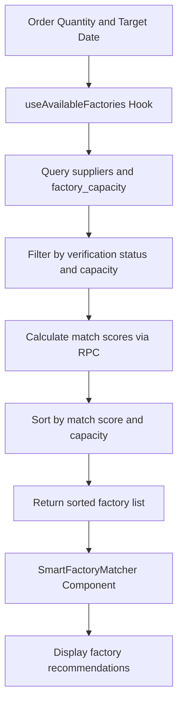
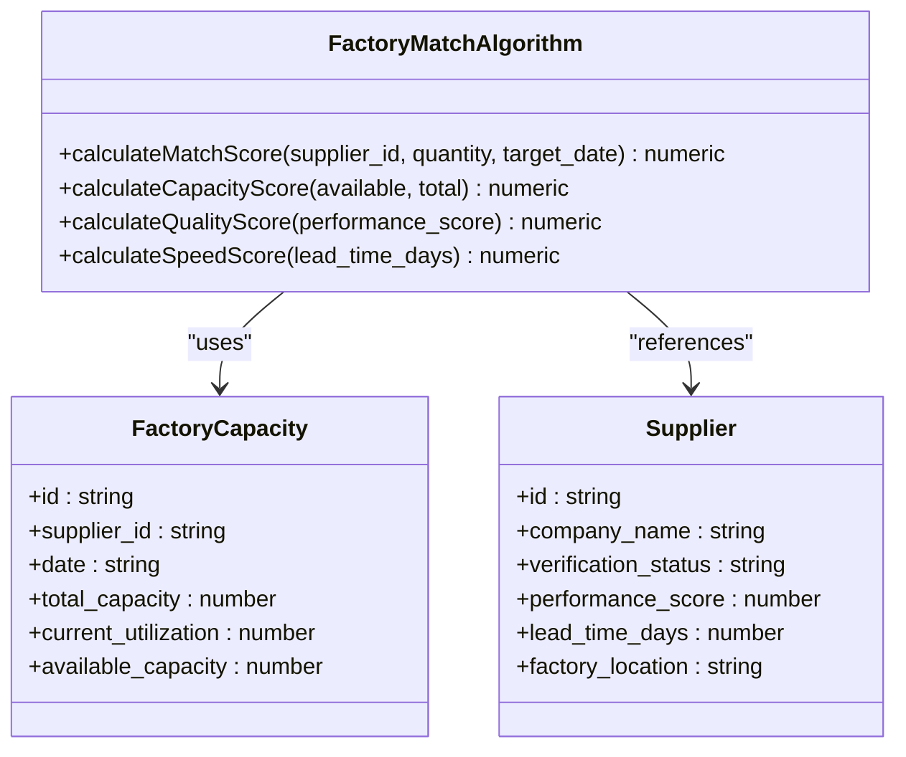
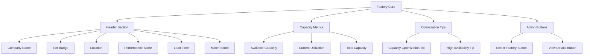
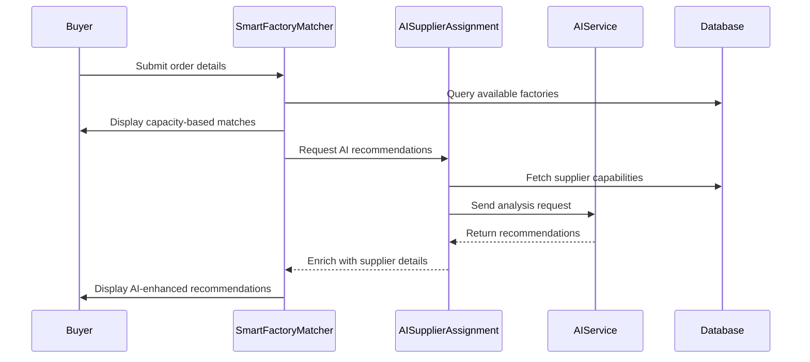

# Smart Factory Matcher

<cite>
**Referenced Files in This Document**   
- [SmartFactoryMatcher.tsx](file://src/components/quote/SmartFactoryMatcher.tsx)
- [useFactoryCapacity.ts](file://src/hooks/useFactoryCapacity.ts)
- [calculate_factory_match_score.sql](file://supabase/migrations/20251115150759_remix_migration_from_pg_dump.sql)
- [ai-supplier-assignment/index.ts](file://supabase/functions/ai-supplier-assignment/index.ts)
- [SmartRecommendations.tsx](file://src/components/quote/SmartRecommendations.tsx)
- [SmartSupplierAssignment.tsx](file://src/components/admin/SmartSupplierAssignment.tsx)
</cite>

## Table of Contents
1. [Introduction](#introduction)
2. [Core Algorithm and Data Flow](#core-algorithm-and-data-flow)
3. [Factory Matching Algorithm](#factory-matching-algorithm)
4. [UI Components and Display Elements](#ui-components-and-display-elements)
5. [Optimization Tips and Conditional Rendering](#optimization-tips-and-conditional-rendering)
6. [Error Handling and Edge Cases](#error-handling-and-edge-cases)
7. [Integration with AI Supplier Assignment](#integration-with-ai-supplier-assignment)
8. [Best Practices for Factory Selection](#best-practices-for-factory-selection)

## Introduction

The Smart Factory Matcher component is a critical part of the manufacturing partner recommendation system that helps buyers find optimal production partners based on their order requirements. This component uses real-time factory capacity data, performance metrics, and business rules to recommend the best manufacturing partners for a given order quantity and target date.

The system integrates multiple data points including factory capacity availability, performance scores, lead times, and utilization rates to calculate a comprehensive match score for each potential factory. The component provides a user-friendly interface that displays factory information and optimization suggestions to help buyers make informed decisions.

**Section sources**
- [SmartFactoryMatcher.tsx](file://src/components/quote/SmartFactoryMatcher.tsx#L1-L178)

## Core Algorithm and Data Flow

The Smart Factory Matcher operates through a well-defined data flow that begins with the useAvailableFactories hook and ends with the display of recommended factories. The process starts when a buyer specifies an order quantity and target date, which are passed as parameters to the SmartFactoryMatcher component.

The useAvailableFactories hook retrieves factory data by querying the suppliers table with a join to the factory_capacity table, filtering for verified suppliers with sufficient available capacity on the target date. The hook uses React Query for efficient data fetching and caching, with a stale time of 2 minutes to ensure capacity data remains current.



**Diagram sources**
- [useFactoryCapacity.ts](file://src/hooks/useFactoryCapacity.ts#L92-L138)
- [SmartFactoryMatcher.tsx](file://src/components/quote/SmartFactoryMatcher.tsx#L21-L22)

**Section sources**
- [useFactoryCapacity.ts](file://src/hooks/useFactoryCapacity.ts#L92-L138)

## Factory Matching Algorithm

The factory matching algorithm uses a weighted scoring system to evaluate and rank factories based on multiple criteria. The match score is calculated using a PostgreSQL function called calculate_factory_match_score, which implements a weighted average formula with three primary components: capacity availability (50% weight), quality performance (30% weight), and speed/lead time (20% weight).

The capacity score is calculated as the percentage of available capacity relative to total capacity, with higher availability resulting in a higher score. The quality score is derived from the factory's performance_score in the suppliers table, which reflects historical performance metrics. The speed score is inversely proportional to the lead time days, meaning factories with shorter lead times receive higher scores.



**Diagram sources**
- [calculate_factory_match_score.sql](file://supabase/migrations/20251115150759_remix_migration_from_pg_dump.sql#L169-L215)
- [useFactoryCapacity.ts](file://src/hooks/useFactoryCapacity.ts#L114-L124)

**Section sources**
- [calculate_factory_match_score.sql](file://supabase/migrations/20251115150759_remix_migration_from_pg_dump.sql#L169-L215)

## UI Components and Display Elements

The Smart Factory Matcher component displays factory information through a clean, card-based interface that highlights key metrics and recommendations. Each factory card includes the company name, location, performance rating, and capacity metrics in an easily digestible format.

The UI displays several key pieces of information for each factory: the company name with tier badge, factory location with map pin icon, performance score with star rating, lead time with clock icon, and a match score badge. The capacity metrics are displayed in a three-column layout showing available capacity, current utilization, and total capacity.



**Diagram sources**
- [SmartFactoryMatcher.tsx](file://src/components/quote/SmartFactoryMatcher.tsx#L70-L153)

**Section sources**
- [SmartFactoryMatcher.tsx](file://src/components/quote/SmartFactoryMatcher.tsx#L70-L153)

## Optimization Tips and Conditional Rendering

The Smart Factory Matcher includes intelligent optimization tips that are conditionally rendered based on factory capacity and utilization data. These tips help buyers make better decisions by suggesting ways to optimize their orders for cost, speed, or quality.

When a factory's available capacity is less than the requested order quantity, the component displays an optimization tip suggesting order splitting across multiple factories to ensure faster delivery. This is particularly useful for large orders that exceed a single factory's capacity.

```mermaid
flowchart TD
A[Factory Data] --> B{Available Capacity < Quantity?}
B --> |Yes| C[Show Optimization Tip]
B --> |No| D{Utilization < 60%?}
D --> |Yes| E[Show High Availability Tip]
D --> |No| F[No Additional Tips]
C --> G[Display: "Split order across factories"]
E --> H[Display: "Low utilization - can start immediately"]
```

The component also displays a high availability tip when a factory's average capacity utilization is below 60%, indicating that the factory has excess capacity and can start production immediately. This helps buyers identify factories that can provide faster turnaround times.

**Diagram sources**
- [SmartFactoryMatcher.tsx](file://src/components/quote/SmartFactoryMatcher.tsx#L126-L141)

**Section sources**
- [SmartFactoryMatcher.tsx](file://src/components/quote/SmartFactoryMatcher.tsx#L126-L141)

## Error Handling and Edge Cases

The Smart Factory Matcher component includes robust error handling for various edge cases that may occur during the factory matching process. When no factories are available with sufficient capacity for the requested order, the component displays a clear message explaining the situation and informing the buyer that the team will manually source options.

The component handles loading states by displaying skeleton loaders that provide visual feedback while factory data is being retrieved. This improves the user experience by indicating that the system is working even when data retrieval takes longer than expected.

For cases where there are more than three matching factories, the component implements a "Show More" functionality that initially displays only the top three matches and allows users to expand the list to view all available options. This prevents information overload while still providing access to all potential matches.

**Section sources**
- [SmartFactoryMatcher.tsx](file://src/components/quote/SmartFactoryMatcher.tsx#L23-L50)
- [SmartFactoryMatcher.tsx](file://src/components/quote/SmartFactoryMatcher.tsx#L157-L174)

## Integration with AI Supplier Assignment

The Smart Factory Matcher integrates with the AI Supplier Assignment Edge Function to provide enhanced supplier recommendations based on real-time capacity data. While the Smart Factory Matcher focuses on capacity-based matching, the AI Supplier Assignment system uses machine learning to analyze additional factors such as product specialization, quality history, and business relationships.

The AI Supplier Assignment Edge Function is implemented as a Supabase function that calls an external AI service (Lovable AI) to generate supplier recommendations. The function analyzes order details and supplier capabilities to recommend the top three best matches with detailed reasoning for each recommendation.



**Diagram sources**
- [ai-supplier-assignment/index.ts](file://supabase/functions/ai-supplier-assignment/index.ts#L1-L134)
- [SmartSupplierAssignment.tsx](file://src/components/admin/SmartSupplierAssignment.tsx#L24-L32)

**Section sources**
- [ai-supplier-assignment/index.ts](file://supabase/functions/ai-supplier-assignment/index.ts#L1-L134)

## Best Practices for Factory Selection

When using the Smart Factory Matcher, buyers should consider several best practices to ensure optimal factory selection. First, it's recommended to review multiple factory options rather than selecting the first match, as different factories may offer different trade-offs between price, quality, and delivery time.

For large orders that exceed a single factory's capacity, consider splitting the order across multiple factories to ensure timely delivery. The system will automatically suggest this optimization when appropriate, but buyers should also proactively consider this strategy for orders above 500 pieces.

Buyers should pay attention to both the match score and the individual metrics that contribute to it. A factory with a slightly lower match score but significantly better lead time might be preferable for time-sensitive orders. Similarly, a factory with higher performance scores may be worth the premium for complex or high-quality requirements.

Finally, buyers should consider the timing of their order placement. Factories with low utilization rates (below 60%) can typically start production immediately, while those with high utilization may have longer wait times even if they have theoretical capacity available.

**Section sources**
- [SmartFactoryMatcher.tsx](file://src/components/quote/SmartFactoryMatcher.tsx#L1-L178)
- [SmartRecommendations.tsx](file://src/components/quote/SmartRecommendations.tsx#L1-L137)