# Blog Management System

<cite>
**Referenced Files in This Document**
- [Blog.tsx](file://src/pages/Blog.tsx)
- [BlogPost.tsx](file://src/pages/BlogPost.tsx)
- [BlogEditor.tsx](file://src/components/blog/BlogEditor.tsx)
- [SocialShareButtons.tsx](file://src/components/blog/SocialShareButtons.tsx)
- [BlogErrorBoundary.tsx](file://src/components/blog/BlogErrorBoundary.tsx)
- [NoBlogPosts.tsx](file://src/components/blog/NoBlogPosts.tsx)
- [BlogPostCard.tsx](file://src/components/blog/BlogPostCard.tsx)
- [ai-blog-assistant/index.ts](file://supabase/functions/ai-blog-assistant/index.ts)
- [submit-blog-comment/index.ts](file://supabase/functions/submit-blog-comment/index.ts)
- [SEO.tsx](file://src/components/SEO.tsx)
- [blogDebugger.ts](file://src/lib/blogDebugger.ts)
- [seo.ts](file://src/lib/seo.ts)
- [client.ts](file://src/integrations/supabase/client.ts)
- [types.ts](file://src/integrations/supabase/types.ts)
</cite>

## Table of Contents
1. [Introduction](#introduction)
2. [System Architecture](#system-architecture)
3. [Frontend Implementation](#frontend-implementation)
4. [Backend Infrastructure](#backend-infrastructure)
5. [AI-Powered Content Assistance](#ai-powered-content-assistance)
6. [Data Flow and API Integration](#data-flow-and-api-integration)
7. [Comment Submission Workflow](#comment-submission-workflow)
8. [SEO and Structured Data](#seo-and-structured-data)
9. [Social Media Integration](#social-media-integration)
10. [Error Handling and Diagnostics](#error-handling-and-diagnostics)
11. [Best Practices and Troubleshooting](#best-practices-and-troubleshooting)
12. [Performance Optimization](#performance-optimization)

## Introduction

The Sleek Apparels Blog Management System is a comprehensive content management solution built with React, TypeScript, and Supabase. It provides a robust platform for managing blog posts, integrating AI-powered content assistance, handling social media sharing, and maintaining SEO optimization. The system features a clean separation between frontend presentation and backend data management, with sophisticated error handling and diagnostic capabilities.

## System Architecture

The blog management system follows a modern full-stack architecture with clear separation of concerns:

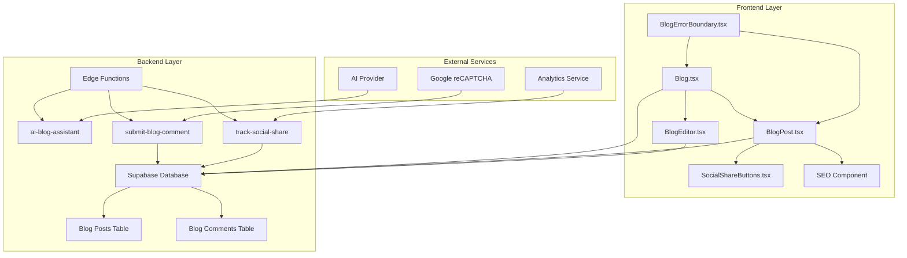

**Diagram sources**
- [Blog.tsx](file://src/pages/Blog.tsx#L1-L239)
- [BlogPost.tsx](file://src/pages/BlogPost.tsx#L1-L252)
- [BlogEditor.tsx](file://src/components/blog/BlogEditor.tsx#L1-L297)
- [ai-blog-assistant/index.ts](file://supabase/functions/ai-blog-assistant/index.ts#L1-L84)
- [submit-blog-comment/index.ts](file://supabase/functions/submit-blog-comment/index.ts#L1-L129)

## Frontend Implementation

### Blog List Page (Blog.tsx)

The main blog listing page demonstrates advanced React patterns including error boundaries, loading states, and data fetching with Supabase:

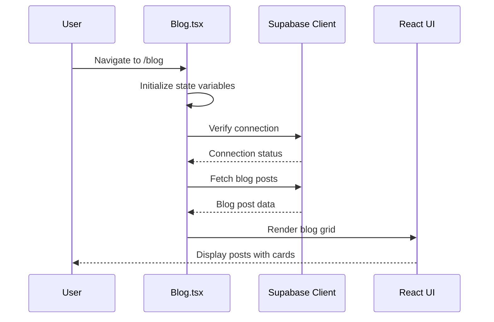

**Diagram sources**
- [Blog.tsx](file://src/pages/Blog.tsx#L36-L122)

The Blog component implements several key patterns:

- **Connection Verification**: Validates database connectivity before data fetching
- **Error Boundaries**: Wraps the entire blog page with comprehensive error handling
- **Loading States**: Provides smooth user experience during data loading
- **Responsive Grid Layout**: Adapts to different screen sizes with Tailwind CSS

**Section sources**
- [Blog.tsx](file://src/pages/Blog.tsx#L30-L239)

### Individual Blog Post Rendering (BlogPost.tsx)

The BlogPost component showcases advanced content rendering with SEO optimization:

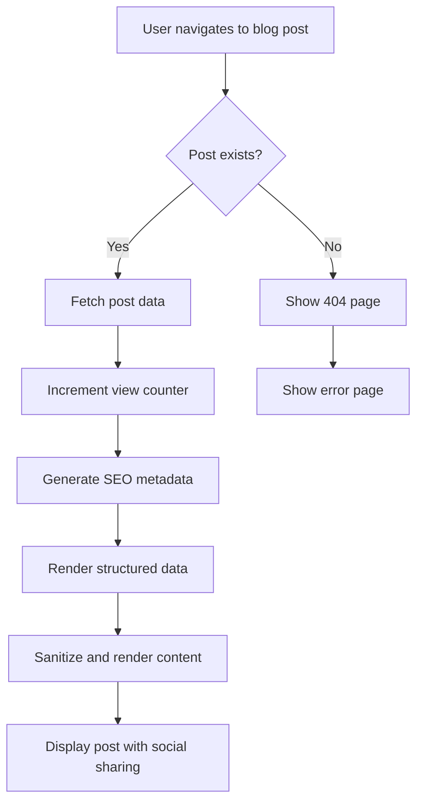

**Diagram sources**
- [BlogPost.tsx](file://src/pages/BlogPost.tsx#L37-L65)

The component handles:
- **Dynamic SEO Generation**: Creates metadata based on post content
- **Structured Data**: Implements JSON-LD schemas for search engines
- **Content Sanitization**: Uses DOMPurify for XSS protection
- **View Tracking**: Increments view counts via RPC function

**Section sources**
- [BlogPost.tsx](file://src/pages/BlogPost.tsx#L1-L252)

### Blog Editor Component

The BlogEditor provides a comprehensive content creation interface with AI assistance:

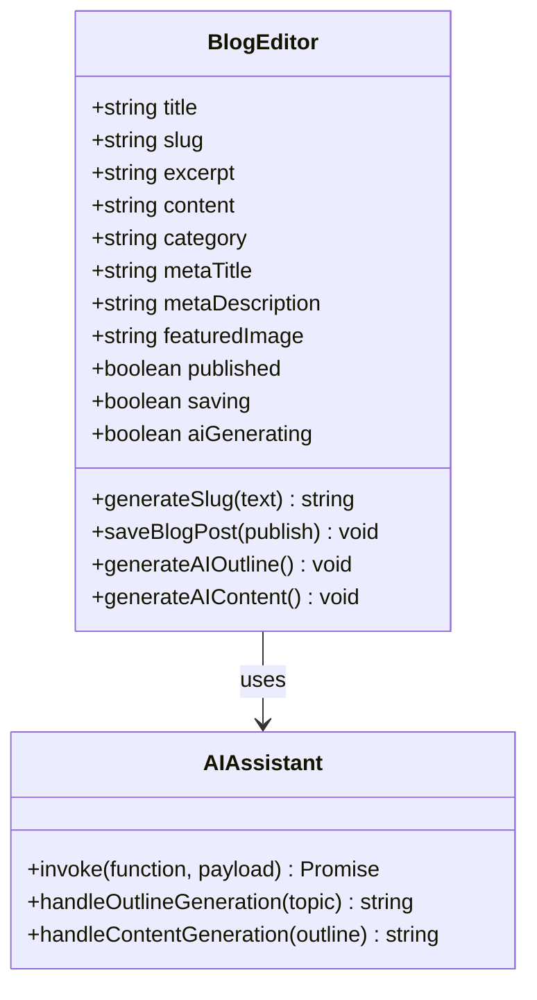

**Diagram sources**
- [BlogEditor.tsx](file://src/components/blog/BlogEditor.tsx#L17-L297)

**Section sources**
- [BlogEditor.tsx](file://src/components/blog/BlogEditor.tsx#L1-L297)

## Backend Infrastructure

### Database Schema

The blog system uses a normalized database schema with proper indexing and constraints:

| Column | Type | Constraints | Purpose |
|--------|------|-------------|---------|
| id | UUID | PRIMARY KEY | Unique identifier |
| title | TEXT | NOT NULL | Post title |
| slug | TEXT | UNIQUE, NOT NULL | URL-friendly identifier |
| excerpt | TEXT | NOT NULL | Short description |
| content | TEXT | NOT NULL | Full post content |
| category | TEXT | NOT NULL | Post category |
| published | BOOLEAN | DEFAULT false | Publication status |
| published_at | TIMESTAMP | NULLABLE | Publication timestamp |
| views_count | INTEGER | DEFAULT 0 | View tracking |
| shares_count | INTEGER | DEFAULT 0 | Share tracking |
| tags | JSONB | DEFAULT '[]' | Tag system |
| seo_data | JSONB | DEFAULT '{}' | SEO metadata |

**Section sources**
- [types.ts](file://src/integrations/supabase/types.ts#L466-L488)

### Supabase Integration

The system leverages Supabase for real-time database operations and authentication:

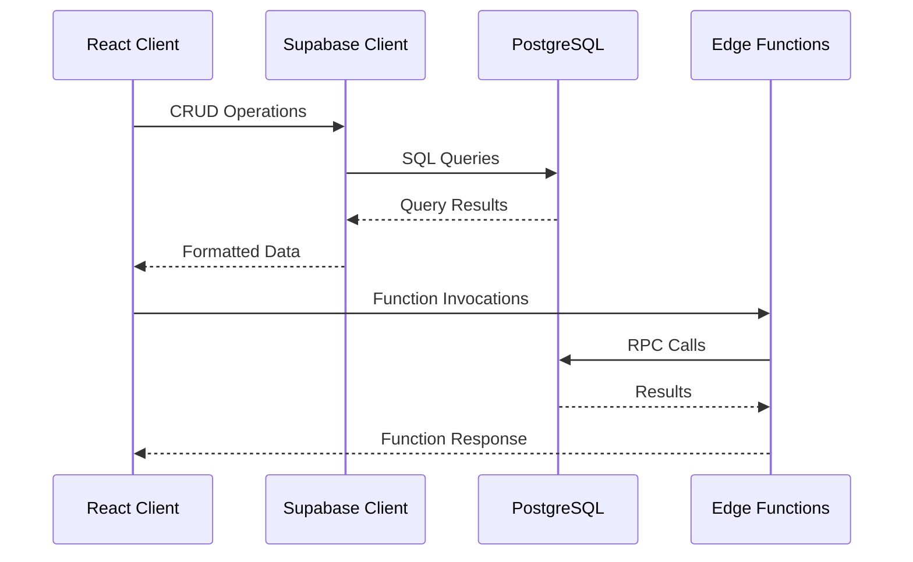

**Diagram sources**
- [client.ts](file://src/integrations/supabase/client.ts#L1-L20)

**Section sources**
- [client.ts](file://src/integrations/supabase/client.ts#L1-L20)

## AI-Powered Content Assistance

### AI Blog Assistant Edge Function

The ai-blog-assistant provides intelligent content generation capabilities:

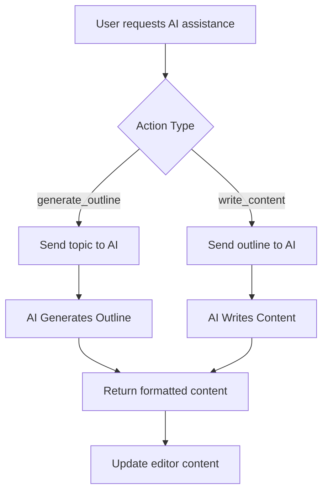

**Diagram sources**
- [ai-blog-assistant/index.ts](file://supabase/functions/ai-blog-assistant/index.ts#L14-L84)

The AI assistant supports:
- **Outline Generation**: Creates comprehensive blog post structures
- **Content Writing**: Produces full-length articles (1800-2500 words)
- **Multiple Models**: Uses Gemini Flash for outlines and Pro for content
- **SEO Optimization**: Incorporates keywords naturally

**Section sources**
- [ai-blog-assistant/index.ts](file://supabase/functions/ai-blog-assistant/index.ts#L1-L84)

## Data Flow and API Integration

### Content Fetching Pipeline

The system implements a sophisticated data fetching strategy:

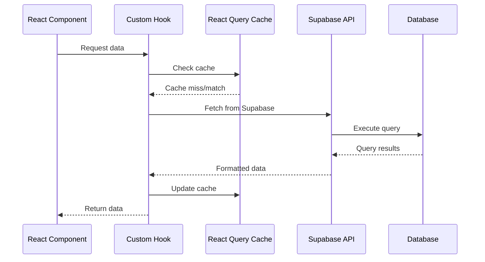

**Diagram sources**
- [Blog.tsx](file://src/pages/Blog.tsx#L69-L122)
- [BlogPost.tsx](file://src/pages/BlogPost.tsx#L43-L65)

### Real-Time Updates

The system supports real-time updates through Supabase's subscription capabilities:

- **View Count Updates**: Automatic increment via RPC function
- **Share Tracking**: Real-time analytics via edge functions
- **Comment Moderation**: Pending approval workflow

**Section sources**
- [BlogPost.tsx](file://src/pages/BlogPost.tsx#L56-L65)

## Comment Submission Workflow

### Security and Validation

The comment submission system implements comprehensive security measures:

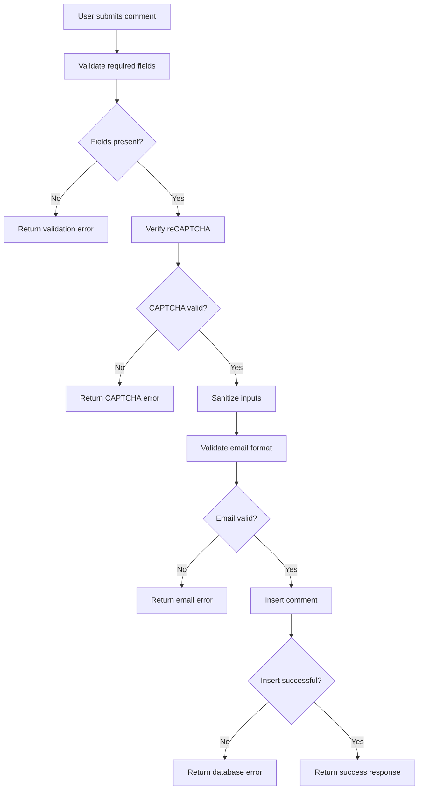

**Diagram sources**
- [submit-blog-comment/index.ts](file://supabase/functions/submit-blog-comment/index.ts#L16-L129)

**Section sources**
- [submit-blog-comment/index.ts](file://supabase/functions/submit-blog-comment/index.ts#L1-L129)

## SEO and Structured Data

### Metadata Management

The SEO system provides comprehensive metadata generation:

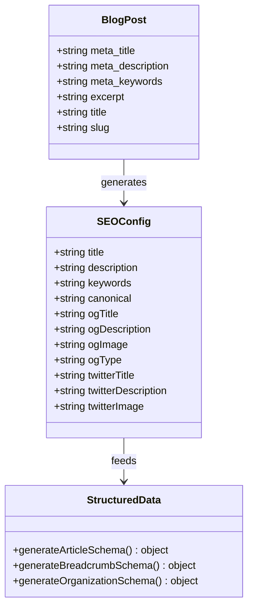

**Diagram sources**
- [SEO.tsx](file://src/components/SEO.tsx#L1-L255)
- [seo.ts](file://src/lib/seo.ts#L1-L293)

**Section sources**
- [SEO.tsx](file://src/components/SEO.tsx#L1-L255)
- [seo.ts](file://src/lib/seo.ts#L1-L293)

## Social Media Integration

### Sharing Functionality

The SocialShareButtons component provides comprehensive social media integration:

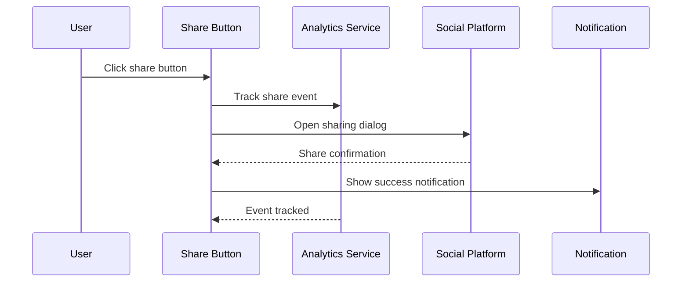

**Diagram sources**
- [SocialShareButtons.tsx](file://src/components/blog/SocialShareButtons.tsx#L13-L137)

**Section sources**
- [SocialShareButtons.tsx](file://src/components/blog/SocialShareButtons.tsx#L1-L137)

## Error Handling and Diagnostics

### Comprehensive Error Boundaries

The system implements multi-layered error handling:

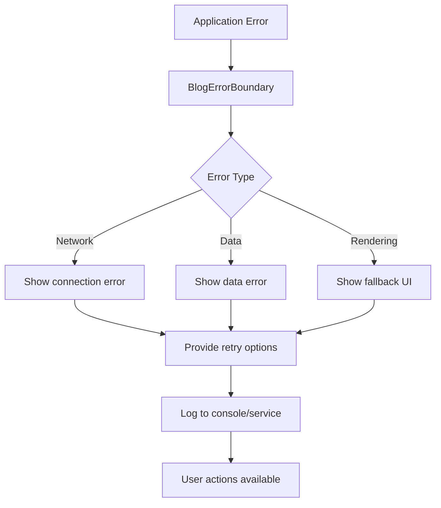

**Diagram sources**
- [BlogErrorBoundary.tsx](file://src/components/blog/BlogErrorBoundary.tsx#L19-L175)

**Section sources**
- [BlogErrorBoundary.tsx](file://src/components/blog/BlogErrorBoundary.tsx#L1-L175)

### Diagnostic Tools

The blogDebugger provides comprehensive system diagnostics:

| Diagnostic Area | Checks Performed | Purpose |
|----------------|------------------|---------|
| Connection | Supabase URL, Keys, Health Check | Verify database connectivity |
| Permissions | Read/Write Access, RLS Policies | Validate access controls |
| Data Integrity | Post Counts, Format Validation | Ensure data consistency |
| Performance | Query Times, Response Sizes | Monitor system performance |

**Section sources**
- [blogDebugger.ts](file://src/lib/blogDebugger.ts#L1-L246)

## Best Practices and Troubleshooting

### Content Editor Guidelines

**Formatting Best Practices:**
- Use Markdown for content structure
- Maintain consistent heading hierarchy
- Optimize images for web delivery
- Include alt text for accessibility
- Follow SEO guidelines for meta tags

**SEO Optimization Tips:**
- Target primary keywords naturally
- Use descriptive meta titles (<60 chars)
- Craft compelling meta descriptions (<160 chars)
- Include relevant internal links
- Optimize image filenames and alt text

**Accessibility Considerations:**
- Ensure sufficient color contrast
- Provide keyboard navigation support
- Use semantic HTML elements
- Include ARIA labels where needed
- Test with screen readers

### Common Issues and Solutions

**Markdown Rendering Errors:**
- Verify content sanitization configuration
- Check allowed HTML tags and attributes
- Validate markdown syntax compliance
- Test with various content types

**Image Upload Failures:**
- Verify Supabase storage configuration
- Check file size and format restrictions
- Validate CORS settings
- Monitor storage quotas

**Comment Spam Prevention:**
- Implement CAPTCHA verification
- Use rate limiting on submissions
- Enable comment moderation
- Monitor suspicious activity patterns

## Performance Optimization

### Frontend Optimization Strategies

**Image Optimization:**
- Lazy loading with intersection observer
- Responsive image sizing
- WebP format conversion
- Placeholder loading states

**Data Fetching Optimization:**
- React Query caching strategy
- Selective field loading
- Pagination for large datasets
- Background data prefetching

**Bundle Optimization:**
- Code splitting for routes
- Dynamic imports for components
- Tree shaking for unused code
- Compression for assets

### Backend Performance

**Database Optimization:**
- Proper indexing on frequently queried columns
- Connection pooling configuration
- Query optimization and monitoring
- Regular maintenance tasks

**Edge Function Performance:**
- Cold start mitigation
- Efficient memory usage
- Timeout configuration
- Retry mechanisms for failures

The blog management system represents a comprehensive solution for modern content management, combining powerful AI assistance with robust security, SEO optimization, and user experience features. Its modular architecture ensures maintainability while providing the flexibility needed for evolving content requirements.