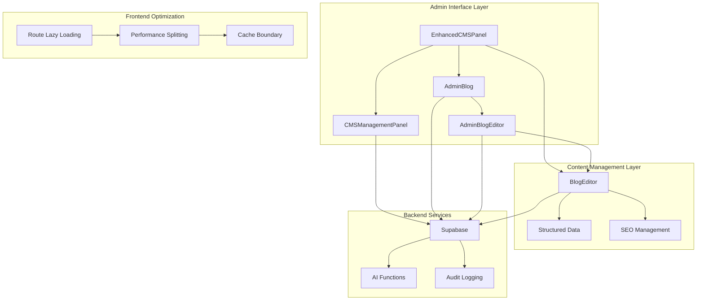
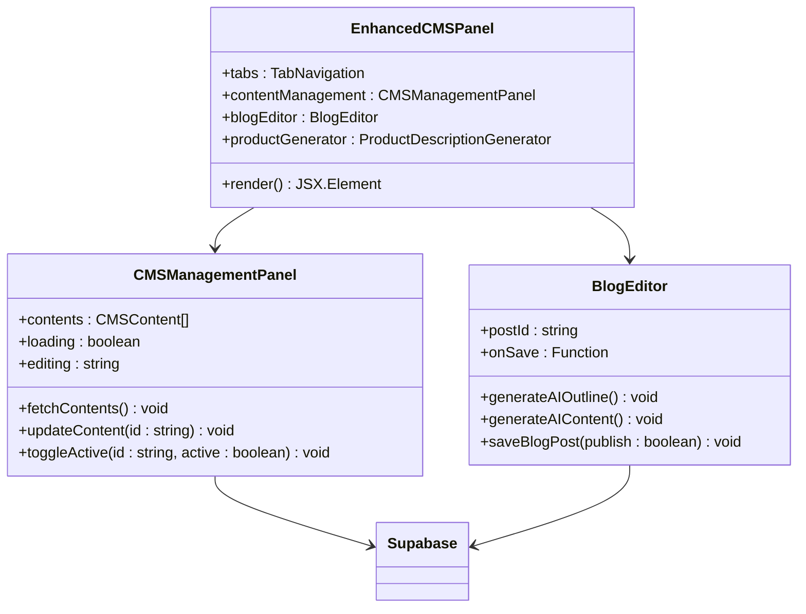
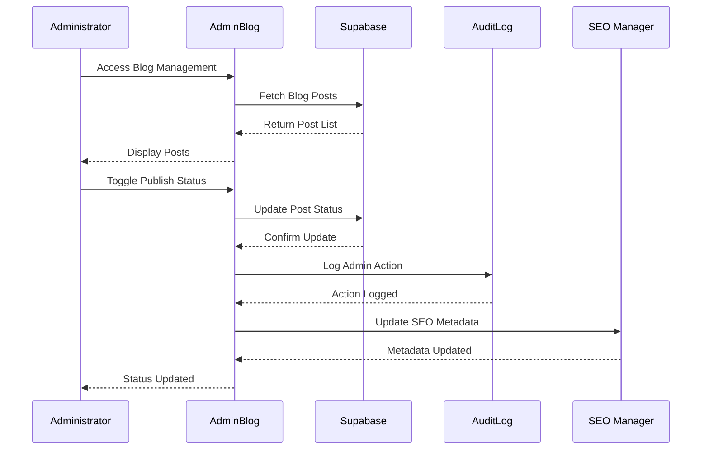
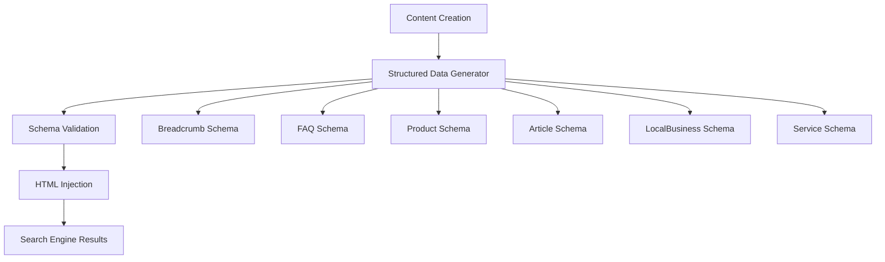
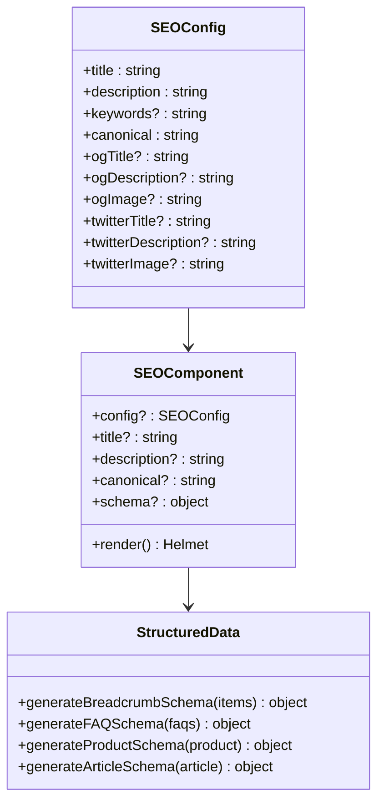
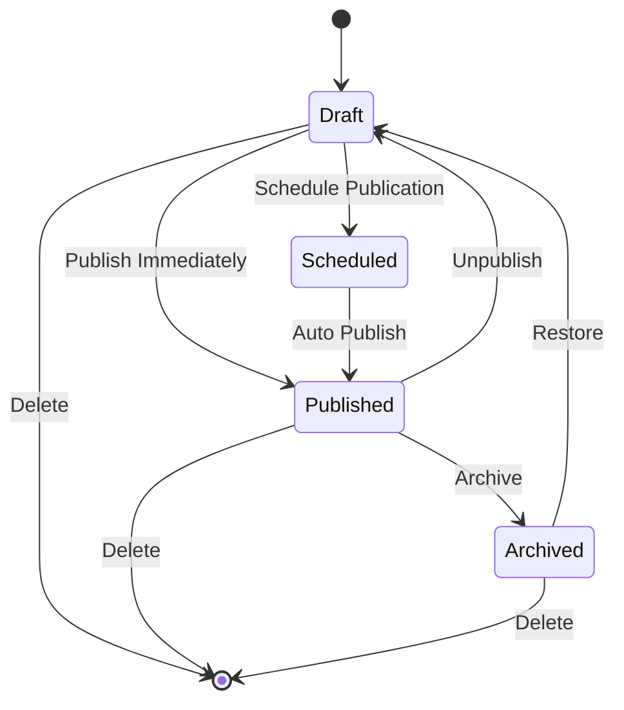
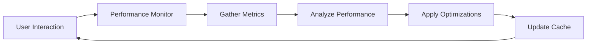
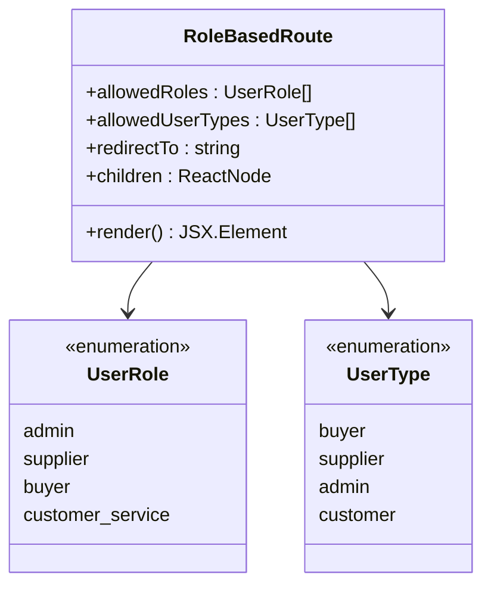

# CMS Features

<cite>
**Referenced Files in This Document**
- [CMSManagementPanel.tsx](file://src/components/admin/CMSManagementPanel.tsx)
- [EnhancedCMSPanel.tsx](file://src/components/admin/EnhancedCMSPanel.tsx)
- [AdminBlog.tsx](file://src/pages/AdminBlog.tsx)
- [AdminBlogEditor.tsx](file://src/pages/AdminBlogEditor.tsx)
- [BlogEditor.tsx](file://src/components/blog/BlogEditor.tsx)
- [structuredData.ts](file://src/lib/structuredData.ts)
- [seo.ts](file://src/lib/seo.ts)
- [SEO.tsx](file://src/components/SEO.tsx)
- [RoleBasedRoute.tsx](file://src/components/routes/RoleBasedRoute.tsx)
- [enhancedAuditLog.ts](file://src/lib/enhancedAuditLog.ts)
- [RootErrorBoundary.tsx](file://src/components/RootErrorBoundary.tsx)
</cite>

## Table of Contents
1. [Introduction](#introduction)
2. [CMS Architecture Overview](#cms-architecture-overview)
3. [Core CMS Components](#core-cms-components)
4. [Blog Management System](#blog-management-system)
5. [Structured Data Integration](#structured-data-integration)
6. [SEO Metadata Management](#seo-metadata-management)
7. [Content Workflow Management](#content-workflow-management)
8. [Performance Optimizations](#performance-optimizations)
9. [Security and Access Control](#security-and-access-control)
10. [Troubleshooting Guide](#troubleshooting-guide)
11. [Best Practices](#best-practices)

## Introduction

The SleekApp CMS system provides administrators with comprehensive content management capabilities for managing website content, blog posts, and metadata. Built on React with Supabase backend integration, the CMS offers real-time editing, versioning support, and enhanced SEO features through structured data implementation.

The CMS architecture emphasizes modularity, security, and performance while providing intuitive interfaces for content creation, editing, and publication workflows. Administrators can manage various content types including static pages, blog articles, and product descriptions through centralized panels with role-based access controls.

## CMS Architecture Overview

The CMS system follows a modular architecture with clear separation of concerns between content management, SEO optimization, and administrative controls.

**Diagram sources**
- [EnhancedCMSPanel.tsx](file://src/components/admin/EnhancedCMSPanel.tsx#L1-L46)
- [CMSManagementPanel.tsx](file://src/components/admin/CMSManagementPanel.tsx#L1-L204)
- [AdminBlog.tsx](file://src/pages/AdminBlog.tsx#L1-L217)
- [AdminBlogEditor.tsx](file://src/pages/AdminBlogEditor.tsx#L1-L326)

## Core CMS Components

### EnhancedCMSPanel

The EnhancedCMSPanel serves as the central hub for all content management operations, providing a unified interface for managing website content, blog posts, and AI-powered content generation.

**Diagram sources**
- [EnhancedCMSPanel.tsx](file://src/components/admin/EnhancedCMSPanel.tsx#L8-L46)
- [CMSManagementPanel.tsx](file://src/components/admin/CMSManagementPanel.tsx#L21-L204)
- [BlogEditor.tsx](file://src/components/blog/BlogEditor.tsx#L12-L297)

**Section sources**
- [EnhancedCMSPanel.tsx](file://src/components/admin/EnhancedCMSPanel.tsx#L1-L46)
- [CMSManagementPanel.tsx](file://src/components/admin/CMSManagementPanel.tsx#L1-L204)

### CMSManagementPanel

The CMSManagementPanel provides granular control over static website content, allowing administrators to manage various content sections with real-time updates and activation controls.

Key features include:
- **Section-based Organization**: Content is organized by logical sections (hero, about, services, etc.)
- **Real-time Editing**: JSON-based content editing with live preview capabilities
- **Activation Controls**: Toggle content visibility without deletion
- **Display Ordering**: Manage content presentation order
- **Audit Trail**: Automatic logging of all content modifications

**Section sources**
- [CMSManagementPanel.tsx](file://src/components/admin/CMSManagementPanel.tsx#L21-L204)

## Blog Management System

The blog management system provides comprehensive CRUD operations for blog posts with advanced features including AI-powered content generation, real-time previews, and sophisticated SEO optimization tools.

### AdminBlog Component

The AdminBlog component serves as the primary interface for blog post management, offering a streamlined view of all blog content with quick actions for editing, publishing, and deletion.

**Diagram sources**
- [AdminBlog.tsx](file://src/pages/AdminBlog.tsx#L25-L217)

### AdminBlogEditor Component

The AdminBlogEditor provides a comprehensive editing interface with advanced features including AI assistance, real-time validation, and comprehensive SEO optimization tools.

Key capabilities:
- **AI-Powered Content Generation**: Outline generation and content writing assistance
- **Real-time Validation**: Form validation with immediate feedback
- **SEO Optimization**: Built-in SEO tools with automatic metadata generation
- **Preview Functionality**: Live preview of published content
- **Version Control**: Automatic versioning and change tracking

**Section sources**
- [AdminBlog.tsx](file://src/pages/AdminBlog.tsx#L25-L217)
- [AdminBlogEditor.tsx](file://src/pages/AdminBlogEditor.tsx#L1-L326)

### BlogEditor Component

The standalone BlogEditor component provides a lightweight editing interface suitable for embedding within larger applications or as part of the enhanced CMS panel.

**Section sources**
- [BlogEditor.tsx](file://src/components/blog/BlogEditor.tsx#L1-L297)

## Structured Data Integration

The CMS integrates comprehensive structured data support through the structuredData library, enabling rich snippets and enhanced search engine visibility across all content types.

### Structured Data Types

The system supports multiple structured data schemas:

| Schema Type | Purpose | Use Cases |
|-------------|---------|-----------|
| BreadcrumbList | Navigation structure | Site navigation enhancement |
| FAQPage | Frequently Asked Questions | FAQ content optimization |
| Product | E-commerce products | Online store listings |
| Article | Blog posts and articles | Content discovery |
| LocalBusiness | Physical business presence | Location-based searches |
| Service | Manufacturing services | Service offerings |

### Implementation Example

**Diagram sources**
- [structuredData.ts](file://src/lib/structuredData.ts#L1-L231)

**Section sources**
- [structuredData.ts](file://src/lib/structuredData.ts#L1-L231)

## SEO Metadata Management

The CMS provides comprehensive SEO management through integrated tools and automatic metadata generation.

### SEO Configuration System

The SEO system uses a hierarchical configuration approach with page-specific optimizations:

**Diagram sources**
- [seo.ts](file://src/lib/seo.ts#L1-L293)
- [SEO.tsx](file://src/components/SEO.tsx#L1-L134)

### Metadata Management Features

- **Automatic Generation**: Default metadata based on content type
- **Manual Override**: Customizable metadata for specific pages
- **Social Media Optimization**: Platform-specific metadata for Facebook, Twitter, and LinkedIn
- **Schema.org Integration**: Rich snippets and enhanced search results
- **Canonical URL Management**: Prevent duplicate content issues

**Section sources**
- [seo.ts](file://src/lib/seo.ts#L1-L293)
- [SEO.tsx](file://src/components/SEO.tsx#L1-L134)

## Content Workflow Management

The CMS implements robust workflow management with draft publishing, content scheduling, and comprehensive audit trails.

### Workflow States

### Content Publishing Workflow

The publishing system supports multiple workflows:

1. **Immediate Publishing**: Content becomes live instantly
2. **Scheduled Publishing**: Content scheduled for future publication
3. **Draft Mode**: Content saved but not published
4. **Revision Management**: Version control with rollback capabilities

### Audit Logging System

The enhanced audit logging system tracks all administrative actions:

| Action Category | Tracked Events |
|----------------|----------------|
| Blog Operations | Creation, Updates, Publishing, Deletion |
| User Management | Role assignments, Account modifications |
| Content Changes | All content modifications with diffs |
| System Operations | Backup, restoration, configuration changes |

**Section sources**
- [enhancedAuditLog.ts](file://src/lib/enhancedAuditLog.ts#L1-L106)

## Performance Optimizations

The CMS incorporates several performance optimization strategies to ensure responsive administration interfaces.

### Code Splitting and Lazy Loading

The system implements intelligent code splitting for optimal bundle sizes:

- **Route-based Splitting**: Separate bundles for different admin sections
- **Component-based Splitting**: Dynamic imports for heavy components
- **Vendor Splitting**: Third-party libraries separated from application code
- **Critical Path Optimization**: Essential code loaded first

### Performance Monitoring

### Optimization Strategies

- **Image Optimization**: WebP conversion and lazy loading
- **Bundle Optimization**: Tree shaking and dead code elimination
- **HTTP/2 Push**: Critical resources preloaded
- **Service Worker Caching**: Offline capability and performance
- **Critical CSS**: Above-the-fold styles inline

**Section sources**
- [RootErrorBoundary.tsx](file://src/components/RootErrorBoundary.tsx#L1-L82)

## Security and Access Control

The CMS implements comprehensive security measures with role-based access controls and audit logging.

### Role-Based Access Control

**Diagram sources**
- [RoleBasedRoute.tsx](file://src/components/routes/RoleBasedRoute.tsx#L1-L60)

### Security Features

- **Authentication**: JWT-based authentication with Supabase
- **Authorization**: Role-based access control for all admin routes
- **CSRF Protection**: Cross-site request forgery prevention
- **Input Validation**: Comprehensive form validation and sanitization
- **Audit Trails**: Complete logging of administrative actions
- **Rate Limiting**: Protection against abuse and automated attacks

**Section sources**
- [RoleBasedRoute.tsx](file://src/components/routes/RoleBasedRoute.tsx#L1-L60)

## Troubleshooting Guide

Common issues and their solutions for CMS administrators.

### Cache Invalidation Issues

**Problem**: Changes not appearing on frontend after content updates
**Solution**: 
1. Clear browser cache manually
2. Check service worker registration status
3. Verify CDN cache invalidation
4. Force refresh with Ctrl+F5

### Broken Links in Rich Text Content

**Problem**: URLs not working in blog posts or content
**Solution**:
1. Verify URL format in content editor
2. Check for trailing slashes or missing protocols
3. Test links in different browsers
4. Use relative URLs for internal links

### AI Content Generation Failures

**Problem**: AI assistant not responding or returning errors
**Solution**:
1. Check internet connectivity
2. Verify AI function availability
3. Review API rate limits
4. Retry with simpler prompts

### Permission Denied Errors

**Problem**: Unable to access admin features
**Solution**:
1. Verify admin role assignment
2. Check user authentication status
3. Review Supabase RLS policies
4. Contact system administrator

### Performance Issues

**Problem**: Slow loading times in admin interface
**Solution**:
1. Enable browser developer tools
2. Check network tab for slow requests
3. Verify CDN configuration
4. Review bundle size statistics

## Best Practices

### Content Management Best Practices

1. **Regular Backups**: Schedule automatic backups of all content
2. **Version Control**: Use draft mode for major content changes
3. **SEO Optimization**: Always fill in SEO metadata for new content
4. **Content Review**: Implement peer review process for critical content
5. **Scheduled Publishing**: Use scheduling for planned content releases

### Security Best Practices

1. **Role Assignment**: Assign minimal required permissions
2. **Regular Audits**: Review audit logs monthly
3. **Password Security**: Enforce strong password policies
4. **Two-Factor Authentication**: Enable MFA for admin accounts
5. **Access Monitoring**: Monitor unusual access patterns

### Performance Best Practices

1. **Image Optimization**: Compress images before upload
2. **Lazy Loading**: Enable lazy loading for large content blocks
3. **CDN Usage**: Use CDN for static assets
4. **Browser Caching**: Configure appropriate cache headers
5. **Monitoring**: Set up performance monitoring alerts

### SEO Best Practices

1. **Keyword Research**: Conduct keyword research before content creation
2. **Content Quality**: Focus on high-quality, valuable content
3. **Mobile Optimization**: Ensure mobile-friendly content
4. **Internal Linking**: Use proper internal linking structure
5. **Regular Updates**: Keep content fresh and updated