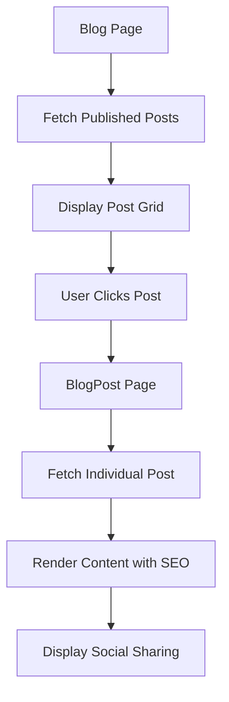
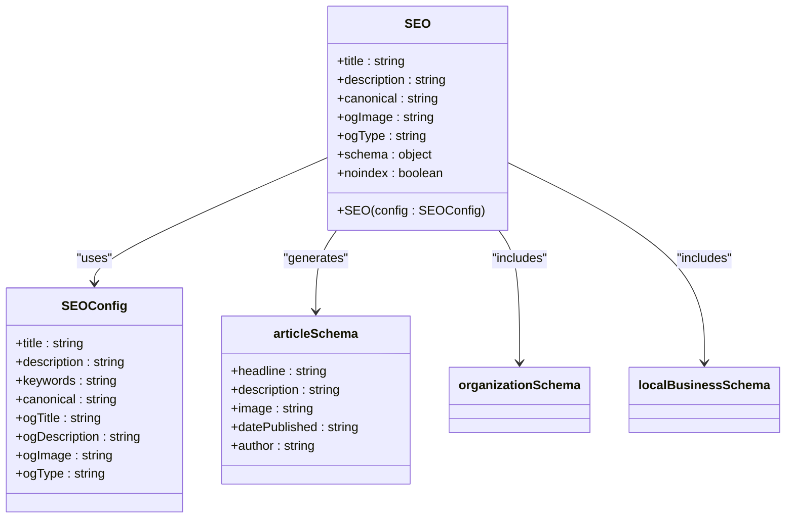
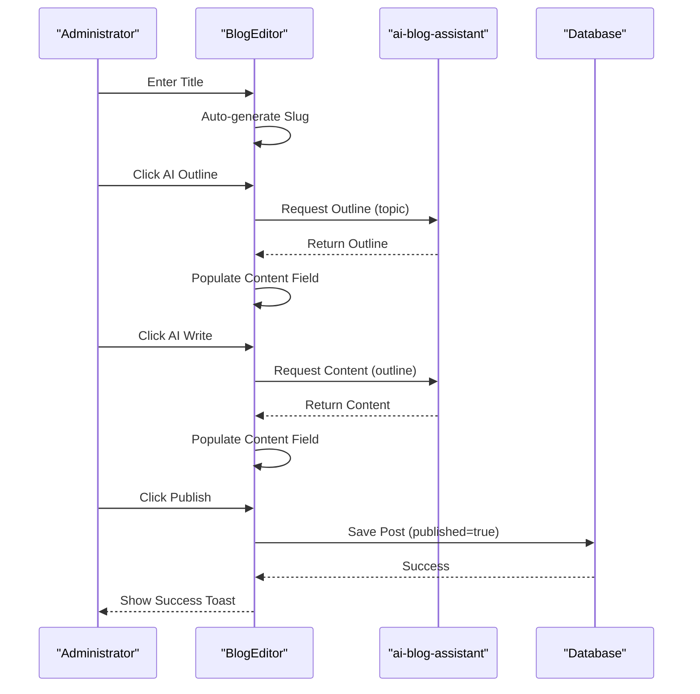
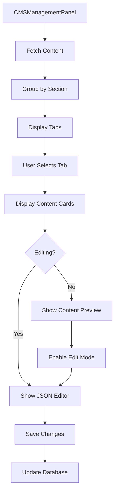
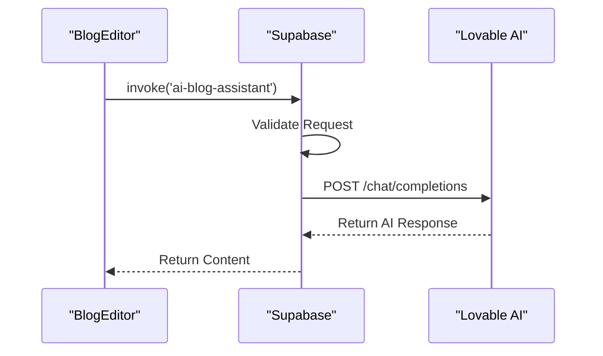
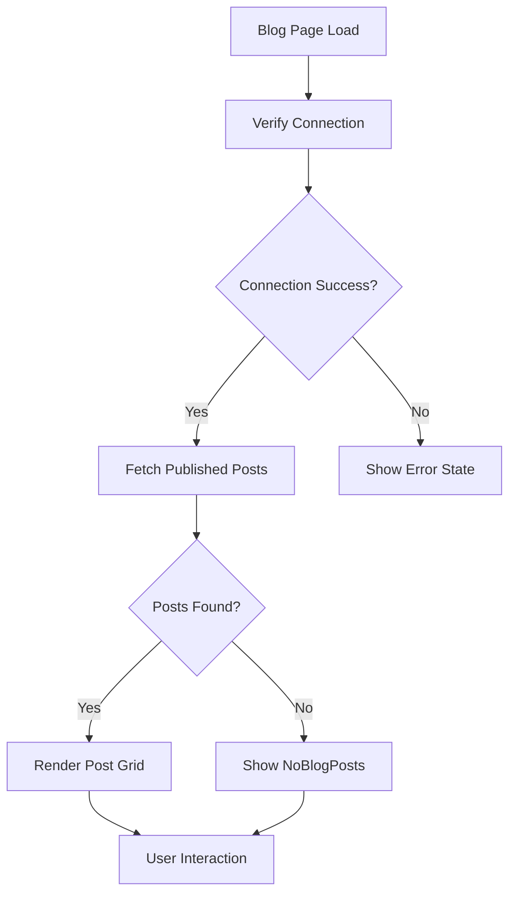
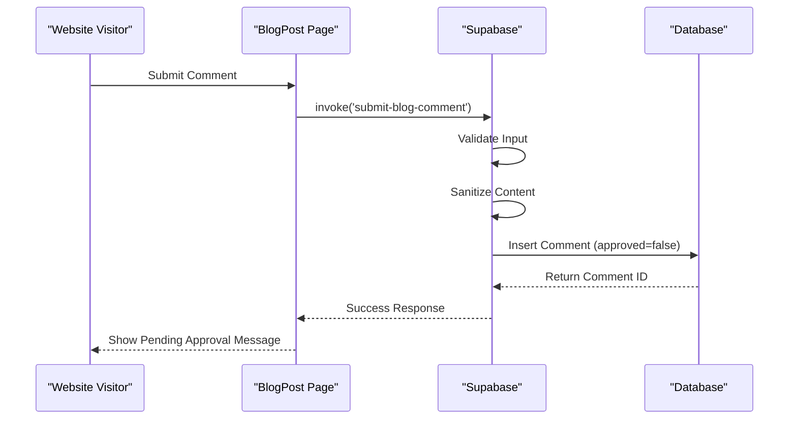

# Content Management

<cite>
**Referenced Files in This Document**   
- [Blog.tsx](file://src/pages/Blog.tsx)
- [BlogPost.tsx](file://src/pages/BlogPost.tsx)
- [BlogEditor.tsx](file://src/components/blog/BlogEditor.tsx)
- [CMSManagementPanel.tsx](file://src/components/admin/CMSManagementPanel.tsx)
- [SEO.tsx](file://src/components/SEO.tsx)
- [ai-blog-assistant/index.ts](file://supabase/functions/ai-blog-assistant/index.ts)
- [blogDebugger.ts](file://src/lib/blogDebugger.ts)
- [seo.ts](file://src/lib/seo.ts)
- [structuredData.ts](file://src/lib/structuredData.ts)
- [AdminBlog.tsx](file://src/pages/AdminBlog.tsx)
- [AdminBlogEditor.tsx](file://src/pages/AdminBlogEditor.tsx)
- [SocialShareButtons.tsx](file://src/components/blog/SocialShareButtons.tsx)
- [BlogErrorBoundary.tsx](file://src/components/blog/BlogErrorBoundary.tsx)
- [NoBlogPosts.tsx](file://src/components/blog/NoBlogPosts.tsx)
- [submit-blog-comment/index.ts](file://supabase/functions/submit-blog-comment/index.ts)
</cite>

## Table of Contents
1. [Introduction](#introduction)
2. [Blog and BlogPost Pages](#blog-and-blogpost-pages)
3. [SEO Component Implementation](#seo-component-implementation)
4. [BlogEditor Component](#blogeditor-component)
5. [CMSManagementPanel](#cmsmanagementpanel)
6. [AI Integration with ai-blog-assistant](#ai-integration-with-ai-blog-assistant)
7. [Content Fetching and Rendering](#content-fetching-and-rendering)
8. [Comment Submission System](#comment-submission-system)
9. [Common Issues and Troubleshooting](#common-issues-and-troubleshooting)
10. [Best Practices for Content Management](#best-practices-for-content-management)
11. [Conclusion](#conclusion)

## Introduction
The Content Management system powers the platform's blog and informational content, providing a comprehensive solution for content creation, management, and optimization. This system enables administrators to create and manage blog posts through an intuitive interface while ensuring optimal SEO performance and user engagement. The architecture integrates AI-powered content generation, robust error handling, and comprehensive moderation workflows to maintain content quality and consistency across the platform.

**Section sources**
- [Blog.tsx](file://src/pages/Blog.tsx#L1-L239)
- [BlogPost.tsx](file://src/pages/BlogPost.tsx#L1-L252)

## Blog and BlogPost Pages
The Blog and BlogPost pages form the core of the content delivery system, rendering dynamic content from the database with optimized user experience. The Blog page displays a grid of published posts with metadata including category, publication date, view counts, and share statistics. Each post is rendered with a featured image, title, excerpt, and interactive elements for navigation.

The BlogPost page provides a detailed view of individual articles with comprehensive metadata, social sharing capabilities, and structured data for SEO optimization. The implementation includes lazy loading for images, responsive design, and accessibility features to enhance user experience across devices.

**Diagram sources**
- [Blog.tsx](file://src/pages/Blog.tsx#L30-L239)
- [BlogPost.tsx](file://src/pages/BlogPost.tsx#L32-L252)

**Section sources**
- [Blog.tsx](file://src/pages/Blog.tsx#L30-L239)
- [BlogPost.tsx](file://src/pages/BlogPost.tsx#L32-L252)

## SEO Component Implementation
The SEO component implements comprehensive search engine optimization through metadata management, structured data, and social sharing integration. It utilizes the SEOConfig interface to define title, description, keywords, and Open Graph properties for each page. The implementation includes automatic canonical URL generation, Twitter card support, and JSON-LD structured data for enhanced search visibility.

The system generates multiple types of structured data including Article, BreadcrumbList, Organization, and LocalBusiness schemas to improve content discoverability and rich snippet display. The SEO component also supports conditional rendering of organization and service schemas based on page context.

**Diagram sources**
- [SEO.tsx](file://src/components/SEO.tsx#L1-L255)
- [seo.ts](file://src/lib/seo.ts#L1-L293)
- [structuredData.ts](file://src/lib/structuredData.ts#L1-L231)

**Section sources**
- [SEO.tsx](file://src/components/SEO.tsx#L1-L255)
- [seo.ts](file://src/lib/seo.ts#L1-L293)
- [structuredData.ts](file://src/lib/structuredData.ts#L1-L231)

## BlogEditor Component
The BlogEditor component provides administrators with a comprehensive interface for creating and editing blog posts. It includes fields for title, slug, category, excerpt, content, and SEO metadata with real-time validation and feedback. The editor features AI-powered content generation capabilities through integration with the ai-blog-assistant Edge Function.

The component implements automatic slug generation from titles, word count tracking, and character limits for SEO fields. It supports both draft saving and immediate publishing with appropriate state management and user feedback through toast notifications.

**Diagram sources**
- [BlogEditor.tsx](file://src/components/blog/BlogEditor.tsx#L1-L297)
- [ai-blog-assistant/index.ts](file://supabase/functions/ai-blog-assistant/index.ts#L1-L84)

**Section sources**
- [BlogEditor.tsx](file://src/components/blog/BlogEditor.tsx#L1-L297)

## CMSManagementPanel
The CMSManagementPanel provides a comprehensive interface for content oversight and management across the platform. It allows administrators to manage various content sections through a tabbed interface with JSON-based content editing. The panel displays content grouped by section with display order, active status, and edit capabilities.

The implementation includes real-time status toggling, content editing with JSON validation, and visual indicators for active/inactive content. The interface provides immediate feedback through toast notifications and maintains a clean, organized layout for efficient content management.

**Diagram sources**
- [CMSManagementPanel.tsx](file://src/components/admin/CMSManagementPanel.tsx#L1-L204)

**Section sources**
- [CMSManagementPanel.tsx](file://src/components/admin/CMSManagementPanel.tsx#L1-L204)

## AI Integration with ai-blog-assistant
The ai-blog-assistant Edge Function enables AI-powered content generation through integration with the Lovable AI platform. The function supports two primary actions: generating blog post outlines and writing full content based on provided outlines. It uses Google's Gemini models with different tiers for outline generation (flash) and content writing (pro).

The implementation includes CORS handling, environment variable validation, and structured prompt engineering to ensure high-quality output. The function processes requests with appropriate system and user prompts, then returns AI-generated content through a secure API endpoint.

**Diagram sources**
- [BlogEditor.tsx](file://src/components/blog/BlogEditor.tsx#L45-L97)
- [ai-blog-assistant/index.ts](file://supabase/functions/ai-blog-assistant/index.ts#L1-L84)

**Section sources**
- [ai-blog-assistant/index.ts](file://supabase/functions/ai-blog-assistant/index.ts#L1-L84)

## Content Fetching and Rendering
The content fetching and rendering system implements robust data retrieval with comprehensive error handling and diagnostics. The Blog page verifies database connection before fetching posts, with fallback mechanisms for connection failures. The implementation includes loading states, error boundaries, and diagnostic tools to ensure reliable content delivery.

The system uses Supabase for database queries with proper filtering for published posts and ordering by publication date. View counts are incremented server-side through a database function, ensuring accurate metrics. The rendering process includes lazy loading for images and responsive design for optimal performance.

**Diagram sources**
- [Blog.tsx](file://src/pages/Blog.tsx#L36-L123)
- [blogDebugger.ts](file://src/lib/blogDebugger.ts#L1-L246)

**Section sources**
- [Blog.tsx](file://src/pages/Blog.tsx#L36-L123)
- [blogDebugger.ts](file://src/lib/blogDebugger.ts#L1-L246)

## Comment Submission System
The comment submission system implements a secure, moderated workflow for user engagement. Comments are submitted through the submit-blog-comment Edge Function, which performs input validation, sanitization, and stores comments with pending approval status. All comments require administrator approval before publication.

The system supports both authenticated and anonymous comments, with proper security measures to prevent spam and abuse. The implementation includes rate limiting, input sanitization, and audit logging to maintain content quality and platform security.

**Diagram sources**
- [submit-blog-comment/index.ts](file://supabase/functions/submit-blog-comment/index.ts#L65-L128)

**Section sources**
- [submit-blog-comment/index.ts](file://supabase/functions/submit-blog-comment/index.ts#L65-L128)

## Common Issues and Troubleshooting
Common issues in the content management system typically involve content rendering problems, editor malfunctions, or database connectivity issues. The system includes comprehensive error handling through the BlogErrorBoundary component, which catches and displays errors with technical details and recovery options.

For content rendering issues, administrators should verify the post's published status and check for valid content format. Editor malfunctions may be resolved by checking Supabase connection status and ensuring proper authentication. The runBlogDiagnostics function provides detailed debugging information for connection and data fetching issues.

The NoBlogPosts component handles the case when no published content is available, providing a user-friendly message and alternative resources. Error states include retry mechanisms, diagnostic tools, and clear error messages to assist with troubleshooting.

**Section sources**
- [BlogErrorBoundary.tsx](file://src/components/blog/BlogErrorBoundary.tsx#L1-L175)
- [NoBlogPosts.tsx](file://src/components/blog/NoBlogPosts.tsx#L1-L117)
- [blogDebugger.ts](file://src/lib/blogDebugger.ts#L1-L246)

## Best Practices for Content Management
To maintain content quality and consistency, administrators should follow these best practices:

1. **SEO Optimization**: Always fill in meta titles and descriptions, use relevant keywords, and ensure proper tagging for discoverability.
2. **Content Structure**: Use clear headings, proper formatting, and engaging visuals to enhance readability.
3. **AI Content Review**: When using AI-generated content, thoroughly review and edit for accuracy, brand voice, and factual correctness.
4. **Consistent Publishing**: Maintain a regular publishing schedule to build audience engagement and improve search rankings.
5. **Mobile Optimization**: Preview content on multiple devices to ensure responsive design and readability.
6. **Analytics Monitoring**: Regularly review view counts and engagement metrics to understand content performance.
7. **Moderation Workflow**: Promptly review and approve/deny comments to maintain community standards.
8. **Backup Strategy**: Regularly export important content as backup against data loss.

**Section sources**
- [BlogEditor.tsx](file://src/components/blog/BlogEditor.tsx#L1-L297)
- [SEO.tsx](file://src/components/SEO.tsx#L1-L255)

## Conclusion
The Content Management system provides a robust, feature-rich platform for managing the website's blog and informational content. With integrated AI assistance, comprehensive SEO optimization, and secure moderation workflows, the system enables efficient content creation and publication while maintaining high quality standards. The architecture balances user-friendly interfaces with powerful backend capabilities, ensuring reliable performance and scalability for future content growth.