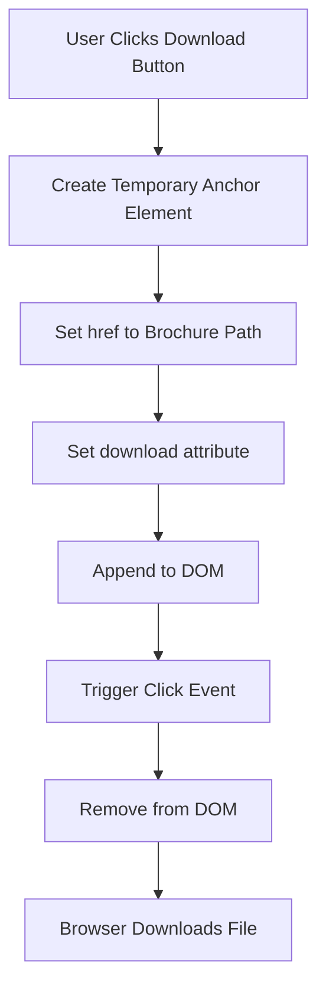
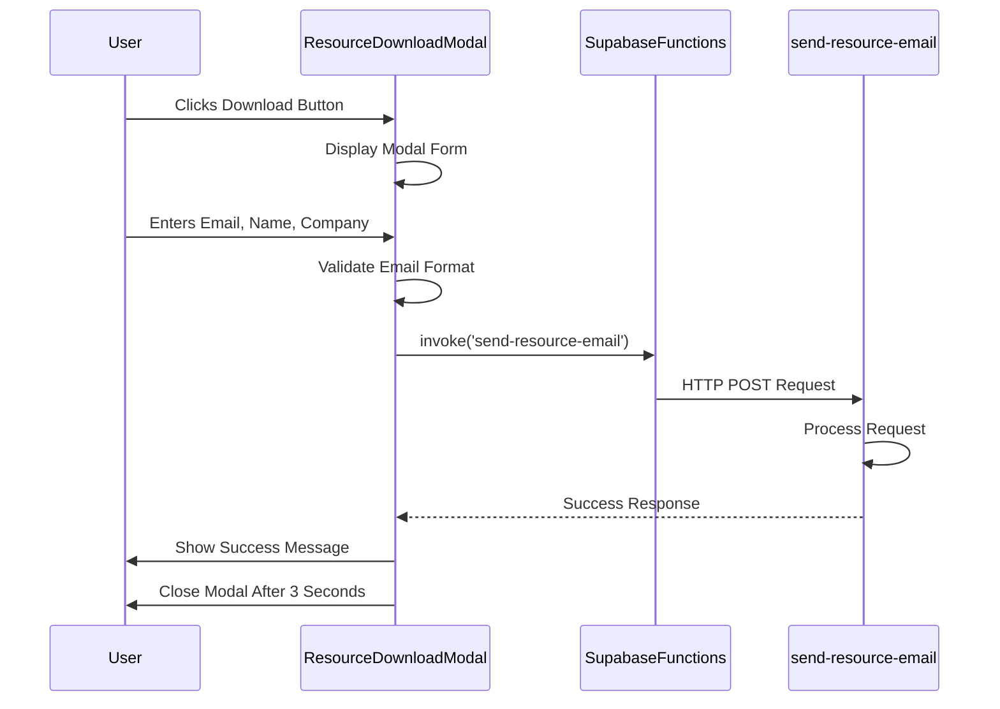
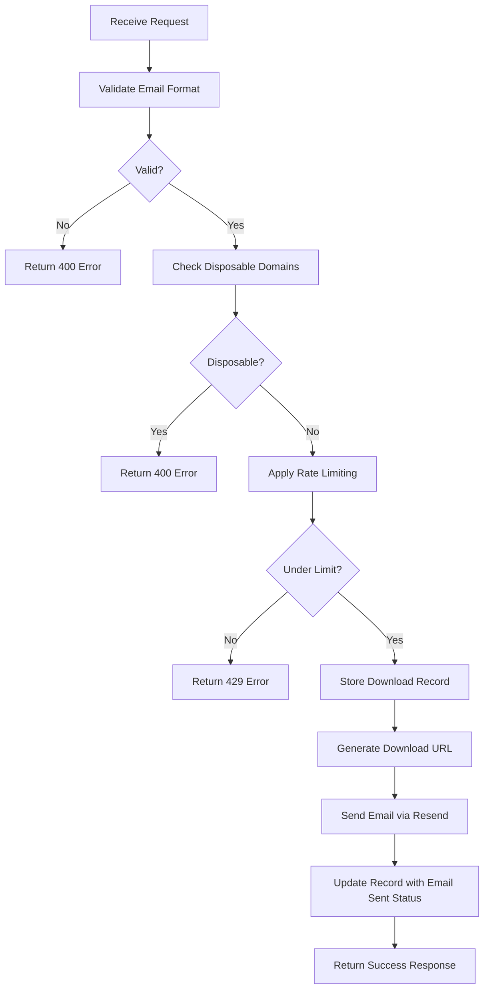
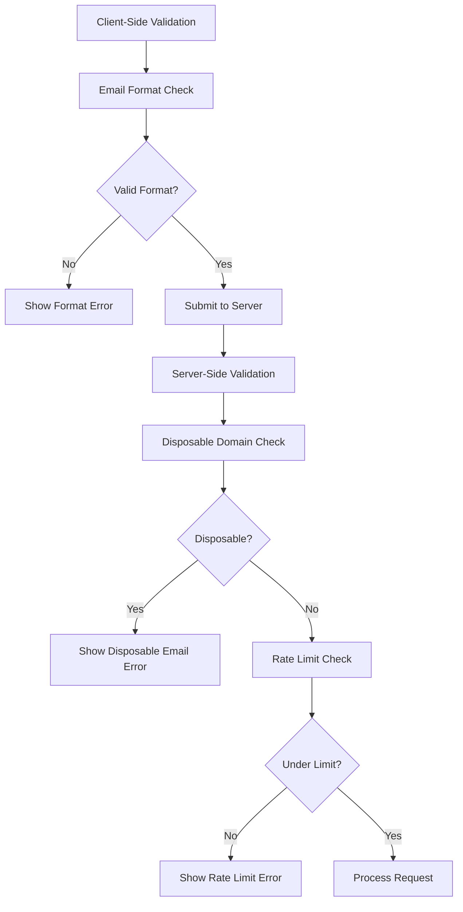
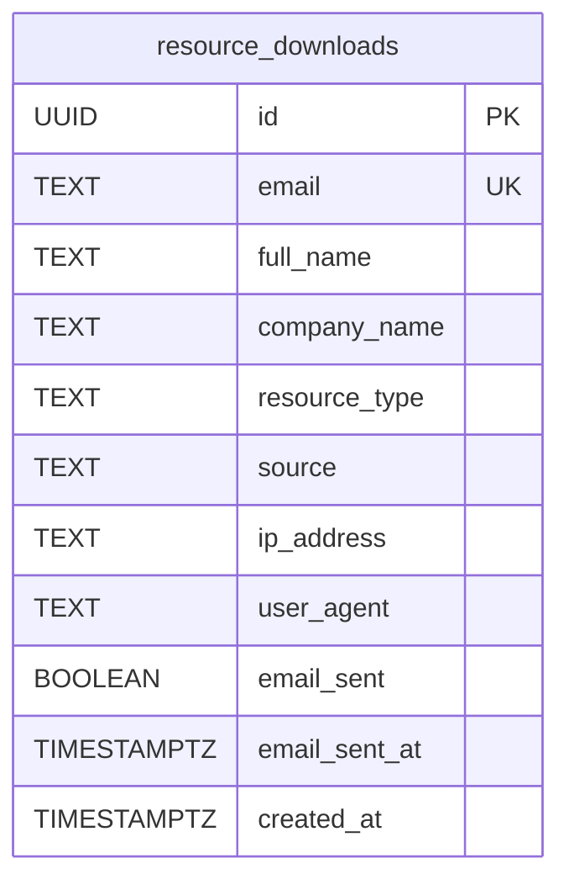
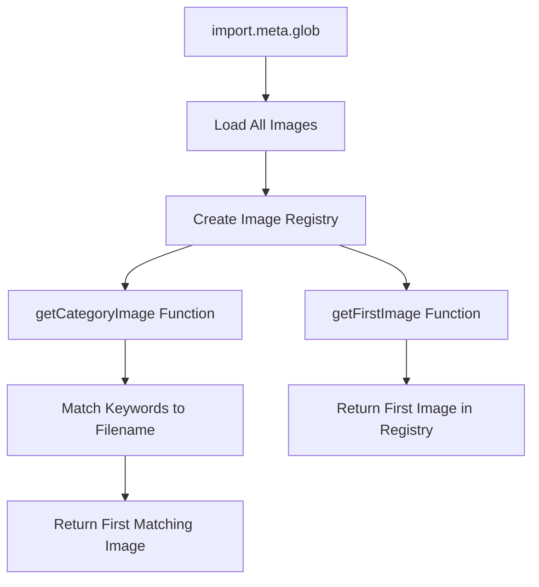

# Resource Downloads

<cite>
**Referenced Files in This Document**   
- [BrochureDownload.tsx](file://src/components/BrochureDownload.tsx)
- [ResourceDownloadModal.tsx](file://src/components/ResourceDownloadModal.tsx)
- [send-resource-email/index.ts](file://supabase/functions/send-resource-email/index.ts)
- [SLEEK_APPARELS_COMPANY_BROCHURE.md](file://public/SLEEK_APPARELS_COMPANY_BROCHURE.md)
- [mediaGallery.ts](file://src/lib/mediaGallery.ts)
- [ResourcesSection.tsx](file://src/components/ResourcesSection.tsx)
- [Brochure.tsx](file://src/pages/Brochure.tsx)
- [20251126153950_c7e943cb-2683-48e9-9c3a-6016f721a744.sql](file://supabase/migrations/20251126153950_c7e943cb-2683-48e9-9c3a-6016f721a744.sql)
</cite>

## Table of Contents
1. [Introduction](#introduction)
2. [BrochureDownload Component](#brochuredownload-component)
3. [ResourceDownloadModal Component](#resourcedownloadmodal-component)
4. [send-resource-email Edge Function](#send-resource-email-edge-function)
5. [SLEEK_APPARELS_COMPANY_BROCHURE.md Processing](#sleek_apparels_company_brochuremd-processing)
6. [Download Request Validation](#download-request-validation)
7. [User Information Collection](#user-information-collection)
8. [Conversion Event Recording](#conversion-event-recording)
9. [Common Issues and Troubleshooting](#common-issues-and-troubleshooting)
10. [Content Management Best Practices](#content-management-best-practices)
11. [Engagement Measurement](#engagement-measurement)
12. [mediaGallery Utility](#mediagallery-utility)

## Introduction
The resource download system enables users to access marketing and technical materials through a gated download process that captures lead information. This system consists of frontend components that trigger downloads, an Edge Function that delivers downloadable links via email, and analytics integration that tracks user interactions. The implementation focuses on converting visitors into leads by offering valuable resources in exchange for contact information, while maintaining a seamless user experience.

**Section sources**
- [BrochureDownload.tsx](file://src/components/BrochureDownload.tsx#L1-L93)
- [ResourceDownloadModal.tsx](file://src/components/ResourceDownloadModal.tsx#L1-L187)
- [send-resource-email/index.ts](file://supabase/functions/send-resource-email/index.ts#L1-L232)

## BrochureDownload Component
The BrochureDownload component provides a user interface for downloading the company brochure with three presentation variants: card, inline, and minimal. The component renders a download button that triggers a direct file download without requiring user information for this specific resource. The card variant displays a comprehensive preview with icon, title, badge, description, and download button, while the inline and minimal variants provide simpler button-only interfaces for different layout contexts.

The component uses client-side JavaScript to create a temporary anchor element and programmatically trigger the download of the brochure file located at `/SLEEK_APPARELS_COMPANY_BROCHURE.md`. This approach allows for direct file access without server-side processing for this particular resource, making it immediately available to users without lead capture requirements.

**Diagram sources**
- [BrochureDownload.tsx](file://src/components/BrochureDownload.tsx#L12-L21)

**Section sources**
- [BrochureDownload.tsx](file://src/components/BrochureDownload.tsx#L1-L93)
- [Brochure.tsx](file://src/pages/Brochure.tsx#L44-L182)

## ResourceDownloadModal Component
The ResourceDownloadModal component implements a gated download system that captures user information before delivering resources. This modal dialog collects email address (required), full name (optional), and company name (optional) through a form interface. The component manages form state, validation, and submission process, providing visual feedback during the submission process.

When a user submits the form, the component validates the email format using a regular expression before proceeding. It then invokes the `send-resource-email` Edge Function via Supabase Functions, passing the collected user information along with the requested resource type and source location. During submission, the component displays a loading spinner to indicate processing status, and upon successful submission, shows a success message with the user's email address before automatically closing.

**Diagram sources**
- [ResourceDownloadModal.tsx](file://src/components/ResourceDownloadModal.tsx#L29-L79)

**Section sources**
- [ResourceDownloadModal.tsx](file://src/components/ResourceDownloadModal.tsx#L1-L187)
- [ResourcesSection.tsx](file://src/components/ResourcesSection.tsx#L31-L34)

## send-resource-email Edge Function
The send-resource-email Edge Function processes resource download requests, validates user information, stores download records, and delivers downloadable links via email. This serverless function runs on the Supabase platform and handles the entire resource delivery workflow securely.

The function performs several critical operations: email validation (format and disposable domain checking), rate limiting (maximum 3 downloads per email per day), database record creation, and email delivery via the Resend email service. When a valid request is received, the function creates a record in the resource_downloads table with user information, IP address, user agent, and timestamps. It then sends an email containing a download link with branded HTML content, including marketing messages and calls-to-action.

**Diagram sources**
- [send-resource-email/index.ts](file://supabase/functions/send-resource-email/index.ts#L73-L231)

**Section sources**
- [send-resource-email/index.ts](file://supabase/functions/send-resource-email/index.ts#L1-L232)
- [ResourceDownloadModal.tsx](file://src/components/ResourceDownloadModal.tsx#L42-L49)

## SLEEK_APPARELS_COMPANY_BROCHURE.md Processing
The SLEEK_APPARELS_COMPANY_BROCHURE.md file serves as the source content for the company brochure, currently implemented as a markdown file that is intended to be converted to a professional PDF document. The file contains instructions for creating the final brochure, including guidelines for using design tools like Canva, Adobe InDesign, or Figma to apply brand styling and export a polished PDF version.

The current implementation links directly to the markdown file for download, but the documentation indicates a planned workflow where the markdown content will be imported into a design tool, professionally formatted with brand colors and styling, and exported as a PDF. Once the PDF is created and placed in the public folder, the BrochureDownload component should be updated to point to the PDF file instead of the markdown source.

The brochure content is designed to provide a comprehensive overview of the company's business operations, manufacturing capabilities, unique selling points, certifications, and success stories, targeting partners, investors, and procurement teams.

**Section sources**
- [SLEEK_APPARELS_COMPANY_BROCHURE.md](file://public/SLEEK_APPARELS_COMPANY_BROCHURE.md#L1-L15)
- [BrochureDownload.tsx](file://src/components/BrochureDownload.tsx#L16-L17)

## Download Request Validation
The resource download system implements multiple layers of validation to ensure data quality and prevent abuse. Client-side validation in the ResourceDownloadModal component checks for valid email format using a regular expression pattern that verifies the basic structure of email addresses. This immediate feedback helps users correct input errors before submission.

Server-side validation in the send-resource-email function performs more comprehensive checks, including verification against a list of disposable email domains (e.g., tempmail.com, guerrillamail.com, mailinator.com) to prevent use of temporary email services. The function also implements rate limiting to prevent abuse, restricting users to a maximum of three downloads per email address within a 24-hour period.

The validation process returns specific error messages to the client, which are displayed as user-friendly toast notifications. These include "Please enter a valid email address" for format errors, "Please use a permanent email address" for disposable domains, and "You've reached the download limit. Please try again tomorrow." for rate limiting.

**Diagram sources**
- [ResourceDownloadModal.tsx](file://src/components/ResourceDownloadModal.tsx#L33-L37)
- [send-resource-email/index.ts](file://supabase/functions/send-resource-email/index.ts#L79-L85)

**Section sources**
- [ResourceDownloadModal.tsx](file://src/components/ResourceDownloadModal.tsx#L32-L37)
- [send-resource-email/index.ts](file://supabase/functions/send-resource-email/index.ts#L78-L85)

## User Information Collection
The resource download system collects user information through a structured form in the ResourceDownloadModal component. The form requires users to provide their email address, which serves as the primary identifier for lead tracking and communication. Additionally, users can optionally provide their full name and company name, which helps qualify leads and personalize follow-up communications.

The collected information is transmitted securely to the send-resource-email Edge Function, which stores it in the resource_downloads database table. This table captures not only the user-provided information but also metadata such as IP address, user agent, source location, and timestamps. The source parameter indicates where the download request originated (e.g., 'homepage'), enabling analysis of which pages are most effective at generating leads.

The form design balances conversion optimization with data collection, making only the email field mandatory to reduce friction while still gathering valuable qualifying information through optional fields. This approach maximizes conversion rates while still providing sufficient data for lead qualification and segmentation.

**Section sources**
- [ResourceDownloadModal.tsx](file://src/components/ResourceDownloadModal.tsx#L23-L25)
- [send-resource-email/index.ts](file://supabase/functions/send-resource-email/index.ts#L76-L77)

## Conversion Event Recording
The resource download system records conversion events in multiple systems to enable comprehensive analytics and follow-up. When a user successfully requests a resource, the system creates a record in the resource_downloads table in the Supabase database, capturing all user information and interaction metadata. This record serves as the primary source of truth for download activity and lead generation.

The system also integrates with external analytics platforms to track conversion events across different channels. The analytics implementation includes Google Analytics 4, Google Tag Manager, Facebook Pixel, LinkedIn Insight Tag, and Microsoft Clarity, allowing for cross-platform tracking of conversion events. These integrations enable attribution modeling, campaign performance analysis, and retargeting across different marketing channels.

Additionally, the system tracks email delivery status by updating the resource_downloads record when the email is successfully sent. This allows monitoring of email deliverability rates and identification of potential delivery issues. The combination of database records and external analytics provides a comprehensive view of conversion performance and user engagement.

**Diagram sources**
- [20251126153950_c7e943cb-2683-48e9-9c3a-6016f721a744.sql](file://supabase/migrations/20251126153950_c7e943cb-2683-48e9-9c3a-6016f721a744.sql#L2-L14)

**Section sources**
- [send-resource-email/index.ts](file://supabase/functions/send-resource-email/index.ts#L115-L127)
- [src/lib/analytics.ts](file://src/lib/analytics.ts#L126-L142)

## Common Issues and Troubleshooting
The resource download system may encounter several common issues that affect user experience and conversion rates. Failed email deliveries can occur due to invalid email addresses, spam filtering, or issues with the email service provider. The system handles these by validating email formats and domains before submission, but some delivery failures may still occur after the initial validation.

Spam filtering is a significant challenge, as automated emails may be flagged by email providers. To mitigate this, the system uses a dedicated email sending domain (resources@sleekapparels.com) and includes clear unsubscribe options in the email content. Users are also advised to check their spam folders if they don't receive the download link.

Other common issues include rate limiting (users reaching the 3-downloads-per-day limit), temporary service outages, and network connectivity problems. The system provides specific error messages for these scenarios to guide users on appropriate next steps. For rate limiting, users are advised to try again the following day, while general failures prompt users to retry the request.

**Section sources**
- [ResourceDownloadModal.tsx](file://src/components/ResourceDownloadModal.tsx#L69-L75)
- [send-resource-email/index.ts](file://supabase/functions/send-resource-email/index.ts#L104-L107)

## Content Management Best Practices
Effective management of downloadable resources requires adherence to several best practices. Resources should be versioned systematically, with clear naming conventions that include version numbers and dates to track updates and prevent confusion. Each resource should have a defined review cycle to ensure content remains current and accurate.

Access tracking is essential for understanding resource popularity and user engagement. The system should capture metrics such as download frequency, conversion rates, and user demographics to inform content strategy. Resources should be organized in a logical directory structure that reflects their category and purpose, making them easy to locate and manage.

Security considerations include protecting sensitive resources with appropriate access controls and ensuring that all downloadable content is scanned for malware. Metadata should be maintained for each resource, including title, description, file size, format, and intended audience, to facilitate discovery and usage tracking.

**Section sources**
- [send-resource-email/index.ts](file://supabase/functions/send-resource-email/index.ts#L51-L64)
- [ResourcesSection.tsx](file://src/components/ResourcesSection.tsx#L15-L28)

## Engagement Measurement
The resource download system measures user engagement through multiple metrics and analytics integrations. The primary engagement metric is the download conversion rate, calculated as the percentage of visitors who complete a download request. This is tracked through the resource_downloads database table, which records each successful request.

Additional engagement metrics include email open rates and click-through rates, which can be monitored through the email service provider's analytics. The system also integrates with web analytics platforms to track user behavior before and after downloading resources, such as time on site, pages visited, and subsequent conversion events.

The analytics implementation captures detailed information about each interaction, including geographic location (from IP address), device type (from user agent), and referral source. This data enables segmentation of users and personalization of follow-up communications. Engagement trends can be analyzed over time to identify popular resources and optimize the content strategy.

**Section sources**
- [src/lib/analytics.ts](file://src/lib/analytics.ts#L1-L183)
- [src/lib/analyticsTracking.ts](file://src/lib/analyticsTracking.ts#L78-L130)

## mediaGallery Utility
The mediaGallery utility provides functionality for organizing and retrieving downloadable assets, particularly images used throughout the application. The utility uses Vite's import.meta.glob feature to automatically load all images from the src/assets directory, creating a centralized repository of available media assets.

The utility exports functions to retrieve images based on category keywords, enabling dynamic selection of appropriate images for different contexts. For example, the getCategoryImage function can return images related to specific product categories like knitwear, cut-and-sew, uniforms, or accessories based on filename patterns. This allows components to request images by category without needing to know specific filenames.

The utility also provides a getFirstImage function as a fallback option when no specific category match is found. All image URLs are resolved at build time, ensuring optimal performance and correct path resolution in different deployment environments. This approach simplifies asset management and enables consistent image usage across the application.

**Diagram sources**
- [mediaGallery.ts](file://src/lib/mediaGallery.ts#L10-L45)

**Section sources**
- [mediaGallery.ts](file://src/lib/mediaGallery.ts#L1-L50)