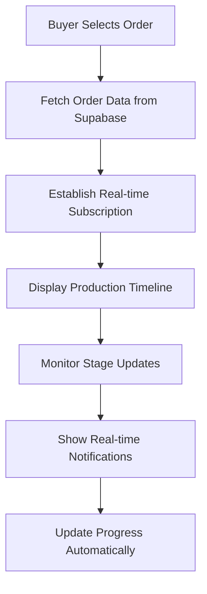
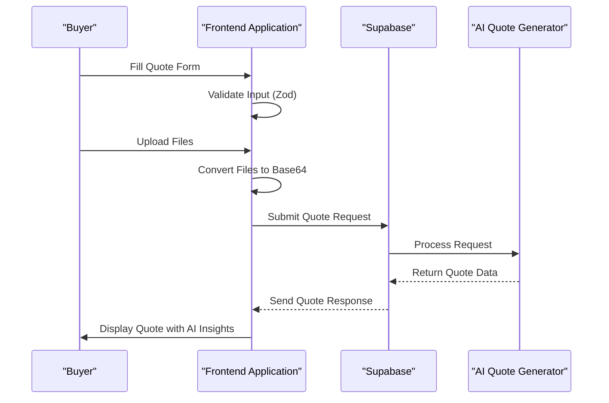
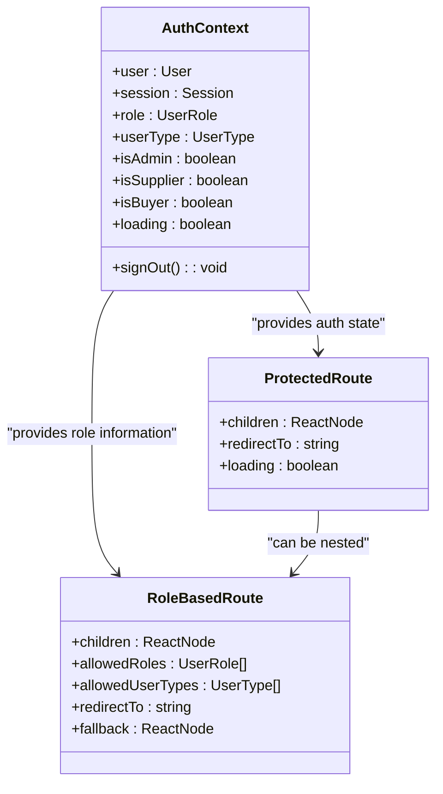
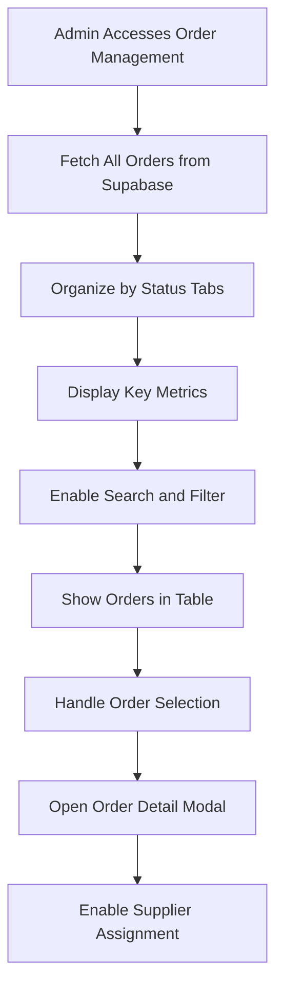
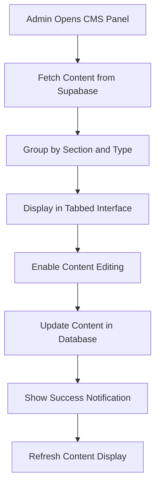

# Core Features

<cite>
**Referenced Files in This Document**   
- [LoopTraceOrderTracking.tsx](file://src/components/buyer/LoopTraceOrderTracking.tsx)
- [AIQuoteGenerator.tsx](file://src/components/AIQuoteGenerator.tsx)
- [RoleBasedRoute.tsx](file://src/components/routes/RoleBasedRoute.tsx)
- [OrderManagement.tsx](file://src/pages/admin/OrderManagement.tsx)
- [CMSManagementPanel.tsx](file://src/components/admin/CMSManagementPanel.tsx)
- [aiQuote.ts](file://src/lib/api/aiQuote.ts)
- [AdminStageMonitor.tsx](file://src/components/admin/AdminStageMonitor.tsx)
- [QuoteApprovalPanel.tsx](file://src/components/admin/QuoteApprovalPanel.tsx)
- [SupplierAnalyticsCard.tsx](file://src/components/admin/SupplierAnalyticsCard.tsx)
- [ProtectedRoute.tsx](file://src/components/routes/ProtectedRoute.tsx)
</cite>

## Table of Contents
1. [LoopTrace™ Production Tracking](#looptrace-production-tracking)
2. [AI Quote Generator](#ai-quote-generator)
3. [Role-Based Access Control](#role-based-access-control)
4. [Order Management](#order-management)
5. [Content Management](#content-management)
6. [Integration Points](#integration-points)
7. [Common Issues and Best Practices](#common-issues-and-best-practices)

## LoopTrace™ Production Tracking

The LoopTrace™ Production Tracking system provides real-time visibility into the manufacturing process, allowing buyers to monitor their orders at every stage of production. This feature is implemented through the `LoopTraceOrderTracking` component, which displays a comprehensive timeline of production stages with real-time updates.

The system works by fetching order data from the Supabase database and establishing a real-time subscription to the `production_stages` table. When a user selects an order, the component retrieves the associated production stages and displays them in a timeline format with visual indicators for each stage's status. The implementation uses Supabase's real-time capabilities to push updates to the client whenever a production stage is updated, providing instant notifications through the Sonner toast system.

Key functionality includes:
- Real-time updates via Supabase's real-time subscriptions
- Visual timeline with progress indicators for each production stage
- Photo documentation at each stage with clickable thumbnails
- Automatic progress calculation based on completion percentages
- Estimated delivery date tracking

The system also provides AI-powered insights and predictive analytics to identify potential delays before they occur, helping buyers plan accordingly. Production managers can upload photos and notes at each stage, providing visual proof of work completed.

**Diagram sources**
- [LoopTraceOrderTracking.tsx](file://src/components/buyer/LoopTraceOrderTracking.tsx#L41-L365)
- [AdminStageMonitor.tsx](file://src/components/admin/AdminStageMonitor.tsx#L12-L127)

**Section sources**
- [LoopTraceOrderTracking.tsx](file://src/components/buyer/LoopTraceOrderTracking.tsx#L41-L365)
- [AdminStageMonitor.tsx](file://src/components/admin/AdminStageMonitor.tsx#L12-L127)

## AI Quote Generator

The AI Quote Generator is a sophisticated feature that provides instant pricing and production timeline estimates based on user requirements. Implemented in the `AIQuoteGenerator` component, this feature combines client-side validation with server-side AI processing to deliver accurate quotes in seconds.

The workflow begins with a comprehensive form that captures product specifications including type, quantity, complexity level, fabric type, GSM, and print/embroidery requirements. The form includes client-side validation using Zod schema validation to ensure data quality before submission. When the user submits their requirements, the system converts any uploaded files (tech packs, reference images, or PDFs) to base64 format and sends them along with the form data to the AI quote generation service.

The backend processing occurs in the `ai-quote-generator` Supabase function, which uses AI to analyze the requirements and generate a quote based on Bangladesh manufacturing standards. The system includes retry logic and timeout handling to ensure reliability, with a 30-second client-side timeout and automatic retry mechanism. The AI considers factors such as complexity, volume discounts, and MOQ premiums when calculating pricing.

Key features include:
- Client-side validation with detailed error messages
- File upload support for tech packs and reference materials
- Progress indication during quote generation
- Detailed breakdown of pricing components
- AI-powered insights and recommendations
- Timeline estimation with stage-by-stage breakdown

The generated quote displays the total price, unit price, estimated delivery timeline, and AI-generated suggestions for optimization. Users can see how volume discounts are applied and understand the factors affecting their pricing.

**Diagram sources**
- [AIQuoteGenerator.tsx](file://src/components/AIQuoteGenerator.tsx#L66-L575)
- [aiQuote.ts](file://src/lib/api/aiQuote.ts#L49-L146)

**Section sources**
- [AIQuoteGenerator.tsx](file://src/components/AIQuoteGenerator.tsx#L66-L575)
- [aiQuote.ts](file://src/lib/api/aiQuote.ts#L49-L146)

## Role-Based Access Control

The Role-Based Access Control (RBAC) system ensures that users can only access features and data appropriate to their role within the platform. This security model is implemented through the `RoleBasedRoute` and `ProtectedRoute` components, which work in conjunction with the `AuthContext` to manage user permissions.

The system defines three primary roles: admin, supplier, and buyer, with additional user types that provide more granular control. The `AuthContext` manages the user's authentication state and role information, which is then used by the routing components to determine access. The `ProtectedRoute` component ensures that only authenticated users can access protected pages, while the `RoleBasedRoute` component provides more granular control by checking specific roles or user types.

Key implementation details:
- Real-time authentication state management via Supabase auth
- Role and user type determination in the AuthContext
- Route-level protection with loading states and fallbacks
- Admin-only access to sensitive operations like order management and content editing
- Supplier-specific views for production management
- Buyer-specific views for order tracking and quote management

The system uses Supabase's Row Level Security (RLS) policies in conjunction with application-level role checking to provide defense in depth. Database policies ensure that even if a request bypasses the frontend checks, the database will still enforce access restrictions.

**Diagram sources**
- [RoleBasedRoute.tsx](file://src/components/routes/RoleBasedRoute.tsx#L17-L59)
- [ProtectedRoute.tsx](file://src/components/routes/ProtectedRoute.tsx#L14-L35)
- [AuthContext.tsx](file://src/contexts/AuthContext.tsx#L131-L165)

**Section sources**
- [RoleBasedRoute.tsx](file://src/components/routes/RoleBasedRoute.tsx#L17-L59)
- [ProtectedRoute.tsx](file://src/components/routes/ProtectedRoute.tsx#L14-L35)

## Order Management

The Order Management system provides administrators with comprehensive tools to oversee the entire order lifecycle, from initial quote to final delivery. Implemented in the `OrderManagement` page, this feature offers a centralized dashboard for monitoring, filtering, and taking action on orders.

The system displays orders in a tabbed interface organized by status (pending, awaiting assignment, in progress, and completed), with each tab showing only orders in that workflow state. Administrators can search orders by order number or product type and filter by status. The interface includes key metrics such as total orders, pending reviews, orders needing supplier assignment, and total margin.

Key functionality includes:
- Comprehensive order listing with filtering and search
- Status-based organization with visual indicators
- Detailed order metrics and financial tracking
- One-click access to order details via modal dialogs
- Supplier assignment capabilities
- Margin calculation and tracking

The system integrates with the quote approval workflow, ensuring that only approved quotes are converted to orders. When an order requires supplier assignment, administrators can use the Smart Supplier Assignment system to automatically match orders with appropriate suppliers based on capacity, expertise, and location.

**Diagram sources**
- [OrderManagement.tsx](file://src/pages/admin/OrderManagement.tsx#L43-L306)
- [OrderDetailModal.tsx](file://src/components/admin/OrderDetailModal.tsx#L217-L228)
- [useOrderManagement.ts](file://src/hooks/useOrderManagement.ts#L52-L86)

**Section sources**
- [OrderManagement.tsx](file://src/pages/admin/OrderManagement.tsx#L43-L306)
- [QuoteApprovalPanel.tsx](file://src/components/admin/QuoteApprovalPanel.tsx#L24-L298)

## Content Management

The Content Management System (CMS) allows administrators to manage website content across various sections and content types. Implemented through the `CMSManagementPanel` and `EnhancedCMSPanel` components, this feature provides a user-friendly interface for editing, activating, and organizing content.

The system organizes content by section (such as hero, features, testimonials) and content type (such as text, images, CTAs), with each piece of content having a display order and active/inactive status. Administrators can edit content directly in a JSON editor within the interface, with changes saved immediately to the database. The implementation uses Supabase to store content in the `cms_content` table, with real-time updates ensuring consistency across instances.

Key features include:
- Tabbed interface organized by content section
- JSON-based content editing with syntax highlighting
- Content activation/deactivation without deletion
- Display order management
- Real-time saving with success notifications
- Integration with AI-powered content generation tools

The Enhanced CMS Panel extends the basic functionality by integrating blog editing and product description generation capabilities, creating a comprehensive content management suite. This allows administrators to manage all website content from a single interface, improving workflow efficiency.

**Diagram sources**
- [CMSManagementPanel.tsx](file://src/components/admin/CMSManagementPanel.tsx#L21-L204)
- [EnhancedCMSPanel.tsx](file://src/components/admin/EnhancedCMSPanel.tsx#L8-L46)

**Section sources**
- [CMSManagementPanel.tsx](file://src/components/admin/CMSManagementPanel.tsx#L21-L204)
- [EnhancedCMSPanel.tsx](file://src/components/admin/EnhancedCMSPanel.tsx#L8-L46)

## Integration Points

The core features of the Sleek Apparels platform are designed to work together seamlessly, with several key integration points that create a cohesive user experience:

1. **Quote-to-Order Workflow**: The AI Quote Generator integrates with the Order Management system, where approved quotes are converted to orders. The Quote Approval Panel serves as the bridge between these systems, allowing administrators to add markup and finalize quotes before they become orders.

2. **Production Tracking Integration**: Once an order is assigned to a supplier, the LoopTrace™ Production Tracking system activates automatically. The production stages are initialized through the `initialize-production-stages` Supabase function, creating the timeline that buyers will monitor.

3. **Role-Based Access to Features**: The Role-Based Access Control system governs access to all features. Buyers can access the AI Quote Generator and LoopTrace™ tracking, suppliers have access to production management tools, and administrators can use all systems including Order Management and CMS.

4. **Supplier Assignment**: The Order Management system integrates with the Smart Supplier Assignment feature, which analyzes order requirements and matches them with appropriate suppliers based on capacity, expertise, and location data.

5. **Content and Marketing Integration**: The CMS Management system integrates with marketing features, allowing administrators to update website content that promotes the AI Quote Generator and LoopTrace™ tracking capabilities.

These integration points create a seamless workflow from initial quote request through production and delivery, with appropriate access controls ensuring data security and role-appropriate functionality.

## Common Issues and Best Practices

### Common Issues

1. **AI Quote Generation Timeouts**: The AI quote generation process has a 30-second timeout. Complex requests with multiple file uploads may exceed this limit. Users should simplify requirements or break complex orders into smaller components.

2. **Real-time Subscription Disconnections**: In rare cases, the real-time subscription for production tracking may disconnect. The system automatically attempts to reconnect, but users may need to refresh the page if updates stop appearing.

3. **Role Permission Confusion**: New users may be confused about their access level. Clear documentation and intuitive UI design help mitigate this issue.

4. **Content Editing Errors**: Direct JSON editing in the CMS can lead to syntax errors. The system includes basic validation, but administrators should be cautious when editing complex content structures.

### Best Practices

1. **For AI Quote Generator**:
   - Provide detailed but focused requirements
   - Use the file upload feature for complex designs
   - Review AI insights for optimization opportunities
   - Start with simpler products when testing the system

2. **For LoopTrace™ Tracking**:
   - Check the tracking dashboard regularly
   - Respond promptly to automated alerts
   - Use the photo documentation to verify quality
   - Communicate with suppliers through the integrated messaging system

3. **For Order Management**:
   - Review pending quotes daily
   - Assign suppliers promptly to avoid delays
   - Use the filtering and search features to manage large order volumes
   - Monitor margin metrics to ensure profitability

4. **For Content Management**:
   - Test content changes on staging before production
   - Use descriptive section and content type names
   - Maintain consistent display order logic
   - Coordinate content updates with marketing campaigns

By following these best practices, users can maximize the effectiveness of the Sleek Apparels platform's core features and ensure smooth operations throughout the manufacturing process.