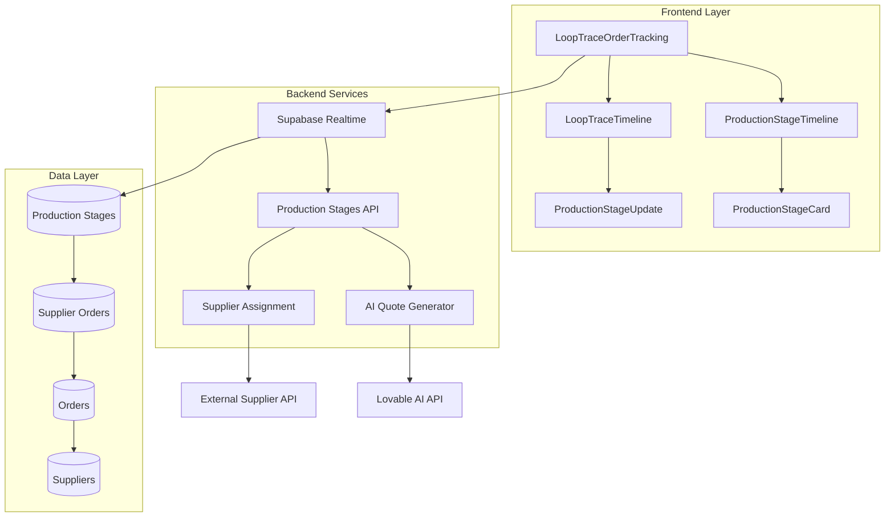
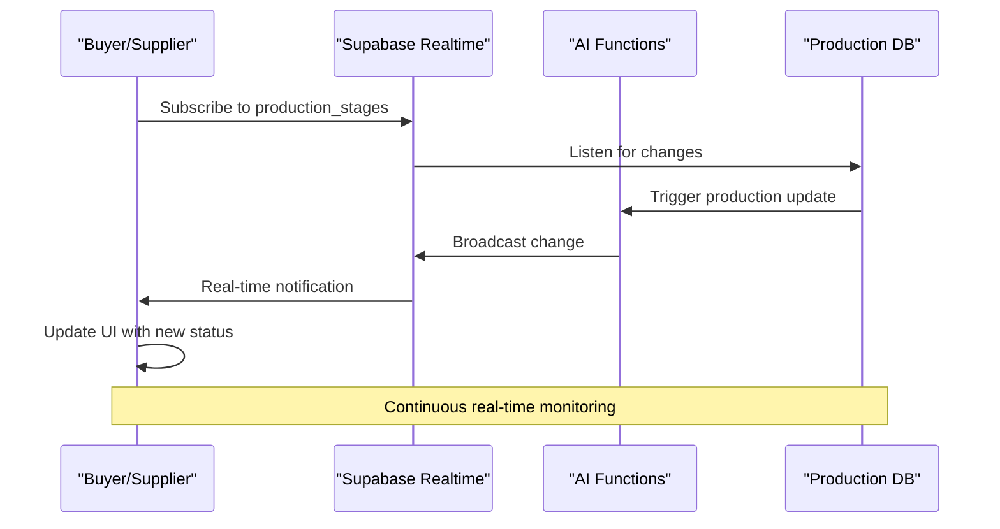
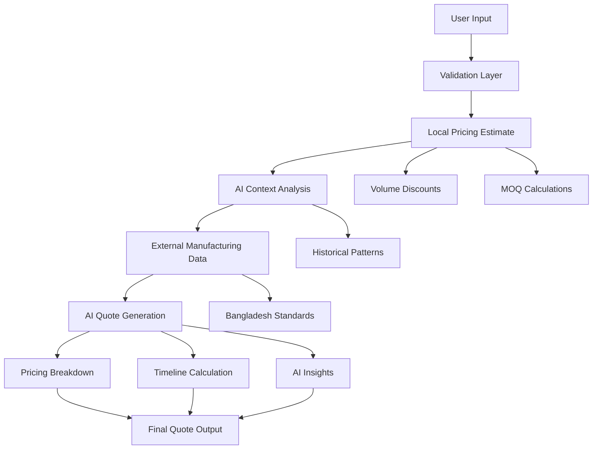
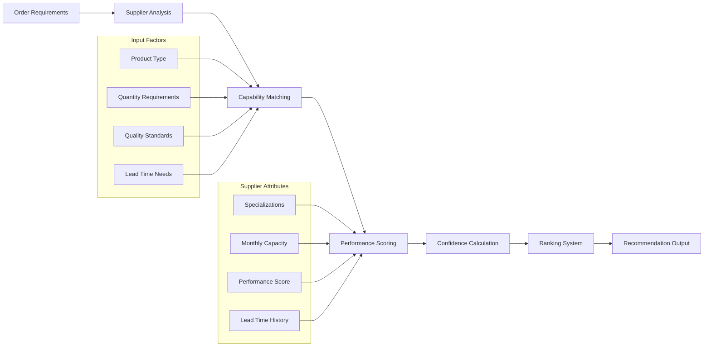
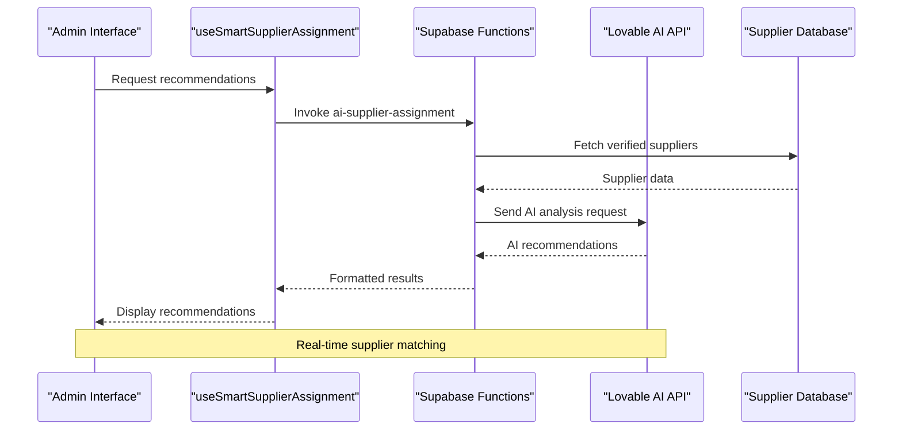
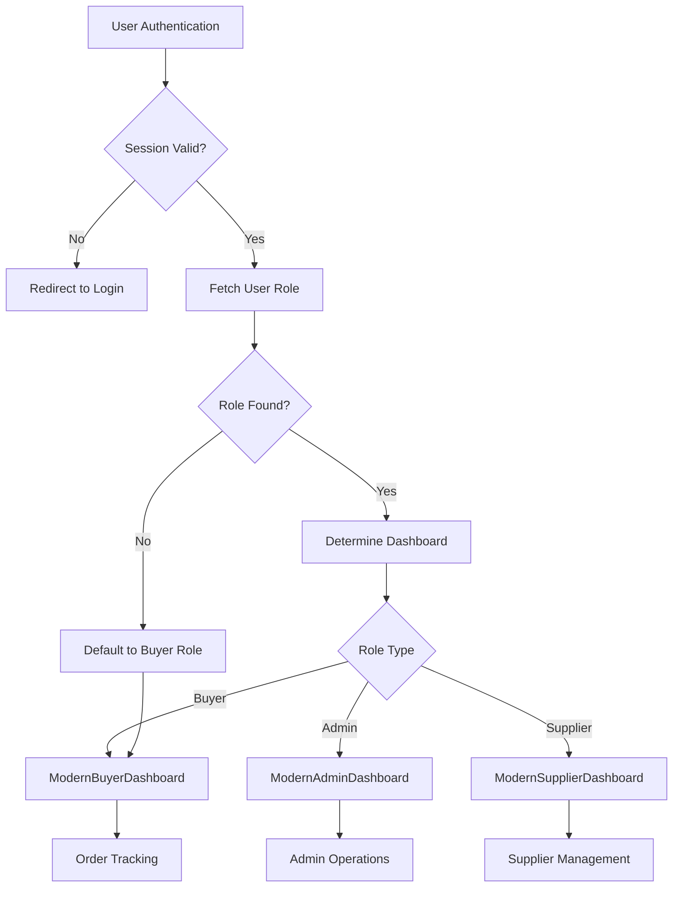
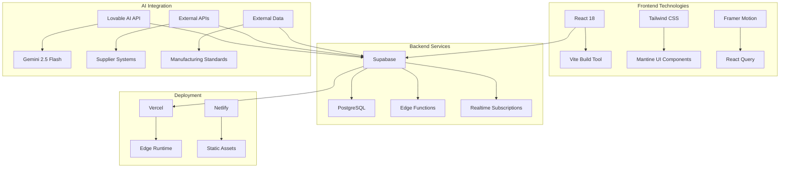
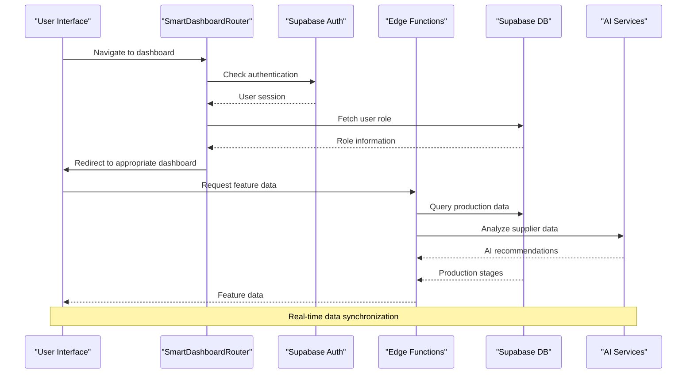

# Core Features

<cite>
**Referenced Files in This Document**
- [LoopTraceOrderTracking.tsx](file://src/components/buyer/LoopTraceOrderTracking.tsx)
- [AIQuoteGenerator.tsx](file://src/components/AIQuoteGenerator.tsx)
- [SmartSupplierAssignment.tsx](file://src/components/admin/SmartSupplierAssignment.tsx)
- [ProductionStageTimeline.tsx](file://src/components/production/ProductionStageTimeline.tsx)
- [LoopTraceTimeline.tsx](file://src/components/modern/LoopTraceTimeline.tsx)
- [useSmartSupplierAssignment.ts](file://src/hooks/useSmartSupplierAssignment.ts)
- [aiQuote.ts](file://src/lib/api/aiQuote.ts)
- [SmartDashboardRouter.tsx](file://src/components/SmartDashboardRouter.tsx)
- [ProductionTracking.tsx](file://src/pages/ProductionTracking.tsx)
- [ai-quote-generator/index.ts](file://supabase/functions/ai-quote-generator/index.ts)
- [ai-supplier-assignment/index.ts](file://supabase/functions/ai-supplier-assignment/index.ts)
</cite>

## Table of Contents
1. [Introduction](#introduction)
2. [LoopTrace™ Production Tracking](#looptrace-production-tracking)
3. [AI Quote Generation](#ai-quote-generation)
4. [SmartSupplierAssignment](#smart-supplier-assignment)
5. [Role-Based Dashboards](#role-based-dashboards)
6. [Feature Architecture](#feature-architecture)
7. [Integration Patterns](#integration-patterns)
8. [Common Use Cases](#common-use-cases)
9. [Troubleshooting Guide](#troubleshooting-guide)
10. [Best Practices](#best-practices)

## Introduction

SleekApparels v100 introduces four transformative core features that revolutionize apparel manufacturing and supply chain management. These features leverage cutting-edge AI technology, real-time data processing, and intelligent automation to deliver unprecedented transparency, efficiency, and decision-making capabilities across the entire apparel production lifecycle.

The core features include:
- **LoopTrace™ Production Tracking**: Real-time manufacturing monitoring with AI-powered insights
- **AI Quote Generation**: Intelligent pricing with instant, data-driven quotes
- **SmartSupplierAssignment**: Automated supplier matching with confidence scoring
- **Role-Based Dashboards**: Tailored user experiences for buyers, suppliers, and administrators

Each feature is built on a robust foundation of modern web technologies, real-time data synchronization, and scalable backend services that ensure reliability and performance at enterprise scale.

## LoopTrace™ Production Tracking

LoopTrace™ represents the cornerstone of SleekApparels' manufacturing visibility solution, providing comprehensive real-time tracking of production stages with intelligent insights and predictive analytics.

### Core Architecture

The LoopTrace™ system operates through a sophisticated multi-layered architecture that ensures seamless data flow and real-time updates:



**Diagram sources**
- [LoopTraceOrderTracking.tsx](file://src/components/buyer/LoopTraceOrderTracking.tsx#L1-L360)
- [ProductionStageTimeline.tsx](file://src/components/production/ProductionStageTimeline.tsx#L1-L147)
- [LoopTraceTimeline.tsx](file://src/components/modern/LoopTraceTimeline.tsx#L1-L350)

### Real-Time Monitoring System

The production tracking system employs WebSocket-based real-time subscriptions to provide instant updates as production progresses:



**Diagram sources**
- [LoopTraceOrderTracking.tsx](file://src/components/buyer/LoopTraceOrderTracking.tsx#L58-L119)

### Production Stage Management

The system manages eight critical production stages, each with specific status indicators and progress tracking:

| Stage | Number | Description | Status Indicators |
|-------|--------|-------------|-------------------|
| Order Confirmation | 1 | Initial order acceptance | Green checkmark, completed |
| Fabric Sourcing | 2 | Material procurement | Blue clock, in-progress |
| Accessories Procurement | 3 | Trim and accessory sourcing | Purple clock, in-progress |
| Cutting & Pattern Making | 4 | Garment construction preparation | Orange activity, in-progress |
| Sewing & Assembly | 5 | Main manufacturing process | Green activity, in-progress |
| Quality Control | 6 | Inspection and testing | Teal checkmark, completed |
| Finishing & Packaging | 7 | Final processing and preparation | Indigo package, pending |
| Shipment & Delivery | 8 | Logistics and distribution | Red truck, pending |

**Section sources**
- [ProductionTracking.tsx](file://src/pages/ProductionTracking.tsx#L37-L47)
- [ProductionStageTimeline.tsx](file://src/components/production/ProductionStageTimeline.tsx#L6-L16)

### Advanced Features

#### Predictive Analytics
The system incorporates AI-powered predictive analytics to forecast production timelines and identify potential delays before they occur.

#### Photo Documentation
Production stages support photo uploads for visual verification and quality assurance documentation.

#### Delay Detection
Automated delay detection identifies bottlenecks and provides early warning notifications to stakeholders.

**Section sources**
- [LoopTraceOrderTracking.tsx](file://src/components/buyer/LoopTraceOrderTracking.tsx#L304-L350)
- [LoopTraceTimeline.tsx](file://src/components/modern/LoopTraceTimeline.tsx#L299-L321)

## AI Quote Generation

The AI Quote Generator transforms traditional pricing processes by providing instant, intelligent quotes backed by comprehensive manufacturing insights and market intelligence.

### Intelligent Pricing Engine

The quote generation system combines multiple data sources to deliver accurate, competitive pricing:



**Diagram sources**
- [AIQuoteGenerator.tsx](file://src/components/AIQuoteGenerator.tsx#L1-L499)
- [aiQuote.ts](file://src/lib/api/aiQuote.ts#L46-L82)

### Quote Generation Process

The AI quote generation follows a sophisticated multi-stage process:

1. **Input Validation**: Comprehensive form validation ensuring data quality
2. **Context Analysis**: Local pricing calculations for AI context
3. **AI Processing**: Advanced AI analysis using external APIs
4. **Output Generation**: Structured quote presentation with insights

### Key Features

#### Dynamic Pricing Factors
- **Volume Discounts**: Automatic calculation based on order quantity
- **Complexity Multipliers**: Adjustments for design complexity
- **Fabric Impact**: Cost variations based on material selection
- **MOQ Compliance**: Minimum order quantity considerations

#### Timeline Intelligence
- **Sampling Periods**: Design approval and sample creation estimates
- **Production Phases**: Detailed manufacturing timeline breakdown
- **Buffer Days**: Contingency planning for unexpected delays
- **Delivery Predictions**: Estimated completion dates with confidence levels

#### AI-Powered Insights
- **Market Comparisons**: Competitive positioning analysis
- **Optimization Suggestions**: Cost-saving recommendations
- **Quality Assurance**: Risk assessment and mitigation strategies

**Section sources**
- [AIQuoteGenerator.tsx](file://src/components/AIQuoteGenerator.tsx#L28-L62)
- [aiQuote.ts](file://src/lib/api/aiQuote.ts#L87-L122)

## SmartSupplierAssignment

SmartSupplierAssignment revolutionizes supplier selection by leveraging AI to analyze requirements against supplier capabilities, providing data-driven recommendations with confidence scoring.

### Supplier Matching Algorithm

The system employs a sophisticated matching algorithm that evaluates multiple criteria:



**Diagram sources**
- [SmartSupplierAssignment.tsx](file://src/components/admin/SmartSupplierAssignment.tsx#L1-L127)
- [useSmartSupplierAssignment.ts](file://src/hooks/useSmartSupplierAssignment.ts#L1-L55)

### Confidence Scoring System

The recommendation engine provides confidence scores ranging from low to high, helping users make informed decisions:

| Confidence Level | Score Range | Indicator Color | Decision Guidance |
|------------------|-------------|-----------------|-------------------|
| High Confidence | 80-100 | Green | Recommended choice |
| Medium Confidence | 60-79 | Blue | Consider with caution |
| Low Confidence | 0-59 | Gray | Review carefully |

### Implementation Details

The SmartSupplierAssignment system integrates with external AI services to provide expert recommendations:



**Diagram sources**
- [useSmartSupplierAssignment.ts](file://src/hooks/useSmartSupplierAssignment.ts#L18-L48)
- [ai-supplier-assignment/index.ts](file://supabase/functions/ai-supplier-assignment/index.ts#L1-L134)

**Section sources**
- [SmartSupplierAssignment.tsx](file://src/components/admin/SmartSupplierAssignment.tsx#L39-L43)
- [useSmartSupplierAssignment.ts](file://src/hooks/useSmartSupplierAssignment.ts#L5-L12)

## Role-Based Dashboards

The Role-Based Dashboard system provides personalized user experiences tailored to specific roles within the SleekApparels ecosystem, ensuring each user receives relevant information and functionality.

### Dashboard Routing Architecture

The system automatically routes users to appropriate dashboards based on their role and authentication status:



**Diagram sources**
- [SmartDashboardRouter.tsx](file://src/components/SmartDashboardRouter.tsx#L1-L139)

### Role Definitions

The system recognizes multiple user roles, each with distinct permissions and dashboard access:

| Role | Description | Dashboard Access | Key Responsibilities |
|------|-------------|------------------|---------------------|
| Admin | System administrators | ModernAdminDashboard | Order management, supplier verification, system analytics |
| Supplier | Manufacturing partners | ModernSupplierDashboard | Order fulfillment, production updates, quality control |
| Buyer | Retailers, wholesalers, brands | ModernBuyerDashboard | Order placement, tracking, communication |
| Educational | Academic institutions | ModernBuyerDashboard | Research, prototyping, educational orders |
| Corporate | Corporate uniform buyers | ModernBuyerDashboard | Bulk purchasing, compliance management |
| Sports Team | Teamwear buyers | ModernBuyerDashboard | Custom team uniforms, bulk orders |

### Dashboard Personalization

Each dashboard provides role-specific features and information:

#### Buyer Dashboard Features
- Order tracking and history
- Quote management
- Supplier communication
- Production timeline visualization

#### Supplier Dashboard Features
- Order assignment and management
- Production stage updates
- Quality control submissions
- Performance analytics

#### Admin Dashboard Features
- System monitoring
- User management
- Supplier verification
- Analytics and reporting

**Section sources**
- [SmartDashboardRouter.tsx](file://src/components/SmartDashboardRouter.tsx#L88-L103)

## Feature Architecture

The core features are built on a robust, scalable architecture that ensures reliability, performance, and maintainability.

### Technology Stack

The system leverages modern web technologies and cloud services:



### Data Flow Architecture

The system implements a sophisticated data flow pattern that ensures consistency and real-time updates:



**Diagram sources**
- [SmartDashboardRouter.tsx](file://src/components/SmartDashboardRouter.tsx#L33-L110)

## Integration Patterns

The core features integrate seamlessly through standardized patterns that ensure consistency and maintainability.

### API Integration Patterns

#### Edge Function Integration
All AI-powered features utilize Supabase Edge Functions for serverless processing:

```typescript
// Example integration pattern
const { data, error } = await supabase.functions.invoke('function-name', {
  body: { /* request parameters */ }
});
```

#### Real-Time Data Synchronization
WebSocket-based real-time subscriptions ensure immediate updates:

```typescript
const channel = supabase
  .channel('production-updates')
  .on('postgres_changes', { /* filter conditions */ }, (payload) => {
    // Handle real-time updates
  })
```

### Data Persistence Patterns

The system maintains data consistency through careful schema design and transaction management:

| Entity | Purpose | Key Relationships |
|--------|---------|-------------------|
| Orders | Purchase lifecycle | Many-to-One with Supplier Orders |
| Supplier Orders | Manufacturing assignments | One-to-One with Orders |
| Production Stages | Manufacturing progress | One-to-Many with Supplier Orders |
| Suppliers | Partner management | Many-to-One with Supplier Orders |
| User Roles | Access control | One-to-One with Users |

**Section sources**
- [ai-quote-generator/index.ts](file://supabase/functions/ai-quote-generator/index.ts#L131-L200)
- [ai-supplier-assignment/index.ts](file://supabase/functions/ai-supplier-assignment/index.ts#L9-L134)

## Common Use Cases

### Generating an AI Quote

**Scenario**: A buyer wants instant pricing for a custom t-shirt order

**Steps**:
1. Navigate to AI Quote Generator
2. Enter product type (T-Shirts)
3. Specify quantity (100 pieces)
4. Select complexity level (Medium)
5. Upload design reference images
6. Provide additional requirements
7. Submit request
8. Receive instant quote with breakdown and timeline

**Expected Outcome**:
- Total price: $1,200
- Unit price: $12.00
- Estimated delivery: 45 days
- Volume discount: 10%
- AI insights: "Consider cotton blend for cost efficiency"

### Tracking Production Progress

**Scenario**: A buyer monitors the status of their bulk order

**Steps**:
1. Access LoopTrace™ Order Tracking
2. Select active order from list
3. View production timeline
4. Monitor stage completion
5. Review quality control updates
6. Access production photos
7. Receive real-time notifications

**Expected Outcome**:
- Current stage: Sewing & Assembly (75% complete)
- Next stage: Quality Control
- Estimated completion: 3 days remaining
- Photos available for current stage

### Supplier Assignment Process

**Scenario**: An admin assigns a new order to optimal supplier

**Steps**:
1. Navigate to SmartSupplierAssignment
2. Input order details (product type, quantity, requirements)
3. Generate AI recommendations
4. Review supplier rankings with confidence scores
5. Select recommended supplier
6. Assign to order
7. Receive confirmation notification

**Expected Outcome**:
- Top recommendation: Supplier A (95% confidence)
- Alternative: Supplier B (70% confidence)
- Reasoning: "Specializes in cotton fabrics, 98% on-time performance"

**Section sources**
- [AIQuoteGenerator.tsx](file://src/components/AIQuoteGenerator.tsx#L118-L196)
- [LoopTraceOrderTracking.tsx](file://src/components/buyer/LoopTraceOrderTracking.tsx#L191-L211)
- [SmartSupplierAssignment.tsx](file://src/components/admin/SmartSupplierAssignment.tsx#L27-L37)

## Troubleshooting Guide

### Common Issues and Solutions

#### LoopTrace™ Production Tracking Issues

**Problem**: Real-time updates not appearing
**Solution**: 
1. Verify internet connectivity
2. Check browser WebSocket support
3. Clear browser cache and reload
4. Verify user authentication status

**Problem**: Stages not updating
**Solution**:
1. Check production stage database records
2. Verify realtime subscription setup
3. Review backend function logs
4. Confirm data permissions

#### AI Quote Generation Problems

**Problem**: Quote generation fails consistently
**Solution**:
1. Verify input validation requirements
2. Check AI service availability
3. Review rate limiting configuration
4. Validate user authentication

**Problem**: Inaccurate pricing estimates
**Solution**:
1. Verify product type selection
2. Check quantity range limitations
3. Review fabric type specifications
4. Confirm complexity level selection

#### SmartSupplierAssignment Errors

**Problem**: No supplier recommendations returned
**Solution**:
1. Verify supplier database entries
2. Check AI service configuration
3. Review supplier verification status
4. Confirm capability matching logic

**Problem**: Incorrect confidence scores
**Solution**:
1. Review supplier performance data
2. Check capability matching algorithms
3. Verify lead time calculations
4. Audit specializations matching

### Performance Optimization

#### Frontend Performance
- Implement lazy loading for heavy components
- Use React.memo for expensive renders
- Optimize image loading and caching
- Minimize bundle size through tree shaking

#### Backend Performance
- Implement proper indexing on frequently queried columns
- Use connection pooling for database access
- Cache AI responses when appropriate
- Monitor function execution times

#### Real-Time Performance
- Optimize WebSocket message sizes
- Implement efficient filtering mechanisms
- Use selective subscriptions
- Monitor connection health

**Section sources**
- [LoopTraceOrderTracking.tsx](file://src/components/buyer/LoopTraceOrderTracking.tsx#L180-L188)
- [AIQuoteGenerator.tsx](file://src/components/AIQuoteGenerator.tsx#L175-L196)

## Best Practices

### Development Guidelines

#### Code Organization
- Maintain clear separation of concerns
- Use consistent naming conventions
- Implement proper error boundaries
- Document complex algorithms

#### Security Considerations
- Validate all user inputs
- Implement proper authentication checks
- Use prepared statements for database queries
- Secure API keys and sensitive data

#### Performance Optimization
- Implement proper loading states
- Use debouncing for search functionality
- Optimize rendering performance
- Monitor memory usage

#### Testing Strategies
- Write comprehensive unit tests
- Implement integration testing
- Test real-time functionality
- Validate AI service integrations

### Operational Excellence

#### Monitoring and Logging
- Implement comprehensive logging
- Monitor API response times
- Track user engagement metrics
- Set up alerting for critical failures

#### Maintenance Procedures
- Regular database maintenance
- Update AI model configurations
- Monitor service dependencies
- Perform routine security audits

#### User Experience
- Provide clear error messages
- Implement graceful degradation
- Offer helpful tooltips and guidance
- Ensure responsive design across devices

The core features of SleekApparels v100 represent a paradigm shift in apparel manufacturing management, combining cutting-edge AI technology with intuitive user interfaces to deliver unparalleled transparency and efficiency. Through continuous innovation and user-centric design, these features empower businesses to thrive in today's fast-paced global marketplace.