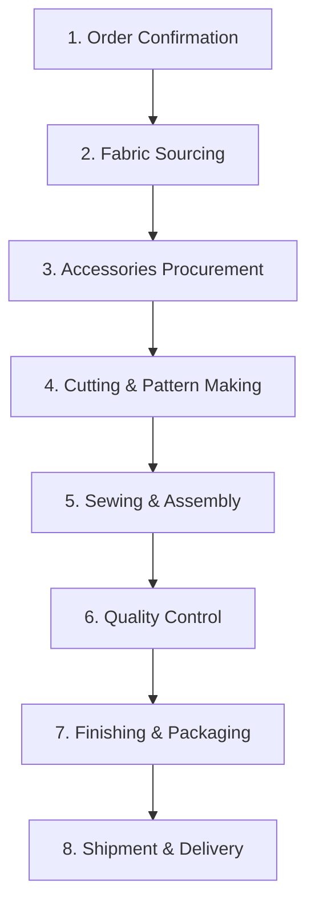
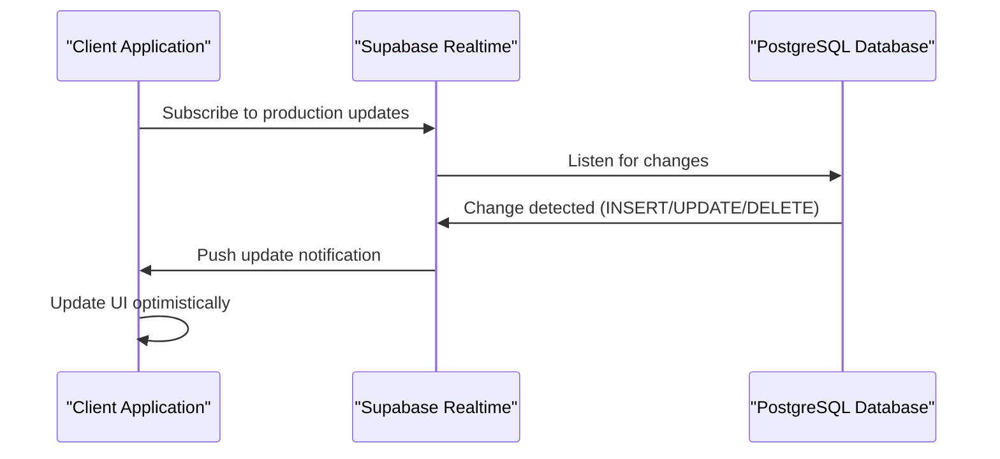
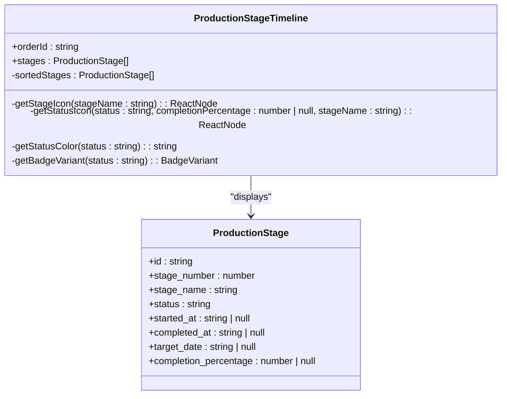
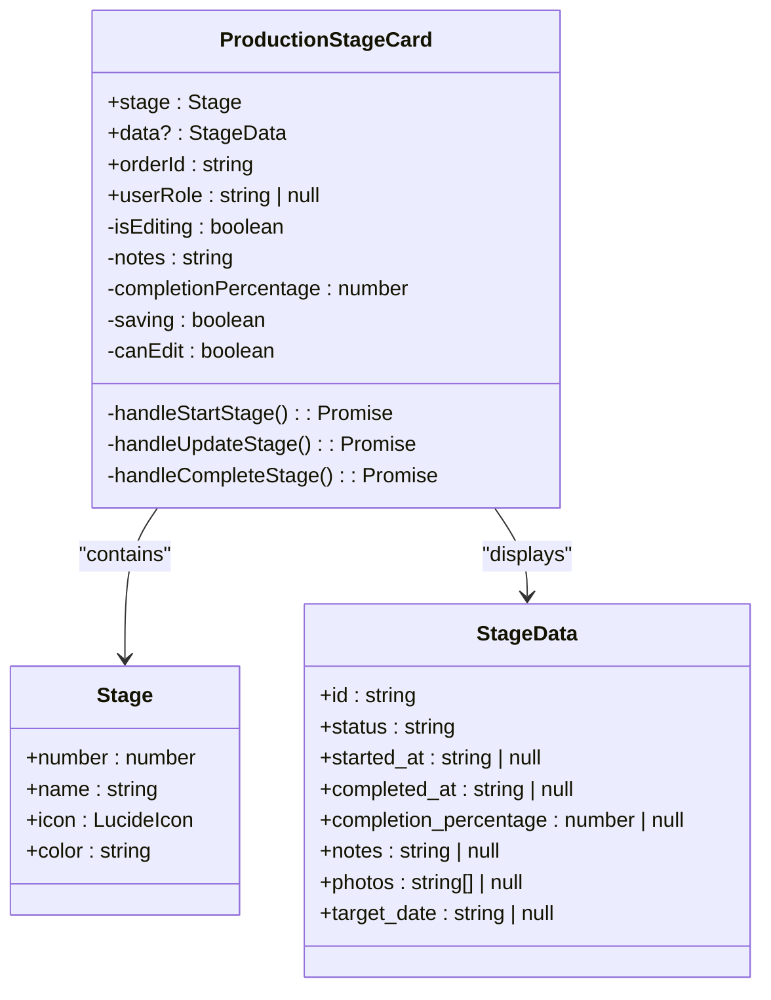
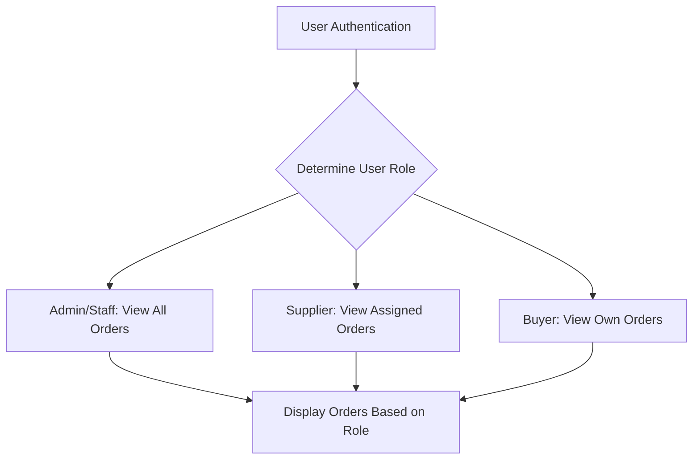
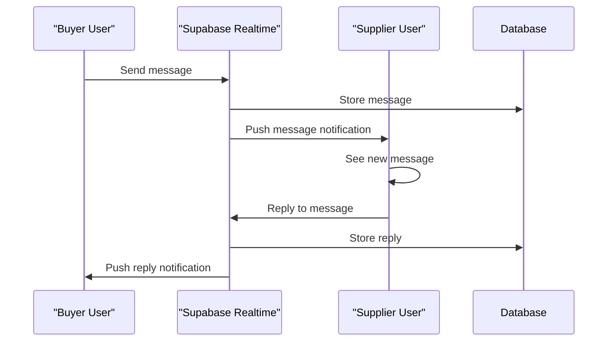
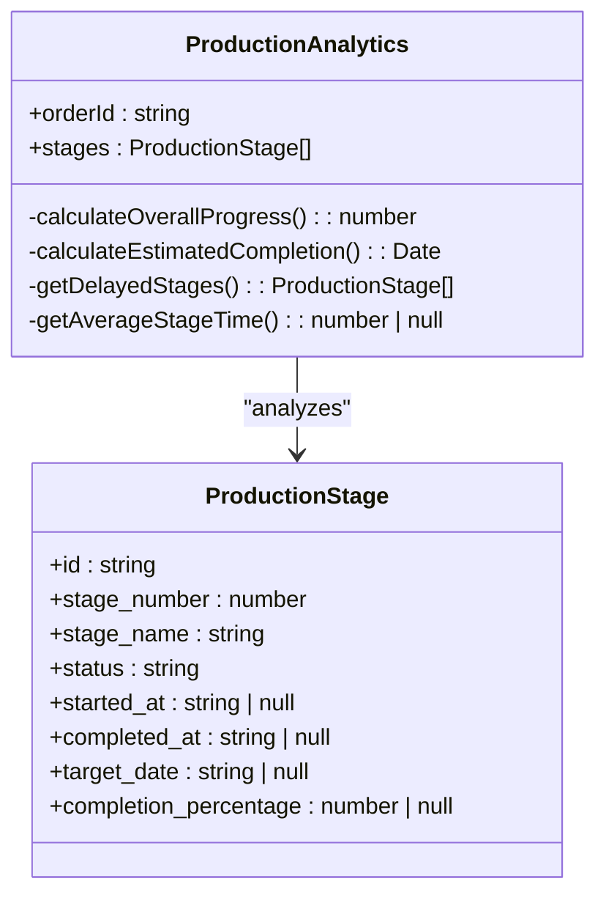
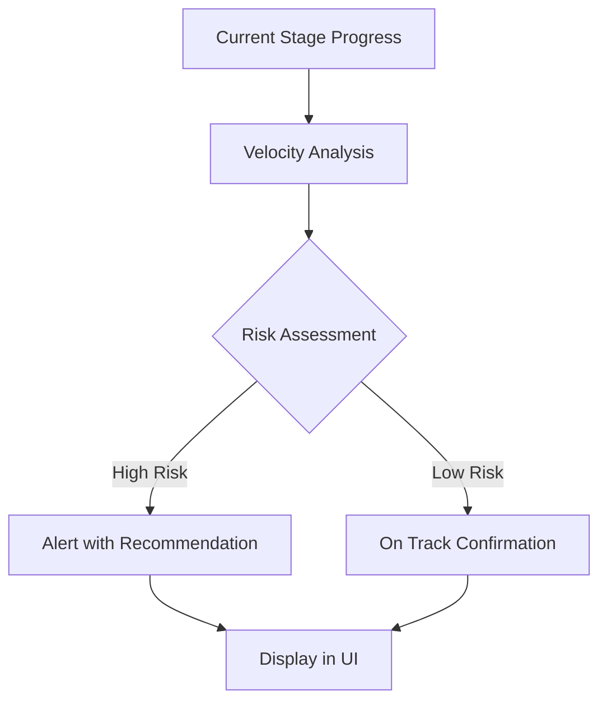
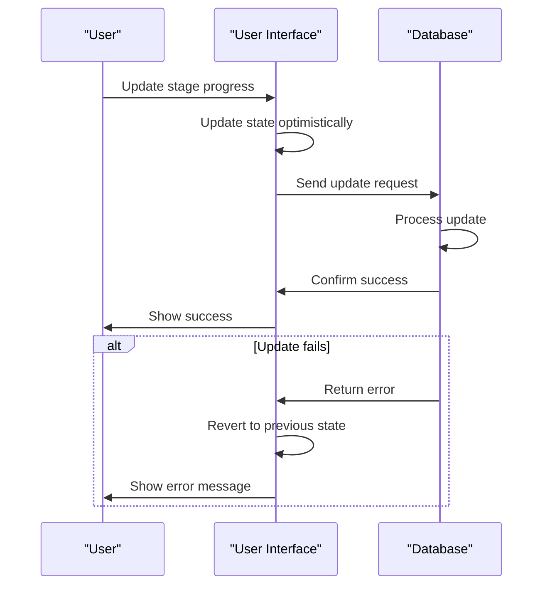

# LoopTrace™ Production Tracking

<cite>
**Referenced Files in This Document**   
- [ProductionTracking.tsx](file://src/pages/ProductionTracking.tsx)
- [ProductionStageTimeline.tsx](file://src/components/production/ProductionStageTimeline.tsx)
- [ProductionStageCard.tsx](file://src/components/production/ProductionStageCard.tsx)
- [SupplierCoordinationPanel.tsx](file://src/components/production/SupplierCoordinationPanel.tsx)
- [ProductionAnalytics.tsx](file://src/components/production/ProductionAnalytics.tsx)
- [PredictiveDelayAlert.tsx](file://src/components/production/PredictiveDelayAlert.tsx)
- [ConnectionStatusIndicator.tsx](file://src/components/production/ConnectionStatusIndicator.tsx)
- [AIQualityScanner.tsx](file://src/components/production/AIQualityScanner.tsx)
- [client.ts](file://src/integrations/supabase/client.ts)
- [useOptimisticUpdate.ts](file://src/hooks/useOptimisticUpdate.ts)
- [database.ts](file://src/types/database.ts)
</cite>

## Table of Contents
1. [Introduction](#introduction)
2. [8-Stage Production Monitoring System](#8-stage-production-monitoring-system)
3. [Real-Time Updates via Supabase Subscriptions](#real-time-updates-via-supabase-subscriptions)
4. [User Interface Components](#user-interface-components)
5. [Order Management by User Role](#order-management-by-user-role)
6. [Supplier Coordination and Communication](#supplier-coordination-and-communication)
7. [Production Analytics and Performance Insights](#production-analytics-and-performance-insights)
8. [Troubleshooting Guide](#troubleshooting-guide)
9. [Performance Optimization Techniques](#performance-optimization-techniques)

## Introduction

LoopTrace™ Production Tracking provides real-time visibility into the manufacturing pipeline for apparel production. This comprehensive system enables buyers, suppliers, and administrators to monitor orders across eight distinct production stages, from order confirmation through shipment and delivery. The platform leverages Supabase real-time subscriptions for instant updates, incorporates photo documentation capabilities for quality verification, and utilizes predictive analytics to detect potential delays before they impact delivery timelines.

The system is designed to provide transparency and accountability throughout the production process, ensuring all stakeholders have access to current information about order status, production progress, and potential risks. With role-based access controls, different users see relevant information and have appropriate permissions for their responsibilities in the production workflow.

**Section sources**
- [ProductionTracking.tsx](file://src/pages/ProductionTracking.tsx#L1-L539)

## 8-Stage Production Monitoring System

The LoopTrace™ Production Tracking system implements an 8-stage monitoring framework specifically designed for RMG (Ready-Made Garments) manufacturing. Each stage represents a critical phase in the production lifecycle, with defined start and completion criteria, target dates, and progress tracking.



**Diagram sources**
- [ProductionTracking.tsx](file://src/pages/ProductionTracking.tsx#L40-L49)

The eight production stages are:

1. **Order Confirmation**: Official acceptance of the purchase order with all specifications finalized
2. **Fabric Sourcing**: Procurement of required textiles and materials from approved suppliers
3. **Accessories Procurement**: Acquisition of buttons, zippers, labels, and other components
4. **Cutting & Pattern Making**: Preparation of patterns and cutting of fabric according to specifications
5. **Sewing & Assembly**: Construction of garments through stitching and assembly processes
6. **Quality Control**: Comprehensive inspection for defects, measurements, and compliance
7. **Finishing & Packaging**: Final touches, pressing, folding, and packaging for shipment
8. **Shipment & Delivery**: Logistics coordination and final delivery to the destination

Each stage can have one of four status values: "pending", "in_progress", "completed", or "delayed". The system tracks start and completion timestamps, target dates, and completion percentages to provide granular visibility into production progress.

**Section sources**
- [ProductionTracking.tsx](file://src/pages/ProductionTracking.tsx#L40-L49)
- [database.ts](file://src/types/database.ts#L19-L27)

## Real-Time Updates via Supabase Subscriptions

The LoopTrace™ system leverages Supabase's real-time capabilities to provide instant updates across the production tracking interface. This is implemented through PostgreSQL change subscriptions that push updates to clients as soon as production data changes in the database.



**Diagram sources**
- [ProductionTracking.tsx](file://src/pages/ProductionTracking.tsx#L65-L90)
- [client.ts](file://src/integrations/supabase/client.ts#L14-L20)

The implementation uses Supabase channels to subscribe to changes in the `production_stages` table, filtered by the specific order ID:

```typescript
const channel = supabase
  .channel(`production-updates-${selectedOrder.id}`)
  .on(
    'postgres_changes',
    {
      event: '*',
      schema: 'public',
      table: 'production_stages',
      filter: `supplier_order_id=eq.${selectedOrder.id}`
    },
    (payload) => {
      console.log('Production stage updated:', payload);
      fetchUserAndOrders();
    }
  )
  .subscribe();
```

When a change is detected in any production stage for the selected order, the system refreshes the order data to ensure the UI reflects the most current information. This real-time synchronization eliminates the need for manual page refreshes and ensures all stakeholders see the same up-to-date information simultaneously.

The system also includes a ConnectionStatusIndicator component that monitors the real-time connection status with Supabase, displaying visual indicators for connected, disconnected, or reconnecting states.

**Section sources**
- [ProductionTracking.tsx](file://src/pages/ProductionTracking.tsx#L65-L90)
- [ConnectionStatusIndicator.tsx](file://src/components/production/ConnectionStatusIndicator.tsx#L28-L40)

## User Interface Components

The LoopTrace™ Production Tracking interface consists of several key components that work together to provide a comprehensive view of production status. These components are designed to be modular, reusable, and provide an intuitive user experience.

### ProductionStageTimeline Component

The ProductionStageTimeline component visualizes the production process as a vertical timeline, showing each stage in chronological order with its current status, dates, and progress indicators.



**Diagram sources**
- [ProductionStageTimeline.tsx](file://src/components/production/ProductionStageTimeline.tsx#L17-L20)
- [database.ts](file://src/types/database.ts#L6-L15)

Key features of the ProductionStageTimeline include:
- Visual timeline with vertical connector line
- Stage-specific icons based on stage name
- Status indicators with color coding (green for completed, blue for in progress, red for delayed)
- Progress bars for stages in progress
- Start, completion, and target date display
- Warning indicators when target dates have passed without completion

**Section sources**
- [ProductionStageTimeline.tsx](file://src/components/production/ProductionStageTimeline.tsx#L1-L183)

### ProductionStageCard Component

The ProductionStageCard component provides a detailed view of each production stage, allowing users to view and update stage information based on their role permissions.



**Diagram sources**
- [ProductionStageCard.tsx](file://src/components/production/ProductionStageCard.tsx#L45-L50)
- [ProductionStageCard.tsx](file://src/components/production/ProductionStageCard.tsx#L27-L43)

The ProductionStageCard includes several key features:

- **State Management**: Uses React useState hooks to manage editing state, notes, and completion percentage
- **Optimistic Updates**: Implements the useOptimisticStageUpdate hook to provide immediate UI feedback while updates are processed
- **Role-Based Permissions**: Determines edit capabilities based on user role (admin, staff, supplier can edit; buyers view-only)
- **Photo Documentation**: Displays uploaded photos with links to full-size versions
- **Progress Tracking**: Shows completion percentage with editable input when in edit mode
- **Action Buttons**: Provides appropriate actions based on stage status (Start, Update Progress, Mark Complete)

The component uses optimistic updates to enhance user experience, immediately reflecting changes in the UI while the update is processed in the background. If the update fails, the system automatically reverts to the previous state and displays an error message.

**Section sources**
- [ProductionStageCard.tsx](file://src/components/production/ProductionStageCard.tsx#L1-L412)
- [useOptimisticUpdate.ts](file://src/hooks/useOptimisticUpdate.ts#L79-L125)

## Order Management by User Role

The LoopTrace™ Production Tracking system implements role-based access control, ensuring that users see only the orders relevant to their role and have appropriate permissions for their responsibilities.



**Diagram sources**
- [ProductionTracking.tsx](file://src/pages/ProductionTracking.tsx#L119-L131)

The system determines user roles by querying the user_roles table in Supabase and then fetches orders accordingly:

- **Admin Users**: Can view all orders in the system, regardless of buyer or supplier
- **Supplier Users**: Can only view orders assigned to their supplier organization
- **Buyer Users**: Can only view orders associated with their email address

This role-based filtering is implemented in the fetchUserAndOrders function, which calls different data retrieval functions based on the user's role:

```typescript
if (roleData?.role === 'admin') {
  await fetchAllOrders();
} else if (roleData?.role === 'supplier') {
  await fetchSupplierOrders(session.user.id);
} else {
  if (!session.user.email) {
    throw new Error('User email not found');
  }
  await fetchBuyerOrders(session.user.email);
}
```

The UI reflects these role-based permissions by showing appropriate action buttons. Only users with edit permissions (admin, staff, supplier) see buttons to start stages, update progress, or mark stages as complete. Buyers can view production progress but cannot make changes to the production stages.

**Section sources**
- [ProductionTracking.tsx](file://src/pages/ProductionTracking.tsx#L119-L131)
- [ProductionStageCard.tsx](file://src/components/production/ProductionStageCard.tsx#L73-L74)

## Supplier Coordination and Communication

The SupplierCoordinationPanel component facilitates direct communication between buyers and suppliers throughout the production process, ensuring clear coordination and documentation of all interactions.



**Diagram sources**
- [SupplierCoordinationPanel.tsx](file://src/components/production/SupplierCoordinationPanel.tsx#L49-L63)

The component provides two main sections:

1. **Supplier Information**: Displays key contact details for the supplier, including company name, email, phone, and address
2. **Communication Interface**: A messaging system that allows real-time conversation about the order

The messaging system uses Supabase real-time subscriptions to provide instant updates when new messages are sent. When a user sends a message, it is stored in the order_messages table with metadata including the sender role (buyer or supplier), timestamp, and order reference.

The interface shows messages in chronological order with visual differentiation between buyer and supplier messages. Each message displays the sender type and timestamp for clear attribution. The system also includes a text input area for composing new messages with a send button that is disabled when no content is entered or when a message is being sent.

**Section sources**
- [SupplierCoordinationPanel.tsx](file://src/components/production/SupplierCoordinationPanel.tsx#L1-L256)

## Production Analytics and Performance Insights

The ProductionAnalytics component provides comprehensive performance insights and predictive analytics to help stakeholders understand production efficiency and potential risks.



**Diagram sources**
- [ProductionAnalytics.tsx](file://src/components/production/ProductionAnalytics.tsx#L25-L28)
- [database.ts](file://src/types/database.ts#L6-L15)

The component calculates and displays several key metrics:

- **Overall Progress**: A weighted average of completed stages and progress on in-progress stages
- **Performance Metrics**: Estimated completion date, average stage duration, and delayed stages alert
- **Quality Insights**: On-time performance percentage and AI-generated recommendations

The PredictiveDelayAlert component enhances these analytics with AI-powered delay prediction. It analyzes current production velocity, stage durations, and target dates to identify stages at risk of delay. The system can simulate potential delays to help with contingency planning.



**Diagram sources**
- [PredictiveDelayAlert.tsx](file://src/components/production/PredictiveDelayAlert.tsx#L35-L246)

The analytics system provides actionable insights, such as recommending expedited processing for stages with high delay risk or suggesting adjustments to delivery timelines based on current production velocity.

**Section sources**
- [ProductionAnalytics.tsx](file://src/components/production/ProductionAnalytics.tsx#L1-L249)
- [PredictiveDelayAlert.tsx](file://src/components/production/PredictiveDelayAlert.tsx#L1-L246)

## Troubleshooting Guide

This section provides guidance for common issues that may occur with the LoopTrace™ Production Tracking system.

### Subscription Failures

If real-time updates are not appearing, check the following:

1. **Connection Status**: Verify the ConnectionStatusIndicator shows "Live" rather than "Offline" or "Reconnecting"
2. **Network Connectivity**: Ensure stable internet connection
3. **Authentication**: Confirm the user is still authenticated (check for unexpected sign-outs)
4. **Browser Console**: Check for JavaScript errors that might prevent subscription establishment

The system automatically attempts to reconnect when the connection is lost, but persistent issues may require a page refresh or re-authentication.

### Data Synchronization Problems

If production stage updates are not reflecting in the UI:

1. **Verify Subscription**: Ensure the Supabase channel is properly subscribed and not removed
2. **Check Database Permissions**: Confirm the user has appropriate RLS (Row Level Security) policies to read and write to the production_stages table
3. **Examine Network Requests**: Use browser developer tools to verify that update requests are being sent and receiving successful responses
4. **Review Error Messages**: Check console logs for any error messages from Supabase operations

### Photo Documentation Issues

If photo uploads are not working:

1. **Storage Configuration**: Ensure the 'production-evidence' bucket is configured in Supabase storage
2. **Permissions**: Verify the user has write permissions to the storage bucket
3. **File Size and Type**: Confirm the image meets size and format requirements
4. **Network Issues**: Check for upload timeouts or interruptions

The AIQualityScanner component provides a simulated analysis when actual AI integration is not available, allowing users to test the interface and understand the expected functionality.

**Section sources**
- [ConnectionStatusIndicator.tsx](file://src/components/production/ConnectionStatusIndicator.tsx#L14-L49)
- [ProductionStageCard.tsx](file://src/components/production/ProductionStageCard.tsx#L293-L303)
- [AIQualityScanner.tsx](file://src/components/production/AIQualityScanner.tsx#L30-L70)

## Performance Optimization Techniques

The LoopTrace™ Production Tracking system implements several performance optimization techniques to ensure a responsive user experience.

### Efficient State Updates

The system uses optimistic updates to provide immediate feedback when users modify production stages. Instead of waiting for the database operation to complete, the UI is updated immediately, and only reverted if the operation fails.



**Diagram sources**
- [useOptimisticUpdate.ts](file://src/hooks/useOptimisticUpdate.ts#L26-L65)

This approach significantly improves perceived performance, as users don't have to wait for network latency before seeing their changes reflected in the interface.

### Selective Data Fetching

The system implements role-based data fetching to minimize the amount of data transferred:

- Admins fetch all orders with complete production stage data
- Suppliers fetch only their assigned orders
- Buyers fetch only their own orders

This reduces both database load and network bandwidth usage, particularly for users who only need to see a subset of the total orders.

### Component-Level Optimization

The application uses React's useEffect hook with proper dependency arrays to prevent unnecessary re-renders. Subscriptions are properly cleaned up when components unmount to prevent memory leaks:

```typescript
useEffect(() => {
  // Subscription setup
  const channel = supabase
    .channel(`production-updates-${selectedOrder.id}`)
    // ... subscription configuration
    .subscribe();

  return () => {
    // Cleanup subscription
    supabase.removeChannel(channel);
  };
}, [selectedOrder?.id, user]);
```

The system also leverages React's built-in optimization patterns, such as memoizing expensive calculations and using stable function references to prevent unnecessary re-renders of child components.

**Section sources**
- [useOptimisticUpdate.ts](file://src/hooks/useOptimisticUpdate.ts#L16-L74)
- [ProductionTracking.tsx](file://src/pages/ProductionTracking.tsx#L65-L90)