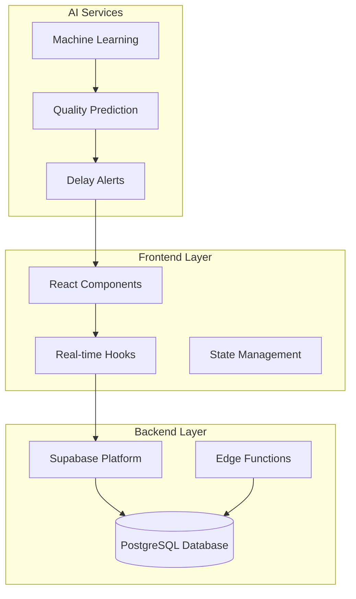
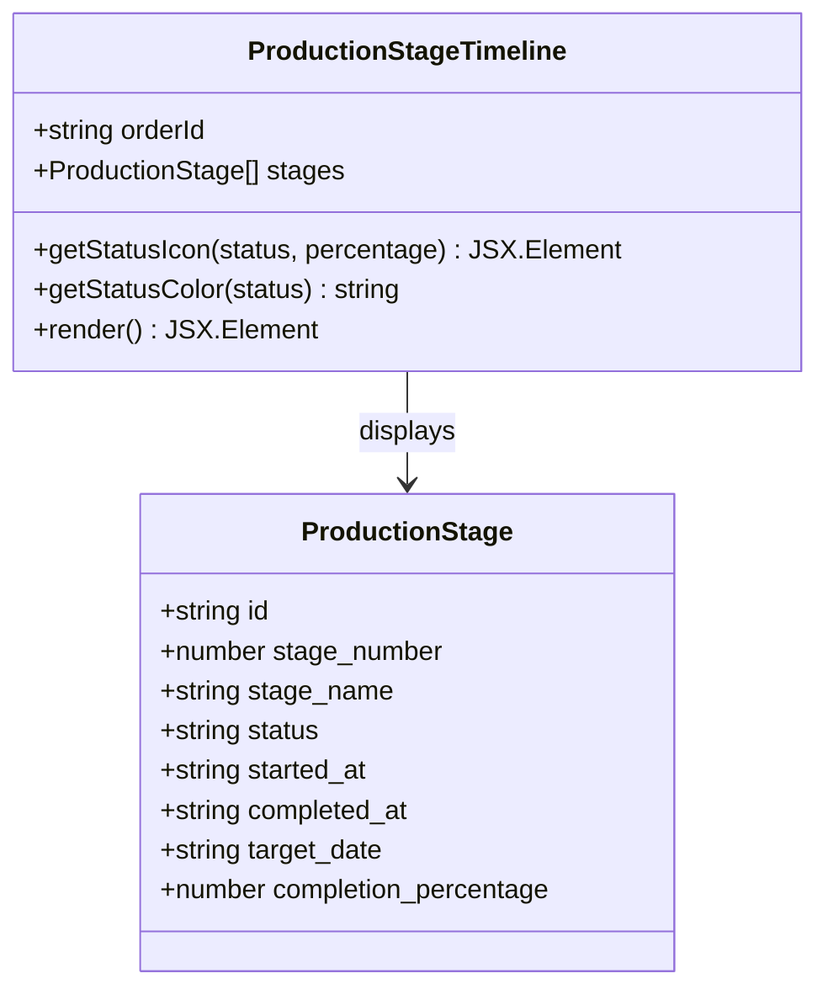
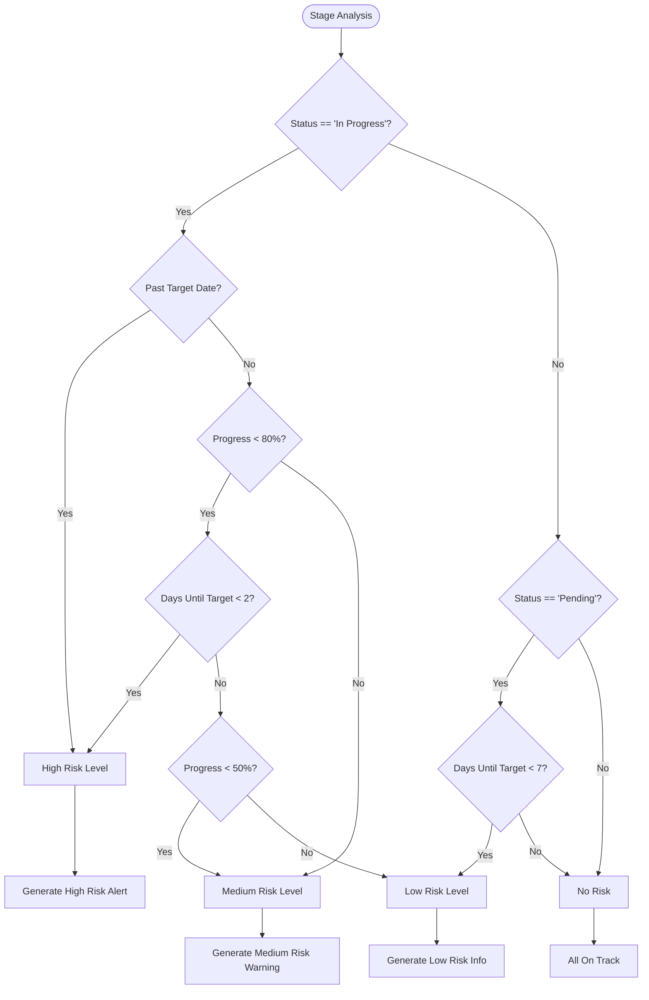
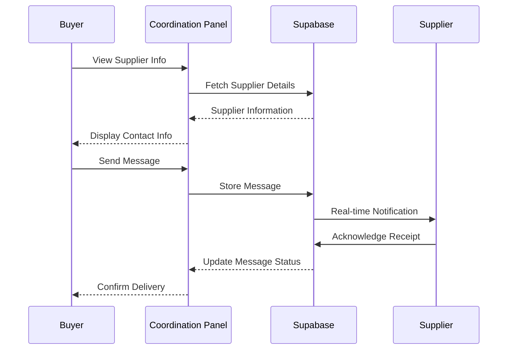
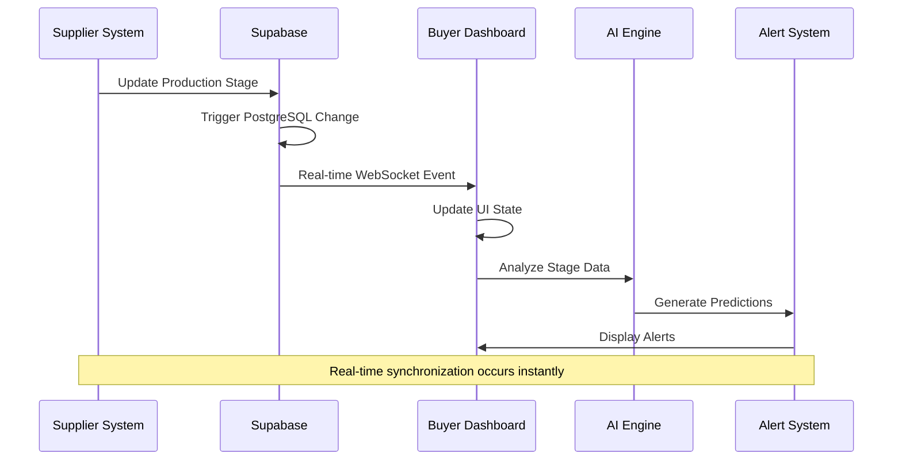
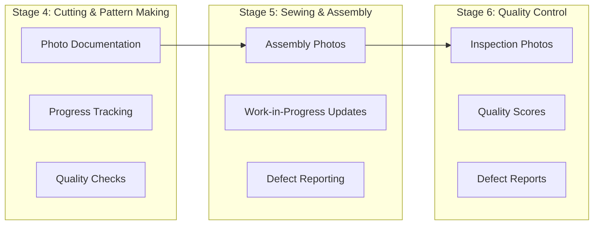
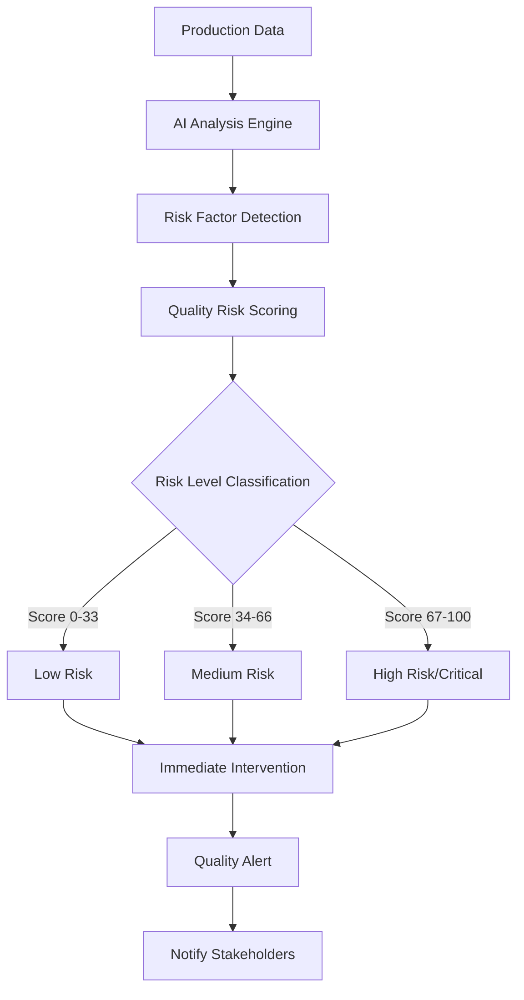
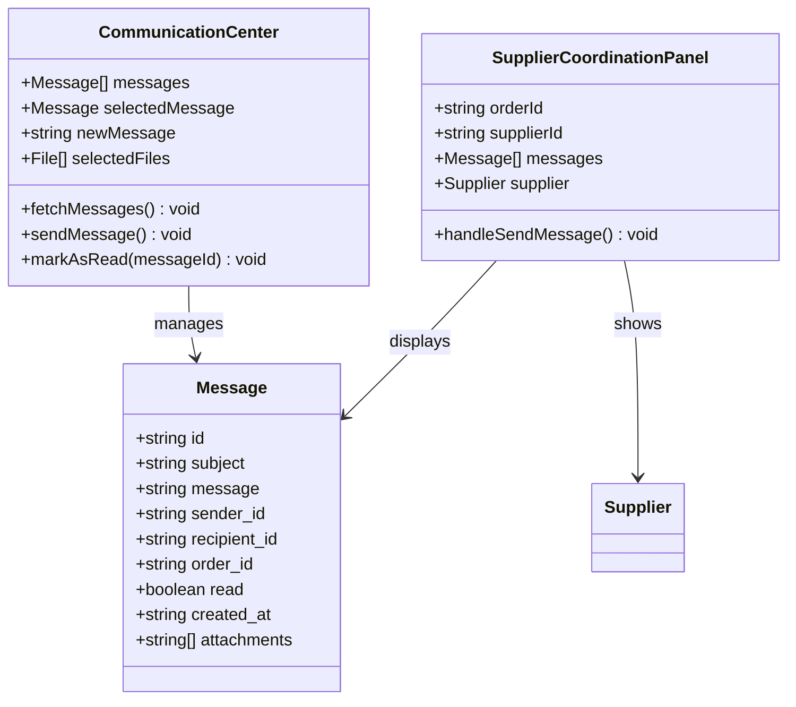
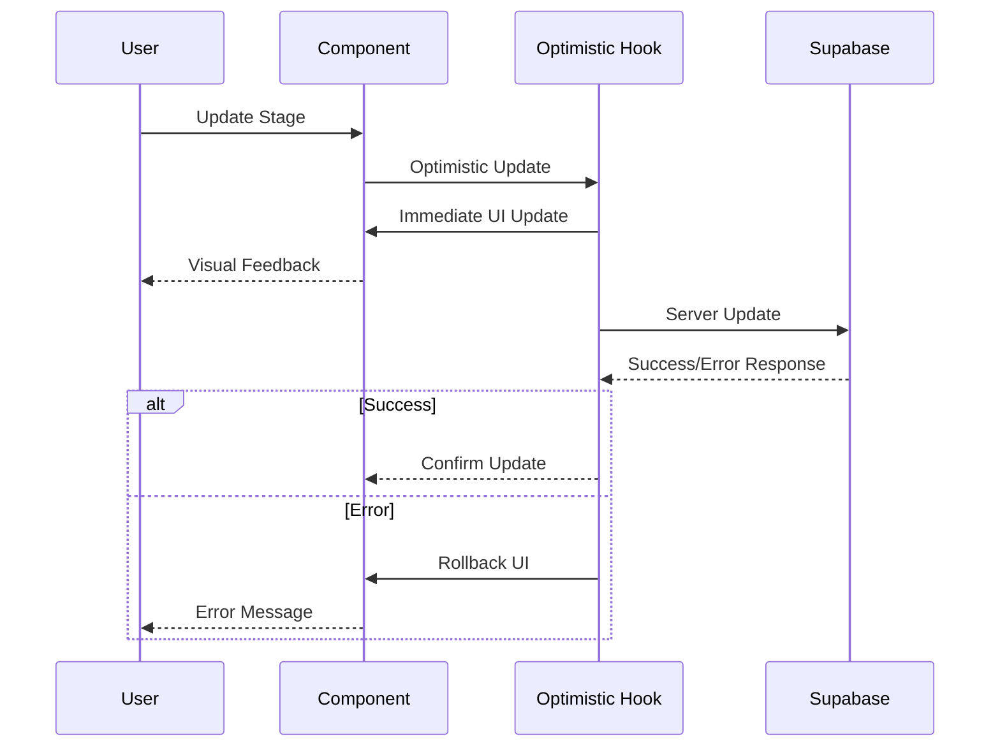

# LoopTrace™ Production Tracking

<cite>
**Referenced Files in This Document**
- [ProductionStageTimeline.tsx](file://src/components/production/ProductionStageTimeline.tsx)
- [PredictiveDelayAlert.tsx](file://src/components/production/PredictiveDelayAlert.tsx)
- [SupplierCoordinationPanel.tsx](file://src/components/production/SupplierCoordinationPanel.tsx)
- [ProductionTracking.tsx](file://src/pages/ProductionTracking.tsx)
- [ProductionStageCard.tsx](file://src/components/production/ProductionStageCard.tsx)
- [ProductionAnalytics.tsx](file://src/components/production/ProductionAnalytics.tsx)
- [QualityRiskAlert.tsx](file://src/components/production/QualityRiskAlert.tsx)
- [useQualityPrediction.ts](file://src/hooks/useQualityPrediction.ts)
- [useOptimisticUpdate.ts](file://src/hooks/useOptimisticUpdate.ts)
- [LoopTraceOrderTracking.tsx](file://src/components/buyer/LoopTraceOrderTracking.tsx)
- [CommunicationCenter.tsx](file://src/components/shared/CommunicationCenter.tsx)
- [client.ts](file://src/integrations/supabase/client.ts)
- [types.ts](file://src/integrations/supabase/types.ts)
- [useRealtimeMessages.ts](file://src/hooks/useRealtimeMessages.ts)
- [initialize-production-stages/index.ts](file://supabase/functions/initialize-production-stages/index.ts)
</cite>

## Table of Contents
1. [Introduction](#introduction)
2. [System Architecture](#system-architecture)
3. [Core Components](#core-components)
4. [Real-Time Data Flow](#real-time-data-flow)
5. [Production Stages Overview](#production-stages-overview)
6. [AI-Powered Features](#ai-powered-features)
7. [Communication System](#communication-system)
8. [Implementation Details](#implementation-details)
9. [Common Use Cases](#common-use-cases)
10. [Troubleshooting Guide](#troubleshooting-guide)
11. [Best Practices](#best-practices)
12. [Conclusion](#conclusion)

## Introduction

LoopTrace™ Production Tracking is a revolutionary real-time manufacturing monitoring system designed to eliminate the "Bangladesh black box" in knitwear production. This comprehensive platform provides end-to-end visibility across all 8 manufacturing stages, combining photo documentation, AI-powered quality prediction, and smart alerts to deliver unprecedented transparency and control over production processes.

The system addresses critical pain points in global apparel manufacturing by providing stakeholders with immediate access to production data, predictive insights, and seamless communication channels. Through its sophisticated real-time notification system built on Supabase subscriptions, LoopTrace™ ensures that buyers, suppliers, and manufacturers stay informed about production progress, quality risks, and potential delays before they become critical issues.

## System Architecture

LoopTrace™ follows a modern, real-time architecture that seamlessly integrates frontend components with backend services through Supabase's real-time capabilities. The system is built around several key architectural principles:

**Diagram sources**
- [ProductionTracking.tsx](file://src/pages/ProductionTracking.tsx#L1-L522)
- [client.ts](file://src/integrations/supabase/client.ts#L1-L20)

The architecture emphasizes real-time responsiveness through Supabase's PostgreSQL change notifications, enabling instant updates across all connected clients without polling mechanisms. This approach ensures that production data remains synchronized in real-time, providing stakeholders with the most current information available.

**Section sources**
- [ProductionTracking.tsx](file://src/pages/ProductionTracking.tsx#L1-L522)
- [client.ts](file://src/integrations/supabase/client.ts#L1-L20)

## Core Components

### ProductionStageTimeline Component

The ProductionStageTimeline serves as the primary visual representation of production progress, displaying all eight manufacturing stages in chronological order with interactive elements for tracking completion and status.

**Diagram sources**
- [ProductionStageTimeline.tsx](file://src/components/production/ProductionStageTimeline.tsx#L6-L15)

Key features include:
- **Visual Progress Indicators**: Color-coded icons representing stage status (completed, in progress, delayed, pending)
- **Interactive Timeline**: Clickable stages with detailed information panels
- **Progress Bars**: Visual representation of completion percentages
- **Date Tracking**: Automatic calculation of elapsed and remaining time
- **Responsive Design**: Adapts to various screen sizes and devices

### PredictiveDelayAlert Component

The PredictiveDelayAlert component provides intelligent delay detection using AI-driven heuristics to forecast potential bottlenecks before they impact production timelines.

**Diagram sources**
- [PredictiveDelayAlert.tsx](file://src/components/production/PredictiveDelayAlert.tsx#L38-L106)

### SupplierCoordinationPanel Component

The SupplierCoordinationPanel facilitates seamless communication between buyers and suppliers through integrated messaging and supplier information management.

**Diagram sources**
- [SupplierCoordinationPanel.tsx](file://src/components/production/SupplierCoordinationPanel.tsx#L45-L67)

**Section sources**
- [ProductionStageTimeline.tsx](file://src/components/production/ProductionStageTimeline.tsx#L1-L147)
- [PredictiveDelayAlert.tsx](file://src/components/production/PredictiveDelayAlert.tsx#L1-L203)
- [SupplierCoordinationPanel.tsx](file://src/components/production/SupplierCoordinationPanel.tsx#L1-L256)

## Real-Time Data Flow

The LoopTrace™ system operates on a sophisticated real-time data flow architecture that ensures immediate synchronization of production updates across all stakeholders.

**Diagram sources**
- [ProductionTracking.tsx](file://src/pages/ProductionTracking.tsx#L63-L87)
- [useRealtimeMessages.ts](file://src/hooks/useRealtimeMessages.ts#L17-L58)

### Data Subscription Mechanisms

The system employs multiple subscription channels to capture different types of production events:

| Channel Type | Purpose | Event Types | Scope |
|--------------|---------|-------------|-------|
| `production-updates-{orderId}` | Stage progress updates | INSERT, UPDATE, DELETE | Specific order |
| `order-messages-{orderId}` | Supplier communication | INSERT | Order-specific messages |
| `messages-sent` | Outgoing messages | INSERT, UPDATE | User's sent messages |
| `messages-received` | Incoming messages | INSERT, UPDATE | User's received messages |

**Section sources**
- [ProductionTracking.tsx](file://src/pages/ProductionTracking.tsx#L63-L87)
- [useRealtimeMessages.ts](file://src/hooks/useRealtimeMessages.ts#L17-L58)

## Production Stages Overview

LoopTrace™ tracks production across eight distinct manufacturing stages, each representing a critical phase in the knitwear manufacturing process:

| Stage Number | Stage Name | Description | Typical Duration |
|--------------|------------|-------------|------------------|
| 1 | Order Confirmation | Initial order acceptance and preparation | 1-2 days |
| 2 | Fabric Sourcing | Procurement and quality verification of raw materials | 3-5 days |
| 3 | Accessories Procurement | Acquisition of buttons, zippers, and other components | 2-3 days |
| 4 | Cutting & Pattern Making | Fabric cutting according to patterns | 3-7 days |
| 5 | Sewing & Assembly | Main garment construction and assembly | 5-10 days |
| 6 | Quality Control | Inspection and defect identification | 2-3 days |
| 7 | Finishing & Packaging | Ironing, labeling, and packaging preparation | 2-4 days |
| 8 | Shipment & Delivery | Logistics coordination and delivery | 7-14 days |

### Stage-Specific Features

Each production stage includes specialized functionality tailored to its manufacturing requirements:

**Diagram sources**
- [ProductionStageCard.tsx](file://src/components/production/ProductionStageCard.tsx#L25-L41)

**Section sources**
- [ProductionTracking.tsx](file://src/pages/ProductionTracking.tsx#L37-L47)
- [ProductionStageCard.tsx](file://src/components/production/ProductionStageCard.tsx#L25-L41)

## AI-Powered Features

### Quality Risk Prediction

The AI-powered quality prediction system analyzes historical data and current production indicators to assess potential quality risks before they manifest as defects.

**Diagram sources**
- [useQualityPrediction.ts](file://src/hooks/useQualityPrediction.ts#L16-L48)
- [QualityRiskAlert.tsx](file://src/components/production/QualityRiskAlert.tsx#L12-L25)

### Predictive Delay Analysis

The predictive delay system uses machine learning heuristics to forecast potential production delays by analyzing completion patterns, resource allocation, and historical performance data.

Key predictive factors include:
- **Completion Percentage vs. Timeline**: Early-stage delays often indicate systemic issues
- **Resource Utilization**: Bottleneck identification through capacity analysis
- **Historical Performance**: Learning from past production patterns
- **External Factors**: Seasonal demand variations and supply chain disruptions

**Section sources**
- [useQualityPrediction.ts](file://src/hooks/useQualityPrediction.ts#L1-L56)
- [QualityRiskAlert.tsx](file://src/components/production/QualityRiskAlert.ts#L1-L113)
- [PredictiveDelayAlert.tsx](file://src/components/production/PredictiveDelayAlert.tsx#L1-L203)

## Communication System

### Integrated Messaging Platform

The communication system provides seamless interaction between buyers, suppliers, and internal teams through a unified messaging interface with real-time notifications.

**Diagram sources**
- [CommunicationCenter.tsx](file://src/components/shared/CommunicationCenter.tsx#L12-L22)
- [SupplierCoordinationPanel.tsx](file://src/components/production/SupplierCoordinationPanel.tsx#L11-L22)

### File Attachment System

The system supports comprehensive file sharing for documentation, quality reports, and production evidence:

- **Supported Formats**: PDF, DOC, DOCX, JPG, JPEG, PNG, GIF, XLSX, XLS
- **Storage**: Secure cloud storage with automatic URL generation
- **Size Limits**: Up to 5 files per message, with individual file size restrictions
- **Access Control**: Role-based permissions for file visibility

**Section sources**
- [CommunicationCenter.tsx](file://src/components/shared/CommunicationCenter.tsx#L1-L451)
- [SupplierCoordinationPanel.tsx](file://src/components/production/SupplierCoordinationPanel.tsx#L1-L256)

## Implementation Details

### Optimistic Updates

The system implements optimistic updates to enhance user experience by immediately reflecting changes in the UI while maintaining data integrity through server-side validation.

**Diagram sources**
- [useOptimisticUpdate.ts](file://src/hooks/useOptimisticUpdate.ts#L26-L66)

### Database Schema Integration

The production tracking system relies on a well-structured database schema that supports real-time operations and comprehensive data relationships:

| Table | Purpose | Key Fields |
|-------|---------|------------|
| `production_stages` | Stage tracking | `supplier_order_id`, `stage_number`, `status`, `completion_percentage` |
| `order_messages` | Communication logs | `order_id`, `sender_id`, `message`, `attachments` |
| `supplier_orders` | Order management | `buyer_email`, `supplier_id`, `status` |
| `production_batches` | Batch coordination | `batch_status`, `unit_price_base`, `complexity_multiplier` |

**Section sources**
- [useOptimisticUpdate.ts](file://src/hooks/useOptimisticUpdate.ts#L1-L176)
- [types.ts](file://src/integrations/supabase/types.ts#L1-L800)

## Common Use Cases

### Tracking an Order from Fabric Cutting to Shipment

**Scenario**: A buyer wants to monitor the progress of a knitwear order from initial fabric cutting through final shipment.

**Step-by-Step Process**:

1. **Order Initialization**: System automatically creates production stages based on product type
2. **Fabric Arrival**: Supplier uploads photos and updates cutting stage status
3. **Pattern Making**: Digital patterns are verified and cutting begins
4. **Cutting Progress**: Real-time updates show completion percentages
5. **Sewing Phase**: Assembly photos and progress tracking
6. **Quality Control**: Inspection results and defect reporting
7. **Packaging**: Finishing touches and preparation for shipment
8. **Delivery**: Logistics coordination and tracking information

**Expected Timeline**: 25-45 days depending on complexity and supplier capacity

### Interpreting Quality Risk Scores

**Scenario**: A buyer receives a quality risk alert and needs to understand the implications.

**Risk Level Interpretation**:

- **Low Risk (0-33)**: Standard monitoring recommended
- **Medium Risk (34-66)**: Increased inspection frequency suggested
- **High Risk (67-100)**: Immediate intervention required

**Action Steps**:
1. Review identified risk factors
2. Examine AI recommendations
3. Contact supplier for clarification
4. Implement preventive measures
5. Monitor subsequent updates closely

### Responding to Automated Alerts

**Scenario**: An automated delay alert appears indicating potential production bottlenecks.

**Response Protocol**:

1. **Immediate Assessment**: Review affected stages and timeline impacts
2. **Supplier Communication**: Contact supplier through coordination panel
3. **Alternative Planning**: Explore backup suppliers or expedited options
4. **Stakeholder Notification**: Inform relevant team members
5. **Mitigation Strategies**: Implement corrective actions

**Section sources**
- [LoopTraceOrderTracking.tsx](file://src/components/buyer/LoopTraceOrderTracking.tsx#L1-L360)
- [PredictiveDelayAlert.tsx](file://src/components/production/PredictiveDelayAlert.tsx#L38-L106)

## Troubleshooting Guide

### Common Issues and Solutions

#### Delayed Updates

**Symptoms**: Production updates not appearing in real-time
**Causes**: Network connectivity, subscription failures, or database lag
**Solutions**:
1. Check internet connection stability
2. Verify browser WebSocket support
3. Refresh page to re-establish subscriptions
4. Contact support if issue persists

#### Photo Verification Failures

**Symptoms**: Uploaded photos not displaying or failing to save
**Causes**: File format issues, size limitations, or storage errors
**Solutions**:
1. Verify file format compatibility (.jpg, .png, .pdf)
2. Reduce file size if necessary
3. Retry upload with smaller files
4. Check storage quota limits

#### Communication Delays

**Symptoms**: Messages not delivering or appearing late
**Causes**: Real-time subscription issues or message queue problems
**Solutions**:
1. Verify user authentication status
2. Check message recipient validity
3. Review network connectivity
4. Use fallback communication methods

### Performance Optimization

#### Reducing Load Times

- **Pagination**: Implement for large order lists
- **Caching**: Use browser caching for static assets
- **Lazy Loading**: Load components as needed
- **Optimized Queries**: Minimize database requests

#### Memory Management

- **Cleanup Subscriptions**: Remove unused realtime channels
- **State Optimization**: Use efficient state management
- **Component Unmounting**: Properly clean up event listeners

**Section sources**
- [ProductionTracking.tsx](file://src/pages/ProductionTracking.tsx#L88-L140)
- [SupplierCoordinationPanel.tsx](file://src/components/production/SupplierCoordinationPanel.tsx#L45-L67)

## Best Practices

### For Buyers

1. **Regular Monitoring**: Check production updates daily during active periods
2. **Proactive Communication**: Use coordination panel for early issue resolution
3. **Quality Verification**: Review quality risk assessments regularly
4. **Supplier Relationship**: Maintain open communication channels

### For Suppliers

1. **Timely Updates**: Provide stage updates within 24 hours
2. **Photo Documentation**: Upload clear, dated photos for each stage
3. **Quality Standards**: Address quality concerns immediately
4. **Communication**: Use messaging system for important updates

### For Manufacturers

1. **Data Accuracy**: Ensure production data reflects actual progress
2. **Documentation**: Maintain comprehensive records of production activities
3. **Issue Resolution**: Address delays and quality issues promptly
4. **Collaboration**: Work closely with buyers and suppliers

### Technical Implementation

1. **Subscription Management**: Properly handle realtime subscriptions
2. **Error Handling**: Implement robust error recovery mechanisms
3. **Security**: Validate all user inputs and permissions
4. **Testing**: Thoroughly test real-time features

## Conclusion

LoopTrace™ Production Tracking represents a paradigm shift in manufacturing visibility, transforming opaque production processes into transparent, actionable workflows. By combining real-time data synchronization, AI-powered insights, and seamless communication tools, the system empowers stakeholders to make informed decisions, prevent potential issues, and optimize production outcomes.

The platform's architecture ensures scalability and reliability while maintaining ease of use for stakeholders across the global supply chain. As the apparel industry continues to evolve, LoopTrace™ provides the technological foundation for building trust, reducing risks, and achieving operational excellence in knitwear manufacturing.

Through continuous AI improvement and expanding feature sets, LoopTrace™ is positioned to become the industry standard for production transparency, setting new benchmarks for accountability and efficiency in global manufacturing operations.