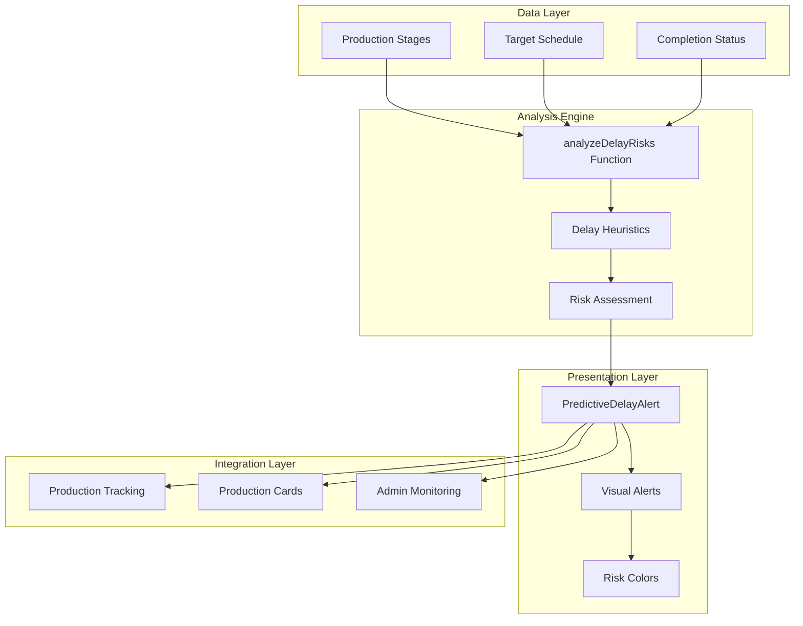
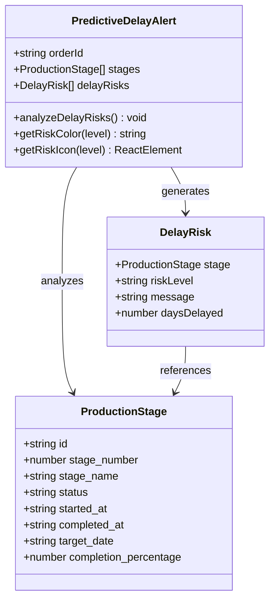
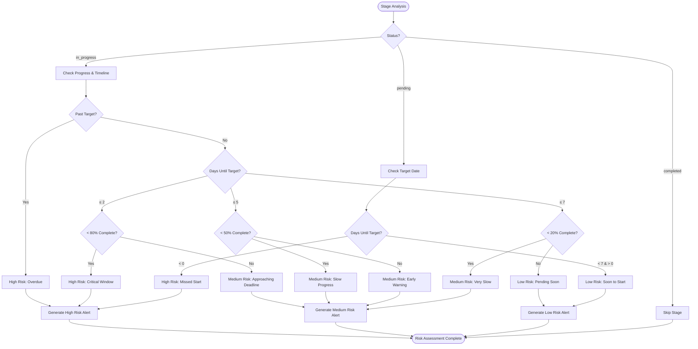
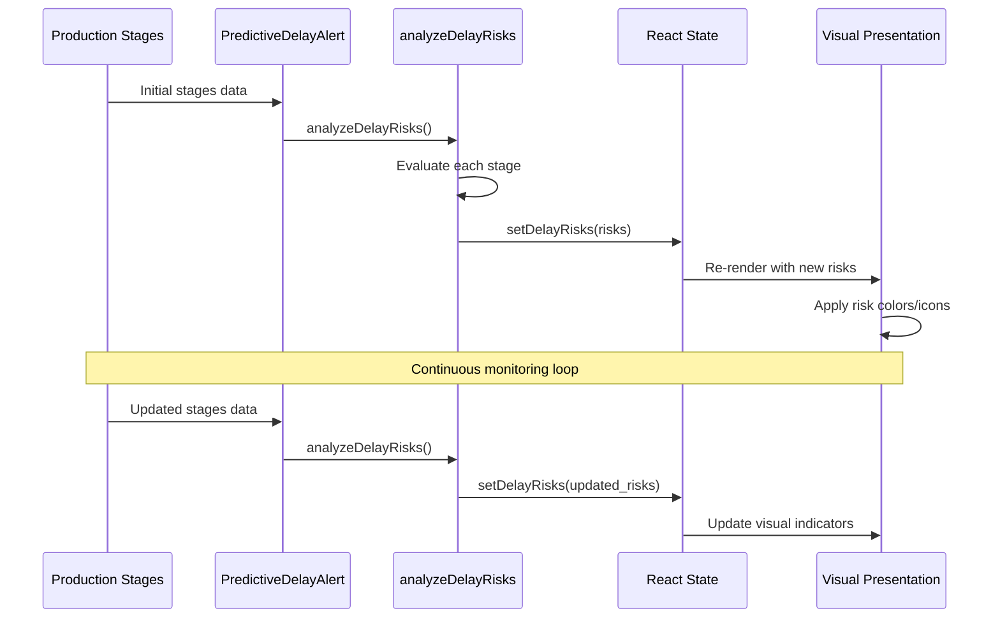
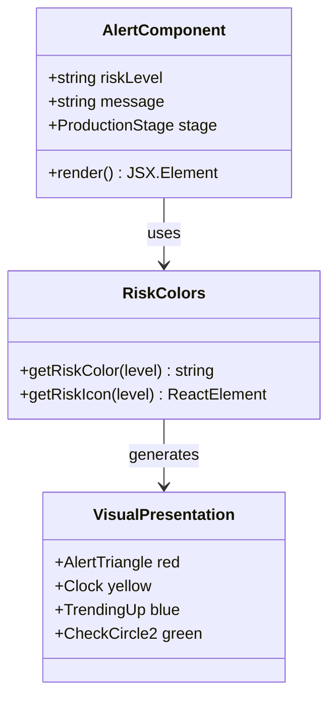

# Delay Prediction Mechanism

<cite>
**Referenced Files in This Document**
- [PredictiveDelayAlert.tsx](file://src/components/production/PredictiveDelayAlert.tsx)
- [ProductionStageCard.tsx](file://src/components/production/ProductionStageCard.tsx)
- [ProductionTracking.tsx](file://src/pages/ProductionTracking.tsx)
- [AdminStageMonitor.tsx](file://src/components/admin/AdminStageMonitor.tsx)
- [ProductionManagementPanel.tsx](file://src/components/supplier/ProductionManagementPanel.tsx)
- [SupplierOrderDetailModal.tsx](file://src/components/supplier/SupplierOrderDetailModal.tsx)
- [initialize-production-stages/index.ts](file://supabase/functions/initialize-production-stages/index.ts)
- [update_production_stage_status](file://supabase/migrations/20251116120215_71189c74-c2d3-4f3e-a1af-87d7e6b5f8fa.sql)
- [production_stages schema](file://supabase/COMPLETE_SETUP.sql)
</cite>

## Table of Contents
1. [Introduction](#introduction)
2. [System Architecture](#system-architecture)
3. [Core Components](#core-components)
4. [Risk Assessment Logic](#risk-assessment-logic)
5. [State Management](#state-management)
6. [Visual Representation](#visual-representation)
7. [Implementation Details](#implementation-details)
8. [Common Issues and Solutions](#common-issues-and-solutions)
9. [Best Practices](#best-practices)
10. [Troubleshooting Guide](#troubleshooting-guide)

## Introduction

The Delay Prediction Mechanism is an AI-powered system designed to proactively identify potential production delays by analyzing the progress of manufacturing stages against target dates. Built around the `PredictiveDelayAlert` component, this system employs sophisticated heuristics to evaluate production stage progress and provide actionable insights to prevent bottlenecks in the supply chain.

The mechanism operates on three-tier risk assessment logic: high risk for critical delays, medium risk for near-miss scenarios, and low risk for early warning signals. It integrates seamlessly with the production tracking system to provide real-time monitoring capabilities.

## System Architecture

The delay prediction system follows a modular architecture that separates concerns between data collection, analysis, and presentation:



**Diagram sources**
- [PredictiveDelayAlert.tsx](file://src/components/production/PredictiveDelayAlert.tsx#L31-L201)
- [ProductionTracking.tsx](file://src/pages/ProductionTracking.tsx#L493-L496)

## Core Components

### PredictiveDelayAlert Component

The `PredictiveDelayAlert` component serves as the primary interface for delay prediction, encapsulating the core analysis logic and visual presentation:



**Diagram sources**
- [PredictiveDelayAlert.tsx](file://src/components/production/PredictiveDelayAlert.tsx#L8-L29)

### Production Stage Data Model

The system relies on a comprehensive data model that captures essential production stage attributes:

| Field | Type | Description | Validation |
|-------|------|-------------|------------|
| `id` | string | Unique identifier | UUID format |
| `stage_number` | number | Sequential stage identifier | Integer ≥ 1 |
| `stage_name` | string | Descriptive stage name | Non-empty string |
| `status` | string | Current stage status | ['pending', 'in_progress', 'completed'] |
| `started_at` | string \| null | Stage start timestamp | ISO 8601 format |
| `completed_at` | string \| null | Stage completion timestamp | ISO 8601 format |
| `target_date` | string \| null | Scheduled completion date | ISO 8601 format |
| `completion_percentage` | number \| null | Progress indicator | 0-100 range |

**Section sources**
- [PredictiveDelayAlert.tsx](file://src/components/production/PredictiveDelayAlert.tsx#L8-L17)

## Risk Assessment Logic

The heart of the delay prediction system lies in its three-tier risk assessment algorithm, implemented through the `analyzeDelayRisks` function:

### High Risk Conditions

High risk is triggered by critical delay scenarios that require immediate attention:

1. **Overdue Stages**: When `daysUntilTarget < 0` (past the target date)
2. **Critical Completion Threshold**: When `daysUntilTarget ≤ 2` and `progress < 80%`
3. **Unstarted Critical Stages**: When target date has passed for pending stages

### Medium Risk Conditions

Medium risk identifies near-miss scenarios requiring close monitoring:

1. **Approaching Deadline**: When `daysUntilTarget ≤ 5` and `progress < 50%`
2. **Slow Progress**: When `progress < 20%` with `daysUntilTarget ≤ 7`

### Low Risk Conditions

Low risk serves as an early warning system for proactive management:

1. **Pending Stages**: When target date is approaching (`daysUntilTarget < 7`)
2. **Early Warning Detection**: Proactive identification of potential issues



**Diagram sources**
- [PredictiveDelayAlert.tsx](file://src/components/production/PredictiveDelayAlert.tsx#L38-L106)

**Section sources**
- [PredictiveDelayAlert.tsx](file://src/components/production/PredictiveDelayAlert.tsx#L38-L106)

## State Management

The component utilizes React's `useState` and `useEffect` hooks for real-time state management and automatic re-evaluation when production stages change:

### State Structure

```typescript
const [delayRisks, setDelayRisks] = useState<DelayRisk[]>([]);
```

### Effect Hook Implementation

The `useEffect` hook ensures continuous monitoring of production stages:

```typescript
useEffect(() => {
  analyzeDelayRisks();
}, [stages]);
```

This dependency array triggers the analysis whenever the `stages` prop changes, providing real-time updates as production progresses.

### Data Flow Architecture



**Diagram sources**
- [PredictiveDelayAlert.tsx](file://src/components/production/PredictiveDelayAlert.tsx#L32-L36)

**Section sources**
- [PredictiveDelayAlert.tsx](file://src/components/production/PredictiveDelayAlert.tsx#L32-L36)

## Visual Representation

The system employs a sophisticated visual design system using color-coded alerts with appropriate icons to communicate risk levels effectively:

### Risk Level Color Coding

| Risk Level | Color Scheme | Background | Border | Icon Color |
|------------|--------------|------------|--------|------------|
| High Risk | Red | bg-red-50 | border-red-500 | text-red-500 |
| Medium Risk | Yellow | bg-yellow-50 | border-yellow-500 | text-yellow-500 |
| Low Risk | Blue | bg-blue-50 | border-blue-500 | text-blue-500 |

### Icon System

Each risk level is represented by a distinct icon from the Lucide React icon library:

- **High Risk**: `AlertTriangle` (red)
- **Medium Risk**: `Clock` (yellow)  
- **Low Risk**: `TrendingUp` (blue)

### Visual Alert Structure



**Diagram sources**
- [PredictiveDelayAlert.tsx](file://src/components/production/PredictiveDelayAlert.tsx#L109-L133)

**Section sources**
- [PredictiveDelayAlert.tsx](file://src/components/production/PredictiveDelayAlert.tsx#L109-L133)

## Implementation Details

### Date Calculation Logic

The system uses the `differenceInDays` function from `date-fns` to calculate temporal metrics:

```typescript
const daysUntilTarget = differenceInDays(targetDate, now);
```

This calculation handles timezone considerations and provides accurate day-based comparisons for delay prediction.

### Completion Percentage Handling

The system gracefully handles missing completion data by providing default values:

```typescript
const progress = stage.completion_percentage || 0;
```

This ensures robust operation even when percentage data is unavailable.

### Real-Time Data Integration

The component integrates with the broader production tracking system through props:

```typescript
export const PredictiveDelayAlert = ({ orderId, stages }: PredictiveDelayAlertProps) => {
```

This design enables seamless integration with various production monitoring interfaces.

**Section sources**
- [PredictiveDelayAlert.tsx](file://src/components/production/PredictiveDelayAlert.tsx#L38-L106)

## Common Issues and Solutions

### False Positive Prevention

**Issue**: Inaccurate completion percentages leading to false positive alerts

**Solution**: Implement supplier verification checkpoints and cross-reference multiple data sources:

1. **Multi-Source Verification**: Compare completion data from multiple stakeholders
2. **Threshold Validation**: Implement minimum confidence thresholds for predictions
3. **Historical Analysis**: Use historical data to establish baseline completion patterns

### Data Synchronization Challenges

**Issue**: Stale data causing outdated risk assessments

**Solution**: Implement real-time data synchronization mechanisms:

1. **WebSocket Subscriptions**: Use Supabase real-time features for instant updates
2. **Polling Intervals**: Implement intelligent polling based on stage importance
3. **Event-Driven Updates**: Trigger analysis on specific production events

### Performance Optimization

**Issue**: Slow analysis on large production orders with many stages

**Solution**: Optimize the analysis algorithm:

1. **Early Termination**: Stop analysis when high-risk conditions are identified
2. **Parallel Processing**: Analyze stages concurrently where possible
3. **Caching Strategy**: Cache results for frequently accessed orders

### Integration Complexity

**Issue**: Difficulty integrating with existing production systems

**Solution**: Provide standardized APIs and clear documentation:

1. **Standardized Data Formats**: Define clear interfaces for stage data
2. **Incremental Adoption**: Allow partial system integration
3. **Fallback Mechanisms**: Provide alternative analysis methods

## Best Practices

### Data Quality Standards

1. **Accurate Target Dates**: Ensure target dates are realistic and achievable
2. **Regular Progress Updates**: Implement mandatory progress reporting intervals
3. **Validation Rules**: Enforce data validation for completion percentages

### Risk Communication

1. **Clear Messaging**: Use specific, actionable language in risk messages
2. **Contextual Information**: Provide stage-specific details and recommendations
3. **Escalation Procedures**: Define clear next steps for each risk level

### System Maintenance

1. **Regular Testing**: Continuously validate the prediction accuracy
2. **Feedback Loops**: Incorporate user feedback to improve heuristics
3. **Performance Monitoring**: Track system performance and reliability metrics

## Troubleshooting Guide

### Component Not Rendering

**Symptoms**: PredictiveDelayAlert component appears blank or unresponsive

**Diagnosis Steps**:
1. Verify `stages` prop contains valid production stage data
2. Check for console errors in browser developer tools
3. Ensure `orderId` prop is properly passed

**Solutions**:
- Validate data structure matches expected interface
- Check network connectivity for real-time data
- Verify component dependencies are installed

### Incorrect Risk Levels

**Symptoms**: Risk levels appear inaccurate or inconsistent

**Diagnosis Steps**:
1. Review individual stage data for anomalies
2. Check date calculations for timing issues
3. Verify completion percentage accuracy

**Solutions**:
- Implement data validation checks
- Add debug logging for analysis steps
- Review and adjust heuristic thresholds

### Performance Issues

**Symptoms**: Slow loading or responsiveness

**Diagnosis Steps**:
1. Profile component rendering performance
2. Check for unnecessary re-renders
3. Monitor memory usage patterns

**Solutions**:
- Implement memoization for expensive calculations
- Optimize data structures for efficient iteration
- Reduce component complexity where possible

**Section sources**
- [PredictiveDelayAlert.tsx](file://src/components/production/PredictiveDelayAlert.tsx#L136-L201)