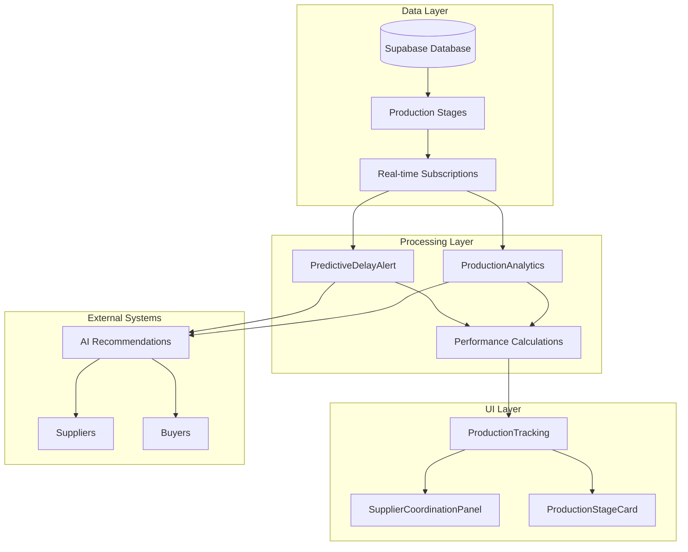
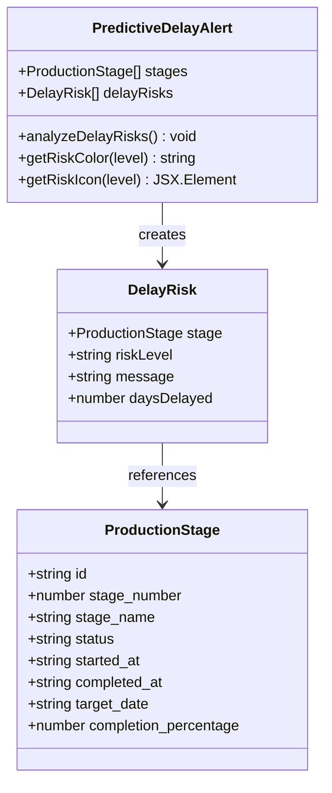
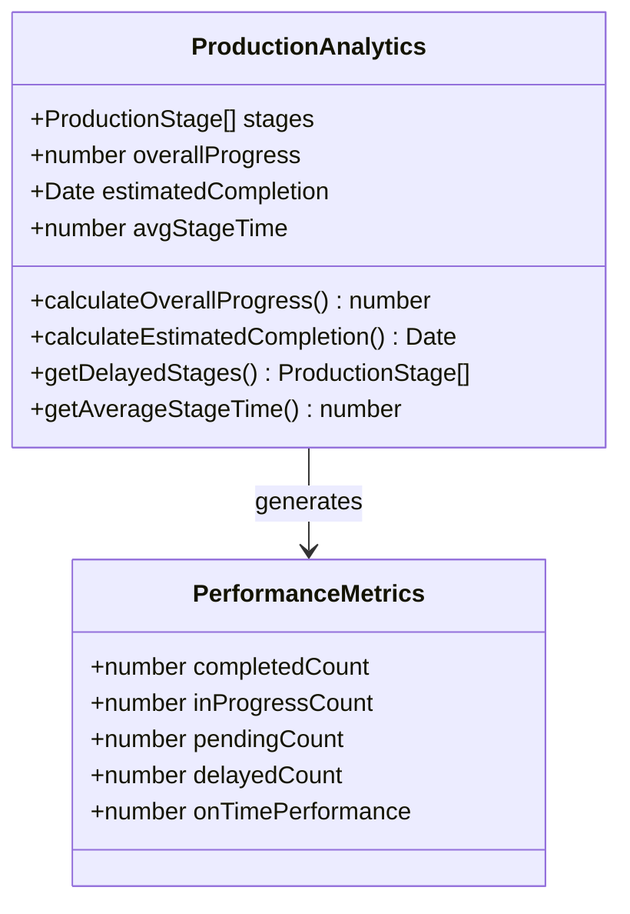
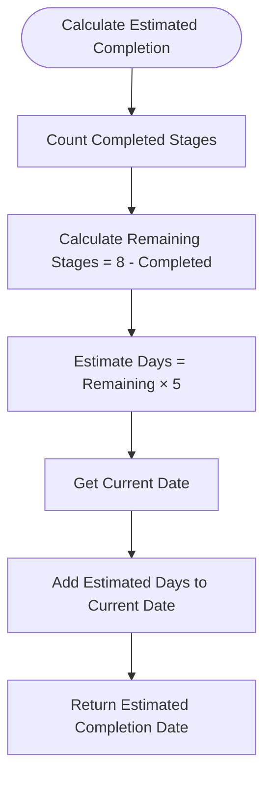
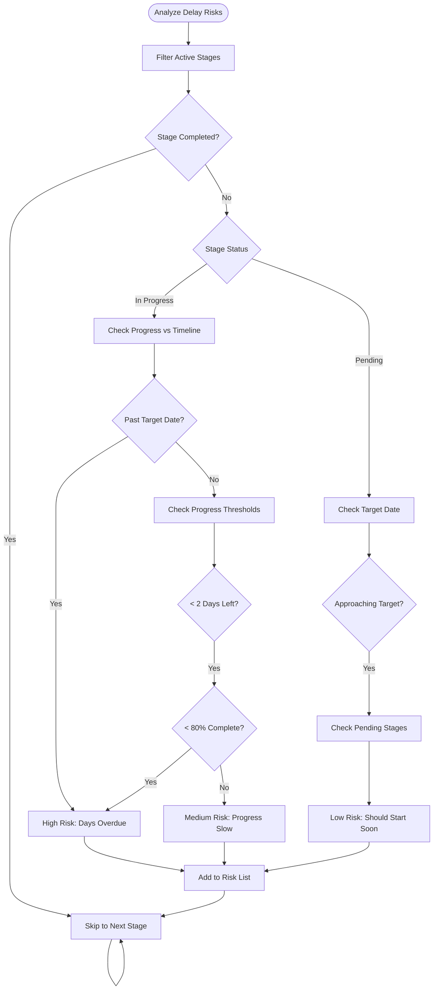
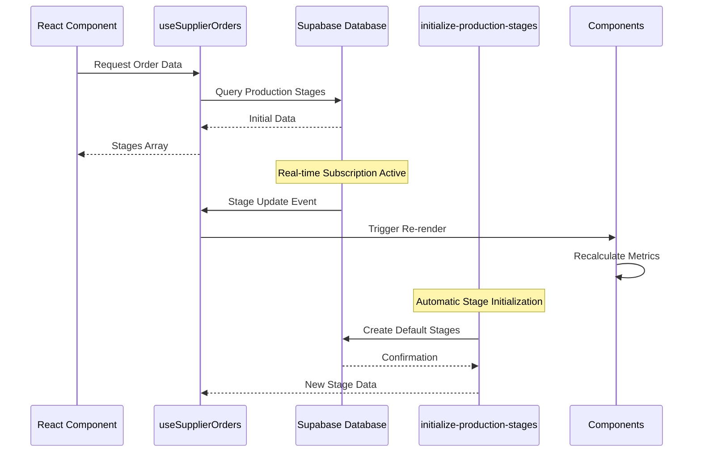
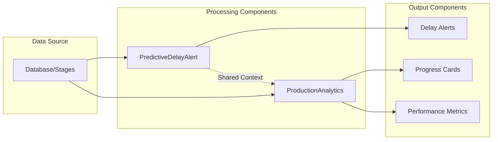
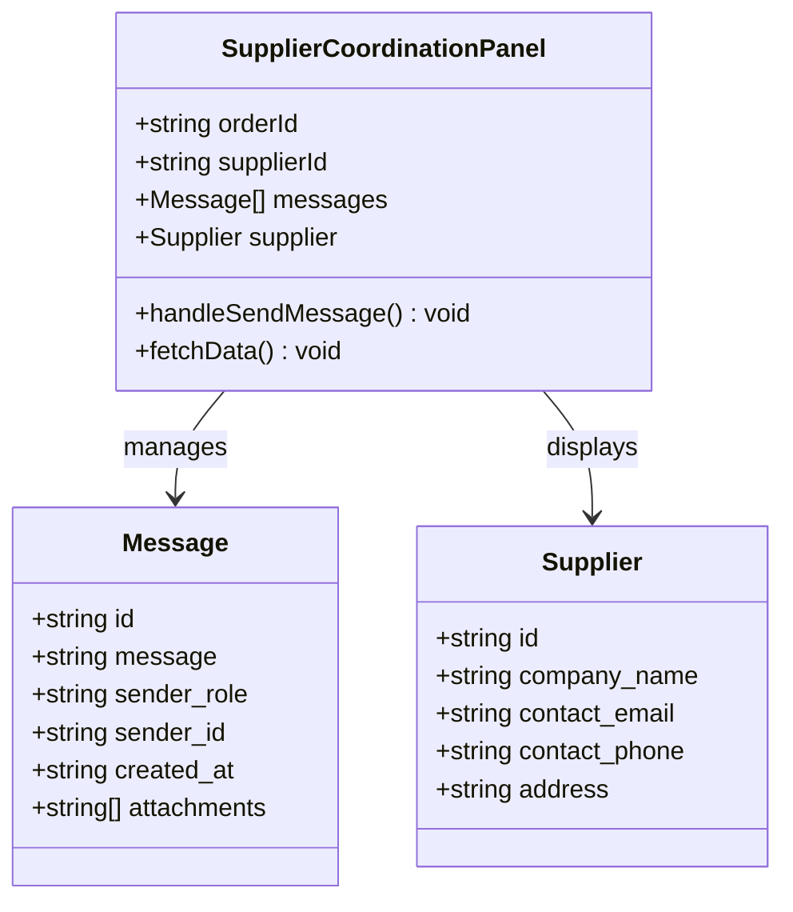

# Performance Metrics Integration

<cite>
**Referenced Files in This Document**
- [PredictiveDelayAlert.tsx](file://src/components/production/PredictiveDelayAlert.tsx)
- [ProductionAnalytics.tsx](file://src/components/production/ProductionAnalytics.tsx)
- [ProductionTracking.tsx](file://src/pages/ProductionTracking.tsx)
- [SupplierCoordinationPanel.tsx](file://src/components/production/SupplierCoordinationPanel.tsx)
- [ProductionStageCard.tsx](file://src/components/production/ProductionStageCard.tsx)
- [useSupplierOrders.ts](file://src/hooks/useSupplierOrders.ts)
- [ProductionManagementPanel.tsx](file://src/components/supplier/ProductionManagementPanel.tsx)
- [initialize-production-stages/index.ts](file://supabase/functions/initialize-production-stages/index.ts)
</cite>

## Table of Contents
1. [Introduction](#introduction)
2. [Architecture Overview](#architecture-overview)
3. [Core Components Analysis](#core-components-analysis)
4. [Performance Metrics Calculation](#performance-metrics-calculation)
5. [Integration Patterns](#integration-patterns)
6. [AI Recommendations and Coordination](#ai-recommendations-and-coordination)
7. [Common Issues and Solutions](#common-issues-and-solutions)
8. [Implementation Examples](#implementation-examples)
9. [Best Practices](#best-practices)
10. [Troubleshooting Guide](#troubleshooting-guide)

## Introduction

The performance metrics integration between PredictiveDelayAlert and ProductionAnalytics components forms the backbone of LoopTrace™ Technology's production monitoring system. This sophisticated integration enables real-time delay prediction, comprehensive progress tracking, and intelligent supplier coordination through standardized performance measurement and AI-driven insights.

The system operates on a unified data model where both components receive identical production stage data but process it through different analytical lenses. PredictiveDelayAlert focuses on risk assessment and delay prediction, while ProductionAnalytics emphasizes progress tracking and performance optimization. This dual-processing approach ensures comprehensive visibility into production pipelines while maintaining specialized functionality for different stakeholder needs.

## Architecture Overview

The performance metrics integration follows a modular architecture where components share common data structures but implement distinct analytical approaches:



**Diagram sources**
- [ProductionTracking.tsx](file://src/pages/ProductionTracking.tsx#L488-L496)
- [PredictiveDelayAlert.tsx](file://src/components/production/PredictiveDelayAlert.tsx#L31-L36)
- [ProductionAnalytics.tsx](file://src/components/production/ProductionAnalytics.tsx#L30-L36)

## Core Components Analysis

### PredictiveDelayAlert Component

The PredictiveDelayAlert component serves as the early warning system for production delays, implementing sophisticated risk assessment algorithms:



**Diagram sources**
- [PredictiveDelayAlert.tsx](file://src/components/production/PredictiveDelayAlert.tsx#L8-L30)

The component implements multiple risk assessment heuristics:

1. **Overdue Stage Detection**: Identifies stages past their target dates
2. **Progress Threshold Analysis**: Evaluates completion percentages against timeline expectations
3. **Pending Stage Monitoring**: Tracks stages approaching their target dates
4. **Risk Level Classification**: Categorizes risks as low, medium, or high severity

**Section sources**
- [PredictiveDelayAlert.tsx](file://src/components/production/PredictiveDelayAlert.tsx#L38-L108)

### ProductionAnalytics Component

ProductionAnalytics provides comprehensive progress tracking and performance metrics:



**Diagram sources**
- [ProductionAnalytics.tsx](file://src/components/production/ProductionAnalytics.tsx#L30-L92)

The component calculates several key performance indicators:

1. **Overall Progress**: Combines completed stages and in-progress percentages
2. **Estimated Completion Date**: Projects completion based on remaining stages
3. **Average Stage Duration**: Calculates historical performance metrics
4. **Delayed Stage Identification**: Flags stages behind schedule

**Section sources**
- [ProductionAnalytics.tsx](file://src/components/production/ProductionAnalytics.tsx#L31-L92)

## Performance Metrics Calculation

### Overall Progress Calculation

The calculateOverallProgress function in ProductionAnalytics implements a weighted progress calculation that combines completed stages with in-progress stage percentages:

```mermaid
flowchart TD
Start([Calculate Overall Progress]) --> CheckEmpty{Stages Empty?}
CheckEmpty --> |Yes| ReturnZero[Return 0%]
CheckEmpty --> |No| CountCompleted[Count Completed Stages]
CountCompleted --> CountInProgress[Count In-Progress Stages]
CountInProgress --> InitProgress[Initialize Total Progress = 0]
InitProgress --> AddCompleted[Add 100% × Completed Count]
AddCompleted --> IterateInProgress[Iterate Through In-Progress Stages]
IterateInProgress --> AddPercentage[Add Completion Percentage]
AddPercentage --> DivideBy8[Divide by 8 (Total Stages)]
DivideBy8 --> RoundResult[Round to Nearest Integer]
RoundResult --> ReturnProgress[Return Progress Percentage]
```

**Diagram sources**
- [ProductionAnalytics.tsx](file://src/components/production/ProductionAnalytics.tsx#L31-L44)

The calculation formula is:
```
totalProgress = (completedStages × 100) + Σ(inProgressStage.completion_percentage)
overallProgress = Math.round(totalProgress / 8)
```

This approach ensures that partially completed stages contribute proportionally to the overall progress, providing a realistic assessment of production status.

**Section sources**
- [ProductionAnalytics.tsx](file://src/components/production/ProductionAnalytics.tsx#L31-L44)

### Estimated Completion Date Calculation

The calculateEstimatedCompletion function projects production completion based on average stage duration and remaining workload:



**Diagram sources**
- [ProductionAnalytics.tsx](file://src/components/production/ProductionAnalytics.tsx#L46-L57)

The estimation assumes a constant 5-day average per stage, which can be refined through historical data analysis. This baseline projection provides stakeholders with clear expectations for production timelines.

**Section sources**
- [ProductionAnalytics.tsx](file://src/components/production/ProductionAnalytics.tsx#L46-L57)

### Delay Risk Assessment

PredictiveDelayAlert implements multiple delay detection algorithms:



**Diagram sources**
- [PredictiveDelayAlert.tsx](file://src/components/production/PredictiveDelayAlert.tsx#L38-L108)

**Section sources**
- [PredictiveDelayAlert.tsx](file://src/components/production/PredictiveDelayAlert.tsx#L38-L108)

## Integration Patterns

### Shared Data Model

Both components utilize the same ProductionStage interface, ensuring consistency across the system:

| Property | Type | Purpose | Usage |
|----------|------|---------|-------|
| `id` | string | Unique identifier | Stage tracking |
| `stage_number` | number | Sequential ordering | Progress calculation |
| `stage_name` | string | Human-readable name | UI display |
| `status` | string | Current state | Risk assessment |
| `started_at` | string \| null | Start timestamp | Timeline tracking |
| `completed_at` | string \| null | Completion timestamp | Performance metrics |
| `target_date` | string \| null | Expected completion | Delay prediction |
| `completion_percentage` | number \| null | Progress indicator | Progress calculation |

**Section sources**
- [PredictiveDelayAlert.tsx](file://src/components/production/PredictiveDelayAlert.tsx#L8-L17)
- [ProductionAnalytics.tsx](file://src/components/production/ProductionAnalytics.tsx#L14-L23)

### Real-time Data Synchronization

The system maintains real-time synchronization through Supabase's real-time capabilities:



**Diagram sources**
- [useSupplierOrders.ts](file://src/hooks/useSupplierOrders.ts#L10-L29)
- [ProductionTracking.tsx](file://src/pages/ProductionTracking.tsx#L63-L88)

**Section sources**
- [useSupplierOrders.ts](file://src/hooks/useSupplierOrders.ts#L10-L29)
- [ProductionTracking.tsx](file://src/pages/ProductionTracking.tsx#L63-L88)

### Component Interaction Flow

The integration follows a predictable data flow pattern:



**Diagram sources**
- [ProductionTracking.tsx](file://src/pages/ProductionTracking.tsx#L488-L496)

**Section sources**
- [ProductionTracking.tsx](file://src/pages/ProductionTracking.tsx#L488-L496)

## AI Recommendations and Coordination

### Supplier Coordination Integration

The SupplierCoordinationPanel serves as the communication hub for delay resolution:



**Diagram sources**
- [SupplierCoordinationPanel.tsx](file://src/components/production/SupplierCoordinationPanel.tsx#L24-L35)

**Section sources**
- [SupplierCoordinationPanel.tsx](file://src/components/production/SupplierCoordinationPanel.tsx#L37-L256)

### AI-Driven Recommendations

The system integrates AI recommendations based on performance metrics:

| Scenario | Performance Metric | AI Recommendation |
|----------|-------------------|-------------------|
| High Delay Risk | Multiple stages overdue (> 3 days) | "Immediate action required. Consider reallocating resources or communicating with suppliers." |
| Medium Delay Risk | Approaching deadlines with low progress | "Monitor progress closely. Early intervention can prevent delays." |
| Excellent Performance | All stages on track | "Production is in final stages. Maintain current pace for on-time delivery." |
| Moderate Performance | Halfway through production | "Halfway through production. Monitor closely for any bottlenecks." |

**Section sources**
- [PredictiveDelayAlert.tsx](file://src/components/production/PredictiveDelayAlert.tsx#L190-L198)
- [ProductionAnalytics.tsx](file://src/components/production/ProductionAnalytics.tsx#L235-L241)

## Common Issues and Solutions

### Inconsistent Progress Reporting

**Problem**: Suppliers report different completion percentages for the same stage.

**Solution**: Implement standardized completion criteria:

```typescript
// Standardized completion criteria
const STANDARDIZED_CRITERIA = {
  fabric_preparation: {
    criteria: [
      'Fabric received and inspected',
      'Quality checks completed',
      'Material ready for cutting'
    ],
    percentage_mapping: {
      'Not Started': 0,
      'Inspection In Progress': 25,
      'Ready for Cutting': 75,
      'Completed': 100
    }
  }
};
```

### Missing Target Dates

**Problem**: Some stages lack target dates, affecting delay calculations.

**Solution**: Automatic target date generation:

```typescript
// Automatic target date calculation
const calculateTargetDate = (stage: ProductionStage, previousStage?: ProductionStage) => {
  if (stage.target_date) return stage.target_date;
  
  const baseDate = previousStage?.completed_at || previousStage?.started_at || new Date();
  const estimatedDuration = stage.estimated_days || 5;
  
  const targetDate = new Date(baseDate);
  targetDate.setDate(targetDate.getDate() + estimatedDuration);
  
  return targetDate.toISOString();
};
```

### Data Synchronization Issues

**Problem**: Real-time updates cause UI inconsistencies.

**Solution**: Implement optimistic updates with conflict resolution:

```typescript
// Optimistic update pattern
const useOptimisticStageUpdate = (stageId: string, initialData: ProductionStage) => {
  const [optimisticData, setOptimisticData] = useState(initialData);
  const [isUpdating, setIsUpdating] = useState(false);
  
  const updateStage = async (updates: Partial<ProductionStage>) => {
    // Optimistic update
    setOptimisticData(prev => ({ ...prev, ...updates }));
    setIsUpdating(true);
    
    try {
      // Actual API call
      await supabase.from('production_stages')
        .update(updates)
        .eq('id', stageId);
    } catch (error) {
      // Rollback on error
      setOptimisticData(initialData);
      throw error;
    } finally {
      setIsUpdating(false);
    }
  };
  
  return { data: optimisticData, isUpdating, updateStage };
};
```

**Section sources**
- [ProductionStageCard.tsx](file://src/components/production/ProductionStageCard.tsx#L57-L62)

## Implementation Examples

### Basic Integration Example

Here's how the components integrate in a typical production tracking scenario:

```typescript
// ProductionTracking.tsx integration
const ProductionTracking = () => {
  const [selectedOrder, setSelectedOrder] = useState<any>(null);
  const [stages, setStages] = useState<ProductionStage[]>([]);
  
  // Real-time subscription
  useEffect(() => {
    if (!selectedOrder) return;
    
    const channel = supabase
      .channel(`production-updates-${selectedOrder.id}`)
      .on('postgres_changes', {
        event: '*',
        schema: 'public',
        table: 'production_stages',
        filter: `supplier_order_id=eq.${selectedOrder.id}`
      }, (payload) => {
        // Refresh stages when updated
        fetchProductionStages(selectedOrder.id);
      })
      .subscribe();
    
    return () => {
      supabase.removeChannel(channel);
    };
  }, [selectedOrder?.id]);
  
  return (
    <div className="grid grid-cols-1 lg:grid-cols-3 gap-6">
      {/* Analytics Tab */}
      <TabsContent value="analytics" className="space-y-4">
        <ProductionAnalytics 
          orderId={selectedOrder.id}
          stages={stages}
        />
        <PredictiveDelayAlert 
          orderId={selectedOrder.id}
          stages={stages}
        />
      </TabsContent>
      
      {/* Supplier Coordination Tab */}
      <TabsContent value="suppliers" className="space-y-4">
        <SupplierCoordinationPanel 
          orderId={selectedOrder.id}
          supplierId={selectedOrder.supplier_id}
        />
      </TabsContent>
    </div>
  );
};
```

**Section sources**
- [ProductionTracking.tsx](file://src/pages/ProductionTracking.tsx#L488-L496)

### Advanced Performance Monitoring

For enhanced performance monitoring, implement custom metrics:

```typescript
// Custom performance metrics
const calculateAdvancedMetrics = (stages: ProductionStage[]) => {
  const metrics = {
    throughputRate: calculateThroughputRate(stages),
    bottleneckStages: identifyBottlenecks(stages),
    resourceUtilization: calculateResourceUtilization(stages),
    qualityScore: calculateQualityScore(stages)
  };
  
  return metrics;
};

// Bottleneck identification
const identifyBottlenecks = (stages: ProductionStage[]) => {
  return stages
    .filter(stage => {
      const completionTime = getCompletionTime(stage);
      const averageTime = getAverageStageTime(stages);
      
      return completionTime > averageTime * 1.5;
    })
    .map(stage => stage.stage_name);
};
```

## Best Practices

### Data Consistency

1. **Standardize Completion Criteria**: Define clear completion thresholds for each stage
2. **Enforce Target Dates**: Automatically generate target dates for new stages
3. **Validate Input Data**: Implement data validation for progress percentages and timestamps

### Performance Optimization

1. **Memoization**: Use React.memo for expensive calculations
2. **Debounced Updates**: Debounce rapid stage updates to prevent excessive re-renders
3. **Selective Rendering**: Render only visible components in large stage lists

### Error Handling

1. **Graceful Degradation**: Provide fallback UI when calculations fail
2. **User Feedback**: Inform users when metrics are temporarily unavailable
3. **Logging**: Log calculation errors for debugging

### Security Considerations

1. **Access Control**: Restrict stage updates based on user roles
2. **Data Validation**: Validate all incoming stage data
3. **Audit Trails**: Log all stage modifications for accountability

## Troubleshooting Guide

### Common Performance Issues

**Issue**: Slow rendering with large stage lists

**Solution**: Implement virtualization and pagination:

```typescript
// Virtualized stage rendering
const VirtualizedStageList = ({ stages, renderItem }) => {
  const { height, width } = useWindowSize();
  const rowHeight = 80;
  const visibleRows = Math.ceil(height / rowHeight);
  
  return (
    <AutoSizer>
      {({ width, height }) => (
        <List
          width={width}
          height={height}
          rowCount={stages.length}
          rowHeight={rowHeight}
          rowRenderer={({ key, index, style }) => (
            <div style={style} key={key}>
              {renderItem(stages[index], index)}
            </div>
          )}
        />
      )}
    </AutoSizer>
  );
};
```

**Issue**: Inaccurate delay predictions

**Solution**: Implement confidence scoring for predictions:

```typescript
// Confidence-aware delay prediction
const predictDelayRisk = (stage: ProductionStage, confidence: number) => {
  const baseRisk = calculateRisk(stage);
  
  // Adjust risk based on confidence level
  const adjustedRisk = baseRisk * (confidence / 100);
  
  return {
    riskLevel: classifyRisk(adjustedRisk),
    confidence: confidence,
    message: generateRiskMessage(stage, adjustedRisk)
  };
};
```

### Debugging Tools

1. **Console Logging**: Add detailed logging for metric calculations
2. **Performance Profiling**: Use React DevTools Profiler
3. **Network Monitoring**: Monitor Supabase real-time connections
4. **Data Validation**: Implement stage data validation utilities

**Section sources**
- [ProductionAnalytics.tsx](file://src/components/production/ProductionAnalytics.tsx#L68-L87)
- [PredictiveDelayAlert.tsx](file://src/components/production/PredictiveDelayAlert.tsx#L38-L108)