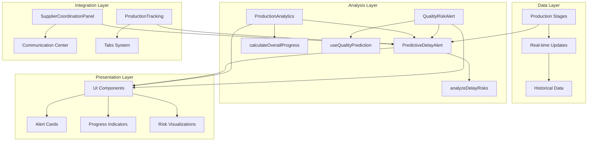
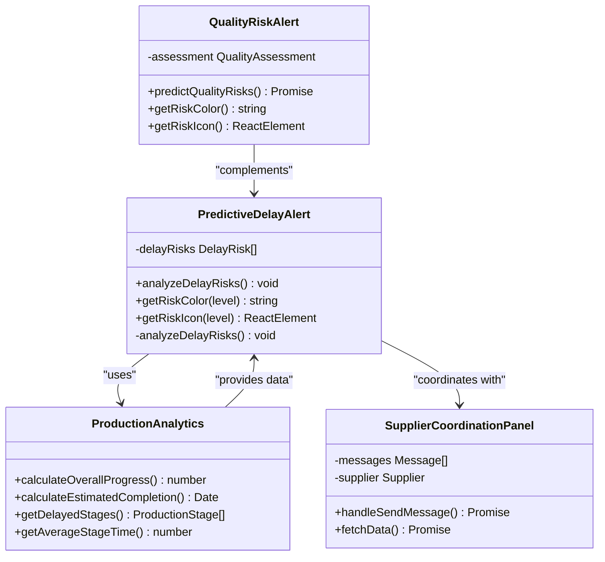
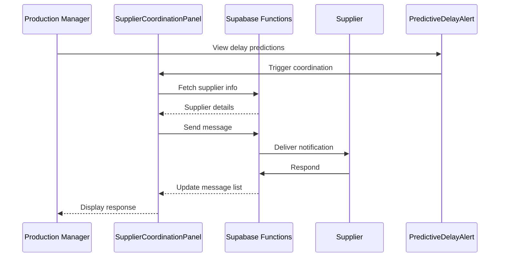
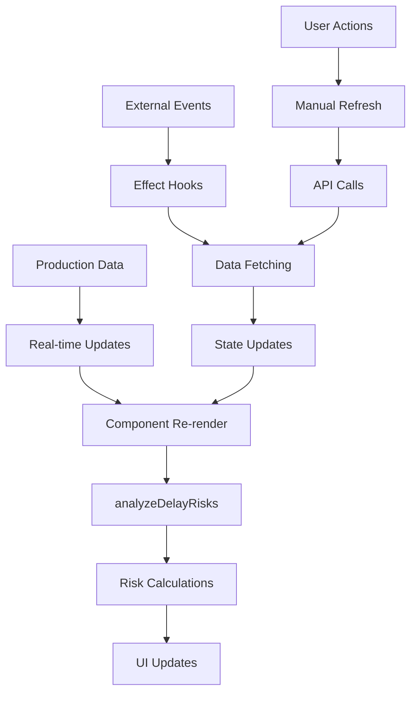

# Predictive Analytics System Documentation

<cite>
**Referenced Files in This Document**
- [PredictiveDelayAlert.tsx](file://src/components/production/PredictiveDelayAlert.tsx)
- [ProductionAnalytics.tsx](file://src/components/production/ProductionAnalytics.tsx)
- [SupplierCoordinationPanel.tsx](file://src/components/production/SupplierCoordinationPanel.tsx)
- [QualityRiskAlert.tsx](file://src/components/production/QualityRiskAlert.tsx)
- [ProductionTracking.tsx](file://src/pages/ProductionTracking.tsx)
- [useQualityPrediction.ts](file://src/hooks/useQualityPrediction.ts)
- [index.ts](file://supabase/functions/predict-quality-risks/index.ts)
</cite>

## Table of Contents
1. [Introduction](#introduction)
2. [System Architecture](#system-architecture)
3. [Core Components](#core-components)
4. [PredictiveDelayAlert Component](#predictivedelayalert-component)
5. [ProductionAnalytics Integration](#productionanalytics-integration)
6. [Supplier Coordination Integration](#supplier-coordination-integration)
7. [Quality Risk Assessment](#quality-risk-assessment)
8. [Implementation Details](#implementation-details)
9. [Common Issues and Solutions](#common-issues-and-solutions)
10. [Best Practices](#best-practices)
11. [Troubleshooting Guide](#troubleshooting-guide)

## Introduction

The Predictive Analytics System is a sophisticated AI-powered solution designed to forecast production bottlenecks and potential delays in garment manufacturing (RMG) operations. Built around the core PredictiveDelayAlert component, this system combines real-time data analysis with machine learning heuristics to provide actionable insights for production managers, buyers, and suppliers.

The system operates on a multi-layered approach, integrating delay prediction with quality risk assessment to deliver comprehensive production oversight. It leverages historical data, current progress metrics, and AI-driven analysis to identify potential bottlenecks before they impact delivery schedules.

## System Architecture

The predictive analytics system follows a modular architecture that separates concerns between data collection, analysis, and presentation:



**Diagram sources**
- [PredictiveDelayAlert.tsx](file://src/components/production/PredictiveDelayAlert.tsx#L31-L202)
- [ProductionAnalytics.tsx](file://src/components/production/ProductionAnalytics.tsx#L30-L249)
- [ProductionTracking.tsx](file://src/pages/ProductionTracking.tsx#L31-L32)

## Core Components

The system consists of several interconnected components that work together to provide comprehensive predictive analytics:

### Component Hierarchy



**Diagram sources**
- [PredictiveDelayAlert.tsx](file://src/components/production/PredictiveDelayAlert.tsx#L8-L29)
- [ProductionAnalytics.tsx](file://src/components/production/ProductionAnalytics.tsx#L14-L28)
- [SupplierCoordinationPanel.tsx](file://src/components/production/SupplierCoordinationPanel.tsx#L24-L36)

## PredictiveDelayAlert Component

The PredictiveDelayAlert component serves as the cornerstone of the predictive analytics system, implementing sophisticated heuristics to forecast production delays.

### Component Structure

The component accepts production stages as props and maintains internal state for delay risks:

```typescript
interface PredictiveDelayAlertProps {
  orderId: string;
  stages: ProductionStage[];
}

interface DelayRisk {
  stage: ProductionStage;
  riskLevel: 'low' | 'medium' | 'high';
  message: string;
  daysDelayed?: number;
}
```

### AnalyzeDelayRisks Function

The heart of the predictive system lies in the `analyzeDelayRisks` function, which evaluates each production stage against multiple criteria:

#### Risk Assessment Criteria

The function employs a multi-tiered approach to risk assessment:

1. **High Risk Conditions** (Critical Delays):
   - Past target date with ongoing progress
   - Insufficient completion percentage nearing deadline
   - Unstarted stages with imminent deadlines

2. **Medium Risk Conditions** (Potential Delays):
   - Low progress with approaching deadlines
   - Near-term deadlines with moderate completion

3. **Low Risk Conditions** (Minor Concerns):
   - Future deadlines with pending stages

#### Days Until Target Calculation

The system uses the `daysUntilTarget` metric extensively:

```typescript
const daysUntilTarget = differenceInDays(targetDate, now);
```

This calculation forms the basis for determining temporal proximity to deadlines, enabling early warning detection.

#### Completion Percentage Analysis

The `completion_percentage` field provides crucial progress context:

```typescript
const progress = stage.completion_percentage || 0;
```

This percentage, combined with temporal data, creates a comprehensive risk profile for each stage.

**Section sources**
- [PredictiveDelayAlert.tsx](file://src/components/production/PredictiveDelayAlert.tsx#L38-L108)

## ProductionAnalytics Integration

The ProductionAnalytics component complements PredictiveDelayAlert by providing overall production insights and calculated metrics.

### Progress Calculation

The system calculates overall progress using a weighted average approach:

```typescript
const calculateOverallProgress = () => {
  const completedStages = stages.filter(s => s.status === 'completed').length;
  const inProgressStages = stages.filter(s => s.status === 'in_progress');
  
  let totalProgress = completedStages * 100;
  
  inProgressStages.forEach(stage => {
    totalProgress += (stage.completion_percentage || 0);
  });
  
  return Math.round(totalProgress / 8); // 8 total stages
};
```

### Estimated Completion Calculation

The system provides estimated completion dates based on remaining stages:

```typescript
const calculateEstimatedCompletion = () => {
  const completedCount = stages.filter(s => s.status === 'completed').length;
  const remainingStages = 8 - completedCount;
  
  const estimatedDays = remainingStages * 5; // Simple estimation: 5 days per stage
  
  const estimatedDate = new Date();
  estimatedDate.setDate(estimatedDate.getDate() + estimatedDays);
  
  return estimatedDate;
};
```

### Delay Detection

The system identifies delayed stages by comparing target dates with current time:

```typescript
const getDelayedStages = () => {
  const now = new Date();
  return stages.filter(stage => {
    if (stage.status === 'completed' || !stage.target_date) return false;
    const targetDate = new Date(stage.target_date);
    return targetDate < now;
  });
};
```

**Section sources**
- [ProductionAnalytics.tsx](file://src/components/production/ProductionAnalytics.tsx#L31-L66)

## Supplier Coordination Integration

The SupplierCoordinationPanel facilitates communication between stakeholders when predictive alerts indicate potential delays.

### Communication Features

The panel provides real-time messaging capabilities:

- **Real-time Subscriptions**: WebSocket connections for instant message delivery
- **Role-Based Messaging**: Automatic identification of sender roles (buyer/supplier)
- **Attachment Support**: File sharing capabilities
- **Read Receipts**: Message acknowledgment tracking

### Integration Workflow



**Diagram sources**
- [SupplierCoordinationPanel.tsx](file://src/components/production/SupplierCoordinationPanel.tsx#L37-L256)

**Section sources**
- [SupplierCoordinationPanel.tsx](file://src/components/production/SupplierCoordinationPanel.tsx#L37-L256)

## Quality Risk Assessment

The QualityRiskAlert component provides complementary risk assessment focused on quality rather than timeline concerns.

### AI-Powered Analysis

Quality risk assessment utilizes serverless functions with AI capabilities:

```typescript
const predictQualityRisks = async (supplierOrderId: string) => {
  const { data, error } = await supabase.functions.invoke('predict-quality-risks', {
    body: { supplier_order_id: supplierOrderId }
  });
  
  if (data.assessment) {
    setAssessment(data.assessment);
    return data.assessment;
  }
};
```

### Risk Levels and Scoring

The system categorizes quality risks using a four-tier scale:

- **Critical**: Immediate action required
- **High**: Significant risk factors identified
- **Medium**: Moderate concerns
- **Low**: Minimal quality risks

### Risk Factor Analysis

The AI system identifies specific risk factors and provides tailored recommendations:

```typescript
interface QualityAssessment {
  risk_score: number;
  risk_level: 'low' | 'medium' | 'high' | 'critical';
  risk_factors: string[];
  recommendations: string[];
}
```

**Section sources**
- [QualityRiskAlert.tsx](file://src/components/production/QualityRiskAlert.tsx#L12-L113)
- [useQualityPrediction.ts](file://src/hooks/useQualityPrediction.ts#L12-L56)

## Implementation Details

### Data Flow Architecture

The predictive analytics system follows a reactive data flow pattern:



**Diagram sources**
- [PredictiveDelayAlert.tsx](file://src/components/production/PredictiveDelayAlert.tsx#L34-L36)

### Performance Optimization

The system implements several optimization strategies:

1. **Memoization**: Risk calculations are cached during component lifecycle
2. **Debounced Updates**: Real-time subscriptions prevent excessive re-renders
3. **Conditional Rendering**: Empty states hide unnecessary UI elements
4. **Efficient Filtering**: Array operations use optimized filtering patterns

### Error Handling

Robust error handling ensures system reliability:

```typescript
try {
  const { data, error } = await supabase.functions.invoke('predict-quality-risks', {
    body: { supplier_order_id: supplierOrderId }
  });
  
  if (error) throw error;
  return data.assessment;
} catch (error: any) {
  console.error('Error predicting quality risks:', error);
  return null;
}
```

**Section sources**
- [useQualityPrediction.ts](file://src/hooks/useQualityPrediction.ts#L16-L46)

## Common Issues and Solutions

### False Positive Delay Predictions

**Problem**: The system occasionally predicts delays that don't materialize.

**Root Causes**:
1. **Incomplete Data**: Missing completion percentages or target dates
2. **Rapid Progress**: Stages completing faster than predicted
3. **External Factors**: Unaccounted supply chain disruptions

**Solutions**:

#### Data Validation Improvements

```typescript
// Enhanced validation for missing data
if (!stage.target_date || stage.completion_percentage === null) {
  // Skip analysis for incomplete data
  continue;
}
```

#### Adaptive Thresholds

Implement dynamic thresholds based on historical performance:

```typescript
const adaptiveThreshold = (stage: ProductionStage) => {
  const baseThreshold = 5; // days
  const historicalAccuracy = calculateHistoricalAccuracy(stage);
  return baseThreshold * historicalAccuracy;
};
```

#### Confidence Scoring

Add confidence levels to predictions:

```typescript
interface DelayRiskWithConfidence extends DelayRisk {
  confidenceScore: number; // 0-100
  confidenceLevel: 'high' | 'medium' | 'low';
}
```

### Performance Degradation

**Problem**: Large datasets cause slow rendering and analysis.

**Solutions**:

1. **Pagination**: Limit stages processed in single analysis
2. **Worker Threads**: Offload heavy computations
3. **Selective Analysis**: Focus on high-risk stages

### Integration Challenges

**Problem**: Real-time updates conflict with manual data entry.

**Solutions**:

1. **Event Debouncing**: Prevent rapid successive updates
2. **Conflict Resolution**: Merge conflicting data sources
3. **User Feedback**: Notify users of automatic updates

## Best Practices

### Data Collection Standards

1. **Complete Stage Data**: Ensure all stages have target dates and completion percentages
2. **Timely Updates**: Implement automated data capture mechanisms
3. **Validation Rules**: Enforce data integrity constraints

### Risk Assessment Guidelines

1. **Multi-Factor Analysis**: Combine temporal and progress metrics
2. **Historical Context**: Consider past performance trends
3. **Scenario Planning**: Account for various completion scenarios

### User Experience Optimization

1. **Clear Visual Cues**: Use consistent color coding and icons
2. **Actionable Insights**: Provide specific recommendations
3. **Progressive Disclosure**: Show detailed information on demand

### System Maintenance

1. **Regular Calibration**: Update heuristics based on actual outcomes
2. **Performance Monitoring**: Track system response times
3. **User Feedback**: Collect and incorporate user suggestions

## Troubleshooting Guide

### Component Not Updating

**Symptoms**: PredictiveDelayAlert doesn't reflect recent changes

**Diagnosis Steps**:
1. Verify data prop updates
2. Check useEffect dependencies
3. Confirm real-time subscription status

**Solutions**:
```typescript
// Ensure proper dependency tracking
useEffect(() => {
  analyzeDelayRisks();
}, [stages, orderId]); // Include all dependencies
```

### Incorrect Risk Levels

**Symptoms**: Predictions don't match actual progress

**Diagnosis Steps**:
1. Review heuristic logic
2. Validate input data quality
3. Check date calculations

**Solutions**:
```typescript
// Add debug logging
console.log('Stage analysis:', {
  stageName: stage.stage_name,
  daysUntilTarget,
  completionPercentage: progress,
  riskLevel: riskLevel
});
```

### Communication Failures

**Symptoms**: Supplier messages not sending or receiving

**Diagnosis Steps**:
1. Check network connectivity
2. Verify authentication tokens
3. Review Supabase function logs

**Solutions**:
```typescript
// Enhanced error handling
const handleSendMessage = async () => {
  try {
    const { data, error } = await supabase.from('order_messages').insert({
      order_id: orderId,
      message: newMessage,
      sender_role: senderType,
      sender_id: user.id
    });
    
    if (error) throw new Error(error.message);
    
  } catch (error: any) {
    console.error('Message sending failed:', error);
    toast({
      title: "Message Failed",
      description: "Please check your connection and try again",
      variant: "destructive"
    });
  }
};
```

### Performance Issues

**Symptoms**: Slow loading or unresponsive interface

**Diagnosis Steps**:
1. Profile component render times
2. Monitor API response times
3. Check for memory leaks

**Solutions**:
```typescript
// Implement performance monitoring
const startTime = performance.now();
analyzeDelayRisks();
const endTime = performance.now();
console.log(`Analysis took ${endTime - startTime} milliseconds`);
```

**Section sources**
- [PredictiveDelayAlert.tsx](file://src/components/production/PredictiveDelayAlert.tsx#L34-L36)
- [SupplierCoordinationPanel.tsx](file://src/components/production/SupplierCoordinationPanel.tsx#L98-L138)