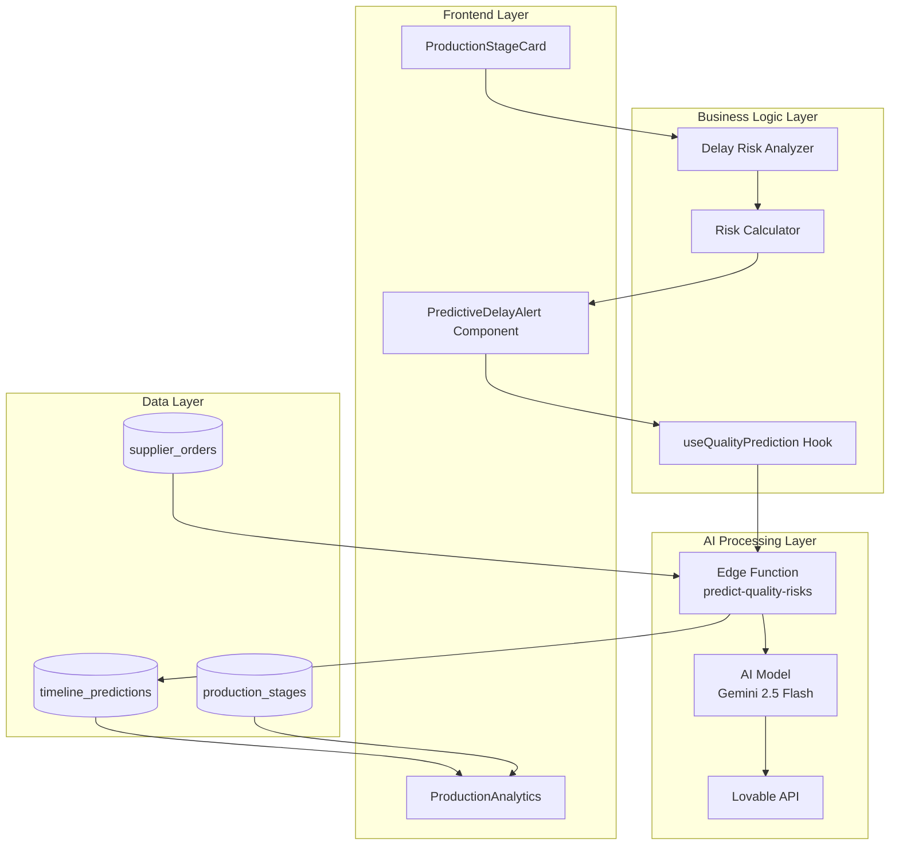
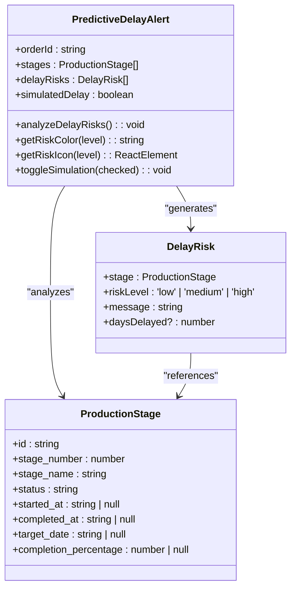
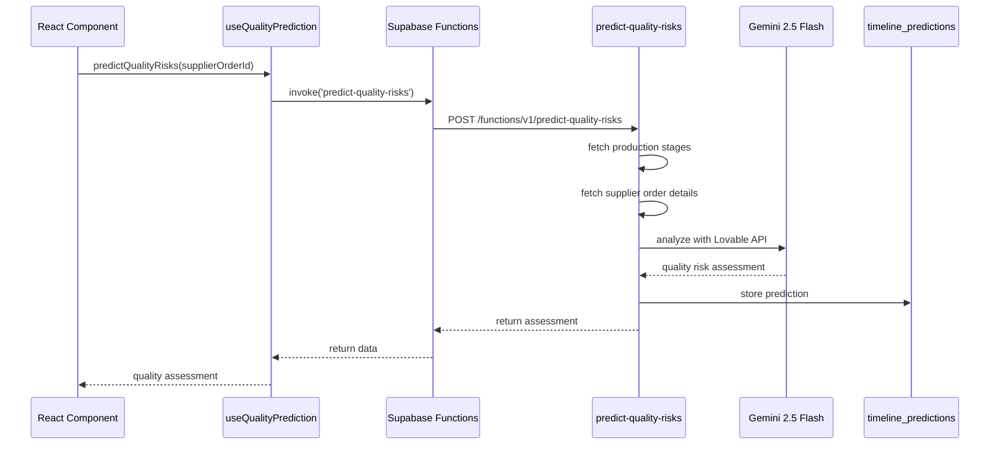
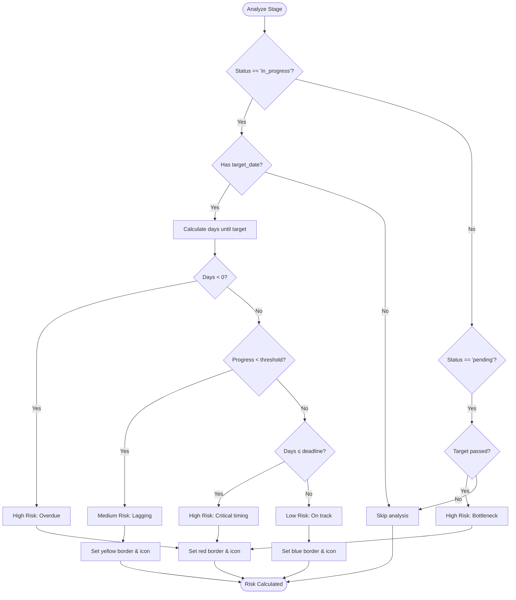
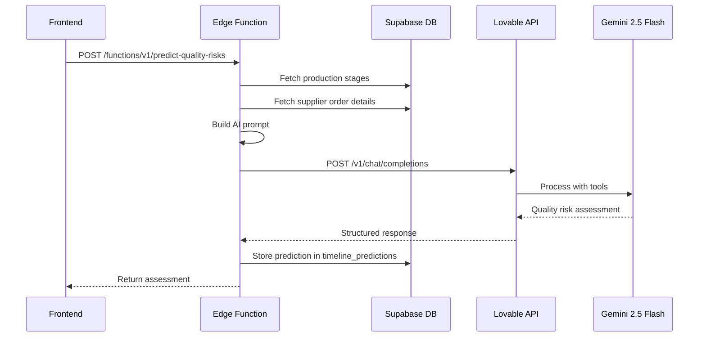
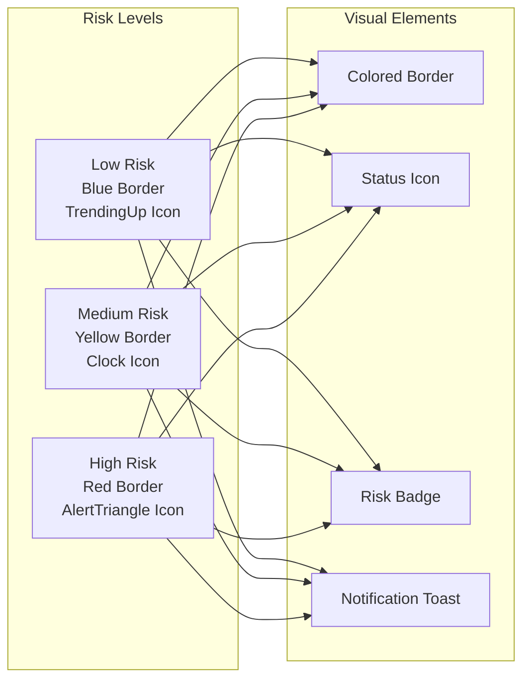
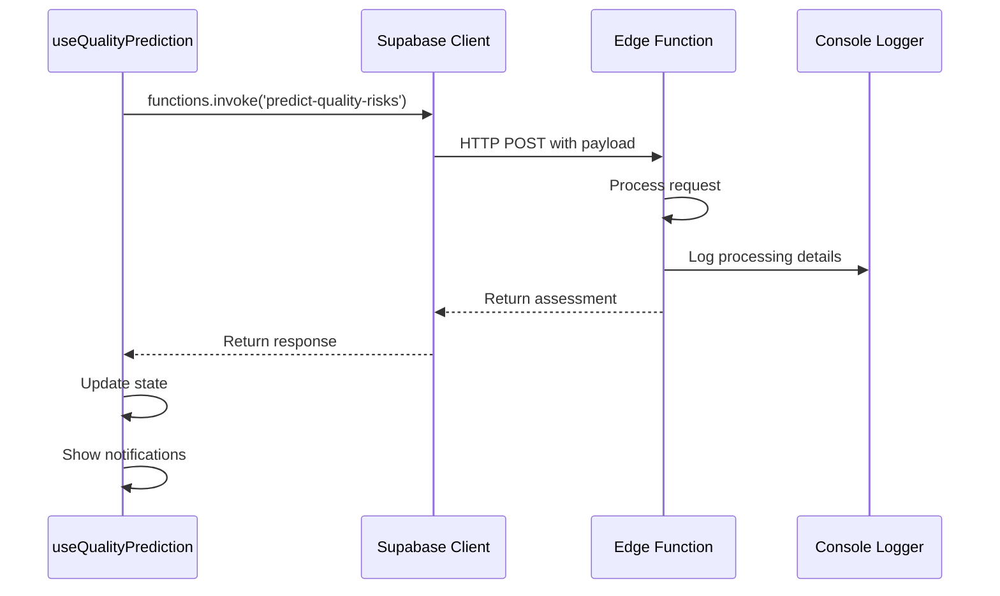

# Predictive Delay Alerts

<cite>
**Referenced Files in This Document**
- [PredictiveDelayAlert.tsx](file://src/components/production/PredictiveDelayAlert.tsx)
- [useQualityPrediction.ts](file://src/hooks/useQualityPrediction.ts)
- [predict-quality-risks/index.ts](file://supabase/functions/predict-quality-risks/index.ts)
- [ProductionStageCard.tsx](file://src/components/production/ProductionStageCard.tsx)
- [QualityRiskAlert.tsx](file://src/components/production/QualityRiskAlert.tsx)
- [ProductionAnalytics.tsx](file://src/components/production/ProductionAnalytics.tsx)
- [database.ts](file://src/types/database.ts)
- [timeline_predictions table schema](file://src/integrations/supabase/types.ts)
</cite>

## Table of Contents
1. [Introduction](#introduction)
2. [System Architecture](#system-architecture)
3. [Core Components](#core-components)
4. [Risk Classification System](#risk-classification-system)
5. [AI-Powered Analysis Engine](#ai-powered-analysis-engine)
6. [UI Components and Visualizations](#ui-components-and-visualizations)
7. [Integration with Edge Functions](#integration-with-edge-functions)
8. [Performance Optimization](#performance-optimization)
9. [Troubleshooting Guide](#troubleshooting-guide)
10. [Best Practices](#best-practices)

## Introduction

The Predictive Delay Alerts system is an AI-powered risk detection mechanism designed to identify potential production delays by analyzing production velocity, target dates, and completion percentages. This system provides real-time insights into production pipeline health and generates actionable recommendations to prevent costly delays.

The system operates through a three-tier risk classification approach (low, medium, high) and integrates seamlessly with the broader LoopTrace™ technology ecosystem to deliver comprehensive production monitoring capabilities.

## System Architecture

The Predictive Delay Alerts system follows a modular architecture that separates concerns between data analysis, AI processing, and user interface presentation.



**Diagram sources**
- [PredictiveDelayAlert.tsx](file://src/components/production/PredictiveDelayAlert.tsx#L35-L247)
- [useQualityPrediction.ts](file://src/hooks/useQualityPrediction.ts)
- [predict-quality-risks/index.ts](file://supabase/functions/predict-quality-risks/index.ts#L1-L131)

## Core Components

### PredictiveDelayAlert Component

The main component serves as the primary interface for delay risk analysis and visualization. It processes ProductionStage data to generate delay risks and displays them in a card-based interface with simulation mode toggle.



**Diagram sources**
- [PredictiveDelayAlert.tsx](file://src/components/production/PredictiveDelayAlert.tsx#L12-L33)

**Section sources**
- [PredictiveDelayAlert.tsx](file://src/components/production/PredictiveDelayAlert.tsx#L35-L247)

### useQualityPrediction Hook

The hook manages the integration with the AI-powered quality risk prediction system, handling API calls, error management, and state updates.



**Diagram sources**
- [useQualityPrediction.ts](file://src/hooks/useQualityPrediction.ts#L16-L55)
- [predict-quality-risks/index.ts](file://supabase/functions/predict-quality-risks/index.ts#L16-L131)

**Section sources**
- [useQualityPrediction.ts](file://src/hooks/useQualityPrediction.ts#L12-L56)

## Risk Classification System

The system employs a three-tier risk classification approach to categorize production risks based on multiple factors:

### Risk Level Definitions

| Risk Level | Threshold Criteria | Visual Indicators | Actionable Recommendations |
|------------|-------------------|-------------------|---------------------------|
| **Low** | Progress ≥ 20%, Days until target ≥ 7 | Blue border, TrendingUp icon | Monitor progress trends |
| **Medium** | Progress < 50% with approaching deadlines | Yellow border, Clock icon | Increase oversight |
| **High** | Critical bottlenecks or significant delays | Red border, AlertTriangle icon | Immediate intervention required |

### Delay Risk Calculation Algorithm

The delay risk analyzer evaluates multiple factors to determine risk levels:



**Diagram sources**
- [PredictiveDelayAlert.tsx](file://src/components/production/PredictiveDelayAlert.tsx#L60-L117)

**Section sources**
- [PredictiveDelayAlert.tsx](file://src/components/production/PredictiveDelayAlert.tsx#L60-L117)

## AI-Powered Analysis Engine

### Edge Function Implementation

The `predict-quality-risks` Edge Function serves as the AI analysis engine, processing production data through a sophisticated prompt engineering system.



**Diagram sources**
- [predict-quality-risks/index.ts](file://supabase/functions/predict-quality-risks/index.ts#L24-L131)

### AI Prompt Engineering

The system uses sophisticated prompt engineering to extract meaningful insights:

**System Prompt:**
```
You are a quality control expert analyzing production data to predict potential quality risks.
Identify risk factors and provide actionable recommendations.
```

**User Prompt Structure:**
- Production Stages Progress: Detailed stage-by-stage analysis
- Supplier Performance Metrics: Historical performance data
- Risk Assessment Request: Structured analysis requirements

**Section sources**
- [predict-quality-risks/index.ts](file://supabase/functions/predict-quality-risks/index.ts#L45-L61)

## UI Components and Visualizations

### Color-Coded Alert System

The system implements a comprehensive visual risk classification system:



**Diagram sources**
- [PredictiveDelayAlert.tsx](file://src/components/production/PredictiveDelayAlert.tsx#L122-L146)

### Simulation Mode

The component includes a powerful simulation mode for testing and demonstration purposes:

**Section sources**
- [PredictiveDelayAlert.tsx](file://src/components/production/PredictiveDelayAlert.tsx#L148-L159)

## Integration with Edge Functions

### API Invocation Pattern

The system follows a standardized pattern for invoking Edge Functions:



**Diagram sources**
- [useQualityPrediction.ts](file://src/hooks/useQualityPrediction.ts#L16-L49)

### Error Handling and Recovery

The system implements robust error handling mechanisms:

**Section sources**
- [useQualityPrediction.ts](file://src/hooks/useQualityPrediction.ts#L42-L46)

## Performance Optimization

### Efficient Date Calculations

The system leverages the `date-fns` library for optimized date operations:

```typescript
// Example of efficient date calculation
const daysUntilTarget = differenceInDays(targetDate, now);
const progress = stage.completion_percentage || 0;
```

### State Management Strategies

The component implements several performance optimization techniques:

1. **Memoization**: Risk calculations are memoized to prevent unnecessary re-computations
2. **Conditional Rendering**: Components render conditionally based on risk levels
3. **Efficient Updates**: State updates are batched and optimized
4. **Real-time Subscriptions**: WebSocket connections enable real-time updates

**Section sources**
- [PredictiveDelayAlert.tsx](file://src/components/production/PredictiveDelayAlert.tsx#L39-L41)

## Troubleshooting Guide

### Common Issues and Solutions

| Issue | Symptoms | Diagnosis | Solution |
|-------|----------|-----------|----------|
| **Failed AI Predictions** | Empty risk assessments, error notifications | Check API key configuration, network connectivity | Verify LOVABLE_API_KEY, check network status |
| **Stale Risk Assessments** | Outdated risk information | Insufficient data refresh | Implement cache invalidation, optimize polling |
| **Performance Degradation** | Slow rendering, memory leaks | Excessive re-renders, inefficient calculations | Optimize component structure, implement memoization |
| **Missing Risk Icons** | Blank or missing icons | Font loading issues, CSS problems | Verify icon imports, check CSS loading |

### Debugging Tools

The system includes built-in debugging capabilities:

1. **Console Logging**: Detailed logs for AI processing steps
2. **Simulation Mode**: Controlled testing environment
3. **Error Boundaries**: Graceful error handling
4. **Toast Notifications**: Real-time status updates

**Section sources**
- [predict-quality-risks/index.ts](file://supabase/functions/predict-quality-risks/index.ts#L124-L131)

## Best Practices

### Implementation Guidelines

1. **Data Validation**: Always validate incoming ProductionStage data
2. **Error Boundaries**: Implement proper error handling for AI function calls
3. **Performance Monitoring**: Monitor component rendering performance
4. **User Experience**: Provide clear visual indicators and actionable recommendations

### Maintenance Recommendations

1. **Regular Testing**: Test simulation mode regularly
2. **API Monitoring**: Monitor Edge Function performance
3. **Data Freshness**: Ensure timely data updates
4. **User Feedback**: Collect and analyze user feedback for improvements

### Security Considerations

1. **API Key Management**: Secure storage of Lovable API keys
2. **Data Privacy**: Protect sensitive production data
3. **Access Control**: Implement proper authentication and authorization
4. **Audit Logging**: Maintain comprehensive audit trails