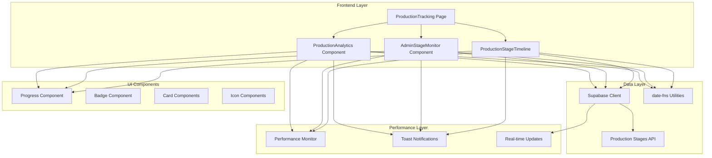
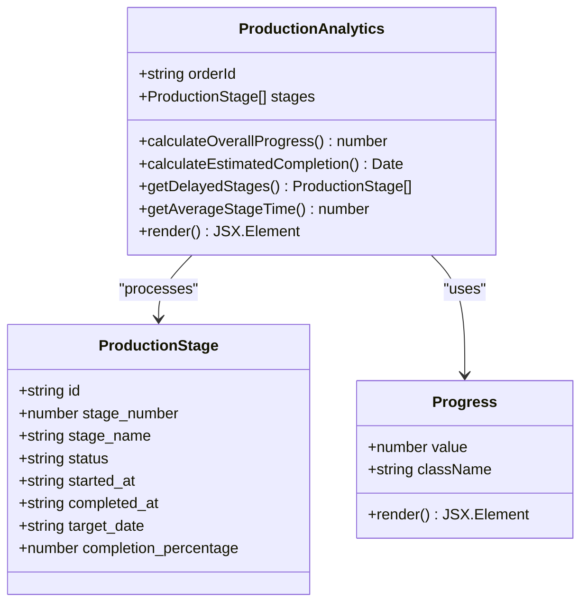
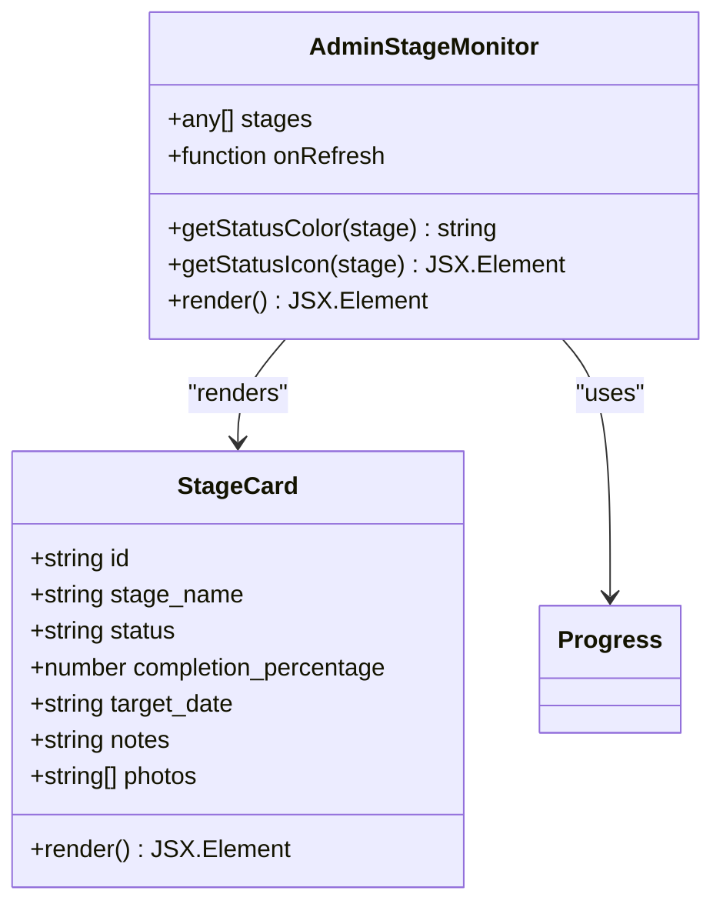
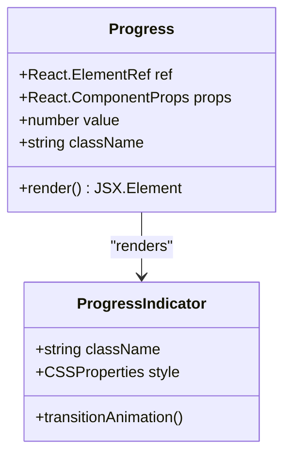
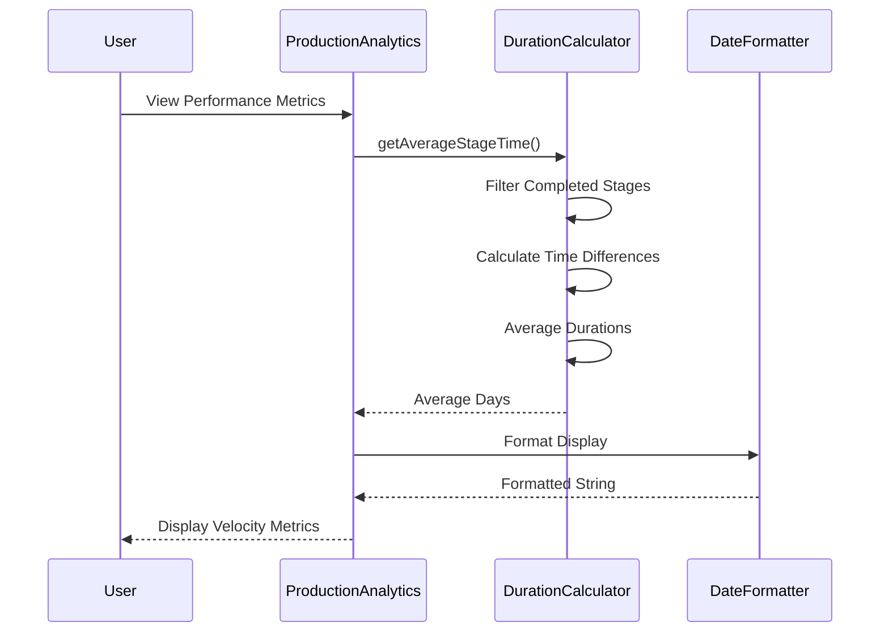
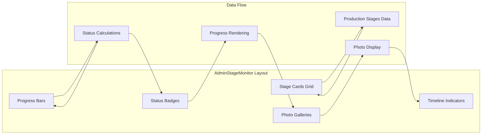
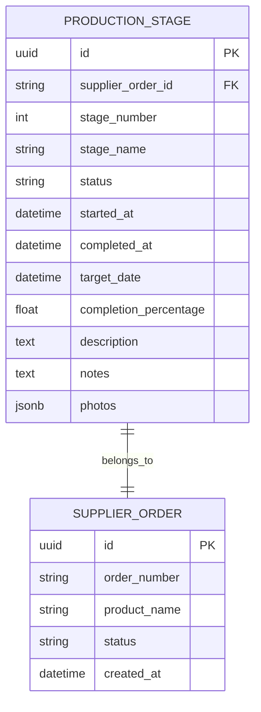
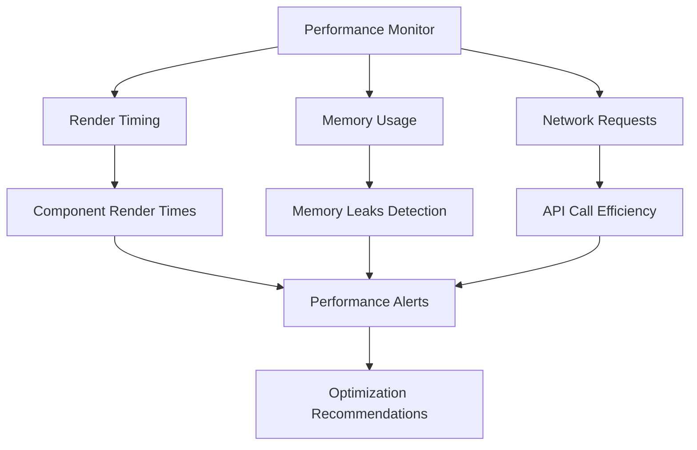
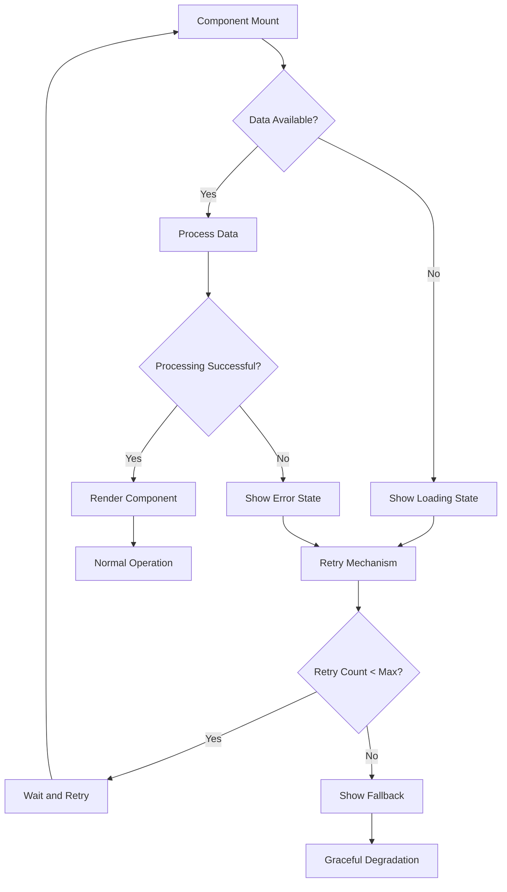

# Production Analytics Dashboard

<cite>
**Referenced Files in This Document**
- [ProductionAnalytics.tsx](file://src/components/production/ProductionAnalytics.tsx)
- [AdminStageMonitor.tsx](file://src/components/admin/AdminStageMonitor.tsx)
- [ProductionStageTimeline.tsx](file://src/components/production/ProductionStageTimeline.tsx)
- [ProductionTracking.tsx](file://src/pages/ProductionTracking.tsx)
- [AdminAnalytics.tsx](file://src/pages/AdminAnalytics.tsx)
- [progress.tsx](file://src/components/ui/progress.tsx)
- [use-toast.ts](file://src/hooks/use-toast.ts)
- [initialize-production-stages/index.ts](file://supabase/functions/initialize-production-stages/index.ts)
- [performanceMonitor.ts](file://src/lib/performanceMonitor.ts)
- [usePerformance.ts](file://src/hooks/usePerformance.ts)
</cite>

## Table of Contents
1. [Introduction](#introduction)
2. [System Architecture](#system-architecture)
3. [Core Components](#core-components)
4. [Production Stages Data Structure](#production-stages-data-structure)
5. [Overall Progress Calculation](#overall-progress-calculation)
6. [UI Components and Visualizations](#ui-components-and-visualizations)
7. [Integration with Admin Monitoring Tools](#integration-with-admin-monitoring-tools)
8. [Performance Optimization](#performance-optimization)
9. [Error Handling and Troubleshooting](#error-handling-and-troubleshooting)
10. [Best Practices](#best-practices)

## Introduction

The Production Analytics Dashboard is a comprehensive real-time monitoring system designed for RMG (Ready-Made Garment) manufacturing processes. It provides stakeholders with actionable insights into production pipeline performance through sophisticated progress tracking, timeline visualization, and predictive analytics. The system integrates seamlessly with Supabase for data persistence and real-time updates, offering both buyer and supplier perspectives on manufacturing stages.

The dashboard serves multiple roles:
- **Buyer Perspective**: Track order progress and receive delivery estimates
- **Supplier Perspective**: Monitor production stages and manage quality control
- **Admin Perspective**: Oversee entire production ecosystem with comprehensive analytics

## System Architecture

The Production Analytics Dashboard follows a modular React architecture with clear separation of concerns:



**Diagram sources**
- [ProductionTracking.tsx](file://src/pages/ProductionTracking.tsx#L1-L540)
- [ProductionAnalytics.tsx](file://src/components/production/ProductionAnalytics.tsx#L1-L249)
- [AdminStageMonitor.tsx](file://src/components/admin/AdminStageMonitor.tsx#L1-L127)

## Core Components

### ProductionAnalytics Component

The central analytics component that provides comprehensive production insights:



**Diagram sources**
- [ProductionAnalytics.tsx](file://src/components/production/ProductionAnalytics.tsx#L14-L23)
- [progress.tsx](file://src/components/ui/progress.tsx#L6-L24)

### AdminStageMonitor Component

Grid-based monitoring interface for administrators:



**Diagram sources**
- [AdminStageMonitor.tsx](file://src/components/admin/AdminStageMonitor.tsx#L7-L127)

**Section sources**
- [ProductionAnalytics.tsx](file://src/components/production/ProductionAnalytics.tsx#L30-L249)
- [AdminStageMonitor.tsx](file://src/components/admin/AdminStageMonitor.tsx#L12-L127)

## Production Stages Data Structure

The production stages follow a standardized structure that enables consistent tracking across all manufacturing processes:

| Field | Type | Description | Validation |
|-------|------|-------------|------------|
| `id` | string | Unique identifier for the stage | Required, UUID format |
| `stage_number` | number | Sequential stage identifier (1-8) | Required, integer, 1-8 range |
| `stage_name` | string | Descriptive name of the manufacturing stage | Required, max 100 characters |
| `status` | string | Current stage status | Required, enum: 'not_started', 'in_progress', 'completed' |
| `started_at` | string \| null | ISO formatted start timestamp | Optional, datetime format |
| `completed_at` | string \| null | ISO formatted completion timestamp | Optional, datetime format |
| `target_date` | string \| null | Expected completion date | Optional, date format |
| `completion_percentage` | number \| null | Progress completion percentage | Optional, 0-100 range |
| `description` | string | Detailed stage description | Optional, max 500 characters |
| `notes` | string | Latest update or comments | Optional, max 1000 characters |
| `photos` | string[] | Array of photo URLs | Optional, URL validation |

**Section sources**
- [ProductionAnalytics.tsx](file://src/components/production/ProductionAnalytics.tsx#L14-L23)
- [AdminStageMonitor.tsx](file://src/components/admin/AdminStageMonitor.tsx#L7-L8)

## Overall Progress Calculation

The system implements a sophisticated progress calculation algorithm that combines completed stages with in-progress completion percentages:

### Calculation Methodology

```mermaid
flowchart TD
Start([Calculate Overall Progress]) --> CheckEmpty{"Stages Empty?"}
CheckEmpty --> |Yes| ReturnZero[Return 0%]
CheckEmpty --> |No| CountStages[Count Completed + In-Progress Stages]
CountStages --> CalcCompleted[Add 100% for each completed stage]
CalcCompleted --> IterateInProgress[Iterate Through In-Progress Stages]
IterateInProgress --> AddPercentage[Add Completion Percentage]
AddPercentage --> DivideByEight[Divide by 8 (Total Stages)]
DivideByEight --> RoundResult[Round to Nearest Integer]
RoundResult --> ReturnProgress[Return Overall Progress]
ReturnZero --> End([End])
ReturnProgress --> End
```

**Diagram sources**
- [ProductionAnalytics.tsx](file://src/components/production/ProductionAnalytics.tsx#L31-L44)

### Implementation Details

The progress calculation follows these key principles:

1. **Completed Stages**: Each fully completed stage contributes 100% to the overall progress
2. **In-Progress Stages**: Partially completed stages contribute their percentage completion
3. **Normalization**: Total progress is normalized against 8 stages (constant)
4. **Precision**: Results are rounded to whole numbers for readability

**Section sources**
- [ProductionAnalytics.tsx](file://src/components/production/ProductionAnalytics.tsx#L31-L44)

## UI Components and Visualizations

### Progress Components

The system utilizes Radix UI's Progress primitive for consistent visual feedback:



**Diagram sources**
- [progress.tsx](file://src/components/ui/progress.tsx#L6-L24)

### Iconography and Status Indicators

The dashboard employs a comprehensive icon system for visual communication:

| Status | Icon | Color | Meaning |
|--------|------|-------|---------|
| Completed | CheckCircle2 | Green (#10B981) | Stage finished successfully |
| In Progress | Clock | Blue (#3B82F6) | Active production stage |
| Pending | AlertCircle | Gray (#6B7280) | Stage awaiting start |
| Delayed | AlertTriangle | Red (#EF4444) | Missed deadlines |

### Velocity Tracking

Velocity tracking is implemented through average stage duration calculations:



**Diagram sources**
- [ProductionAnalytics.tsx](file://src/components/production/ProductionAnalytics.tsx#L68-L87)

**Section sources**
- [progress.tsx](file://src/components/ui/progress.tsx#L1-L24)
- [ProductionAnalytics.tsx](file://src/components/production/ProductionAnalytics.tsx#L101-L249)

## Integration with Admin Monitoring Tools

### AdminStageMonitor Grid View

The AdminStageMonitor provides a comprehensive grid view of all production stages:



**Diagram sources**
- [AdminStageMonitor.tsx](file://src/components/admin/AdminStageMonitor.tsx#L36-L127)

### Shared Data Structure

Both components consume the same production_stages data structure, ensuring consistency:



**Diagram sources**
- [ProductionAnalytics.tsx](file://src/components/production/ProductionAnalytics.tsx#L14-L23)
- [AdminStageMonitor.tsx](file://src/components/admin/AdminStageMonitor.tsx#L7-L8)

**Section sources**
- [AdminStageMonitor.tsx](file://src/components/admin/AdminStageMonitor.tsx#L12-L127)
- [ProductionAnalytics.tsx](file://src/components/production/ProductionAnalytics.tsx#L25-L28)

## Performance Optimization

### Memoization Strategies

The system implements several performance optimization techniques:

1. **Date Formatting Optimization**: Uses date-fns for efficient date manipulation
2. **Component Memoization**: Critical calculations are cached
3. **Real-time Subscription Management**: Proper cleanup prevents memory leaks
4. **Conditional Rendering**: Components render only when data changes

### Performance Monitoring



**Diagram sources**
- [performanceMonitor.ts](file://src/lib/performanceMonitor.ts#L127-L194)

### Date-Fns Integration

The system leverages date-fns for optimal date formatting performance:

| Function | Purpose | Performance Benefit |
|----------|---------|-------------------|
| `format()` | Date formatting | Efficient parsing and caching |
| `differenceInDays()` | Duration calculations | Optimized arithmetic operations |
| `parseISO()` | Date parsing | Minimal allocation overhead |

**Section sources**
- [performanceMonitor.ts](file://src/lib/performanceMonitor.ts#L127-L194)
- [ProductionAnalytics.tsx](file://src/components/production/ProductionAnalytics.tsx#L12-L13)

## Error Handling and Troubleshooting

### Common Issues and Solutions

#### Inaccurate Progress Calculations

**Symptoms**: Progress percentages don't match expected values
**Causes**: 
- Null completion_percentage values
- Incorrect stage status assignments
- Data synchronization delays

**Solutions**:
1. Validate stage data before calculations
2. Implement fallback values for null percentages
3. Add data integrity checks

#### Missing Metrics Display

**Symptoms**: Empty or missing performance metrics
**Causes**:
- Insufficient completed stages
- Date parsing errors
- Network connectivity issues

**Solutions**:
1. Implement graceful degradation
2. Add loading states
3. Provide default values

#### Real-time Update Failures

**Symptoms**: Stale data not updating automatically
**Causes**:
- WebSocket disconnections
- Subscription cleanup issues
- Authentication timeouts

**Solutions**:
1. Implement automatic reconnection
2. Add subscription health checks
3. Enhance error recovery mechanisms

### Error Boundaries and Recovery



**Section sources**
- [ProductionAnalytics.tsx](file://src/components/production/ProductionAnalytics.tsx#L89-L96)
- [AdminStageMonitor.tsx](file://src/components/admin/AdminStageMonitor.tsx#L25-L31)

## Best Practices

### Data Management

1. **Immutable Updates**: Always create new stage arrays rather than mutating existing ones
2. **Validation**: Implement comprehensive data validation for incoming stage data
3. **Type Safety**: Use TypeScript interfaces for strict type checking
4. **Default Values**: Provide sensible defaults for optional fields

### User Experience

1. **Progressive Enhancement**: Ensure core functionality works without JavaScript
2. **Accessibility**: Implement proper ARIA labels and keyboard navigation
3. **Responsive Design**: Ensure mobile-friendly layouts
4. **Loading States**: Provide clear feedback during data operations

### Performance Guidelines

1. **Efficient Rendering**: Minimize re-renders through proper state management
2. **Memory Management**: Clean up subscriptions and event listeners
3. **Bundle Optimization**: Use code splitting for large components
4. **Caching Strategies**: Implement appropriate caching for frequently accessed data

### Security Considerations

1. **Input Sanitization**: Validate all user inputs
2. **Access Control**: Implement role-based permissions
3. **Data Encryption**: Secure sensitive production data
4. **Audit Logging**: Track all production stage modifications