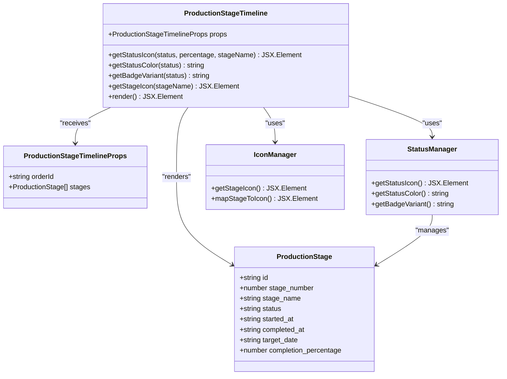
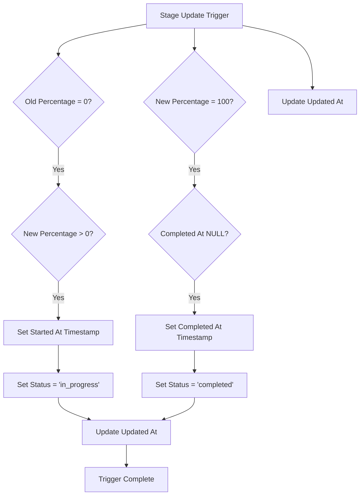
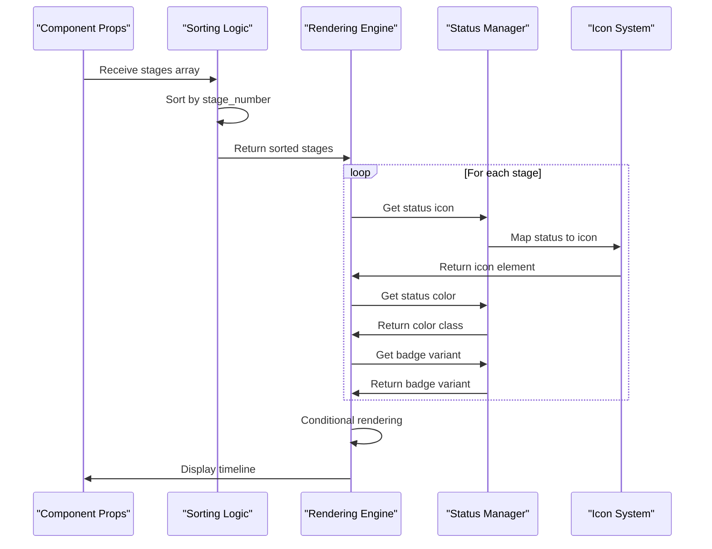
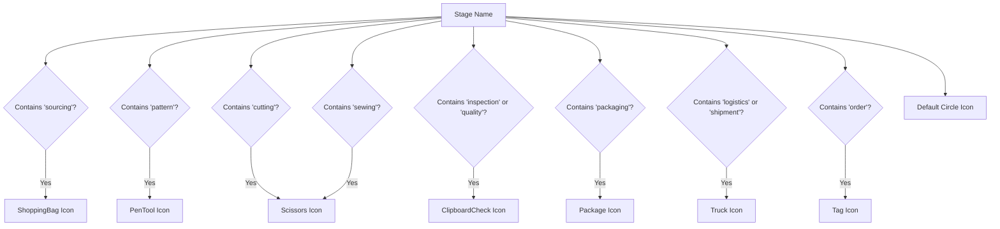
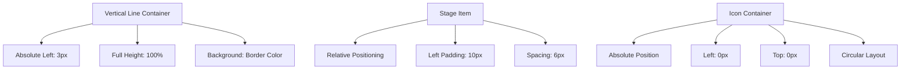
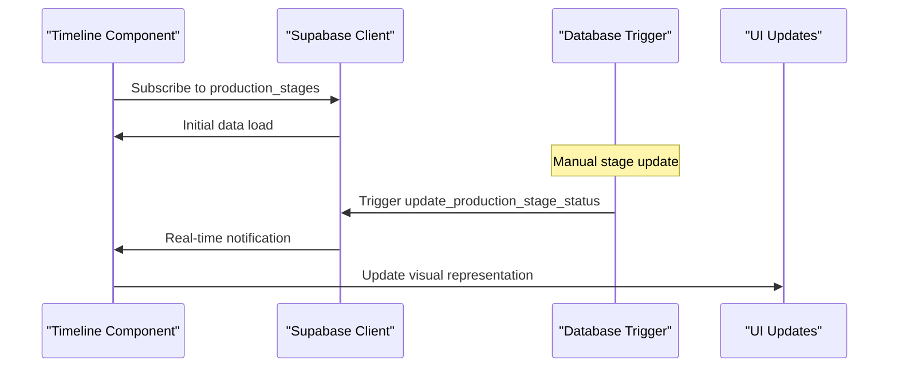
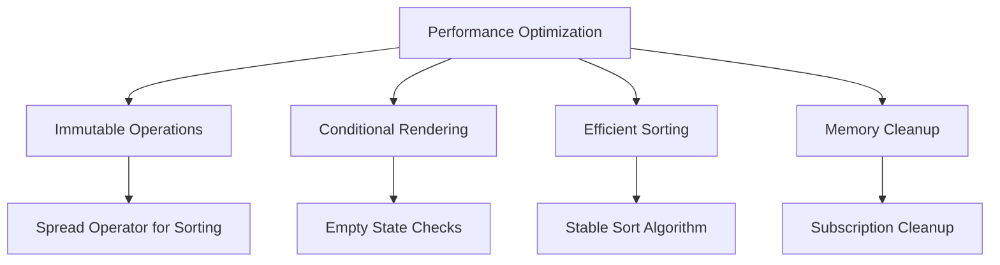

# Production Stage Timeline

<cite>
**Referenced Files in This Document**
- [ProductionStageTimeline.tsx](file://src/components/production/ProductionStageTimeline.tsx)
- [20251116120215_71189c74-c2d3-4f3e-a1af-87d7e6b5f8fa.sql](file://supabase/migrations/20251116120215_71189c74-c2d3-4f3e-a1af-87d7e6b5f8fa.sql)
- [database.ts](file://src/types/database.ts)
- [ProductionTracking.tsx](file://src/pages/ProductionTracking.tsx)
- [AdminStageMonitor.tsx](file://src/components/admin/AdminStageMonitor.tsx)
- [ProductionStageManager.tsx](file://src/components/supplier/ProductionStageManager.tsx)
- [useOptimisticStageUpdate.ts](file://src/hooks/useOptimisticUpdate.ts)
- [20250123000000_relax_production_stages.sql](file://supabase/migrations/20250123000000_relax_production_stages.sql)
</cite>

## Table of Contents
1. [Introduction](#introduction)
2. [Component Architecture](#component-architecture)
3. [Database Schema and Triggers](#database-schema-and-triggers)
4. [Component Implementation](#component-implementation)
5. [Status Management System](#status-management-system)
6. [Visual Design and Styling](#visual-design-and-styling)
7. [Integration Patterns](#integration-patterns)
8. [Performance Optimization](#performance-optimization)
9. [Troubleshooting Guide](#troubleshooting-guide)
10. [Best Practices](#best-practices)

## Introduction

The Production Stage Timeline component is a sophisticated React component that visualizes the eight-stage manufacturing process in a vertical timeline format. It provides real-time status updates, progress tracking, and comprehensive production stage management capabilities for apparel manufacturing workflows. The component integrates seamlessly with Supabase for data persistence and real-time updates, offering both buyer and supplier perspectives on production progress.

The timeline serves as a central hub for monitoring production stages, displaying completion percentages, timestamps, and status indicators while maintaining responsive design principles across all device sizes.

## Component Architecture

The Production Stage Timeline follows a modular architecture pattern with clear separation of concerns:

**Diagram sources**
- [ProductionStageTimeline.tsx](file://src/components/production/ProductionStageTimeline.tsx#L6-L183)

**Section sources**
- [ProductionStageTimeline.tsx](file://src/components/production/ProductionStageTimeline.tsx#L17-L20)

## Database Schema and Triggers

The production stages are stored in the `production_stages` table with comprehensive schema design supporting the timeline visualization:

### Table Structure

| Column | Type | Description | Constraints |
|--------|------|-------------|-------------|
| `id` | UUID | Unique identifier | PRIMARY KEY |
| `supplier_order_id` | UUID | Associated supplier order | FOREIGN KEY |
| `stage_number` | INTEGER | Sequential stage identifier | NOT NULL |
| `stage_name` | TEXT | Human-readable stage name | NOT NULL |
| `status` | TEXT | Current stage status | NOT NULL |
| `started_at` | TIMESTAMP WITH TIME ZONE | Stage start timestamp | NULLABLE |
| `completed_at` | TIMESTAMP WITH TIME ZONE | Stage completion timestamp | NULLABLE |
| `target_date` | DATE | Expected completion date | NULLABLE |
| `completion_percentage` | INTEGER | Progress percentage (0-100) | DEFAULT 0 |
| `description` | TEXT | Stage description | NULLABLE |
| `notes` | TEXT | Additional notes | NULLABLE |
| `updated_at` | TIMESTAMP WITH TIME ZONE | Last modification timestamp | AUTO-UPDATE |

### Trigger Implementation

The `update_production_stage_status` trigger automatically manages stage lifecycle events:

**Diagram sources**
- [20251116120215_71189c74-c2d3-4f3e-a1af-87d7e6b5f8fa.sql](file://supabase/migrations/20251116120215_71189c74-c2d3-4f3e-a1af-87d7e6b5f8fa.sql#L52-L74)

**Section sources**
- [20251116120215_71189c74-c2d3-4f3e-a1af-87d7e6b5f8fa.sql](file://supabase/migrations/20251116120215_71189c74-c2d3-4f3e-a1af-87d7e6b5f8fa.sql#L52-L74)

## Component Implementation

### Core Rendering Logic

The component implements a sophisticated rendering system that handles various state conditions and visual presentations:

**Diagram sources**
- [ProductionStageTimeline.tsx](file://src/components/production/ProductionStageTimeline.tsx#L75-L183)

### Sorting Mechanism

The component implements a robust sorting mechanism that ensures stages appear in logical order:

**Section sources**
- [ProductionStageTimeline.tsx](file://src/components/production/ProductionStageTimeline.tsx#L75-L77)

### Conditional Rendering

The component handles multiple rendering scenarios:

1. **Empty State**: Displays informative message when no stages exist
2. **Loading State**: Shows skeleton loading indicators during data fetch
3. **Complete State**: Renders full timeline with all stage details
4. **Error State**: Handles data fetching errors gracefully

**Section sources**
- [ProductionStageTimeline.tsx](file://src/components/production/ProductionStageTimeline.tsx#L90-L94)

## Status Management System

### Status Variants and Visual Indicators

The component supports four primary status states with corresponding visual treatments:

| Status | Color | Icon | Animation | Description |
|--------|-------|------|-----------|-------------|
| `completed` | Green | CheckCircle2 | Static | Stage finished successfully |
| `in_progress` | Blue | Pulse animation | Animated | Active production stage |
| `delayed` | Red | AlertTriangle | Static | Stage experiencing delays |
| `pending` | Gray | Circle | Static | Stage not yet started |

### Status Icon Mapping

The component uses intelligent icon mapping based on stage names:

**Diagram sources**
- [ProductionStageTimeline.tsx](file://src/components/production/ProductionStageTimeline.tsx#L23-L33)

**Section sources**
- [ProductionStageTimeline.tsx](file://src/components/production/ProductionStageTimeline.tsx#L23-L33)

## Visual Design and Styling

### Absolute Positioning System

The timeline uses absolute positioning for connecting lines and layout consistency:

**Diagram sources**
- [ProductionStageTimeline.tsx](file://src/components/production/ProductionStageTimeline.tsx#L84-L102)

### Badge Variants and Color Schemes

The component implements a comprehensive badge system with semantic color coding:

**Section sources**
- [ProductionStageTimeline.tsx](file://src/components/production/ProductionStageTimeline.tsx#L66-L73)

### Responsive Design Implementation

The timeline adapts to various screen sizes while maintaining visual hierarchy and readability across all devices.

## Integration Patterns

### Supabase Real-Time Integration

The component integrates with Supabase for real-time data synchronization:

**Diagram sources**
- [ProductionTracking.tsx](file://src/pages/ProductionTracking.tsx#L66-L89)

### Optimistic Updates

The component leverages optimistic updates for improved user experience:

**Section sources**
- [useOptimisticStageUpdate.ts](file://src/hooks/useOptimisticUpdate.ts#L79-L126)

### Data Fetching Patterns

The component supports multiple data fetching strategies:

1. **Direct Prop Passing**: Stages passed as props from parent components
2. **Real-time Subscriptions**: Live data updates via Supabase channels
3. **Local State Management**: Optimistic updates with fallback mechanisms

**Section sources**
- [ProductionTracking.tsx](file://src/pages/ProductionTracking.tsx#L476-L478)

## Performance Optimization

### Efficient State Updates

The component implements several performance optimization techniques:

1. **Immutable Sorting**: Uses spread operator for safe array sorting
2. **Conditional Rendering**: Minimizes DOM operations through smart conditionals
3. **Memoization Opportunities**: Ready for React.memo integration
4. **Efficient Re-renders**: Minimal re-rendering through proper prop comparison

### Memory Management

The component handles memory efficiently through:

- Proper cleanup of real-time subscriptions
- Minimal state mutations
- Efficient event handler binding
- Optimized icon rendering

### Rendering Optimization Techniques

**Section sources**
- [ProductionStageTimeline.tsx](file://src/components/production/ProductionStageTimeline.tsx#L75-L77)

## Troubleshooting Guide

### Common Issues and Solutions

#### Timeline Rendering Failures

**Problem**: Timeline not displaying stages correctly
**Causes**:
- Incorrect stage data structure
- Missing required props
- Sorting algorithm failures

**Solutions**:
1. Verify stage data structure matches interface definition
2. Check prop passing from parent components
3. Validate stage_number values are sequential integers

#### Stage Ordering Issues

**Problem**: Stages appearing out of order
**Cause**: Improper sorting implementation

**Solution**: Ensure stage_number values are properly indexed and consecutive

#### Status Indicator Problems

**Problem**: Incorrect status icons or colors
**Causes**:
- Status value mismatches
- Missing status mapping
- Icon library issues

**Solutions**:
1. Verify status values match expected enum values
2. Check icon mapping logic for edge cases
3. Ensure Lucide icons are properly imported

#### Real-Time Update Failures

**Problem**: Timeline not updating in real-time
**Causes**:
- Subscription failures
- Trigger execution issues
- Network connectivity problems

**Solutions**:
1. Verify Supabase connection and authentication
2. Check database trigger permissions
3. Monitor network requests for errors

### Debugging Techniques

1. **Console Logging**: Add logging to track stage data flow
2. **Prop Validation**: Implement PropTypes or TypeScript validation
3. **State Inspection**: Use React DevTools for state debugging
4. **Network Monitoring**: Check Supabase subscription status

**Section sources**
- [ProductionTracking.tsx](file://src/pages/ProductionTracking.tsx#L66-L89)

## Best Practices

### Component Usage Guidelines

1. **Data Validation**: Always validate incoming stage data
2. **Error Boundaries**: Implement error boundaries for graceful degradation
3. **Loading States**: Provide appropriate loading indicators
4. **Accessibility**: Ensure proper ARIA labels and keyboard navigation

### Performance Recommendations

1. **Memoization**: Consider React.memo for parent components
2. **Virtualization**: Implement virtual scrolling for large datasets
3. **Lazy Loading**: Load additional stage details on demand
4. **Optimized Queries**: Use selective field queries in Supabase

### Maintenance Guidelines

1. **Type Safety**: Maintain strict TypeScript typing
2. **Documentation**: Keep component documentation updated
3. **Testing**: Implement comprehensive unit tests
4. **Version Control**: Follow semantic versioning for changes

### Extension Patterns

The component supports extension through:

- Custom status handlers
- Additional icon mappings
- Modified styling systems
- Enhanced real-time capabilities

**Section sources**
- [ProductionStageTimeline.tsx](file://src/components/production/ProductionStageTimeline.tsx#L1-L183)