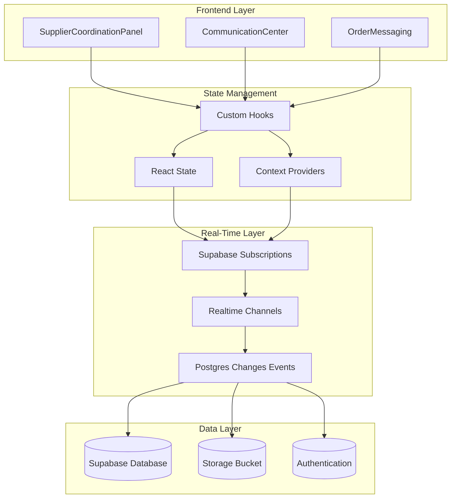
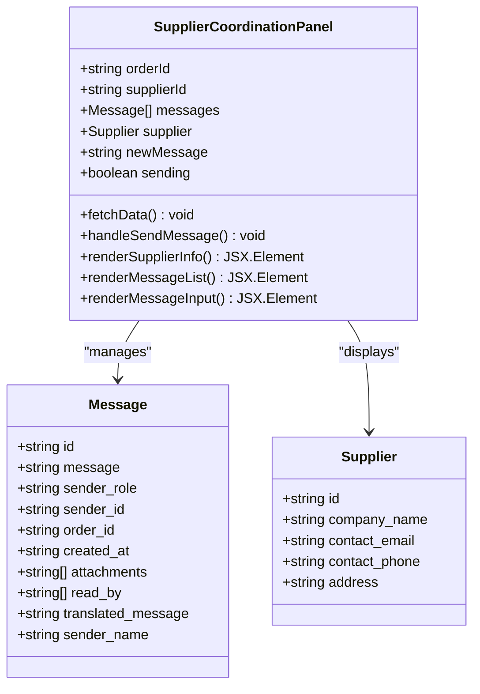
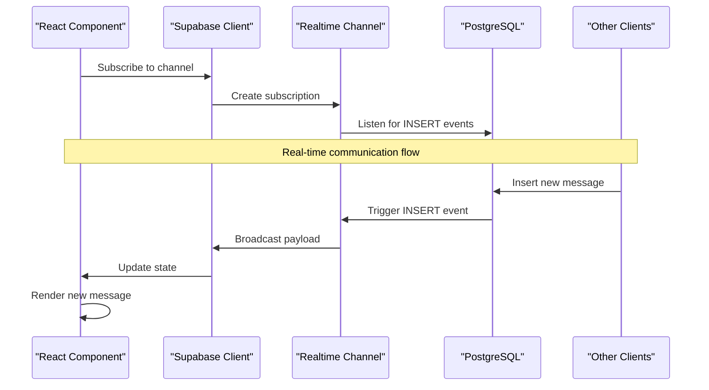
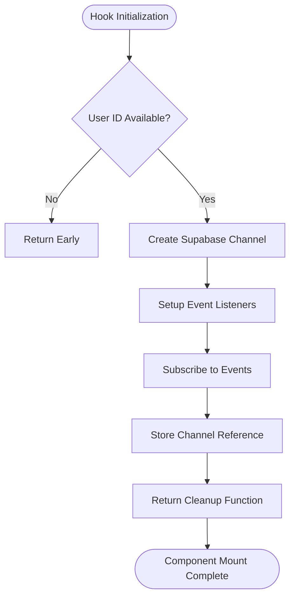
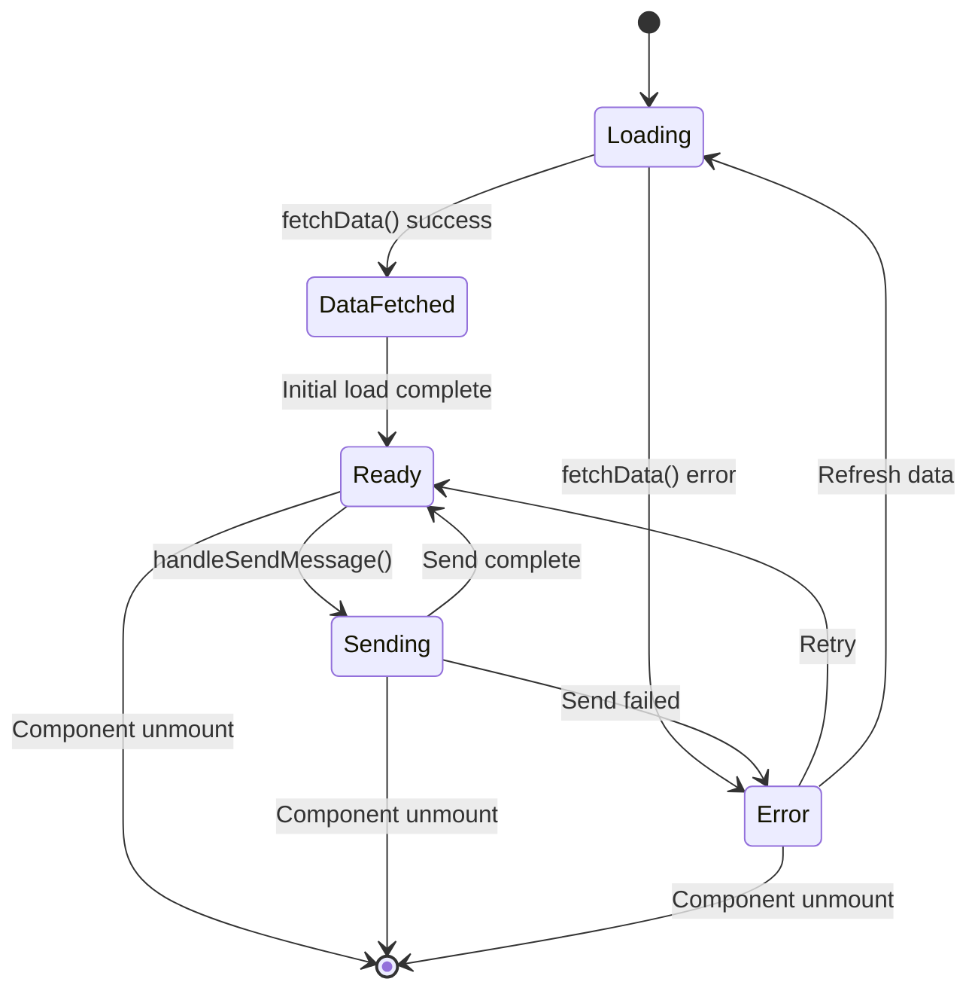

# Supplier Coordination Panel

<cite>
**Referenced Files in This Document**
- [SupplierCoordinationPanel.tsx](file://src/components/production/SupplierCoordinationPanel.tsx)
- [useRealtimeMessages.ts](file://src/hooks/useRealtimeMessages.ts)
- [CommunicationCenter.tsx](file://src/components/shared/CommunicationCenter.tsx)
- [OrderMessaging.tsx](file://src/components/OrderMessaging.tsx)
- [OrderMessaging.tsx](file://src/components/supplier/OrderMessaging.tsx)
- [client.ts](file://src/integrations/supabase/client.ts)
- [types.ts](file://src/integrations/supabase/types.ts)
- [supabaseHelpers.ts](file://src/lib/supabaseHelpers.ts)
- [ProductionTracking.tsx](file://src/pages/ProductionTracking.tsx)
</cite>

## Table of Contents
1. [Introduction](#introduction)
2. [System Architecture](#system-architecture)
3. [Core Components](#core-components)
4. [Real-Time Messaging Implementation](#real-time-messaging-implementation)
5. [UI Component Structure](#ui-component-structure)
6. [Database Schema](#database-schema)
7. [State Management](#state-management)
8. [Performance Optimization](#performance-optimization)
9. [Troubleshooting Guide](#troubleshooting-guide)
10. [Best Practices](#best-practices)

## Introduction

The Supplier Coordination Panel is a comprehensive real-time messaging system designed to facilitate seamless communication between buyers and suppliers during production processes. Built on React with Supabase's real-time capabilities, this system enables instant message delivery, attachment support, and synchronized message history across multiple stakeholders in the supply chain.

The panel serves as a centralized hub for order-related communications, providing both buyer-supplier coordination and broader team collaboration features. It integrates with the larger production tracking system to offer contextual messaging tied to specific orders and production stages.

## System Architecture

The Supplier Coordination Panel follows a layered architecture that separates concerns between presentation, business logic, and data persistence:



**Diagram sources**
- [SupplierCoordinationPanel.tsx](file://src/components/production/SupplierCoordinationPanel.tsx#L37-L256)
- [useRealtimeMessages.ts](file://src/hooks/useRealtimeMessages.ts#L17-L61)
- [client.ts](file://src/integrations/supabase/client.ts#L14-L20)

## Core Components

### SupplierCoordinationPanel Component

The main component serves as the primary interface for buyer-supplier communication, featuring:

- **Supplier Information Display**: Complete supplier contact details including company name, email, phone, and physical address
- **Message History**: Chronological display of all communications with sender identification and timestamps
- **Real-Time Messaging**: Instant message delivery and receipt acknowledgment
- **Attachment Support**: File upload capabilities with preview functionality
- **Responsive Design**: Adaptive layout for various screen sizes



**Diagram sources**
- [SupplierCoordinationPanel.tsx](file://src/components/production/SupplierCoordinationPanel.tsx#L11-L35)

**Section sources**
- [SupplierCoordinationPanel.tsx](file://src/components/production/SupplierCoordinationPanel.tsx#L37-L256)

### CommunicationCenter Component

A more comprehensive messaging solution that supports broader communication needs:

- **Multi-User Messaging**: Supports conversations between admins, buyers, and suppliers
- **Search Functionality**: Message filtering and search capabilities
- **File Attachments**: Support for multiple file types with upload progress tracking
- **Read Receipts**: Message status tracking and read acknowledgments

**Section sources**
- [CommunicationCenter.tsx](file://src/components/shared/CommunicationCenter.tsx#L28-L451)

### OrderMessaging Components

Specialized messaging components for order-specific communications:

- **Production Tracking Integration**: Messages tied to specific production stages
- **Role-Based Display**: Differentiated messaging based on user roles
- **Avatar System**: Visual identification through role-based avatars

**Section sources**
- [OrderMessaging.tsx](file://src/components/OrderMessaging.tsx#L24-L217)
- [OrderMessaging.tsx](file://src/components/supplier/OrderMessaging.tsx#L16-L136)

## Real-Time Messaging Implementation

### Supabase Real-Time Subscriptions

The system leverages Supabase's real-time capabilities to provide instant message delivery:



**Diagram sources**
- [SupplierCoordinationPanel.tsx](file://src/components/production/SupplierCoordinationPanel.tsx#L45-L67)
- [useRealtimeMessages.ts](file://src/hooks/useRealtimeMessages.ts#L23-L57)

### Subscription Management

The system implements robust subscription lifecycle management:

```typescript
// Example subscription setup from SupplierCoordinationPanel
const channel = supabase
  .channel(`order-messages-${orderId}`)
  .on(
    'postgres_changes',
    {
      event: 'INSERT',
      schema: 'public',
      table: 'order_messages',
      filter: `order_id=eq.${orderId}`
    },
    (payload) => {
      setMessages(prev => [...prev, payload.new as Message]);
    }
  )
  .subscribe();

// Cleanup on component unmount
return () => {
  supabase.removeChannel(channel);
};
```

**Section sources**
- [SupplierCoordinationPanel.tsx](file://src/components/production/SupplierCoordinationPanel.tsx#L45-L67)
- [useRealtimeMessages.ts](file://src/hooks/useRealtimeMessages.ts#L23-L57)

### Custom Hook for Real-Time Messages

The `useRealtimeMessages` hook provides reusable real-time functionality:



**Diagram sources**
- [useRealtimeMessages.ts](file://src/hooks/useRealtimeMessages.ts#L20-L58)

**Section sources**
- [useRealtimeMessages.ts](file://src/hooks/useRealtimeMessages.ts#L17-L61)

## UI Component Structure

### Supplier Information Card

Displays comprehensive supplier contact information with intuitive icons and links:

- **Company Name**: Primary identification with visual emphasis
- **Contact Details**: Email and phone number with clickable links
- **Physical Address**: Location information with map pin icon
- **Responsive Layout**: Adapts to mobile and desktop screens

### Message List Component

Renders conversation history with visual differentiation:

- **Sender Identification**: Clear indication of message origin
- **Timestamp Display**: Formatted time stamps for context
- **Message Styling**: Differentiated appearance based on sender role
- **Empty State**: Graceful handling of no messages scenario

### Message Input Area

Provides intuitive messaging interface:

- **Textarea Input**: Multi-line message composition
- **Character Limit**: Validation for message length
- **Send Button**: Clear action with loading state
- **Disabled States**: Proper handling of sending and empty message states

**Section sources**
- [SupplierCoordinationPanel.tsx](file://src/components/production/SupplierCoordinationPanel.tsx#L140-L256)

## Database Schema

### Order Messages Table

The core messaging infrastructure is built around the `order_messages` table:

| Column | Type | Description | Constraints |
|--------|------|-------------|-------------|
| id | uuid | Unique message identifier | PRIMARY KEY |
| order_id | uuid | Associated order reference | NOT NULL, FOREIGN KEY |
| sender_id | uuid | Message sender identifier | NOT NULL |
| sender_role | text | Sender role designation | NOT NULL |
| message | text | Message content | NOT NULL |
| attachments | text[] | File attachment URLs | NULLABLE |
| translated_message | text | Translated content | NULLABLE |
| read_by | uuid[] | Read receipt tracking | NULLABLE |
| created_at | timestamp | Message creation time | DEFAULT now() |

### Real-Time Event Configuration

The system listens for PostgreSQL changes events to trigger real-time updates:

```sql
-- Example event filter configuration
filter: `order_id=eq.${orderId}`
```

This creates targeted subscriptions that only receive relevant message updates, optimizing bandwidth and performance.

**Section sources**
- [types.ts](file://src/integrations/supabase/types.ts#L1626-L1636)

## State Management

### Component State Architecture

The Supplier Coordination Panel manages multiple state dimensions:



**Diagram sources**
- [SupplierCoordinationPanel.tsx](file://src/components/production/SupplierCoordinationPanel.tsx#L39-L43)

### State Update Patterns

The component implements efficient state updates using functional updates:

```typescript
// Efficient state updates prevent race conditions
setMessages(prev => [...prev, payload.new as Message]);

// Optimistic updates for immediate feedback
setNewMessage("");
```

### Memory Management

Proper cleanup prevents memory leaks and ensures optimal performance:

```typescript
// Cleanup subscription on component unmount
return () => {
  supabase.removeChannel(channel);
};
```

**Section sources**
- [SupplierCoordinationPanel.tsx](file://src/components/production/SupplierCoordinationPanel.tsx#L65-L67)

## Performance Optimization

### Efficient State Updates

The system implements several performance optimization strategies:

- **Functional State Updates**: Prevents stale state issues
- **Selective Rendering**: Only re-renders affected components
- **Subscription Cleanup**: Prevents memory leaks and unnecessary network calls

### Real-Time Subscription Optimization

- **Targeted Filtering**: Subscriptions only receive relevant messages
- **Channel Lifecycle Management**: Proper subscription creation and cleanup
- **Event Debouncing**: Prevents excessive state updates

### File Upload Optimization

Attachment handling includes performance considerations:

- **Concurrent Uploads**: Parallel file uploads when possible
- **Progress Tracking**: User feedback during upload process
- **Size Validation**: Prevents oversized file uploads
- **Type Restrictions**: Supported file type filtering

**Section sources**
- [CommunicationCenter.tsx](file://src/components/shared/CommunicationCenter.tsx#L134-L169)

## Troubleshooting Guide

### Common Issues and Solutions

#### Message Delivery Failures

**Symptoms**: Messages not appearing in real-time
**Causes**: 
- Network connectivity issues
- Authentication token expiration
- Database connection problems

**Solutions**:
1. Verify internet connection stability
2. Check user authentication status
3. Monitor Supabase dashboard for service status
4. Implement retry logic with exponential backoff

#### Synchronization Problems

**Symptoms**: Messages out of order or missing
**Causes**:
- Race conditions in state updates
- Multiple simultaneous message sends
- Subscription timing issues

**Solutions**:
1. Use functional state updates consistently
2. Implement message queuing for rapid sends
3. Add timestamp validation for message ordering
4. Ensure proper subscription cleanup

#### Real-Time Subscription Issues

**Symptoms**: No real-time updates received
**Causes**:
- Incorrect channel names
- Filter expression errors
- Connection drops

**Solutions**:
1. Verify channel naming convention
2. Test filter expressions in Supabase dashboard
3. Implement automatic reconnection logic
4. Add connection status indicators

### Debugging Tools

#### Console Logging

Enable detailed logging for development:

```typescript
console.log('New message received:', payload);
console.log('Current messages:', messages);
```

#### Supabase Debug Mode

Enable Supabase debug mode for detailed event tracking:

```typescript
const supabase = createClient(SUPABASE_URL, SUPABASE_KEY, {
  realtime: { debug: true }
});
```

#### Network Monitoring

Monitor WebSocket connections and message flow:

```typescript
// Check connection status
const { data: { subscription } } = await supabase
  .from('order_messages')
  .select('*')
  .eq('order_id', orderId);
```

**Section sources**
- [SupplierCoordinationPanel.tsx](file://src/components/production/SupplierCoordinationPanel.tsx#L98-L138)

## Best Practices

### Code Organization

- **Separation of Concerns**: Keep UI, state management, and data logic separate
- **Reusable Hooks**: Extract common functionality into custom hooks
- **Type Safety**: Leverage TypeScript for compile-time error detection
- **Error Boundaries**: Implement proper error handling and user feedback

### Performance Guidelines

- **Efficient State Updates**: Use functional updates and minimize re-renders
- **Subscription Management**: Always clean up subscriptions to prevent memory leaks
- **Optimized Queries**: Use appropriate filters and limits for database queries
- **Debouncing**: Implement debouncing for user input and frequent operations

### Security Considerations

- **Authentication Verification**: Always verify user authentication before operations
- **Authorization Checks**: Ensure users can only access their relevant data
- **Input Validation**: Sanitize and validate all user inputs
- **Rate Limiting**: Implement rate limiting for message sending

### User Experience

- **Loading States**: Provide clear feedback during asynchronous operations
- **Error Handling**: Display meaningful error messages to users
- **Accessibility**: Ensure keyboard navigation and screen reader compatibility
- **Mobile Responsiveness**: Test and optimize for mobile devices

### Testing Strategies

- **Unit Tests**: Test individual components and hooks
- **Integration Tests**: Test real-time subscriptions and database interactions
- **E2E Tests**: Test complete user workflows
- **Performance Tests**: Monitor and optimize performance under load

**Section sources**
- [SupplierCoordinationPanel.tsx](file://src/components/production/SupplierCoordinationPanel.tsx#L1-L256)
- [CommunicationCenter.tsx](file://src/components/shared/CommunicationCenter.tsx#L1-L451)