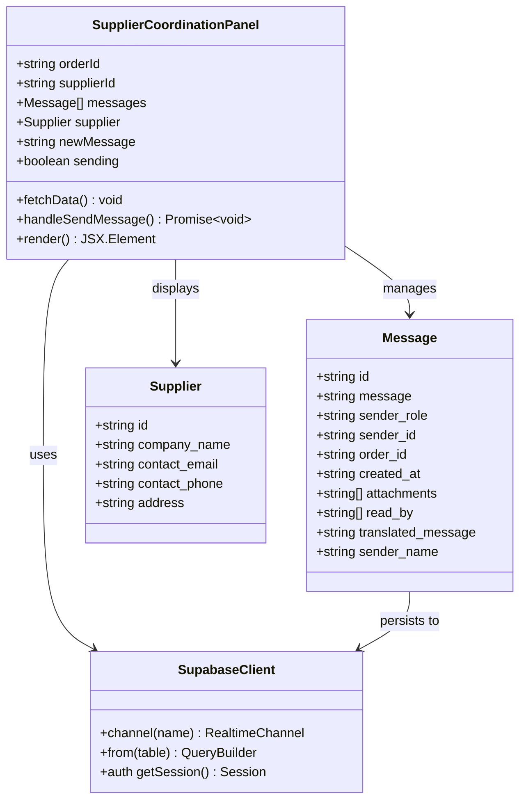
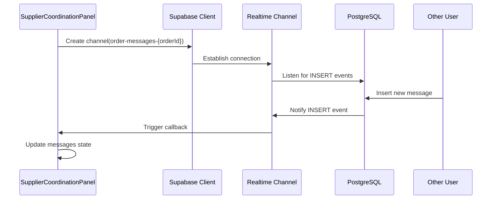
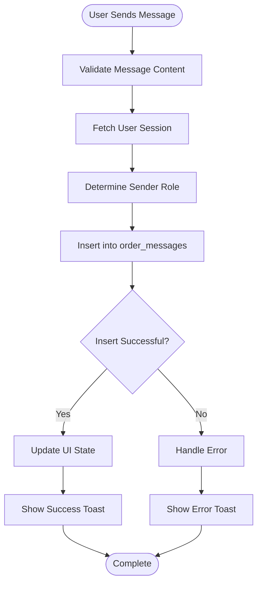
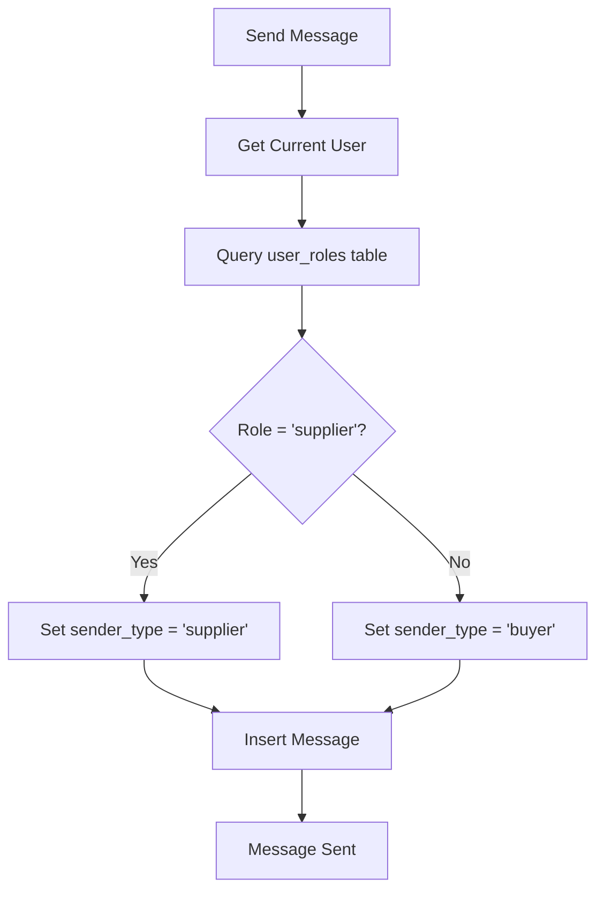
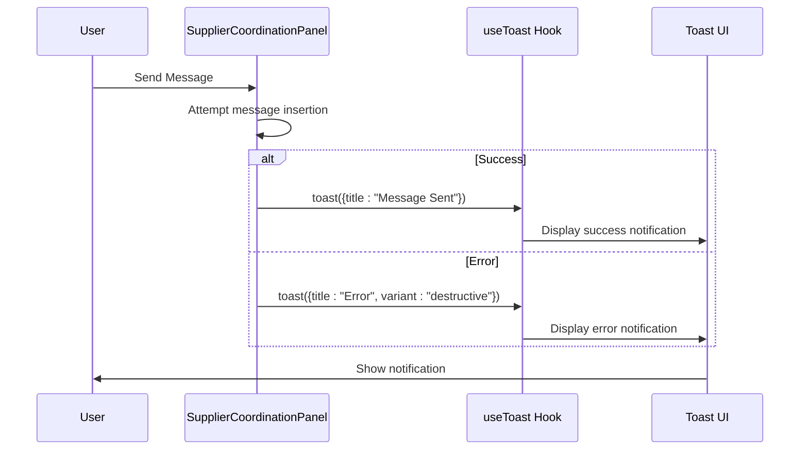

# Supplier Coordination Panel

<cite>
**Referenced Files in This Document**
- [SupplierCoordinationPanel.tsx](file://src/components/production/SupplierCoordinationPanel.tsx)
- [useRealtimeMessages.ts](file://src/hooks/useRealtimeMessages.ts)
- [OrderMessaging.tsx](file://src/components/OrderMessaging.tsx)
- [client.ts](file://src/integrations/supabase/client.ts)
- [types.ts](file://src/integrations/supabase/types.ts)
- [use-toast.ts](file://src/hooks/use-toast.ts)
- [BASE_MIGRATION_SAFE.sql](file://supabase/migrations/20251115150759_remix_migration_from_pg_dump.sql)
- [database.ts](file://src/types/database.ts)
</cite>

## Table of Contents
1. [Introduction](#introduction)
2. [Component Architecture](#component-architecture)
3. [Real-Time Messaging System](#real-time-messaging-system)
4. [Message Persistence](#message-persistence)
5. [Role-Based Sender Identification](#role-based-sender-identification)
6. [Component Props and Integration](#component-props-and-integration)
7. [Toast Notification System](#toast-notification-system)
8. [Common Issues and Solutions](#common-issues-and-solutions)
9. [Implementation Examples](#implementation-examples)
10. [Best Practices](#best-practices)

## Introduction

The SupplierCoordinationPanel component is a sophisticated real-time communication system that enables seamless interaction between buyers and suppliers during production. Built on Supabase's real-time capabilities, it provides instant message delivery, persistent message history, and role-based sender identification to facilitate efficient supply chain coordination.

This component serves as a critical bridge in the production workflow, allowing stakeholders to discuss order details, resolve issues, and coordinate production activities in real-time. The system handles both buyer-to-supplier and supplier-to-buyer communications with automatic role detection and message sorting.

## Component Architecture

The SupplierCoordinationPanel follows a modular architecture that separates concerns between real-time messaging, data persistence, and user interface presentation.



**Diagram sources**
- [SupplierCoordinationPanel.tsx](file://src/components/production/SupplierCoordinationPanel.tsx#L11-L32)
- [client.ts](file://src/integrations/supabase/client.ts#L14-L20)

**Section sources**
- [SupplierCoordinationPanel.tsx](file://src/components/production/SupplierCoordinationPanel.tsx#L1-L256)

## Real-Time Messaging System

The real-time messaging system is built on Supabase's PostgreSQL change data capture (CDC) feature, which provides instant message delivery through WebSocket connections.

### Subscription Implementation

The component establishes real-time subscriptions using the `useEffect` hook, creating a persistent connection to the `order-messages` channel:



**Diagram sources**
- [SupplierCoordinationPanel.tsx](file://src/components/production/SupplierCoordinationPanel.tsx#L45-L67)

The subscription setup includes:

- **Channel Naming**: Uses `order-messages-{orderId}` format for unique channel identification
- **Event Filtering**: Listens only for `INSERT` events on the `order_messages` table
- **Schema Validation**: Targets the `public` schema with specific table filtering
- **Automatic Cleanup**: Removes channels on component unmount to prevent memory leaks

### Message Sorting and Chronological Ordering

Messages are automatically sorted chronologically through Supabase's database ordering:

```typescript
// Database query with chronological ordering
const { data: messagesData } = await supabase
  .from('order_messages')
  .select('*')
  .eq('order_id', orderId)
  .order('created_at', { ascending: true });
```

This ensures that messages appear in the correct temporal sequence, with the oldest messages at the top and newest at the bottom.

**Section sources**
- [SupplierCoordinationPanel.tsx](file://src/components/production/SupplierCoordinationPanel.tsx#L45-L67)
- [SupplierCoordinationPanel.tsx](file://src/components/production/SupplierCoordinationPanel.tsx#L85-L90)

## Message Persistence

The message persistence layer utilizes the `order_messages` table in Supabase, which provides reliable message storage with comprehensive metadata.

### Database Schema Structure

The `order_messages` table maintains essential message attributes:

| Column | Type | Description | Constraints |
|--------|------|-------------|-------------|
| `id` | UUID | Unique message identifier | Primary Key |
| `order_id` | UUID | Associated order reference | Foreign Key, Not Null |
| `sender_id` | UUID | User who sent the message | Not Null |
| `sender_role` | TEXT | Role of sender (buyer/supplier) | Not Null |
| `message` | TEXT | Message content | Not Null |
| `attachments` | TEXT[] | File attachment URLs | Nullable |
| `translated_message` | TEXT | Machine translation | Nullable |
| `read_by` | UUID[] | Users who've read the message | Nullable |
| `created_at` | TIMESTAMP | Message creation time | Default: now() |

### Message Insertion Process

When a user sends a message, the system performs the following steps:



**Diagram sources**
- [SupplierCoordinationPanel.tsx](file://src/components/production/SupplierCoordinationPanel.tsx#L98-L138)

**Section sources**
- [BASE_MIGRATION_SAFE.sql](file://supabase/migrations/20251115150759_remix_migration_from_pg_dump.sql#L1225-L1236)
- [SupplierCoordinationPanel.tsx](file://src/components/production/SupplierCoordinationPanel.tsx#L112-L119)

## Role-Based Sender Identification

The system implements intelligent role detection to automatically identify whether the sender is a buyer or supplier, ensuring appropriate message labeling and routing.

### Role Detection Mechanism

The role detection process involves querying the `user_roles` table to determine the user's current role:



**Diagram sources**
- [SupplierCoordinationPanel.tsx](file://src/components/production/SupplierCoordinationPanel.tsx#L103-L110)

### Supported Roles

The system recognizes four primary roles for communication:

| Role | Description | Access Level | Communication Type |
|------|-------------|--------------|-------------------|
| `buyer` | Retailer/Buyer user | Full order access | Buyer-to-supplier |
| `supplier` | Manufacturing partner | Production visibility | Supplier-to-buyer |
| `admin` | System administrator | Administrative access | System-wide |
| `factory` | Manufacturing facility | Production-specific | Factory-to-supplier |

**Section sources**
- [SupplierCoordinationPanel.tsx](file://src/components/production/SupplierCoordinationPanel.tsx#L103-L110)
- [database.ts](file://src/types/database.ts#L5-L6)

## Component Props and Integration

The SupplierCoordinationPanel accepts two primary props that define its operational context and enable proper integration with the broader application ecosystem.

### Props Definition

```typescript
interface SupplierCoordinationPanelProps {
  orderId: string;        // Unique identifier for the associated order
  supplierId: string;     // Unique identifier for the supplier
}
```

### Integration Patterns

The component integrates seamlessly with several key system components:

#### Authentication Integration
- **User Session**: Automatically retrieves current user from Supabase auth
- **Role Verification**: Validates user permissions for message sending
- **Session Management**: Handles authentication state changes

#### Database Integration
- **Order Context**: Links messages to specific orders via `order_id`
- **Supplier Information**: Fetches and displays supplier contact details
- **Message History**: Retrieves complete message thread for the order

#### Real-Time Integration
- **Channel Management**: Creates isolated channels per order
- **Event Handling**: Processes incoming message events
- **Connection Lifecycle**: Manages subscription lifecycle

**Section sources**
- [SupplierCoordinationPanel.tsx](file://src/components/production/SupplierCoordinationPanel.tsx#L32-L35)

## Toast Notification System

The component leverages Supabase's toast notification system to provide immediate feedback for message operations, enhancing user experience through contextual notifications.

### Notification Types

The system provides three categories of notifications:

| Notification Type | Purpose | Visual Indicator | Duration |
|------------------|---------|------------------|----------|
| Success | Message sent successfully | Green checkmark | 5 seconds |
| Error | Operation failed | Red exclamation | 10 seconds |
| Confirmation | Action acknowledged | Blue info | 3 seconds |

### Implementation Details

The toast system operates through the `useToast` hook, providing centralized notification management:



**Diagram sources**
- [SupplierCoordinationPanel.tsx](file://src/components/production/SupplierCoordinationPanel.tsx#L125-L134)
- [use-toast.ts](file://src/hooks/use-toast.ts#L137-L163)

### Error Handling in Notifications

The system provides comprehensive error handling with user-friendly messages:

- **Network Errors**: Graceful degradation with retry mechanisms
- **Validation Errors**: Specific field-level feedback
- **Permission Errors**: Clear indication of access restrictions
- **System Errors**: Generic fallback messages with support escalation

**Section sources**
- [SupplierCoordinationPanel.tsx](file://src/components/production/SupplierCoordinationPanel.tsx#L125-L134)
- [use-toast.ts](file://src/hooks/use-toast.ts#L1-L186)

## Common Issues and Solutions

Understanding potential issues and their solutions helps maintain system reliability and user satisfaction.

### Subscription Timeout Issues

**Problem**: Real-time subscriptions may timeout due to network instability or server maintenance.

**Solution**: 
- Implement automatic reconnection with exponential backoff
- Monitor connection status and notify users of temporary disruptions
- Use fallback polling mechanisms for critical message delivery

### Message Duplication

**Problem**: Duplicate messages may occur due to network issues or client-side errors.

**Solution**:
- Implement message deduplication using unique message IDs
- Add client-side buffering to prevent rapid duplicate submissions
- Use database constraints to prevent duplicate entries

### Authentication State Changes

**Problem**: User authentication state changes during active conversations.

**Solution**:
- Implement reactive authentication state monitoring
- Gracefully handle session expiration with user prompts
- Preserve message composition state during authentication transitions

### Performance Optimization

**Problem**: Large message histories may impact component performance.

**Solution**:
- Implement virtual scrolling for large message lists
- Paginate message history for older conversations
- Cache frequently accessed supplier information

### Memory Management

**Problem**: Persistent subscriptions may cause memory leaks.

**Solution**:
- Always clean up subscriptions in `useEffect` cleanup functions
- Implement connection pooling for multiple concurrent channels
- Monitor memory usage and implement garbage collection triggers

**Section sources**
- [SupplierCoordinationPanel.tsx](file://src/components/production/SupplierCoordinationPanel.tsx#L65-L67)
- [OrderMessaging.tsx](file://src/components/OrderMessaging.tsx#L79-L81)

## Implementation Examples

### Basic Usage Example

```typescript
// In an order details page
import { SupplierCoordinationPanel } from '@/components/production/SupplierCoordinationPanel';

const OrderDetails = ({ orderId, supplierId }) => {
  return (
    <div className="space-y-4">
      <h2>Order Communication</h2>
      <SupplierCoordinationPanel 
        orderId={orderId} 
        supplierId={supplierId} 
      />
    </div>
  );
};
```

### Advanced Integration Example

```typescript
// With custom message handling
const EnhancedSupplierPanel = ({ orderId, supplierId }) => {
  const handleMessageReceive = useCallback((message) => {
    // Custom logic for handling incoming messages
    console.log('New message:', message);
    // Could trigger custom notifications or analytics
  }, []);

  return (
    <SupplierCoordinationPanel
      orderId={orderId}
      supplierId={supplierId}
      onMessageReceive={handleMessageReceive}
    />
  );
};
```

### Error Boundary Integration

```typescript
// With error boundary for robustness
import { ErrorBoundary } from '@/components/ErrorBoundary';

const RobustSupplierPanel = ({ orderId, supplierId }) => {
  return (
    <ErrorBoundary>
      <SupplierCoordinationPanel 
        orderId={orderId} 
        supplierId={supplierId} 
      />
    </ErrorBoundary>
  );
};
```

## Best Practices

### Security Considerations

1. **Role-Based Access Control**: Always verify user roles before allowing message sending
2. **Input Validation**: Sanitize message content to prevent XSS attacks
3. **Rate Limiting**: Implement message rate limiting to prevent spam
4. **Audit Logging**: Log all message operations for compliance and debugging

### Performance Optimization

1. **Efficient Queries**: Use indexed columns for message retrieval
2. **Connection Management**: Properly manage WebSocket connections
3. **State Optimization**: Minimize unnecessary re-renders
4. **Memory Management**: Clean up resources promptly

### User Experience Guidelines

1. **Immediate Feedback**: Provide instant confirmation for successful operations
2. **Graceful Degradation**: Handle network failures gracefully
3. **Clear Indicators**: Show message status (sent, pending, failed)
4. **Accessibility**: Ensure screen reader compatibility and keyboard navigation

### Monitoring and Maintenance

1. **Connection Health**: Monitor WebSocket connection status
2. **Message Delivery**: Track message delivery confirmations
3. **Performance Metrics**: Monitor response times and error rates
4. **User Analytics**: Track usage patterns and feature adoption

The SupplierCoordinationPanel represents a sophisticated real-time communication system that balances functionality, reliability, and user experience. Its modular architecture and comprehensive error handling make it suitable for production environments while maintaining developer-friendly APIs for customization and extension.