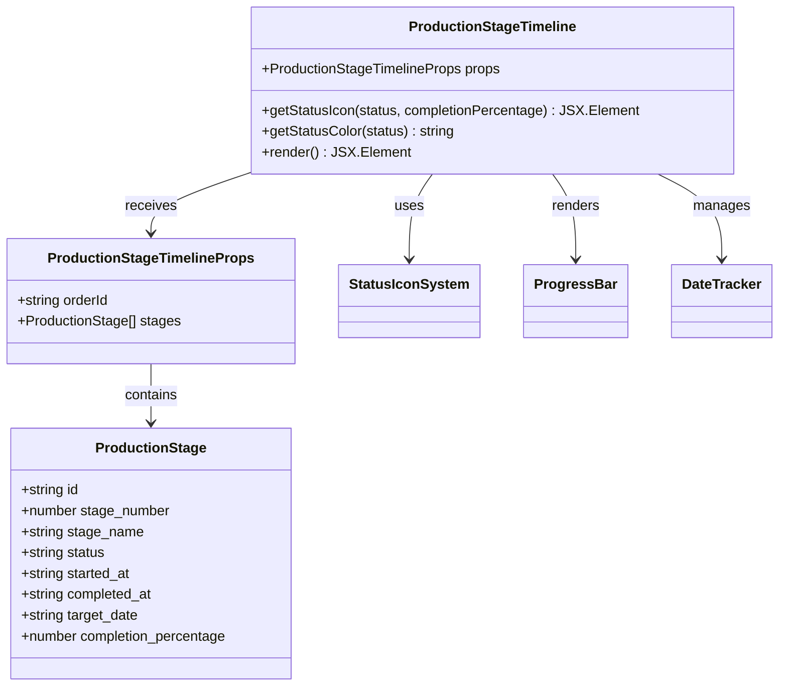
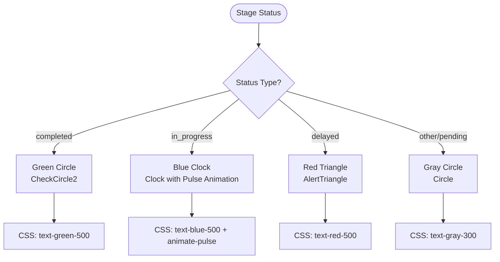
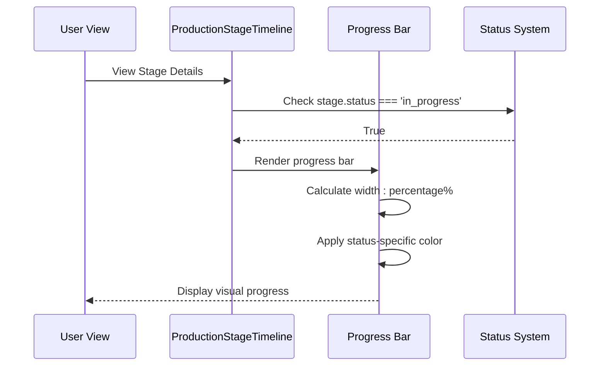
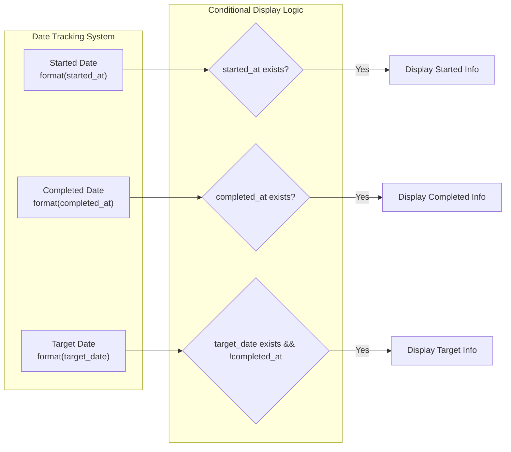
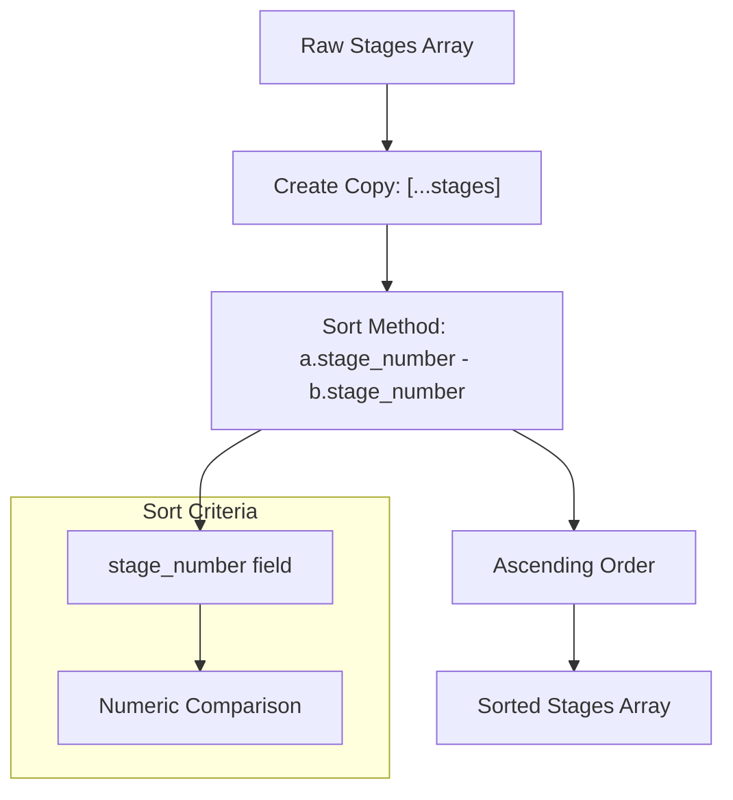
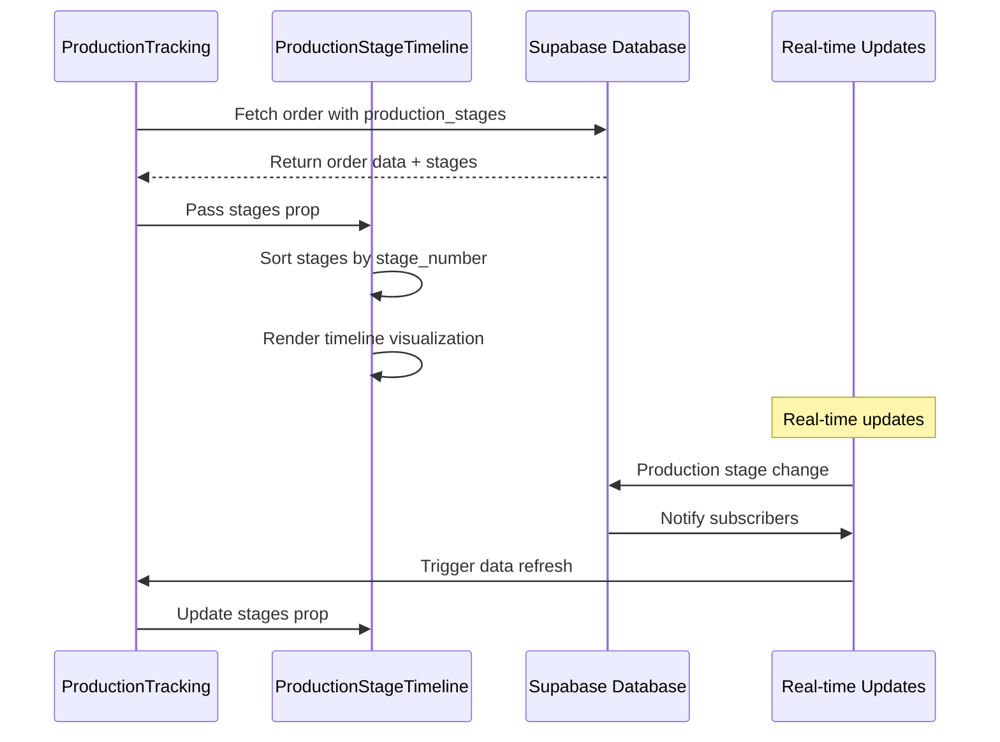
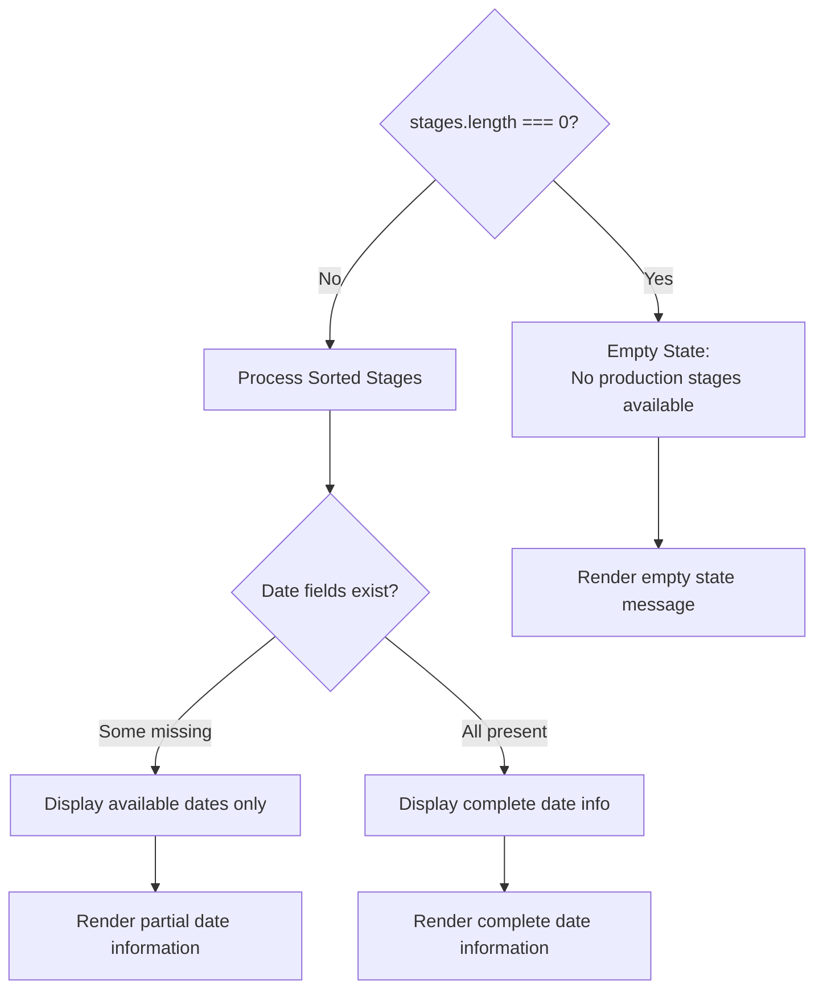

# Timeline Visualization

<cite>
**Referenced Files in This Document**
- [ProductionStageTimeline.tsx](file://src/components/production/ProductionStageTimeline.tsx)
- [ProductionTracking.tsx](file://src/pages/ProductionTracking.tsx)
- [ProductionStageCard.tsx](file://src/components/production/ProductionStageCard.tsx)
- [order.ts](file://src/types/order.ts)
- [production_stages table schema](file://supabase/COMPLETE_SETUP.sql#L1415-L1431)
- [initialize-production-stages function](file://supabase/functions/initialize-production-stages/index.ts#L65-L102)
</cite>

## Table of Contents
1. [Introduction](#introduction)
2. [Component Architecture](#component-architecture)
3. [Data Structure and Props](#data-structure-and-props)
4. [Status-Based Icon System](#status-based-icon-system)
5. [Progress Bar Implementation](#progress-bar-implementation)
6. [Date Tracking System](#date-tracking-system)
7. [Sorting and Organization](#sorting-and-organization)
8. [Integration with ProductionTracking](#integration-with-productiontracking)
9. [Error Handling and Edge Cases](#error-handling-and-edge-cases)
10. [Performance Considerations](#performance-considerations)
11. [Common Issues and Solutions](#common-issues-and-solutions)
12. [Best Practices](#best-practices)

## Introduction

The ProductionStageTimeline component is a sophisticated vertical timeline visualization that displays the 8-stage manufacturing process in a chronological, visually intuitive format. Built with React and TypeScript, it provides real-time production tracking with comprehensive status indicators, progress visualization, and date tracking capabilities.

This component serves as a central hub for monitoring production stages, offering stakeholders immediate visibility into the manufacturing pipeline's current state, progress, and historical data. It integrates seamlessly with the broader ProductionTracking system to provide a unified view of order progression through the RMG (Ready-Made Garment) manufacturing process.

## Component Architecture

The ProductionStageTimeline follows a functional component architecture with clear separation of concerns:

**Diagram sources**
- [ProductionStageTimeline.tsx](file://src/components/production/ProductionStageTimeline.tsx#L6-L20)
- [ProductionStageTimeline.tsx](file://src/components/production/ProductionStageTimeline.tsx#L6-L15)

**Section sources**
- [ProductionStageTimeline.tsx](file://src/components/production/ProductionStageTimeline.tsx#L21-L147)

## Data Structure and Props

### Component Props Interface

The component accepts two primary props that define its data input:

| Prop | Type | Description | Required |
|------|------|-------------|----------|
| `orderId` | `string` | Unique identifier for the production order | Yes |
| `stages` | `ProductionStage[]` | Array of production stage objects containing status and timing data | Yes |

### ProductionStage Interface

Each production stage object conforms to the following structure:

| Field | Type | Purpose | Example Values |
|-------|------|---------|----------------|
| `id` | `string` | Unique stage identifier | `"uuid-string"` |
| `stage_number` | `number` | Sequential stage identifier (1-8) | `1, 2, 3, ... 8` |
| `stage_name` | `string` | Human-readable stage description | `"Order Confirmation"`, `"Cutting & Pattern Making"` |
| `status` | `string` | Current stage status | `"pending"`, `"in_progress"`, `"completed"`, `"delayed"` |
| `started_at` | `string \| null` | ISO timestamp when stage began | `"2024-01-15T09:30:00Z"` |
| `completed_at` | `string \| null` | ISO timestamp when stage finished | `"2024-01-16T15:45:00Z"` |
| `target_date` | `string \| null` | Expected completion date | `"2024-01-17"` |
| `completion_percentage` | `number \| null` | Numeric progress indicator (0-100) | `75` |

**Section sources**
- [ProductionStageTimeline.tsx](file://src/components/production/ProductionStageTimeline.tsx#L6-L20)
- [production_stages table schema](file://supabase/COMPLETE_SETUP.sql#L1415-L1431)

## Status-Based Icon System

The component implements a comprehensive status-based icon system that provides immediate visual feedback about each production stage's current state.

### Icon Mapping Logic

**Diagram sources**
- [ProductionStageTimeline.tsx](file://src/components/production/ProductionStageTimeline.tsx#L22-L32)

### Color Scheme Implementation

The status-based color system ensures consistent visual communication across the application:

| Status | Icon | Background Color | CSS Class | Visual Indicator |
|--------|------|------------------|-----------|------------------|
| `completed` | CheckCircle2 | Green | `bg-green-500` | ✓ Completed |
| `in_progress` | Clock | Blue | `bg-blue-500` | ⏳ Ongoing |
| `delayed` | AlertTriangle | Red | `bg-red-500` | ⚠️ Behind Schedule |
| `pending` | Circle | Gray | `bg-gray-300` | ○ Not Started |
| `default` | Circle | Gray | `bg-gray-300` | ○ Unknown |

### Implementation Details

The `getStatusIcon` function handles the dynamic icon selection based on stage status and completion percentage:

**Section sources**
- [ProductionStageTimeline.tsx](file://src/components/production/ProductionStageTimeline.tsx#L22-L32)
- [ProductionStageTimeline.tsx](file://src/components/production/ProductionStageTimeline.tsx#L35-L48)

## Progress Bar Implementation

For stages in progress, the component renders a sophisticated progress bar that dynamically reflects completion percentage and status.

### Progress Bar Architecture

**Diagram sources**
- [ProductionStageTimeline.tsx](file://src/components/production/ProductionStageTimeline.tsx#L94-L107)

### Progress Bar Features

The progress bar implementation includes several key features:

1. **Dynamic Width Calculation**: Progress percentage determines bar width
2. **Status-Specific Coloring**: Different colors for different statuses
3. **Percentage Display**: Numeric progress indicator
4. **Smooth Transitions**: CSS transitions for visual continuity

### Rendering Logic

The progress bar appears conditionally based on stage status and completion data:

**Section sources**
- [ProductionStageTimeline.tsx](file://src/components/production/ProductionStageTimeline.tsx#L94-L107)

## Date Tracking System

The component provides comprehensive date tracking capabilities, displaying when stages were started, completed, and when targets were set.

### Date Information Display

**Diagram sources**
- [ProductionStageTimeline.tsx](file://src/components/production/ProductionStageTimeline.tsx#L111-L135)

### Date Formatting and Display

The component uses the `date-fns` library for consistent date formatting:

| Date Type | Format | Example Output | Condition |
|-----------|--------|----------------|-----------|
| Started | `MMM dd, yyyy` | `Jan 15, 2024` | `stage.started_at` exists |
| Completed | `MMM dd, yyyy` | `Jan 16, 2024` | `stage.completed_at` exists |
| Target | `MMM dd, yyyy` | `Jan 17, 2024` | `stage.target_date` exists && no completion date |

### Date Validation and Edge Cases

The component handles various date scenarios gracefully:

1. **Missing Dates**: Null checks prevent rendering errors
2. **Future Targets**: Target dates display regardless of completion status
3. **Historical Data**: Completed dates show past completion information
4. **Current Progress**: Started dates indicate when work began

**Section sources**
- [ProductionStageTimeline.tsx](file://src/components/production/ProductionStageTimeline.tsx#L111-L135)

## Sorting and Organization

The component implements intelligent sorting to ensure stages appear in the correct chronological order.

### Sorting Algorithm

**Diagram sources**
- [ProductionStageTimeline.tsx](file://src/components/production/ProductionStageTimeline.tsx#L51-L52)

### Sorting Implementation

The sorting mechanism uses JavaScript's native sort function with a custom comparator:

**Section sources**
- [ProductionStageTimeline.tsx](file://src/components/production/ProductionStageTimeline.tsx#L51-L52)

## Integration with ProductionTracking

The ProductionStageTimeline integrates seamlessly with the main ProductionTracking page, serving as one of several views for order management.

### Integration Architecture

**Diagram sources**
- [ProductionTracking.tsx](file://src/pages/ProductionTracking.tsx#L458-L461)
- [ProductionTracking.tsx](file://src/pages/ProductionTracking.tsx#L401-L510)

### Props Passing

The ProductionTracking page passes data to the timeline component through a straightforward props interface:

**Section sources**
- [ProductionTracking.tsx](file://src/pages/ProductionTracking.tsx#L458-L461)
- [ProductionTracking.tsx](file://src/pages/ProductionTracking.tsx#L401-L510)

## Error Handling and Edge Cases

The component implements robust error handling to manage various edge cases and data inconsistencies.

### Missing Data Scenarios

**Diagram sources**
- [ProductionStageTimeline.tsx](file://src/components/production/ProductionStageTimeline.tsx#L66-L69)
- [ProductionStageTimeline.tsx](file://src/components/production/ProductionStageTimeline.tsx#L111-L135)

### Error Handling Strategies

1. **Empty Stage Arrays**: Graceful fallback message
2. **Missing Date Fields**: Conditional rendering of available information
3. **Invalid Date Formats**: Safe parsing with fallback display
4. **Null Completion Percentages**: Default to 0% for in-progress stages

### Defensive Programming

The component employs defensive programming techniques:

- **Null Checks**: Every potentially null field is validated
- **Default Values**: Safe defaults for missing data
- **Type Safety**: TypeScript interfaces ensure data consistency
- **Graceful Degradation**: Component renders partially available information

**Section sources**
- [ProductionStageTimeline.tsx](file://src/components/production/ProductionStageTimeline.tsx#L66-L69)
- [ProductionStageTimeline.tsx](file://src/components/production/ProductionStageTimeline.tsx#L111-L135)

## Performance Considerations

The component is optimized for performance through several key strategies:

### Rendering Optimization

1. **Immutable Sorting**: Creates copies of arrays to avoid mutation
2. **Conditional Rendering**: Only renders progress bars for in-progress stages
3. **Efficient Date Formatting**: Uses memoization-friendly date formatting
4. **Minimal Re-renders**: Stable keys prevent unnecessary DOM updates

### Memory Management

- **Shallow Copying**: Uses spread operators for efficient array copying
- **Reference Stability**: Maintains stable references for unchanged data
- **Cleanup**: Proper event listener cleanup in real-time subscriptions

### Scalability Features

The component scales efficiently with:
- **Linear Complexity**: O(n) sorting for stage arrays
- **Constant-Time Lookups**: Direct property access for stage data
- **Batch Updates**: Efficient handling of multiple stage updates

## Common Issues and Solutions

### Issue 1: Stages Not Appearing in Correct Order

**Problem**: Stages display out of sequence despite having correct stage_number values.

**Solution**: Verify that the sorting logic correctly compares numeric values rather than string representations.

**Implementation**: The component uses `a.stage_number - b.stage_number` for numeric comparison.

### Issue 2: Missing or Incorrect Date Formatting

**Problem**: Dates display incorrectly or fail to render.

**Solution**: Ensure date strings are valid ISO format and handle null/undefined values.

**Implementation**: The component uses `new Date()` with null checks and `format()` function.

### Issue 3: Progress Bars Not Updating

**Problem**: Progress bars remain static despite changing completion percentages.

**Solution**: Verify that the component receives updated props and that the progress calculation logic is correct.

**Implementation**: The component re-renders when props change, triggering progress bar updates.

### Issue 4: Status Icons Not Changing

**Problem**: Status icons remain static despite status changes.

**Solution**: Ensure the status field updates correctly and that the getStatusIcon function is called with fresh data.

**Implementation**: The component uses the status prop directly in the icon rendering logic.

## Best Practices

### Development Guidelines

1. **Type Safety**: Always use TypeScript interfaces for data structures
2. **Prop Validation**: Implement runtime validation for critical props
3. **Error Boundaries**: Wrap components in error boundaries for production stability
4. **Accessibility**: Ensure proper ARIA labels and keyboard navigation support

### Performance Guidelines

1. **Memoization**: Use React.memo for expensive computations
2. **Virtualization**: Consider virtualizing long lists of stages
3. **Lazy Loading**: Load stage data asynchronously when possible
4. **Debouncing**: Debounce rapid prop updates to prevent excessive re-renders

### Design Guidelines

1. **Consistency**: Maintain consistent spacing and typography
2. **Visual Hierarchy**: Use size and color to establish importance
3. **Responsive Design**: Ensure mobile-friendly layouts
4. **Feedback**: Provide visual feedback for user interactions

### Testing Guidelines

1. **Unit Tests**: Test individual functions and rendering logic
2. **Integration Tests**: Test component interaction with data sources
3. **Visual Regression**: Monitor for unintended visual changes
4. **Accessibility Testing**: Ensure compliance with WCAG guidelines

**Section sources**
- [ProductionStageTimeline.tsx](file://src/components/production/ProductionStageTimeline.tsx#L1-L147)
- [ProductionTracking.tsx](file://src/pages/ProductionTracking.tsx#L458-L461)