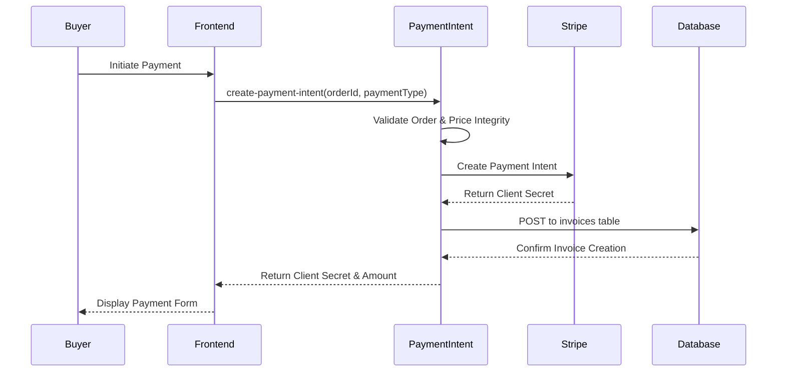
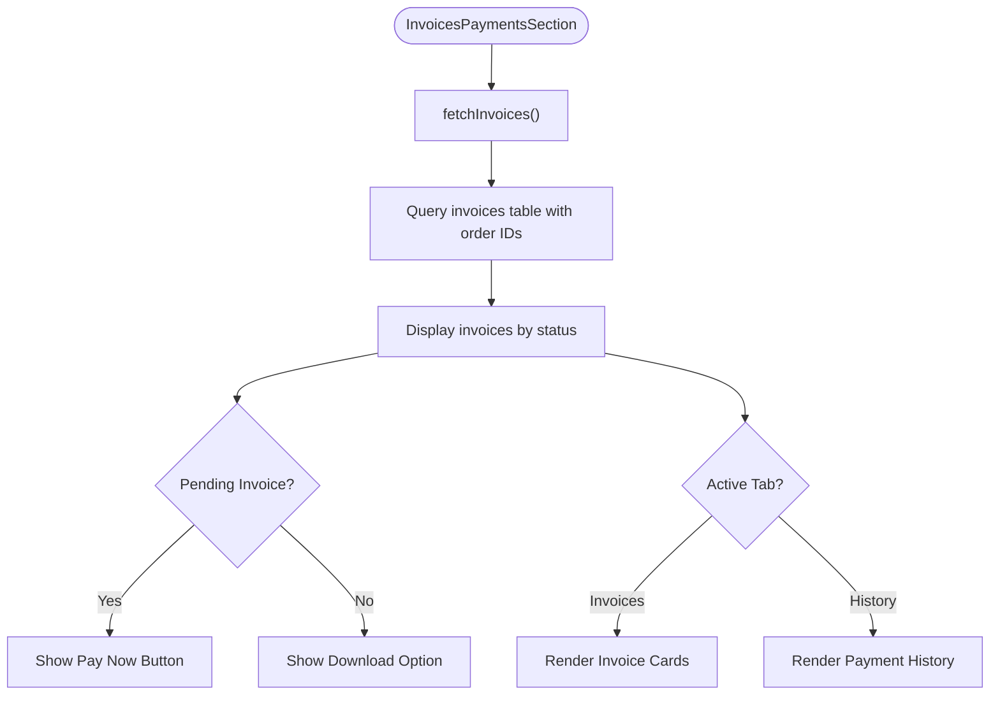
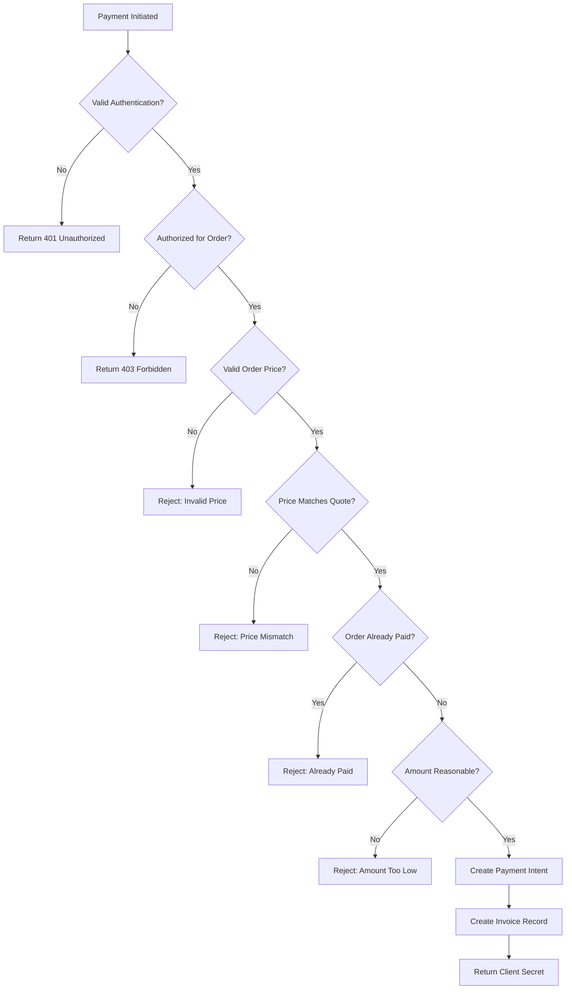

# Invoice and Payment Management

<cite>
**Referenced Files in This Document**   
- [InvoiceViewer.tsx](file://src/components/payment/InvoiceViewer.tsx)
- [InvoicesPaymentsSection.tsx](file://src/components/buyer/InvoicesPaymentsSection.tsx)
- [FinancialDashboard.tsx](file://src/components/supplier/FinancialDashboard.tsx)
- [PaymentManagement.tsx](file://src/components/admin/PaymentManagement.tsx)
- [usePayment.ts](file://src/hooks/usePayment.ts)
- [create-payment-intent/index.ts](file://supabase/functions/create-payment-intent/index.ts)
- [stripe-webhook/index.ts](file://supabase/functions/stripe-webhook/index.ts)
- [PaymentCheckout.tsx](file://src/pages/PaymentCheckout.tsx)
- [order.ts](file://src/types/order.ts)
- [20251115150759_remix_migration_from_pg_dump.sql](file://supabase/migrations/20251115150759_remix_migration_from_pg_dump.sql)
</cite>

## Table of Contents
1. [Introduction](#introduction)
2. [Invoice Generation Process](#invoice-generation-process)
3. [InvoiceViewer Component](#invoiceviewer-component)
4. [InvoicesPaymentsSection for Buyers](#invoicespaymentssection-for-buyers)
5. [FinancialDashboard for Suppliers](#financialdashboard-for-suppliers)
6. [PaymentManagement in Admin Interface](#paymentmanagement-in-admin-interface)
7. [Payment Processing Workflow](#payment-processing-workflow)
8. [Error Handling and Financial Integrity](#error-handling-and-financial-integrity)
9. [Integration with Order Management](#integration-with-order-management)
10. [Best Practices](#best-practices)

## Introduction

The Invoice and Payment Management system handles financial transactions throughout the order lifecycle in the SleekApparels platform. This system integrates with the order management workflow to ensure seamless financial operations from order confirmation to payment processing and invoice generation. The architecture combines frontend components for user interaction with backend Edge Functions for secure payment processing and invoice creation.

The system supports multiple payment types including deposit (30%), balance (70%), and full payment options, providing flexibility for buyers while ensuring suppliers receive timely payments. Invoices are automatically generated when payment intents are created, containing detailed order information, payment terms, and company details.

**Section sources**
- [InvoiceViewer.tsx](file://src/components/payment/InvoiceViewer.tsx#L1-L97)
- [InvoicesPaymentsSection.tsx](file://src/components/buyer/InvoicesPaymentsSection.tsx#L1-L280)

## Invoice Generation Process

The invoice generation process is triggered by the `create-payment-intent` Edge Function when a buyer initiates a payment. Although the `generate-invoice` function was not found in the codebase, the invoice creation is handled within the `create-payment-intent` function as a POST request to the invoices table.

When a payment intent is created, the system automatically generates an invoice record with the following properties:
- A unique invoice number formatted as `INV-YYYY-XXXX` (e.g., INV-2025-0001)
- The associated order ID
- Payment amount calculated based on payment type (deposit, balance, or full)
- Payment type designation
- Status initialized as 'pending'
- Due date set to 7 days from creation
- Stripe payment intent ID linkage

The invoice number generation follows a sequence pattern using the current year and a four-digit sequential number padded with zeros, ensuring uniqueness across the system.



**Diagram sources**
- [create-payment-intent/index.ts](file://supabase/functions/create-payment-intent/index.ts#L248-L267)
- [20251115150759_remix_migration_from_pg_dump.sql](file://supabase/migrations/20251115150759_remix_migration_from_pg_dump.sql#L291-L298)

## InvoiceViewer Component

The InvoiceViewer component displays detailed invoice information to users, providing a clean and professional presentation of financial documents. It accepts an invoice object and order number as props, rendering key financial details in an organized card layout.

Key features of the InvoiceViewer component include:
- Visual display of invoice number and associated order
- Status badge with color coding (green for paid, yellow for pending, red for overdue)
- Payment type and amount display with proper formatting
- Issue date and due date formatting using date-fns
- Optional display of paid date when applicable
- Download PDF button for invoice retrieval

The component uses conditional rendering to show the paid date only when the invoice has been paid, maintaining a clean interface. Status colors are determined by a helper function that maps status strings to appropriate UI variants.

**Section sources**
- [InvoiceViewer.tsx](file://src/components/payment/InvoiceViewer.tsx#L1-L97)

## InvoicesPaymentsSection for Buyers

The InvoicesPaymentsSection provides buyers with a tabbed interface for managing their invoices and viewing payment history. This component fetches invoice data from the Supabase database and displays it in a user-friendly format with filtering capabilities.

Key functionality includes:
- Tabbed interface with "Invoices" and "Payment History" views
- Real-time fetching of invoices associated with the buyer's orders
- Payment history tracking for completed transactions
- Status badges with icons for visual identification
- Pay Now button for pending invoices that triggers the payment flow
- Download options for invoice PDFs

The component implements comprehensive error handling with toast notifications for failed operations. For pending invoices, it displays a "Pay Now" button that calls the `createPaymentIntent` function, redirecting users to a secure payment page.



**Diagram sources**
- [InvoicesPaymentsSection.tsx](file://src/components/buyer/InvoicesPaymentsSection.tsx#L36-L80)
- [InvoicesPaymentsSection.tsx](file://src/components/buyer/InvoicesPaymentsSection.tsx#L101-L120)

## FinancialDashboard for Suppliers

The FinancialDashboard component provides suppliers with comprehensive financial insights into their earnings, payments, and order status. This dashboard aggregates data from supplier orders and invoices to present key performance metrics.

The dashboard displays four main financial statistics:
- Total Earnings from completed orders
- Pending Payments from active orders
- Number of Paid Orders
- Number of Pending Orders

Additionally, the dashboard includes a chart component that visualizes monthly earnings and payment status distribution. It also shows a list of recent supplier payment invoices with amount, status, and date information.

The component calculates financial metrics by filtering and summing supplier order prices based on order status. It fetches invoices specifically marked with 'supplier_payment' type to ensure accurate representation of supplier earnings.

**Section sources**
- [FinancialDashboard.tsx](file://src/components/supplier/FinancialDashboard.tsx#L1-L232)

## PaymentManagement in Admin Interface

The PaymentManagement component in the admin interface provides oversight of all invoices with comprehensive filtering and search capabilities. Administrators can monitor payment status across all orders and identify any issues requiring attention.

Key features include:
- Summary cards showing total revenue, collected amounts, and pending payments
- Search functionality by invoice or order number
- Status filtering (All, Pending, Paid, Overdue)
- Tabular display of all invoices with detailed information
- Visual indicators for payment status with appropriate icons

The component fetches all invoices from the database with associated order information, allowing administrators to see the complete financial picture. The table includes columns for invoice number, order reference, payment type, amount, status, and due date, providing comprehensive visibility into the payment ecosystem.

```mermaid
classDiagram
class PaymentManagement {
+invoices : Invoice[]
+searchTerm : string
+statusFilter : string
+fetchInvoices() : Promise~void~
+getStatusIcon(status : string) : JSX.Element
+getStatusColor(status : string) : string
+filteredInvoices : Invoice[]
+stats : {total : number, paid : number, pending : number}
}
class Invoice {
+id : string
+invoice_number : string
+amount : number
+payment_type : string
+status : string
+due_date : string
+paid_at : string | undefined
+created_at : string
+orders : OrderReference
}
class OrderReference {
+order_number : string
+buyer_id : string
}
PaymentManagement --> Invoice : "displays"
PaymentManagement --> OrderReference : "references"
```

**Diagram sources**
- [PaymentManagement.tsx](file://src/components/admin/PaymentManagement.tsx#L1-L232)

## Payment Processing Workflow

The payment processing workflow integrates multiple components and services to ensure secure and reliable financial transactions. The process begins when a buyer initiates payment and concludes with invoice status updates upon successful payment.

The workflow involves:
1. Buyer initiates payment through the PaymentCheckout page
2. Frontend calls the `create-payment-intent` Edge Function
3. Backend validates order ownership, price integrity, and payment eligibility
4. Stripe payment intent is created with appropriate amount based on payment type
5. Invoice record is created in the database with pending status
6. Client secret is returned to frontend for Stripe Elements integration
7. Upon successful payment, Stripe webhook updates invoice status to paid

The system implements multiple security checks during payment processing, including authorization verification, price integrity validation against original quotes, and protection against duplicate payments.

**Section sources**
- [create-payment-intent/index.ts](file://supabase/functions/create-payment-intent/index.ts#L1-L288)
- [PaymentCheckout.tsx](file://src/pages/PaymentCheckout.tsx#L1-L174)

## Error Handling and Financial Integrity

The system implements robust error handling and financial integrity measures to prevent common issues such as payment processing errors, invoice generation failures, and price mismatches.

Key error handling mechanisms include:
- Price mismatch detection by comparing order price with original quote (allowing 0.5% variance for currency rounding)
- Prevention of payments for already paid orders
- Validation of minimum payment amount ($1.00)
- Authorization checks to ensure users can only pay for their own orders
- Logging of order modifications within 5 minutes of payment attempt

The `create-payment-intent` function includes comprehensive validation before processing payments:
- Authentication verification
- Order ownership validation
- Price integrity checks against original quotes
- Payment state validation (preventing duplicate payments)
- Amount reasonableness verification

When payment fails, the system updates the invoice status to 'failed' through the Stripe webhook handler, allowing for proper tracking and resolution.



**Diagram sources**
- [create-payment-intent/index.ts](file://supabase/functions/create-payment-intent/index.ts#L100-L134)
- [stripe-webhook/index.ts](file://supabase/functions/stripe-webhook/index.ts#L62-L79)

## Integration with Order Management

The invoice and payment system is tightly integrated with the order management system, ensuring that payment status updates directly affect order workflow progression. This integration maintains data consistency across financial and operational domains.

Key integration points include:
- Order status updates triggered by payment completion
- Payment intent creation linked to specific orders
- Invoice generation as part of the payment initialization process
- Synchronization between order payment status and invoice status

When a payment is successfully processed, the Stripe webhook updates both the invoice status to 'paid' and triggers updates to the associated order. This ensures that order fulfillment can proceed only after appropriate payment has been received.

The system also maintains referential integrity between orders and invoices through foreign key relationships, with invoices referencing order IDs. This allows for comprehensive financial reporting and audit trails throughout the order lifecycle.

**Section sources**
- [create-payment-intent/index.ts](file://supabase/functions/create-payment-intent/index.ts#L247-L267)
- [stripe-webhook/index.ts](file://supabase/functions/stripe-webhook/index.ts#L67-L74)

## Best Practices

To ensure financial data integrity and optimal system performance, the following best practices should be observed:

1. **Price Integrity Verification**: Always validate order prices against original quotes with a small tolerance for currency rounding (0.5%) to prevent price manipulation.

2. **Payment State Management**: Implement checks to prevent duplicate payments by verifying order payment status before creating new payment intents.

3. **Secure Authorization**: Ensure that only authorized users (order owners or administrators) can initiate payments for specific orders.

4. **Comprehensive Logging**: Maintain detailed logs of payment attempts, including successful and failed transactions, for audit and troubleshooting purposes.

5. **Data Validation**: Validate all financial amounts to ensure they meet minimum thresholds and are within reasonable ranges.

6. **Error Handling**: Implement graceful error handling with user-friendly messages while logging detailed error information for debugging.

7. **Webhook Security**: Secure webhook endpoints with signature verification to prevent unauthorized status updates.

8. **Invoice Number Uniqueness**: Use a consistent pattern for invoice numbers that includes the year and sequential numbering to ensure global uniqueness.

9. **Status Synchronization**: Keep invoice status and order payment status synchronized across the system to maintain data consistency.

10. **Regular Reconciliation**: Perform regular reconciliation between the system's financial records and external payment processor records to identify and resolve discrepancies.

These practices ensure the reliability, security, and accuracy of the financial transactions processed through the system.

**Section sources**
- [create-payment-intent/index.ts](file://supabase/functions/create-payment-intent/index.ts#L100-L134)
- [stripe-webhook/index.ts](file://supabase/functions/stripe-webhook/index.ts#L62-L94)