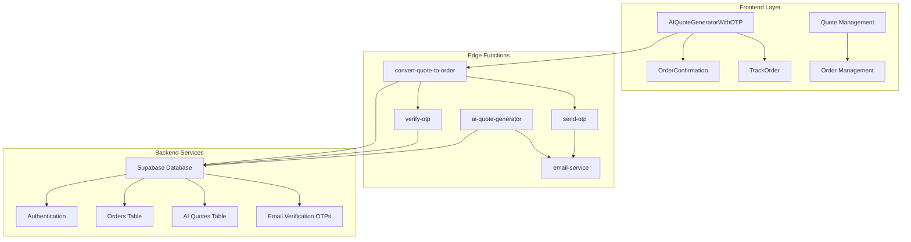
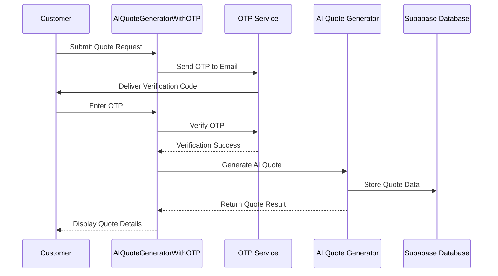
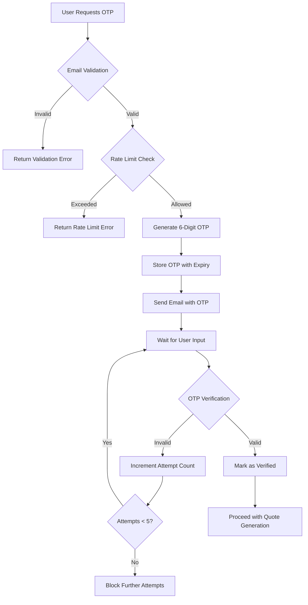
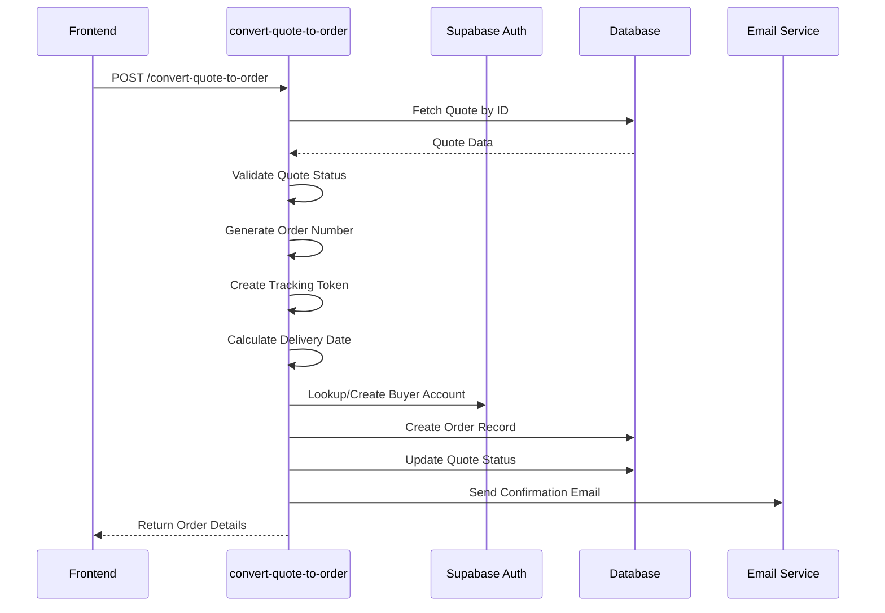
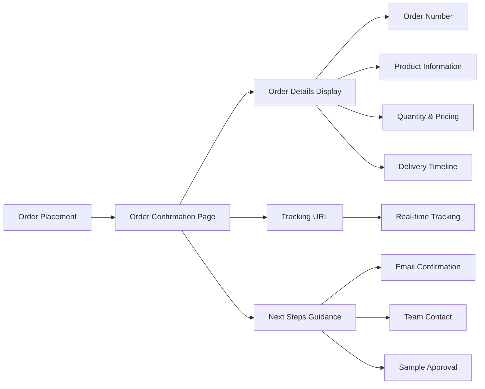
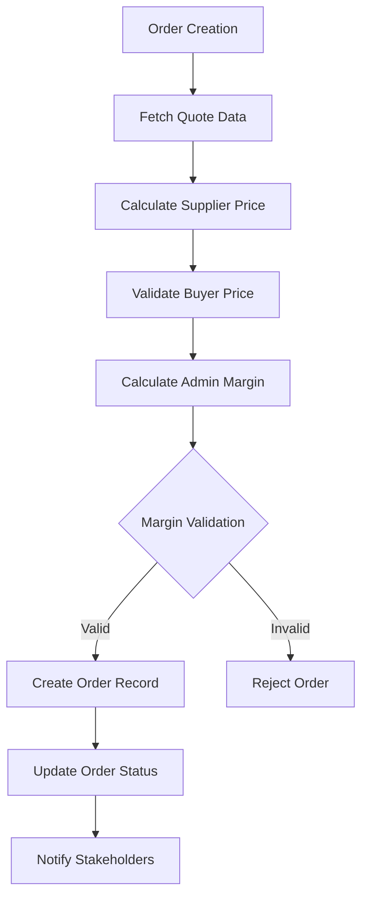
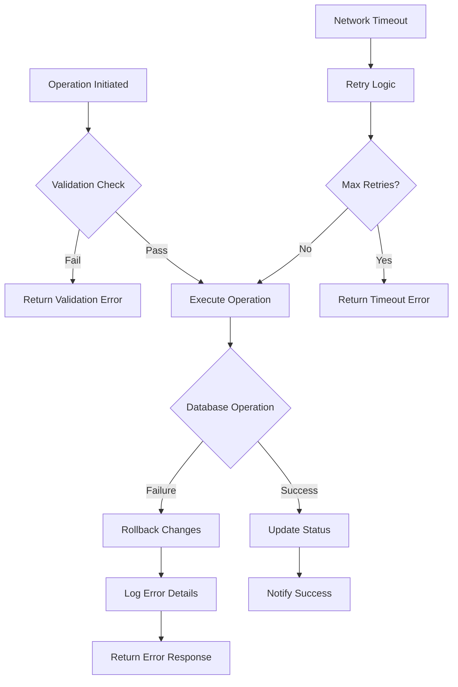
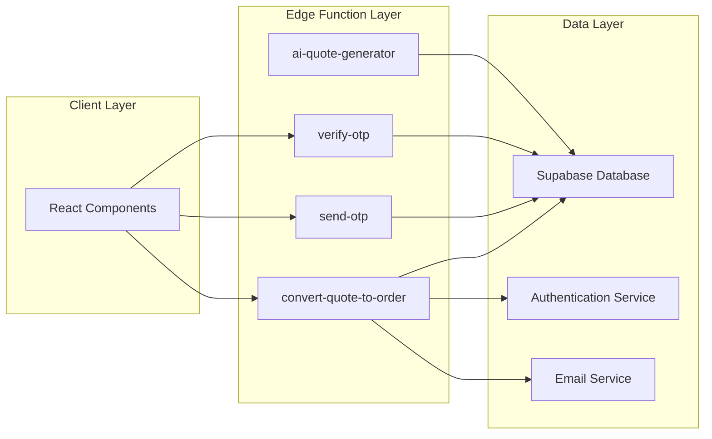

# Order Lifecycle Management

<cite>
**Referenced Files in This Document**
- [AIQuoteGeneratorWithOTP.tsx](file://src/components/AIQuoteGeneratorWithOTP.tsx)
- [convert-quote-to-order/index.ts](file://supabase/functions/convert-quote-to-order/index.ts)
- [useQuotes.ts](file://src/hooks/useQuotes.ts)
- [useOrderManagement.ts](file://src/hooks/useOrderManagement.ts)
- [order.ts](file://src/types/order.ts)
- [aiQuote.ts](file://src/lib/api/aiQuote.ts)
- [send-otp/index.ts](file://supabase/functions/send-otp/index.ts)
- [verify-otp/index.ts](file://supabase/functions/verify-otp/index.ts)
- [OrderConfirmation.tsx](file://src/pages/OrderConfirmation.tsx)
- [TrackOrder.tsx](file://src/pages/TrackOrder.tsx)
- [bangladeshManufacturing.ts](file://src/lib/bangladeshManufacturing.ts)
</cite>

## Table of Contents
1. [Introduction](#introduction)
2. [System Architecture Overview](#system-architecture-overview)
3. [Quote Creation and Management](#quote-creation-and-management)
4. [OTP Verification System](#otp-verification-system)
5. [Quote to Order Conversion](#quote-to-order-conversion)
6. [Order Management and Tracking](#order-management-and-tracking)
7. [Data Transformation and Validation](#data-transformation-and-validation)
8. [Error Handling and Transactional Integrity](#error-handling-and-transactional-integrity)
9. [Integration Patterns](#integration-patterns)
10. [Best Practices and Common Issues](#best-practices-and-common-issues)
11. [Conclusion](#conclusion)

## Introduction

The Order Lifecycle Management system at Sleek Apparels provides a seamless transition from quote generation to order fulfillment, leveraging AI-powered quote generation, robust OTP verification, and automated order processing. This system manages the complete journey from customer inquiry through order confirmation, ensuring data consistency and providing real-time tracking capabilities.

The system integrates multiple components including AI quote generation, OTP-based authentication, quote-to-order conversion, order management, and tracking systems. It maintains strict transactional integrity while providing flexibility for both anonymous and authenticated user experiences.

## System Architecture Overview

The Order Lifecycle Management system follows a microservices architecture with edge functions handling critical business logic:



**Diagram sources**
- [AIQuoteGeneratorWithOTP.tsx](file://src/components/AIQuoteGeneratorWithOTP.tsx#L1-L1046)
- [convert-quote-to-order/index.ts](file://supabase/functions/convert-quote-to-order/index.ts#L1-L223)
- [send-otp/index.ts](file://supabase/functions/send-otp/index.ts#L1-L489)
- [verify-otp/index.ts](file://supabase/functions/verify-otp/index.ts#L1-L356)

## Quote Creation and Management

### AI-Powered Quote Generation

The system utilizes sophisticated AI algorithms to generate instant quotes based on product specifications, quantity requirements, and manufacturing complexities. The AIQuoteGeneratorWithOTP component orchestrates the entire quote generation process:



**Diagram sources**
- [AIQuoteGeneratorWithOTP.tsx](file://src/components/AIQuoteGeneratorWithOTP.tsx#L175-L345)
- [send-otp/index.ts](file://supabase/functions/send-otp/index.ts#L131-L489)
- [aiQuote.ts](file://src/lib/api/aiQuote.ts#L49-L146)

### Quote Data Structure

The system maintains comprehensive quote data with the following structure:

| Field | Type | Description | Validation |
|-------|------|-------------|------------|
| `id` | String | Unique quote identifier | Auto-generated UUID |
| `product_type` | String | Product category | Required, min 1 character |
| `quantity` | Number | Order quantity | Integer, 50-100,000 units |
| `complexity_level` | Enum | Manufacturing complexity | simple/medium/complex |
| `fabric_type` | String | Material specification | Max 100 characters |
| `customer_email` | String | Contact email | Valid email format |
| `customer_name` | String | Customer name | Max 100 characters |
| `total_price` | Number | Calculated price | Positive numeric value |
| `estimated_delivery_days` | Number | Expected delivery timeline | Days calculation |
| `status` | String | Quote lifecycle status | pending/converted/completed |

**Section sources**
- [AIQuoteGeneratorWithOTP.tsx](file://src/components/AIQuoteGeneratorWithOTP.tsx#L27-L37)
- [useQuotes.ts](file://src/hooks/useQuotes.ts#L5-L35)

## OTP Verification System

### Multi-Factor Authentication

The system implements robust OTP verification for email-based quote requests, ensuring legitimate user participation while maintaining user privacy:



**Diagram sources**
- [send-otp/index.ts](file://supabase/functions/send-otp/index.ts#L131-L489)
- [verify-otp/index.ts](file://supabase/functions/verify-otp/index.ts#L21-L356)

### OTP Security Features

The OTP system incorporates multiple security layers:

- **Rate Limiting**: 5-minute cooldown between OTP requests
- **Attempt Monitoring**: Maximum 5 verification attempts per OTP
- **Expiration Control**: 10-minute OTP validity period
- **Email Validation**: Comprehensive email format and domain checking
- **Disposable Email Blocking**: Automatic filtering of temporary email providers

**Section sources**
- [send-otp/index.ts](file://supabase/functions/send-otp/index.ts#L15-L489)
- [verify-otp/index.ts](file://supabase/functions/verify-otp/index.ts#L15-L356)

## Quote to Order Conversion

### The convert-quote-to-order Edge Function

The core quote-to-order conversion process is handled by the dedicated Edge Function that ensures data integrity and proper business logic execution:



**Diagram sources**
- [convert-quote-to-order/index.ts](file://supabase/functions/convert-quote-to-order/index.ts#L16-L223)

### Order Number Generation

The system generates unique order numbers using a timestamp-based approach:

```typescript
// Order number format: ORD-{last_8_digits_of_timestamp}
const orderNumber = `ORD-${Date.now().toString().slice(-8)}`;
```

This approach ensures uniqueness while providing human-readable order identifiers that reflect approximate creation timing.

### Tracking Token Creation

Secure tracking tokens are generated using cryptographic randomization:

```typescript
// Secure random tracking token
const trackingToken = crypto.randomUUID().replace(/-/g, '');
```

These tokens enable secure order tracking without exposing sensitive order information in URLs.

### Expected Delivery Date Calculation

The system calculates expected delivery dates based on quote specifications:

```typescript
// Calculate expected delivery date
const expectedDeliveryDate = new Date();
expectedDeliveryDate.setDate(expectedDeliveryDate.getDate() + quote.estimated_delivery_days);
```

**Section sources**
- [convert-quote-to-order/index.ts](file://supabase/functions/convert-quote-to-order/index.ts#L57-L66)

## Order Management and Tracking

### Order Data Model

The system maintains comprehensive order records with the following structure:

| Field | Type | Purpose | Constraints |
|-------|------|---------|-------------|
| `order_number` | String | Human-readable order identifier | Unique, ORD-{digits} format |
| `buyer_id` | String | Associated customer account | Foreign key reference |
| `product_type` | String | Ordered product category | Required field |
| `quantity` | Number | Order quantity | Must match quote quantity |
| `status` | String | Current order status | pending/in_progress/completed |
| `production_status` | String | Manufacturing progress | Pending/In Production/Completed |
| `tracking_token` | String | Secure tracking identifier | Cryptographically generated |
| `expected_delivery_date` | Date | Scheduled completion date | Calculated from quote |
| `notes` | String | Additional requirements | Optional customer specifications |

### Order Confirmation and Tracking

The OrderConfirmation page provides customers with essential order details and tracking capabilities:



**Diagram sources**
- [OrderConfirmation.tsx](file://src/pages/OrderConfirmation.tsx#L1-L239)
- [TrackOrder.tsx](file://src/pages/TrackOrder.tsx#L1-L88)

**Section sources**
- [OrderConfirmation.tsx](file://src/pages/OrderConfirmation.tsx#L1-L239)
- [order.ts](file://src/types/order.ts#L5-L47)

## Data Transformation and Validation

### Price Validation and Margin Calculation

The system implements sophisticated pricing validation and margin calculation mechanisms:



**Diagram sources**
- [useOrderManagement.ts](file://src/hooks/useOrderManagement.ts#L46-L130)
- [bangladeshManufacturing.ts](file://src/lib/bangladeshManufacturing.ts#L96-L135)

### Data Consistency Measures

The system maintains data consistency through several mechanisms:

- **Atomic Operations**: Quote-to-order conversion occurs in atomic transactions
- **Status Tracking**: Clear state transitions from quote to order
- **Bidirectional References**: Links between quote and order records
- **Validation Layers**: Multiple validation checkpoints throughout the process

**Section sources**
- [useOrderManagement.ts](file://src/hooks/useOrderManagement.ts#L46-L130)
- [bangladeshManufacturing.ts](file://src/lib/bangladeshManufacturing.ts#L96-L135)

## Error Handling and Transactional Integrity

### Comprehensive Error Handling

The system implements robust error handling across all components:



**Diagram sources**
- [convert-quote-to-order/index.ts](file://supabase/functions/convert-quote-to-order/index.ts#L205-L223)
- [aiQuote.ts](file://src/lib/api/aiQuote.ts#L86-L146)

### Transactional Integrity

The system ensures transactional integrity through:

- **Atomic Quote-to-Order Conversion**: Either complete successfully or roll back entirely
- **Status Consistency**: Maintains consistent state across related records
- **Error Logging**: Comprehensive logging for debugging and monitoring
- **Retry Mechanisms**: Intelligent retry logic for transient failures

**Section sources**
- [convert-quote-to-order/index.ts](file://supabase/functions/convert-quote-to-order/index.ts#L205-L223)
- [aiQuote.ts](file://src/lib/api/aiQuote.ts#L86-L146)

## Integration Patterns

### API Integration Architecture

The system follows RESTful API patterns with Supabase Edge Functions:



**Diagram sources**
- [AIQuoteGeneratorWithOTP.tsx](file://src/components/AIQuoteGeneratorWithOTP.tsx#L573-L595)
- [convert-quote-to-order/index.ts](file://supabase/functions/convert-quote-to-order/index.ts#L16-L223)

### Cross-System Communication

The system facilitates communication between different functional areas:

- **Quote System**: Handles initial customer inquiries and AI-generated pricing
- **Order Management**: Manages order lifecycle from placement to fulfillment
- **Tracking System**: Provides real-time order status and progress updates
- **Notification System**: Sends automated emails for confirmations and updates

**Section sources**
- [AIQuoteGeneratorWithOTP.tsx](file://src/components/AIQuoteGeneratorWithOTP.tsx#L573-L595)
- [convert-quote-to-order/index.ts](file://supabase/functions/convert-quote-to-order/index.ts#L16-L223)

## Best Practices and Common Issues

### Implementation Best Practices

1. **OTP Security**: Implement rate limiting and attempt monitoring
2. **Data Validation**: Validate all inputs at multiple layers
3. **Error Handling**: Provide meaningful error messages and logging
4. **Transaction Management**: Ensure atomic operations for critical processes
5. **Performance Optimization**: Implement caching and efficient database queries

### Common Issues and Solutions

| Issue | Cause | Solution |
|-------|-------|----------|
| Quote-to-Order Conversion Failures | Database constraint violations | Implement proper validation and error handling |
| Email Delivery Problems | SMTP configuration issues | Use reliable email service providers with retry logic |
| Duplicate Order Creation | Race conditions in concurrent requests | Implement optimistic locking and validation checks |
| Data Inconsistency | Synchronous operation failures | Use transactional operations and rollback mechanisms |
| OTP Verification Failures | Expired tokens or incorrect attempts | Implement proper expiration handling and attempt limits |

### Performance Optimization Strategies

- **Caching**: Cache frequently accessed quote data and user preferences
- **Batch Processing**: Process multiple quote requests efficiently
- **Database Indexing**: Optimize database queries with appropriate indexes
- **Edge Computing**: Deploy functions closer to users for reduced latency

**Section sources**
- [convert-quote-to-order/index.ts](file://supabase/functions/convert-quote-to-order/index.ts#L205-L223)
- [aiQuote.ts](file://src/lib/api/aiQuote.ts#L86-L146)

## Conclusion

The Order Lifecycle Management system at Sleek Apparels demonstrates a sophisticated approach to managing the complete customer journey from quote generation to order fulfillment. Through careful integration of AI-powered quote generation, robust OTP verification, and automated order processing, the system provides a seamless experience while maintaining strict data integrity and security standards.

Key strengths of the system include:

- **Automated Quote Generation**: Leveraging AI to provide instant, accurate pricing
- **Robust Authentication**: Multi-factor verification ensuring legitimate user participation
- **Transactional Integrity**: Atomic operations guaranteeing data consistency
- **Real-time Tracking**: Comprehensive order visibility and progress updates
- **Error Resilience**: Comprehensive error handling and recovery mechanisms

The system's modular architecture enables easy maintenance and future enhancements while providing a solid foundation for scaling the business operations. The combination of frontend React components, backend Edge Functions, and Supabase database creates a cohesive platform that supports both current business needs and future growth requirements.