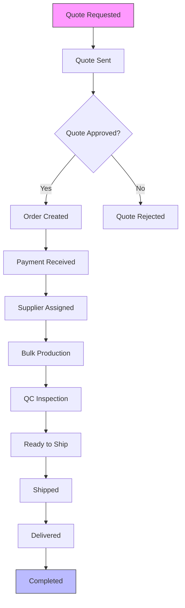
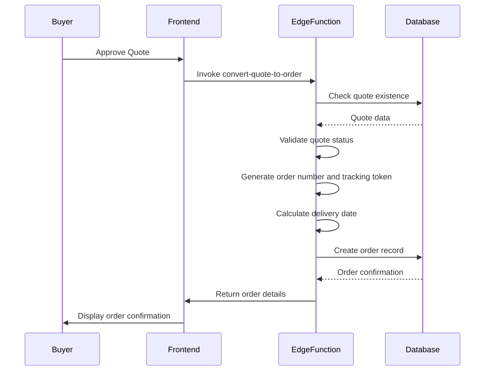
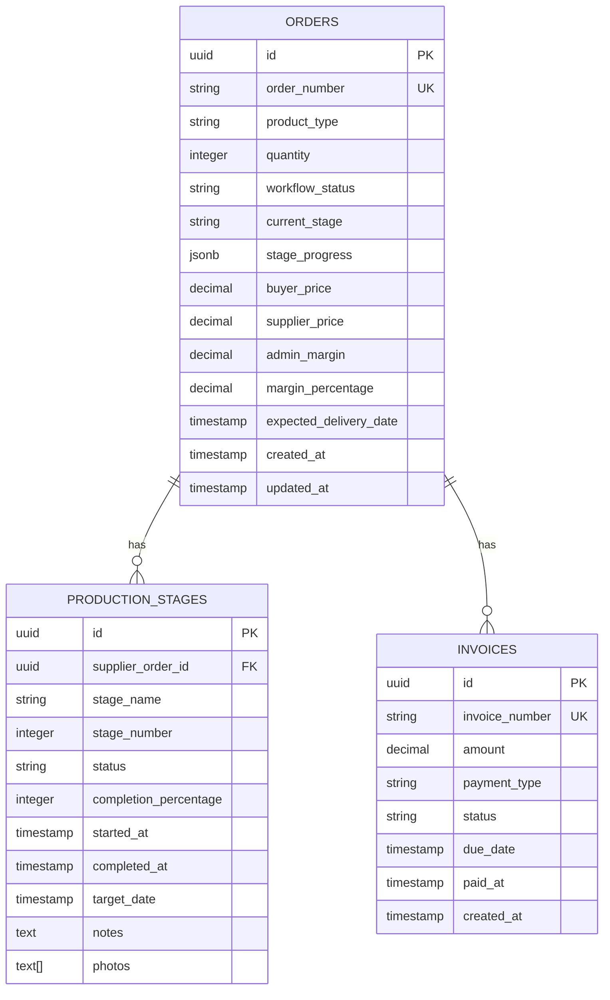
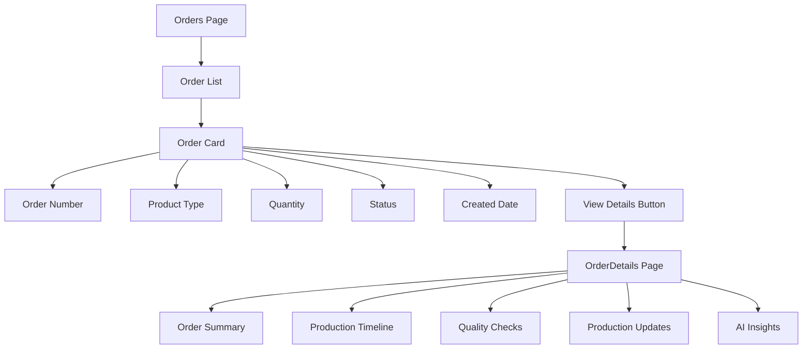
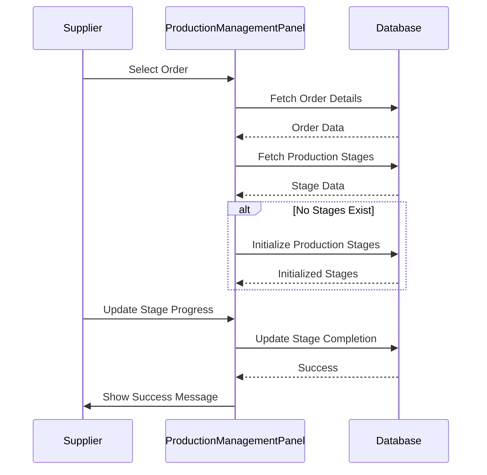
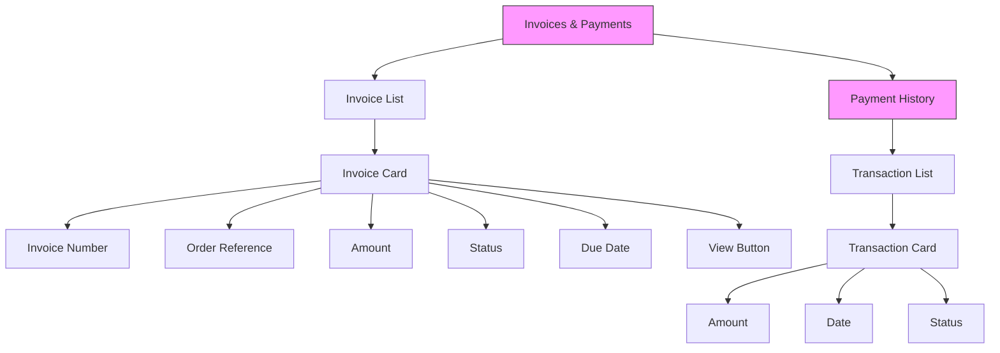
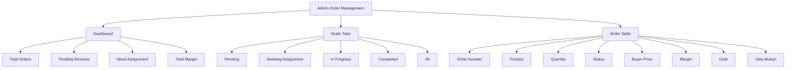
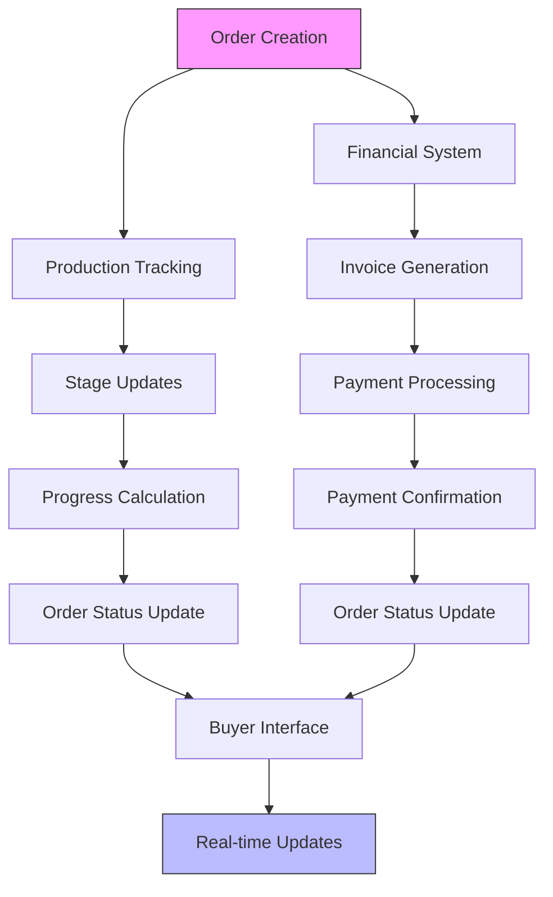

# Order Management

<cite>
**Referenced Files in This Document**   
- [convert-quote-to-order/index.ts](file://supabase/functions/convert-quote-to-order/index.ts)
- [AIQuoteGeneratorWithOTP.tsx](file://src/components/AIQuoteGeneratorWithOTP.tsx)
- [Orders.tsx](file://src/pages/Orders.tsx)
- [OrderDetails.tsx](file://src/pages/OrderDetails.tsx)
- [BuyerOrderTracking.tsx](file://src/pages/BuyerOrderTracking.tsx)
- [SupplierOrderDetail.tsx](file://src/pages/SupplierOrderDetail.tsx)
- [ProductionManagementPanel.tsx](file://src/components/supplier/ProductionManagementPanel.tsx)
- [InvoicesPaymentsSection.tsx](file://src/components/buyer/InvoicesPaymentsSection.tsx)
- [PaymentManagement.tsx](file://src/components/admin/PaymentManagement.tsx)
- [OrderManagement.tsx](file://src/pages/admin/OrderManagement.tsx)
- [useOrderManagement.ts](file://src/hooks/useOrderManagement.ts)
- [order.ts](file://src/types/order.ts)
- [types.ts](file://src/integrations/supabase/types.ts)
- [relax_production_stages.sql](file://supabase/migrations/20250123000000_relax_production_stages.sql)
- [supabaseHelpers.ts](file://src/lib/supabaseHelpers.ts)
</cite>

## Table of Contents
1. [Introduction](#introduction)
2. [Order Lifecycle Overview](#order-lifecycle-overview)
3. [Quote to Order Conversion](#quote-to-order-conversion)
4. [Order Data Model](#order-data-model)
5. [Buyer-Facing Order Interfaces](#buyer-facing-order-interfaces)
6. [Supplier Production Management](#supplier-production-management)
7. [Financial Management Components](#financial-management-components)
8. [Admin Order Management](#admin-order-management)
9. [Data Synchronization and Integration](#data-synchronization-and-integration)
10. [Common Issues and Best Practices](#common-issues-and-best-practices)

## Introduction

The Order Management system handles the complete lifecycle of orders from quote conversion through fulfillment. This comprehensive system integrates buyer, supplier, and administrative interfaces to provide seamless order tracking, production management, and financial processing. The architecture is built around a central order data model that maintains state across various stages of the production process, with specialized components for different user roles and responsibilities.

The system leverages Supabase as its backend, utilizing Edge Functions for critical operations like quote-to-order conversion and production stage initialization. The frontend is implemented with React components that provide role-specific views and interactions, ensuring that each user type has access to the appropriate functionality and information.

**Section sources**
- [Orders.tsx](file://src/pages/Orders.tsx#L1-L198)
- [OrderDetails.tsx](file://src/pages/OrderDetails.tsx#L1-L262)

## Order Lifecycle Overview

The order lifecycle begins with a quote request and progresses through multiple stages until fulfillment. The system tracks orders through a well-defined workflow that includes quote approval, order creation, supplier assignment, production stages, quality control, shipping, and delivery. Each order maintains a comprehensive history of status changes, production updates, and quality checks.

The workflow status is managed through a defined set of states including quote_requested, quote_sent, awaiting_payment, payment_received, assigned_to_supplier, bulk_production, qc_inspection, ready_to_ship, shipped, and completed. This state machine ensures consistent order progression and enables appropriate actions at each stage.

The system also maintains production stages that are specific to the product type, with a default set of apparel production stages including Order Confirmation, Fabric & Trim Sourcing, Pattern & Grading, Cutting, Printing / Embroidery, Sewing & Assembly, Washing & Finishing, Quality Control (Internal), Final Inspection, and Packaging.

**Diagram sources **
- [types.ts](file://src/integrations/supabase/types.ts#L1642-L1647)
- [relax_production_stages.sql](file://supabase/migrations/20250123000000_relax_production_stages.sql#L13-L23)

## Quote to Order Conversion

The quote-to-order conversion process is implemented as an Edge Function that handles the transition from quote to order state. This function performs several critical operations to ensure data integrity and proper order initialization.

The conversion process begins with validation to ensure the quote exists and has not already been converted to an order. Upon successful validation, the function generates a unique order number and tracking token, calculates the expected delivery date based on the quote's estimated delivery days, and creates the order record in the database.

**Diagram sources **
- [convert-quote-to-order/index.ts](file://supabase/functions/convert-quote-to-order/index.ts#L38-L222)
- [AIQuoteGeneratorWithOTP.tsx](file://src/components/AIQuoteGeneratorWithOTP.tsx#L573-L584)

**Section sources**
- [convert-quote-to-order/index.ts](file://supabase/functions/convert-quote-to-order/index.ts#L38-L222)
- [AIQuoteGeneratorWithOTP.tsx](file://src/components/AIQuoteGeneratorWithOTP.tsx#L573-L584)

## Order Data Model

The order data model is designed to track comprehensive information throughout the order lifecycle. The core order entity contains essential fields such as order number, product type, quantity, workflow status, pricing information, and timestamps. The model also includes relationships to production stages, quality checks, order updates, and financial transactions.

Key attributes of the order model include:
- **Order identification**: id, order_number, tracking_token
- **Product information**: product_type, quantity, target_date
- **Status tracking**: workflow_status, current_stage, stage_progress
- **Financial data**: buyer_price, supplier_price, admin_margin, margin_percentage
- **Temporal data**: created_at, updated_at, expected_delivery_date

The model supports a flexible stage progression system where each production stage has its own completion percentage, status, and timeline. This allows for granular tracking of production progress and enables accurate delivery predictions.

**Diagram sources **
- [types.ts](file://src/integrations/supabase/types.ts#L1637-L1679)
- [order.ts](file://src/types/order.ts#L5-L16)
- [supabaseHelpers.ts](file://src/lib/supabaseHelpers.ts#L33-L93)

## Buyer-Facing Order Interfaces

The buyer-facing order interfaces provide comprehensive order history and tracking information through the Orders and OrderDetails pages. These components are designed to give buyers complete visibility into their order status, production progress, and financial transactions.

The Orders page displays a list of all orders with key information including order number, product type, quantity, status, and creation date. Buyers can filter and search through their order history and navigate to detailed views for specific orders.

The OrderDetails page provides an in-depth view of a specific order, including production timelines, quality check results, and communication history. This page integrates multiple components to present a comprehensive view of the order status, including the ProductionTimeline, QCChecksList, and ProductionUpdatesFeed components.

**Diagram sources **
- [Orders.tsx](file://src/pages/Orders.tsx#L1-L198)
- [OrderDetails.tsx](file://src/pages/OrderDetails.tsx#L1-L262)
- [BuyerOrderTracking.tsx](file://src/pages/BuyerOrderTracking.tsx#L1-L38)

**Section sources**
- [Orders.tsx](file://src/pages/Orders.tsx#L1-L198)
- [OrderDetails.tsx](file://src/pages/OrderDetails.tsx#L1-L262)
- [BuyerOrderTracking.tsx](file://src/pages/BuyerOrderTracking.tsx#L1-L38)

## Supplier Production Management

The supplier production management system is centered around the ProductionManagementPanel component, which provides suppliers with tools to update production status and manage their assigned orders. This interface allows suppliers to track progress through predefined production stages and provide updates with notes and photos.

Suppliers can view their active orders and select which order to update. For each order, they can update the completion percentage and add notes for each production stage. The system automatically tracks when stages are started and completed based on the completion percentage.

The interface includes validation to ensure data consistency and provides feedback on successful updates. It also handles the initialization of production stages when an order is first assigned to a supplier, ensuring that all necessary stages are created based on the product type.

**Diagram sources **
- [ProductionManagementPanel.tsx](file://src/components/supplier/ProductionManagementPanel.tsx#L1-L325)
- [SupplierOrderDetail.tsx](file://src/pages/SupplierOrderDetail.tsx#L1-L36)

**Section sources**
- [ProductionManagementPanel.tsx](file://src/components/supplier/ProductionManagementPanel.tsx#L1-L325)
- [SupplierOrderDetail.tsx](file://src/pages/SupplierOrderDetail.tsx#L1-L36)

## Financial Management Components

The financial management system includes components for handling invoices and payments from both buyer and administrative perspectives. The InvoicesPaymentsSection component provides buyers with a view of their outstanding invoices and payment history, while the PaymentManagement component gives administrators oversight of all financial transactions.

The InvoicesPaymentsSection displays invoices with their status (pending, paid, overdue), amount, due date, and associated order information. Buyers can view invoice details and track their payment history through this interface.

The PaymentManagement component provides administrators with a comprehensive view of all invoices, including filtering by status and searching by order number. It displays key financial metrics such as total pending amounts, paid amounts, and revenue statistics.

**Diagram sources **
- [InvoicesPaymentsSection.tsx](file://src/components/buyer/InvoicesPaymentsSection.tsx#L124-L192)
- [PaymentManagement.tsx](file://src/components/admin/PaymentManagement.tsx#L1-L232)

**Section sources**
- [InvoicesPaymentsSection.tsx](file://src/components/buyer/InvoicesPaymentsSection.tsx#L124-L192)
- [PaymentManagement.tsx](file://src/components/admin/PaymentManagement.tsx#L1-L232)

## Admin Order Management

The administrative order management interface provides comprehensive oversight of all orders in the system. The OrderManagement component displays orders in a tabbed interface organized by status (pending, awaiting assignment, in progress, completed), allowing administrators to quickly identify orders that require attention.

The interface includes a dashboard with key metrics such as total orders, pending reviews, orders needing supplier assignment, and total margin. Administrators can search and filter orders, view detailed order information, and perform administrative actions such as assigning suppliers to orders.

The system also includes an OrderStatusBoard component that provides a Kanban-style view of orders across different workflow stages, enabling administrators to visualize the order pipeline and identify bottlenecks.

**Diagram sources **
- [OrderManagement.tsx](file://src/pages/admin/OrderManagement.tsx#L1-L306)
- [OrderStatusBoard.tsx](file://src/components/admin/OrderStatusBoard.tsx#L1-L222)

**Section sources**
- [OrderManagement.tsx](file://src/pages/admin/OrderManagement.tsx#L1-L306)
- [OrderStatusBoard.tsx](file://src/components/admin/OrderStatusBoard.tsx#L1-L222)

## Data Synchronization and Integration

The order management system maintains data consistency through a combination of database constraints, application logic, and real-time updates. The integration between order management and production tracking systems is achieved through shared data models and synchronized status updates.

When an order's production stage is updated, the system automatically updates the order's overall progress and current stage. This ensures that the buyer-facing interfaces always display accurate production status. The system also maintains an order_status_history table that tracks all status changes, providing an audit trail of order progression.

The integration with financial systems ensures that payment status is synchronized with order status. When payment is received, the order status is updated accordingly, and invoices are marked as paid. This prevents inconsistencies between financial and production data.

**Diagram sources **
- [useOrderManagement.ts](file://src/hooks/useOrderManagement.ts#L1-L130)
- [supabaseHelpers.ts](file://src/lib/supabaseHelpers.ts#L67-L104)
- [types.ts](file://src/integrations/supabase/types.ts#L1637-L1679)

**Section sources**
- [useOrderManagement.ts](file://src/hooks/useOrderManagement.ts#L1-L130)
- [supabaseHelpers.ts](file://src/lib/supabaseHelpers.ts#L67-L104)

## Common Issues and Best Practices

### Common Issues

**Order Status Synchronization Problems**
- **Cause**: Race conditions when multiple users update order status simultaneously
- **Solution**: Implement optimistic locking and proper error handling in update operations

**Payment Processing Errors**
- **Cause**: Network issues or payment gateway failures
- **Solution**: Implement retry mechanisms and maintain consistent state between payment status and order status

**Production Stage Initialization Failures**
- **Cause**: Missing product type information or template configuration
- **Solution**: Ensure all product types have corresponding production stage templates

### Best Practices for Data Consistency

1. **Use Atomic Operations**: Group related database updates in transactions to maintain consistency
2. **Implement Proper Error Handling**: Catch and handle errors in all data modification operations
3. **Maintain Audit Trails**: Log all status changes and important operations for traceability
4. **Validate Data on Entry**: Ensure all inputs are validated before being stored in the database
5. **Use Consistent Status Values**: Define and use a standardized set of status values across the system
6. **Implement Real-time Updates**: Use Supabase's real-time capabilities to keep interfaces synchronized
7. **Regular Data Validation**: Implement periodic checks to identify and resolve data inconsistencies

**Section sources**
- [convert-quote-to-order/index.ts](file://supabase/functions/convert-quote-to-order/index.ts#L38-L222)
- [useOrderManagement.ts](file://src/hooks/useOrderManagement.ts#L1-L130)
- [supabaseHelpers.ts](file://src/lib/supabaseHelpers.ts#L67-L104)