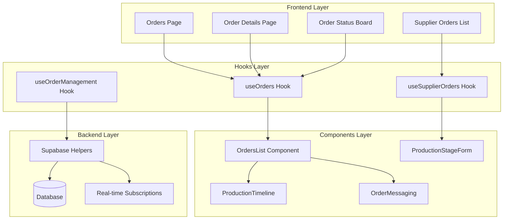
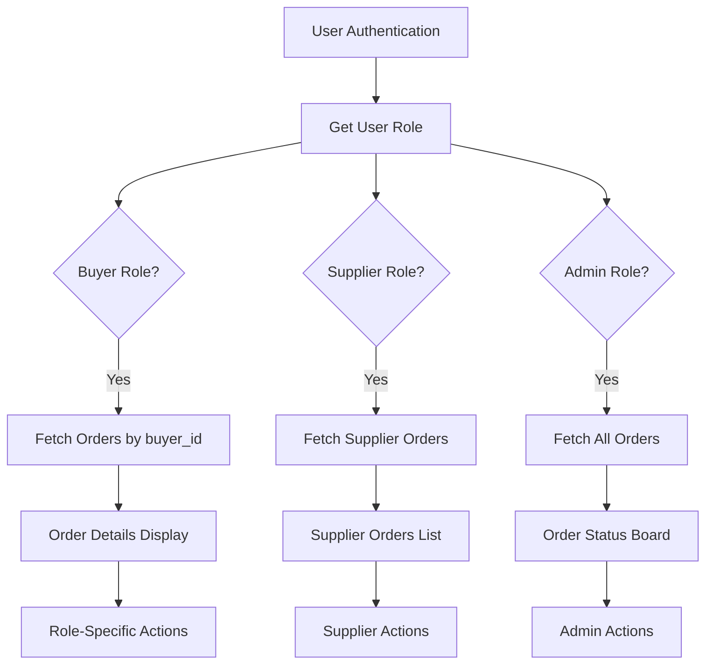
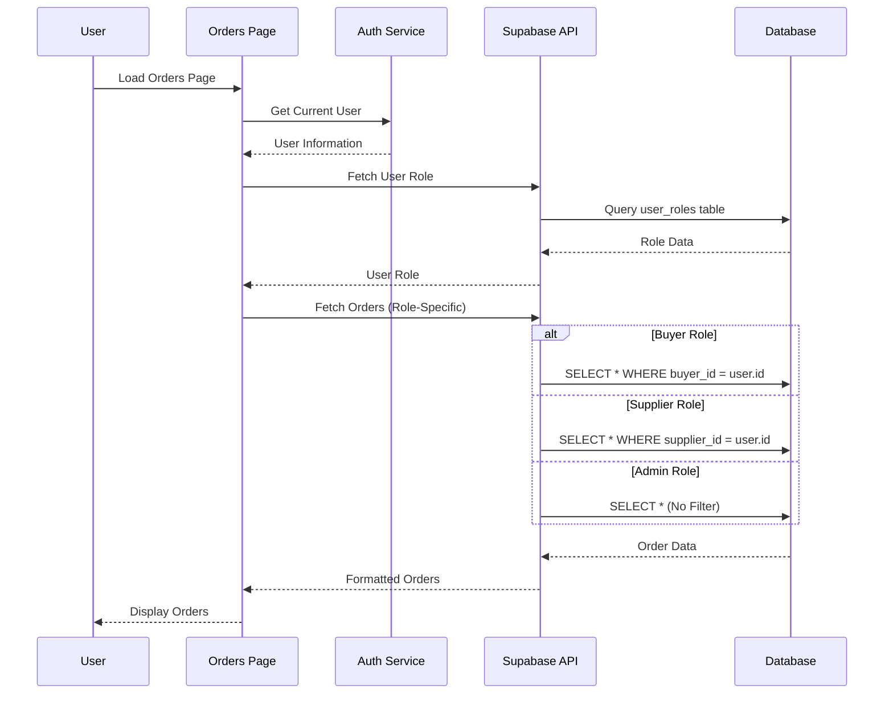
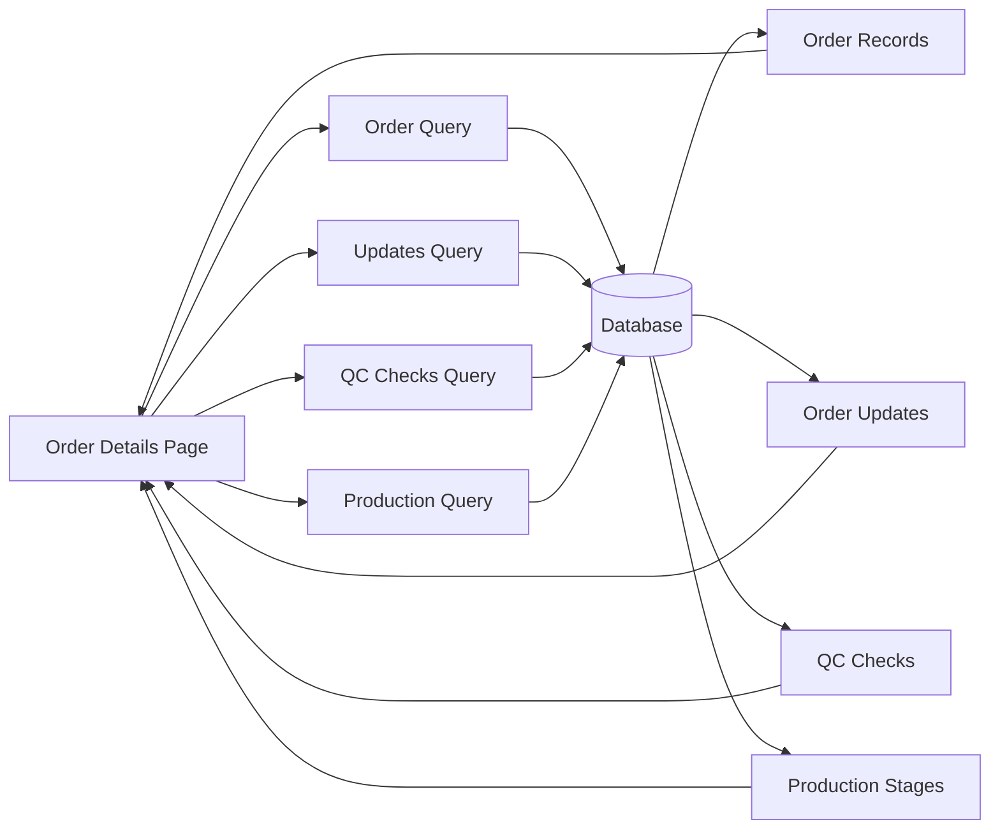
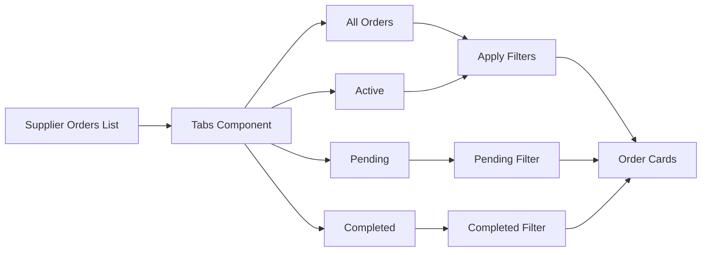
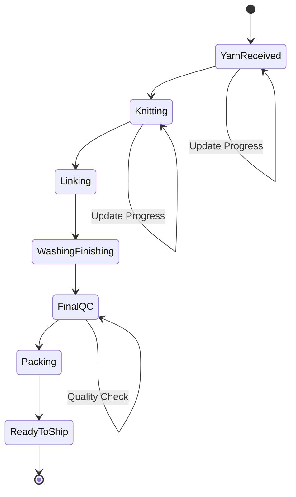
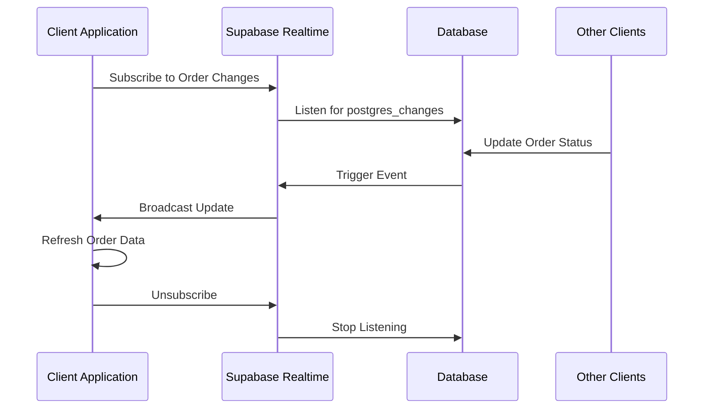

# Order Tracking and Status Management

<cite>
**Referenced Files in This Document**
- [Orders.tsx](file://src/pages/Orders.tsx)
- [OrderDetails.tsx](file://src/pages/OrderDetails.tsx)
- [useOrders.ts](file://src/hooks/queries/useOrders.ts)
- [SupplierOrdersList.tsx](file://src/components/supplier/SupplierOrdersList.tsx)
- [useSupplierOrders.ts](file://src/hooks/useSupplierOrders.ts)
- [OrdersList.tsx](file://src/components/OrdersList.tsx)
- [OrderMessaging.tsx](file://src/components/supplier/OrderMessaging.tsx)
- [ProductionTimeline.tsx](file://src/components/ProductionTimeline.tsx)
- [OrderStatusBoard.tsx](file://src/components/admin/OrderStatusBoard.tsx)
- [supabaseHelpers.ts](file://src/lib/supabaseHelpers.ts)
- [database.ts](file://src/types/database.ts)
- [order.ts](file://src/types/order.ts)
- [useOrderManagement.ts](file://src/hooks/useOrderManagement.ts)
- [LoopTraceOrderTracking.tsx](file://src/components/buyer/LoopTraceOrderTracking.tsx)
- [ProductionManagementPanel.tsx](file://src/components/supplier/ProductionManagementPanel.tsx)
</cite>

## Table of Contents
1. [Introduction](#introduction)
2. [System Architecture](#system-architecture)
3. [Role-Based Access Patterns](#role-based-access-patterns)
4. [Orders Page Implementation](#orders-page-implementation)
5. [OrderDetails Page Implementation](#orderdetails-page-implementation)
6. [Supplier Orders Management](#supplier-orders-management)
7. [Production Tracking Integration](#production-tracking-integration)
8. [Real-Time Updates and Synchronization](#real-time-updates-and-synchronization)
9. [Common Issues and Best Practices](#common-issues-and-best-practices)
10. [Troubleshooting Guide](#troubleshooting-guide)

## Introduction

The Order Tracking and Status Management system provides comprehensive real-time visibility into order status across different user roles in the Sleek Apparels ecosystem. This system enables seamless coordination between buyers, suppliers, factories, and administrators through role-based access patterns, real-time updates, and integrated production tracking capabilities.

The system handles order lifecycle management from initial placement through completion, with specialized interfaces for each stakeholder type. Buyers can monitor their order progress, suppliers manage assigned orders, and administrators oversee the entire workflow with comprehensive reporting and status boards.

## System Architecture

The order tracking system follows a modular architecture with clear separation of concerns across different user roles and functional areas:

**Diagram sources**
- [Orders.tsx](file://src/pages/Orders.tsx#L22-L198)
- [OrderDetails.tsx](file://src/pages/OrderDetails.tsx#L38-L262)
- [useOrders.ts](file://src/hooks/queries/useOrders.ts#L1-L152)
- [useSupplierOrders.ts](file://src/hooks/useSupplierOrders.ts#L1-L208)

## Role-Based Access Patterns

The system implements sophisticated role-based access control that determines which orders users can view and modify based on their assigned roles:

### Buyer Role Access
Buyers can only view orders they've placed, identified by their user ID being linked to the `buyer_id` field in order records. This ensures privacy and prevents unauthorized access to other users' orders.

### Supplier Role Access
Suppliers see orders assigned to them through the `supplier_orders` relationship. The system tracks supplier assignments and allows suppliers to accept, reject, or submit counter offers for orders.

### Admin Role Access
Administrators have unrestricted access to all orders in the system, enabling comprehensive oversight and management capabilities.

**Diagram sources**
- [Orders.tsx](file://src/pages/Orders.tsx#L67-L82)
- [useOrders.ts](file://src/hooks/queries/useOrders.ts#L43-L65)
- [useSupplierOrders.ts](file://src/hooks/useSupplierOrders.ts#L10-L28)

**Section sources**
- [Orders.tsx](file://src/pages/Orders.tsx#L34-L82)
- [useOrders.ts](file://src/hooks/queries/useOrders.ts#L43-L65)
- [useSupplierOrders.ts](file://src/hooks/useSupplierOrders.ts#L10-L28)

## Orders Page Implementation

The Orders page serves as the primary dashboard for users to view their order history with comprehensive filtering and status information:

### Key Features
- **Role-Aware Filtering**: Automatically filters orders based on user role
- **Comprehensive Order Details**: Displays order number, product type, quantity, status, and target dates
- **Responsive Design**: Adapts to different screen sizes and user preferences
- **Error Handling**: Robust error handling with user-friendly notifications

### Data Fetching Strategy
The system employs a sophisticated data fetching strategy that adapts to user roles:

**Diagram sources**
- [Orders.tsx](file://src/pages/Orders.tsx#L29-L82)
- [useOrders.ts](file://src/hooks/queries/useOrders.ts#L43-L65)

### Order Display Components
The system uses specialized components for different order display scenarios:

- **OrdersList Component**: Handles role-based order retrieval and display
- **Order Cards**: Individual order cards with status badges and action buttons
- **Status Badges**: Visual indicators for order status with appropriate styling

**Section sources**
- [Orders.tsx](file://src/pages/Orders.tsx#L22-L198)
- [OrdersList.tsx](file://src/components/OrdersList.tsx#L15-L37)

## OrderDetails Page Implementation

The OrderDetails page provides comprehensive order information with real-time updates and interactive features:

### Core Components
- **Production Timeline**: Visual representation of production stages
- **Quality Control Checks**: Track QC inspections and results
- **Communication History**: Complete message thread between stakeholders
- **Order Updates Feed**: Real-time production updates

### Data Architecture
The OrderDetails page implements a sophisticated data fetching strategy that combines multiple data sources:

**Diagram sources**
- [OrderDetails.tsx](file://src/pages/OrderDetails.tsx#L73-L131)
- [useOrders.ts](file://src/hooks/queries/useOrders.ts#L19-L41)

### Real-Time Features
The OrderDetails page supports real-time updates through Supabase's real-time capabilities:

- **Live Production Updates**: Automatic refresh when production stages change
- **Instant Messaging**: Real-time message delivery between stakeholders
- **Status Synchronization**: Immediate reflection of status changes

**Section sources**
- [OrderDetails.tsx](file://src/pages/OrderDetails.tsx#L38-L262)
- [OrderMessaging.tsx](file://src/components/supplier/OrderMessaging.tsx#L16-L136)

## Supplier Orders Management

The Supplier Orders Management system provides specialized functionality for suppliers to manage their assigned orders:

### Tabbed Interface
The SupplierOrdersList component implements a sophisticated tabbed interface that categorizes orders by status:

**Diagram sources**
- [SupplierOrdersList.tsx](file://src/components/supplier/SupplierOrdersList.tsx#L133-L195)

### Order Status Management
Suppliers can perform various actions on orders based on their current status:

- **Accept Orders**: Mark orders as accepted and initiate production
- **Reject Orders**: Reject orders with specific reasons
- **Submit Counter Offers**: Propose alternative pricing or terms
- **Update Status**: Modify order status during production

### Production Stage Tracking
The system integrates closely with production tracking to provide synchronized status updates:

**Section sources**
- [SupplierOrdersList.tsx](file://src/components/supplier/SupplierOrdersList.tsx#L1-L195)
- [useSupplierOrders.ts](file://src/hooks/useSupplierOrders.ts#L41-L190)

## Production Tracking Integration

The order tracking system seamlessly integrates with production tracking to provide comprehensive visibility:

### Production Stage Progression
The system tracks production through standardized stages:

**Diagram sources**
- [ProductionTimeline.tsx](file://src/components/ProductionTimeline.tsx#L19-L31)

### Stage Progress Tracking
Each production stage maintains detailed progress information including:

- **Completion Percentage**: Numeric progress indicator
- **Status Updates**: Text descriptions and notes
- **Media Attachments**: Photos and videos of production
- **Timestamps**: Creation and update timestamps

### Quality Control Integration
The system integrates quality control checks directly into the production workflow:

- **QC Check Forms**: Structured quality inspection forms
- **Defect Reporting**: Detailed defect logging and tracking
- **Approval Workflows**: Quality approval processes

**Section sources**
- [ProductionTimeline.tsx](file://src/components/ProductionTimeline.tsx#L1-L128)
- [ProductionManagementPanel.tsx](file://src/components/supplier/ProductionManagementPanel.tsx#L219-L263)

## Real-Time Updates and Synchronization

The system implements comprehensive real-time capabilities to ensure consistent order state across all stakeholders:

### Real-Time Subscription Architecture
The system uses Supabase's real-time subscriptions to maintain synchronization:

**Diagram sources**
- [OrderMessaging.tsx](file://src/components/supplier/OrderMessaging.tsx#L22-L35)
- [LoopTraceOrderTracking.tsx](file://src/components/buyer/LoopTraceOrderTracking.tsx#L58-L119)

### Update Synchronization Strategies
The system employs multiple strategies to ensure data consistency:

- **Optimistic Updates**: Immediate UI updates with rollback on failure
- **Real-Time Subscriptions**: Live data streaming for critical updates
- **Polling Fallbacks**: Periodic refreshes for reliability
- **Event-Driven Updates**: Trigger-based refreshes for specific actions

### Conflict Resolution
The system handles potential conflicts through:

- **Last-Write-Wins**: Simple conflict resolution for non-critical data
- **Merge Strategies**: Intelligent merging for complex data structures
- **User Notifications**: Clear indication of conflicts and resolutions

**Section sources**
- [useOrderManagement.ts](file://src/hooks/useOrderManagement.ts#L1-L47)
- [LoopTraceOrderTracking.tsx](file://src/components/buyer/LoopTraceOrderTracking.tsx#L58-L119)

## Common Issues and Best Practices

### Order Status Synchronization Problems
Common issues and solutions for maintaining consistent order state:

#### Issue: Stale Order Data
**Symptoms**: Order status appears outdated or incorrect
**Causes**: 
- Network latency affecting real-time updates
- Browser caching issues
- Concurrent modifications by multiple users

**Solutions**:
- Implement automatic refresh intervals
- Use optimistic updates with rollback capabilities
- Add manual refresh buttons for critical actions
- Implement cache invalidation strategies

#### Issue: Production Stage Sync Delays
**Symptoms**: Production updates don't appear immediately
**Causes**:
- Real-time subscription disconnections
- Database replication delays
- Client-side buffering

**Solutions**:
- Implement robust reconnection logic
- Use immediate polling for critical updates
- Add visual indicators for sync status
- Implement local state caching

### Data Loading Failures
Common patterns for handling data loading failures gracefully:

#### Network Connectivity Issues
**Best Practices**:
- Implement exponential backoff for retries
- Show meaningful error messages to users
- Provide offline mode capabilities
- Cache critical data locally

#### Database Performance Issues
**Best Practices**:
- Implement pagination for large datasets
- Use efficient database queries with proper indexing
- Implement query debouncing for search functionality
- Monitor and optimize slow queries

### Performance Optimization
Strategies for maintaining optimal performance:

#### Query Optimization
- Use selective field queries instead of `*`
- Implement proper indexing on frequently queried fields
- Use database views for complex queries
- Implement query result caching

#### Frontend Optimization
- Implement virtual scrolling for large lists
- Use React.memo for expensive components
- Implement code splitting for large bundles
- Use lazy loading for non-critical components

## Troubleshooting Guide

### Order Status Not Updating
**Problem**: Order status changes aren't reflected in the UI
**Diagnostic Steps**:
1. Check browser developer tools for network errors
2. Verify real-time subscription connections
3. Test with different browsers/devices
4. Check database triggers and functions

**Resolution**:
- Restart real-time subscriptions on connection loss
- Implement fallback polling mechanisms
- Verify database trigger permissions
- Check for JavaScript errors in console

### Supplier Order Assignments Missing
**Problem**: Supplier orders don't appear in supplier dashboard
**Diagnostic Steps**:
1. Verify supplier assignment in database
2. Check user role assignments
3. Test with different supplier accounts
4. Review database relationships

**Resolution**:
- Verify `supplier_orders` table relationships
- Check user role permissions
- Validate database foreign key constraints
- Test with fresh user sessions

### Production Updates Not Visible
**Problem**: Production stage updates don't appear in order details
**Diagnostic Steps**:
1. Check real-time subscription logs
2. Verify database trigger configurations
3. Test with direct database updates
4. Review client-side subscription logic

**Resolution**:
- Ensure proper database replication identity settings
- Verify publication configurations for real-time
- Check client-side subscription event handlers
- Validate database trigger execution

### Communication History Issues
**Problem**: Messages or updates don't load or save correctly
**Diagnostic Steps**:
1. Check message table permissions
2. Verify user authentication state
3. Test with different user roles
4. Review database foreign key relationships

**Resolution**:
- Verify message table access permissions
- Implement proper authentication guards
- Check database relationship integrity
- Add error handling for missing data

**Section sources**
- [useOrderManagement.ts](file://src/hooks/useOrderManagement.ts#L1-L47)
- [OrderMessaging.tsx](file://src/components/supplier/OrderMessaging.tsx#L16-L136)