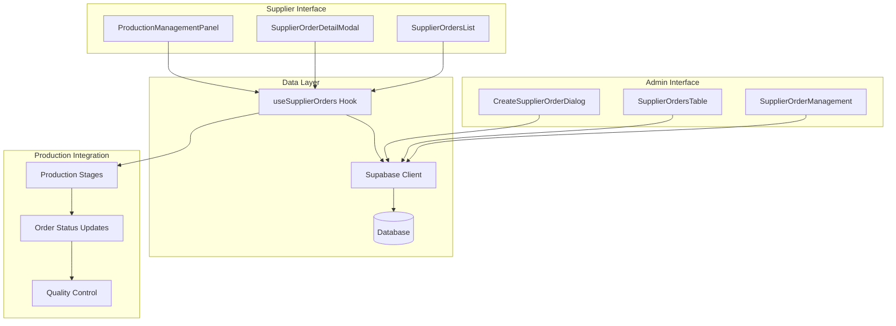
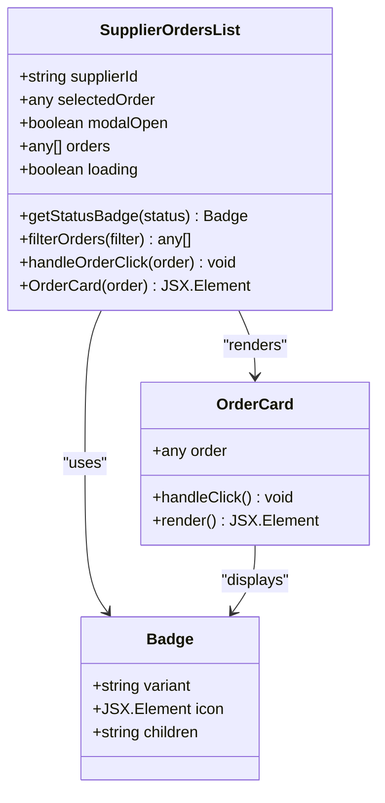
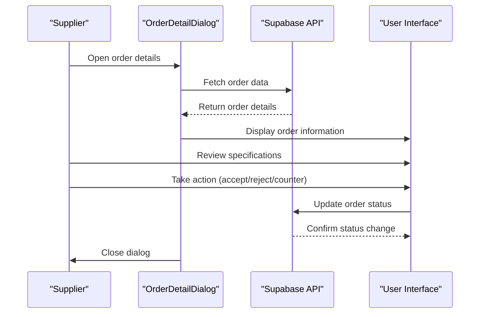
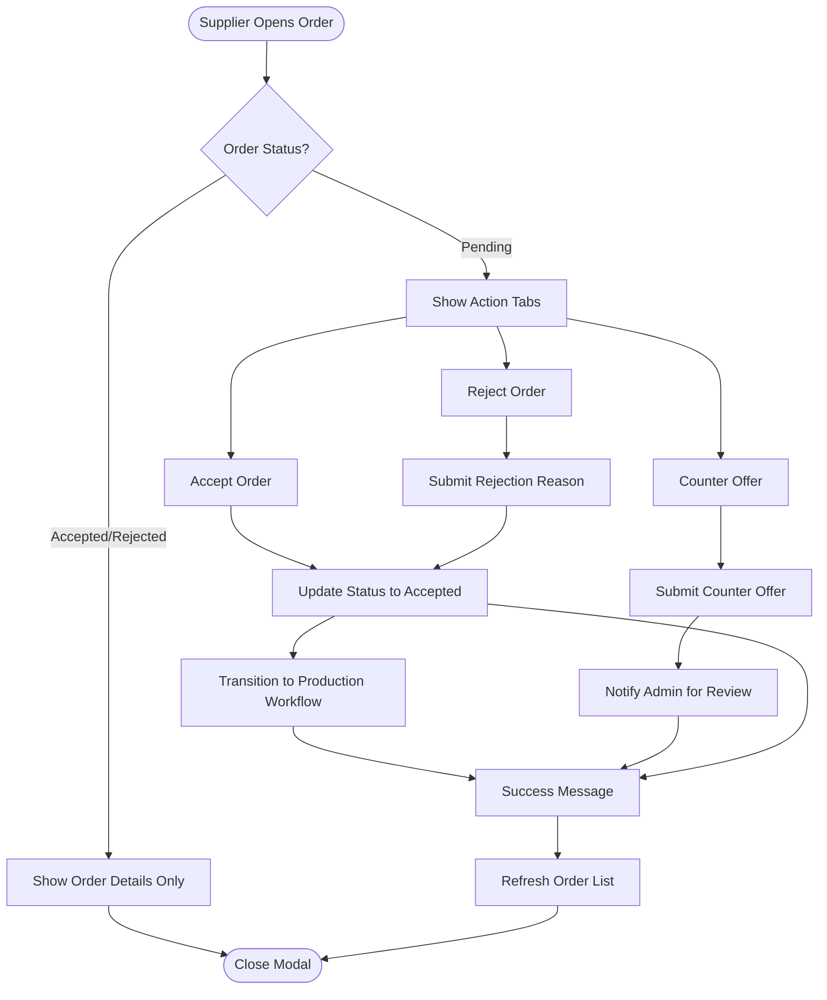
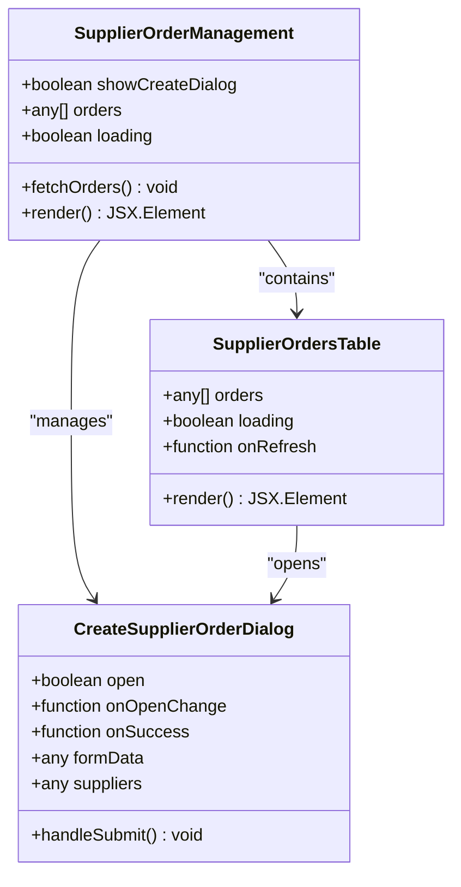
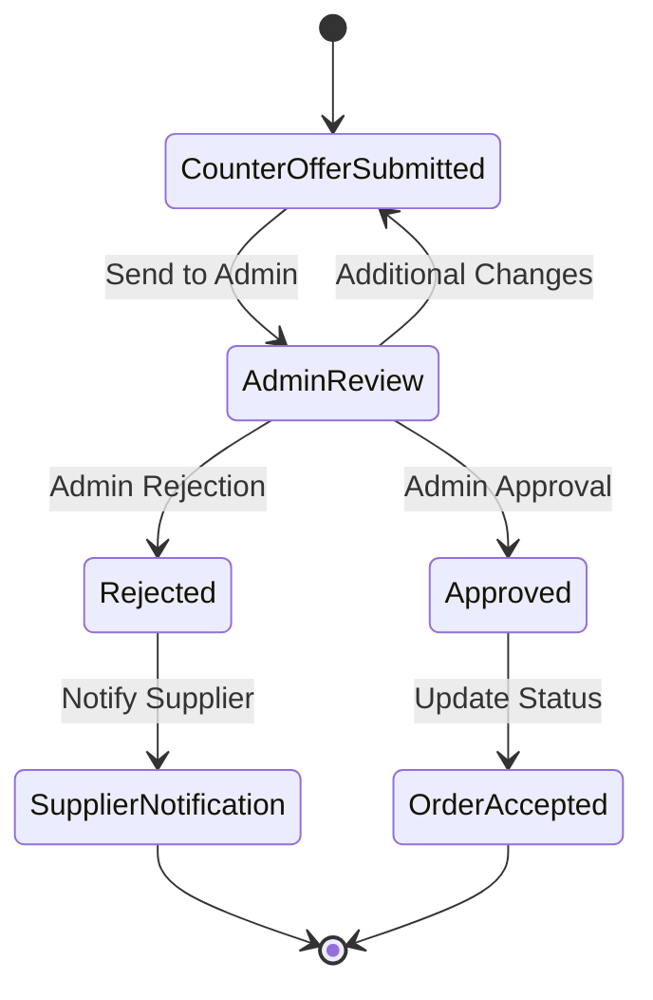
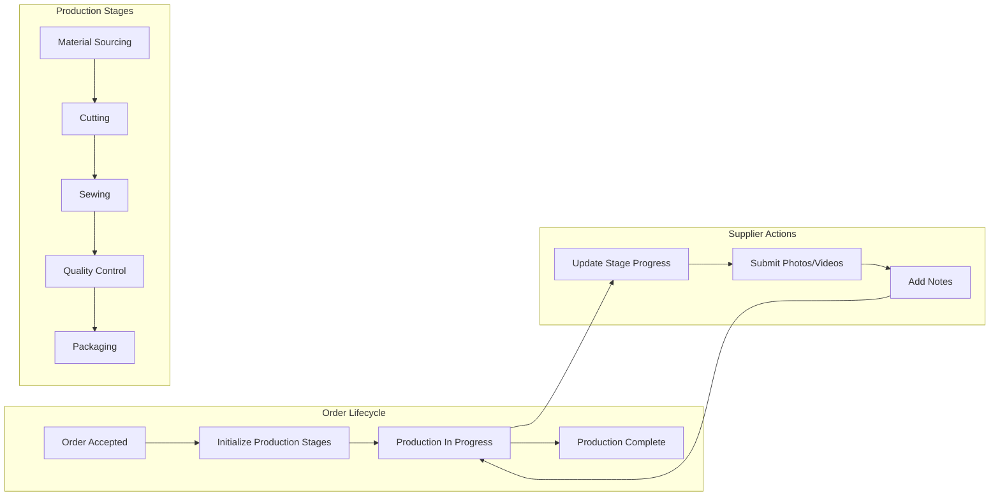
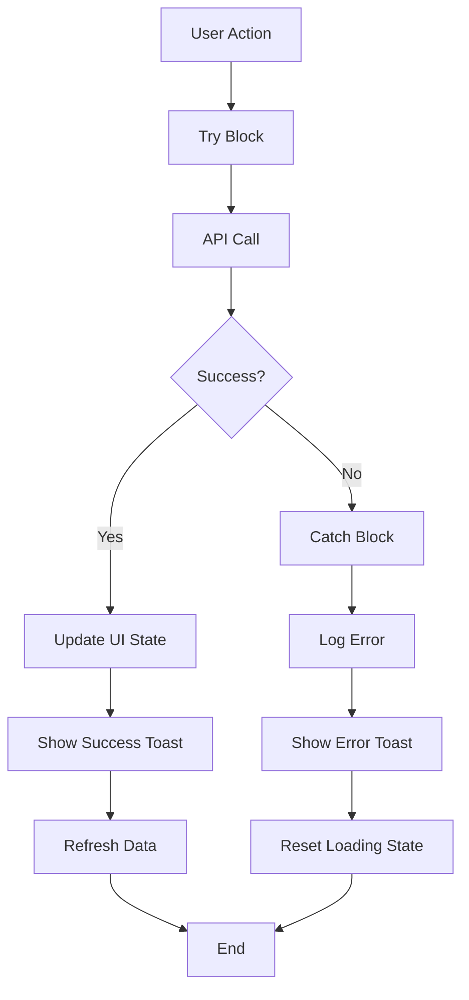
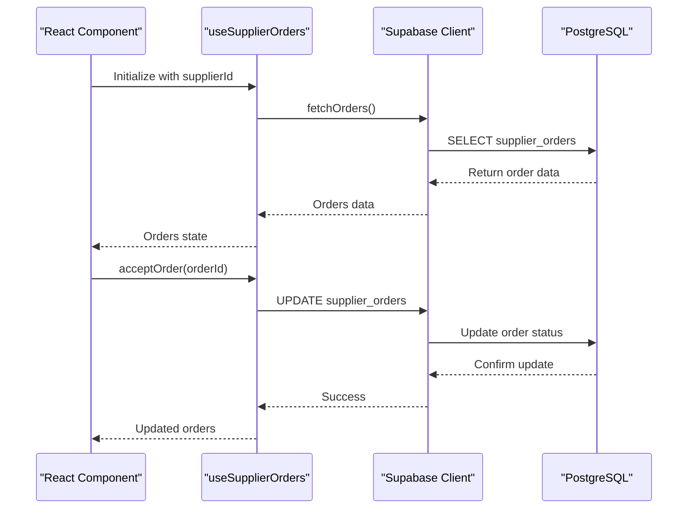

# Supplier Order Coordination

<cite>
**Referenced Files in This Document**
- [SupplierOrdersList.tsx](file://src/components/supplier/SupplierOrdersList.tsx)
- [OrderDetailDialog.tsx](file://src/components/supplier/OrderDetailDialog.tsx)
- [SupplierOrderDetailModal.tsx](file://src/components/supplier/SupplierOrderDetailModal.tsx)
- [SupplierOrdersTable.tsx](file://src/components/admin/SupplierOrdersTable.tsx)
- [SupplierOrderManagement.tsx](file://src/pages/admin/SupplierOrderManagement.tsx)
- [CreateSupplierOrderDialog.tsx](file://src/components/admin/CreateSupplierOrderDialog.tsx)
- [useSupplierOrders.ts](file://src/hooks/useSupplierOrders.ts)
- [ProductionManagementPanel.tsx](file://src/components/supplier/ProductionManagementPanel.tsx)
- [SupplierOrderDetail.tsx](file://src/pages/SupplierOrderDetail.tsx)
- [AdminSupplierOrderDetail.tsx](file://src/pages/admin/AdminSupplierOrderDetail.tsx)
- [types.ts](file://src/types/order.ts)
- [types.ts](file://src/integrations/supabase/types.ts)
</cite>

## Table of Contents
1. [Introduction](#introduction)
2. [System Architecture](#system-architecture)
3. [Core Components](#core-components)
4. [Supplier Order Management Workflow](#supplier-order-management-workflow)
5. [Production Integration](#production-integration)
6. [Error Handling and Toast Notifications](#error-handling-and-toast-notifications)
7. [Common Issues and Best Practices](#common-issues-and-best-practices)
8. [Technical Implementation Details](#technical-implementation-details)
9. [Troubleshooting Guide](#troubleshooting-guide)
10. [Conclusion](#conclusion)

## Introduction

The Supplier Order Coordination system is a comprehensive platform that manages the complete lifecycle of orders from assignment to production completion. It provides suppliers with intuitive interfaces to manage their orders while offering administrators powerful tools to oversee and coordinate supplier activities. The system integrates seamlessly with production management workflows, enabling efficient coordination between suppliers and manufacturing processes.

The system handles four primary order statuses: pending (awaiting supplier response), accepted (committed by supplier), rejected (declined by supplier), and counter-offered (supplier proposes alternative terms). Each status triggers appropriate workflows and notifications throughout the supply chain.

## System Architecture

The Supplier Order Coordination system follows a modular React architecture with clear separation of concerns between supplier-facing and administrative interfaces. The system leverages Supabase for backend services and implements a comprehensive state management strategy through custom hooks.

**Diagram sources**
- [SupplierOrdersList.tsx](file://src/components/supplier/SupplierOrdersList.tsx#L1-L195)
- [SupplierOrderDetailModal.tsx](file://src/components/supplier/SupplierOrderDetailModal.tsx#L1-L288)
- [useSupplierOrders.ts](file://src/hooks/useSupplierOrders.ts#L1-L208)
- [ProductionManagementPanel.tsx](file://src/components/supplier/ProductionManagementPanel.tsx#L1-L325)

## Core Components

### SupplierOrdersList Component

The SupplierOrdersList component serves as the primary interface for suppliers to view and manage their assigned orders. It implements a sophisticated tabbed interface that categorizes orders by acceptance status and provides visual indicators for each status.

**Diagram sources**
- [SupplierOrdersList.tsx](file://src/components/supplier/SupplierOrdersList.tsx#L10-L195)

The component provides real-time filtering capabilities with four distinct tabs:
- **All Orders**: Displays all orders regardless of status
- **Pending**: Shows orders awaiting supplier response
- **Active**: Lists accepted orders currently in production
- **Completed**: Contains finished orders

Each order card displays essential information including product type, quantity, price, target date, and buyer details. The visual status indicators use Lucide icons to provide immediate recognition of order states.

**Section sources**
- [SupplierOrdersList.tsx](file://src/components/supplier/SupplierOrdersList.tsx#L1-L195)

### OrderDetailDialog Component

The OrderDetailDialog provides suppliers with comprehensive order specifications and details. This component serves as a detailed view for order information, including product specifications, pricing, delivery timelines, and supporting documentation.

**Diagram sources**
- [OrderDetailDialog.tsx](file://src/components/supplier/OrderDetailDialog.tsx#L1-L143)

The dialog presents order information in a structured format with sections for:
- Basic order details (product type, quantity, price)
- Timeline information (target delivery date)
- Special instructions from buyers
- Technical packs and reference images
- Action buttons for supplier decisions

**Section sources**
- [OrderDetailDialog.tsx](file://src/components/supplier/OrderDetailDialog.tsx#L1-L143)

### SupplierOrderDetailModal Component

The SupplierOrderDetailModal combines order details with interactive action controls, allowing suppliers to directly manage their order acceptance workflow. This component integrates with the useSupplierOrders hook to provide seamless order management capabilities.

**Diagram sources**
- [SupplierOrderDetailModal.tsx](file://src/components/supplier/SupplierOrderDetailModal.tsx#L1-L288)

**Section sources**
- [SupplierOrderDetailModal.tsx](file://src/components/supplier/SupplierOrderDetailModal.tsx#L1-L288)

### Admin Supplier Order Management

The administrative interface provides comprehensive oversight of all supplier orders through the SupplierOrderManagement page and SupplierOrdersTable component. Administrators can create new orders, monitor order progress, and manage supplier assignments.

**Diagram sources**
- [SupplierOrderManagement.tsx](file://src/pages/admin/SupplierOrderManagement.tsx#L1-L69)
- [SupplierOrdersTable.tsx](file://src/components/admin/SupplierOrdersTable.tsx#L1-L73)
- [CreateSupplierOrderDialog.tsx](file://src/components/admin/CreateSupplierOrderDialog.tsx#L1-L203)

**Section sources**
- [SupplierOrderManagement.tsx](file://src/pages/admin/SupplierOrderManagement.tsx#L1-L69)
- [SupplierOrdersTable.tsx](file://src/components/admin/SupplierOrdersTable.tsx#L1-L73)
- [CreateSupplierOrderDialog.tsx](file://src/components/admin/CreateSupplierOrderDialog.tsx#L1-L203)

## Supplier Order Management Workflow

The system implements a comprehensive workflow for managing supplier orders through multiple stages, each with specific actions and transitions.

### Order Acceptance Workflow

The order acceptance workflow begins when a supplier receives an order notification and progresses through several decision points:

1. **Order Assignment**: Suppliers receive notifications of new orders with complete specifications
2. **Review Phase**: Suppliers examine order details, pricing, and production requirements
3. **Decision Making**: Suppliers choose from three primary actions:
   - **Accept**: Commit to fulfilling the order
   - **Counter Offer**: Propose alternative terms or pricing
   - **Reject**: Decline the order with a reason
4. **Status Updates**: System automatically updates order status and notifies relevant parties

### Counter Offer Processing

When suppliers submit counter offers, the system implements a review workflow:

**Diagram sources**
- [useSupplierOrders.ts](file://src/hooks/useSupplierOrders.ts#L126-L162)

### Order Rejection Workflow

The rejection workflow ensures proper communication and record-keeping:

1. **Reason Collection**: Suppliers provide detailed rejection reasons
2. **Administrative Review**: Admins may review exceptional cases
3. **Notification**: Buyers receive rejection notifications with reasons
4. **Record Keeping**: All rejections are logged for future analysis

**Section sources**
- [useSupplierOrders.ts](file://src/hooks/useSupplierOrders.ts#L42-L162)

## Production Integration

The Supplier Order Coordination system seamlessly integrates with production management systems, enabling smooth transitions from order acceptance to manufacturing execution.

### Production Stage Management

The ProductionManagementPanel component provides suppliers with comprehensive production stage management capabilities:

**Diagram sources**
- [ProductionManagementPanel.tsx](file://src/components/supplier/ProductionManagementPanel.tsx#L100-L299)

### Stage Completion Tracking

Production stages are tracked with detailed completion percentages, timestamps, and progress notes. The system supports:

- **Automatic Status Updates**: Based on completion percentages
- **Photo and Video Uploads**: Visual evidence of production progress
- **Real-time Notifications**: Updates to buyers and admins
- **Quality Control Integration**: Seamless QC check integration

**Section sources**
- [ProductionManagementPanel.tsx](file://src/components/supplier/ProductionManagementPanel.tsx#L100-L299)

## Error Handling and Toast Notifications

The system implements comprehensive error handling and user feedback mechanisms through toast notifications and loading states.

### Error Handling Patterns

The useSupplierOrders hook demonstrates robust error handling patterns:

**Diagram sources**
- [useSupplierOrders.ts](file://src/hooks/useSupplierOrders.ts#L11-L208)

### Toast Notification System

The system uses a centralized toast notification system for user feedback:

- **Success Messages**: Confirms successful operations
- **Error Messages**: Provides actionable error information
- **Loading States**: Indicates ongoing operations
- **Validation Feedback**: Guides user input correction

**Section sources**
- [useSupplierOrders.ts](file://src/hooks/useSupplierOrders.ts#L11-L208)

## Common Issues and Best Practices

### Order Acceptance/Rejection Workflows

**Common Issues:**
- Insufficient order information leading to late rejections
- Lack of communication during counter-offer negotiations
- Missing justification for rejections
- Delayed responses affecting buyer timelines

**Best Practices:**
- Review all order details thoroughly before responding
- Provide clear, constructive feedback in rejection reasons
- Communicate promptly with buyers during negotiations
- Consider capacity constraints when accepting orders

### Counter-Offer Processing

**Common Issues:**
- Unrealistic counter-offers causing buyer dissatisfaction
- Insufficient justification for price adjustments
- Missing technical feasibility assessments
- Lack of timeline impact analysis

**Best Practices:**
- Conduct thorough feasibility assessments before counter-offering
- Provide detailed justifications for pricing changes
- Consider production capacity and timeline impacts
- Maintain professional communication throughout negotiations

### Supplier Communication Gaps

**Common Issues:**
- Lack of regular production updates
- Missing quality control notifications
- Insufficient documentation of production issues
- Delayed responses to buyer inquiries

**Best Practices:**
- Establish regular update schedules with buyers
- Document all production issues and resolutions
- Maintain transparent communication channels
- Proactively notify about potential delays

## Technical Implementation Details

### Database Schema Integration

The system integrates with a comprehensive database schema that supports:

- **Order Tracking**: Complete order lifecycle management
- **Supplier Management**: Supplier-specific order assignments
- **Production Stages**: Detailed manufacturing process tracking
- **Quality Control**: Integrated QC check management

### API Integration Patterns

The useSupplierOrders hook demonstrates clean API integration patterns:

**Diagram sources**
- [useSupplierOrders.ts](file://src/hooks/useSupplierOrders.ts#L11-L208)

### State Management Architecture

The system employs a hierarchical state management approach:

- **Local Component State**: For UI-specific state (modal visibility, form data)
- **Custom Hooks**: For business logic and API interactions
- **Global Context**: For application-wide state (user authentication)
- **Supabase Real-time**: For live data synchronization

**Section sources**
- [useSupplierOrders.ts](file://src/hooks/useSupplierOrders.ts#L1-L208)

## Troubleshooting Guide

### Common Technical Issues

**Order Loading Problems:**
- Verify network connectivity and API endpoints
- Check Supabase authentication and credentials
- Ensure proper database permissions for supplier data

**Modal Display Issues:**
- Confirm proper prop passing from parent components
- Verify state management for modal visibility
- Check for conflicting CSS styles

**Production Stage Updates:**
- Validate stage completion percentages (0-100)
- Ensure proper timestamp formatting
- Verify photo upload functionality

### Performance Optimization

**Data Loading Optimization:**
- Implement pagination for large order lists
- Use debounced search functionality
- Cache frequently accessed data

**UI Responsiveness:**
- Optimize rendering for large datasets
- Implement virtual scrolling for long lists
- Minimize unnecessary re-renders

### Debugging Strategies

**Console Logging:**
- Add logging for API calls and responses
- Monitor state changes and prop updates
- Track user interaction patterns

**Error Monitoring:**
- Implement comprehensive error boundaries
- Log unhandled exceptions
- Monitor toast notification failures

## Conclusion

The Supplier Order Coordination system provides a comprehensive solution for managing supplier orders throughout their entire lifecycle. Through its intuitive interfaces, robust workflow management, and seamless production integration, the system enables efficient coordination between suppliers and manufacturers while maintaining transparency and accountability.

Key strengths of the system include:

- **Intuitive Supplier Interfaces**: Easy-to-use components for order management
- **Comprehensive Workflow Support**: Handles all aspects of order lifecycle
- **Production Integration**: Seamless transition to manufacturing processes
- **Robust Error Handling**: Comprehensive error management and user feedback
- **Scalable Architecture**: Modular design supporting future enhancements

The system's design prioritizes both supplier convenience and administrative oversight, ensuring that orders move efficiently through the supply chain while maintaining quality standards and meeting buyer expectations. Future enhancements could include automated capacity planning, predictive analytics for order fulfillment, and expanded integration with external logistics systems.