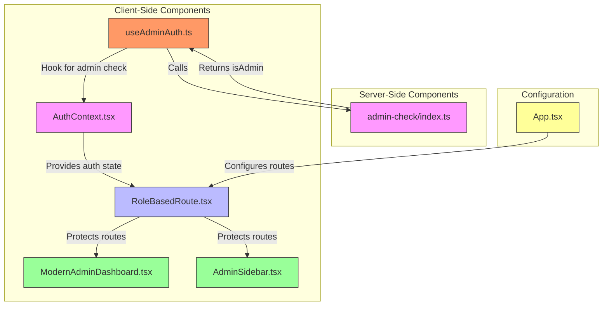
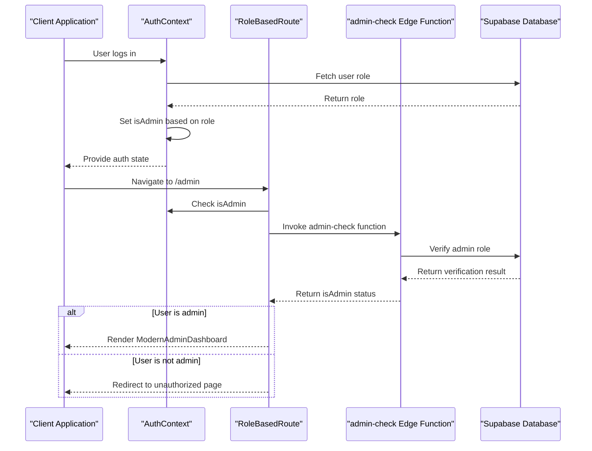
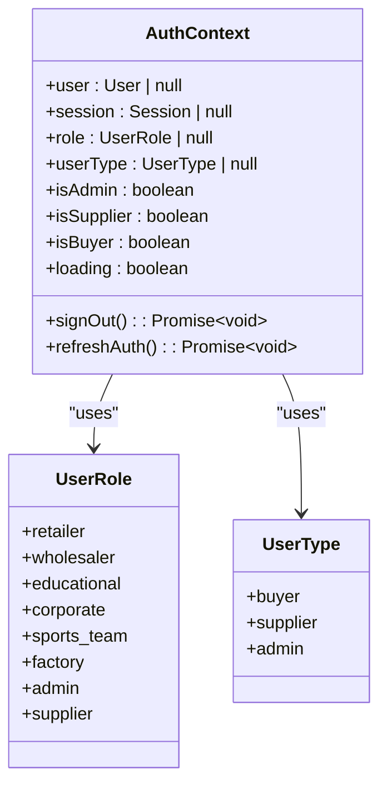
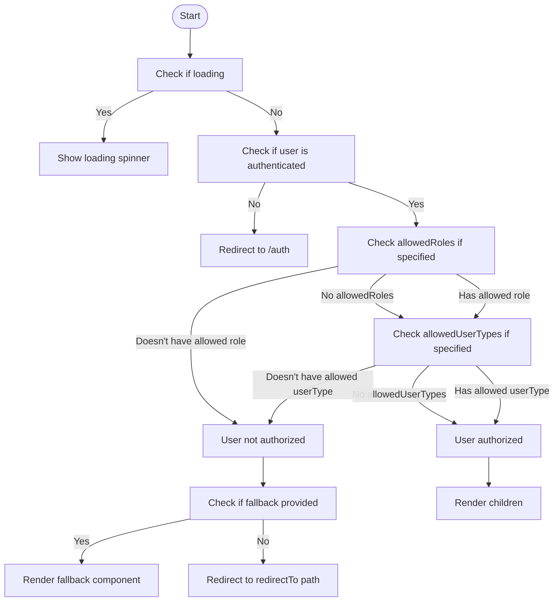
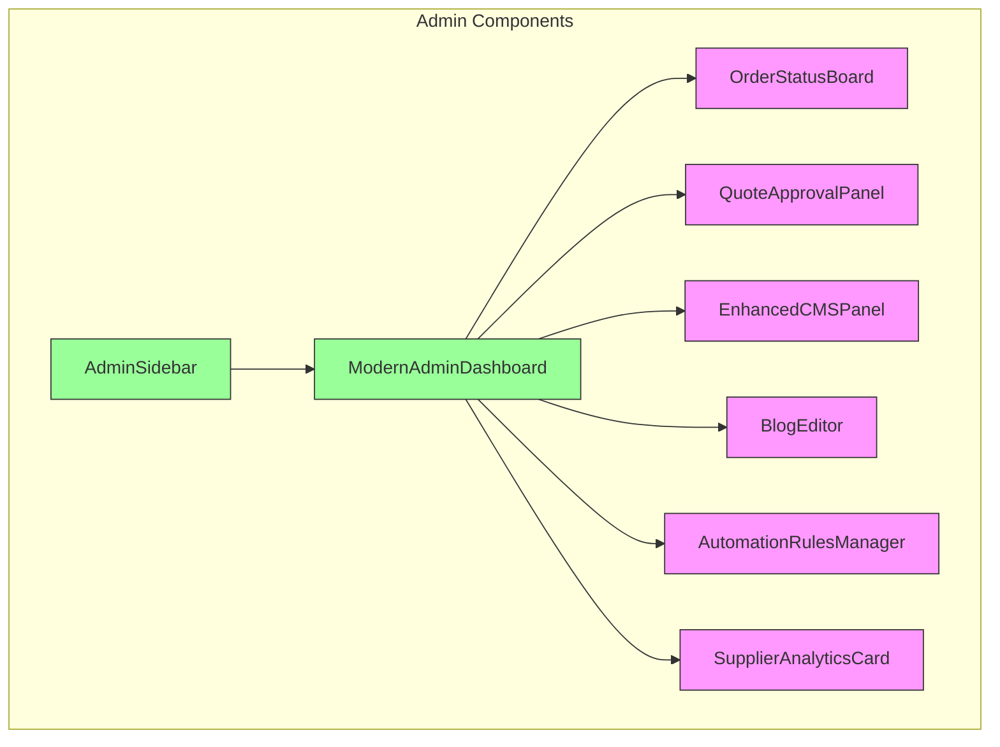
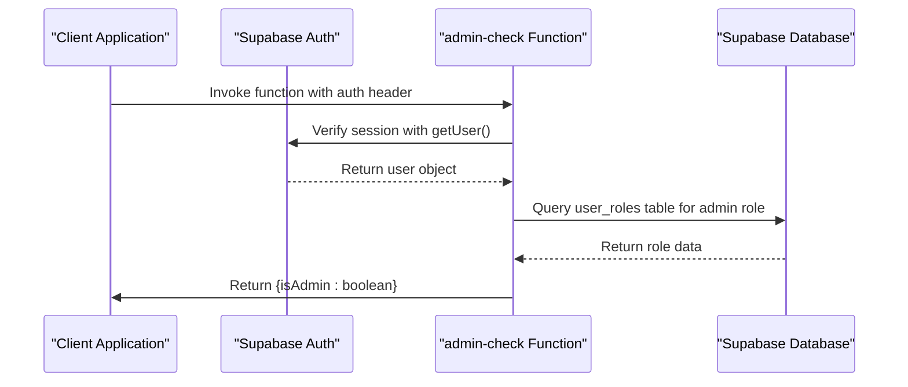
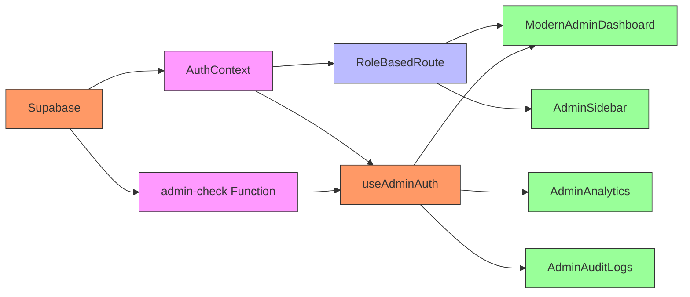

# Admin Access Control

<cite>
**Referenced Files in This Document**   
- [AuthContext.tsx](file://src/contexts/AuthContext.tsx)
- [RoleBasedRoute.tsx](file://src/components/routes/RoleBasedRoute.tsx)
- [ModernAdminDashboard.tsx](file://src/pages/ModernAdminDashboard.tsx)
- [AdminSidebar.tsx](file://src/components/AdminSidebar.tsx)
- [admin-check/index.ts](file://supabase/functions/admin-check/index.ts)
- [useAdminAuth.ts](file://src/hooks/useAdminAuth.ts)
- [App.tsx](file://src/App.tsx)
- [AdminAnalytics.tsx](file://src/pages/AdminAnalytics.tsx)
- [AdminAuditLogs.tsx](file://src/pages/AdminAuditLogs.tsx)
</cite>

## Table of Contents
1. [Introduction](#introduction)
2. [Project Structure](#project-structure)
3. [Core Components](#core-components)
4. [Architecture Overview](#architecture-overview)
5. [Detailed Component Analysis](#detailed-component-analysis)
6. [Dependency Analysis](#dependency-analysis)
7. [Performance Considerations](#performance-considerations)
8. [Troubleshooting Guide](#troubleshooting-guide)
9. [Conclusion](#conclusion)

## Introduction
The Admin Access Control system provides a comprehensive security framework for managing system administrator permissions in the Sleek Apparels platform. This documentation details the multi-layered approach to admin authentication and authorization, which combines client-side role verification with server-side validation to prevent privilege escalation attacks. The system leverages React Context for state management, custom React hooks for authentication logic, and Supabase Edge Functions for secure server-side role verification. Key components include the AuthContext for managing user roles, RoleBasedRoute for protecting routes, and the admin-check Edge Function for validating admin privileges on the server. The ModernAdminDashboard and AdminSidebar components provide exclusive access to system monitoring, user management, and audit logging features for authorized administrators only.

## Project Structure
The Admin Access Control system is organized across multiple directories in the application structure. The core authentication logic resides in the `src/contexts/AuthContext.tsx` file, while route protection components are located in `src/components/routes/`. Admin-specific UI components are organized under `src/components/admin/`, and admin dashboard pages are in `src/pages/admin/`. The server-side validation function is implemented as a Supabase Edge Function in `supabase/functions/admin-check/`. This separation of concerns ensures a clean architecture where client-side components handle user interface and client-side validation, while server-side functions provide the authoritative source of truth for admin privileges.

**Diagram sources**
- [AuthContext.tsx](file://src/contexts/AuthContext.tsx)
- [RoleBasedRoute.tsx](file://src/components/routes/RoleBasedRoute.tsx)
- [useAdminAuth.ts](file://src/hooks/useAdminAuth.ts)
- [ModernAdminDashboard.tsx](file://src/pages/ModernAdminDashboard.tsx)
- [AdminSidebar.tsx](file://src/components/AdminSidebar.tsx)
- [admin-check/index.ts](file://supabase/functions/admin-check/index.ts)
- [App.tsx](file://src/App.tsx)

**Section sources**
- [AuthContext.tsx](file://src/contexts/AuthContext.tsx)
- [RoleBasedRoute.tsx](file://src/components/routes/RoleBasedRoute.tsx)
- [useAdminAuth.ts](file://src/hooks/useAdminAuth.ts)
- [ModernAdminDashboard.tsx](file://src/pages/ModernAdminDashboard.tsx)
- [AdminSidebar.tsx](file://src/components/AdminSidebar.tsx)
- [admin-check/index.ts](file://supabase/functions/admin-check/index.ts)
- [App.tsx](file://src/App.tsx)

## Core Components
The Admin Access Control system consists of several core components that work together to ensure secure access to administrative functionality. The AuthContext provides a centralized state management system for user authentication and role information, exposing an `isAdmin` property that determines whether the current user has administrative privileges. The RoleBasedRoute component acts as a higher-order component that wraps protected routes and checks whether the user has the required roles before rendering the content. The useAdminAuth hook provides a convenient way to check admin status in functional components, while the admin-check Edge Function performs server-side validation of admin privileges. The ModernAdminDashboard serves as the main entry point for administrators, providing access to various administrative tools and analytics.

**Section sources**
- [AuthContext.tsx](file://src/contexts/AuthContext.tsx#L1-L166)
- [RoleBasedRoute.tsx](file://src/components/routes/RoleBasedRoute.tsx#L1-L60)
- [useAdminAuth.ts](file://src/hooks/useAdminAuth.ts#L1-L47)
- [ModernAdminDashboard.tsx](file://src/pages/ModernAdminDashboard.tsx#L1-L559)
- [admin-check/index.ts](file://supabase/functions/admin-check/index.ts#L1-L74)

## Architecture Overview
The Admin Access Control system follows a multi-layered security architecture that validates admin privileges at both the client and server levels. When a user logs in, the AuthContext fetches their role from the database and sets the `isAdmin` property based on whether their role is 'admin'. For admin routes, the RoleBasedRoute component checks this property and only renders the protected content if the user has the required role. Additionally, the useAdminAuth hook performs a server-side validation by invoking the admin-check Edge Function, which independently verifies the user's admin status. This dual verification approach prevents clients from bypassing security checks by manipulating client-side state. The system also includes audit logging for all admin actions, providing a complete trail of administrative activities.

**Diagram sources**
- [AuthContext.tsx](file://src/contexts/AuthContext.tsx#L47-L65)
- [RoleBasedRoute.tsx](file://src/components/routes/RoleBasedRoute.tsx#L24-L58)
- [useAdminAuth.ts](file://src/hooks/useAdminAuth.ts#L14-L43)
- [admin-check/index.ts](file://supabase/functions/admin-check/index.ts#L14-L65)
- [ModernAdminDashboard.tsx](file://src/pages/ModernAdminDashboard.tsx#L123-L558)

## Detailed Component Analysis

### AuthContext Analysis
The AuthContext component provides a centralized authentication state management system for the application. It uses React Context to make authentication data available to all components without prop drilling. The context exposes several key properties including the current user, session, role, and convenience properties like `isAdmin`, `isSupplier`, and `isBuyer`. The context initializes by checking the current session and fetching the user's role from the database. It also sets up a listener for authentication state changes to keep the context updated in real-time.

**Diagram sources**
- [AuthContext.tsx](file://src/contexts/AuthContext.tsx#L17-L162)

**Section sources**
- [AuthContext.tsx](file://src/contexts/AuthContext.tsx#L1-L166)

### RoleBasedRoute Analysis
The RoleBasedRoute component is a higher-order component that protects routes based on user roles or user types. It accepts `allowedRoles` and `allowedUserTypes` props to specify which roles or types can access the protected content. The component first checks if the authentication state is loading, displaying a spinner if so. If the user is not authenticated, it redirects to the authentication page. Otherwise, it evaluates whether the user has the required roles or user types and only renders the children if the user is authorized.

**Diagram sources**
- [RoleBasedRoute.tsx](file://src/components/routes/RoleBasedRoute.tsx#L24-L58)

**Section sources**
- [RoleBasedRoute.tsx](file://src/components/routes/RoleBasedRoute.tsx#L1-L60)

### Admin Dashboard and Sidebar Analysis
The ModernAdminDashboard and AdminSidebar components provide the primary interface for administrators. The dashboard serves as the main entry point, offering an overview of key metrics and quick access to various administrative tools. The sidebar provides navigation to different admin sections such as orders, products, suppliers, analytics, and settings. Both components are protected by the RoleBasedRoute, ensuring that only users with the 'admin' role can access them. The dashboard includes features like order management, supplier analytics, quote approval, CMS management, and blog editing, all exclusively available to administrators.

**Diagram sources**
- [ModernAdminDashboard.tsx](file://src/pages/ModernAdminDashboard.tsx#L123-L558)
- [AdminSidebar.tsx](file://src/components/AdminSidebar.tsx#L29-L68)

**Section sources**
- [ModernAdminDashboard.tsx](file://src/pages/ModernAdminDashboard.tsx#L1-L559)
- [AdminSidebar.tsx](file://src/components/AdminSidebar.tsx#L1-L69)

### Server-Side Validation Analysis
The admin-check Edge Function provides server-side validation of admin privileges, serving as the authoritative source of truth for admin status. This function runs in a secure server environment and cannot be manipulated by clients. It receives the user's authorization token, verifies it with Supabase, and then checks the database directly for the 'admin' role. This server-side check complements the client-side role verification, creating a defense-in-depth security model. Even if a malicious user were to modify the client-side code to set `isAdmin` to true, the server-side validation would still deny access to protected resources.

**Diagram sources**
- [admin-check/index.ts](file://supabase/functions/admin-check/index.ts#L14-L65)
- [useAdminAuth.ts](file://src/hooks/useAdminAuth.ts#L24-L36)

**Section sources**
- [admin-check/index.ts](file://supabase/functions/admin-check/index.ts#L1-L74)
- [useAdminAuth.ts](file://src/hooks/useAdminAuth.ts#L1-L47)

## Dependency Analysis
The Admin Access Control system has a well-defined dependency structure that ensures security and maintainability. The core dependencies include Supabase for authentication and database operations, React Router for navigation, and React Query for data fetching. The AuthContext depends on Supabase to manage authentication state and fetch user roles. The RoleBasedRoute depends on the AuthContext to access the current user's role information. The useAdminAuth hook depends on both the AuthContext and the admin-check Edge Function to provide a comprehensive admin status check. The admin-check Edge Function depends on Supabase to verify the user's session and query the database for role information.

**Diagram sources**
- [AuthContext.tsx](file://src/contexts/AuthContext.tsx#L3-L4)
- [RoleBasedRoute.tsx](file://src/components/routes/RoleBasedRoute.tsx#L3)
- [useAdminAuth.ts](file://src/hooks/useAdminAuth.ts#L2)
- [admin-check/index.ts](file://supabase/functions/admin-check/index.ts#L3)
- [ModernAdminDashboard.tsx](file://src/pages/ModernAdminDashboard.tsx#L3)
- [AdminSidebar.tsx](file://src/components/AdminSidebar.tsx#L1)
- [AdminAnalytics.tsx](file://src/pages/AdminAnalytics.tsx#L3)
- [AdminAuditLogs.tsx](file://src/pages/AdminAuditLogs.tsx#L3)

**Section sources**
- [AuthContext.tsx](file://src/contexts/AuthContext.tsx#L1-L166)
- [RoleBasedRoute.tsx](file://src/components/routes/RoleBasedRoute.tsx#L1-L60)
- [useAdminAuth.ts](file://src/hooks/useAdminAuth.ts#L1-L47)
- [admin-check/index.ts](file://supabase/functions/admin-check/index.ts#L1-L74)
- [ModernAdminDashboard.tsx](file://src/pages/ModernAdminDashboard.tsx#L1-L559)
- [AdminSidebar.tsx](file://src/components/AdminSidebar.tsx#L1-L69)
- [AdminAnalytics.tsx](file://src/pages/AdminAnalytics.tsx#L1-L342)
- [AdminAuditLogs.tsx](file://src/pages/AdminAuditLogs.tsx#L1-L155)

## Performance Considerations
The Admin Access Control system is designed with performance in mind. The AuthContext uses memoization and useCallback to prevent unnecessary re-renders. The RoleBasedRoute component only performs role checks when necessary, avoiding redundant database queries. The useAdminAuth hook caches the result of the admin check to prevent multiple server calls during the same session. The admin-check Edge Function is optimized for fast execution, with direct database queries and minimal processing overhead. Additionally, the system uses React Query for efficient data fetching and caching, reducing the number of network requests and improving response times for admin dashboard components.

**Section sources**
- [AuthContext.tsx](file://src/contexts/AuthContext.tsx#L47-L65)
- [RoleBasedRoute.tsx](file://src/components/routes/RoleBasedRoute.tsx#L24-L58)
- [useAdminAuth.ts](file://src/hooks/useAdminAuth.ts#L6-L46)
- [admin-check/index.ts](file://supabase/functions/admin-check/index.ts#L14-L65)

## Troubleshooting Guide
When troubleshooting issues with the Admin Access Control system, start by verifying the user's role in the database. Ensure that the user has the 'admin' role assigned in the user_roles table. Check the browser console for any errors related to authentication or role verification. Verify that the Supabase client is properly configured and that the admin-check Edge Function is deployed and accessible. If the user is not being recognized as an admin, try refreshing the authentication state by logging out and back in. For server-side validation issues, check the Supabase logs for the admin-check function to see if there are any errors during execution. Ensure that the database query in the admin-check function is correctly filtering for the 'admin' role.

**Section sources**
- [AuthContext.tsx](file://src/contexts/AuthContext.tsx#L47-L65)
- [useAdminAuth.ts](file://src/hooks/useAdminAuth.ts#L14-L43)
- [admin-check/index.ts](file://supabase/functions/admin-check/index.ts#L14-L65)
- [RoleBasedRoute.tsx](file://src/components/routes/RoleBasedRoute.tsx#L24-L58)

## Conclusion
The Admin Access Control system provides a robust and secure framework for managing administrator access in the Sleek Apparels platform. By combining client-side role verification with server-side validation, the system ensures that only authorized users can access sensitive administrative functionality. The modular architecture, with clearly defined components and responsibilities, makes the system maintainable and extensible. The use of React Context for state management, custom hooks for reusable logic, and Supabase Edge Functions for secure server-side operations demonstrates a modern approach to full-stack application security. This multi-layered approach to authentication and authorization effectively prevents privilege escalation attacks while providing a seamless user experience for legitimate administrators.