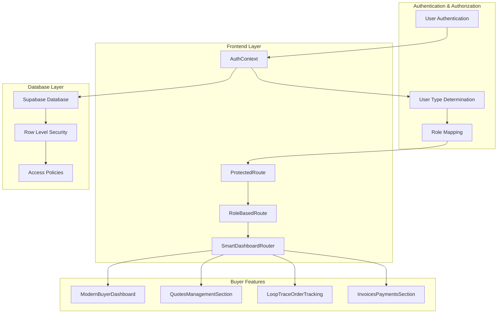
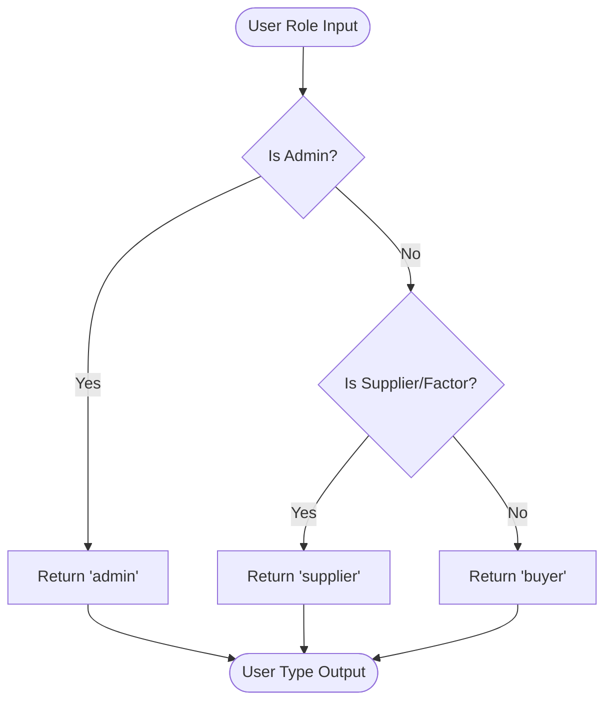
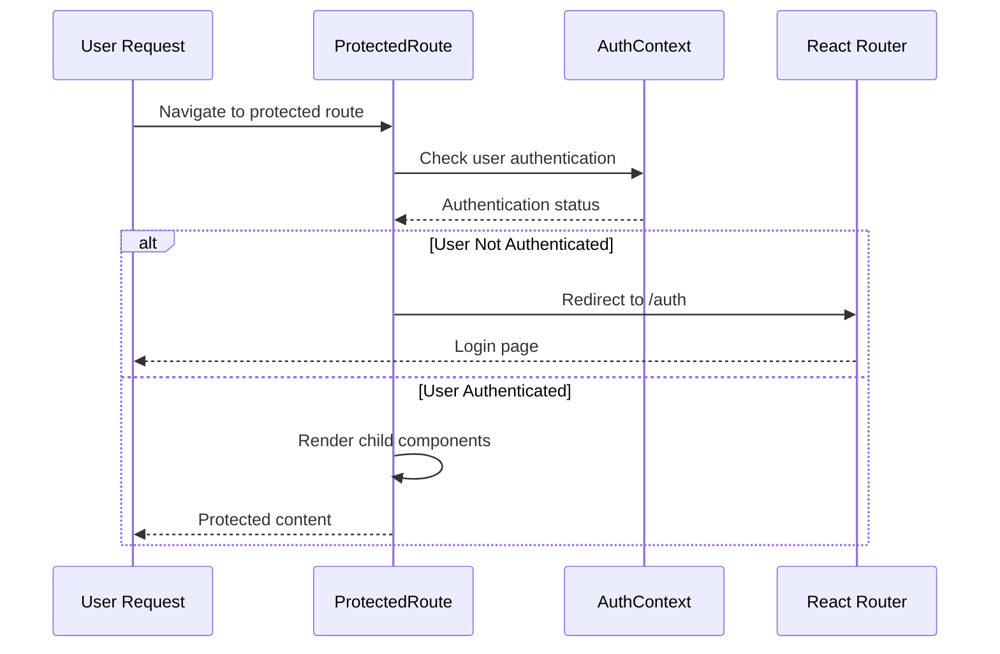
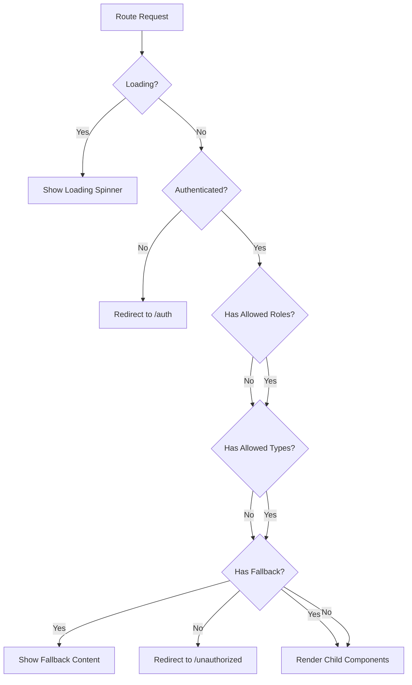
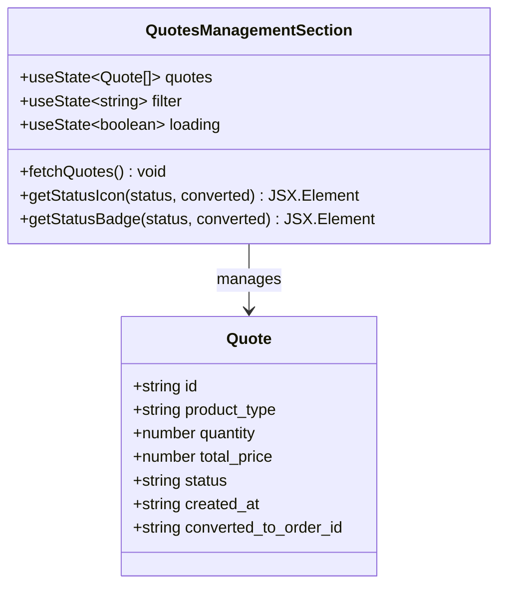
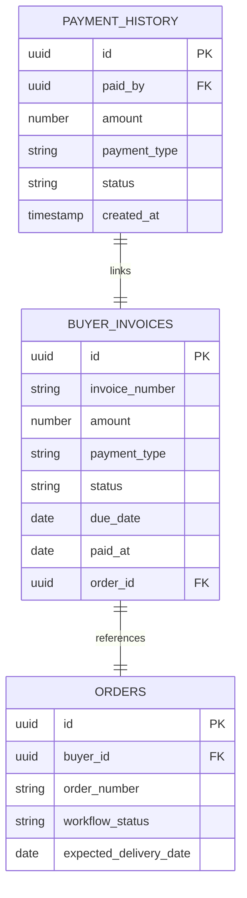

# Buyer Access Control

<cite>
**Referenced Files in This Document**
- [AuthContext.tsx](file://src/contexts/AuthContext.tsx)
- [ProtectedRoute.tsx](file://src/components/routes/ProtectedRoute.tsx)
- [RoleBasedRoute.tsx](file://src/components/routes/RoleBasedRoute.tsx)
- [ModernBuyerDashboard.tsx](file://src/pages/ModernBuyerDashboard.tsx)
- [QuotesManagementSection.tsx](file://src/components/buyer/QuotesManagementSection.tsx)
- [InvoicesPaymentsSection.tsx](file://src/components/buyer/InvoicesPaymentsSection.tsx)
- [LoopTraceOrderTracking.tsx](file://src/components/buyer/LoopTraceOrderTracking.tsx)
- [SmartDashboardRouter.tsx](file://src/components/SmartDashboardRouter.tsx)
- [Unauthorized.tsx](file://src/pages/Unauthorized.tsx)
- [App.tsx](file://src/App.tsx)
- [20251121034427_39244037-33e1-4348-ad98-cd88176e844f.sql](file://supabase/migrations/20251121034427_39244037-33e1-4348-ad98-cd88176e844f.sql)
- [20251115150759_remix_migration_from_pg_dump.sql](file://supabase/migrations/20251115150759_remix_migration_from_pg_dump.sql)
</cite>

## Table of Contents
1. [Introduction](#introduction)
2. [System Architecture](#system-architecture)
3. [Authentication Context](#authentication-context)
4. [Access Control Components](#access-control-components)
5. [Buyer-Specific Features](#buyer-specific-features)
6. [Database Security Policies](#database-security-policies)
7. [Common Access Issues](#common-access-issues)
8. [Best Practices](#best-practices)
9. [Troubleshooting Guide](#troubleshooting-guide)
10. [Conclusion](#conclusion)

## Introduction

The Buyer Access Control system in Sleek Apparels provides comprehensive security and authorization mechanisms to ensure that only authorized buyers can access buyer-specific functionality. The system implements a multi-layered approach combining frontend route protection, user type determination, and robust database-level security policies.

Buyers in this system are categorized into five distinct user types: retailer, wholesaler, educational institution, corporate entity, and sports team. These roles are mapped to the unified buyer user type for simplified access control while maintaining granular permissions at the database level.

## System Architecture

The Buyer Access Control system follows a layered security architecture that protects against unauthorized access attempts and prevents privilege escalation attacks.



**Diagram sources**
- [AuthContext.tsx](file://src/contexts/AuthContext.tsx#L40-L166)
- [ProtectedRoute.tsx](file://src/components/routes/ProtectedRoute.tsx#L14-L36)
- [RoleBasedRoute.tsx](file://src/components/routes/RoleBasedRoute.tsx#L17-L60)
- [SmartDashboardRouter.tsx](file://src/components/SmartDashboardRouter.tsx#L6-L37)

## Authentication Context

The AuthContext serves as the central authentication and authorization hub, managing user state, roles, and access permissions throughout the application.

### User Type Determination

The [`determineUserType`](file://src/contexts/AuthContext.tsx#L67-L74) function is the core mechanism for mapping user roles to buyer categories:



**Diagram sources**
- [AuthContext.tsx](file://src/contexts/AuthContext.tsx#L67-L74)

The function categorizes users as follows:
- **Admin**: Directly returns 'admin' for administrative users
- **Supplier**: Returns 'supplier' for supplier and factory accounts
- **Buyer**: Returns 'buyer' for all retail, wholesale, educational, corporate, and sports team accounts

### Authentication State Management

The AuthContext maintains comprehensive user state including:
- **User Information**: Authentication status, session data, and user profile
- **Role Detection**: Current user role from Supabase user_roles table
- **Type Classification**: Buyer, supplier, or admin user type classification
- **Permission Flags**: Boolean flags for quick permission checks
- **Loading States**: Authentication loading indicators
- **Authentication Actions**: Sign-out and refresh capabilities

**Section sources**
- [AuthContext.tsx](file://src/contexts/AuthContext.tsx#L40-L166)

## Access Control Components

### ProtectedRoute Component

The [`ProtectedRoute`](file://src/components/routes/ProtectedRoute.tsx#L14-L36) component provides basic authentication protection for routes requiring user authentication.



**Diagram sources**
- [ProtectedRoute.tsx](file://src/components/routes/ProtectedRoute.tsx#L14-L36)

### RoleBasedRoute Component

The [`RoleBasedRoute`](file://src/components/routes/RoleBasedRoute.tsx#L17-L60) component provides advanced authorization based on user roles and types.



**Diagram sources**
- [RoleBasedRoute.tsx](file://src/components/routes/RoleBasedRoute.tsx#L17-L60)

The RoleBasedRoute supports flexible authorization:
- **Role-Based Access**: Check specific user roles (admin, supplier, etc.)
- **Type-Based Access**: Check user types (buyer, supplier, admin)
- **Combined Authorization**: Require both role and type conditions
- **Fallback Content**: Display alternative content instead of redirecting
- **Custom Redirects**: Configurable redirect destinations

**Section sources**
- [RoleBasedRoute.tsx](file://src/components/routes/RoleBasedRoute.tsx#L17-L60)

## Buyer-Specific Features

### ModernBuyerDashboard

The [`ModernBuyerDashboard`](file://src/pages/ModernBuyerDashboard.tsx#L32-L578) serves as the primary interface for buyer users, providing comprehensive order management and quote tracking capabilities.

Key features accessible only to buyers:
- **Real-time Order Tracking**: Live production progress monitoring
- **Quote Management**: View and manage AI-generated quotes
- **Order History**: Comprehensive order tracking and history
- **Smart Recommendations**: AI-powered reorder suggestions
- **Payment Integration**: Seamless payment processing

### QuotesManagementSection

The [`QuotesManagementSection`](file://src/components/buyer/QuotesManagementSection.tsx#L22-L195) provides buyer-specific quote management functionality:



**Diagram sources**
- [QuotesManagementSection.tsx](file://src/components/buyer/QuotesManagementSection.tsx#L10-L20)

### LoopTraceOrderTracking

The [`LoopTraceOrderTracking`](file://src/components/buyer/LoopTraceOrderTracking.tsx#L41-L365) component provides real-time production tracking with AI-powered insights:

Features exclusive to buyers:
- **Live Production Updates**: Real-time production stage notifications
- **Stage Progress Tracking**: Detailed production stage completion tracking
- **Supplier Communication**: Direct communication with manufacturing partners
- **Quality Assurance**: Production quality inspection tracking
- **Delivery Predictions**: AI-powered delivery timeline predictions

### InvoicesPaymentsSection

The [`InvoicesPaymentsSection`](file://src/components/buyer/InvoicesPaymentsSection.tsx#L28-L280) handles buyer-specific financial management:



**Diagram sources**
- [InvoicesPaymentsSection.tsx](file://src/components/buyer/InvoicesPaymentsSection.tsx#L11-L26)

**Section sources**
- [ModernBuyerDashboard.tsx](file://src/pages/ModernBuyerDashboard.tsx#L32-L578)
- [QuotesManagementSection.tsx](file://src/components/buyer/QuotesManagementSection.tsx#L22-L195)
- [LoopTraceOrderTracking.tsx](file://src/components/buyer/LoopTraceOrderTracking.tsx#L41-L365)
- [InvoicesPaymentsSection.tsx](file://src/components/buyer/InvoicesPaymentsSection.tsx#L28-L280)

## Database Security Policies

The system implements comprehensive Row Level Security (RLS) policies to prevent unauthorized data access at the database level.

### Buyer Data Isolation

Database policies ensure buyers can only access their own data:

| Policy Name | Table | Purpose | Implementation |
|-------------|-------|---------|----------------|
| Buyers can view their orders | orders | Order visibility | `buyer_id = auth.uid()` |
| Buyers can view their invoices | invoices | Invoice access | `order_id IN (SELECT id FROM orders WHERE buyer_id = auth.uid())` |
| Buyers can view their quotes | ai_quotes | Quote access | `user_id = auth.uid()` |
| Buyers can view their shipping | shipping_info | Shipping tracking | `order_id IN (SELECT id FROM orders WHERE buyer_id = auth.uid())` |
| Buyers can view their defects | defects | Quality tracking | `qc_check_id IN (SELECT id FROM qc_checks WHERE order_id IN (SELECT id FROM orders WHERE buyer_id = auth.uid()))` |

### Role-Based Access Control

The database enforces role-based access through Supabase's `has_role` function:

```sql
-- Example policy enforcement
CREATE POLICY "Buyers can view their own orders"
ON public.orders
FOR SELECT
TO authenticated
USING (buyer_id = auth.uid());

-- Admin-only access
CREATE POLICY "Admins can manage products"
ON public.products
USING (public.has_role(auth.uid(), 'admin'::public.app_role));
```

### Service Role Restrictions

Critical operations are restricted to service_role to prevent abuse:

```sql
-- Secure payment creation
CREATE POLICY "Service role can create payments"
ON public.payment_history
FOR INSERT
TO service_role
WITH CHECK (true);

-- Secure admin actions logging
CREATE POLICY "Service role inserts audit logs"
ON public.admin_audit_logs
FOR INSERT
TO service_role
WITH CHECK (true);
```

**Section sources**
- [20251121034427_39244037-33e1-4348-ad98-cd88176e844f.sql](file://supabase/migrations/20251121034427_39244037-33e1-4348-ad98-cd88176e844f.sql#L1-L35)
- [20251115150759_remix_migration_from_pg_dump.sql](file://supabase/migrations/20251115150759_remix_migration_from_pg_dump.sql#L4022-L4059)

## Common Access Issues

### Unauthorized Access Attempts

Common scenarios where unauthorized access occurs:

#### Scenario 1: Direct URL Manipulation
**Problem**: Users attempting to access `/dashboard` with non-buyer accounts
**Solution**: RoleBasedRoute with `allowedUserTypes={['buyer']}` prevents access

#### Scenario 2: Cross-User Data Access
**Problem**: Attempting to access another buyer's orders or quotes
**Solution**: Database RLS policies enforce data isolation at the SQL level

#### Scenario 3: Privilege Escalation
**Problem**: Suppliers or admins trying to access buyer-specific routes
**Solution**: Multi-layered protection combining frontend and backend controls

### Authentication Failures

Common authentication issues and solutions:

| Issue | Cause | Solution |
|-------|-------|----------|
| Stuck Loading | Network timeout during auth refresh | Implement proper loading states and retry mechanisms |
| Expired Sessions | Long-lived browser sessions | Configure session timeout and automatic refresh |
| Role Mismatch | Incorrect role assignment | Verify user_roles table entries and sync with frontend |
| Permission Denied | Missing database policies | Review and update RLS policies |

### Route Protection Issues

#### Problem: Mixed Protection Levels
**Scenario**: Some routes use ProtectedRoute while others use RoleBasedRoute
**Solution**: Standardize on RoleBasedRoute for consistent authorization

#### Problem: Inconsistent Redirect Behavior
**Scenario**: Different routes redirect to various unauthorized pages
**Solution**: Implement centralized unauthorized handling through the Unauthorized component

**Section sources**
- [Unauthorized.tsx](file://src/pages/Unauthorized.tsx#L8-L108)

## Best Practices

### Frontend Security Implementation

1. **Layered Protection**: Combine ProtectedRoute and RoleBasedRoute for comprehensive security
2. **Centralized Unauthorized Handling**: Use the Unauthorized component for consistent error messaging
3. **Graceful Degradation**: Handle loading states and network failures gracefully
4. **Permission Caching**: Cache user permissions to reduce API calls
5. **Real-time Updates**: Implement WebSocket subscriptions for live data updates

### Backend Security Measures

1. **Database-Level Isolation**: Always implement RLS policies for sensitive data
2. **Service Role Separation**: Restrict critical operations to service_role only
3. **Audit Logging**: Log all access attempts and permission violations
4. **Rate Limiting**: Implement rate limiting on authentication endpoints
5. **Token Validation**: Validate JWT tokens and refresh expired sessions

### Development Guidelines

1. **Secure Defaults**: Assume all routes are private until explicitly marked public
2. **Role Documentation**: Clearly document role requirements for each feature
3. **Testing Coverage**: Test all access control scenarios including edge cases
4. **Security Reviews**: Regularly audit access control implementations
5. **User Feedback**: Provide clear error messages for access denied scenarios

### Monitoring and Maintenance

1. **Access Analytics**: Monitor access patterns and identify suspicious activity
2. **Policy Audits**: Regularly review and update database policies
3. **Performance Monitoring**: Track authentication performance and optimize bottlenecks
4. **Security Alerts**: Implement automated alerts for security violations
5. **Documentation Updates**: Keep access control documentation synchronized with implementation

## Troubleshooting Guide

### Debugging Access Control Issues

#### Step 1: Verify Authentication Status
```typescript
// Check in AuthContext
const { user, role, userType, loading } = useAuth();
console.log({ user, role, userType, loading });
```

#### Step 2: Examine Route Protection
```typescript
// Check route configuration
<Route path="/dashboard" element={
  <RoleBasedRoute allowedUserTypes={['buyer']}>
    <ModernBuyerDashboard />
  </RoleBasedRoute>
} />
```

#### Step 3: Database Policy Verification
```sql
-- Check user's roles
SELECT * FROM user_roles WHERE user_id = auth.uid();

-- Test data access
SET ROLE authenticated;
SELECT * FROM orders WHERE buyer_id = current_setting('request.jwt.claim.sub')::uuid;
```

### Common Error Scenarios

#### Error: "Access Denied" Message
**Cause**: User lacks required permissions or role
**Resolution**: 
1. Verify user role in database
2. Check RoleBasedRoute configuration
3. Review database policies

#### Error: Infinite Loading Spinner
**Cause**: Authentication refresh failure or network issue
**Resolution**:
1. Check network connectivity
2. Verify Supabase configuration
3. Implement retry logic

#### Error: Unexpected Route Access
**Cause**: Frontend and backend protection mismatch
**Resolution**:
1. Align frontend route protection with backend policies
2. Verify database RLS configurations
3. Check service role permissions

### Performance Optimization

#### Authentication Caching
- Implement local storage for authentication state
- Cache user roles and permissions
- Use optimistic updates for permission changes

#### Database Optimization
- Create indexes on frequently queried columns (buyer_id, user_id)
- Optimize RLS policies for large datasets
- Use connection pooling for database queries

**Section sources**
- [AuthContext.tsx](file://src/contexts/AuthContext.tsx#L67-L74)
- [RoleBasedRoute.tsx](file://src/components/routes/RoleBasedRoute.tsx#L17-L60)

## Conclusion

The Buyer Access Control system in Sleek Apparels provides a robust, multi-layered security framework that effectively protects buyer data while enabling seamless user experiences. The combination of frontend route protection, user type determination, and database-level security policies creates a comprehensive defense against unauthorized access attempts and privilege escalation attacks.

Key strengths of the system include:

- **Multi-Factor Authorization**: Combines role-based and type-based access control
- **Database-Level Protection**: Implements Row Level Security for ultimate data isolation
- **Centralized Management**: Uses AuthContext for consistent authentication state
- **Flexible Routing**: Supports various authorization patterns through specialized route components
- **Comprehensive Monitoring**: Provides clear error handling and unauthorized access prevention

The system's design prioritizes both security and usability, ensuring that legitimate buyers can access their data while preventing unauthorized access attempts. Regular security reviews, proper testing, and adherence to security best practices will maintain the system's effectiveness in protecting sensitive buyer information.

Future enhancements could include advanced threat detection, adaptive authentication, and expanded monitoring capabilities to further strengthen the security posture while maintaining excellent user experience.