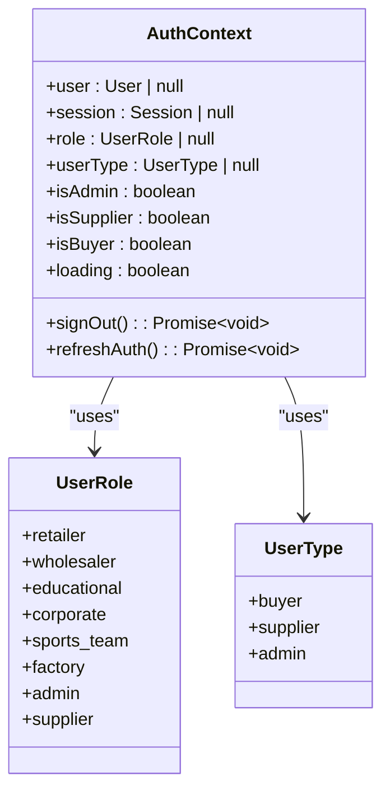
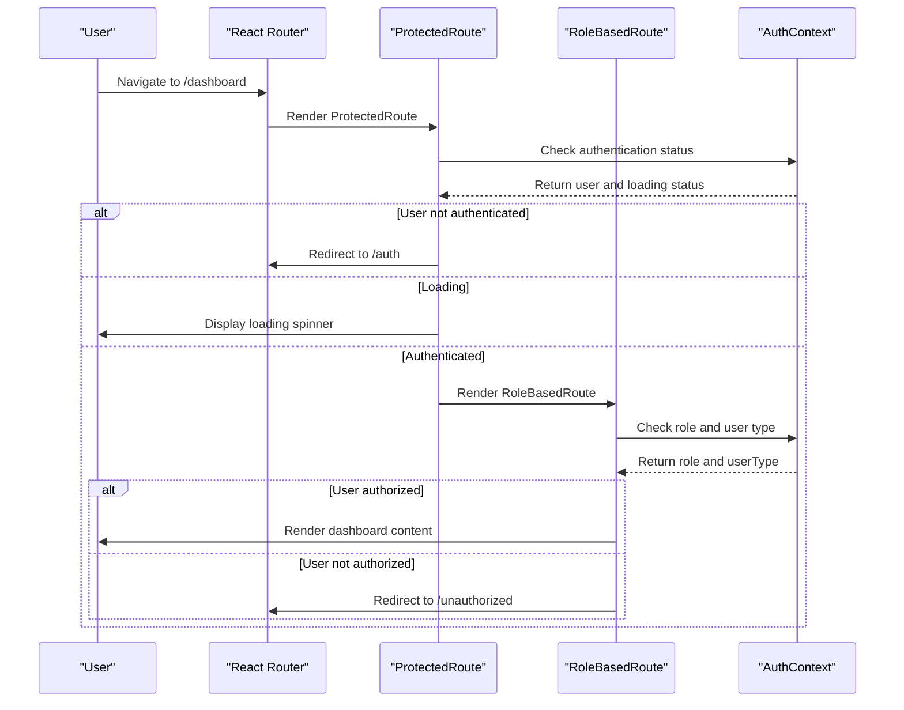
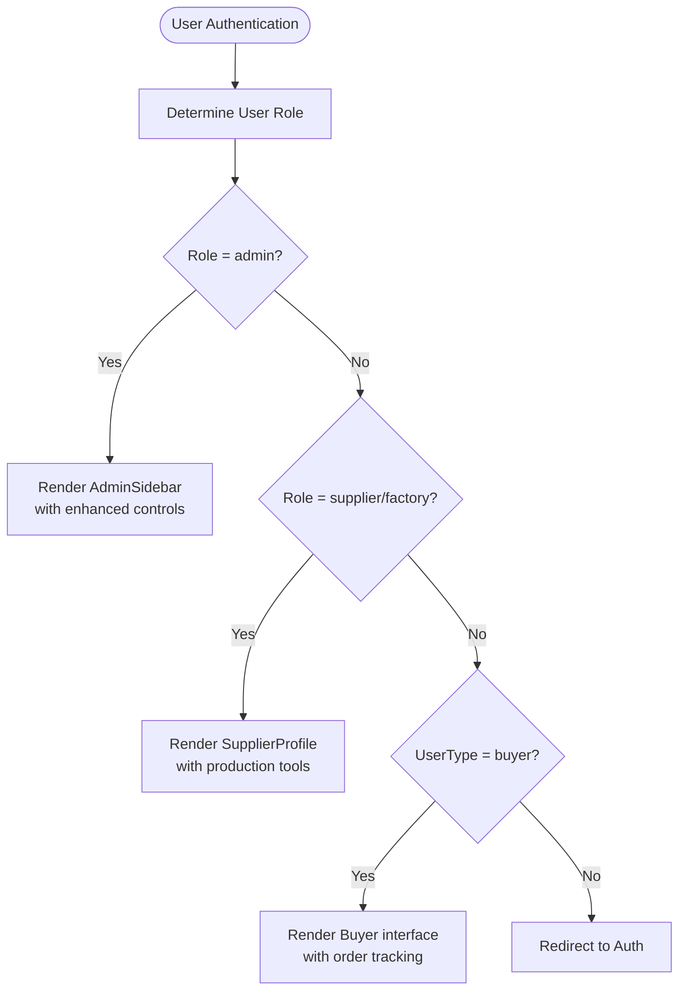
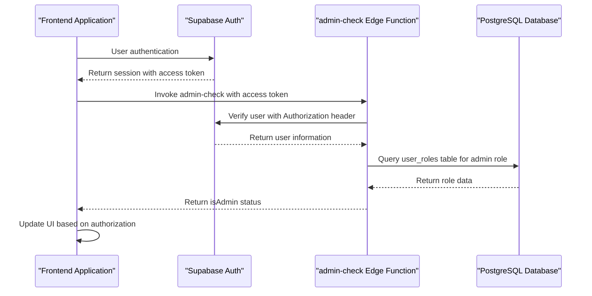

# Role-Based Access Control

<cite>
**Referenced Files in This Document**   
- [AuthContext.tsx](file://src/contexts/AuthContext.tsx)
- [ProtectedRoute.tsx](file://src/components/routes/ProtectedRoute.tsx)
- [RoleBasedRoute.tsx](file://src/components/routes/RoleBasedRoute.tsx)
- [AdminSidebar.tsx](file://src/components/AdminSidebar.tsx)
- [SupplierProfile.tsx](file://src/components/supplier/SupplierProfile.tsx)
- [App.tsx](file://src/App.tsx)
- [useAdminAuth.ts](file://src/hooks/useAdminAuth.ts)
- [SmartDashboardRouter.tsx](file://src/components/SmartDashboardRouter.tsx)
- [admin-check/index.ts](file://supabase/functions/admin-check/index.ts)
</cite>

## Table of Contents
1. [Introduction](#introduction)
2. [Authentication Context Implementation](#authentication-context-implementation)
3. [Route Protection Mechanisms](#route-protection-mechanisms)
4. [User Interface Role Differentiation](#user-interface-role-differentiation)
5. [Backend Validation and Security](#backend-validation-and-security)
6. [Common Issues and Best Practices](#common-issues-and-best-practices)
7. [Conclusion](#conclusion)

## Introduction

The Role-Based Access Control (RBAC) system in the Sleek Apparels application manages permissions for three primary user roles: buyers, suppliers, and administrators. This comprehensive system ensures that users can only access functionality and data appropriate to their role, maintaining security and data integrity throughout the application. The implementation combines frontend React components with backend Supabase authentication and Edge Functions to create a robust access control system that prevents privilege escalation and unauthorized access to sensitive functionality.

The RBAC system is built around several key components: the AuthContext for managing authentication state, ProtectedRoute and RoleBasedRoute components for enforcing access control at the routing level, role-specific UI components that display different functionality based on user role, and backend validation through the admin-check Edge Function. Together, these components create a multi-layered security approach that validates user roles at both the client and server levels.

**Section sources**
- [AuthContext.tsx](file://src/contexts/AuthContext.tsx)
- [App.tsx](file://src/App.tsx)

## Authentication Context Implementation

The AuthContext.tsx file implements the core authentication state management for the application, providing a centralized way to handle user authentication and role determination. The context exports a `useAuth` hook that components can use to access the current user's authentication state and role information.

The authentication context defines two key type unions: `UserRole` and `UserType`. The `UserRole` type includes specific roles such as 'retailer', 'wholesaler', 'educational', 'corporate', 'sports_team', 'factory', 'admin', and 'supplier'. The `UserType` type groups these roles into broader categories: 'buyer', 'supplier', and 'admin'. This two-tiered approach allows for both granular role-based access control and broader user type-based access control.

When a user authenticates, the context automatically fetches their role from the Supabase database by querying the `user_roles` table. The `fetchUserRole` function retrieves the user's role based on their user ID, while the `determineUserType` function maps specific roles to broader user types. For example, roles like 'retailer', 'wholesaler', 'educational', 'corporate', and 'sports_team' are all mapped to the 'buyer' user type, while 'supplier' and 'factory' roles are mapped to the 'supplier' user type.

The context also provides computed properties like `isAdmin`, `isSupplier`, and `isBuyer` as convenient boolean flags that components can use to conditionally render content. These properties are derived from the user's role and user type, making it easy for components to determine what functionality should be available to the current user.

**Diagram sources**
- [AuthContext.tsx](file://src/contexts/AuthContext.tsx#L5-L13)
- [AuthContext.tsx](file://src/contexts/AuthContext.tsx#L15)

**Section sources**
- [AuthContext.tsx](file://src/contexts/AuthContext.tsx#L1-L166)

## Route Protection Mechanisms

The application implements route protection through two specialized components: ProtectedRoute and RoleBasedRoute. These components work together to ensure that users can only access routes appropriate to their authentication status and role.

The ProtectedRoute component serves as the first line of defense, ensuring that only authenticated users can access protected routes. When a user attempts to access a protected route without being authenticated, they are redirected to the authentication page. The component displays a loading spinner while checking the authentication status and handles the redirection with React Router's Navigate component, preserving the original location in the navigation state so users can be redirected back after authentication.

The RoleBasedRoute component provides more granular control by enforcing role-based access to specific routes. It accepts optional arrays of `allowedRoles` and `allowedUserTypes`, allowing routes to be protected based on either specific roles or broader user types. The component evaluates both conditions when present, requiring the user to satisfy both role and user type requirements to access the route. If a user is not authorized, they can either be redirected to a specified route (defaulting to '/unauthorized') or render a fallback component if provided.

In the application's routing configuration (App.tsx), these components are used extensively to protect dashboard routes and administrative functionality. For example, buyer dashboard routes are protected with `allowedUserTypes={['buyer']}`, supplier routes with `allowedUserTypes={['supplier']}`, and admin routes with `allowedRoles={['admin']}`. This approach ensures that users are routed to the appropriate dashboard based on their role while preventing access to functionality outside their permissions.

**Diagram sources**
- [ProtectedRoute.tsx](file://src/components/routes/ProtectedRoute.tsx#L1-L36)
- [RoleBasedRoute.tsx](file://src/components/routes/RoleBasedRoute.tsx#L1-L60)
- [App.tsx](file://src/App.tsx#L181-L311)

**Section sources**
- [ProtectedRoute.tsx](file://src/components/routes/ProtectedRoute.tsx#L1-L36)
- [RoleBasedRoute.tsx](file://src/components/routes/RoleBasedRoute.tsx#L1-L60)
- [App.tsx](file://src/App.tsx#L211-L243)

## User Interface Role Differentiation

The application provides distinct user interfaces for different roles, with specialized components that expose role-appropriate functionality. The AdminSidebar component provides administrators with access to enhanced controls for managing the platform, while the SupplierProfile component gives suppliers tools for managing their production capabilities and company information.

The AdminSidebar component renders a navigation menu with routes to administrative functionality such as order management, product approval, supplier verification, and analytics. The sidebar is only visible to users with the 'admin' role and provides access to sensitive administrative functions that could impact the entire platform. The component uses React Router's useLocation hook to highlight the currently active route and navigate users to different administrative sections.

The SupplierProfile component allows suppliers to manage their company information, production capabilities, and contact details. The component provides an edit mode that enables suppliers to update their profile information, including minimum order quantities, lead times, and workforce size. The interface includes visual indicators for verification status and tier level, providing suppliers with clear feedback on their standing within the platform.

The SmartDashboardRouter component automatically redirects users to the appropriate dashboard based on their role when they access the root dashboard route. This component uses the user's role and user type from the AuthContext to determine whether to redirect to the buyer, supplier, or admin dashboard, ensuring users are taken directly to the interface most relevant to their role.

**Diagram sources**
- [AdminSidebar.tsx](file://src/components/AdminSidebar.tsx#L1-L69)
- [SupplierProfile.tsx](file://src/components/supplier/SupplierProfile.tsx#L1-L333)
- [SmartDashboardRouter.tsx](file://src/components/SmartDashboardRouter.tsx#L1-L49)

**Section sources**
- [AdminSidebar.tsx](file://src/components/AdminSidebar.tsx#L1-L69)
- [SupplierProfile.tsx](file://src/components/supplier/SupplierProfile.tsx#L1-L333)
- [SmartDashboardRouter.tsx](file://src/components/SmartDashboardRouter.tsx#L1-L49)

## Backend Validation and Security

The RBAC system includes backend validation through the admin-check Edge Function, which provides an additional layer of security to prevent privilege escalation. This server-side validation is crucial because client-side role checks could potentially be bypassed by malicious users.

The admin-check Edge Function is a Deno serverless function that runs on the Supabase platform. When invoked, it extracts the Authorization header from the request and uses it to authenticate with the Supabase client. The function then retrieves the user's information and queries the `user_roles` table to check if the user has the 'admin' role. This server-side check ensures that only users with the proper administrative privileges can access protected functionality, even if a malicious user attempts to manipulate client-side role indicators.

The useAdminAuth hook demonstrates how the frontend application integrates with this backend validation. After checking the user's session, the hook invokes the admin-check function with the user's access token. The response from the Edge Function determines whether the user is truly an administrator, providing a trusted source of role information that cannot be manipulated by the client.

The application's database schema includes Row Level Security (RLS) policies that further enforce role-based access at the database level. For example, the migration files show policies that restrict access to tables like `payment_history` and `admin_actions` to the service role only, preventing unauthorized access to sensitive data. The `lead_captures` table has a policy that allows public insertion but restricts reading and updating to authenticated users with the admin role, demonstrating a multi-layered approach to data security.

**Diagram sources**
- [admin-check/index.ts](file://supabase/functions/admin-check/index.ts#L1-L74)
- [useAdminAuth.ts](file://src/hooks/useAdminAuth.ts#L1-L47)
- [20251121001333_f0e74faa-4a90-4b82-a0ae-86267b97afb3.sql](file://supabase/migrations/20251121001333_f0e74faa-4a90-4b82-a0ae-86267b97afb3.sql#L1-L15)
- [20251123052149_create_lead_capture_system.sql](file://supabase/migrations/20251123052149_create_lead_capture_system.sql#L68-L114)

**Section sources**
- [admin-check/index.ts](file://supabase/functions/admin-check/index.ts#L1-L74)
- [useAdminAuth.ts](file://src/hooks/useAdminAuth.ts#L1-L47)
- [20251121001333_f0e74faa-4a90-4b82-a0ae-86267b97afb3.sql](file://supabase/migrations/20251121001333_f0e74faa-4a90-4b82-a0ae-86267b97afb3.sql#L1-L15)
- [20251123052149_create_lead_capture_system.sql](file://supabase/migrations/20251123052149_create_lead_capture_system.sql#L68-L114)

## Common Issues and Best Practices

Implementing a robust Role-Based Access Control system requires attention to several common issues and adherence to security best practices. One common issue is role assignment problems, where users may not receive the correct role during registration or onboarding. The application addresses this through server-side role assignment functions like `assign_admin_role` and `assign_user_role`, which ensure that role changes are properly validated and logged.

Permission errors can occur when users attempt to access functionality they don't have rights to, either due to role changes or bugs in the access control logic. The application handles this by providing clear error messages and redirecting users to appropriate pages, such as the '/unauthorized' route. The use of fallback components in the RoleBasedRoute allows for more nuanced handling of unauthorized access, potentially showing limited functionality or educational content rather than simply blocking access.

Best practices for securing routes include always validating roles on the server side, even when client-side checks are in place. The admin-check Edge Function exemplifies this practice by providing a trusted source of role information that cannot be manipulated by the client. Additionally, sensitive operations should require re-authentication or additional verification, though this specific implementation relies on the Supabase session management for ongoing authentication.

Protecting sensitive data requires a multi-layered approach, combining client-side route protection with server-side RLS policies and function-level security. The application demonstrates this by using RLS policies on database tables, restricting function access to specific roles, and implementing server-side validation for administrative actions. This defense-in-depth strategy ensures that even if one layer is compromised, other layers continue to protect sensitive data and functionality.

Regular security audits and migration scripts that fix overly permissive policies (as seen in the RLS policy migrations) are essential for maintaining a secure RBAC system. The application shows evidence of such audits through migration files that specifically address security issues by removing overly permissive policies and implementing more restrictive ones.

**Section sources**
- [admin-check/index.ts](file://supabase/functions/admin-check/index.ts#L1-L74)
- [useAdminAuth.ts](file://src/hooks/useAdminAuth.ts#L1-L47)
- [20251121001333_f0e74faa-4a90-4b82-a0ae-86267b97afb3.sql](file://supabase/migrations/20251121001333_f0e74faa-4a90-4b82-a0ae-86267b97afb3.sql#L1-L15)
- [20251123052149_create_lead_capture_system.sql](file://supabase/migrations/20251123052149_create_lead_capture_system.sql#L68-L114)

## Conclusion

The Role-Based Access Control system in the Sleek Apparels application provides a comprehensive solution for managing permissions across different user roles. By combining client-side React components with server-side Supabase authentication and Edge Functions, the system creates multiple layers of security that prevent unauthorized access and privilege escalation.

The implementation demonstrates several best practices in access control, including the separation of concerns between authentication and authorization, the use of both granular roles and broader user types, and the critical importance of server-side validation. The ProtectedRoute and RoleBasedRoute components provide flexible mechanisms for protecting routes at different levels of specificity, while the AuthContext centralizes authentication state management for easy consumption by components throughout the application.

The backend validation through the admin-check Edge Function exemplifies the principle of defense in depth, ensuring that role checks cannot be bypassed by manipulating client-side state. Combined with Row Level Security policies in the database, this creates a robust security model that protects sensitive data and functionality.

For future improvements, the system could benefit from more granular role permissions, audit logging of access control decisions, and periodic security reviews to identify and address potential vulnerabilities. However, the current implementation provides a solid foundation for secure role-based access control that effectively manages permissions for buyers, suppliers, and administrators.