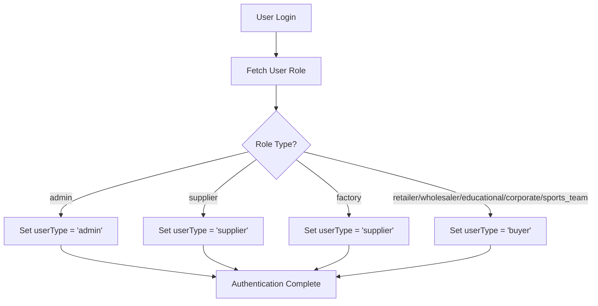
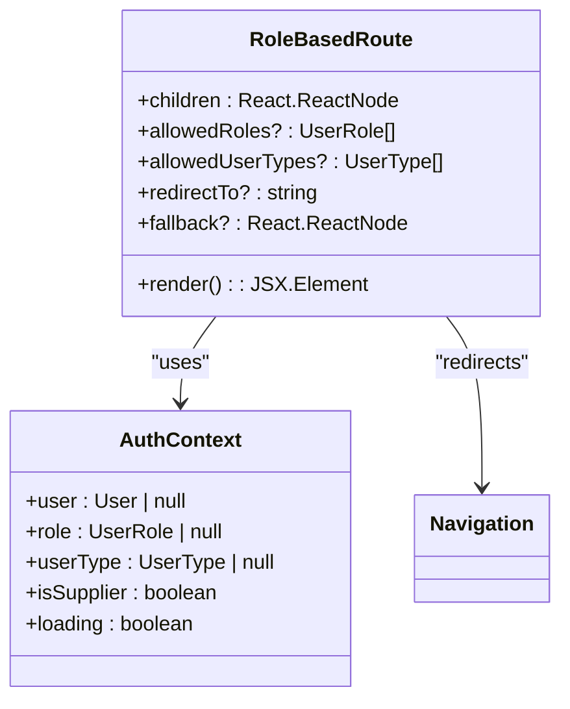
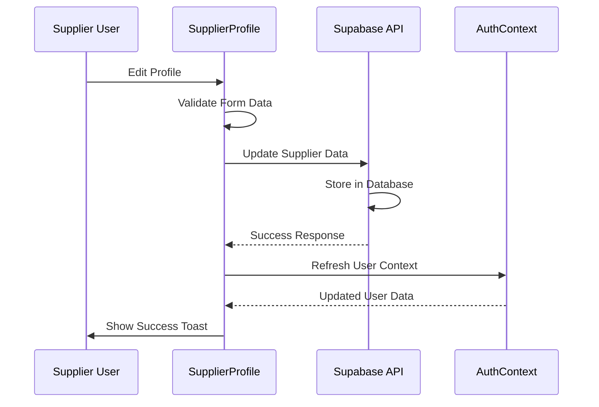
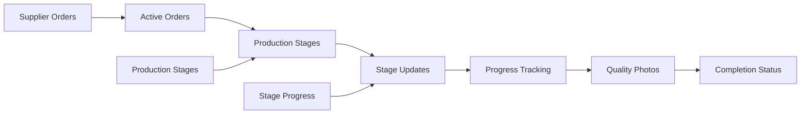
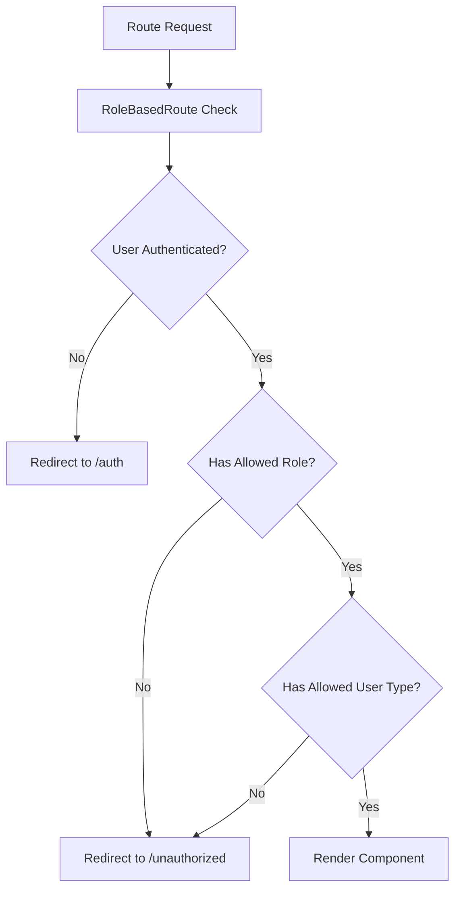
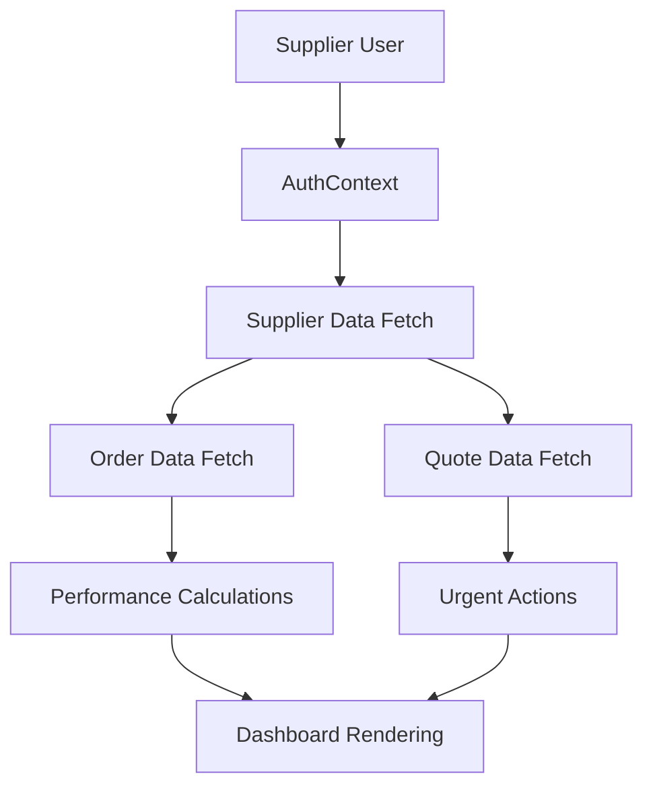
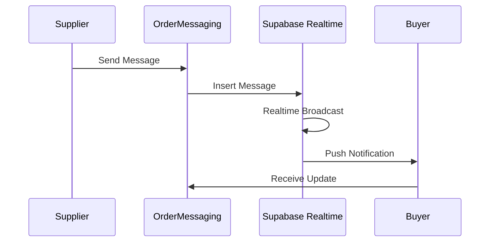
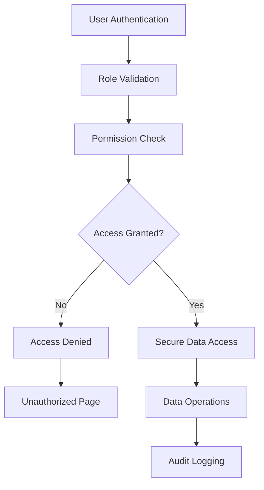

# Supplier Access Control System

<cite>
**Referenced Files in This Document**
- [AuthContext.tsx](file://src/contexts/AuthContext.tsx)
- [RoleBasedRoute.tsx](file://src/components/routes/RoleBasedRoute.tsx)
- [ModernSupplierDashboard.tsx](file://src/pages/ModernSupplierDashboard.tsx)
- [SupplierProfile.tsx](file://src/components/supplier/SupplierProfile.tsx)
- [ProductionManagementPanel.tsx](file://src/components/supplier/ProductionManagementPanel.tsx)
- [OrderMessaging.tsx](file://src/components/supplier/OrderMessaging.tsx)
- [CommunicationCenter.tsx](file://src/components/shared/CommunicationCenter.tsx)
- [useSupplierOrders.ts](file://src/hooks/useSupplierOrders.ts)
- [App.tsx](file://src/App.tsx)
- [Unauthorized.tsx](file://src/pages/Unauthorized.tsx)
</cite>

## Table of Contents
1. [Introduction](#introduction)
2. [Authentication Context Architecture](#authentication-context-architecture)
3. [Role-Based Access Control System](#role-based-access-control-system)
4. [Supplier-Specific Components](#supplier-specific-components)
5. [Protected Routes Implementation](#protected-routes-implementation)
6. [Supplier Dashboard Features](#supplier-dashboard-features)
7. [Communication Security](#communication-security)
8. [Best Practices and Security Guidelines](#best-practices-and-security-guidelines)
9. [Common Issues and Solutions](#common-issues-and-solutions)
10. [Implementation Examples](#implementation-examples)

## Introduction

The Supplier Access Control system in the Sleek Apparels platform provides comprehensive role-based authentication and authorization mechanisms specifically designed for manufacturing suppliers. This system ensures that supplier-specific functionality is securely restricted to authorized users while maintaining seamless access for legitimate supplier accounts.

The system operates on a dual-layer approach: user type determination (buyer vs supplier vs admin) and role-based permissions, with special emphasis on protecting sensitive supplier data and enabling secure communication channels.

## Authentication Context Architecture

The authentication system is built around the `AuthContext` which serves as the central authority for user authentication state and role determination.

### User Type Determination

The system distinguishes between different user types through the `determineUserType` function:



**Diagram sources**
- [AuthContext.tsx](file://src/contexts/AuthContext.tsx#L67-L74)

### Role Property Evaluation

The `isSupplier` property in the AuthContext is determined through a straightforward comparison:

```typescript
const isSupplier = role === 'supplier' || role === 'factory';
```

This property enables immediate supplier-specific functionality access throughout the application.

**Section sources**
- [AuthContext.tsx](file://src/contexts/AuthContext.tsx#L147-L149)

## Role-Based Access Control System

### RoleBasedRoute Component

The `RoleBasedRoute` component provides granular access control with support for both role-based and user-type-based restrictions:



**Diagram sources**
- [RoleBasedRoute.tsx](file://src/components/routes/RoleBasedRoute.tsx#L5-L11)
- [AuthContext.tsx](file://src/contexts/AuthContext.tsx#L17-L30)

### Access Control Logic

The component implements a sophisticated authorization check:

1. **Loading State**: Displays spinner while authentication resolves
2. **Authentication Check**: Redirects unauthenticated users to login
3. **Role Validation**: Validates against allowed roles
4. **User Type Validation**: Validates against allowed user types
5. **Authorization Decision**: Requires both role and user type conditions to pass

**Section sources**
- [RoleBasedRoute.tsx](file://src/components/routes/RoleBasedRoute.tsx#L17-L59)

## Supplier-Specific Components

### Supplier Profile Management

The `SupplierProfile` component provides comprehensive supplier profile management with real-time validation and verification status tracking:



**Diagram sources**
- [SupplierProfile.tsx](file://src/components/supplier/SupplierProfile.tsx#L55-L89)

### Production Management Panel

The `ProductionManagementPanel` enables suppliers to manage production stages with real-time progress tracking:



**Diagram sources**
- [ProductionManagementPanel.tsx](file://src/components/supplier/ProductionManagementPanel.tsx#L38-L100)

**Section sources**
- [SupplierProfile.tsx](file://src/components/supplier/SupplierProfile.tsx#L18-L333)
- [ProductionManagementPanel.tsx](file://src/components/supplier/ProductionManagementPanel.tsx#L38-L325)

## Protected Routes Implementation

### Routing Configuration

The application defines several protected routes specifically for suppliers:

| Route Path | Protection Level | Purpose |
|------------|------------------|---------|
| `/supplier-dashboard-modern` | `allowedUserTypes={['supplier']}` | Main supplier dashboard |
| `/supplier-dashboard` | `allowedUserTypes={['supplier']}` | Legacy supplier dashboard |
| `/supplier/products` | `allowedUserTypes={['supplier']}` | Product management |
| `/supplier/orders/:orderId` | `allowedUserTypes={['supplier']}` | Order detail view |

### Route Protection Mechanism



**Diagram sources**
- [App.tsx](file://src/App.tsx#L221-L224)

**Section sources**
- [App.tsx](file://src/App.tsx#L220-L224)

## Supplier Dashboard Features

### Modern Supplier Dashboard

The `ModernSupplierDashboard` provides a comprehensive supplier experience with gamification and performance tracking:

#### Key Features:
- **Performance Scoring**: Real-time performance metrics with tier-based rewards
- **Order Management**: Active order tracking with urgency indicators
- **Capacity Planning**: Production capacity utilization monitoring
- **Achievement System**: Gamified rewards for on-time deliveries and quality performance

#### Data Flow Architecture:



**Diagram sources**
- [ModernSupplierDashboard.tsx](file://src/pages/ModernSupplierDashboard.tsx#L98-L115)

**Section sources**
- [ModernSupplierDashboard.tsx](file://src/pages/ModernSupplierDashboard.tsx#L98-L660)

## Communication Security

### Secure Messaging Systems

The platform implements multiple layers of secure communication:

#### Order-Level Messaging
The `OrderMessaging` component provides real-time, encrypted communication between suppliers and buyers:



**Diagram sources**
- [OrderMessaging.tsx](file://src/components/supplier/OrderMessaging.tsx#L16-L78)

#### General Communication Center
The `CommunicationCenter` provides broader messaging capabilities with file attachment support:

- **End-to-End Encryption**: Messages encrypted during transmission
- **File Attachment Security**: Secure file storage with access controls
- **Real-time Updates**: WebSocket-based real-time messaging
- **Attachment Validation**: File type and size restrictions

**Section sources**
- [OrderMessaging.tsx](file://src/components/supplier/OrderMessaging.tsx#L16-L136)
- [CommunicationCenter.tsx](file://src/components/shared/CommunicationCenter.tsx#L28-L200)

## Best Practices and Security Guidelines

### Data Protection Strategies

1. **Principle of Least Privilege**: Suppliers only access functionality relevant to their role
2. **Data Segregation**: Supplier data isolated from buyer and admin views
3. **Real-time Monitoring**: Continuous monitoring of access patterns
4. **Audit Trails**: Comprehensive logging of all supplier actions

### Security Implementation Patterns



### Recommended Implementation Practices

1. **Always Use Role-Based Routes**: Never expose supplier functionality without proper protection
2. **Validate Permissions Client-Side**: Use `isSupplier` property for immediate feedback
3. **Implement Real-time Monitoring**: Monitor access patterns for anomalies
4. **Regular Security Audits**: Conduct periodic reviews of access controls

## Common Issues and Solutions

### Unauthorized Access Prevention

#### Issue: Buyer Accessing Supplier Pages
**Symptoms**: Buyers attempting to access `/supplier-dashboard` or related routes
**Solution**: Implement strict `allowedUserTypes={['supplier']}` protection

#### Issue: Factory Accounts Misclassified
**Symptoms**: Factory users unable to access supplier functionality
**Solution**: Verify `role === 'factory'` is included in `isSupplier` evaluation

#### Issue: Stale Authentication State
**Symptoms**: Users seeing outdated permission levels after role changes
**Solution**: Implement `refreshAuth()` calls on role modification events

### Data Security Concerns

#### Issue: Exposure of Buyer Pricing Data
**Symptoms**: Suppliers accessing confidential buyer pricing information
**Solution**: Implement data masking and separate pricing APIs for different user types

#### Issue: Cross-Contamination of Supplier Data
**Symptoms**: Supplier A viewing Supplier B's production data
**Solution**: Implement strict data isolation with user ID-based filtering

### Communication Security Issues

#### Issue: Unauthorized Message Access
**Symptoms**: Suppliers viewing messages intended for other suppliers
**Solution**: Implement message encryption and access control validation

#### Issue: File Upload Vulnerabilities
**Symptoms**: Malicious file uploads through messaging system
**Solution**: Implement comprehensive file validation and scanning

**Section sources**
- [Unauthorized.tsx](file://src/pages/Unauthorized.tsx#L8-L108)

## Implementation Examples

### Basic Supplier Route Protection

```typescript
// Example: Protecting a supplier-specific page
<Route path="/supplier-dashboard" element={
  <RoleBasedRoute allowedUserTypes={['supplier']}>
    <ModernSupplierDashboard />
  </RoleBasedRoute>
} />
```

### Supplier-Specific Component Usage

```typescript
// Example: Conditional rendering based on supplier status
const SupplierFeature = () => {
  const { isSupplier, user } = useAuth();
  
  if (!isSupplier) {
    return <Navigate to="/unauthorized" />;
  }
  
  return (
    <div>
      <h1>Welcome, Supplier {user?.email}</h1>
      <ProductionManagementPanel supplierId={user.id} />
    </div>
  );
};
```

### Secure Messaging Implementation

```typescript
// Example: Secure order messaging with validation
const SecureOrderMessaging = ({ orderId }) => {
  const { isSupplier } = useAuth();
  
  if (!isSupplier) {
    return <div>Access denied</div>;
  }
  
  return (
    <OrderMessaging 
      orderId={orderId} 
      isAdmin={false} 
    />
  );
};
```

### Production Data Access Control

```typescript
// Example: Supplier order data access with security
const SupplierOrderData = ({ supplierId }) => {
  const { isSupplier, userType } = useAuth();
  
  // Verify supplier status and prevent unauthorized access
  if (!isSupplier || userType !== 'supplier') {
    throw new Error('Unauthorized access');
  }
  
  return (
    <ProductionManagementPanel supplierId={supplierId} />
  );
};
```

These examples demonstrate the secure implementation patterns for supplier access control, ensuring that all supplier-specific functionality is properly protected while maintaining optimal user experience.