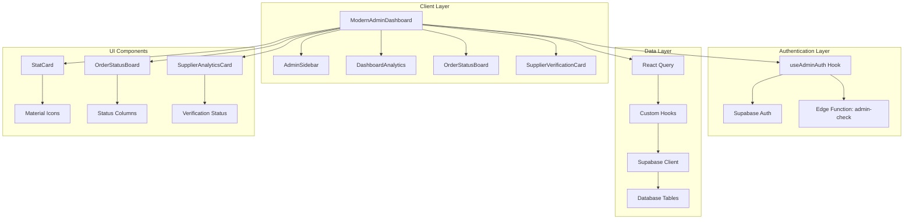
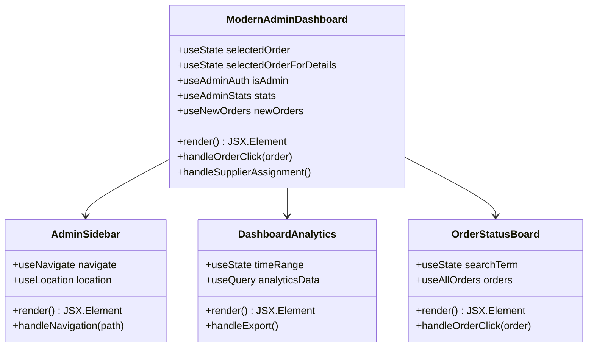
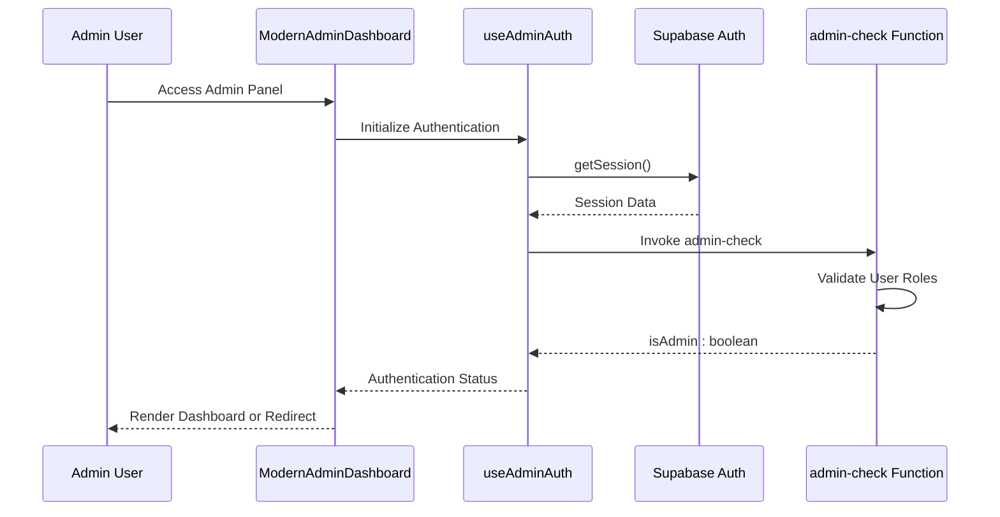
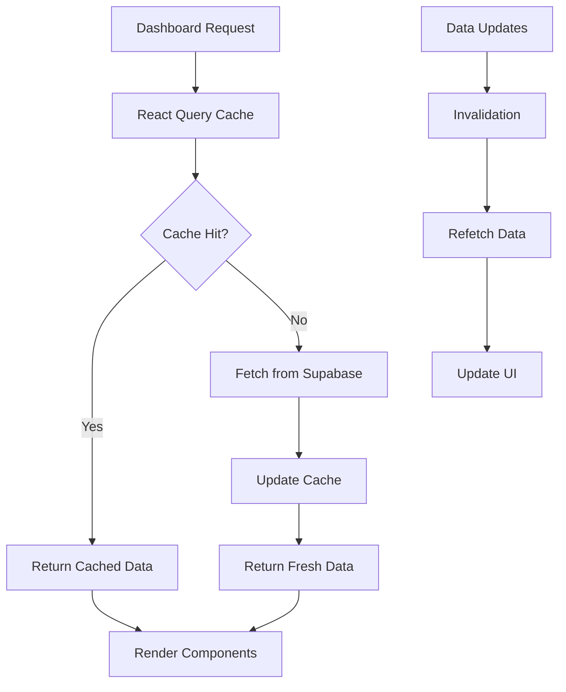
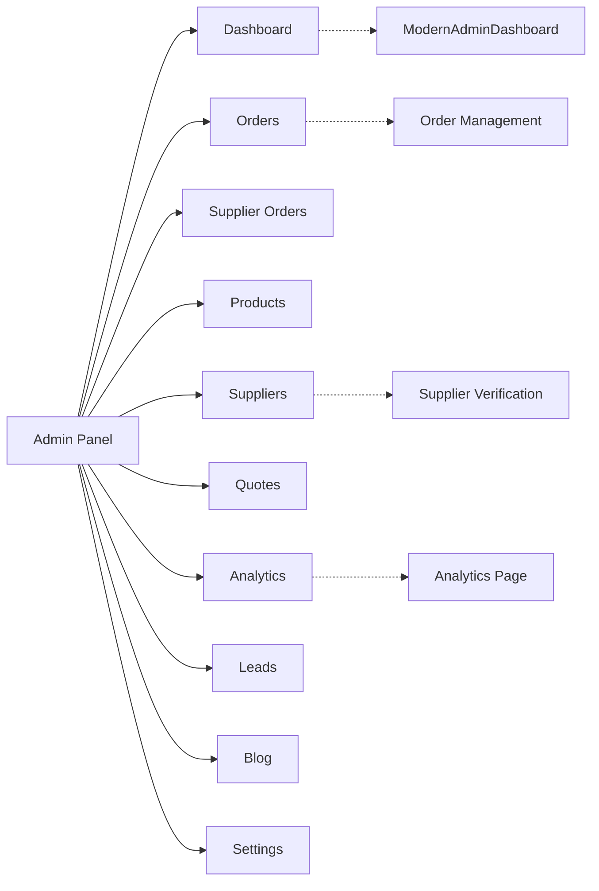
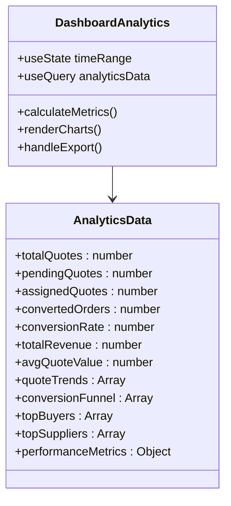
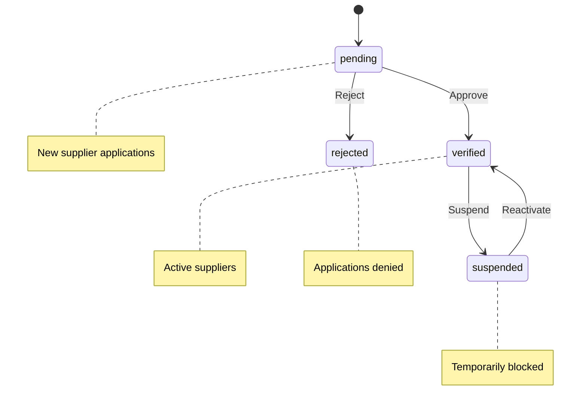
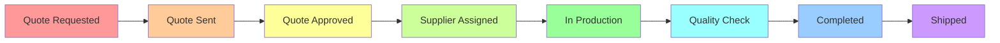

# Admin Dashboard

<cite>
**Referenced Files in This Document**
- [ModernAdminDashboard.tsx](file://src/pages/ModernAdminDashboard.tsx)
- [AdminSidebar.tsx](file://src/components/AdminSidebar.tsx)
- [DashboardAnalytics.tsx](file://src/components/admin/DashboardAnalytics.tsx)
- [OrderStatusBoard.tsx](file://src/components/admin/OrderStatusBoard.tsx)
- [SupplierVerificationCard.tsx](file://src/components/admin/SupplierVerificationCard.tsx)
- [useAdminAuth.ts](file://src/hooks/useAdminAuth.ts)
- [StatCard.tsx](file://src/components/modern/StatCard.tsx)
- [SupplierAnalyticsCard.tsx](file://src/components/admin/SupplierAnalyticsCard.tsx)
- [AdminLayout.tsx](file://src/pages/admin/AdminLayout.tsx)
- [SupplierVerification.tsx](file://src/pages\admin\SupplierVerification.tsx)
- [AdminSupplierOrderDetail.tsx](file://src/pages\admin\AdminSupplierOrderDetail.tsx)
</cite>

## Table of Contents
1. [Introduction](#introduction)
2. [System Architecture](#system-architecture)
3. [Core Components](#core-components)
4. [Authentication & Authorization](#authentication--authorization)
5. [Data Integration Patterns](#data-integration-patterns)
6. [Navigation & Routing](#navigation--routing)
7. [Analytics & Monitoring](#analytics--monitoring)
8. [Supplier Management](#supplier-management)
9. [Order Management](#order-management)
10. [Common Use Cases](#common-use-cases)
11. [Troubleshooting Guide](#troubleshooting-guide)
12. [Best Practices](#best-practices)

## Introduction

The ModernAdminDashboard serves as the central hub for platform administrators to oversee system operations, manage users, monitor performance, and ensure operational compliance. Built with React and TypeScript, it provides a comprehensive suite of tools for managing suppliers, orders, analytics, and system health monitoring.

The dashboard implements a role-based access control system with server-side validation, ensuring only authorized administrators can access sensitive administrative functions. It integrates with multiple data sources through custom hooks and provides real-time insights through interactive charts and status boards.

## System Architecture

The ModernAdminDashboard follows a modular architecture with clear separation of concerns:

**Diagram sources**
- [ModernAdminDashboard.tsx](file://src/pages/ModernAdminDashboard.tsx#L1-L559)
- [useAdminAuth.ts](file://src/hooks/useAdminAuth.ts#L1-L47)
- [AdminSidebar.tsx](file://src/components/AdminSidebar.tsx#L1-L69)

**Section sources**
- [ModernAdminDashboard.tsx](file://src/pages/ModernAdminDashboard.tsx#L1-L50)
- [AdminLayout.tsx](file://src/pages\admin\AdminLayout.tsx#L1-L43)

## Core Components

### ModernAdminDashboard

The main dashboard component orchestrates the entire admin interface, providing a unified view of system metrics, recent activities, and quick actions.

**Diagram sources**
- [ModernAdminDashboard.tsx](file://src/pages/ModernAdminDashboard.tsx#L123-L559)
- [AdminSidebar.tsx](file://src/components\AdminSidebar.tsx#L29-L69)
- [DashboardAnalytics.tsx](file://src/components\admin\DashboardAnalytics.tsx#L82-L784)
- [OrderStatusBoard.tsx](file://src/components\admin\OrderStatusBoard.tsx#L149-L222)

### StatCard Components

The dashboard utilizes specialized StatCard components for displaying key metrics with animated transitions and trend indicators.

**Section sources**
- [ModernAdminDashboard.tsx](file://src/pages\ModernAdminDashboard.tsx#L55-L121)
- [StatCard.tsx](file://src/components\modern\StatCard.tsx#L1-L111)

## Authentication & Authorization

### Role-Based Access Control

The system implements robust authentication using the `useAdminAuth` hook, which performs server-side validation through Supabase Edge Functions.

**Diagram sources**
- [useAdminAuth.ts](file://src/hooks\useAdminAuth.ts#L14-L46)
- [ModernAdminDashboard.tsx](file://src/pages\ModernAdminDashboard.tsx#L126-L153)

### Authentication Implementation

The authentication system validates admin privileges through multiple layers:

1. **Client-Side Session Check**: Verifies user session existence
2. **Server-Side Validation**: Uses Supabase Edge Functions for secure role verification
3. **Permission Enforcement**: Blocks unauthorized access attempts

**Section sources**
- [useAdminAuth.ts](file://src/hooks\useAdminAuth.ts#L1-L47)
- [AdminLayout.tsx](file://src/pages\admin\AdminLayout.tsx#L10-L24)

## Data Integration Patterns

### Custom Query Hooks

The dashboard leverages React Query for efficient data fetching and caching:

**Diagram sources**
- [ModernAdminDashboard.tsx](file://src/pages\ModernAdminDashboard.tsx#L130-L133)
- [DashboardAnalytics.tsx](file://src/components\admin\DashboardAnalytics.tsx#L99-L102)

### Data Aggregation Patterns

The system aggregates data from multiple sources to provide comprehensive insights:

| Data Source | Purpose | Aggregation Method |
|-------------|---------|-------------------|
| Orders Table | Order statistics, revenue tracking | Count, sum, average calculations |
| Suppliers Table | Supplier verification status | Status filtering and counting |
| Quotes Table | Quote conversion metrics | Funnel analysis and conversion rates |
| Profiles Table | User role and activity tracking | Role-based filtering |

**Section sources**
- [DashboardAnalytics.tsx](file://src/components\admin\DashboardAnalytics.tsx#L99-L281)
- [SupplierAnalyticsCard.tsx](file://src/components\admin\SupplierAnalyticsCard.tsx#L9-L29)

## Navigation & Routing

### Admin Sidebar Navigation

The AdminSidebar provides intuitive navigation with active state highlighting and responsive design:

**Diagram sources**
- [AdminSidebar.tsx](file://src/components\AdminSidebar.tsx#L16-L27)

### Protected Routes

The AdminLayout component ensures all admin routes are protected:

**Section sources**
- [AdminSidebar.tsx](file://src/components\AdminSidebar.tsx#L1-L69)
- [AdminLayout.tsx](file://src/pages\admin\AdminLayout.tsx#L1-L43)

## Analytics & Monitoring

### DashboardAnalytics Component

The DashboardAnalytics component provides comprehensive system insights through interactive charts and metrics:

**Diagram sources**
- [DashboardAnalytics.tsx](file://src/components\admin\DashboardAnalytics.tsx#L37-L784)

### Key Performance Indicators

The analytics system tracks essential KPIs:

| Metric Category | Key Indicators | Calculation Method |
|----------------|----------------|-------------------|
| Order Performance | Total orders, conversion rate, average response time | Aggregated from orders and quotes tables |
| Supplier Health | Verified suppliers, pending applications, rejection rate | Status-based filtering and counting |
| Financial Metrics | Total revenue, average quote value, margin analysis | Revenue calculations with cost data |
| Operational Efficiency | Assignment time, fulfillment rate, supplier utilization | Workflow tracking and completion rates |

**Section sources**
- [DashboardAnalytics.tsx](file://src/components\admin\DashboardAnalytics.tsx#L130-L281)

## Supplier Management

### SupplierVerificationCard

The SupplierVerificationCard enables administrators to review and approve supplier applications:

**Diagram sources**
- [SupplierVerificationCard.tsx](file://src/components\admin\SupplierVerificationCard.tsx#L37-L212)

### Supplier Analytics

The SupplierAnalyticsCard provides real-time supplier status monitoring:

**Section sources**
- [SupplierVerificationCard.tsx](file://src/components\admin\SupplierVerificationCard.tsx#L1-L212)
- [SupplierAnalyticsCard.tsx](file://src/components\admin\SupplierAnalyticsCard.tsx#L1-L100)

## Order Management

### OrderStatusBoard

The OrderStatusBoard provides a Kanban-style view of order workflows:

**Diagram sources**
- [OrderStatusBoard.tsx](file://src/components\admin\OrderStatusBoard.tsx#L178-L187)

### Order Details Management

The system provides comprehensive order tracking and management capabilities:

**Section sources**
- [OrderStatusBoard.tsx](file://src/components\admin\OrderStatusBoard.tsx#L1-L222)
- [AdminSupplierOrderDetail.tsx](file://src/pages\admin\AdminSupplierOrderDetail.tsx#L1-L196)

## Common Use Cases

### Verifying New Suppliers

Administrators can efficiently review and approve supplier applications through the SupplierVerification interface:

1. **Browse Pending Applications**: View all pending supplier registrations
2. **Review Details**: Examine supplier information, specializations, and contact details
3. **Make Decisions**: Approve, reject, or suspend supplier accounts
4. **Provide Feedback**: Supply rejection reasons via integrated email notifications

### Investigating Delayed Orders

The OrderStatusBoard enables administrators to identify and address order bottlenecks:

1. **Visual Workflow Tracking**: Monitor orders across all workflow stages
2. **Identify Bottlenecks**: Spot orders stuck in specific stages
3. **Take Action**: Assign orders manually or investigate delays
4. **Track Progress**: Monitor resolution of order issues

### Analyzing Platform Performance

The analytics dashboard provides insights into system performance and business metrics:

1. **Real-Time Metrics**: View current system statistics and trends
2. **Historical Analysis**: Compare performance across different time periods
3. **Conversion Funnel**: Analyze quote-to-order conversion rates
4. **Supplier Performance**: Evaluate supplier reliability and quality

**Section sources**
- [SupplierVerification.tsx](file://src/pages\admin\SupplierVerification.tsx#L1-L187)
- [OrderStatusBoard.tsx](file://src/components\admin\OrderStatusBoard.tsx#L149-L222)

## Troubleshooting Guide

### Permission Access Failures

**Issue**: Users receive access denied messages despite having admin credentials.

**Solution**: 
1. Verify user role in the `user_roles` table
2. Clear browser cache and cookies
3. Check Edge Function permissions in Supabase
4. Validate JWT token expiration

### Data Inconsistency Across Views

**Issue**: Different views show conflicting data or missing updates.

**Solution**:
1. Invalidate React Query cache using `queryClient.invalidateQueries()`
2. Check database triggers and relationships
3. Verify real-time subscription connections
4. Review data synchronization timing

### Slow Performance Issues

**Issue**: Dashboard loads slowly or becomes unresponsive.

**Solutions**:
1. Optimize database queries with proper indexing
2. Implement pagination for large datasets
3. Reduce concurrent API calls
4. Enable data caching with appropriate TTL

**Section sources**
- [useAdminAuth.ts](file://src/hooks\useAdminAuth.ts#L31-L40)
- [ModernAdminDashboard.tsx](file://src/pages\ModernAdminDashboard.tsx#L126-L153)

## Best Practices

### Security Considerations

1. **Server-Side Validation**: Always validate permissions on the server side
2. **Role-Based Access**: Implement least-privilege access controls
3. **Audit Logging**: Maintain comprehensive audit trails for all admin actions
4. **Secure Authentication**: Use strong authentication mechanisms with token refresh

### Performance Optimization

1. **Efficient Queries**: Use selective field queries and proper indexing
2. **Data Caching**: Leverage React Query for intelligent caching
3. **Pagination**: Implement pagination for large datasets
4. **Lazy Loading**: Load components and data on demand

### User Experience

1. **Responsive Design**: Ensure mobile-friendly layouts
2. **Loading States**: Provide clear feedback during data operations
3. **Error Handling**: Display meaningful error messages
4. **Accessibility**: Follow WCAG guidelines for accessibility

### Maintenance and Monitoring

1. **Regular Testing**: Implement automated testing for admin functionality
2. **Performance Monitoring**: Track key performance indicators
3. **Error Tracking**: Monitor and resolve errors promptly
4. **Documentation**: Maintain up-to-date technical documentation

**Section sources**
- [useAdminAuth.ts](file://src/hooks\useAdminAuth.ts#L1-L47)
- [ModernAdminDashboard.tsx](file://src/pages\ModernAdminDashboard.tsx#L1-L559)