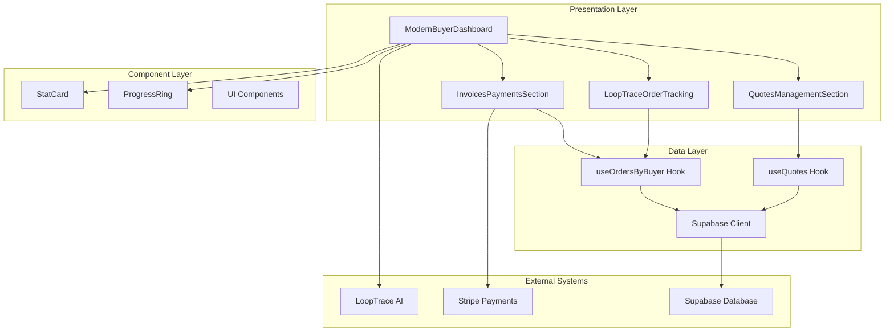
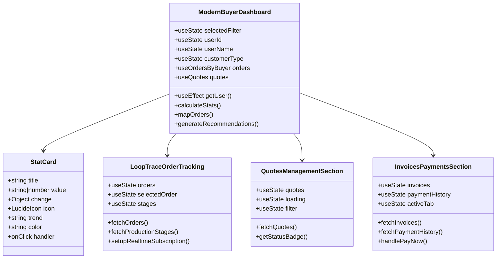
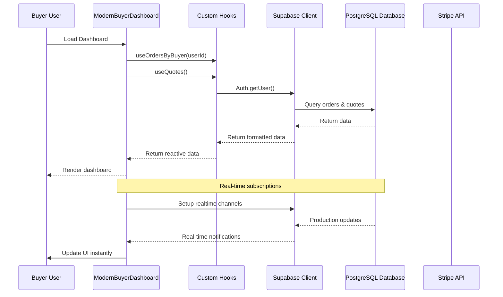
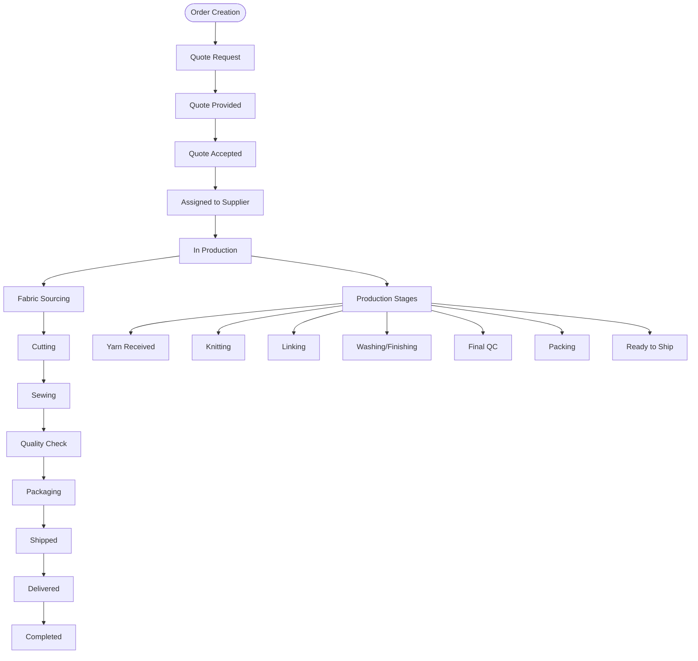
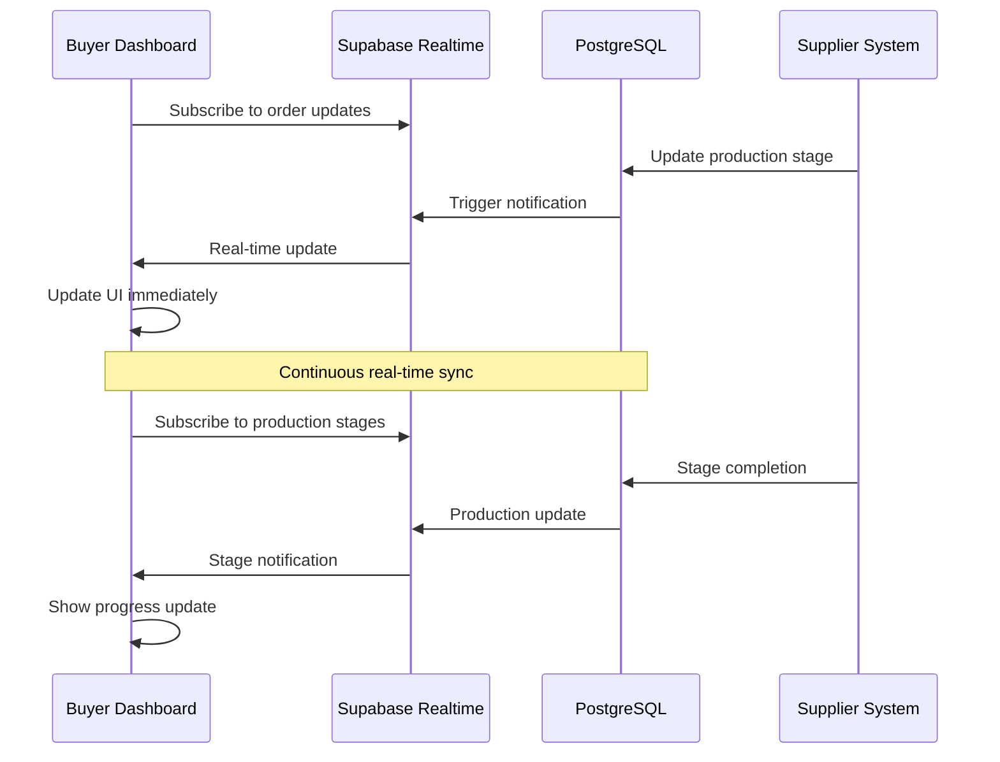

# Buyer Dashboard

<cite>
**Referenced Files in This Document**
- [ModernBuyerDashboard.tsx](file://src/pages/ModernBuyerDashboard.tsx)
- [InvoicesPaymentsSection.tsx](file://src/components/buyer/InvoicesPaymentsSection.tsx)
- [LoopTraceOrderTracking.tsx](file://src/components/buyer/LoopTraceOrderTracking.tsx)
- [QuotesManagementSection.tsx](file://src/components/buyer/QuotesManagementSection.tsx)
- [StatCard.tsx](file://src/components/modern/StatCard.tsx)
- [ProgressRing.tsx](file://src/components/modern/ProgressRing.tsx)
- [useQuotes.ts](file://src/hooks/useQuotes.ts)
- [useOrders.ts](file://src/hooks/queries/useOrders.ts)
- [database.ts](file://src/types/database.ts)
- [supabaseHelpers.ts](file://src/lib/supabaseHelpers.ts)
</cite>

## Table of Contents
1. [Introduction](#introduction)
2. [Architecture Overview](#architecture-overview)
3. [Core Components](#core-components)
4. [Data Flow and Integration](#data-flow-and-integration)
5. [Technical Implementation](#technical-implementation)
6. [Real-Time Features](#real-time-features)
7. [Common Use Cases](#common-use-cases)
8. [Troubleshooting Guide](#troubleshooting-guide)
9. [Best Practices](#best-practices)
10. [Conclusion](#conclusion)

## Introduction

The ModernBuyerDashboard serves as the central hub for buyers to manage their entire order lifecycle, from initial quote requests to final delivery tracking. Built with React and TypeScript, this dashboard provides real-time visibility into order status, quote history, and financial obligations through an intuitive interface that combines modern design principles with powerful functionality.

The dashboard integrates seamlessly with the LoopTrace™ AI system to deliver intelligent insights, automated recommendations, and streamlined workflows that enhance the buyer experience. It serves as the primary interface for fashion brands, educational institutions, corporate clients, sports teams, and wholesalers managing their apparel production needs.

## Architecture Overview

The ModernBuyerDashboard follows a modular architecture pattern with clear separation of concerns between presentation, data fetching, and business logic layers.

**Diagram sources**
- [ModernBuyerDashboard.tsx](file://src/pages/ModernBuyerDashboard.tsx#L1-L584)
- [InvoicesPaymentsSection.tsx](file://src/components/buyer/InvoicesPaymentsSection.tsx#L1-L280)
- [LoopTraceOrderTracking.tsx](file://src/components/buyer/LoopTraceOrderTracking.tsx#L1-L360)
- [QuotesManagementSection.tsx](file://src/components/buyer/QuotesManagementSection.tsx#L1-L191)

**Section sources**
- [ModernBuyerDashboard.tsx](file://src/pages/ModernBuyerDashboard.tsx#L1-L50)
- [database.ts](file://src/types/database.ts#L1-L50)

## Core Components

### ModernBuyerDashboard Main Component

The main dashboard component orchestrates the entire buyer experience, managing user authentication, data fetching, and state management across all sections.

**Diagram sources**
- [ModernBuyerDashboard.tsx](file://src/pages/ModernBuyerDashboard.tsx#L31-L100)
- [StatCard.tsx](file://src/components/modern/StatCard.tsx#L7-L20)
- [LoopTraceOrderTracking.tsx](file://src/components/buyer/LoopTraceOrderTracking.tsx#L41-L60)
- [QuotesManagementSection.tsx](file://src/components/buyer/QuotesManagementSection.tsx#L22-L30)
- [InvoicesPaymentsSection.tsx](file://src/components/buyer/InvoicesPaymentsSection.tsx#L28-L40)

### StatCard Component

The StatCard component provides visually appealing key performance indicators with animated transitions and contextual icons.

**Key Features:**
- Dynamic color theming based on metric importance
- Animated value transitions with counter animation
- Trend indicators with percentage changes
- Click-to-navigate functionality
- Responsive design with hover effects

**Section sources**
- [StatCard.tsx](file://src/components/modern/StatCard.tsx#L1-L111)

### LoopTraceOrderTracking Component

This component delivers real-time production tracking with stage-by-stage monitoring and progress visualization.

**Core Capabilities:**
- Multi-order selection with timeline visualization
- Real-time production stage updates via WebSocket subscriptions
- Progress calculation across multiple production stages
- Automated notifications for production milestones
- Supplier information integration

**Section sources**
- [LoopTraceOrderTracking.tsx](file://src/components/buyer/LoopTraceOrderTracking.tsx#L1-L360)

### QuotesManagementSection Component

Manages the complete quote lifecycle from creation to conversion to orders.

**Functional Areas:**
- Quote filtering by status (all, draft, approved, converted)
- PDF download capabilities
- Status badges with visual indicators
- Conversion workflows to orders
- Historical quote tracking

**Section sources**
- [QuotesManagementSection.tsx](file://src/components/buyer/QuotesManagementSection.tsx#L1-L191)

### InvoicesPaymentsSection Component

Handles all financial aspects including invoice management and payment processing.

**Payment Features:**
- Invoice generation and management
- Payment history tracking
- Stripe integration for secure payments
- Due date management
- PDF invoice downloads

**Section sources**
- [InvoicesPaymentsSection.tsx](file://src/components/buyer/InvoicesPaymentsSection.tsx#L1-L280)

## Data Flow and Integration

The dashboard implements a sophisticated data flow architecture that ensures real-time updates and reliable data synchronization.

**Diagram sources**
- [ModernBuyerDashboard.tsx](file://src/pages/ModernBuyerDashboard.tsx#L79-L82)
- [useOrders.ts](file://src/hooks/queries/useOrders.ts#L43-L53)
- [useQuotes.ts](file://src/hooks/useQuotes.ts#L56-L80)

### Authentication and Authorization

The dashboard implements robust authentication with automatic session management and role-based access control.

**Authentication Flow:**
1. User authentication via Supabase Auth
2. Session validation and user profile retrieval
3. Customer type detection for personalized experiences
4. Automatic redirection for unauthorized access
5. Token refresh and session persistence

**Section sources**
- [ModernBuyerDashboard.tsx](file://src/pages/ModernBuyerDashboard.tsx#L38-L77)

### Data Fetching Patterns

The dashboard employs several data fetching patterns optimized for performance and user experience:

**1. Reactive Queries:**
- Real-time data synchronization via React Query
- Automatic re-fetching on data changes
- Optimistic updates for immediate feedback
- Error boundary handling

**2. Selective Loading:**
- Lazy loading of expensive components
- Progressive data loading for large datasets
- Pagination support for extensive histories

**3. Caching Strategies:**
- Intelligent caching with cache invalidation
- Background revalidation for stale data
- Memory-efficient data structures

**Section sources**
- [useOrders.ts](file://src/hooks/queries/useOrders.ts#L1-L152)
- [useQuotes.ts](file://src/hooks/useQuotes.ts#L1-L261)

## Technical Implementation

### Order Management System

The order management system provides comprehensive tracking capabilities with multiple status levels and production stage monitoring.

**Diagram sources**
- [database.ts](file://src/types/database.ts#L8-L17)
- [database.ts](file://src/types/database.ts#L19-L26)

### Production Stage Tracking

The production tracking system monitors each manufacturing phase with detailed progress indicators and timeline management.

**Production Stages:**
- **Yarn Received**: Initial material intake
- **Knitting**: Fabric creation process
- **Linking**: Assembly preparation
- **Washing/Finishing**: Quality treatment
- **Final QC**: Quality assurance
- **Packing**: Preparation for shipment
- **Ready to Ship**: Final readiness

**Progress Calculation:**
The system calculates overall progress by averaging completion percentages across all active stages, providing a comprehensive view of production status.

**Section sources**
- [LoopTraceOrderTracking.tsx](file://src/components/buyer/LoopTraceOrderTracking.tsx#L191-L212)

### Quote Management System

The quote management system handles AI-generated quotes with sophisticated filtering and conversion capabilities.

**Quote Lifecycle:**
1. **Draft**: Initial quote creation
2. **Pending**: Under review
3. **Approved**: Accepted by buyer
4. **Rejected**: Declined by buyer
5. **Converted**: Transformed to order

**Quote Data Structure:**
- Product specifications and quantities
- Pricing calculations with breakdowns
- Estimated delivery timelines
- Supplier matchings
- Customization details

**Section sources**
- [QuotesManagementSection.tsx](file://src/components/buyer/QuotesManagementSection.tsx#L10-L20)
- [useQuotes.ts](file://src/hooks/useQuotes.ts#L5-L35)

### Financial Management Integration

The financial management system integrates with Stripe for secure payment processing and provides comprehensive invoice management.

**Payment Features:**
- **Invoice Generation**: Automatic invoice creation upon order completion
- **Payment Tracking**: Real-time payment status monitoring
- **Due Date Management**: Automated reminders and overdue tracking
- **Multi-Currency Support**: International payment capabilities
- **Payment History**: Comprehensive transaction records

**Section sources**
- [InvoicesPaymentsSection.tsx](file://src/components/buyer/InvoicesPaymentsSection.tsx#L1-L100)

## Real-Time Features

### WebSocket Subscriptions

The dashboard implements real-time updates through Supabase's Postgres Realtime capabilities, ensuring buyers receive instant notifications about order and production changes.

**Diagram sources**
- [LoopTraceOrderTracking.tsx](file://src/components/buyer/LoopTraceOrderTracking.tsx#L58-L119)
- [useRealtimeMessages.ts](file://src/hooks/useRealtimeMessages.ts#L17-L61)

### Notification System

The dashboard provides intelligent notifications for key events:

**Production Notifications:**
- New stage initiation alerts
- Completion percentage updates
- Quality check notifications
- Shipping confirmations

**Financial Notifications:**
- Payment due reminders
- Invoice availability alerts
- Payment confirmation messages
- Overdue payment warnings

**Quote Notifications:**
- Quote approval status changes
- Supplier response updates
- Price adjustment notifications

**Section sources**
- [LoopTraceOrderTracking.tsx](file://src/components/buyer/LoopTraceOrderTracking.tsx#L85-L108)

### Performance Optimization

The dashboard implements several performance optimization strategies:

**1. Lazy Loading:**
- Conditional rendering of expensive components
- Dynamic imports for non-critical features
- Progressive enhancement for core functionality

**2. Memoization:**
- React.memo for component optimization
- useMemo for expensive calculations
- useCallback for event handlers

**3. Virtualization:**
- Large list virtualization for performance
- Infinite scrolling for historical data
- Pagination for extensive records

## Common Use Cases

### Monitoring Active Orders

Buyers can efficiently monitor their active orders through multiple perspectives:

**1. Filtered View:**
- **All Orders**: Complete order history
- **Active Orders**: Currently in production
- **Pending Orders**: Awaiting approval or fulfillment

**2. Progress Tracking:**
- Visual progress bars for each order
- Current production stage identification
- Estimated delivery date tracking
- Days remaining countdown

**3. Quick Actions:**
- Direct navigation to order details
- Immediate access to tracking information
- Fast reordering capabilities

### Reviewing Pending Quotes

The quote management system enables buyers to efficiently review and act on pending quotes:

**Quote Review Process:**
1. **Status Filtering**: Filter by draft, pending, or approved quotes
2. **Comparison View**: Side-by-side quote comparisons
3. **Supplier Information**: View supplier ratings and capabilities
4. **Conversion Workflow**: Easy conversion to orders

**Smart Recommendations:**
The dashboard provides intelligent recommendations based on purchase history:
- Reorder suggestions for frequently purchased items
- Seasonal product recommendations
- Price comparison alerts
- Inventory level recommendations

### Tracking Payment Deadlines

Financial management features help buyers stay on top of payment obligations:

**Payment Tracking Features:**
- **Due Date Alerts**: Automatic reminders for upcoming payments
- **Payment History**: Comprehensive transaction records
- **Invoice Management**: Centralized invoice access
- **Payment Status**: Real-time payment confirmation

**Late Payment Prevention:**
- Overdue payment warnings
- Automated payment reminders
- Flexible payment scheduling
- Payment plan options

**Section sources**
- [ModernBuyerDashboard.tsx](file://src/pages/ModernBuyerDashboard.tsx#L366-L584)
- [InvoicesPaymentsSection.tsx](file://src/components/buyer/InvoicesPaymentsSection.tsx#L1-L280)

## Troubleshooting Guide

### Common Issues and Solutions

**Authentication Problems:**
- **Issue**: Users redirected to login screen unexpectedly
- **Solution**: Verify network connectivity and Supabase configuration
- **Prevention**: Implement proper session validation and error handling

**Data Loading Issues:**
- **Issue**: Dashboard loads slowly or shows empty states
- **Solution**: Check network connectivity and database performance
- **Prevention**: Implement loading states and error boundaries

**Real-Time Updates Not Working:**
- **Issue**: Production updates not appearing in real-time
- **Solution**: Verify WebSocket connections and subscription setup
- **Prevention**: Implement connection health checks and reconnection logic

**Payment Processing Errors:**
- **Issue**: Stripe payment failures or timeouts
- **Solution**: Verify payment method validity and network stability
- **Prevention**: Implement payment method validation and retry mechanisms

### Debugging Tools

**1. Console Logging:**
- Enable detailed logging for API calls
- Monitor WebSocket connection status
- Track component re-render cycles

**2. Network Monitoring:**
- Inspect API request/response times
- Monitor WebSocket connection health
- Track authentication token validity

**3. State Inspection:**
- Use React DevTools for state debugging
- Monitor query cache effectiveness
- Track component performance metrics

**Section sources**
- [ModernBuyerDashboard.tsx](file://src/pages/ModernBuyerDashboard.tsx#L38-L77)
- [LoopTraceOrderTracking.tsx](file://src/components/buyer/LoopTraceOrderTracking.tsx#L118-L120)

### Error Handling Strategies

The dashboard implements comprehensive error handling across all components:

**1. Graceful Degradation:**
- Fallback UI components for failed requests
- Static data loading for temporary failures
- Offline mode capabilities

**2. User Feedback:**
- Clear error messages with actionable guidance
- Loading states during data fetching
- Success confirmation for completed actions

**3. Recovery Mechanisms:**
- Automatic retry with exponential backoff
- Manual refresh options for persistent failures
- Session restoration after authentication issues

## Best Practices

### Performance Optimization

**1. Efficient Data Fetching:**
- Use selective field queries to minimize data transfer
- Implement proper caching strategies
- Leverage pagination for large datasets

**2. Component Optimization:**
- Implement proper memoization for expensive computations
- Use React.lazy for code splitting
- Optimize rendering cycles with shouldComponentUpdate

**3. Memory Management:**
- Clean up subscriptions and event listeners
- Implement proper cleanup in useEffect hooks
- Monitor memory usage for long-running sessions

### Security Considerations

**1. Authentication Security:**
- Implement proper session validation
- Use secure storage for authentication tokens
- Enforce proper authorization checks

**2. Data Protection:**
- Encrypt sensitive data in transit and at rest
- Implement proper CORS policies
- Sanitize user inputs and prevent XSS attacks

**3. Access Control:**
- Role-based access control implementation
- Proper validation of user permissions
- Secure API endpoint protection

### User Experience Guidelines

**1. Accessibility:**
- Implement proper ARIA labels and keyboard navigation
- Ensure sufficient color contrast ratios
- Provide alternative text for images

**2. Mobile Responsiveness:**
- Implement responsive design patterns
- Optimize touch targets and gestures
- Ensure proper viewport configuration

**3. Performance:**
- Implement lazy loading for non-critical content
- Use efficient image compression and optimization
- Minimize bundle sizes through tree shaking

## Conclusion

The ModernBuyerDashboard represents a comprehensive solution for buyer order management, combining real-time data synchronization, intelligent recommendations, and seamless financial integration. Its modular architecture ensures scalability and maintainability while providing an exceptional user experience through modern design principles and cutting-edge technology.

The dashboard's strength lies in its ability to transform complex production workflows into intuitive, actionable insights that empower buyers to make informed decisions quickly. Through its integration with LoopTrace™ AI and real-time production tracking, buyers gain unprecedented visibility into their order lifecycles, enabling better planning, improved communication, and enhanced operational efficiency.

Future enhancements could include expanded AI-driven insights, mobile application support, and integration with additional supply chain partners, further solidifying the dashboard's position as a leading solution for apparel production management.