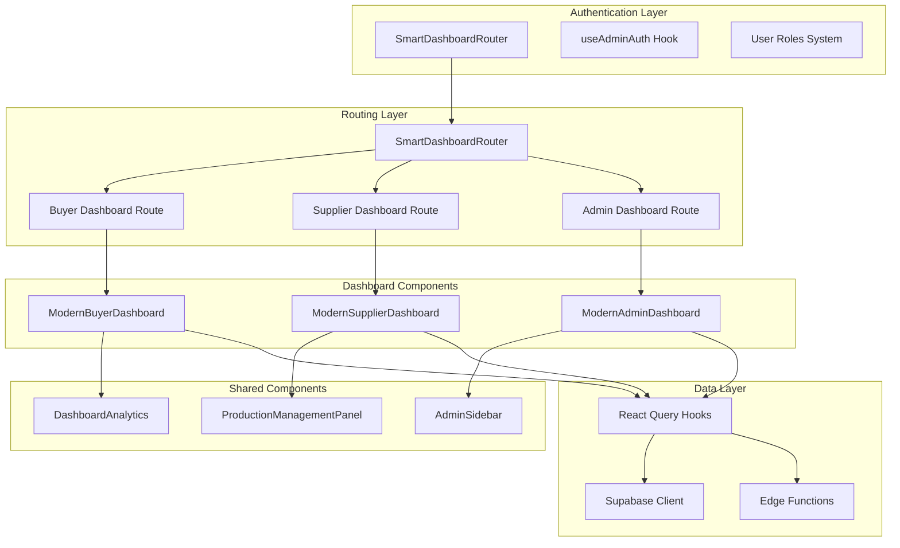
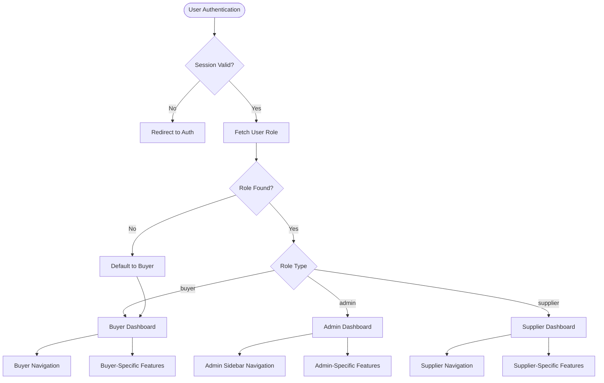
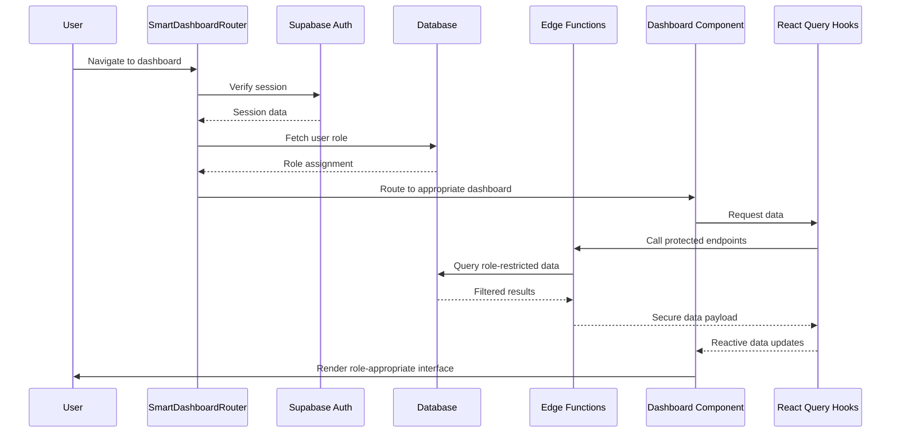
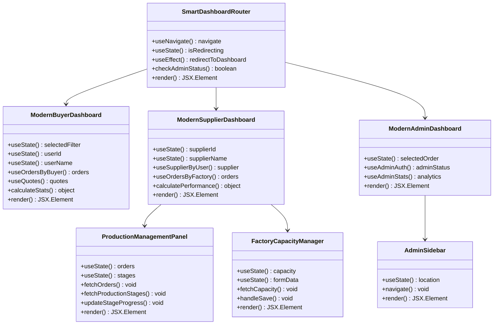
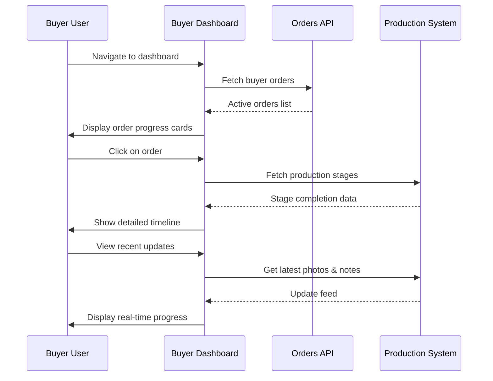
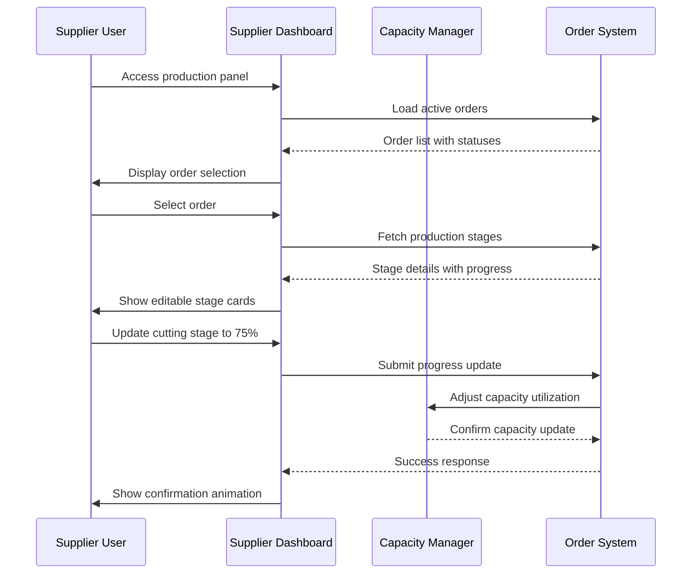
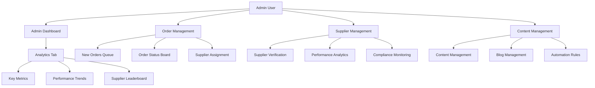

# Role-Based Dashboards

<cite>
**Referenced Files in This Document**
- [ModernBuyerDashboard.tsx](file://src/pages/ModernBuyerDashboard.tsx)
- [ModernSupplierDashboard.tsx](file://src/pages/ModernSupplierDashboard.tsx)
- [ModernAdminDashboard.tsx](file://src/pages/ModernAdminDashboard.tsx)
- [SmartDashboardRouter.tsx](file://src/components/SmartDashboardRouter.tsx)
- [AdminSidebar.tsx](file://src/components/AdminSidebar.tsx)
- [useAdminAuth.ts](file://src/hooks/useAdminAuth.ts)
- [ProductionManagementPanel.tsx](file://src/components/supplier/ProductionManagementPanel.tsx)
- [FactoryCapacityManager.tsx](file://src/components/supplier/FactoryCapacityManager.tsx)
- [DashboardAnalytics.tsx](file://src/components/admin/DashboardAnalytics.tsx)
- [useOrders.ts](file://src/hooks/queries/useOrders.ts)
</cite>

## Table of Contents
1. [Introduction](#introduction)
2. [System Architecture](#system-architecture)
3. [Core Dashboard Components](#core-dashboard-components)
4. [Role-Based Access Control](#role-based-access-control)
5. [Data Flow and Permissions](#data-flow-and-permissions)
6. [Component Architecture](#component-architecture)
7. [Practical Implementation Examples](#practical-implementation-examples)
8. [Common Issues and Solutions](#common-issues-and-solutions)
9. [Performance Considerations](#performance-considerations)
10. [Troubleshooting Guide](#troubleshooting-guide)

## Introduction

The Role-Based Dashboards system provides tailored user experiences for three distinct user types within the Sleek Apparels ecosystem: buyers, suppliers, and administrators. Each dashboard delivers role-specific functionality while maintaining a consistent design language and seamless navigation experience.

The system implements a sophisticated routing mechanism through the SmartDashboardRouter that automatically directs users to their appropriate interface based on their assigned roles. This ensures that users always access the most relevant tools and data for their specific responsibilities within the platform.

## System Architecture

The Role-Based Dashboards system follows a modular architecture with clear separation of concerns between different user roles and functional areas.

**Diagram sources**
- [SmartDashboardRouter.tsx](file://src/components/SmartDashboardRouter.tsx#L1-L139)
- [ModernBuyerDashboard.tsx](file://src/pages/ModernBuyerDashboard.tsx#L1-L584)
- [ModernSupplierDashboard.tsx](file://src/pages/ModernSupplierDashboard.tsx#L1-L669)
- [ModernAdminDashboard.tsx](file://src/pages/ModernAdminDashboard.tsx#L1-L559)

**Section sources**
- [SmartDashboardRouter.tsx](file://src/components/SmartDashboardRouter.tsx#L1-L139)
- [ModernBuyerDashboard.tsx](file://src/pages/ModernBuyerDashboard.tsx#L1-L584)
- [ModernSupplierDashboard.tsx](file://src/pages/ModernSupplierDashboard.tsx#L1-L669)
- [ModernAdminDashboard.tsx](file://src/pages/ModernAdminDashboard.tsx#L1-L559)

## Core Dashboard Components

### ModernBuyerDashboard

The ModernBuyerDashboard serves as the central hub for buyers managing their production orders and quote requests. It provides comprehensive order tracking, instant quote capabilities, and smart recommendations based on purchasing patterns.

**Key Features:**
- Real-time order status tracking with progress indicators
- Smart reorder suggestions based on purchase history
- Instant quote generation for quick procurement decisions
- Pending quote management and approval workflows
- Customer type-specific messaging and guidance

**Data Visualization Elements:**
- Active orders filtered by status (all, active, pending)
- Performance metrics including average delivery time and total spending
- Recommendation cards for strategic purchasing decisions
- Recent quote tracking with status indicators

### ModernSupplierDashboard

The ModernSupplierDashboard transforms into a gamified production management platform that motivates suppliers through performance tracking, tier systems, and capacity planning tools.

**Key Features:**
- Performance score calculation with tier-based rewards
- Real-time production stage management
- Capacity utilization tracking and optimization
- Achievement system with unlockable benefits
- Urgent action alerts for quality checks and updates

**Gamification Elements:**
- Tier system (Bronze, Silver, Gold, Platinum) with visual progression
- Achievement unlocking with celebratory animations
- Capacity utilization badges and rewards
- Performance benchmarking against industry standards

### ModernAdminDashboard

The ModernAdminDashboard provides comprehensive system oversight with advanced analytics, supplier management, and operational controls for platform administrators.

**Key Features:**
- Real-time system analytics and KPI tracking
- Supplier assignment queue management
- Automated workflow orchestration
- Content management system integration
- Security monitoring and rate limiting

**Administrative Tools:**
- Order status board with bulk operations
- Supplier performance analytics
- Quote approval workflows
- Automation rule management
- CMS and blog management panels

**Section sources**
- [ModernBuyerDashboard.tsx](file://src/pages/ModernBuyerDashboard.tsx#L31-L584)
- [ModernSupplierDashboard.tsx](file://src/pages/ModernSupplierDashboard.tsx#L98-L669)
- [ModernAdminDashboard.tsx](file://src/pages/ModernAdminDashboard.tsx#L123-L559)

## Role-Based Access Control

The system implements a robust role-based access control (RBAC) mechanism that determines dashboard access and functionality based on user roles stored in the database.

**Diagram sources**
- [SmartDashboardRouter.tsx](file://src/components/SmartDashboardRouter.tsx#L33-L110)
- [useAdminAuth.ts](file://src/hooks/useAdminAuth.ts#L15-L46)

### Role Definitions

The system recognizes five primary user roles, each with distinct access patterns and dashboard configurations:

| Role | Description | Dashboard Access | Key Responsibilities |
|------|-------------|------------------|---------------------|
| `admin` | Platform administrators | ModernAdminDashboard | System management, supplier oversight, analytics |
| `supplier` | Manufacturing partners | ModernSupplierDashboard | Production management, capacity planning, order fulfillment |
| `retailer` | Retail customers | ModernBuyerDashboard | Order tracking, quote management, inventory planning |
| `wholesaler` | Bulk purchasers | ModernBuyerDashboard | Large-scale ordering, volume discounts, supply chain |
| `educational` | School uniform buyers | ModernBuyerDashboard | Educational institution requirements, bulk orders |
| `corporate` | Corporate apparel buyers | ModernBuyerDashboard | Business attire, branding, compliance requirements |
| `sports_team` | Team uniform buyers | ModernBuyerDashboard | Sports apparel, team branding, event scheduling |

**Section sources**
- [SmartDashboardRouter.tsx](file://src/components/SmartDashboardRouter.tsx#L85-L104)
- [useAdminAuth.ts](file://src/hooks/useAdminAuth.ts#L1-L47)

## Data Flow and Permissions

The dashboard system implements a sophisticated data flow architecture that ensures secure, role-appropriate data access while maintaining real-time synchronization.

**Diagram sources**
- [SmartDashboardRouter.tsx](file://src/components/SmartDashboardRouter.tsx#L33-L110)
- [useOrders.ts](file://src/hooks/queries/useOrders.ts#L43-L83)

### Data Access Patterns

Each dashboard type implements specific data access patterns optimized for their respective user base:

**Buyer Data Access:**
- Orders filtered by buyer_id
- Quotes associated with user's purchasing activity
- Profile data with customer type metadata
- Historical purchase patterns for recommendations

**Supplier Data Access:**
- Orders linked to supplier's factory capacity
- Production stages with supplier-specific updates
- Capacity utilization data
- Performance metrics and tier assignments

**Admin Data Access:**
- System-wide order and quote statistics
- Supplier performance analytics
- User management and role assignments
- Platform-wide analytics and trends

**Section sources**
- [useOrders.ts](file://src/hooks/queries/useOrders.ts#L1-L83)
- [ProductionManagementPanel.tsx](file://src/components/supplier/ProductionManagementPanel.tsx#L45-L100)

## Component Architecture

The dashboard system employs a modular component architecture that promotes reusability, maintainability, and consistent user experience across all role-based interfaces.

**Diagram sources**
- [SmartDashboardRouter.tsx](file://src/components/SmartDashboardRouter.tsx#L7-L139)
- [ModernBuyerDashboard.tsx](file://src/pages/ModernBuyerDashboard.tsx#L31-L584)
- [ModernSupplierDashboard.tsx](file://src/pages/ModernSupplierDashboard.tsx#L98-L669)
- [ModernAdminDashboard.tsx](file://src/pages/ModernAdminDashboard.tsx#L123-L559)
- [ProductionManagementPanel.tsx](file://src/components/supplier/ProductionManagementPanel.tsx#L38-L325)
- [FactoryCapacityManager.tsx](file://src/components/supplier/FactoryCapacityManager.tsx#L20-L326)
- [AdminSidebar.tsx](file://src/components/AdminSidebar.tsx#L29-L69)

### Shared Component Patterns

The system leverages several shared component patterns that ensure consistency across dashboards:

**StatCard Pattern:**
Reusable statistical display component with gradient backgrounds, icons, and trend indicators used consistently across all dashboards.

**Progress Tracking Components:**
Standardized progress bars, rings, and timeline displays that maintain visual consistency while adapting to role-specific data.

**Action Button Systems:**
Unified button patterns with hover effects, loading states, and role-appropriate actions.

**Section sources**
- [ModernBuyerDashboard.tsx](file://src/pages/ModernBuyerDashboard.tsx#L279-L324)
- [ModernSupplierDashboard.tsx](file://src/pages/ModernSupplierDashboard.tsx#L416-L458)
- [ModernAdminDashboard.tsx](file://src/pages/ModernAdminDashboard.tsx#L71-L121)

## Practical Implementation Examples

### Example 1: Buyer Monitoring Production Progress

A fashion brand buyer using the ModernBuyerDashboard to monitor the production status of their latest collection order:

**Implementation Details:**
- Order filtering by status (active, pending, completed)
- Progress calculation based on production stage completion
- Real-time photo uploads and quality check notifications
- Estimated delivery date tracking with countdown timers

### Example 2: Supplier Updating Stage Completion

A supplier managing multiple production orders through the ModernSupplierDashboard:

**Implementation Details:**
- Drag-and-drop stage reordering
- Photo upload integration with quality validation
- Automatic capacity adjustment calculations
- Real-time progress synchronization across all stakeholders

### Example 3: Admin Reviewing System Performance

An administrator using the ModernAdminDashboard to oversee platform operations:

**Implementation Details:**
- Real-time order assignment queue with automated supplier matching
- Supplier performance scoring with tier-based incentives
- Automated workflow orchestration for quote processing
- Content management system with AI-powered content generation

**Section sources**
- [ModernBuyerDashboard.tsx](file://src/pages/ModernBuyerDashboard.tsx#L104-L178)
- [ModernSupplierDashboard.tsx](file://src/pages/ModernSupplierDashboard.tsx#L114-L175)
- [ModernAdminDashboard.tsx](file://src/pages/ModernAdminDashboard.tsx#L280-L559)

## Common Issues and Solutions

### Permission Errors

**Issue:** Users receive unauthorized access errors despite having valid accounts.

**Root Cause:** Role assignment inconsistencies between authentication and authorization systems.

**Solution:** Implement role synchronization mechanisms and provide role refresh capabilities through the SmartDashboardRouter.

**Code Reference:** [SmartDashboardRouter.tsx](file://src/components/SmartDashboardRouter.tsx#L59-L83)

### Missing Data in Dashboards

**Issue:** Dashboard components render without expected data or show empty states.

**Root Cause:** Network timeouts, database query failures, or insufficient data permissions.

**Solution:** Implement comprehensive error boundaries and provide graceful fallback states with clear user messaging.

**Code Reference:** [ModernBuyerDashboard.tsx](file://src/pages/ModernBuyerDashboard.tsx#L221-L236)

### Performance Degradation

**Issue:** Dashboard loading times exceed acceptable thresholds.

**Root Cause:** Excessive data fetching, inefficient queries, or component rendering bottlenecks.

**Solution:** Implement data caching strategies, pagination for large datasets, and component-level optimizations.

**Code Reference:** [useOrders.ts](file://src/hooks/queries/useOrders.ts#L43-L83)

### Synchronization Issues

**Issue:** Real-time updates fail to propagate across multiple user sessions.

**Root Cause:** WebSocket disconnections or server-side event processing delays.

**Solution:** Implement client-side event queuing and provide manual refresh capabilities with optimistic UI updates.

**Code Reference:** [ProductionManagementPanel.tsx](file://src/components/supplier/ProductionManagementPanel.tsx#L148-L171)

## Performance Considerations

### Data Fetching Optimization

The dashboard system implements several performance optimization strategies:

**Query Optimization:**
- Role-based data filtering at the database level
- Selective field retrieval to minimize bandwidth
- Efficient indexing on frequently queried columns

**Caching Strategies:**
- React Query cache management with appropriate TTL values
- Local storage persistence for non-sensitive data
- Incremental cache updates for real-time scenarios

**Loading State Management:**
- Progressive loading with skeleton screens
- Skeleton loading patterns that match final content layout
- Graceful degradation for slow connections

### Component Rendering Optimization

**Memoization Techniques:**
- React.memo for expensive component computations
- useCallback for event handlers and callbacks
- useMemo for derived data calculations

**Virtualization:**
- Long lists with virtual scrolling for performance
- Lazy loading of non-critical dashboard sections
- Conditional rendering based on user interactions

## Troubleshooting Guide

### Authentication Issues

**Problem:** Users cannot access their dashboards after successful login.

**Diagnostic Steps:**
1. Verify session validity through browser developer tools
2. Check Supabase authentication logs for errors
3. Validate role assignment in the user_roles table
4. Review SmartDashboardRouter console logs

**Resolution:**
- Implement session refresh mechanisms
- Add retry logic for role fetching
- Provide clear error messaging with resolution steps

### Data Access Problems

**Problem:** Dashboard displays incorrect or outdated information.

**Diagnostic Approach:**
1. Monitor network requests in browser dev tools
2. Validate database query results and permissions
3. Check React Query cache state
4. Verify edge function execution logs

**Fix Implementation:**
- Implement cache invalidation strategies
- Add data freshness indicators
- Provide manual refresh capabilities

### Performance Issues

**Problem:** Dashboard loads slowly or becomes unresponsive.

**Investigation Process:**
1. Profile component rendering times
2. Analyze bundle sizes and loading priorities
3. Monitor memory usage and garbage collection
4. Check for blocking synchronous operations

**Optimization Measures:**
- Implement code splitting for dashboard sections
- Optimize database queries with proper indexing
- Add lazy loading for non-critical components
- Implement request deduplication

**Section sources**
- [SmartDashboardRouter.tsx](file://src/components/SmartDashboardRouter.tsx#L115-L139)
- [ModernBuyerDashboard.tsx](file://src/pages/ModernBuyerDashboard.tsx#L221-L236)
- [useOrders.ts](file://src/hooks/queries/useOrders.ts#L43-L83)