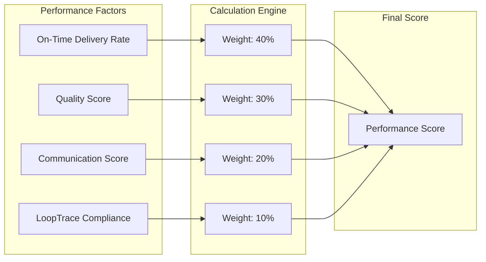

# Supplier Dashboard

<cite>
**Referenced Files in This Document**
- [ModernSupplierDashboard.tsx](file://src/pages/ModernSupplierDashboard.tsx)
- [ProductionManagementPanel.tsx](file://src/components/supplier/ProductionManagementPanel.tsx)
- [FactoryCapacityManager.tsx](file://src/components/supplier/FactoryCapacityManager.tsx)
- [SupplierPerformanceMetrics.tsx](file://src/components/supplier/SupplierPerformanceMetrics.tsx)
- [AssignedQuotesPanel.tsx](file://src/components/supplier/AssignedQuotesPanel.tsx)
- [ProductionStageUpdate.tsx](file://src/components/supplier/ProductionStageUpdate.tsx)
- [SupplierOrdersList.tsx](file://src/components/supplier/SupplierOrdersList.tsx)
- [useSuppliers.ts](file://src/hooks/queries/useSuppliers.ts)
- [useOrders.ts](file://src/hooks/queries/useOrders.ts)
- [useQuotes.ts](file://src/hooks/useQuotes.ts)
- [initialize-production-stages/index.ts](file://supabase/functions/initialize-production-stages/index.ts)
</cite>

## Table of Contents
1. [Introduction](#introduction)
2. [System Architecture](#system-architecture)
3. [Core Components](#core-components)
4. [Data Flow and State Management](#data-flow-and-state-management)
5. [Production Management](#production-management)
6. [Capacity Planning](#capacity-planning)
7. [Performance Tracking](#performance-tracking)
8. [Quote Management](#quote-management)
9. [Achievement System](#achievement-system)
10. [Common Use Cases](#common-use-cases)
11. [Troubleshooting Guide](#troubleshooting-guide)
12. [Best Practices](#best-practices)

## Introduction

The ModernSupplierDashboard is a comprehensive supplier management platform designed to facilitate real-time production updates, capacity planning, and quality control compliance. Built with React and Supabase, it provides suppliers with essential tools to manage their production workflows, monitor performance metrics, and maintain optimal operational efficiency.

The dashboard serves as a centralized hub for suppliers to:
- Monitor and update production stages in real-time
- Manage factory capacity allocations
- Track performance metrics and tier progression
- Respond to buyer quotes and orders
- Access achievement systems and gamification elements
- Maintain quality control compliance

## System Architecture

The ModernSupplierDashboard follows a modular architecture with clear separation of concerns:

**Diagram sources**
- [ModernSupplierDashboard.tsx](file://src/pages/ModernSupplierDashboard.tsx#L1-L50)
- [ProductionManagementPanel.tsx](file://src/components/supplier/ProductionManagementPanel.tsx#L1-L50)
- [FactoryCapacityManager.tsx](file://src/components/supplier/FactoryCapacityManager.tsx#L1-L50)

## Core Components

### ModernSupplierDashboard

The main dashboard component orchestrates the entire supplier experience, providing a unified interface for all supplier activities.

**Key Features:**
- Real-time performance score tracking
- Urgent action notifications
- Achievement system display
- Capacity utilization monitoring
- Tier-based benefits system

**Section sources**
- [ModernSupplierDashboard.tsx](file://src/pages/ModernSupplierDashboard.tsx#L98-L220)

### ProductionManagementPanel

Manages production workflows through interactive stage updates and progress tracking.

**Core Functionality:**
- Multi-stage production tracking
- Real-time progress updates
- Photo upload capabilities
- Automated stage initialization
- Progress visualization

**Section sources**
- [ProductionManagementPanel.tsx](file://src/components/supplier/ProductionManagementPanel.tsx#L38-L100)

### FactoryCapacityManager

Enables suppliers to manage and optimize their manufacturing capacity.

**Key Capabilities:**
- Daily capacity updates
- Resource allocation tracking
- Utilization percentage calculations
- Historical capacity analysis
- Capacity planning tools

**Section sources**
- [FactoryCapacityManager.tsx](file://src/components/supplier/FactoryCapacityManager.tsx#L20-L80)

### SupplierPerformanceMetrics

Tracks and displays supplier performance across multiple dimensions.

**Performance Indicators:**
- Overall performance score
- On-time delivery rates
- Quality compliance metrics
- Acceptance rate tracking
- Improvement suggestions

**Section sources**
- [SupplierPerformanceMetrics.tsx](file://src/components/supplier/SupplierPerformanceMetrics.tsx#L19-L50)

## Data Flow and State Management

The dashboard utilizes a sophisticated data flow system built on React Query for efficient state management:

**Diagram sources**
- [ModernSupplierDashboard.tsx](file://src/pages/ModernSupplierDashboard.tsx#L114-L118)
- [ProductionManagementPanel.tsx](file://src/components/supplier/ProductionManagementPanel.tsx#L45-L98)

**Section sources**
- [useSuppliers.ts](file://src/hooks/queries/useSuppliers.ts#L38-L48)
- [useOrders.ts](file://src/hooks/queries/useOrders.ts#L55-L65)

## Production Management

### Stage Update Workflow

The production management system enables suppliers to track and update production stages in real-time:

**Diagram sources**
- [ProductionManagementPanel.tsx](file://src/components/supplier/ProductionManagementPanel.tsx#L133-L146)
- [ProductionStageUpdate.tsx](file://src/components/supplier/ProductionStageUpdate.tsx#L34-L85)

### Automated Stage Initialization

When new orders are accepted, the system automatically initializes production stages using serverless functions:

**Section sources**
- [ProductionManagementPanel.tsx](file://src/components/supplier/ProductionManagementPanel.tsx#L133-L146)
- [initialize-production-stages/index.ts](file://supabase/functions/initialize-production-stages/index.ts#L100-L133)

## Capacity Planning

### Capacity Calculation System

The FactoryCapacityManager implements a comprehensive capacity planning system:

**Diagram sources**
- [FactoryCapacityManager.tsx](file://src/components/supplier/FactoryCapacityManager.tsx#L27-L60)

**Section sources**
- [FactoryCapacityManager.tsx](file://src/components/supplier/FactoryCapacityManager.tsx#L76-L122)

## Performance Tracking

### Tier-Based Performance System

The dashboard implements a sophisticated tier-based performance system:

| Tier | Icon | Benefits | Requirements |
|------|------|----------|--------------|
| BRONZE | 🥉 | Standard visibility, Standard support | Basic performance metrics |
| SILVER | 🥈 | Enhanced visibility, Priority support | Improved delivery rates |
| GOLD | 🥇 | Premium visibility, Gold badge, 5% discount | Excellent quality scores |
| PLATINUM | 💎 | Featured placement, 24/7 support, Marketing support | Exceptional performance |

**Section sources**
- [ModernSupplierDashboard.tsx](file://src/pages/ModernSupplierDashboard.tsx#L222-L238)
- [SupplierPerformanceMetrics.tsx](file://src/components/supplier/SupplierPerformanceMetrics.tsx#L22-L72)

### Performance Metrics Calculation

The system calculates performance scores using multiple weighted factors:

**Diagram sources**
- [ModernSupplierDashboard.tsx](file://src/pages/ModernSupplierDashboard.tsx#L158-L167)

## Quote Management

### Quote Assignment and Response System

The AssignedQuotesPanel manages the complete quote lifecycle:

**Diagram sources**
- [AssignedQuotesPanel.tsx](file://src/components/supplier/AssignedQuotesPanel.tsx#L174-L184)

**Section sources**
- [AssignedQuotesPanel.tsx](file://src/components/supplier/AssignedQuotesPanel.tsx#L65-L104)
- [useQuotes.ts](file://src/hooks/useQuotes.ts#L188-L222)

## Achievement System

### Gamification Elements

The dashboard incorporates gamification to motivate suppliers:

**Achievement Categories:**
- **Perfect Week**: 7 consecutive days of on-time updates
- **Quality Master**: Maintaining 4.8+ rating for 30 days
- **Speed Demon**: Delivering 10 orders ahead of schedule
- **Photo Pro**: Achieving 100% LoopTrace compliance

**Section sources**
- [ModernSupplierDashboard.tsx](file://src/pages/ModernSupplierDashboard.tsx#L91-L96)

## Common Use Cases

### Updating Production Stages

**Scenario**: Supplier receives an order and needs to update production progress

**Steps**:
1. Navigate to Production Management Panel
2. Select the active order from the order list
3. Update completion percentage for each stage
4. Add production notes and upload quality photos
5. Submit updates for real-time notification to buyers

**Implementation Path**: [ProductionManagementPanel.tsx](file://src/components/supplier/ProductionManagementPanel.tsx#L149-L169)

### Managing Incoming Quotes

**Scenario**: Supplier receives new quote requests and needs to respond

**Steps**:
1. Access Assigned Quotes panel
2. Review quote details and requirements
3. Enter competitive pricing and delivery terms
4. Submit response within 24-hour window
5. Monitor quote status and buyer feedback

**Implementation Path**: [AssignedQuotesPanel.tsx](file://src/components/supplier/AssignedQuotesPanel.tsx#L158-L172)

### Viewing Performance Analytics

**Scenario**: Supplier wants to review performance metrics and improvement areas

**Steps**:
1. Open Performance Metrics section
2. Review overall performance score and breakdown
3. Analyze key metrics (delivery rate, acceptance rate, quality)
4. Follow improvement suggestions
5. Track progress toward next tier

**Implementation Path**: [SupplierPerformanceMetrics.tsx](file://src/components/supplier/SupplierPerformanceMetrics.tsx#L19-L72)

### Managing Factory Capacity

**Scenario**: Supplier needs to adjust capacity for upcoming orders

**Steps**:
1. Access Factory Capacity Manager
2. Select target date for capacity update
3. Update machine count, worker count, and shift hours
4. Calculate available capacity
5. Save changes for order matching system

**Implementation Path**: [FactoryCapacityManager.tsx](file://src/components/supplier/FactoryCapacityManager.tsx#L76-L122)

## Troubleshooting Guide

### Common Issues and Solutions

#### Failed Stage Updates

**Problem**: Production stage updates fail to save

**Causes and Solutions**:
- **Network Connectivity**: Check internet connection and retry
- **Invalid Percentage**: Ensure completion percentage is between 0-100
- **Missing Permissions**: Verify user authentication status
- **Database Errors**: Check for concurrent update conflicts

**Debugging Steps**:
1. Verify network connectivity
2. Check browser console for error messages
3. Validate input data format
4. Refresh page and retry operation

#### Capacity Calculation Errors

**Problem**: Incorrect capacity utilization calculations

**Causes and Solutions**:
- **Missing Capacity Data**: Ensure daily capacity entries are made
- **Incorrect Machine Counts**: Verify machine and worker counts
- **Shift Hour Mismatches**: Confirm shift hour settings
- **Date Selection Issues**: Check selected date matches current period

**Debugging Steps**:
1. Verify capacity data exists for selected date
2. Check machine and worker count accuracy
3. Confirm shift hour configuration
4. Validate date selection logic

#### Quote Response Delays

**Problem**: Delayed quote response affecting acceptance rate

**Solutions**:
- **Set Reminders**: Configure alerts for pending quotes
- **Streamline Process**: Establish quote response protocols
- **Delegate Tasks**: Assign team members for quote management
- **Use Templates**: Create standardized response templates

#### Performance Score Drops

**Problem**: Declining performance metrics impacting tier status

**Strategies**:
- **Improve Delivery Times**: Optimize production schedules
- **Enhance Quality Control**: Strengthen inspection processes
- **Boost Communication**: Maintain regular buyer updates
- **Increase Efficiency**: Implement process improvements

**Section sources**
- [ProductionManagementPanel.tsx](file://src/components/supplier/ProductionManagementPanel.tsx#L149-L169)
- [FactoryCapacityManager.tsx](file://src/components/supplier/FactoryCapacityManager.tsx#L76-L122)

## Best Practices

### Production Management Best Practices

1. **Regular Updates**: Update production stages daily for accurate tracking
2. **Quality Photos**: Upload clear photos at each stage for compliance
3. **Detailed Notes**: Provide comprehensive production notes
4. **Timely Responses**: Respond to buyer inquiries promptly
5. **Resource Planning**: Regularly update capacity information

### Performance Optimization

1. **Monitor Metrics**: Track key performance indicators regularly
2. **Set Goals**: Establish achievable performance targets
3. **Continuous Improvement**: Implement process enhancements
4. **Team Training**: Ensure staff understands dashboard features
5. **System Maintenance**: Keep capacity data current

### Quote Management Strategies

1. **Quick Response**: Respond to quotes within 24 hours
2. **Competitive Pricing**: Research market rates for accurate quoting
3. **Clear Communication**: Provide detailed terms and conditions
4. **Follow-up**: Monitor quote status and buyer feedback
5. **Record Keeping**: Maintain quote history for analysis

### Capacity Planning Guidelines

1. **Daily Updates**: Update capacity daily for accuracy
2. **Seasonal Planning**: Adjust for peak periods
3. **Maintenance Scheduling**: Account for equipment maintenance
4. **Workforce Management**: Plan for staffing needs
5. **Resource Optimization**: Maximize equipment utilization