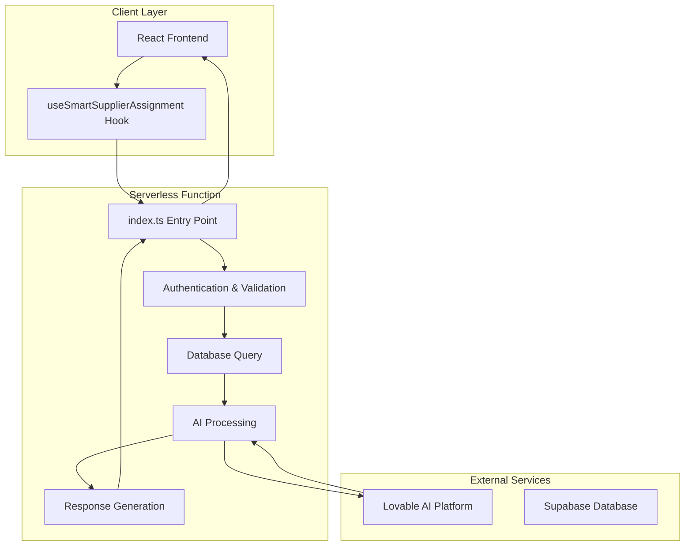
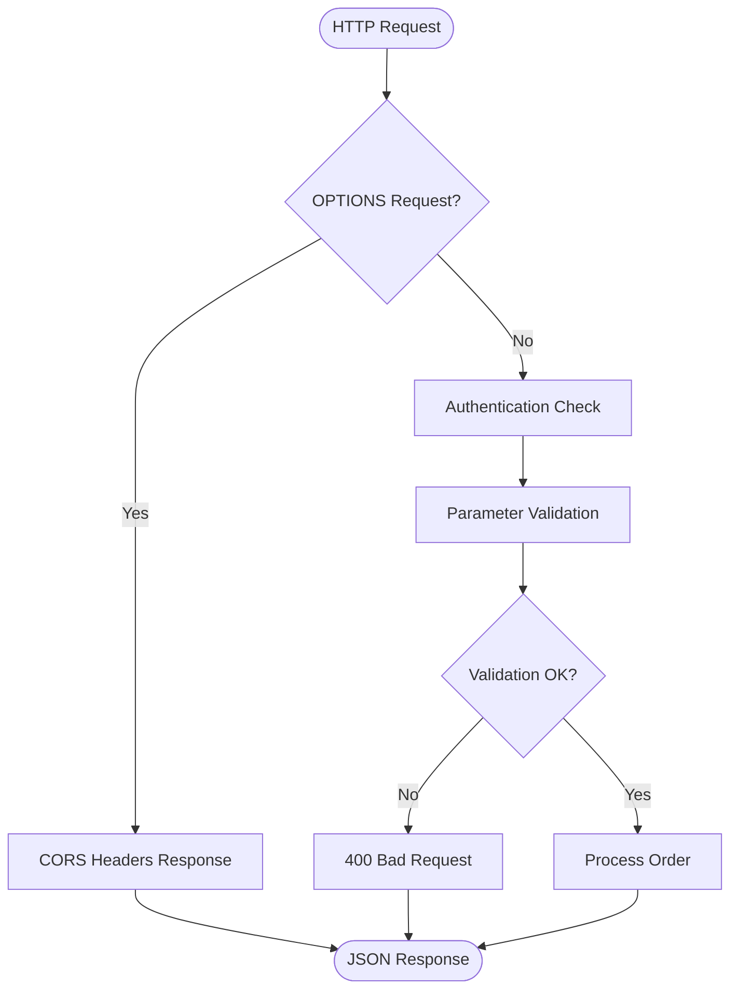
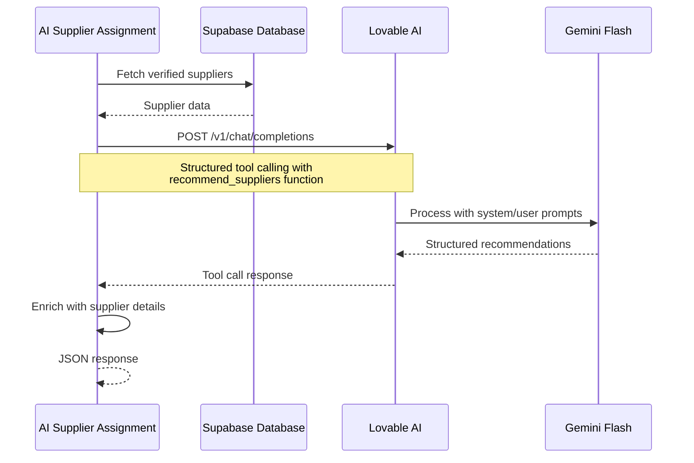
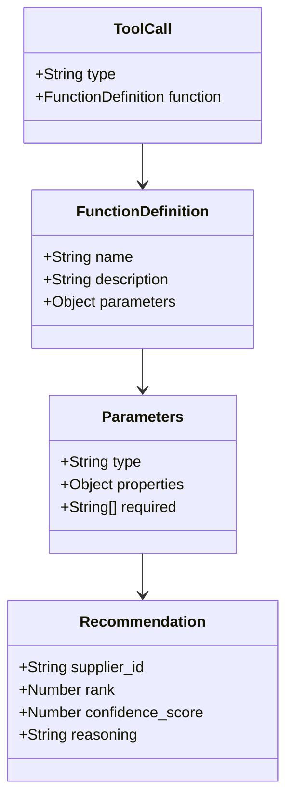
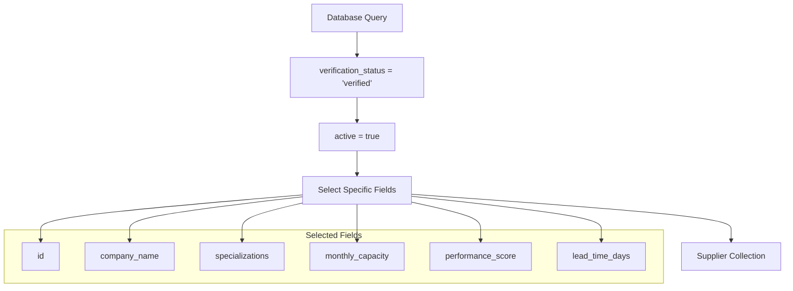
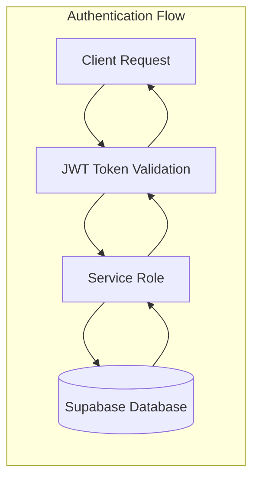
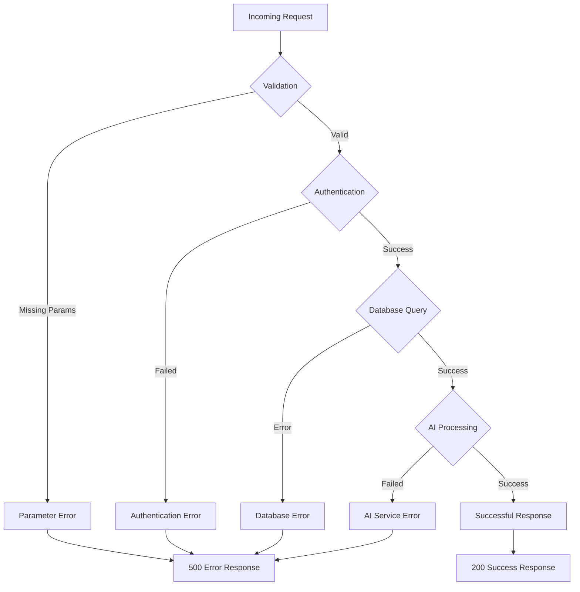
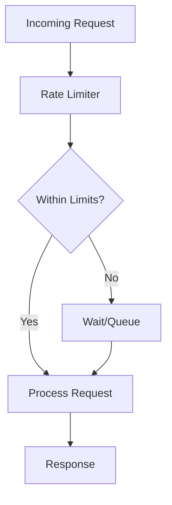
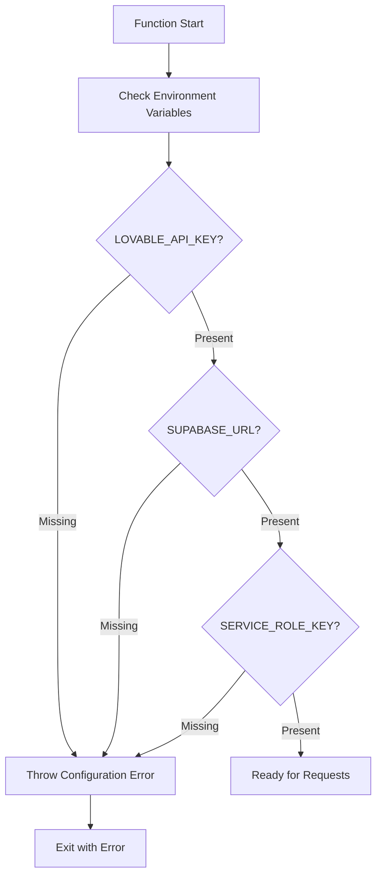

# AI Supplier Assignment Function

<cite>
**Referenced Files in This Document**
- [index.ts](file://supabase/functions/ai-supplier-assignment/index.ts)
- [useSmartSupplierAssignment.ts](file://src/hooks/useSmartSupplierAssignment.ts)
- [SmartSupplierAssignment.tsx](file://src/components/admin/SmartSupplierAssignment.tsx)
- [SupplierMatchingSystem.tsx](file://src/components/admin/SupplierMatchingSystem.tsx)
- [useSuppliers.ts](file://src/hooks/useSuppliers.ts)
- [config.toml](file://supabase/config.toml)
- [TABLES_ONLY.sql](file://supabase/TABLES_ONLY.sql)
- [ai-quote-generator/index.ts](file://supabase/functions/ai-quote-generator/index.ts)
- [generate-product-description/index.ts](file://supabase/functions/generate-product-description/index.ts)
- [analytics-service/index.ts](file://supabase/functions/analytics-service/index.ts)
</cite>

## Table of Contents
1. [Introduction](#introduction)
2. [Function Architecture](#function-architecture)
3. [Core Components](#core-components)
4. [AI Integration](#ai-integration)
5. [Data Processing Pipeline](#data-processing-pipeline)
6. [Security and Authentication](#security-and-authentication)
7. [Error Handling](#error-handling)
8. [Performance Optimization](#performance-optimization)
9. [Configuration Management](#configuration-management)
10. [Implementation Examples](#implementation-examples)
11. [Troubleshooting Guide](#troubleshooting-guide)
12. [Best Practices](#best-practices)

## Introduction

The AI Supplier Assignment function is a serverless backend service built on Supabase Functions that leverages AI-powered decision logic to intelligently match manufacturing orders with optimal suppliers. This function serves as the core intelligence engine for the Sleek Apparels platform, analyzing order requirements against verified supplier capabilities to generate ranked recommendations with confidence scores and detailed reasoning.

The function operates within a Deno runtime environment, integrating seamlessly with the Lovable AI platform via the Gemini Flash model to provide sophisticated supplier matching capabilities. It transforms raw order data into actionable insights, helping buyers make informed decisions while optimizing supply chain efficiency.

## Function Architecture

The AI Supplier Assignment function follows a modular, event-driven architecture designed for scalability and reliability:



**Diagram sources**
- [index.ts](file://supabase/functions/ai-supplier-assignment/index.ts#L9-L134)
- [useSmartSupplierAssignment.ts](file://src/hooks/useSmartSupplierAssignment.ts#L14-L55)

**Section sources**
- [index.ts](file://supabase/functions/ai-supplier-assignment/index.ts#L1-L134)
- [config.toml](file://supabase/config.toml#L45-L47)

## Core Components

### Function Entry Point and Request Handling

The function begins with robust CORS support and request validation:



**Diagram sources**
- [index.ts](file://supabase/functions/ai-supplier-assignment/index.ts#L9-L20)

### Database Integration

The function retrieves verified supplier data using optimized database queries:

| Field | Purpose | Data Type | Filtering Criteria |
|-------|---------|-----------|-------------------|
| id | Unique supplier identifier | UUID | Primary key |
| company_name | Supplier business name | String | Display field |
| specializations | Manufacturing expertise | Array[String] | Match scoring |
| monthly_capacity | Production capability | Integer | Capacity validation |
| performance_score | Quality rating | Numeric | Weighted scoring |
| lead_time_days | Delivery timeline | Integer | Time-sensitive matching |

**Section sources**
- [index.ts](file://supabase/functions/ai-supplier-assignment/index.ts#L24-L30)
- [useSuppliers.ts](file://src/hooks/useSuppliers.ts#L6-L29)

### Parameter Processing

The function accepts structured input parameters for comprehensive order analysis:

| Parameter | Type | Required | Description |
|-----------|------|----------|-------------|
| order_id | String | Yes | Unique identifier for tracking |
| product_type | String | Yes | Manufacturing category |
| quantity | Number | Yes | Order volume in pieces |
| requirements | String | No | Quality and specification details |

**Section sources**
- [index.ts](file://supabase/functions/ai-supplier-assignment/index.ts#L20)
- [useSmartSupplierAssignment.ts](file://src/hooks/useSmartSupplierAssignment.ts#L18-L28)

## AI Integration

### Lovable AI Platform Integration

The function integrates with the Lovable AI platform using the Gemini Flash model for advanced supplier matching:



**Diagram sources**
- [index.ts](file://supabase/functions/ai-supplier-assignment/index.ts#L35-L121)
- [ai-quote-generator/index.ts](file://supabase/functions/ai-quote-generator/index.ts#L596-L625)

### System Prompt Engineering

The function employs carefully crafted prompts for optimal AI performance:

**System Prompt**: "You are an expert at matching manufacturing orders with optimal suppliers. Analyze the order requirements and supplier capabilities to recommend the top 3 best matches. Consider: specialization match, capacity, performance score, lead time, and overall fit."

**User Prompt Structure**: The function constructs dynamic prompts that include order details and supplier information for context-aware recommendations.

**Section sources**
- [index.ts](file://supabase/functions/ai-supplier-assignment/index.ts#L38-L57)

### Tool Calling Implementation

The function utilizes structured tool calling to ensure reliable AI output parsing:



**Diagram sources**
- [index.ts](file://supabase/functions/ai-supplier-assignment/index.ts#L71-L96)

**Section sources**
- [index.ts](file://supabase/functions/ai-supplier-assignment/index.ts#L71-L96)

## Data Processing Pipeline

### Supplier Data Retrieval

The function implements efficient supplier data fetching with comprehensive filtering:



**Diagram sources**
- [index.ts](file://supabase/functions/ai-supplier-assignment/index.ts#L25-L29)

### Recommendation Processing

The function processes AI-generated recommendations through multiple enrichment stages:

| Stage | Purpose | Implementation |
|-------|---------|----------------|
| Parsing | Extract structured data | JSON.parse tool_call.arguments |
| Matching | Link recommendations to suppliers | suppliers.find(id) |
| Enrichment | Add supplier metadata | company_name, details |
| Ranking | Sort by confidence score | Array.sort() |
| Validation | Ensure completeness | Required field checks |

**Section sources**
- [index.ts](file://supabase/functions/ai-supplier-assignment/index.ts#L110-L121)

## Security and Authentication

### Service Role Access

The function operates with Supabase service role privileges for secure database access:



**Diagram sources**
- [index.ts](file://supabase/functions/ai-supplier-assignment/index.ts#L15-L18)

### Environment Security

The function relies on securely configured environment variables:

| Variable | Purpose | Security Level |
|----------|---------|----------------|
| SUPABASE_URL | Database endpoint | Secret |
| SUPABASE_SERVICE_ROLE_KEY | Database access | Secret |
| LOVABLE_API_KEY | AI service access | Secret |

**Section sources**
- [index.ts](file://supabase/functions/ai-supplier-assignment/index.ts#L15-L18)
- [config.toml](file://supabase/config.toml#L45-L47)

## Error Handling

### Comprehensive Error Management

The function implements multi-layered error handling for various failure scenarios:



**Diagram sources**
- [index.ts](file://supabase/functions/ai-supplier-assignment/index.ts#L127-L133)

### Error Categories and Responses

| Error Type | Status Code | Message | Recovery Strategy |
|------------|-------------|---------|------------------|
| Missing API Key | 500 | "LOVABLE_API_KEY not configured" | Configure environment variable |
| Database Error | 500 | Database-specific error | Retry with exponential backoff |
| AI Service Failure | 500 | "AI API error: {status}" | Fallback to manual processing |
| Validation Error | 400 | Parameter validation errors | Client-side validation |

**Section sources**
- [index.ts](file://supabase/functions/ai-supplier-assignment/index.ts#L35-L36)
- [index.ts](file://supabase/functions/ai-supplier-assignment/index.ts#L101-L105)

## Performance Optimization

### Cost and Latency Reduction Strategies

The function implements several optimization techniques for efficient AI usage:

#### Prompt Engineering Optimization
- **Structured Prompts**: Reduces token consumption through clear, directive-based prompts
- **Selective Information**: Includes only relevant supplier data based on order requirements
- **Tool Calling**: Ensures predictable, structured output parsing

#### Caching Strategies
While the function itself doesn't implement caching, it benefits from Supabase's built-in caching mechanisms:

| Cache Type | Duration | Scope | Benefit |
|------------|----------|-------|---------|
| Query Cache | 10 minutes | Supplier data | Reduced database load |
| Response Cache | Application level | Client-side | Faster UI updates |
| Image Cache | 1 year | Static assets | Reduced bandwidth |

**Section sources**
- [index.ts](file://supabase/functions/ai-supplier-assignment/index.ts#L38-L57)

### Rate Limiting and Throttling

The function participates in broader rate limiting strategies:



**Section sources**
- [ai-quote-generator/index.ts](file://supabase/functions/ai-quote-generator/index.ts#L37-L81)

## Configuration Management

### Environment Variables

Proper configuration is crucial for function operation:

#### Required Variables
- **LOVABLE_API_KEY**: Lovable AI authentication token
- **SUPABASE_URL**: Supabase database endpoint
- **SUPABASE_SERVICE_ROLE_KEY**: Database access credentials

#### Configuration Validation
The function validates environment configuration during startup:



**Diagram sources**
- [index.ts](file://supabase/functions/ai-supplier-assignment/index.ts#L35-L36)

**Section sources**
- [index.ts](file://supabase/functions/ai-supplier-assignment/index.ts#L35-L36)
- [config.toml](file://supabase/config.toml#L45-L47)

### Supabase Function Configuration

The function is configured for JWT verification in the Supabase ecosystem:

| Setting | Value | Purpose |
|---------|-------|---------|
| verify_jwt | true | Enable JWT authentication |
| cors_headers | wildcard | Allow cross-origin requests |
| timeout | Default | Function execution limits |

**Section sources**
- [config.toml](file://supabase/config.toml#L45-L47)

## Implementation Examples

### Basic Usage Pattern

Here's how the function is typically invoked from the frontend:

```typescript
// Example: Getting supplier recommendations for an order
const { loading, recommendations, getRecommendations } = useSmartSupplierAssignment();

const handleGetRecommendations = async () => {
  const recs = await getRecommendations(
    "order-12345",
    "knitwear",
    1000,
    "High-quality cotton blend with stretch"
  );
  
  if (recs.length > 0) {
    // Process recommendations
    console.log("Top supplier:", recs[0]);
  }
};
```

### Response Format

The function returns structured JSON responses:

```json
{
  "success": true,
  "recommendations": [
    {
      "supplier_id": "uuid-123",
      "rank": 1,
      "confidence_score": 95,
      "reasoning": "Perfect specialization match for knitwear with high capacity",
      "supplier_name": "Bangladesh Knit Co.",
      "supplier_details": {
        "id": "uuid-123",
        "company_name": "Bangladesh Knit Co.",
        "specializations": ["knitwear", "stretch fabrics"],
        "monthly_capacity": 50000,
        "performance_score": 92,
        "lead_time_days": 30
      }
    }
  ]
}
```

**Section sources**
- [useSmartSupplierAssignment.ts](file://src/hooks/useSmartSupplierAssignment.ts#L18-L55)
- [SmartSupplierAssignment.tsx](file://src/components/admin/SmartSupplierAssignment.tsx#L24-L39)

## Troubleshooting Guide

### Common Issues and Solutions

#### API Key Configuration Problems
**Symptom**: "LOVABLE_API_KEY not configured" error
**Solution**: Verify environment variable is set in Supabase dashboard and redeploy function

#### Database Connectivity Issues
**Symptom**: Database query errors or timeouts
**Solution**: 
- Check Supabase service role key validity
- Verify database connection string
- Review database policies and permissions

#### AI Service Failures
**Symptom**: "AI API error" responses
**Solution**:
- Verify Lovable AI service availability
- Check API key validity and permissions
- Monitor rate limits and quotas

#### Performance Issues
**Symptom**: Slow response times
**Solutions**:
- Optimize supplier data queries
- Reduce unnecessary data transfer
- Implement client-side caching

**Section sources**
- [index.ts](file://supabase/functions/ai-supplier-assignment/index.ts#L35-L36)
- [index.ts](file://supabase/functions/ai-supplier-assignment/index.ts#L101-L105)

### Debugging Techniques

#### Logging and Monitoring
The function includes comprehensive logging for troubleshooting:

```typescript
console.log("AI Supplier Assignment for:", { order_id, product_type, quantity });
console.log(`Found ${suppliers?.length || 0} verified suppliers`);
console.log("AI response:", JSON.stringify(aiData));
```

#### Error Tracking
Implement structured error handling with meaningful error messages:

```typescript
try {
  // Function logic
} catch (error: any) {
  console.error("Error in ai-supplier-assignment:", error);
  return new Response(
    JSON.stringify({ error: error.message }),
    { status: 500, headers: { ...corsHeaders, "Content-Type": "application/json" } }
  );
}
```

**Section sources**
- [index.ts](file://supabase/functions/ai-supplier-assignment/index.ts#L22-L23)
- [index.ts](file://supabase/functions/ai-supplier-assignment/index.ts#L108)
- [index.ts](file://supabase/functions/ai-supplier-assignment/index.ts#L128-L133)

## Best Practices

### Development Guidelines

#### Code Organization
- Maintain clear separation between database logic and AI processing
- Use TypeScript interfaces for type safety
- Implement comprehensive error handling at all levels

#### Security Considerations
- Never expose sensitive keys in client-side code
- Validate all input parameters thoroughly
- Use service role keys appropriately for database access

#### Performance Optimization
- Minimize database queries through efficient filtering
- Cache frequently accessed data at the application level
- Optimize AI prompts for cost and speed

#### Testing Strategies
- Implement unit tests for critical business logic
- Use mock data for AI response testing
- Test error handling scenarios comprehensively

### Production Deployment

#### Monitoring and Alerting
- Monitor function execution times and error rates
- Track AI API usage and costs
- Set up alerts for service failures

#### Maintenance Procedures
- Regularly update AI model configurations
- Monitor database performance and optimize queries
- Review and update security policies periodically

#### Scalability Planning
- Consider horizontal scaling for high-volume scenarios
- Implement circuit breaker patterns for external dependencies
- Plan for increased supplier data growth

**Section sources**
- [index.ts](file://supabase/functions/ai-supplier-assignment/index.ts#L1-L134)
- [useSmartSupplierAssignment.ts](file://src/hooks/useSmartSupplierAssignment.ts#L1-L55)