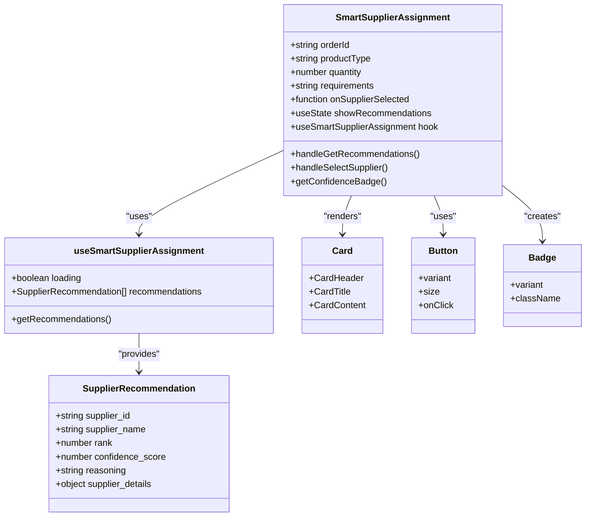
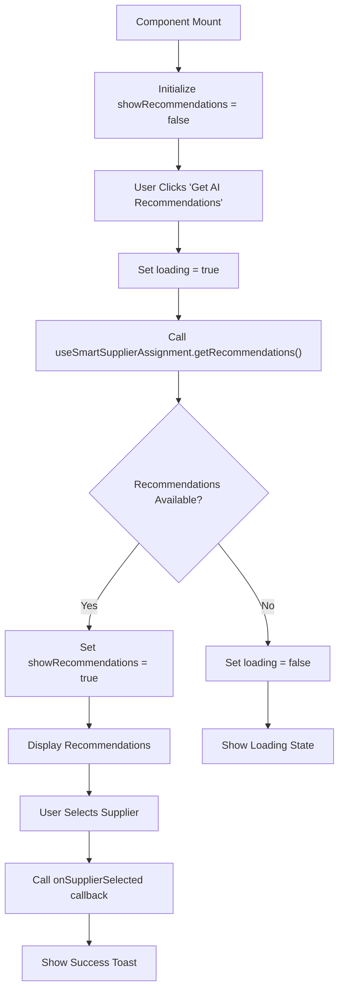
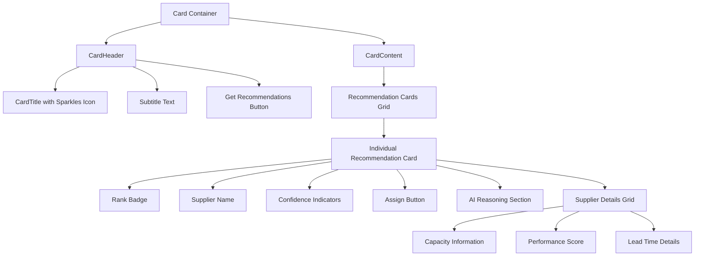
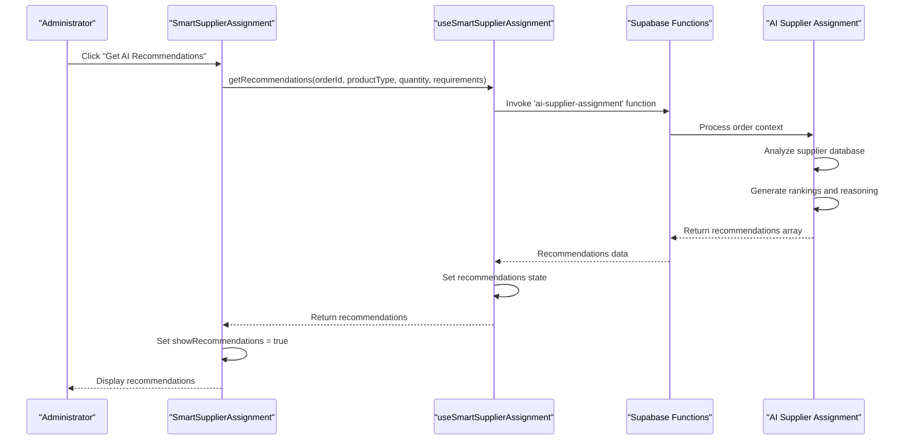
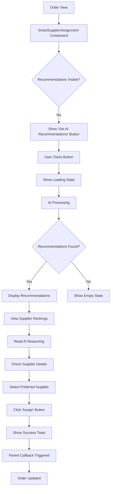
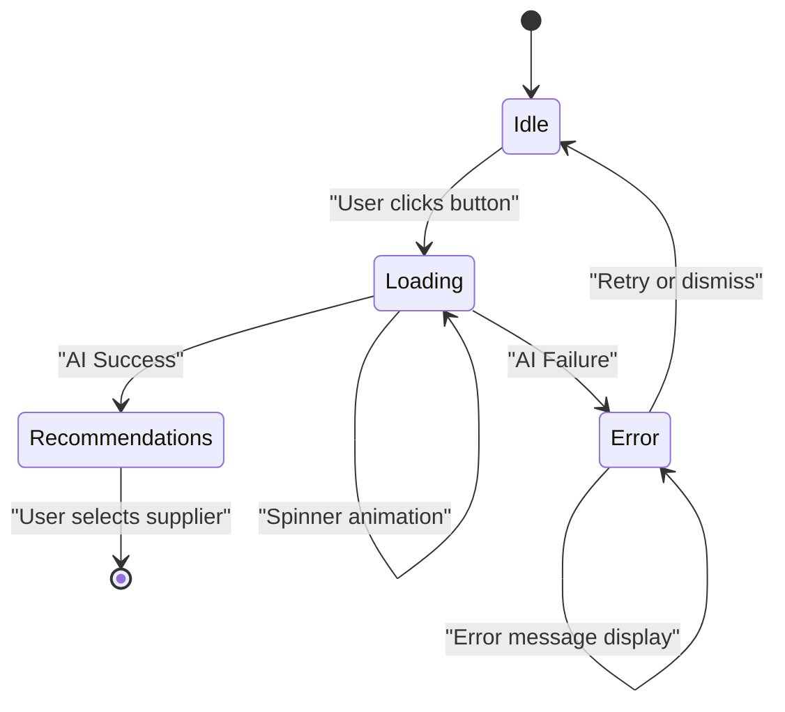

# Smart Supplier Assignment Component

<cite>
**Referenced Files in This Document**
- [SmartSupplierAssignment.tsx](file://src/components/admin/SmartSupplierAssignment.tsx)
- [useSmartSupplierAssignment.ts](file://src/hooks/useSmartSupplierAssignment.ts)
- [ModernAdminDashboard.tsx](file://src/pages/ModernAdminDashboard.tsx)
- [card.tsx](file://src/components/ui/card.tsx)
- [button.tsx](file://src/components/ui/button.tsx)
- [badge.tsx](file://src/components/ui/badge.tsx)
- [use-toast.ts](file://src/hooks/use-toast.ts)
- [designTokens.ts](file://src/lib/designTokens.ts)
- [components.json](file://components.json)
</cite>

## Table of Contents
1. [Introduction](#introduction)
2. [Component Architecture](#component-architecture)
3. [Props and Interface](#props-and-interface)
4. [State Management](#state-management)
5. [UI Structure and Design](#ui-structure-and-design)
6. [AI Integration](#ai-integration)
7. [User Interaction Flow](#user-interaction-flow)
8. [Accessibility Features](#accessibility-features)
9. [Responsive Design](#responsive-design)
10. [Theming and Design System](#theming-and-design-system)
11. [Error Handling and Loading States](#error-handling-and-loading-states)
12. [Integration Examples](#integration-examples)
13. [Troubleshooting Guide](#troubleshooting-guide)
14. [Best Practices](#best-practices)

## Introduction

The SmartSupplierAssignment component is a sophisticated React component designed to streamline supplier selection for administrators by presenting AI-generated recommendations with confidence scores and detailed reasoning. Built as part of the SleekApparels modern admin dashboard, this component leverages artificial intelligence to analyze order requirements and suggest optimal suppliers from the company's network.

The component serves as a bridge between administrative oversight and intelligent automation, providing a seamless interface for supplier assignment decisions while maintaining transparency through AI reasoning and performance metrics.

## Component Architecture

The SmartSupplierAssignment component follows a modular architecture pattern with clear separation of concerns:



**Diagram sources**
- [SmartSupplierAssignment.tsx](file://src/components/admin/SmartSupplierAssignment.tsx#L16-L126)
- [useSmartSupplierAssignment.ts](file://src/hooks/useSmartSupplierAssignment.ts#L14-L54)

**Section sources**
- [SmartSupplierAssignment.tsx](file://src/components/admin/SmartSupplierAssignment.tsx#L1-L127)
- [useSmartSupplierAssignment.ts](file://src/hooks/useSmartSupplierAssignment.ts#L1-L55)

## Props and Interface

The component accepts a comprehensive set of props that define the context for AI supplier recommendations:

### SmartSupplierAssignmentProps Interface

| Property | Type | Required | Description |
|----------|------|----------|-------------|
| `orderId` | `string` | Yes | Unique identifier for the order being processed |
| `productType` | `string` | Yes | Type/category of product requiring supplier assignment |
| `quantity` | `number` | Yes | Quantity of items needed for the order |
| `requirements` | `string` | No | Additional requirements or specifications for the order |
| `onSupplierSelected` | `(supplierId: string) => void` | Yes | Callback function triggered when a supplier is selected |

### Prop Usage Patterns

The component is designed to be flexible and reusable across different administrative contexts:

- **Order-Specific Context**: Each instance operates independently with its own order context
- **Dynamic Requirements**: Supports both standard and custom requirements
- **Callback Integration**: Seamlessly integrates with parent component state management
- **Type Safety**: Full TypeScript interface ensures compile-time validation

**Section sources**
- [SmartSupplierAssignment.tsx](file://src/components/admin/SmartSupplierAssignment.tsx#L9-L15)

## State Management

The component utilizes React's `useState` hook for local state management, focusing on recommendations visibility rather than complex state coordination:

### Local State Variables

```typescript
const [showRecommendations, setShowRecommendations] = useState(false);
```

### State Management Strategy

The component employs a minimal state approach with the following characteristics:

- **Visibility Control**: Single boolean state controls recommendation display
- **Parent Integration**: Relies on parent component callbacks for data persistence
- **Hook Delegation**: Complex AI logic delegated to dedicated custom hook
- **Performance Optimization**: Minimal re-renders through focused state management

### State Flow Diagram



**Diagram sources**
- [SmartSupplierAssignment.tsx](file://src/components/admin/SmartSupplierAssignment.tsx#L24-L37)

**Section sources**
- [SmartSupplierAssignment.tsx](file://src/components/admin/SmartSupplierAssignment.tsx#L24-L37)

## UI Structure and Design

The component follows a card-based layout that aligns with the shadcn/ui design system and maintains visual consistency across the application:

### Component Structure



**Diagram sources**
- [SmartSupplierAssignment.tsx](file://src/components/admin/SmartSupplierAssignment.tsx#L45-L124)
- [card.tsx](file://src/components/ui/card.tsx#L1-L44)

### Visual Elements

#### Branding and Icons
- **Sparkles Icon**: Primary AI branding element indicating intelligent recommendations
- **CheckCircle Icon**: Success indicator for supplier assignments
- **TrendingUp Icon**: Performance metric visualization

#### Layout Components
- **Card Container**: Primary wrapper with subtle border highlighting
- **Grid Layout**: Responsive three-column supplier details
- **Spacing System**: Consistent padding and margin using design tokens

#### Interactive Elements
- **Dynamic Button**: Conditional loading state with animated spinner
- **Hover Effects**: Subtle shadow transitions and color changes
- **Focus States**: Proper keyboard navigation support

**Section sources**
- [SmartSupplierAssignment.tsx](file://src/components/admin/SmartSupplierAssignment.tsx#L45-L124)

## AI Integration

The component integrates with a sophisticated AI backend through a custom hook that handles the complete recommendation pipeline:

### AI Recommendation Pipeline



**Diagram sources**
- [useSmartSupplierAssignment.ts](file://src/hooks/useSmartSupplierAssignment.ts#L18-L47)
- [SmartSupplierAssignment.tsx](file://src/components/admin/SmartSupplierAssignment.tsx#L27-L31)

### Recommendation Data Structure

The AI system returns structured recommendation data:

| Field | Type | Description |
|-------|------|-------------|
| `supplier_id` | `string` | Unique identifier for the supplier |
| `supplier_name` | `string` | Human-readable supplier name |
| `rank` | `number` | Position in recommendation hierarchy |
| `confidence_score` | `number` | Percentage confidence (0-100) |
| `reasoning` | `string` | AI-generated explanation for recommendation |
| `supplier_details` | `object` | Additional supplier performance data |

### Confidence Scoring System

The component implements a three-tier confidence scoring system:

- **High Confidence (≥80)**: Green badge with "High Confidence" label
- **Medium Confidence (≥60)**: Secondary badge with "Medium Confidence" label  
- **Low Confidence (<60)**: Outline badge with "Low Confidence" label

**Section sources**
- [useSmartSupplierAssignment.ts](file://src/hooks/useSmartSupplierAssignment.ts#L5-L12)
- [SmartSupplierAssignment.tsx](file://src/components/admin/SmartSupplierAssignment.tsx#L39-L42)

## User Interaction Flow

The component guides administrators through a streamlined supplier selection process:

### Primary Interaction Path



**Diagram sources**
- [SmartSupplierAssignment.tsx](file://src/components/admin/SmartSupplierAssignment.tsx#L27-L37)

### Interaction Patterns

#### Initial State
- **Button Visibility**: "Get AI Recommendations" button appears initially
- **Disabled State**: Button becomes disabled during AI processing
- **Loading Indicator**: Animated spinner replaces static icon during processing

#### Recommendation State
- **Card Layout**: Each recommendation displayed in individual cards
- **Rank Indicators**: Numeric ranking with visual prominence
- **Confidence Display**: Color-coded confidence badges
- **Action Buttons**: Clear "Assign" buttons for each recommendation

#### Selection Process
- **Immediate Feedback**: Success toast confirms supplier assignment
- **Parent Integration**: Callback triggers parent component updates
- **State Persistence**: Selection persists through component lifecycle

**Section sources**
- [SmartSupplierAssignment.tsx](file://src/components/admin/SmartSupplierAssignment.tsx#L27-L37)

## Accessibility Features

The component incorporates comprehensive accessibility features to ensure inclusive user experience:

### Keyboard Navigation
- **Tab Order**: Logical tab sequence through interactive elements
- **Focus Indicators**: Clear visual focus rings for keyboard users
- **Escape Handling**: Proper modal-like behavior for nested interactions

### Screen Reader Support
- **ARIA Labels**: Descriptive labels for all interactive elements
- **Role Attributes**: Proper semantic roles for complex components
- **Live Regions**: Dynamic content announcements for loading states

### Visual Accessibility
- **Contrast Ratios**: WCAG AA compliant color contrast
- **Text Scaling**: Responsive typography that scales appropriately
- **Color Independence**: Information conveyed through multiple modalities

### Assistive Technology Compatibility
- **Semantic HTML**: Proper heading hierarchy and landmark regions
- **Alternative Text**: Descriptive alt text for icons and images
- **Form Labels**: Associated labels for all form controls

**Section sources**
- [designTokens.ts](file://src/lib/designTokens.ts#L1-L205)

## Responsive Design

The component implements a mobile-first responsive design strategy:

### Breakpoint Strategy

Using the design system's breakpoint definitions:

| Breakpoint | Width | Layout Pattern |
|------------|-------|----------------|
| `sm` | 640px+ | Single column for smaller screens |
| `md` | 768px+ | Two-column layout for tablets |
| `lg` | 1024px+ | Three-column supplier details |
| `xl` | 1280px+ | Expanded spacing and typography |
| `2xl` | 1536px+ | Maximum content width |

### Responsive Behavior

#### Mobile Devices (≤768px)
- **Stacked Layout**: Recommendations displayed vertically
- **Compact Buttons**: Reduced padding for touch interaction
- **Scalable Typography**: Larger text for readability

#### Tablet and Desktop (≥768px)
- **Grid Layout**: Three-column supplier details
- **Expanded Cards**: Increased spacing for visual clarity
- **Hover States**: Enhanced feedback for mouse users

#### Touch Optimization
- **Touch Targets**: Minimum 44px touch targets
- **Gesture Support**: Swipe-friendly layouts where applicable
- **Haptic Feedback**: Integration with device vibration APIs

**Section sources**
- [designTokens.ts](file://src/lib/designTokens.ts#L193-L200)

## Theming and Design System

The component seamlessly integrates with the shadcn/ui design system and SleekApparels brand identity:

### Design Token Integration

#### Color System
- **Primary Brand**: LoopTrace™ blue for main actions and highlights
- **Accent Brand**: Energy orange for secondary actions and warnings
- **Semantic Colors**: Success green, warning yellow, error red
- **Neutral Grays**: Modern gray scale for backgrounds and text

#### Typography Hierarchy
- **Headings**: Inter font family with multiple weight variations
- **Body Text**: Consistent 16px base with responsive scaling
- **Monospace**: JetBrains Mono for technical details

#### Spacing and Layout
- **4px Grid**: Consistent spacing increments throughout
- **Border Radius**: Rounded corners with multiple size options
- **Shadows**: Subtle elevation with depth hierarchy

### Brand Consistency

#### Visual Identity
- **Sparkles Icon**: AI branding element maintained across components
- **Gradient Accents**: Subtle gradients for visual interest
- **Animation Timing**: Smooth transitions with consistent timing

#### Component Variants
- **Card Styling**: Custom border thickness and shadow effects
- **Button States**: Brand-appropriate hover and active states
- **Badge Theming**: Consistent styling with semantic variations

**Section sources**
- [designTokens.ts](file://src/lib/designTokens.ts#L1-L205)
- [components.json](file://components.json#L1-L21)

## Error Handling and Loading States

The component implements robust error handling and loading state management:

### Loading State Implementation



**Diagram sources**
- [SmartSupplierAssignment.tsx](file://src/components/admin/SmartSupplierAssignment.tsx#L27-L31)
- [useSmartSupplierAssignment.ts](file://src/hooks/useSmartSupplierAssignment.ts#L18-L47)

### Error Handling Strategies

#### AI Processing Errors
- **Network Failures**: Graceful degradation with user-friendly messages
- **API Errors**: Comprehensive error logging and user feedback
- **Validation Issues**: Clear indication of missing or invalid data

#### User Experience Considerations
- **Progressive Disclosure**: Loading states provide immediate feedback
- **Graceful Degradation**: Alternative workflows when AI fails
- **Retry Mechanisms**: User-controlled retry functionality

### Loading Animations

#### Spinner Implementation
- **Loader2 Icon**: Animated spinner with smooth rotation
- **Button Integration**: Inline loading state within action button
- **Visual Continuity**: Consistent animation timing and style

#### Skeleton States
- **Placeholder Content**: Structured loading placeholders
- **Progressive Enhancement**: Content revealed progressively
- **Performance Optimization**: Minimal resource usage during loading

**Section sources**
- [useSmartSupplierAssignment.ts](file://src/hooks/useSmartSupplierAssignment.ts#L40-L47)
- [SmartSupplierAssignment.tsx](file://src/components/admin/SmartSupplierAssignment.tsx#L27-L31)

## Integration Examples

The component demonstrates practical integration patterns within the ModernAdminDashboard:

### Basic Integration

```typescript
// Order management context
<SmartSupplierAssignment 
  orderId={order.id}
  productType={order.product_type}
  quantity={order.quantity}
  requirements={order.notes}
  onSupplierSelected={(supplierId) => {
    // Update order with selected supplier
    updateOrderSupplier(order.id, supplierId);
    // Refresh related data
    queryClient.invalidateQueries({ queryKey: orderKeys.new() });
  }}
/>
```

### Advanced Integration Patterns

#### State Management Integration
- **Query Client**: Automatic cache invalidation for data consistency
- **Local State**: Parent component state updates through callbacks
- **Global Context**: Integration with application-wide state management

#### Error Boundary Integration
- **Component Isolation**: Independent error handling prevents cascade failures
- **User Feedback**: Comprehensive error reporting and recovery options
- **Logging Integration**: Error tracking for development and monitoring

**Section sources**
- [ModernAdminDashboard.tsx](file://src/pages/ModernAdminDashboard.tsx#L424-L432)

## Troubleshooting Guide

Common issues and their solutions when working with the SmartSupplierAssignment component:

### Recommendations Not Appearing

#### Symptoms
- "Get AI Recommendations" button remains active indefinitely
- No recommendations displayed after clicking the button
- Empty state shown instead of recommendations

#### Diagnostic Steps
1. **Check Network Connectivity**: Verify internet connection and API availability
2. **Validate Input Parameters**: Ensure orderId, productType, and quantity are valid
3. **Inspect Console Errors**: Check browser developer tools for JavaScript errors
4. **Verify AI Service Status**: Confirm the AI supplier assignment service is operational

#### Solutions
- **Network Issues**: Implement retry logic with exponential backoff
- **Invalid Parameters**: Add input validation and user feedback
- **Service Outage**: Provide fallback manual assignment option
- **API Changes**: Update component to match API response structure

### Supplier Details Not Loading

#### Symptoms
- Recommendations appear but supplier details are missing
- "N/A" values displayed for capacity, performance, and lead time
- Grid layout appears incomplete or empty

#### Diagnostic Approach
1. **API Response Validation**: Examine network requests for complete data
2. **Data Transformation**: Verify supplier details mapping logic
3. **Conditional Rendering**: Check null/undefined value handling
4. **TypeScript Validation**: Ensure proper typing for supplier details

#### Resolution Strategies
- **Data Enrichment**: Implement fallback data sources
- **Graceful Degradation**: Display partial information when complete data unavailable
- **Error Boundaries**: Isolate supplier detail rendering failures
- **Caching Strategy**: Implement local caching for frequently accessed data

### Performance Issues

#### Symptoms
- Slow loading times for recommendations
- UI freezing during AI processing
- Memory leaks with repeated usage

#### Performance Optimization
1. **Debouncing**: Implement input debouncing for rapid user interactions
2. **Virtualization**: Use virtual scrolling for large recommendation lists
3. **Memoization**: Apply React.memo and useMemo for expensive computations
4. **Lazy Loading**: Load additional data only when needed

### Accessibility Concerns

#### Common Issues
- **Keyboard Navigation**: Missing focus indicators or logical tab order
- **Screen Reader**: Insufficient ARIA labels or semantic markup
- **Color Contrast**: Poor contrast ratios affecting readability
- **Touch Targets**: Insufficient touch target sizes on mobile devices

#### Accessibility Fixes
- **Focus Management**: Implement proper focus trapping and restoration
- **ARIA Attributes**: Add descriptive labels and roles for assistive technologies
- **Contrast Enhancement**: Recalculate and adjust color combinations
- **Touch Target Optimization**: Increase minimum touch target sizes

**Section sources**
- [useSmartSupplierAssignment.ts](file://src/hooks/useSmartSupplierAssignment.ts#L40-L47)
- [SmartSupplierAssignment.tsx](file://src/components/admin/SmartSupplierAssignment.tsx#L27-L31)

## Best Practices

### Development Guidelines

#### Component Design
- **Single Responsibility**: Focus on AI supplier recommendations only
- **Props Interface**: Maintain backward compatibility for prop changes
- **Type Safety**: Use TypeScript interfaces for all data structures
- **Documentation**: Provide comprehensive JSDoc comments for complex logic

#### Performance Optimization
- **State Minimization**: Reduce unnecessary state updates
- **Rendering Efficiency**: Implement proper memoization strategies
- **Memory Management**: Clean up event listeners and subscriptions
- **Bundle Size**: Optimize imports and reduce component bundle size

#### Testing Strategy
- **Unit Tests**: Test component logic and state management
- **Integration Tests**: Verify AI service integration
- **Accessibility Tests**: Automated and manual accessibility testing
- **Performance Tests**: Monitor loading times and memory usage

### Security Considerations

#### Data Protection
- **Input Sanitization**: Validate and sanitize all user inputs
- **API Security**: Implement proper authentication and authorization
- **Data Encryption**: Encrypt sensitive data in transit and at rest
- **Audit Logging**: Log all supplier assignment actions for compliance

#### Privacy Compliance
- **GDPR Ready**: Implement data subject rights and consent management
- **Data Minimization**: Collect only necessary personal information
- **Transparency**: Provide clear privacy policy disclosures
- **User Control**: Allow users to manage their data preferences

### Maintenance and Updates

#### Version Management
- **Semantic Versioning**: Follow semver for component releases
- **Breaking Change Documentation**: Clearly document incompatible changes
- **Migration Guides**: Provide step-by-step upgrade instructions
- **Deprecation Warnings**: Gradually phase out outdated features

#### Monitoring and Analytics
- **Error Tracking**: Implement comprehensive error monitoring
- **Performance Metrics**: Track loading times and user engagement
- **Usage Analytics**: Monitor component adoption and effectiveness
- **Feedback Collection**: Gather user feedback for continuous improvement