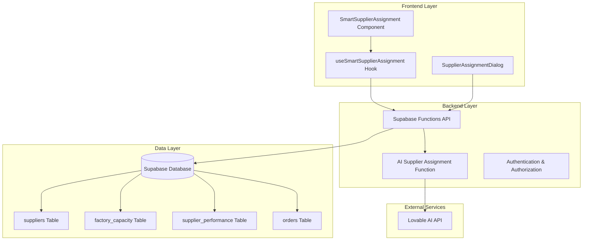
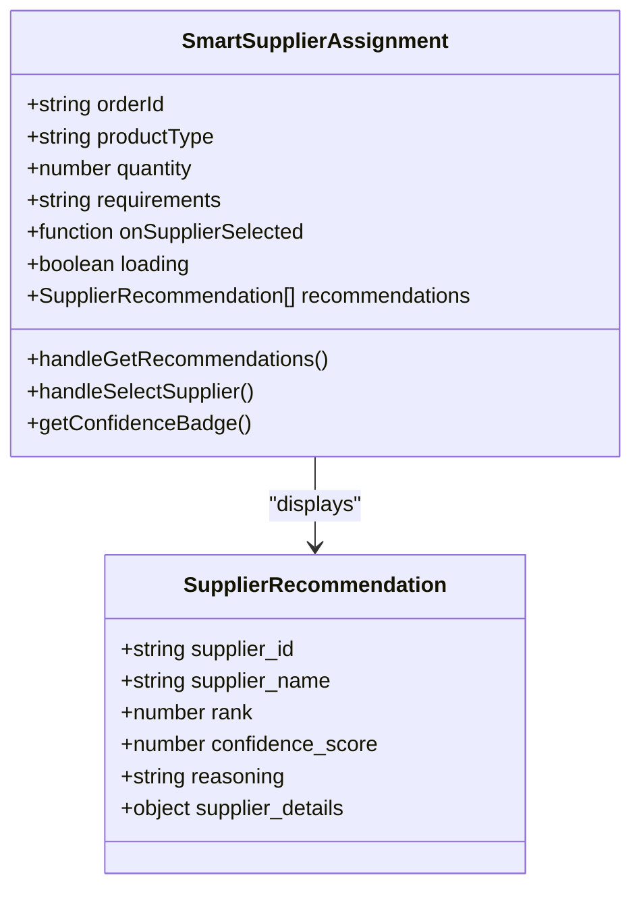
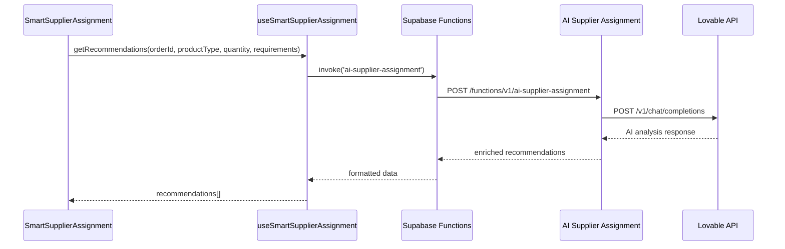
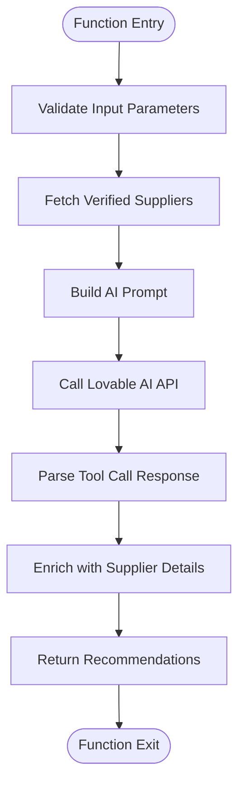
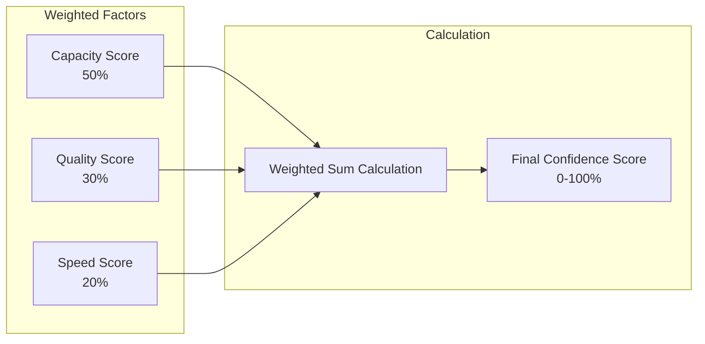
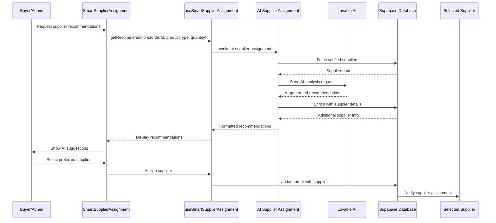

# Smart Supplier Assignment

<cite>
**Referenced Files in This Document**
- [SmartSupplierAssignment.tsx](file://src/components/admin/SmartSupplierAssignment.tsx)
- [useSmartSupplierAssignment.ts](file://src/hooks/useSmartSupplierAssignment.ts)
- [index.ts](file://supabase/functions/ai-supplier-assignment/index.ts)
- [SupplierAssignmentDialog.tsx](file://src/components/admin/SupplierAssignmentDialog.tsx)
- [calculate_factory_match_score.sql](file://supabase/COMPLETE_SETUP.sql)
- [database.ts](file://src/types/database.ts)
- [TABLES_ONLY.sql](file://supabase/TABLES_ONLY.sql)
- [seed_comprehensive_test_data.sql](file://supabase/seed_comprehensive_test_data.sql)
</cite>

## Table of Contents
1. [Introduction](#introduction)
2. [System Architecture](#system-architecture)
3. [Core Components](#core-components)
4. [Technical Implementation](#technical-implementation)
5. [Supplier Matching Algorithm](#supplier-matching-algorithm)
6. [Data Flow and Integration](#data-flow-and-integration)
7. [Practical Use Cases](#practical-use-cases)
8. [Common Issues and Solutions](#common-issues-and-solutions)
9. [Performance Considerations](#performance-considerations)
10. [Troubleshooting Guide](#troubleshooting-guide)

## Introduction

The Smart Supplier Assignment system is an AI-powered solution that automatically matches production orders with optimal manufacturing partners. This system reduces manual sourcing efforts while improving supplier selection accuracy by evaluating supplier capabilities against order requirements and generating confidence scores for each recommendation.

### Key Benefits

- **Automated Decision Making**: Eliminates manual supplier selection processes
- **Data-Driven Recommendations**: Uses AI analysis of supplier capabilities and order requirements
- **Confidence Scoring**: Provides confidence levels for each recommendation
- **Multi-Criteria Evaluation**: Considers capacity, expertise, performance, and cost factors
- **Real-Time Matching**: Delivers instant supplier recommendations

### Problem Solved

Traditional supplier assignment processes often rely on manual evaluation, leading to:
- Inconsistent supplier selection decisions
- Missed opportunities for optimal matches
- Increased administrative overhead
- Suboptimal capacity utilization
- Lack of standardized evaluation criteria

The Smart Supplier Assignment system addresses these challenges by providing objective, data-driven recommendations with confidence scoring.

## System Architecture

The Smart Supplier Assignment system follows a three-tier architecture with clear separation of concerns:



**Diagram sources**
- [SmartSupplierAssignment.tsx](file://src/components/admin/SmartSupplierAssignment.tsx#L1-L127)
- [useSmartSupplierAssignment.ts](file://src/hooks/useSmartSupplierAssignment.ts#L1-L55)
- [index.ts](file://supabase/functions/ai-supplier-assignment/index.ts#L1-L134)

## Core Components

### SmartSupplierAssignment Component

The main UI component that displays AI recommendations and handles user interactions.



**Diagram sources**
- [SmartSupplierAssignment.tsx](file://src/components/admin/SmartSupplierAssignment.tsx#L9-L23)
- [useSmartSupplierAssignment.ts](file://src/hooks/useSmartSupplierAssignment.ts#L5-L12)

### useSmartSupplierAssignment Hook

Orchestrates the AI recommendation process and manages state.



**Diagram sources**
- [useSmartSupplierAssignment.ts](file://src/hooks/useSmartSupplierAssignment.ts#L18-L48)
- [index.ts](file://supabase/functions/ai-supplier-assignment/index.ts#L22-L126)

### AI Supplier Assignment Function

The core backend function that performs the supplier matching analysis.

**Section sources**
- [SmartSupplierAssignment.tsx](file://src/components/admin/SmartSupplierAssignment.tsx#L1-L127)
- [useSmartSupplierAssignment.ts](file://src/hooks/useSmartSupplierAssignment.ts#L1-L55)
- [index.ts](file://supabase/functions/ai-supplier-assignment/index.ts#L1-L134)

## Technical Implementation

### Frontend Implementation

The frontend consists of two main components working together:

#### SmartSupplierAssignment Component Features:
- **Interactive UI**: Sparkles icon and AI-themed design elements
- **Confidence Scoring**: Visual badges indicating recommendation confidence
- **Supplier Details**: Comprehensive information display for each recommendation
- **Action Buttons**: Direct assignment functionality
- **Loading States**: Clear feedback during AI processing

#### useSmartSupplierAssignment Hook Features:
- **State Management**: Handles loading states and recommendation data
- **Error Handling**: Comprehensive error reporting with user-friendly messages
- **API Integration**: Seamless communication with Supabase functions
- **Data Enrichment**: Combines AI recommendations with supplier details

### Backend Implementation

#### Supabase Function Architecture:
The AI Supplier Assignment function serves as a bridge between the frontend and external AI services:



**Diagram sources**
- [index.ts](file://supabase/functions/ai-supplier-assignment/index.ts#L14-L126)

#### Database Schema Integration:
The system integrates with several key database tables:

| Table | Purpose | Key Fields |
|-------|---------|------------|
| `suppliers` | Supplier profiles and capabilities | `id`, `company_name`, `specializations`, `performance_score`, `monthly_capacity` |
| `factory_capacity` | Production capacity tracking | `supplier_id`, `date`, `available_capacity`, `total_capacity` |
| `supplier_performance` | Historical performance metrics | `supplier_id`, `quality_score`, `delivery_score`, `communication_score` |
| `orders` | Order management | `id`, `product_type`, `quantity`, `status` |

**Section sources**
- [index.ts](file://supabase/functions/ai-supplier-assignment/index.ts#L24-L35)
- [TABLES_ONLY.sql](file://supabase/TABLES_ONLY.sql#L832-L870)

## Supplier Matching Algorithm

### Multi-Factor Evaluation System

The Smart Supplier Assignment system employs a sophisticated matching algorithm that evaluates suppliers across multiple dimensions:

#### 1. Capability Matching
- **Specialization Alignment**: Matches product type requirements with supplier expertise
- **Capacity Assessment**: Evaluates monthly production capacity against order quantity
- **Minimum Order Quantity (MOQ)**: Ensures supplier can fulfill order requirements

#### 2. Performance Scoring
- **Historical Performance**: Based on supplier performance score (0-100 scale)
- **Delivery Reliability**: Lead time analysis and on-time delivery history
- **Quality Metrics**: Incorporates supplier quality scores and defect rates

#### 3. Cost Efficiency
- **Unit Pricing Analysis**: Compares supplier pricing against market benchmarks
- **Volume Discounts**: Considers bulk purchase benefits
- **Shipping Costs**: Accounts for logistics and transportation expenses

#### 4. Risk Assessment
- **Financial Stability**: Evaluates supplier financial health indicators
- **Geopolitical Factors**: Considers regional stability and trade regulations
- **Capacity Utilization**: Prevents overloading suppliers nearing capacity limits

### Confidence Scoring Formula

The system generates confidence scores using a weighted evaluation approach:



**Diagram sources**
- [calculate_factory_match_score.sql](file://supabase/COMPLETE_SETUP.sql#L192-L237)

### AI-Powered Analysis

The system leverages Lovable AI for advanced pattern recognition and predictive analysis:

#### System Prompt Template:
```
You are an expert at matching manufacturing orders with optimal suppliers. 
Analyze the order requirements and supplier capabilities to recommend the top 3 best matches.
Consider: specialization match, capacity, performance score, lead time, and overall fit.
```

#### User Prompt Structure:
The AI receives structured information including:
- Order details (product type, quantity, requirements)
- Available supplier profiles with comprehensive capabilities
- Historical performance data
- Current capacity utilization

**Section sources**
- [index.ts](file://supabase/functions/ai-supplier-assignment/index.ts#L38-L70)
- [calculate_factory_match_score.sql](file://supabase/COMPLETE_SETUP.sql#L192-L237)

## Data Flow and Integration

### Complete Data Pipeline

The Smart Supplier Assignment system follows a comprehensive data flow from order creation to supplier assignment:



**Diagram sources**
- [SmartSupplierAssignment.tsx](file://src/components/admin/SmartSupplierAssignment.tsx#L27-L37)
- [useSmartSupplierAssignment.ts](file://src/hooks/useSmartSupplierAssignment.ts#L18-L48)
- [index.ts](file://supabase/functions/ai-supplier-assignment/index.ts#L22-L126)

### Real-Time Data Updates

The system supports real-time updates through Supabase's realtime capabilities:

#### Event Triggers:
- **Supplier Capacity Changes**: Automatic re-evaluation of recommendations
- **Performance Updates**: Dynamic adjustment of supplier rankings
- **Order Status Changes**: Real-time notification of assignment confirmations

#### Data Synchronization:
- **Immediate Updates**: Supplier assignments reflected instantly across the platform
- **Conflict Resolution**: Handles concurrent assignment attempts gracefully
- **Audit Logging**: Maintains comprehensive logs of all assignment actions

**Section sources**
- [index.ts](file://supabase/functions/ai-supplier-assignment/index.ts#L114-L121)
- [SupplierAssignmentDialog.tsx](file://src/components/admin/SupplierAssignmentDialog.tsx#L68-L117)

## Practical Use Cases

### High-Volume Order Assignment

**Scenario**: Assigning a 10,000-piece hoodie order requiring specialized knitwear expertise.

**Implementation Approach**:
1. **Requirement Analysis**: System identifies need for knitwear specialists
2. **Capacity Evaluation**: Filters suppliers with adequate monthly capacity
3. **Expertise Matching**: Prioritizes suppliers with hoodie manufacturing experience
4. **Performance Review**: Considers historical performance on similar orders
5. **Confidence Scoring**: Generates recommendations with confidence levels

**Expected Outcome**:
- Top recommendation: Dhaka Knitwear Ltd (Gold Tier, 92.5% performance score)
- Alternative options: Mid-tier suppliers with complementary capabilities
- Confidence: 95% for primary recommendation, 78% for alternatives

### Balanced Production Distribution

**Scenario**: Distributing a large order across multiple suppliers to optimize capacity utilization.

**Implementation Approach**:
1. **Capacity Analysis**: Evaluates current supplier capacities
2. **Load Balancing**: Distributes order quantities across available suppliers
3. **Risk Mitigation**: Avoids overloading any single supplier
4. **Cost Optimization**: Minimizes shipping costs through strategic distribution

### Emergency Rush Order

**Scenario**: Handling urgent orders requiring expedited production.

**Implementation Approach**:
1. **Lead Time Analysis**: Identifies suppliers with shortest lead times
2. **Priority Assessment**: Considers supplier willingness to accommodate rush orders
3. **Capacity Flexibility**: Evaluates ability to increase production temporarily
4. **Communication Readiness**: Assesses supplier responsiveness to urgent requests

**Section sources**
- [seed_comprehensive_test_data.sql](file://supabase/seed_comprehensive_test_data.sql#L98-L122)

## Common Issues and Solutions

### Issue 1: Insufficient Supplier Matches

**Symptoms**:
- Empty recommendation list
- Generic "no suitable suppliers" message
- Low confidence scores across all recommendations

**Root Causes**:
- **Limited Supplier Pool**: Few verified suppliers in the system
- **Strict Requirements**: Order requirements exceed available supplier capabilities
- **Capacity Constraints**: All suppliers near maximum capacity
- **Specialization Mismatch**: No suppliers specialize in required product type

**Solutions**:
1. **Expand Supplier Network**: Encourage more manufacturers to join the platform
2. **Relax Requirements**: Allow flexibility in product specifications
3. **Capacity Planning**: Monitor and adjust supplier capacity forecasts
4. **Cross-Specialization**: Train suppliers in multiple product areas

### Issue 2: Low Confidence Recommendations

**Symptoms**:
- Recommendations with confidence scores below 60%
- Unclear reasoning for supplier selections
- Inconsistent with manual expectations

**Root Causes**:
- **Ambiguous Requirements**: Vague order specifications
- **Incomplete Supplier Data**: Missing capacity or performance information
- **AI Limitations**: Complex requirements exceeding AI capabilities
- **Data Quality Issues**: Outdated or inaccurate supplier information

**Solutions**:
1. **Improve Requirement Clarity**: Standardize order specification formats
2. **Data Validation**: Regular audits of supplier profile completeness
3. **Hybrid Approach**: Combine AI recommendations with human oversight
4. **Feedback Loop**: Learn from rejected recommendations to improve future matches

### Issue 3: Technical Integration Problems

**Symptoms**:
- API timeouts or errors
- Slow response times
- Data synchronization failures

**Root Causes**:
- **Network Issues**: Connectivity problems with external AI services
- **Rate Limiting**: Exceeding API usage limits
- **Database Performance**: Slow queries on large datasets
- **Authentication Failures**: Expired API keys or incorrect permissions

**Solutions**:
1. **Retry Logic**: Implement exponential backoff for failed requests
2. **Caching Strategy**: Cache frequently accessed supplier data
3. **Monitoring**: Set up alerts for performance degradation
4. **Fallback Mechanisms**: Provide manual assignment options when AI fails

**Section sources**
- [index.ts](file://supabase/functions/ai-supplier-assignment/index.ts#L127-L133)
- [useSmartSupplierAssignment.ts](file://src/hooks/useSmartSupplierAssignment.ts#L41-L45)

## Performance Considerations

### System Optimization Strategies

#### 1. Database Performance
- **Index Optimization**: Strategic indexing on frequently queried fields
- **Query Optimization**: Efficient SQL queries for supplier data retrieval
- **Connection Pooling**: Managed database connections for high throughput

#### 2. AI Service Efficiency
- **Prompt Engineering**: Optimized prompts for faster response times
- **Batch Processing**: Grouping similar requests for efficiency
- **Model Selection**: Choosing appropriate AI models for different use cases

#### 3. Frontend Responsiveness
- **Lazy Loading**: Load supplier data only when needed
- **Virtual Scrolling**: Handle large lists of recommendations efficiently
- **Debounced Searches**: Prevent excessive API calls during user input

### Scalability Planning

#### Horizontal Scaling Opportunities:
- **Function Instances**: Auto-scaling Supabase functions
- **Database Replicas**: Read replicas for heavy query loads
- **CDN Integration**: Static asset delivery optimization

#### Performance Monitoring:
- **Response Time Tracking**: Monitor AI API response times
- **Throughput Analysis**: Measure concurrent request handling
- **Error Rate Monitoring**: Track system reliability metrics

## Troubleshooting Guide

### Diagnostic Steps

#### Step 1: Verify System Health
1. **Check API Connectivity**: Test Lovable AI API availability
2. **Database Access**: Confirm supplier data accessibility
3. **Authentication**: Verify Supabase service role keys

#### Step 2: Analyze Error Patterns
1. **Error Classification**: Categorize by type (network, data, processing)
2. **Frequency Analysis**: Identify recurring issues
3. **Impact Assessment**: Determine business impact of failures

#### Step 3: Implement Solutions
1. **Immediate Fixes**: Quick patches for known issues
2. **Long-term Improvements**: System architecture enhancements
3. **Documentation Updates**: Share lessons learned

### Common Error Messages and Resolutions

| Error Message | Cause | Solution |
|---------------|-------|----------|
| "LOVABLE_API_KEY not configured" | Missing environment variable | Set LOVABLE_API_KEY in Supabase dashboard |
| "Failed to get supplier recommendations" | Network/API timeout | Implement retry logic with exponential backoff |
| "No verified suppliers found" | Empty supplier database | Add verified suppliers or relax filtering criteria |
| "AI API error: 429" | Rate limiting exceeded | Implement request throttling and caching |

### Monitoring and Alerting

#### Key Performance Indicators:
- **Recommendation Accuracy**: Percentage of successful assignments
- **Response Times**: Average time for AI analysis completion
- **System Availability**: Uptime percentage of core components
- **User Satisfaction**: Feedback scores for AI recommendations

#### Alert Configuration:
- **Critical Alerts**: System failures, security breaches
- **Warning Alerts**: Performance degradation, error rate increases
- **Informational Alerts**: System maintenance, capacity warnings

**Section sources**
- [index.ts](file://supabase/functions/ai-supplier-assignment/index.ts#L35-L36)
- [useSmartSupplierAssignment.ts](file://src/hooks/useSmartSupplierAssignment.ts#L41-L45)

## Conclusion

The Smart Supplier Assignment system represents a significant advancement in automated supplier selection, combining AI intelligence with comprehensive supplier data to deliver optimal matches for production orders. Through its sophisticated multi-factor evaluation system, confidence scoring mechanism, and seamless integration with the broader platform ecosystem, it addresses the key challenges of traditional supplier assignment processes.

### Key Success Factors

- **Comprehensive Data Integration**: Leveraging supplier profiles, capacity data, and performance metrics
- **Advanced AI Analysis**: Utilizing Lovable AI for intelligent pattern recognition and prediction
- **User-Centric Design**: Providing clear confidence scores and actionable recommendations
- **Robust Error Handling**: Ensuring reliable operation under various failure conditions

### Future Enhancement Opportunities

- **Machine Learning Integration**: Continuous learning from assignment outcomes
- **Multi-Language Support**: Expanding AI analysis to support diverse languages
- **Predictive Analytics**: Forecasting supplier capacity and performance trends
- **Collaborative Filtering**: Incorporating peer supplier ratings and reviews

The system continues to evolve, incorporating user feedback and technological advancements to maintain its position as a leading solution for intelligent supplier assignment in the manufacturing industry.