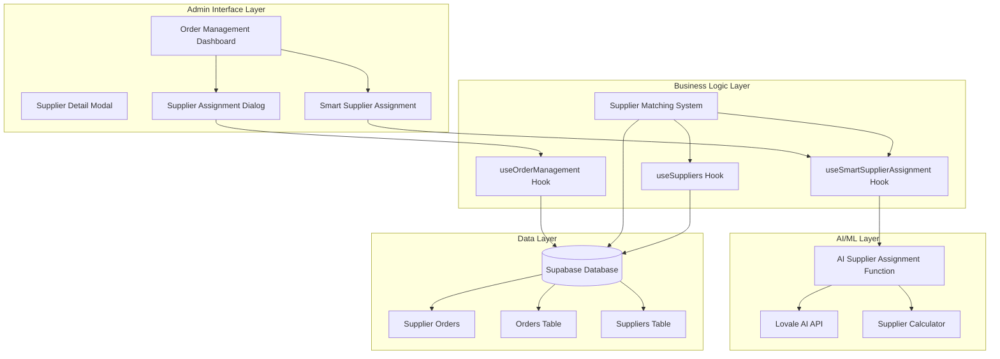
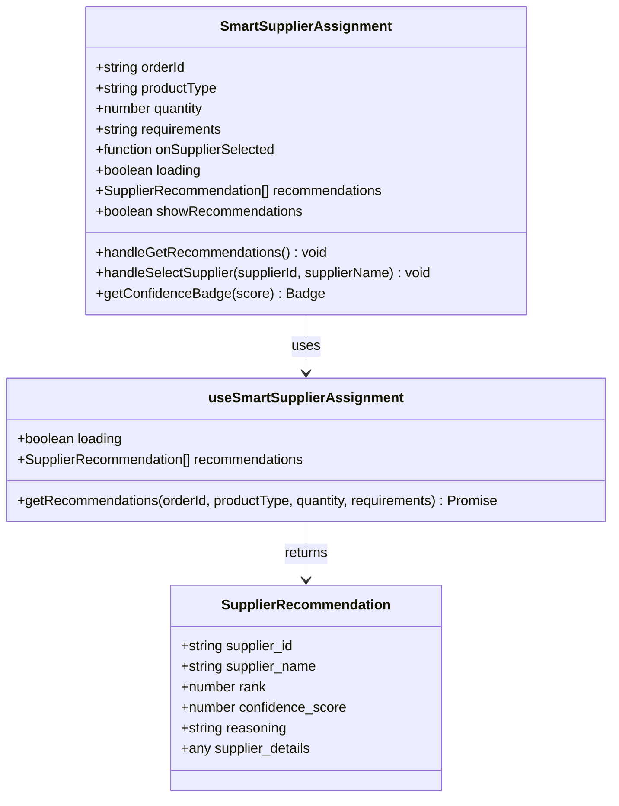
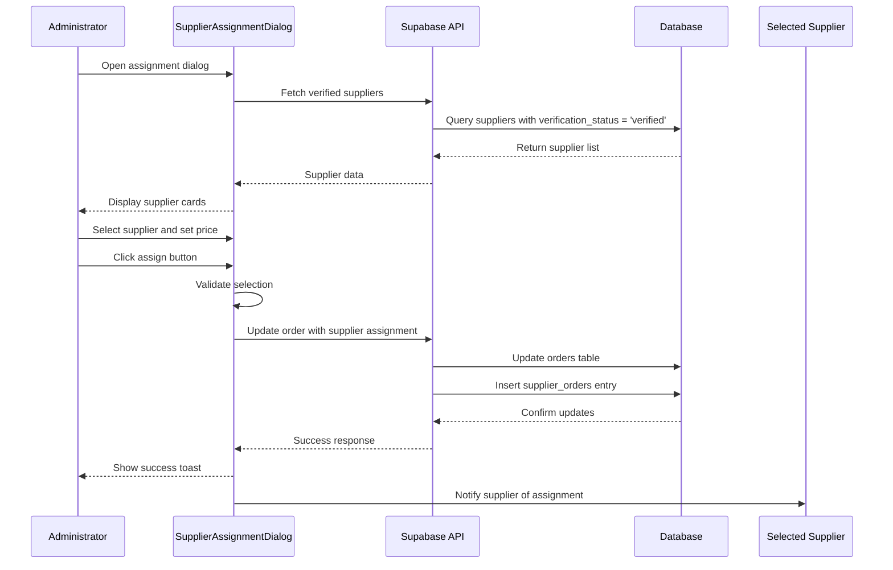
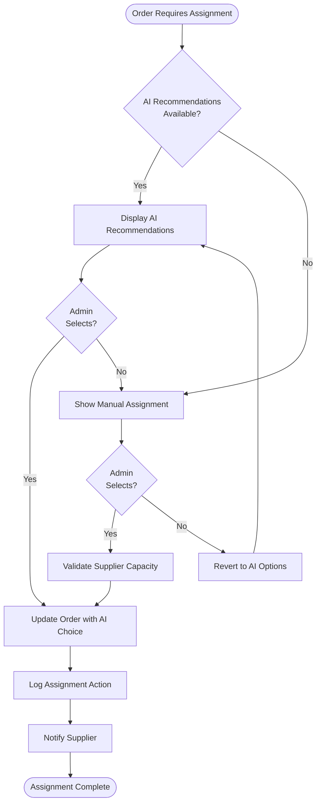
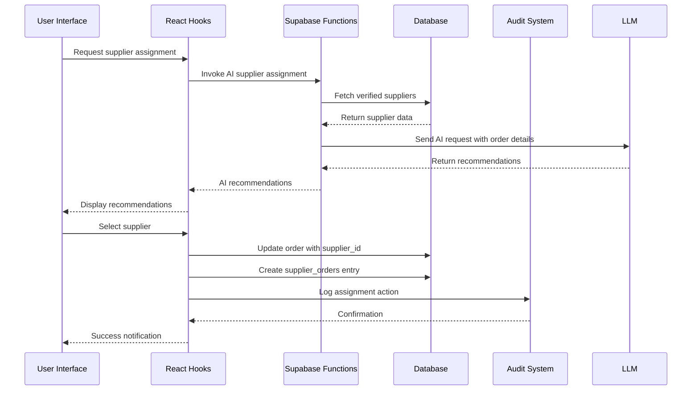
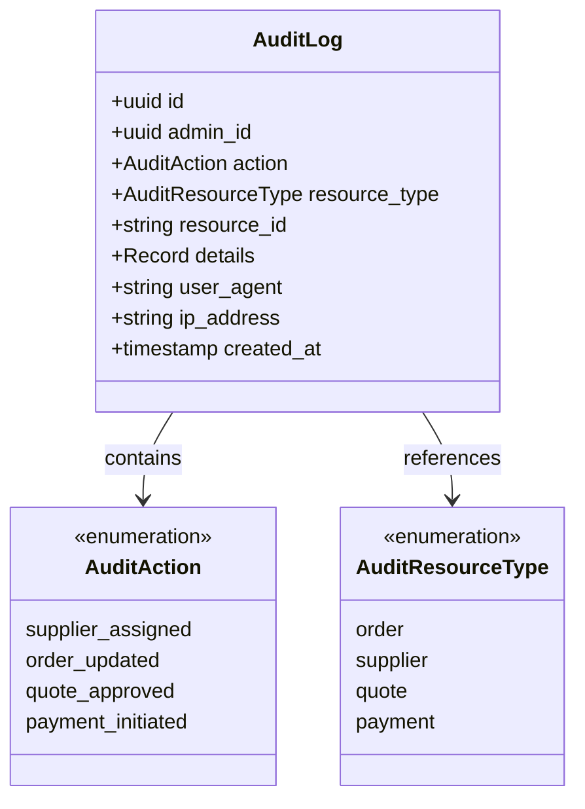

# Supplier Matching System

<cite>
**Referenced Files in This Document**
- [SmartSupplierAssignment.tsx](file://src/components/admin/SmartSupplierAssignment.tsx)
- [SupplierAssignmentDialog.tsx](file://src/components/admin/SupplierAssignmentDialog.tsx)
- [SupplierMatchingSystem.tsx](file://src/components/admin/SupplierMatchingSystem.tsx)
- [useSmartSupplierAssignment.ts](file://src/hooks/useSmartSupplierAssignment.ts)
- [ai-supplier-assignment/index.ts](file://supabase/functions/ai-supplier-assignment/index.ts)
- [useOrderManagement.ts](file://src/hooks/useOrderManagement.ts)
- [useSuppliers.ts](file://src/hooks/useSuppliers.ts)
- [OrderManagement.tsx](file://src/pages/admin/OrderManagement.tsx)
- [auditLog.ts](file://src/lib/auditLog.ts)
- [TABLES_ONLY.sql](file://supabase/TABLES_ONLY.sql)
</cite>

## Table of Contents
1. [Introduction](#introduction)
2. [System Architecture](#system-architecture)
3. [AI-Powered Supplier Assignment](#ai-powered-supplier-assignment)
4. [Manual Supplier Assignment](#manual-supplier-assignment)
5. [Integration Between Components](#integration-between-components)
6. [Data Flow and State Management](#data-flow-and-state-management)
7. [Supplier Eligibility and Constraints](#supplier-eligibility-and-constraints)
8. [Edge Cases and Error Handling](#edge-cases-and-error-handling)
9. [Business Logic Implementation](#business-logic-implementation)
10. [Auditing and Compliance](#auditing-and-compliance)
11. [Performance Considerations](#performance-considerations)
12. [Troubleshooting Guide](#troubleshooting-guide)

## Introduction

The Supplier Matching System is a comprehensive solution that combines AI-powered recommendations with manual assignment capabilities to optimize order fulfillment for administrators. This system provides flexible options for supplier assignment, leveraging both automated intelligence and human oversight to ensure optimal supplier selection while maintaining compliance and operational efficiency.

The system operates across multiple components that work together to provide a seamless workflow for order management, supplier matching, and assignment tracking. It integrates sophisticated AI algorithms with robust manual controls, enabling administrators to make informed decisions while maintaining full visibility into the assignment process.

## System Architecture

The Supplier Matching System follows a modular architecture that separates concerns between AI recommendation, manual assignment, and administrative oversight:



**Diagram sources**
- [OrderManagement.tsx](file://src/pages/admin/OrderManagement.tsx#L1-L306)
- [SmartSupplierAssignment.tsx](file://src/components/admin/SmartSupplierAssignment.tsx#L1-L127)
- [SupplierAssignmentDialog.tsx](file://src/components/admin/SupplierAssignmentDialog.tsx#L1-L238)
- [SupplierMatchingSystem.tsx](file://src/components/admin/SupplierMatchingSystem.tsx#L1-L744)

**Section sources**
- [OrderManagement.tsx](file://src/pages/admin/OrderManagement.tsx#L1-L306)
- [SmartSupplierAssignment.tsx](file://src/components/admin/SmartSupplierAssignment.tsx#L1-L127)
- [SupplierAssignmentDialog.tsx](file://src/components/admin/SupplierAssignmentDialog.tsx#L1-L238)

## AI-Powered Supplier Assignment

The AI-powered supplier assignment component provides intelligent recommendations based on order requirements and supplier capabilities. This system leverages advanced AI algorithms to analyze multiple factors and present ranked supplier recommendations.

### SmartSupplierAssignment Component

The SmartSupplierAssignment component serves as the primary interface for AI-driven supplier recommendations:



**Diagram sources**
- [SmartSupplierAssignment.tsx](file://src/components/admin/SmartSupplierAssignment.tsx#L9-L23)
- [useSmartSupplierAssignment.ts](file://src/hooks/useSmartSupplierAssignment.ts#L5-L12)

### AI Recommendation Algorithm

The AI recommendation system utilizes a sophisticated scoring mechanism that evaluates suppliers based on multiple criteria:

| Factor | Weight | Description |
|--------|--------|-------------|
| Specialization Match | 40% | Alignment between product type and supplier expertise |
| Capacity Utilization | 25% | Current workload versus supplier capacity |
| Performance Score | 20% | Historical performance metrics and ratings |
| On-Time Delivery | 15% | Supplier's track record for meeting deadlines |

The AI function processes order requirements and supplier capabilities to generate confidence scores ranging from 0-100, with recommendations presented in ranked order.

**Section sources**
- [SmartSupplierAssignment.tsx](file://src/components/admin/SmartSupplierAssignment.tsx#L1-L127)
- [useSmartSupplierAssignment.ts](file://src/hooks/useSmartSupplierAssignment.ts#L1-L55)
- [ai-supplier-assignment/index.ts](file://supabase/functions/ai-supplier-assignment/index.ts#L1-L134)

## Manual Supplier Assignment

The manual assignment interface provides administrators with comprehensive control over supplier selection, enabling them to override AI recommendations or assign suppliers when automatic matching is insufficient.

### SupplierAssignmentDialog Component

The SupplierAssignmentDialog offers a comprehensive manual assignment interface:



**Diagram sources**
- [SupplierAssignmentDialog.tsx](file://src/components/admin/SupplierAssignmentDialog.tsx#L69-L118)
- [useOrderManagement.ts](file://src/hooks/useOrderManagement.ts#L52-L121)

### Manual Assignment Features

The manual assignment system includes several key features:

- **Supplier Search**: Real-time filtering by company name and location
- **Pricing Control**: Direct input of supplier prices with margin calculations
- **Special Instructions**: Optional notes for supplier communication
- **Capacity Validation**: Automatic checking of supplier capacity limits
- **Verification Status**: Ensures only verified suppliers are selectable

**Section sources**
- [SupplierAssignmentDialog.tsx](file://src/components/admin/SupplierAssignmentDialog.tsx#L1-L238)
- [useOrderManagement.ts](file://src/hooks/useOrderManagement.ts#L52-L121)

## Integration Between Components

The system integrates multiple components to provide a cohesive workflow for supplier assignment:

### Component Interaction Flow



**Diagram sources**
- [OrderManagement.tsx](file://src/pages/admin/OrderManagement.tsx#L42-L306)
- [SmartSupplierAssignment.tsx](file://src/components/admin/SmartSupplierAssignment.tsx#L27-L37)

### Shared State Management

The system maintains consistent state across components through centralized hooks and React Query:

- **Order State**: Managed through `useOrderManagement` hook
- **Supplier State**: Managed through `useSuppliers` hook  
- **AI Recommendations**: Managed through `useSmartSupplierAssignment` hook
- **UI State**: Controlled through local component state

**Section sources**
- [OrderManagement.tsx](file://src/pages/admin/OrderManagement.tsx#L42-L306)
- [useOrderManagement.ts](file://src/hooks/useOrderManagement.ts#L1-L130)
- [useSuppliers.ts](file://src/hooks/useSuppliers.ts#L1-L215)

## Data Flow and State Management

The supplier assignment system manages complex data flows between multiple systems and maintains consistency through careful state management:

### Order Assignment Data Flow



**Diagram sources**
- [useSmartSupplierAssignment.ts](file://src/hooks/useSmartSupplierAssignment.ts#L18-L47)
- [useOrderManagement.ts](file://src/hooks/useOrderManagement.ts#L52-L121)
- [auditLog.ts](file://src/lib/auditLog.ts#L35-L72)

### Mutation Handling

The system handles mutations through dedicated hooks that manage loading states, error handling, and optimistic updates:

- **Order Updates**: Atomic updates to maintain data consistency
- **Supplier Orders**: Automatic creation of related records
- **Status Tracking**: Comprehensive workflow status updates
- **Margin Calculations**: Real-time profit margin calculations

**Section sources**
- [useOrderManagement.ts](file://src/hooks/useOrderManagement.ts#L52-L121)
- [useSmartSupplierAssignment.ts](file://src/hooks/useSmartSupplierAssignment.ts#L18-L47)

## Supplier Eligibility and Constraints

The system enforces strict eligibility criteria to ensure only qualified suppliers are considered for assignments:

### Verification Status Requirements

| Status | Eligibility | Description |
|--------|-------------|-------------|
| Verified | ✅ Allowed | Fully vetted and approved suppliers |
| Pending | ❌ Not Allowed | Under review, cannot accept orders |
| Rejected | ❌ Not Allowed | Failed verification process |
| Suspended | ❌ Not Allowed | Temporarily suspended account |

### Capacity Constraints

The system automatically validates supplier capacity before assignment:

- **Monthly Capacity**: Checks against supplier's reported capacity
- **Current Workload**: Considers existing order commitments
- **Utilization Rate**: Prevents overloading suppliers beyond 80% capacity
- **Lead Time**: Validates that supplier can meet timeline requirements

### Performance Metrics

Suppliers are evaluated based on multiple performance indicators:

- **Rating Score**: 0-5 scale based on historical performance
- **On-Time Delivery**: Percentage of orders delivered on schedule
- **Quality Score**: Average quality assessment from buyers
- **Response Time**: Average time to respond to inquiries

**Section sources**
- [useSuppliers.ts](file://src/hooks/useSuppliers.ts#L48-L90)
- [SupplierMatchingSystem.tsx](file://src/components/admin/SupplierMatchingSystem.tsx#L200-L228)

## Edge Cases and Error Handling

The system handles various edge cases to ensure robust operation under different scenarios:

### Orders with No Qualified Suppliers

When no suppliers meet the requirements, the system provides clear feedback:

- **AI Recommendations**: Returns empty recommendation list with explanatory message
- **Manual Assignment**: Filters out ineligible suppliers from selection
- **Fallback Options**: Suggests alternative suppliers or manual intervention

### Low-Confidence AI Matches

For low-confidence AI recommendations, the system provides transparency:

- **Confidence Scoring**: Clear indication of recommendation confidence (High/Medium/Low)
- **Reasoning Display**: Detailed explanation of AI decision-making process
- **Human Override**: Easy option to bypass AI recommendations

### Urgent Orders and Manual Overrides

The system accommodates urgent situations:

- **Priority Assignment**: Special handling for high-urgency orders
- **Manual Override**: Direct assignment capability for critical situations
- **Relationship Management**: Ability to honor specific supplier relationships

### Error Recovery

The system implements comprehensive error recovery mechanisms:

- **Network Failures**: Automatic retry with exponential backoff
- **Data Validation**: Immediate feedback for invalid inputs
- **Transaction Rollback**: Automatic rollback on partial failures
- **User Notification**: Clear error messages with resolution guidance

**Section sources**
- [SmartSupplierAssignment.tsx](file://src/components/admin/SmartSupplierAssignment.tsx#L39-L43)
- [SupplierAssignmentDialog.tsx](file://src/components/admin/SupplierAssignmentDialog.tsx#L69-L86)

## Business Logic Implementation

The system implements sophisticated business logic to ensure optimal supplier selection and assignment:

### Supplier Matching Algorithm

The matching system uses a weighted scoring algorithm:

```mermaid
flowchart TD
Start([Order Received]) --> GetSuppliers[Fetch Verified Suppliers]
GetSuppliers --> CalcScore[Calculate Match Score]
CalcScore --> SpecMatch{Specialization<br/>Match?}
SpecMatch --> |Exact| Add40[+40 Points]
SpecMatch --> |Partial| Add20[+20 Points]
SpecMatch --> |None| Add0[+0 Points]
Add40 --> CapacityCheck{Capacity<br/>Utilization}
Add20 --> CapacityCheck
Add0 --> CapacityCheck
CapacityCheck --> LowCap[<50% Utilization<br/>+25 Points]
CapacityCheck --> MedCap[50-75% Utilization<br/>+15 Points]
CapacityCheck --> HighCap[75-90% Utilization<br/>+5 Points]
CapacityCheck --> FullCap[>90% Utilization<br/>+0 Points]
LowCap --> PerfScore[Add Performance Score<br/>(0-20 Points)]
MedCap --> PerfScore
HighCap --> PerfScore
FullCap --> PerfScore
PerfScore --> DelivRate[Add On-Time Delivery<br/>(0-15 Points)]
DelivRate --> FinalScore[Final Match Score]
FinalScore --> RankSuppliers[Rank Suppliers]
RankSuppliers --> Top3[Return Top 3]
```

**Diagram sources**
- [SupplierMatchingSystem.tsx](file://src/components/admin/SupplierMatchingSystem.tsx#L200-L228)

### Workflow Status Management

The system tracks comprehensive workflow status changes:

| Status | Description | Next Steps |
|--------|-------------|------------|
| `payment_received` | Order payment confirmed | Ready for supplier assignment |
| `assigned_to_supplier` | Supplier assigned | Move to production workflow |
| `sample_requested` | Sample phase initiated | Quality inspection required |
| `bulk_production` | Large-scale production | Quality control monitoring |
| `completed` | Order fulfilled | Post-delivery support |

**Section sources**
- [SupplierMatchingSystem.tsx](file://src/components/admin/SupplierMatchingSystem.tsx#L200-L243)
- [OrderManagement.tsx](file://src/pages/admin/OrderManagement.tsx#L78-L90)

## Auditing and Compliance

The system implements comprehensive auditing capabilities for compliance and accountability:

### Audit Logging System

The audit system tracks all supplier assignment actions:



**Diagram sources**
- [auditLog.ts](file://src/lib/auditLog.ts#L3-L17)

### Compliance Features

The system ensures compliance through:

- **Action Tracing**: Complete audit trail of all assignment actions
- **User Accountability**: Link actions to specific administrator accounts
- **Change Detection**: Automatic detection of unauthorized modifications
- **Reporting**: Comprehensive reporting capabilities for compliance reviews

### Assignment History Tracking

Each supplier assignment creates a complete audit record:

- **Assignment Details**: Supplier, price, and order information
- **Decision Context**: AI confidence scores and reasoning
- **User Information**: Administrator who performed the assignment
- **Timestamp**: Precise timing of all actions
- **System Metadata**: Browser, IP address, and device information

**Section sources**
- [auditLog.ts](file://src/lib/auditLog.ts#L35-L72)
- [useOrderManagement.ts](file://src/hooks/useOrderManagement.ts#L90-L101)

## Performance Considerations

The system is optimized for performance across multiple dimensions:

### Caching Strategies

- **Supplier Data**: 10-minute cache for verified supplier lists
- **AI Recommendations**: Optimized caching for repeated requests
- **Order Data**: Reactive updates with efficient polling
- **Search Results**: Client-side filtering for large datasets

### Optimization Techniques

- **Memoization**: Expensive calculations cached using React.memo
- **Debounced Search**: Input debouncing for real-time filtering
- **Virtual Scrolling**: Efficient rendering of large supplier lists
- **Parallel Loading**: Concurrent data fetching for improved UX

### Scalability Features

- **Database Indexing**: Optimized queries for supplier and order data
- **Function Caching**: Supabase Edge Functions with caching
- **CDN Integration**: Static asset optimization
- **Connection Pooling**: Efficient database connection management

## Troubleshooting Guide

Common issues and their resolutions:

### AI Recommendations Not Loading

**Symptoms**: AI recommendations fail to appear or timeout
**Causes**: Network issues, API failures, or insufficient data
**Solutions**: 
- Verify network connectivity
- Check AI service availability
- Ensure sufficient supplier data exists
- Review API rate limiting

### Manual Assignment Failures

**Symptoms**: Supplier assignment fails silently or with errors
**Causes**: Invalid supplier selection, capacity conflicts, or database errors
**Solutions**:
- Verify supplier is still verified
- Check supplier capacity constraints
- Validate order data integrity
- Review database connection status

### Performance Issues

**Symptoms**: Slow loading or unresponsive interface
**Causes**: Large datasets, inefficient queries, or network latency
**Solutions**:
- Implement pagination for large lists
- Optimize database queries
- Enable client-side caching
- Reduce concurrent requests

### Data Consistency Problems

**Symptoms**: Inconsistent order or supplier data
**Causes**: Race conditions, transaction failures, or synchronization issues
**Solutions**:
- Implement proper transaction handling
- Use optimistic updates with rollback
- Ensure proper error handling
- Monitor database constraints

**Section sources**
- [useSmartSupplierAssignment.ts](file://src/hooks/useSmartSupplierAssignment.ts#L41-L47)
- [SupplierAssignmentDialog.tsx](file://src/components/admin/SupplierAssignmentDialog.tsx#L57-L66)
- [useOrderManagement.ts](file://src/hooks/useOrderManagement.ts#L111-L119)