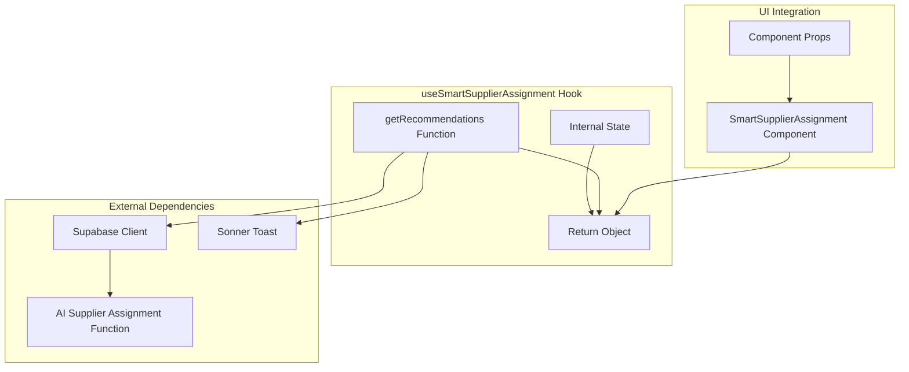
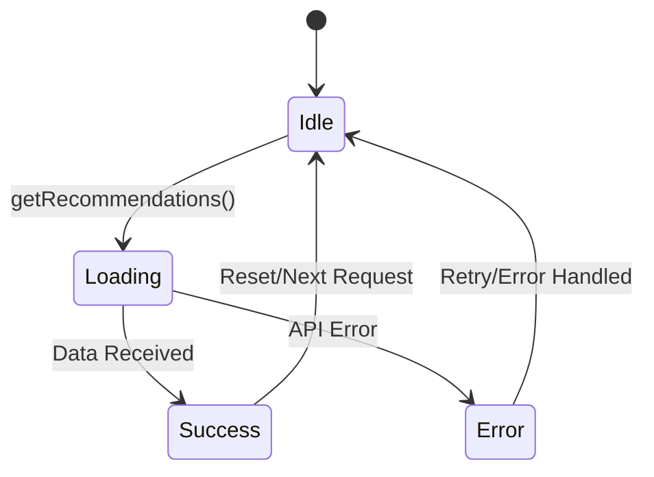
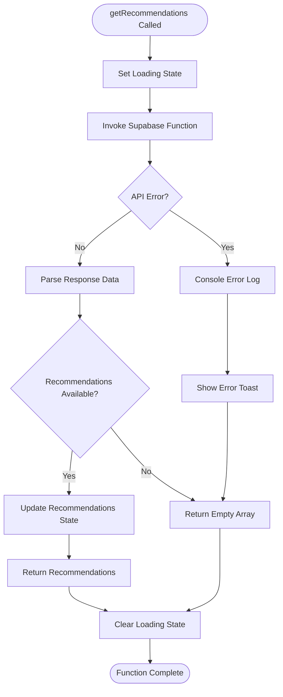

# useSmartSupplierAssignment Hook

<cite>
**Referenced Files in This Document**
- [useSmartSupplierAssignment.ts](file://src/hooks/useSmartSupplierAssignment.ts)
- [SmartSupplierAssignment.tsx](file://src/components/admin/SmartSupplierAssignment.tsx)
- [ai-supplier-assignment/index.ts](file://supabase/functions/ai-supplier-assignment/index.ts)
- [client.ts](file://src/integrations/supabase/client.ts)
- [supabase.ts](file://src/test/mocks/supabase.ts)
- [ModernAdminDashboard.tsx](file://src/pages/ModernAdminDashboard.tsx)
- [database.ts](file://src/types/database.ts)
</cite>

## Table of Contents
1. [Introduction](#introduction)
2. [Hook Architecture](#hook-architecture)
3. [Internal State Management](#internal-state-management)
4. [Core Functionality](#core-functionality)
5. [Error Handling Mechanism](#error-handling-mechanism)
6. [Integration Patterns](#integration-patterns)
7. [Performance Considerations](#performance-considerations)
8. [Testing Strategies](#testing-strategies)
9. [React Query Integration](#react-query-integration)
10. [Best Practices](#best-practices)

## Introduction

The `useSmartSupplierAssignment` custom React hook serves as the primary data-fetching layer for connecting the SmartSupplierAssignment component to the AI-powered supplier recommendation system. Built on top of Supabase's serverless functions, this hook orchestrates the frontend logic for retrieving intelligent supplier recommendations based on order parameters, enabling data-driven supplier assignment decisions.

The hook acts as a clean abstraction layer that separates UI concerns from backend data operations, providing a type-safe interface for AI-powered supplier matching while maintaining optimal user experience through proper loading states and error handling.

## Hook Architecture

The `useSmartSupplierAssignment` hook follows a functional component pattern with React's useState hook for local state management. It exposes a clean interface with three primary properties that enable seamless integration with the SmartSupplierAssignment component.



**Diagram sources**
- [useSmartSupplierAssignment.ts](file://src/hooks/useSmartSupplierAssignment.ts#L14-L55)
- [SmartSupplierAssignment.tsx](file://src/components/admin/SmartSupplierAssignment.tsx#L17-L24)

**Section sources**
- [useSmartSupplierAssignment.ts](file://src/hooks/useSmartSupplierAssignment.ts#L1-L55)

## Internal State Management

The hook maintains two critical pieces of internal state that govern the user experience and data flow:

### Loading State
The `loading` state is managed through React's useState hook and serves as a boolean indicator for API call status. This state is crucial for providing immediate user feedback during asynchronous operations and prevents multiple concurrent requests by disabling UI controls during processing.

### Recommendations State
The `recommendations` state stores the parsed supplier recommendation data as an array of `SupplierRecommendation` objects. This state is initialized as an empty array and populated with enriched recommendation data containing supplier details, confidence scores, and reasoning information.



**Diagram sources**
- [useSmartSupplierAssignment.ts](file://src/hooks/useSmartSupplierAssignment.ts#L15-L16)

**Section sources**
- [useSmartSupplierAssignment.ts](file://src/hooks/useSmartSupplierAssignment.ts#L15-L16)

## Core Functionality

### SupplierRecommendation Interface

The hook defines a comprehensive `SupplierRecommendation` interface that captures all essential information for supplier matching:

| Property | Type | Description | Purpose |
|----------|------|-------------|---------|
| `supplier_id` | string | Unique identifier for the supplier | Used for supplier selection and assignment |
| `supplier_name` | string | Human-readable supplier name | Displayed in UI recommendations |
| `rank` | number | Priority ranking (1-3) | Determines recommendation order |
| `confidence_score` | number | AI confidence percentage (0-100) | Indicates recommendation reliability |
| `reasoning` | string | AI-generated rationale | Provides transparency to decision-making |
| `supplier_details` | any | Complete supplier profile data | Enables detailed supplier information display |

### getRecommendations Function

The core `getRecommendations` function serves as the primary API endpoint for supplier matching. It accepts four parameters and orchestrates the complete recommendation workflow:

#### Function Signature
```typescript
async getRecommendations(
  orderId: string, 
  productType: string, 
  quantity: number, 
  requirements?: string
): Promise<SupplierRecommendation[]>
```

#### Parameter Processing
The function transforms incoming parameters into a standardized payload for the AI supplier assignment function, ensuring consistent data formatting across different UI contexts.

#### API Integration
The function utilizes Supabase's `functions.invoke` method to communicate with the serverless AI function, providing automatic retry mechanisms and network error handling.

**Section sources**
- [useSmartSupplierAssignment.ts](file://src/hooks/useSmartSupplierAssignment.ts#L5-L12)
- [useSmartSupplierAssignment.ts](file://src/hooks/useSmartSupplierAssignment.ts#L18-L47)

## Error Handling Mechanism

The hook implements a robust error handling strategy using try/catch blocks with comprehensive logging and user feedback mechanisms:

### Try/Catch Implementation
The function wraps the entire API call within a try/catch block to gracefully handle both synchronous and asynchronous errors. This approach ensures that any unexpected failures are caught and processed appropriately.

### Console Logging
Debug information is logged to the console for development and monitoring purposes, capturing the raw AI response data for troubleshooting and analysis.

### User Feedback System
The hook integrates with the Sonner toast library to provide immediate user feedback for error conditions. When errors occur, users receive contextual error messages that explain the failure and suggest next steps.

### Error Recovery
The function returns an empty array in error scenarios, ensuring predictable behavior for the consuming component while allowing for graceful degradation.



**Diagram sources**
- [useSmartSupplierAssignment.ts](file://src/hooks/useSmartSupplierAssignment.ts#L18-L47)

**Section sources**
- [useSmartSupplierAssignment.ts](file://src/hooks/useSmartSupplierAssignment.ts#L41-L47)

## Integration Patterns

### Component Integration

The hook is designed to integrate seamlessly with the SmartSupplierAssignment component through a clean props-based interface. The component receives the hook's return values and passes necessary parameters to trigger the recommendation process.

### Parent Component Integration

The hook supports parent component integration patterns, particularly evident in the ModernAdminDashboard implementation where successful supplier assignments trigger cache invalidation for related queries.

### Parameter Forwarding

The hook demonstrates proper parameter forwarding patterns, accepting order-specific parameters and transforming them into the appropriate format for the AI function call.

**Section sources**
- [SmartSupplierAssignment.tsx](file://src/components/admin/SmartSupplierAssignment.tsx#L17-L24)
- [ModernAdminDashboard.tsx](file://src/pages/ModernAdminDashboard.tsx#L424-L433)

## Performance Considerations

### Loading State Management

The hook implements proper loading state management to prevent multiple concurrent requests and provide immediate user feedback. The loading state is set to true at the beginning of the API call and cleared in the finally block, ensuring consistent UI behavior.

### Memory Management

The hook avoids memory leaks through proper state cleanup and does not maintain persistent references to external resources. The state is scoped to the hook's lifecycle and cleaned up when the component unmounts.

### Network Optimization

While the hook doesn't implement explicit caching, it leverages Supabase's built-in caching mechanisms for function responses. The serverless nature of the AI function allows for efficient scaling and reduced latency for subsequent requests.

### Potential Improvements

#### Memoization Strategy
For components that frequently call `getRecommendations` with identical parameters, implementing memoization could reduce unnecessary API calls. This could be achieved through React.memo or custom memoization logic.

#### Debouncing Implementation
Adding debouncing to the `getRecommendations` function call could prevent rapid-fire API requests when users rapidly change input parameters.

#### Concurrent Request Prevention
The current implementation prevents multiple concurrent requests through loading state management, but additional safeguards could be implemented for complex UI interactions.

## Testing Strategies

### Unit Testing with Vitest

The hook is designed to be easily testable with Vitest through proper mocking of Supabase function calls. The test setup should mock the Supabase client to isolate the hook's logic from external dependencies.

### Mock Implementation Pattern

The project includes a comprehensive mock Supabase client that can be adapted for testing the hook. The mock should simulate both successful responses and error conditions to ensure comprehensive test coverage.

### Test Scenarios

#### Successful Recommendation Retrieval
Test the happy path where the AI function returns valid recommendations, verifying state updates and return values.

#### Error Condition Handling
Test error scenarios including network failures, API errors, and malformed responses to ensure proper error handling and user feedback.

#### Loading State Behavior
Verify that the loading state is properly managed throughout the API call lifecycle, including state transitions and cleanup.

### Testing Utilities

The project provides testing utilities that can be extended for hook-specific testing, including mock implementations and test setup configurations.

**Section sources**
- [supabase.ts](file://src/test/mocks/supabase.ts#L15-L17)

## React Query Integration

### Caching Strategy

While the current implementation doesn't utilize React Query, the hook's design is compatible with React Query integration for enhanced caching and state management:

#### Query Key Design
The hook could benefit from React Query integration with carefully designed query keys that incorporate order parameters and timestamps for cache invalidation.

#### Stale-While-Revalidate Pattern
Implementing React Query would enable stale-while-revalidate patterns for recommendation data, allowing cached results while fetching fresh data in the background.

#### Mutation Integration
Supplier assignment mutations could leverage React Query's mutation system for optimistic updates and cache synchronization.

### Cache Invalidation

The ModernAdminDashboard demonstrates proper cache invalidation patterns where successful supplier assignments trigger related query invalidation, maintaining data consistency across the application.

**Section sources**
- [ModernAdminDashboard.tsx](file://src/pages/ModernAdminDashboard.tsx#L430-L432)

## Best Practices

### Type Safety
The hook demonstrates excellent TypeScript usage with strongly typed interfaces and return values, ensuring compile-time safety and developer experience.

### Separation of Concerns
The hook successfully separates data-fetching logic from UI presentation, enabling clean component architecture and easier maintenance.

### Error Boundaries
The comprehensive error handling demonstrates best practices for building resilient applications that gracefully handle failures.

### User Experience
The loading states and error feedback mechanisms provide excellent user experience through immediate feedback and clear communication of system status.

### Scalability
The serverless architecture and Supabase integration provide scalable solutions that can handle increased load without significant infrastructure changes.

**Section sources**
- [useSmartSupplierAssignment.ts](file://src/hooks/useSmartSupplierAssignment.ts#L1-L55)