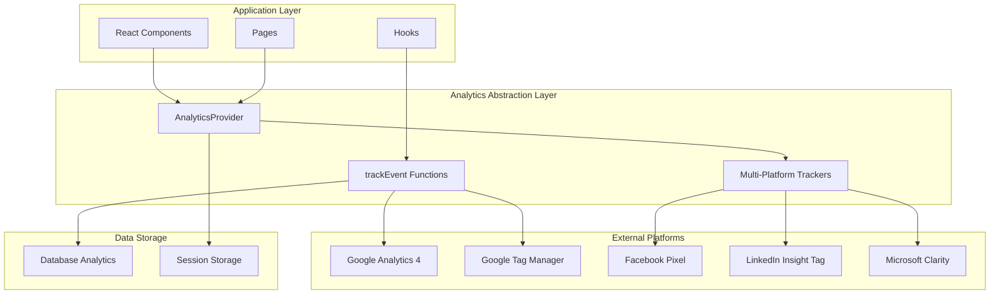
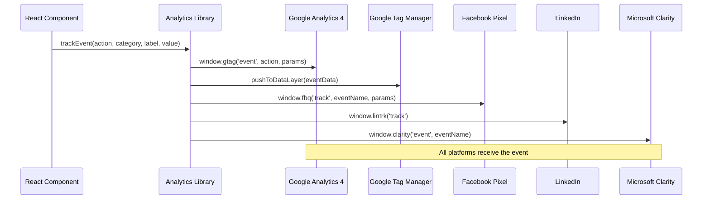
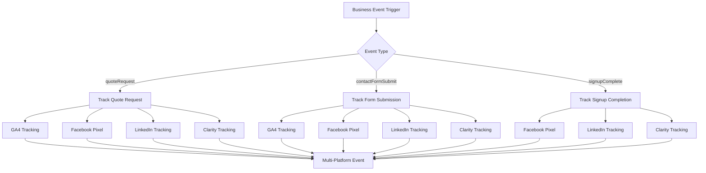
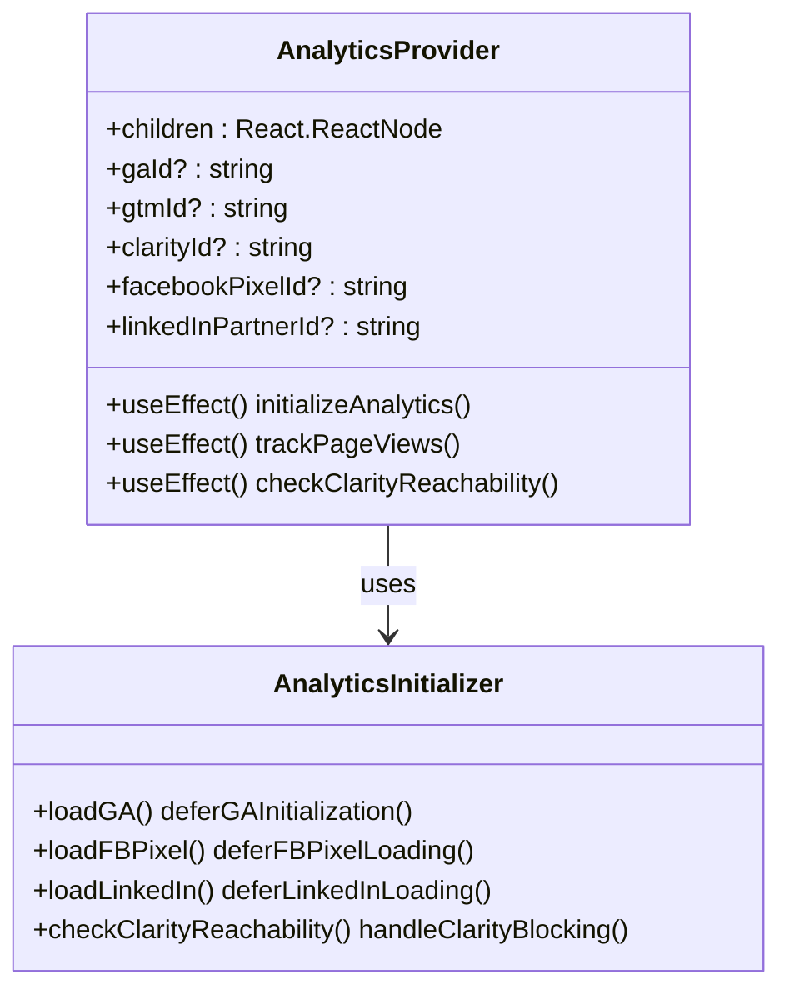
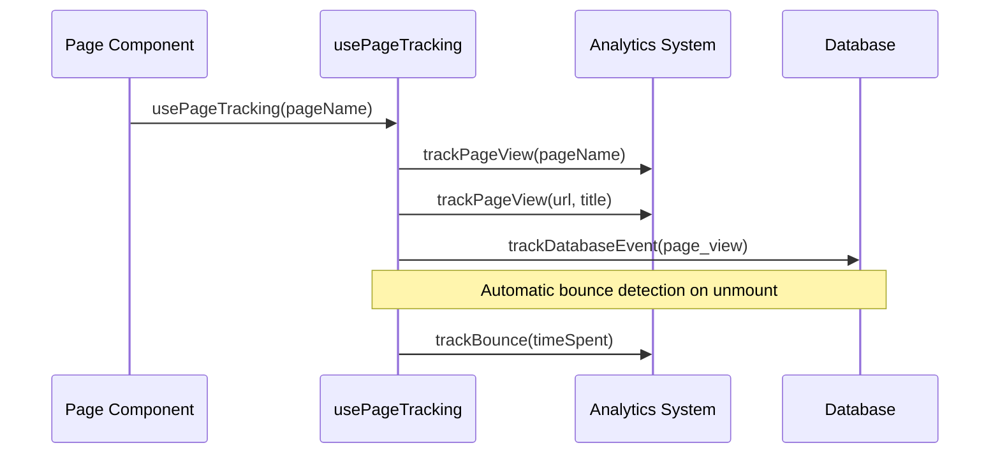
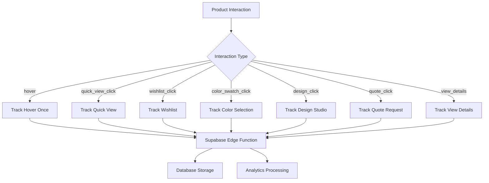
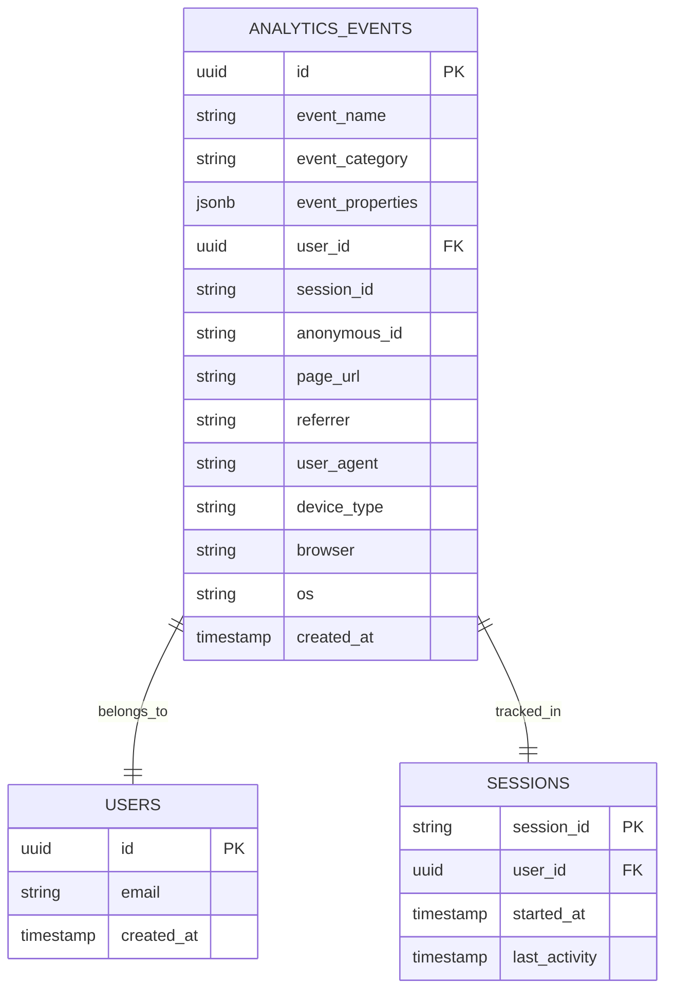
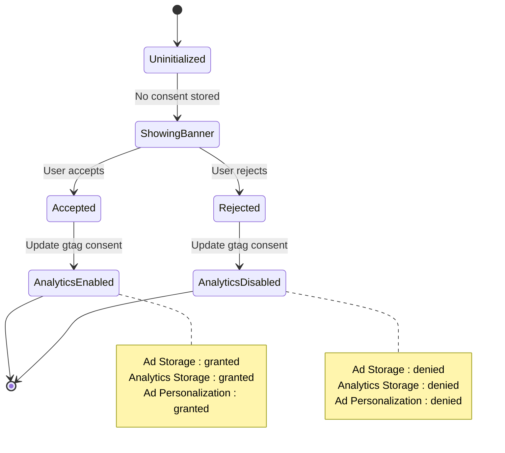
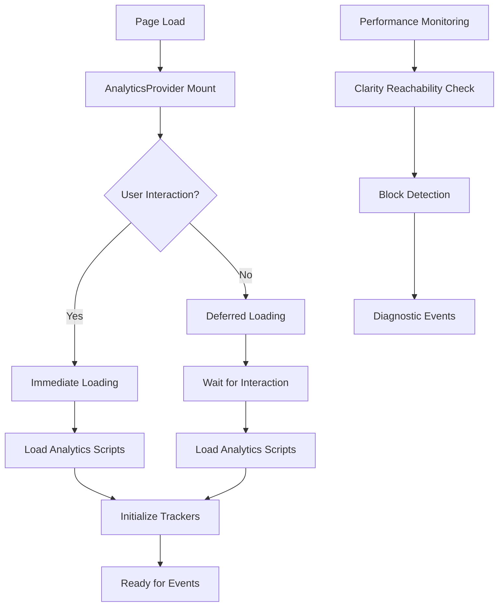

# Analytics Event Propagation

<cite>
**Referenced Files in This Document**
- [analytics.ts](file://src/lib/analytics.ts)
- [AnalyticsProvider.tsx](file://src/components/AnalyticsProvider.tsx)
- [analyticsTracking.ts](file://src/lib/analyticsTracking.ts)
- [clarityCheck.ts](file://src/lib/analytics/clarityCheck.ts)
- [tracker.ts](file://src/lib/analytics/tracker.ts)
- [useProductAnalytics.ts](file://src/hooks/useProductAnalytics.ts)
- [usePageTracking.ts](file://src/hooks/usePageTracking.ts)
- [CookieConsentBanner.tsx](file://src/components/CookieConsentBanner.tsx)
- [App.tsx](file://src/App.tsx)
- [main.tsx](file://src/main.tsx)
- [QuoteForm.tsx](file://src/components/QuoteForm.tsx)
- [Contact.tsx](file://src/pages/Contact.tsx)
- [useQuotes.ts](file://src/hooks/useQuotes.ts)
</cite>

## Table of Contents
1. [Introduction](#introduction)
2. [Architecture Overview](#architecture-overview)
3. [Core Analytics Functions](#core-analytics-functions)
4. [Multi-Platform Tracking Implementation](#multi-platform-tracking-implementation)
5. [Analytics Provider Setup](#analytics-provider-setup)
6. [Event Tracking Hooks](#event-tracking-hooks)
7. [Database Analytics Integration](#database-analytics-integration)
8. [Privacy and Compliance](#privacy-and-compliance)
9. [Adding New Tracking Events](#adding-new-tracking-events)
10. [Performance Optimization](#performance-optimization)
11. [Troubleshooting Guide](#troubleshooting-guide)
12. [Best Practices](#best-practices)

## Introduction

The Sleek App analytics event flow architecture provides comprehensive cross-platform tracking capabilities for user interactions across multiple analytics platforms. The system is built around a centralized analytics library that seamlessly propagates events to Google Analytics 4 (GA4), Google Tag Manager (GTM), Facebook Pixel, LinkedIn Insight Tag, and Microsoft Clarity while maintaining type safety and privacy compliance.

The architecture emphasizes performance-first design with lazy loading, deferred initialization, and automatic platform detection. It provides both programmatic event tracking through TypeScript functions and automatic page view tracking through React hooks.

## Architecture Overview

The analytics system follows a layered architecture with clear separation of concerns:



**Diagram sources**
- [AnalyticsProvider.tsx](file://src/components/AnalyticsProvider.tsx#L16-L256)
- [analytics.ts](file://src/lib/analytics.ts#L17-L183)

**Section sources**
- [AnalyticsProvider.tsx](file://src/components/AnalyticsProvider.tsx#L16-L256)
- [analytics.ts](file://src/lib/analytics.ts#L1-L183)

## Core Analytics Functions

### TrackEvent Function

The `trackEvent` function serves as the foundation for custom event tracking across all platforms:



**Diagram sources**
- [analytics.ts](file://src/lib/analytics.ts#L35-L48)
- [analytics.ts](file://src/lib/analytics.ts#L126-L142)

### PushToDataLayer Function

The `pushToDataLayer` function enables seamless integration with Google Tag Manager:

```typescript
export const pushToDataLayer = (data: Record<string, any>) => {
  if (typeof window !== 'undefined' && window.dataLayer) {
    window.dataLayer.push(data);
  }
};
```

This function provides a standardized way to push events to the GTM data layer, enabling tag manager-based event triggers and advanced analytics configurations.

**Section sources**
- [analytics.ts](file://src/lib/analytics.ts#L17-L22)
- [analytics.ts](file://src/lib/analytics.ts#L35-L48)

## Multi-Platform Tracking Implementation

### Enhanced Business Events

The system provides enhanced business events that automatically propagate across all platforms:



**Diagram sources**
- [analytics.ts](file://src/lib/analytics.ts#L126-L168)

### Platform-Specific Trackers

Each analytics platform has dedicated tracking functions with platform-specific parameters:

| Platform | Tracker Function | Purpose | Parameters |
|----------|------------------|---------|------------|
| Google Analytics 4 | `trackEvent()` | Standard event tracking | action, category, label, value |
| Google Tag Manager | `pushToDataLayer()` | Data layer integration | event data object |
| Facebook Pixel | `trackFacebookPixel()` | Conversion tracking | eventName, params |
| LinkedIn Insight Tag | `trackLinkedInEvent()` | Lead generation | conversionId (optional) |
| Microsoft Clarity | `trackClarityEvent()` | Session recording | eventName |

**Section sources**
- [analytics.ts](file://src/lib/analytics.ts#L100-L123)
- [analytics.ts](file://src/lib/analytics.ts#L126-L168)

## Analytics Provider Setup

### Global Initialization

The `AnalyticsProvider` component serves as the central hub for analytics initialization and configuration:



**Diagram sources**
- [AnalyticsProvider.tsx](file://src/components/AnalyticsProvider.tsx#L16-L256)

### Deferred Loading Strategy

The provider implements sophisticated deferred loading to optimize performance:

1. **Google Analytics 4**: Loads on first user interaction (mousedown, touchstart, scroll, keydown)
2. **Facebook Pixel**: Loads on first mouse/touch interaction
3. **LinkedIn Insight Tag**: Loads on first mouse/touch interaction
4. **Microsoft Clarity**: Checked for reachability after GTM initialization

**Section sources**
- [AnalyticsProvider.tsx](file://src/components/AnalyticsProvider.tsx#L26-L251)

## Event Tracking Hooks

### Page View Tracking

The `usePageTracking` hook automatically tracks page views and bounce rates:



**Diagram sources**
- [usePageTracking.ts](file://src/hooks/usePageTracking.ts#L1-L22)

### Product Analytics Hook

The `useProductAnalytics` hook provides comprehensive product interaction tracking:



**Diagram sources**
- [useProductAnalytics.ts](file://src/hooks/useProductAnalytics.ts#L29-L114)

**Section sources**
- [usePageTracking.ts](file://src/hooks/usePageTracking.ts#L1-L22)
- [useProductAnalytics.ts](file://src/hooks/useProductAnalytics.ts#L29-L114)

## Database Analytics Integration

### Structured Event Tracking

The database analytics system provides persistent event storage with comprehensive metadata:



**Diagram sources**
- [analyticsTracking.ts](file://src/lib/analyticsTracking.ts#L8-L14)

### Automated Data Collection

The system automatically collects comprehensive user data including:

- **Device Information**: Browser, OS, device type detection
- **Session Management**: Anonymous session IDs with persistence
- **User Authentication**: Authenticated user tracking when available
- **Referrer Tracking**: Cross-domain navigation tracking
- **UTM Parameters**: Marketing campaign attribution

**Section sources**
- [analyticsTracking.ts](file://src/lib/analyticsTracking.ts#L16-L149)

## Privacy and Compliance

### Cookie Consent Management

The system implements comprehensive cookie consent management:



**Diagram sources**
- [CookieConsentBanner.tsx](file://src/components/CookieConsentBanner.tsx#L18-L47)

### Privacy Features

1. **GDPR Compliance**: Anonymous session tracking with opt-out capability
2. **CCPA Ready**: Clear consent mechanisms and data deletion support
3. **Data Minimization**: Only essential data collected for analytics
4. **Secure Storage**: All analytics data encrypted and stored securely

**Section sources**
- [CookieConsentBanner.tsx](file://src/components/CookieConsentBanner.tsx#L18-L47)

## Adding New Tracking Events

### Step-by-Step Implementation

To add a new tracking event, follow this process:

1. **Define Event in Analytics Library**:
```typescript
// Add to trackBusinessEvent object
export const trackBusinessEvent = {
  // Existing events...
  
  // New event
  newFeatureUsage: (featureName: string, userId?: string) => {
    trackEvent('new_feature_usage', 'product_usage', featureName);
    pushToDataLayer({
      event: 'new_feature_usage',
      featureName,
      userId,
      category: 'product_usage'
    });
  }
};
```

2. **Add Multi-Platform Tracking**:
```typescript
export const trackMultiPlatformEvent = {
  // Existing events...
  
  // New event
  newFeatureUsage: (featureName: string, userId?: string) => {
    // Google Analytics
    trackBusinessEvent.newFeatureUsage(featureName, userId);
    
    // Facebook Pixel
    trackFacebookPixel('Purchase', {
      content_name: featureName,
      currency: 'USD',
      value: 0
    });
    
    // LinkedIn
    trackLinkedInEvent();
    
    // Clarity
    trackClarityEvent('new_feature_usage');
  }
};
```

3. **Use in Components**:
```typescript
import { trackMultiPlatformEvent } from '@/lib/analytics';

const handleFeatureUsage = () => {
  trackMultiPlatformEvent.newFeatureUsage('advanced_search', userId);
};
```

### Best Practices for Event Naming

- **Action_Category**: Use descriptive action names with categories
- **Consistent Naming**: Maintain naming conventions across platforms
- **Meaningful Labels**: Provide clear, descriptive labels for events
- **Value Parameters**: Include monetary or quantitative values when applicable

## Performance Optimization

### Lazy Loading Strategy

The analytics system implements several performance optimizations:



**Diagram sources**
- [AnalyticsProvider.tsx](file://src/components/AnalyticsProvider.tsx#L26-L251)
- [clarityCheck.ts](file://src/lib/analytics/clarityCheck.ts#L75-L116)

### Optimization Techniques

1. **Deferred Initialization**: Analytics scripts load only on user interaction
2. **Mobile Optimization**: Different timeouts for mobile vs desktop
3. **Clarity Blocking Detection**: Automatic detection and handling of HTTPS inspection
4. **Memory Management**: Proper cleanup of event listeners and timeouts

**Section sources**
- [AnalyticsProvider.tsx](file://src/components/AnalyticsProvider.tsx#L26-L251)
- [clarityCheck.ts](file://src/lib/analytics/clarityCheck.ts#L75-L116)

## Troubleshooting Guide

### Common Issues and Solutions

#### Analytics Not Loading

**Symptoms**: Events not appearing in analytics dashboards

**Causes and Solutions**:
1. **Development Environment**: Analytics may be disabled in development
   - Solution: Check browser console for clarity blocking messages
   - Verify `import.meta.env.DEV` conditions

2. **HTTPS Inspection**: Corporate firewalls blocking Clarity
   - Solution: Check `CLARITY_BLOCKED` flag in window object
   - Review network tab for blocked requests

3. **Cookie Consent**: User rejected analytics cookies
   - Solution: Check `localStorage.cookie-consent` value
   - Verify gtag consent settings

#### Performance Issues

**Symptoms**: Slow page loads or analytics delays

**Solutions**:
1. **Reduce Event Frequency**: Implement debouncing for frequent events
2. **Optimize Event Data**: Minimize payload size for database events
3. **Check Network**: Verify analytics endpoints are reachable

#### Data Quality Issues

**Symptoms**: Inconsistent or missing analytics data

**Solutions**:
1. **Validate Event Names**: Ensure consistent naming across platforms
2. **Check Session IDs**: Verify anonymous session tracking
3. **Review UTM Parameters**: Ensure proper marketing attribution

**Section sources**
- [clarityCheck.ts](file://src/lib/analytics/clarityCheck.ts#L75-L116)
- [CookieConsentBanner.tsx](file://src/components/CookieConsentBanner.tsx#L18-L47)

## Best Practices

### Event Design Guidelines

1. **Atomic Events**: Track individual user actions rather than aggregated events
2. **Descriptive Names**: Use clear, consistent naming conventions
3. **Meaningful Properties**: Include relevant contextual data
4. **Performance Awareness**: Avoid tracking during intensive operations

### Code Organization

1. **Centralized Tracking**: Keep all analytics logic in dedicated files
2. **Type Safety**: Use TypeScript interfaces for event properties
3. **Error Handling**: Implement graceful degradation for analytics failures
4. **Testing**: Mock analytics functions in unit tests

### Privacy Considerations

1. **Data Minimization**: Collect only necessary data
2. **User Control**: Provide clear opt-out mechanisms
3. **Compliance**: Regularly review privacy policies and regulations
4. **Security**: Encrypt sensitive data in transit and at rest

### Monitoring and Maintenance

1. **Event Validation**: Regularly validate event tracking accuracy
2. **Performance Monitoring**: Track analytics impact on page performance
3. **Platform Updates**: Stay current with analytics platform changes
4. **Documentation**: Maintain up-to-date analytics documentation